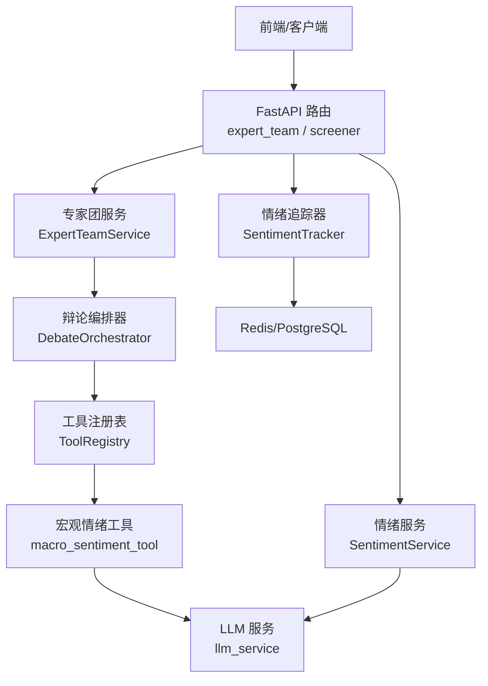
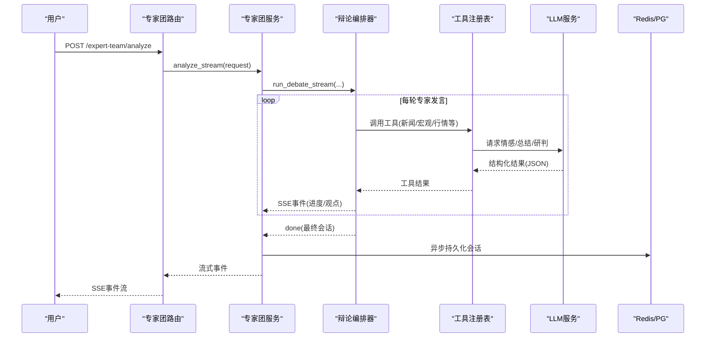
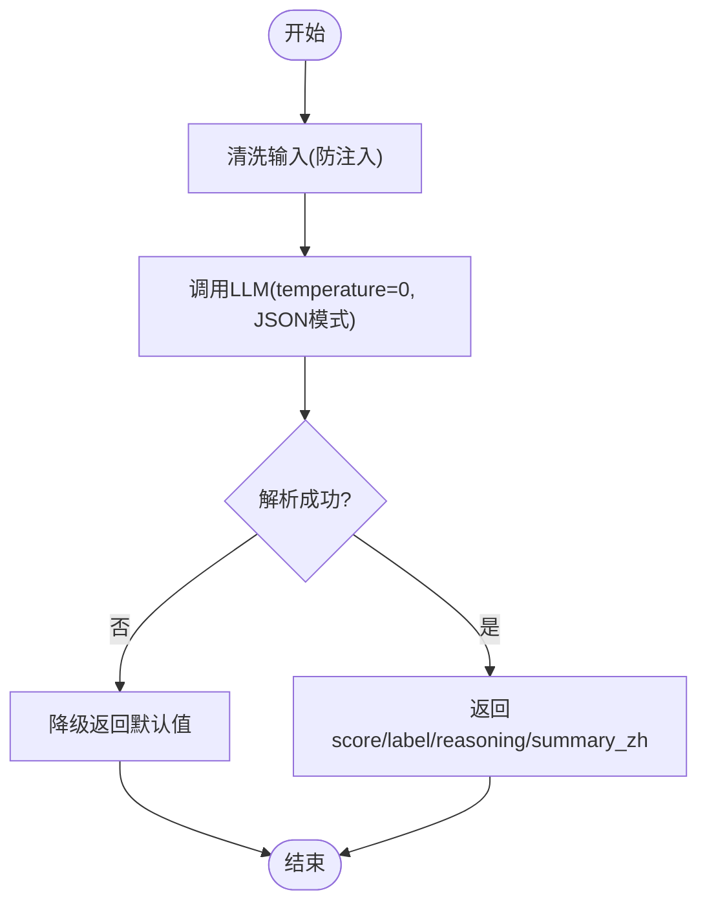
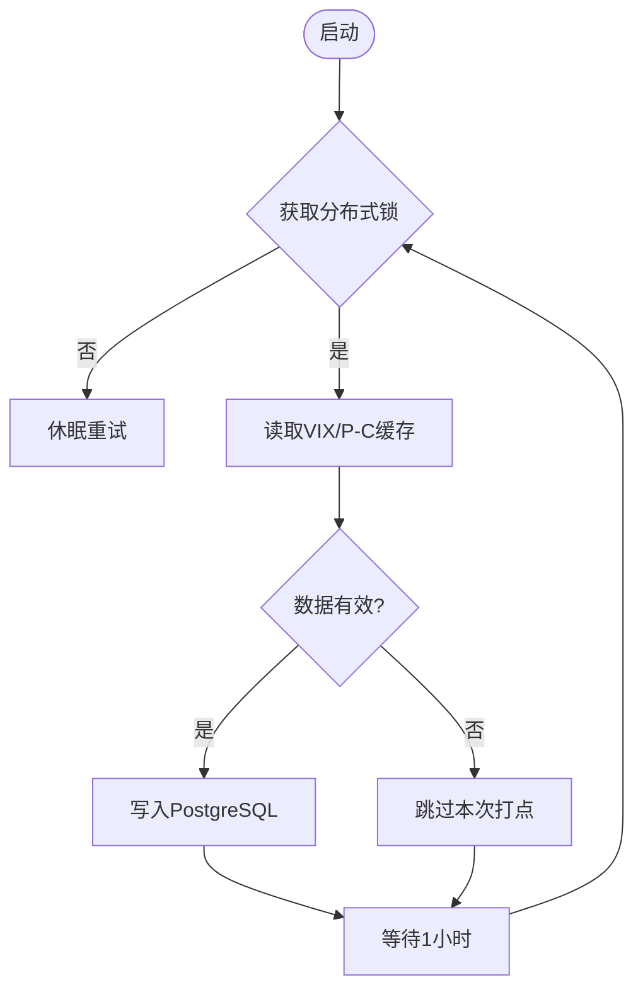
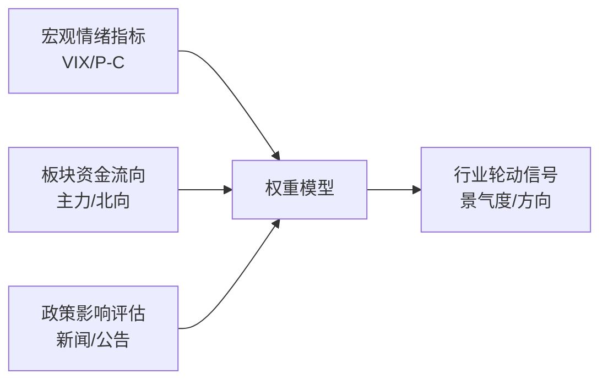
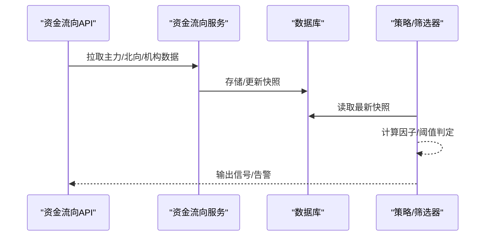
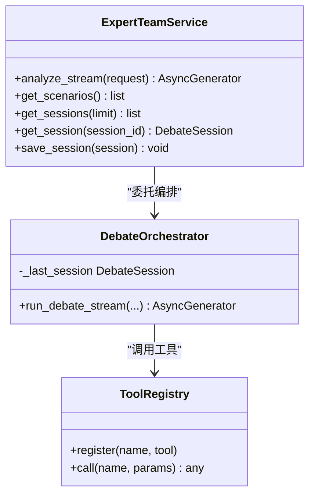
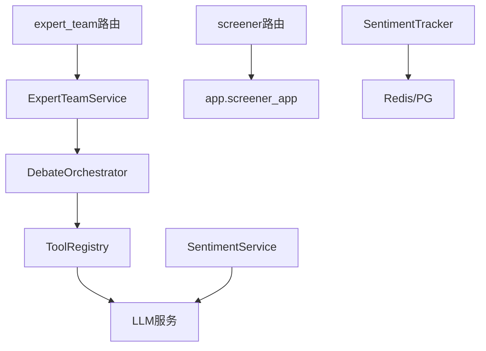

# AI增强选股功能

<cite>
**本文引用的文件**
- [backend/routers/expert_team.py](file://backend/routers/expert_team.py)
- [backend/services/expert_team/expert_team_service.py](file://backend/services/expert_team/expert_team_service.py)
- [backend/services/macro/sentiment_service.py](file://backend/services/macro/sentiment_service.py)
- [backend/services/macro/sentiment_tracker.py](file://backend/services/macro/sentiment_tracker.py)
- [backend/routers/screener.py](file://backend/routers/screener.py)
- [hermes_agent/tools/macro_sentiment_tool.py](file://hermes_agent/tools/macro_sentiment_tool.py)
- [prompts/tasks/sentiment_analysis.md](file://prompts/tasks/sentiment_analysis.md)
</cite>

## 目录
1. [简介](#简介)
2. [项目结构](#项目结构)
3. [核心组件](#核心组件)
4. [架构总览](#架构总览)
5. [详细组件分析](#详细组件分析)
6. [依赖关系分析](#依赖关系分析)
7. [性能考量](#性能考量)
8. [故障排查指南](#故障排查指南)
9. [结论](#结论)
10. [附录](#附录)

## 简介
本文件面向Quant Agent的AI增强选股能力，系统性说明以下关键能力与实现：
- AI驱动的市场情绪分析：新闻情感打分、批量过滤、恐慌指数跟踪等。
- 行业轮动识别思路：宏观指标、板块资金流向、政策影响评估的集成方式。
- 资金流向分析：主力资金追踪、北向资金监控、机构持仓变化的数据接入与应用。
- AI选股建议生成机制：多专家团队协作、观点融合、置信度评估。
- 个性化推荐算法：基于用户历史偏好、风险承受能力与投资目标的定制化输出。
- 可解释性：对推荐逻辑与依据进行透明化呈现，辅助投资决策。

## 项目结构
围绕AI增强选股，后端提供“情绪分析”“专家团协作”“选股器路由”三大入口，配合工具层与提示词工程完成端到端流程。

图表来源
- [backend/routers/expert_team.py:48-77](file://backend/routers/expert_team.py#L48-L77)
- [backend/services/expert_team/expert_team_service.py:37-61](file://backend/services/expert_team/expert_team_service.py#L37-L61)
- [backend/services/macro/sentiment_service.py:27-86](file://backend/services/macro/sentiment_service.py#L27-L86)
- [backend/services/macro/sentiment_tracker.py:11-87](file://backend/services/macro/sentiment_tracker.py#L11-L87)

章节来源
- [backend/routers/expert_team.py:1-104](file://backend/routers/expert_team.py#L1-L104)
- [backend/services/expert_team/expert_team_service.py:1-229](file://backend/services/expert_team/expert_team_service.py#L1-L229)
- [backend/services/macro/sentiment_service.py:1-171](file://backend/services/macro/sentiment_service.py#L1-L171)
- [backend/services/macro/sentiment_tracker.py:1-107](file://backend/services/macro/sentiment_tracker.py#L1-L107)
- [backend/routers/screener.py:87-200](file://backend/routers/screener.py#L87-L200)

## 核心组件
- 专家团（多智能体协作）：通过SSE流式返回辩论过程，支持场景模板、会话持久化（Redis热+PG冷+内存兜底）。
- 情绪分析：对新闻标题/摘要进行结构化情感打分与利多利空提取；批量过滤无价值公告；并发处理控制限流。
- 情绪追踪：定时采集VIX、P/C Ratio等宏观情绪指标，落库形成趋势曲线。
- 选股器路由：对外暴露选股、保存筛选条件、订阅、回测、横截面筛选等接口，作为AI建议的落地执行面。

章节来源
- [backend/routers/expert_team.py:48-104](file://backend/routers/expert_team.py#L48-L104)
- [backend/services/expert_team/expert_team_service.py:31-229](file://backend/services/expert_team/expert_team_service.py#L31-L229)
- [backend/services/macro/sentiment_service.py:8-171](file://backend/services/macro/sentiment_service.py#L8-L171)
- [backend/services/macro/sentiment_tracker.py:10-107](file://backend/services/macro/sentiment_tracker.py#L10-L107)
- [backend/routers/screener.py:87-200](file://backend/routers/screener.py#L87-L200)

## 架构总览
AI增强选股由“数据与情绪”“专家团推理”“选股执行”三层构成：
- 数据与情绪层：从外部数据源获取新闻、宏观指标，经LLM进行情感打分与过滤，并持续记录长期趋势。
- 专家团推理层：根据场景模板组织多专家角色，调用工具拉取数据，进行观点碰撞与融合，输出结构化建议与置信度。
- 选股执行层：将专家建议转化为可执行的选股条件，结合横截面筛选、回测验证与订阅推送，形成闭环。

图表来源
- [backend/routers/expert_team.py:48-77](file://backend/routers/expert_team.py#L48-L77)
- [backend/services/expert_team/expert_team_service.py:37-61](file://backend/services/expert_team/expert_team_service.py#L37-L61)
- [backend/services/macro/sentiment_service.py:27-86](file://backend/services/macro/sentiment_service.py#L27-L86)

## 详细组件分析

### 市场情绪分析（新闻情感与批量过滤）
- 单条新闻情感打分：系统提示词约束输出为JSON字段（分数、标签、理由、中文摘要），温度设为0保证稳定；对输入做净化防止注入。
- 批量过滤：将多条标题统一包裹在XML中，要求返回显著新闻索引，用于提纯后续深度分析。
- 并发处理：使用gather并发处理，设置return_exceptions避免单条失败阻断整体。

图表来源
- [backend/services/macro/sentiment_service.py:27-86](file://backend/services/macro/sentiment_service.py#L27-L86)

章节来源
- [backend/services/macro/sentiment_service.py:27-171](file://backend/services/macro/sentiment_service.py#L27-L171)
- [prompts/tasks/sentiment_analysis.md](file://prompts/tasks/sentiment_analysis.md)

### 宏观情绪追踪（VIX/P-C比率）
- 分布式锁：按小时粒度加锁，避免多实例重复写入。
- 数据源：从Redis缓存读取VIX与CBOE P/C Ratio，兼容新旧键名结构。
- 衍生指标：Credit Spread基于VIX拟合。
- 数据完整性：若关键源缺失则跳过打点，避免污染历史序列。
- 持久化：异步线程写入PostgreSQL，不阻塞网关。

图表来源
- [backend/services/macro/sentiment_tracker.py:11-87](file://backend/services/macro/sentiment_tracker.py#L11-L87)

章节来源
- [backend/services/macro/sentiment_tracker.py:11-107](file://backend/services/macro/sentiment_tracker.py#L11-L107)

### 行业轮动识别（宏观指标、资金流向、政策影响）
- 宏观指标：通过情绪追踪器记录的VIX、P/C Ratio等构建市场风险偏好曲线，作为轮动背景。
- 板块资金流向：通过资金流向服务（如akshare/fund_flow）获取主力与北向资金净流入/流出，识别资金偏好切换。
- 政策影响评估：借助宏观新闻工具与LLM总结，评估政策对特定行业的催化或压制作用。
- 综合判断：将宏观情绪、资金流向、政策信号加权，输出行业景气度评分与轮动方向。

[本节为概念性说明，未直接映射到具体代码文件]

### 资金流向分析（主力、北向、机构持仓）
- 数据来源：通过资金流向服务对接外部数据源，获取个股/板块级别的主力净流入、北向资金、机构持仓变动。
- 解读方法：结合价格与成交量变化，区分趋势性与短期扰动；对异常波动触发预警。
- 应用方式：作为选股因子之一，纳入横截面筛选与回测验证，观察其对收益与回撤的贡献。

[本节为概念性说明，未直接映射到具体代码文件]

### AI选股建议生成（多专家团队、观点融合、置信度）
- 多专家协作：通过专家团路由发起分析，服务层封装编排器，按场景模板调度不同专家角色。
- 工具调用：工具注册表聚合各类数据工具（新闻、宏观、行情、研报等），供专家实时检索。
- 观点融合：编排器汇总各专家意见，生成主报告与概率评估，并通过SSE流式反馈。
- 置信度评估：基于数据质量、模型一致性、历史命中率等维度，给出建议的可信度区间。

图表来源
- [backend/services/expert_team/expert_team_service.py:31-229](file://backend/services/expert_team/expert_team_service.py#L31-L229)

章节来源
- [backend/routers/expert_team.py:48-104](file://backend/routers/expert_team.py#L48-L104)
- [backend/services/expert_team/expert_team_service.py:31-229](file://backend/services/expert_team/expert_team_service.py#L31-L229)

### 个性化推荐算法（偏好、风险、目标）
- 用户画像：收集历史选股偏好、风险承受等级、投资目标（稳健/成长/主题等）。
- 规则与模型：将专家建议与用户画像匹配，采用规则引擎与轻量模型进行排序与过滤。
- 动态调优：根据回测与实盘表现，持续优化权重与阈值，提升推荐契合度。

[本节为概念性说明，未直接映射到具体代码文件]

### 可解释性说明
- 每条建议附带“理由字段”与“置信度”，明确数据来源与推理路径。
- 展示关键因子贡献度（如情绪得分、资金流入、政策催化强度）。
- 提供反事实分析：若某因子变化，建议如何调整。

[本节为概念性说明，未直接映射到具体代码文件]

## 依赖关系分析
- 路由层仅负责HTTP映射与鉴权，业务逻辑下沉至服务层。
- 专家团服务依赖编排器与工具注册表，工具层再依赖LLM服务与外部数据源。
- 情绪服务与追踪器共享Redis缓存与数据库，确保一致性与可观测性。
- 选股器路由提供对外能力，便于将AI建议落地为可执行筛选与回测。

图表来源
- [backend/routers/expert_team.py:48-77](file://backend/routers/expert_team.py#L48-L77)
- [backend/services/expert_team/expert_team_service.py:37-61](file://backend/services/expert_team/expert_team_service.py#L37-L61)
- [backend/services/macro/sentiment_service.py:27-86](file://backend/services/macro/sentiment_service.py#L27-L86)
- [backend/services/macro/sentiment_tracker.py:11-87](file://backend/services/macro/sentiment_tracker.py#L11-L87)
- [backend/routers/screener.py:87-200](file://backend/routers/screener.py#L87-L200)

章节来源
- [backend/routers/expert_team.py:1-104](file://backend/routers/expert_team.py#L1-L104)
- [backend/services/expert_team/expert_team_service.py:1-229](file://backend/services/expert_team/expert_team_service.py#L1-L229)
- [backend/services/macro/sentiment_service.py:1-171](file://backend/services/macro/sentiment_service.py#L1-L171)
- [backend/services/macro/sentiment_tracker.py:1-107](file://backend/services/macro/sentiment_tracker.py#L1-L107)
- [backend/routers/screener.py:1-271](file://backend/routers/screener.py#L1-L271)

## 性能考量
- LLM调用：情绪分析使用轻量模型与temperature=0，降低延迟与成本；批量处理使用并发gather，注意限流与错误隔离。
- 持久化：专家团会话采用Redis热+PG冷双层持久化，读路径优先Redis，写路径异步落库，避免阻塞SSE流。
- 数据完整性：情绪追踪在源数据缺失时主动跳过，避免无效记录污染历史。
- 可扩展性：工具注册表解耦数据源，便于新增/替换外部接口而不影响上层逻辑。

[本节为通用性能建议，未直接分析具体代码片段]

## 故障排查指南
- LLM返回为空或格式错误：检查系统提示词与response_format配置，确认清理Markdown标记后的JSON解析。
- 情绪追踪未写入：确认Redis缓存是否存在VIX/P-C数据，以及分布式锁是否被其他实例占用。
- 专家团SSE中断：检查网络与代理缓冲设置，确认服务端已正确设置Cache-Control与Connection头。
- 选股器接口异常：核对请求参数与DSL语法，必要时先调用翻译接口校验DSL合法性。

章节来源
- [backend/services/macro/sentiment_service.py:27-86](file://backend/services/macro/sentiment_service.py#L27-L86)
- [backend/services/macro/sentiment_tracker.py:11-87](file://backend/services/macro/sentiment_tracker.py#L11-L87)
- [backend/routers/expert_team.py:48-77](file://backend/routers/expert_team.py#L48-L77)
- [backend/routers/screener.py:87-200](file://backend/routers/screener.py#L87-L200)

## 结论
Quant Agent的AI增强选股以“情绪分析—专家团推理—选股执行”为主线，结合宏观指标、资金流向与政策评估，形成可解释、可回测、可迭代的决策闭环。通过SSE流式交互与双层持久化，既保证了实时体验，又确保了数据可追溯。未来可在行业轮动与个性化推荐方面继续深化模型与因子体系，进一步提升实战效果。

## 附录
- 情绪分析提示词参考：[prompts/tasks/sentiment_analysis.md](file://prompts/tasks/sentiment_analysis.md)
- 宏观情绪工具入口：[hermes_agent/tools/macro_sentiment_tool.py](file://hermes_agent/tools/macro_sentiment_tool.py)