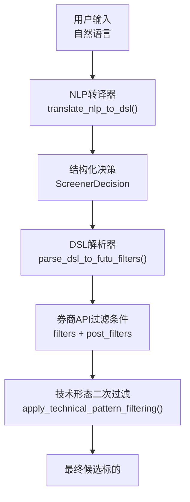
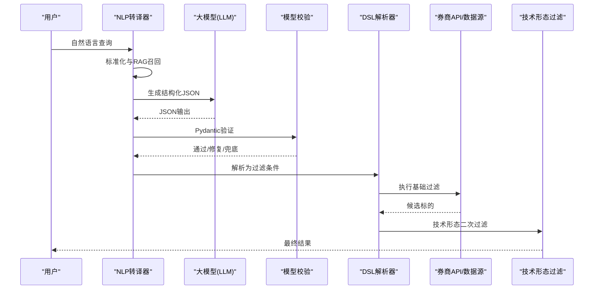
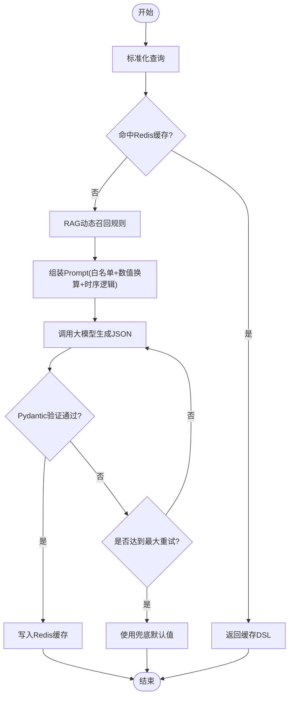
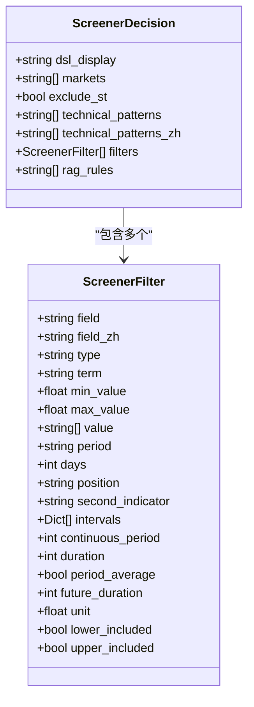
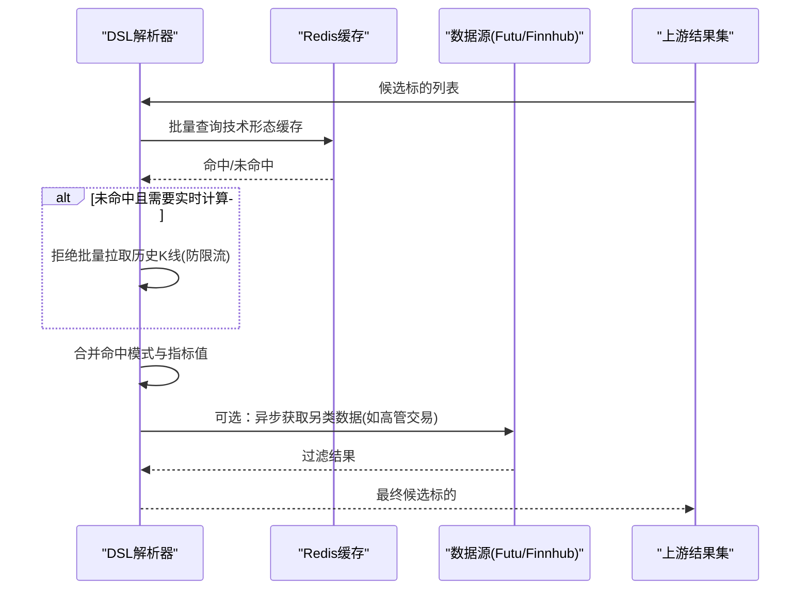
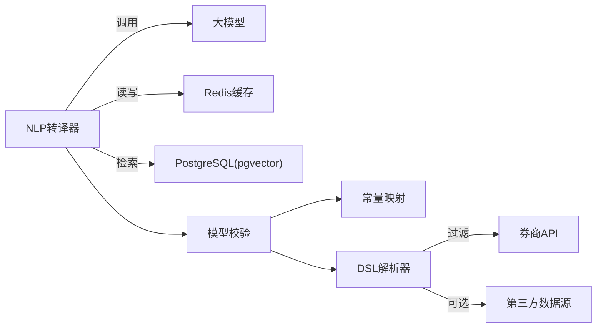

# DSL语法规范

<cite>
**本文引用的文件**
- [backend/services/screener/service.py](file://backend/services/screener/service.py)
- [backend/services/screener/models.py](file://backend/services/screener/models.py)
- [backend/services/screener/constants.py](file://backend/services/screener/constants.py)
- [backend/services/screener/dsl_parser.py](file://backend/services/screener/dsl_parser.py)
- [backend/services/screener/nlp_translator.py](file://backend/services/screener/nlp_translator.py)
- [backend/tests/test_screener_cases.py](file://backend/tests/test_screener_cases.py)
</cite>

## 目录
1. [简介](#简介)
2. [项目结构](#项目结构)
3. [核心组件](#核心组件)
4. [架构总览](#架构总览)
5. [详细组件分析](#详细组件分析)
6. [依赖关系分析](#依赖关系分析)
7. [性能考量](#性能考量)
8. [故障排查指南](#故障排查指南)
9. [结论](#结论)
10. [附录：DSL语法参考手册与示例](#附录dsl语法参考手册与示例)

## 简介
本规范面向Quant Agent选股器DSL，提供一套“自然语言 → 结构化筛选JSON → 底层券商API过滤”的完整语法与执行流程说明。文档覆盖基础比较运算符、逻辑组合方式、内置函数（技术指标/财务指标/市场数据）调用方法、复杂条件组合规则（嵌套、优先级、括号）、字段类型与取值范围、错误提示机制，以及从简单筛选到多因子模型的实战示例，帮助策略开发者以直观易用的查询语言快速构建选股策略。

## 项目结构
选股器DSL相关能力由以下模块协作完成：
- NLP转译：将自然语言转译为强类型的结构化JSON（ScreenerDecision），并注入RAG召回规则。
- 模型校验：Pydantic模型对JSON进行严格校验、模糊纠错、强制类型纠偏、互斥冲突检测等。
- DSL解析：将结构化JSON映射为底层券商API可执行的过滤条件数组，并处理技术形态二次过滤。
- 常量与映射：维护字段白名单、别名映射、中文显示名、技术形态支持列表等。
- 服务编排：串联NLP转译、DSL解析、技术面二次过滤、结果总结等流程。

图表来源
- [backend/services/screener/nlp_translator.py:96-322](file://backend/services/screener/nlp_translator.py#L96-L322)
- [backend/services/screener/models.py:20-219](file://backend/services/screener/models.py#L20-L219)
- [backend/services/screener/dsl_parser.py:16-193](file://backend/services/screener/dsl_parser.py#L16-L193)

章节来源
- [backend/services/screener/service.py:16-480](file://backend/services/screener/service.py#L16-L480)
- [backend/services/screener/nlp_translator.py:96-322](file://backend/services/screener/nlp_translator.py#L96-L322)
- [backend/services/screener/models.py:20-219](file://backend/services/screener/models.py#L20-L219)
- [backend/services/screener/dsl_parser.py:16-193](file://backend/services/screener/dsl_parser.py#L16-L193)

## 核心组件
- NLP转译器（NlpTranslatorMixin）
  - 功能：自然语言标准化、RAG动态召回、LLM生成强类型JSON、Redis语义缓存、失败重试与兜底。
  - 关键点：严格白名单字段映射；百分比统一为小数；财务周期映射；连续增长使用continuous_period；技术形态降级至technical_patterns。
- 模型校验（ScreenerFilter / ScreenerDecision）
  - 功能：字段模糊匹配与别名纠正；强制类型纠偏；非财务指标剔除term；区间上下界互斥检测；中国市场展开；技术形态白名单过滤；自动填充中文显示名。
- DSL解析器（DslParserMixin）
  - 功能：将ScreenerDecision序列化为底层API过滤条件；字段名还原（如VOLUME_MULTIPLE→VOLUME_RATIO）；技术形态二次过滤（含另类数据联邦过滤）。
- 常量与映射（constants）
  - 功能：字段白名单、别名映射、类型强制表、中文显示映射、技术形态支持与正则替换。

章节来源
- [backend/services/screener/nlp_translator.py:21-322](file://backend/services/screener/nlp_translator.py#L21-L322)
- [backend/services/screener/models.py:20-219](file://backend/services/screener/models.py#L20-L219)
- [backend/services/screener/dsl_parser.py:16-193](file://backend/services/screener/dsl_parser.py#L16-L193)
- [backend/services/screener/constants.py:10-315](file://backend/services/screener/constants.py#L10-L315)

## 架构总览
下图展示从自然语言到最终结果的端到端流程，包括RAG检索、LLM生成、模型校验、DSL解析与技术形态二次过滤。

图表来源
- [backend/services/screener/nlp_translator.py:96-322](file://backend/services/screener/nlp_translator.py#L96-L322)
- [backend/services/screener/models.py:20-219](file://backend/services/screener/models.py#L20-L219)
- [backend/services/screener/dsl_parser.py:16-193](file://backend/services/screener/dsl_parser.py#L16-L193)

## 详细组件分析

### NLP转译器（NLP → DSL）
- 输入：自然语言查询（可包含市场、估值、流动性、盈利、利润率、量价、技术形态等描述）
- 处理：
  - 标准化：小写、去标点、合并空格
  - RAG召回：向量检索相关指标规则（支持本地或云端Embedding）
  - LLM生成：按严格白名单与数值换算规则输出JSON
  - 缓存：Redis语义缓存（MD5归一化查询+版本号+抖动TTL）
  - 容错：最大重试次数、自动修复提示、兜底默认值
- 输出：ScreenerDecision JSON（含dsl_display、markets、exclude_st、technical_patterns、filters、rag_rules）

图表来源
- [backend/services/screener/nlp_translator.py:21-322](file://backend/services/screener/nlp_translator.py#L21-L322)

章节来源
- [backend/services/screener/nlp_translator.py:21-322](file://backend/services/screener/nlp_translator.py#L21-L322)

### 模型校验（ScreenerFilter / ScreenerDecision）
- 字段纠错：别名映射、模糊匹配、强制类型纠偏（featured/financial/accumulate/simple）
- 参数清洗：非财务指标剔除term；min/max_value规范化；连续增长自动补min_value>0
- 互斥检测：同一field+term的min与max冲突时报错
- 市场展开：CN/A展开为SH/SZ；未指定市场时默认多市场兜底
- 技术形态：仅保留支持的模式，并填充中文显示名

图表来源
- [backend/services/screener/models.py:20-219](file://backend/services/screener/models.py#L20-L219)

章节来源
- [backend/services/screener/models.py:20-219](file://backend/services/screener/models.py#L20-L219)

### DSL解析器（JSON → 券商API过滤）
- 序列化：by_alias与exclude_none精简输出；移除field_zh避免污染请求
- 字段还原：VOLUME_MULTIPLE→VOLUME_RATIO
- 技术形态二次过滤：
  - 优先读取Redis缓存的技术形态结果
  - 若需拉取历史K线，为防止额度耗尽与限流，直接拒绝批量拉取
  - 纯技术面放行：仅当候选标的满足所有pure_tech_patterns时才保留
  - 另类数据联邦过滤：如insider_net_buy通过第三方数据源异步并行检查

图表来源
- [backend/services/screener/dsl_parser.py:80-193](file://backend/services/screener/dsl_parser.py#L80-L193)

章节来源
- [backend/services/screener/dsl_parser.py:16-193](file://backend/services/screener/dsl_parser.py#L16-L193)

### 常量与映射（字段/类型/形态）
- 字段白名单：涵盖市值、价格、成交量、换手率、涨跌幅、ROE/ROA、利润率、负债比率、历史分位、技术形态等
- 别名映射：PE_PERCENTILE→HIST_PERCENTILE_PE、毛利率→GROSS_PROFIT_RATIO等
- 类型强制：featured/financial/accumulate/simple对应不同字段集合
- 技术形态：macd_gold_cross、rsi_oversold、kdj_gold_cross、vcp_pattern、gap_up、volume_surge_3d、insider_net_buy等

章节来源
- [backend/services/screener/constants.py:10-315](file://backend/services/screener/constants.py#L10-L315)

## 依赖关系分析
- NLP转译器依赖：
  - Redis缓存（语义缓存）
  - LLM服务（生成JSON）
  - RAG向量库（PostgreSQL pgvector或本地SentenceTransformer）
- 模型校验依赖：
  - 常量映射（别名、白名单、类型强制、技术形态）
- DSL解析器依赖：
  - Redis缓存（技术形态结果）
  - 数据源路由（Futu/Finnhub等）
- 服务编排依赖：
  - 上述三者组合，并提供私有规则CRUD与结果总结

图表来源
- [backend/services/screener/nlp_translator.py:96-322](file://backend/services/screener/nlp_translator.py#L96-L322)
- [backend/services/screener/models.py:20-219](file://backend/services/screener/models.py#L20-L219)
- [backend/services/screener/dsl_parser.py:16-193](file://backend/services/screener/dsl_parser.py#L16-L193)
- [backend/services/screener/service.py:16-480](file://backend/services/screener/service.py#L16-L480)

章节来源
- [backend/services/screener/service.py:16-480](file://backend/services/screener/service.py#L16-L480)

## 性能考量
- 语义缓存：NLP查询经标准化后MD5缓存，命中即秒回，降低LLM调用成本
- 向量检索：pgvector余弦距离阈值过滤，限制召回条数，减少LLM上下文长度
- 技术形态缓存：按日维度缓存技术形态结果，避免重复计算
- 防限流保护：拒绝批量拉取历史K线，防止API额度耗尽
- 并发优化：另类数据过滤采用异步gather并行请求

[本节为通用性能建议，不直接分析具体文件]

## 故障排查指南
- Pydantic验证失败：
  - 现象：AI生成的JSON字段类型或格式不匹配
  - 处理：打印错误位置与上下文，转换为人类可读提示（如“第X个条件的「筛选指标」类型或格式不匹配”）
- 字段名幻觉：
  - 现象：LLM虚构字段名
  - 处理：严格白名单拦截，无法对应则忽略该条件
- 数值单位错误：
  - 现象：百分比未转为小数、金额单位未换算
  - 处理：Prompt中强调数值换算规则，模型输出前由系统校验
- 互斥条件冲突：
  - 现象：同一field+term的min>max
  - 处理：抛出明确错误，提示无法匹配任何标的
- 技术形态不支持：
  - 现象：传入unsupported pattern
  - 处理：优雅降级，自动忽略并记录日志

章节来源
- [backend/services/screener/dsl_parser.py:16-79](file://backend/services/screener/dsl_parser.py#L16-L79)
- [backend/services/screener/models.py:51-219](file://backend/services/screener/models.py#L51-L219)
- [backend/services/screener/nlp_translator.py:217-322](file://backend/services/screener/nlp_translator.py#L217-L322)

## 结论
本DSL通过“自然语言→结构化JSON→底层过滤”的分层设计，结合严格的模型校验与常量映射，确保策略表达准确、可执行性强。RAG与缓存机制提升响应速度与稳定性，技术形态二次过滤与另类数据联邦扩展了策略表达能力。整体方案兼顾易用性与工程可靠性，适合快速迭代多因子选股策略。

[本节为总结性内容，不直接分析具体文件]

## 附录：DSL语法参考手册与示例

### 基础比较运算符
- 大于：>
- 小于：<
- 等于：=
- 大于等于：>=
- 小于等于：<=
- 区间：min~max（如pe:10~20）
- 近似：~value（如pe:~10,20表示容错区间）

章节来源
- [backend/tests/test_screener_cases.py:13-143](file://backend/tests/test_screener_cases.py#L13-L143)

### 逻辑运算符（AND/OR/NOT）
- AND：并列多个条件即为AND（如roe:>20 roa:>15）
- OR：通过多次调用或后端聚合实现（当前DSL以AND为主）
- NOT：通过设置max_value或lower_included/upper_included实现否定区间（如change:<-10表示跌幅超过10%）

章节来源
- [backend/tests/test_screener_cases.py:204-280](file://backend/tests/test_screener_cases.py#L204-L280)

### 内置函数与字段类型
- 市场数据（simple/accumulate）：
  - MARKET_CAP（市值）、PRICE（最新价）、AVG_VOLUME（成交量）、AVG_TURNOVER（成交额）、TURNOVER_RATIO（换手率）、PRICE_CHANGE_PCT（涨跌幅）、AMPLITUDE（振幅）
- 财务指标（financial）：
  - ROE、ROA_TTM、GROSS_PROFIT_RATIO、OPERATING_MARGIN_TTM、DEBT_TO_ASSETS、CURRENT_RATIO、QUICK_RATIO、NET_PROFIT、REVENUE等
- 特色指标（featured）：
  - HIST_PERCENTILE_PE/PB/PS（历史分位）
- 技术指标与形态（indicator/indicator_pattern/kline_shape）：
  - MACD金叉/死叉、RSI超买超卖、KDJ金叉、布林带突破、多头/空头排列等
- 其他：
  - STOCK_PLATE（板块）、LISTED_DAYS（上市天数）、DIVIDEND_RATIO（股息率）等

章节来源
- [backend/services/screener/constants.py:57-232](file://backend/services/screener/constants.py#L57-L232)
- [backend/services/screener/nlp_translator.py:135-180](file://backend/services/screener/nlp_translator.py#L135-L180)

### 复杂条件组合规则
- 嵌套表达式：通过filters数组中的多个对象组合实现（如同时限定PE与ROE）
- 优先级：无显式优先级符号，顺序无关；区间用min/max或~表示
- 括号：当前DSL不支持括号，复杂逻辑通过拆分多个filter实现
- 连续增长：使用continuous_period属性（如连续3年增长）
- 长期均值：使用period_average与duration组合（如近5年平均ROE>20%）

章节来源
- [backend/services/screener/nlp_translator.py:182-193](file://backend/services/screener/nlp_translator.py#L182-L193)
- [backend/tests/test_screener_cases.py:281-400](file://backend/tests/test_screener_cases.py#L281-L400)

### 数据类型与取值范围
- 数值类型：
  - 比率/利润率/百分位：必须为小数（如0.15表示15%）
  - 绝对数值：保持原始数值（如PE_TTM=20）
  - 金额单位：必须换算为绝对数字（如100M→1e8）
- 周期：
  - ANNUAL、TTM（部分字段自带_TTM后缀无需term）、LATEST、Q6/Q9等
- 区间边界：
  - lower_included/upper_included控制是否包含边界

章节来源
- [backend/services/screener/nlp_translator.py:159-167](file://backend/services/screener/nlp_translator.py#L159-L167)
- [backend/services/screener/models.py:27-49](file://backend/services/screener/models.py#L27-L49)

### 示例代码（路径引用）
- 简单筛选：
  - 美股市值大于1000亿美元：[test_screener_cases.py:13-19](file://backend/tests/test_screener_cases.py#L13-L19)
  - 港股PE在10到20之间：[test_screener_cases.py:98-102](file://backend/tests/test_screener_cases.py#L98-L102)
- 多因子模型：
  - 高毛利高营业利润：[test_screener_cases.py:385-391](file://backend/tests/test_screener_cases.py#L385-L391)
  - ROE与ROA双优：[test_screener_cases.py:318-324](file://backend/tests/test_screener_cases.py#L318-L324)
- 技术形态：
  - MACD金叉、RSI超卖、VCP形态、跳空高开、连续三天放量：[nlp_translator.py:173-180](file://backend/services/screener/nlp_translator.py#L173-L180)

[本节为示例索引，不直接粘贴代码内容]
