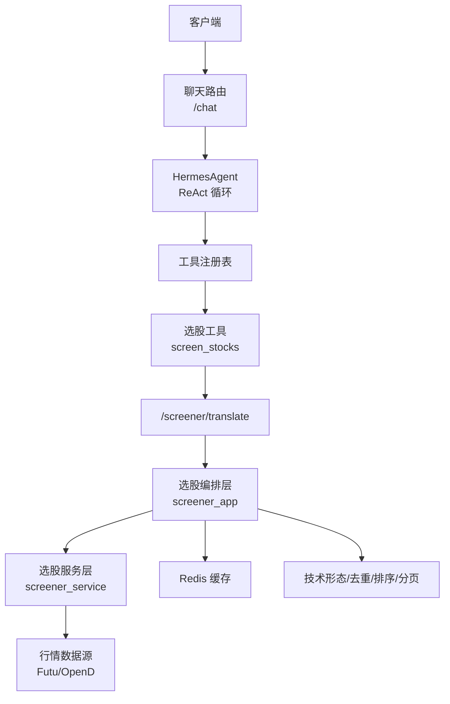
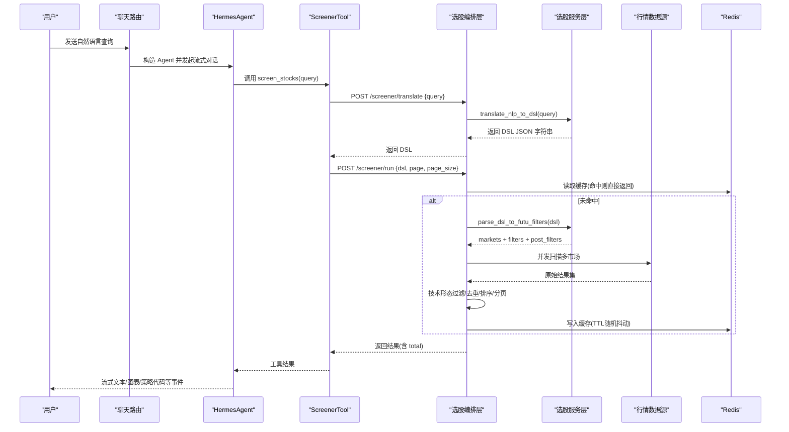
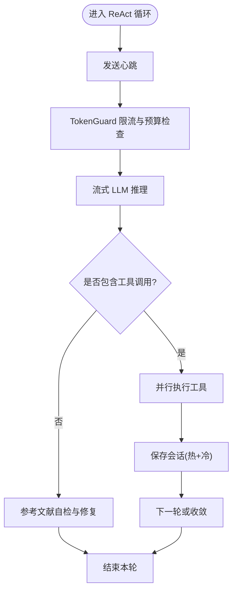
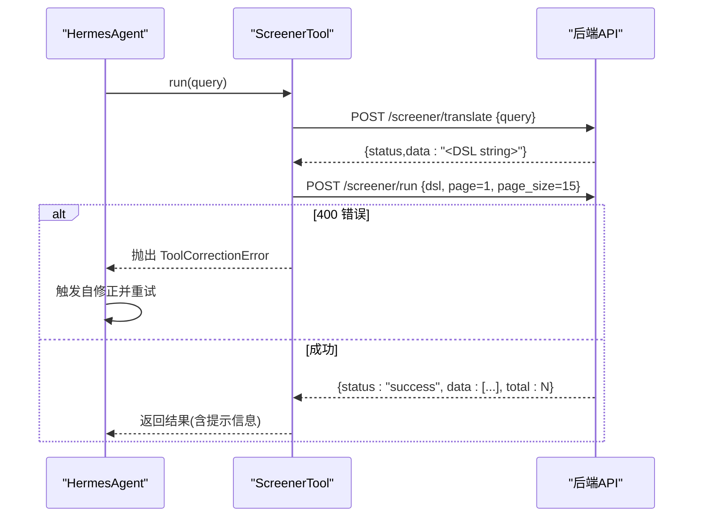
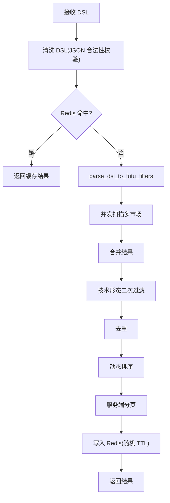
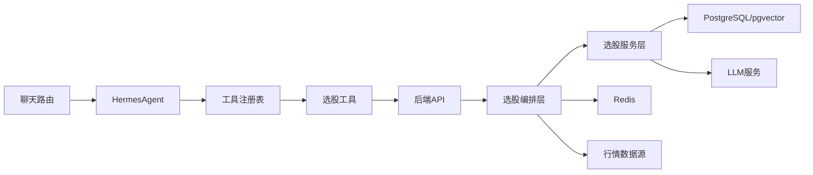

# NLP智能翻译引擎

<cite>
**本文引用的文件**
- [backend/routers/chat.py](file://backend/routers/chat.py)
- [hermes_agent/agent.py](file://hermes_agent/agent.py)
- [hermes_agent/memory_ops.py](file://hermes_agent/memory_ops.py)
- [hermes_agent/tools/screener_tool.py](file://hermes_agent/tools/screener_tool.py)
- [backend/app/screener_app.py](file://backend/app/screener_app.py)
- [backend/services/screener/service.py](file://backend/services/screener/service.py)
- [backend/services/screener/__init__.py](file://backend/services/screener/__init__.py)
</cite>

## 目录
1. [简介](#简介)
2. [项目结构](#项目结构)
3. [核心组件](#核心组件)
4. [架构总览](#架构总览)
5. [详细组件分析](#详细组件分析)
6. [依赖关系分析](#依赖关系分析)
7. [性能考量](#性能考量)
8. [故障排查指南](#故障排查指南)
9. [结论](#结论)
10. [附录：输入输出示例与最佳实践](#附录输入输出示例与最佳实践)

## 简介
本文件面向“Quant Agent NLP智能翻译引擎”，聚焦自然语言到结构化选股查询的端到端转换机制。系统通过大模型驱动的意图识别、实体抽取与领域知识注入，将用户口语化表达（如“找出市盈率低于20的股票”“筛选近期成交量放大的个股”）转译为后端可执行的强类型 DSL，并驱动多市场在线扫盘、结果排序分页、技术形态二次过滤与缓存加速，最终返回可视化友好的标的列表与洞察摘要。同时提供上下文记忆、多轮对话、指代消解与模糊匹配能力，并通过私有规则库与指标词典持续优化翻译准确率。

## 项目结构
NLP智能翻译引擎由前端对话入口、Agent主脑、工具层、选股编排层与服务层构成。关键路径如下：
- 对话入口：FastAPI 路由接收消息，构造 HermesAgent 并流式转发事件
- Agent主脑：维护会话记忆、执行 ReAct 循环、调用工具
- 工具层：ScreenerTool 负责将自然语言转译为 DSL 并执行选股
- 编排层：screener_app 负责 DSL 校验、缓存、并发扫盘、排序分页与技术形态过滤
- 服务层：screener_service 组合 RAG 语料管理、DSL 解析、定时订阅与总结

图表来源
- [backend/routers/chat.py:184-224](file://backend/routers/chat.py#L184-L224)
- [hermes_agent/agent.py:188-496](file://hermes_agent/agent.py#L188-L496)
- [hermes_agent/tools/screener_tool.py:24-71](file://hermes_agent/tools/screener_tool.py#L24-L71)
- [backend/app/screener_app.py:286-463](file://backend/app/screener_app.py#L286-L463)
- [backend/services/screener/service.py:16-480](file://backend/services/screener/service.py#L16-L480)

章节来源
- [backend/routers/chat.py:184-224](file://backend/routers/chat.py#L184-L224)
- [hermes_agent/agent.py:188-496](file://hermes_agent/agent.py#L188-L496)
- [hermes_agent/tools/screener_tool.py:24-71](file://hermes_agent/tools/screener_tool.py#L24-L71)
- [backend/app/screener_app.py:286-463](file://backend/app/screener_app.py#L286-L463)
- [backend/services/screener/service.py:16-480](file://backend/services/screener/service.py#L16-L480)

## 核心组件
- 聊天路由与鉴权：提供 /chat 流式接口，JWT 轻量鉴权，组装 HermesAgent 并转发 NDJSON 事件
- Agent 主脑：统一 ReAct 循环、流式 chunk 拼接、工具调用、心跳保活、熔断恢复、Token 计量与记忆压缩
- 选股工具：封装 translate/run 两步流程，自动纠错重试，错误时抛出自定义异常触发 LLM 自修正
- 选股编排层：DSL 清洗与校验、并发多市场扫盘、技术形态二次过滤、去重、排序、分页、Redis 缓存
- 选股服务层：RAG 语料加载与向量化、私有规则 CRUD、DSL 解析为 Futu 过滤条件、结果总结

章节来源
- [backend/routers/chat.py:21-224](file://backend/routers/chat.py#L21-L224)
- [hermes_agent/agent.py:61-496](file://hermes_agent/agent.py#L61-L496)
- [hermes_agent/tools/screener_tool.py:10-71](file://hermes_agent/tools/screener_tool.py#L10-L71)
- [backend/app/screener_app.py:120-463](file://backend/app/screener_app.py#L120-L463)
- [backend/services/screener/service.py:16-480](file://backend/services/screener/service.py#L16-L480)

## 架构总览
下图展示从自然语言到选股结果的完整链路，包括语义转译、意图识别、实体抽取、DSL 生成与执行、结果后处理与缓存。

图表来源
- [backend/routers/chat.py:184-224](file://backend/routers/chat.py#L184-L224)
- [hermes_agent/agent.py:188-496](file://hermes_agent/agent.py#L188-L496)
- [hermes_agent/tools/screener_tool.py:24-71](file://hermes_agent/tools/screener_tool.py#L24-L71)
- [backend/app/screener_app.py:286-463](file://backend/app/screener_app.py#L286-L463)
- [backend/services/screener/service.py:16-480](file://backend/services/screener/service.py#L16-L480)

## 详细组件分析

### 聊天路由与流式对话
- 功能要点
  - JWT 轻量鉴权：从 Header/Cookie 提取 username 并验证 token
  - 构建 HermesAgent，传入 tool_registry、system_prompt_path、session_id、llm_client、redis_client
  - 流式转发 NDJSON 事件，包含心跳、推理片段、工具开始/结果、错误等
- 错误处理
  - 捕获异常并返回 error 事件，便于前端提示
- 上下文与会话
  - session_id 以 user_{username}_... 形式隔离
  - 历史会话支持搜索、删除、批量清理

章节来源
- [backend/routers/chat.py:21-224](file://backend/routers/chat.py#L21-L224)

### Agent 主脑与 ReAct 循环
- 功能要点
  - 统一 _react_loop：心跳保活、流式 chunk 拼接、工具并行执行、参考文献自愈、熔断恢复
  - Token 计量与限流：每次迭代前进行速率限制与预算护栏，超限触发激进压缩或阻断
  - 记忆管理：会话持久化（Redis 热 + PostgreSQL 冷）、记忆自愈与压缩、知识库事实沉淀
- 关键行为
  - 当检测到遗漏参考文献时，自动追加一轮修复请求
  - 达到最大迭代次数后，强制收敛并给出最终总结
  - 支持策略代码与图表标注检测，推送差异化事件

图表来源
- [hermes_agent/agent.py:188-496](file://hermes_agent/agent.py#L188-L496)
- [hermes_agent/memory_ops.py:44-130](file://hermes_agent/memory_ops.py#L44-L130)
- [hermes_agent/memory_ops.py:261-289](file://hermes_agent/memory_ops.py#L261-L289)

章节来源
- [hermes_agent/agent.py:188-496](file://hermes_agent/agent.py#L188-L496)
- [hermes_agent/memory_ops.py:44-130](file://hermes_agent/memory_ops.py#L44-L130)
- [hermes_agent/memory_ops.py:261-289](file://hermes_agent/memory_ops.py#L261-L289)

### 选股工具与转译执行
- 功能要点
  - 前置翻译：调用 /screener/translate 将自然语言转为 DSL JSON 字符串
  - 执行选股：POST /screener/run 携带 dsl、page、page_size
  - 自修正：当后端返回 400 时抛出 ToolCorrectionError，触发 LLM 重试
- 错误处理
  - 捕获 HTTP 错误并转换为结构化 message
  - 对非法 DSL 或空结果进行明确提示

图表来源
- [hermes_agent/tools/screener_tool.py:24-71](file://hermes_agent/tools/screener_tool.py#L24-L71)

章节来源
- [hermes_agent/tools/screener_tool.py:24-71](file://hermes_agent/tools/screener_tool.py#L24-L71)

### 选股编排层（DSL 校验、缓存、并发扫盘、后处理）
- 功能要点
  - DSL 清洗：去除 Markdown 标记与注释，确保合法 JSON
  - 缓存策略：基于 DSL MD5 的 Redis 缓存，带随机 TTL 防雪崩
  - 并发扫盘：按 markets 并发调用 market_data.screen_stocks
  - 后处理：技术形态过滤、去重、动态排序、服务端分页
  - 错误映射：将 ValueError 映射为 400，其他异常映射为 500
- 性能优化
  - 并发 gather 降低延迟
  - 去重减少重复标的
  - 随机 TTL 避免缓存击穿

图表来源
- [backend/app/screener_app.py:286-463](file://backend/app/screener_app.py#L286-L463)

章节来源
- [backend/app/screener_app.py:286-463](file://backend/app/screener_app.py#L286-L463)

### 选股服务层（RAG 语料、DSL 解析、私有规则、总结）
- 功能要点
  - RAG 语料：内置核心指标 + CSV 扩展 + 向量数据库(pgvector)存储；支持热更新
  - 私有规则：用户上传规则并向量化入库，支持增删查
  - DSL 解析：将 DSL 解析为 Futu 过滤条件（markets、filters、post_filters）
  - 结果总结：取前 10 只标的，并发拉取最新新闻，生成专业洞察报告
- 领域知识注入
  - 指标词典与规则映射，覆盖财务、量价、形态、板块等多维度
  - 支持降级策略（如不支持的字段转为技术形态或另类数据过滤）

章节来源
- [backend/services/screener/service.py:16-480](file://backend/services/screener/service.py#L16-L480)
- [backend/services/screener/__init__.py:1-15](file://backend/services/screener/__init__.py#L1-L15)

## 依赖关系分析
- 组件耦合
  - 聊天路由依赖 Agent 与工具注册表
  - Agent 依赖工具注册表与 LLM 客户端
  - ScreenerTool 依赖后端 API（translate/run）
  - 编排层依赖服务层与行情数据源
  - 服务层依赖向量数据库与 LLM 服务
- 外部依赖
  - Redis：会话记忆、缓存、限流计数
  - PostgreSQL：冷数据会话、私有规则向量存储
  - LLM：DeepSeek/OpenAI 兼容接口
  - 行情数据源：Futu OpenD 等

图表来源
- [backend/routers/chat.py:184-224](file://backend/routers/chat.py#L184-L224)
- [hermes_agent/agent.py:188-496](file://hermes_agent/agent.py#L188-L496)
- [hermes_agent/tools/screener_tool.py:24-71](file://hermes_agent/tools/screener_tool.py#L24-L71)
- [backend/app/screener_app.py:286-463](file://backend/app/screener_app.py#L286-L463)
- [backend/services/screener/service.py:16-480](file://backend/services/screener/service.py#L16-L480)

章节来源
- [backend/routers/chat.py:184-224](file://backend/routers/chat.py#L184-L224)
- [hermes_agent/agent.py:188-496](file://hermes_agent/agent.py#L188-L496)
- [hermes_agent/tools/screener_tool.py:24-71](file://hermes_agent/tools/screener_tool.py#L24-L71)
- [backend/app/screener_app.py:286-463](file://backend/app/screener_app.py#L286-L463)
- [backend/services/screener/service.py:16-480](file://backend/services/screener/service.py#L16-L480)

## 性能考量
- 并发与缓存
  - 多市场并发扫盘显著降低端到端延迟
  - Redis 缓存 DSL 结果，随机 TTL 防止雪崩
- 内存与 Token 控制
  - 记忆压缩与滑动窗口避免上下文溢出
  - TokenGuard 限流与预算护栏，超限触发激进压缩或阻断
- 稳定性
  - 熔断恢复：达到最大迭代次数后强制收敛
  - 错误映射：400/500 清晰区分参数错误与系统错误

[本节为通用性能指导，不直接分析具体文件]

## 故障排查指南
- 常见问题定位
  - 转译失败：检查 /screener/translate 返回状态码与 detail
  - DSL 格式错误：查看编排层的 JSON 校验与清洗日志
  - 数据源未连接：当 Futu OpenD 未连接时返回 503，需检查连接状态
  - 缓存异常：关注 Redis 读写失败的警告日志
- 建议操作
  - 使用 /screener/reload_indicators 热更新指标词库
  - 通过 /sessions 与 /sessions/{session_id} 检查历史会话与消息
  - 在工具层捕获 400 错误并触发自修正，必要时调整 query 表达

章节来源
- [backend/app/screener_app.py:380-463](file://backend/app/screener_app.py#L380-L463)
- [backend/routers/chat.py:230-384](file://backend/routers/chat.py#L230-L384)
- [hermes_agent/tools/screener_tool.py:24-71](file://hermes_agent/tools/screener_tool.py#L24-L71)

## 结论
本 NLP 智能翻译引擎通过“大模型 + 领域知识 + 工具链”的组合，实现了从自然语言到结构化选股查询的高精度转译。系统具备上下文记忆、多轮对话、自修正与缓存加速等能力，能够在复杂金融场景下快速响应用户需求。通过持续扩充 RAG 语料与私有规则，翻译准确率与鲁棒性将持续提升。

[本节为总结性内容，不直接分析具体文件]

## 附录：输入输出示例与最佳实践

### 支持的查询模式与解析过程
- “找出市盈率低于20的股票”
  - 意图：基本面筛选（PE < 20）
  - 实体：指标“市盈率”，阈值“20”
  - 转译：DSL 中 financial 类型 filter，field 映射为 PE 相关字段，min/max 设置阈值
  - 执行：并发扫盘 A 股/港股/美股（根据市场指定），技术形态过滤可选
- “筛选近期成交量放大的个股”
  - 意图：量价形态筛选（放量）
  - 实体：指标“成交量放大”，时间窗口“近期”
  - 转译：DSL 中 simple/accumulate 类型 filter，映射为 VOLUME_MULTIPLE，或降级为 technical_patterns（如 volume_surge_3d）
  - 执行：结合市场过滤与技术形态二次过滤，去重与排序后返回

### 上下文理解与多轮对话
- 历史查询记忆：通过 Redis 热存与 PostgreSQL 冷存实现会话持久化
- 指代消解：Agent 在 ReAct 循环中维护 messages 上下文，结合工具结果进行上下文补全
- 模糊匹配：RAG 语料与私有规则库提供同义词扩展与领域术语映射，提升转译鲁棒性

### 翻译准确率优化策略
- 同义词扩展：CSV 指标词典与内置规则覆盖常见表达
- 金融术语词典：财务、量价、形态、板块等多维度映射
- 领域知识注入：私有规则向量化入库，支持用户自定义与热更新
- 自修正机制：400 错误触发 LLM 重试，逐步收敛至正确 DSL

### 错误处理与用户反馈
- 错误分类：400 参数错误（DSL 非法/转译失败），500 系统错误（数据源不可用/执行异常）
- 用户反馈：前端接收 error 事件并提示，支持重新编辑 query 或选择灵感提示
- 诊断工具：/sessions 查看历史消息，/screener/reload_indicators 刷新词库

### 输入输出示例（示意）
- 输入
  - 自然语言：“找出市盈率低于20且近期成交量放大的股票”
- 中间产物
  - DSL JSON 字符串（由 translate 返回）
- 输出
  - 标的列表（symbol/name/mktcap/price/chg/rsi 等字段）
  - total：符合条件的标的总数
  - 可选：AI 洞察报告（summarize_results）

[本节为概念性说明，不直接引用具体代码行]