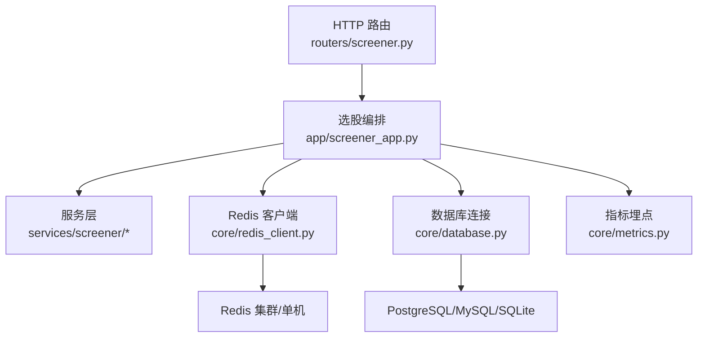
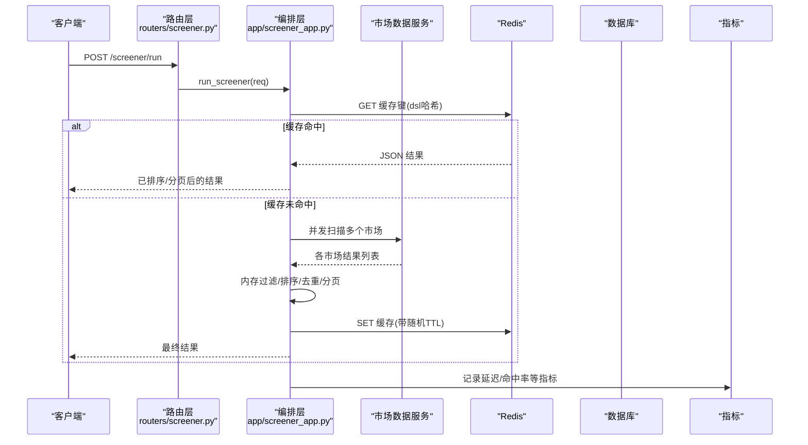
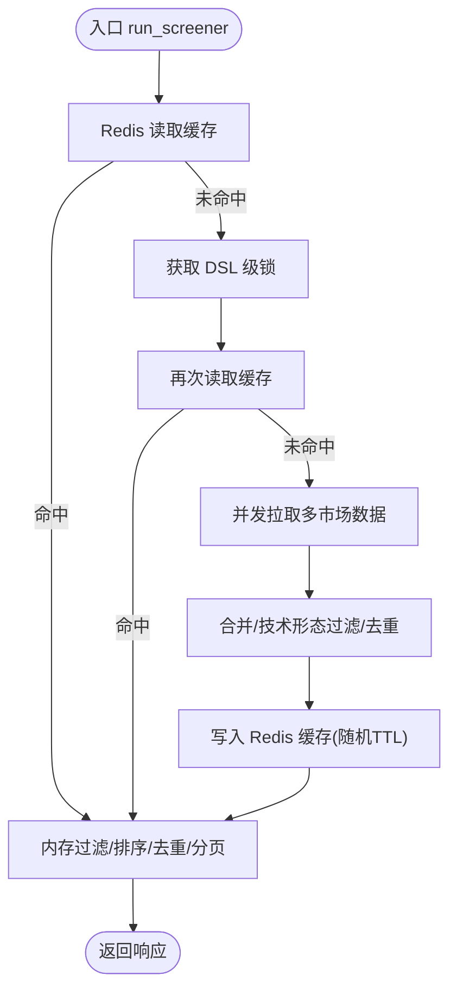
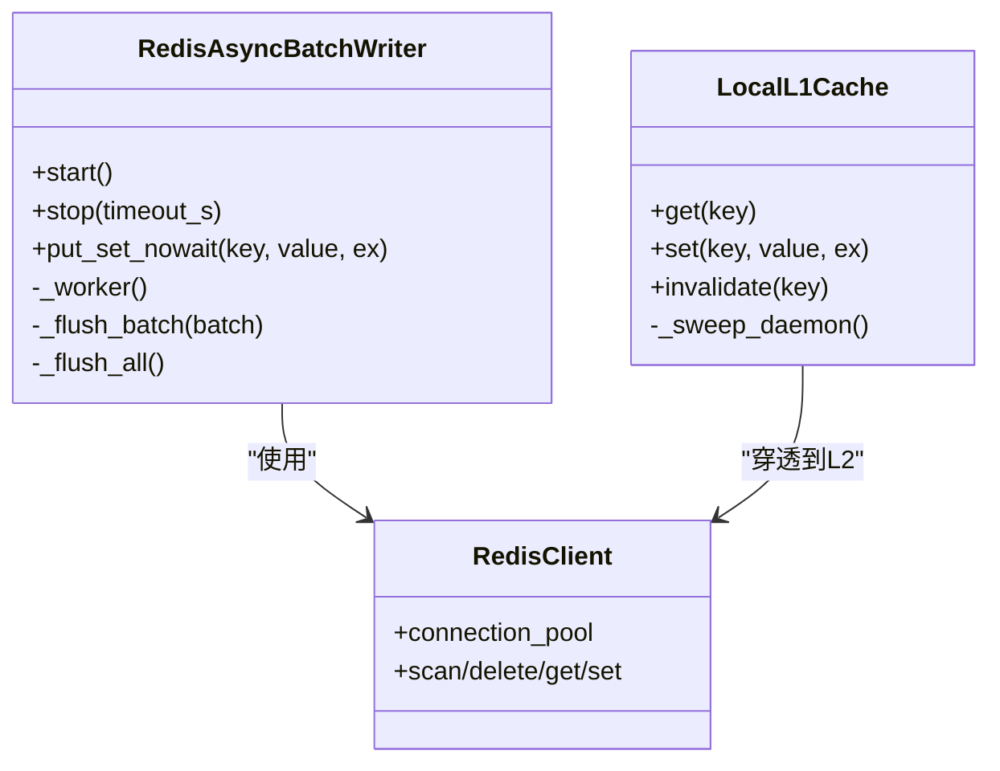
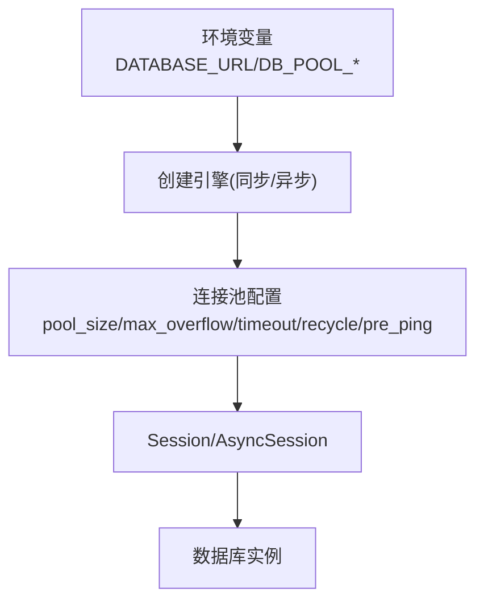
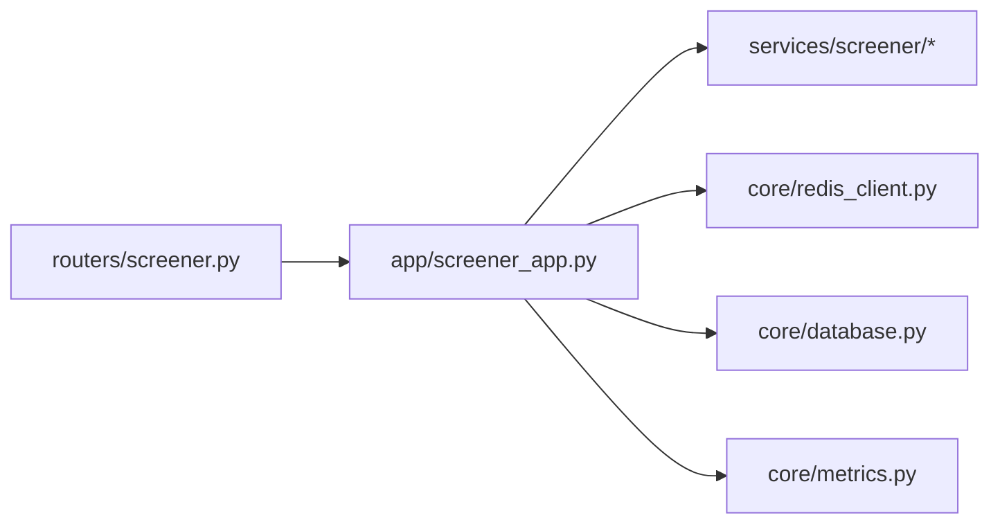

# 性能优化与缓存

<cite>
**本文引用的文件**
- [backend/app/screener_app.py](file://backend/app/screener_app.py)
- [backend/routers/screener.py](file://backend/routers/screener.py)
- [backend/services/screener/screener_service.py](file://backend/services/screener/screener_service.py)
- [backend/core/redis_client.py](file://backend/core/redis_client.py)
- [backend/core/cache_manager.py](file://backend/core/cache_manager.py)
- [backend/core/database.py](file://backend/core/database.py)
- [backend/core/metrics.py](file://backend/core/metrics.py)
</cite>

## 目录
1. [简介](#简介)
2. [项目结构](#项目结构)
3. [核心组件](#核心组件)
4. [架构总览](#架构总览)
5. [详细组件分析](#详细组件分析)
6. [依赖关系分析](#依赖关系分析)
7. [性能考量](#性能考量)
8. [故障排查指南](#故障排查指南)
9. [结论](#结论)
10. [附录](#附录)

## 简介
本文件面向 Quant Agent 选股器的性能优化，围绕查询优化、缓存机制、并行计算、大数据量处理、监控诊断与调优实践展开。重点覆盖：
- SQL 与数据库连接池、异步会话配置
- Redis 缓存策略（L1/L2）、批量写入队列、缓存清理与一致性
- 并发扫盘与异步任务调度
- 流式/增量与内存优化思路
- Prometheus 指标采集与慢查询/瓶颈定位
- 基准测试与扩容建议

## 项目结构
与选股器性能相关的关键路径：
- HTTP 边界层：路由仅做参数校验与依赖注入，业务编排下沉至 app 层
- 选股编排层：DSL 解析、多市场并发扫盘、内存排序/过滤/分页、Redis 缓存读写
- 数据访问层：SQLAlchemy 同步/异步引擎与连接池配置
- 缓存层：Redis 客户端、进程内 L1 缓存、异步批量写入器、统一缓存清理工具
- 可观测性：Prometheus 指标定义（行情延迟、K线缓存命中、Redis 操作延迟等）

**图示来源**
- [backend/routers/screener.py:87-200](file://backend/routers/screener.py#L87-L200)
- [backend/app/screener_app.py:295-463](file://backend/app/screener_app.py#L295-L463)
- [backend/core/redis_client.py:1-252](file://backend/core/redis_client.py#L1-L252)
- [backend/core/database.py:1-67](file://backend/core/database.py#L1-L67)
- [backend/core/metrics.py:1-641](file://backend/core/metrics.py#L1-L641)

**章节来源**
- [backend/routers/screener.py:1-271](file://backend/routers/screener.py#L1-L271)
- [backend/app/screener_app.py:1-873](file://backend/app/screener_app.py#L1-L873)

## 核心组件
- 选股编排（run_screener）：DSL 清洗与校验、多市场并发扫盘、内存二次过滤与排序、服务端分页、结果去重、Redis 缓存写入与读取、锁防抖
- Redis 基础设施：连接池、异步批量写入器（Pipeline 聚合写）、进程内 L1 缓存（短 TTL、容量保护与后台清扫）
- 数据库连接：同步/异步引擎、连接池大小/溢出/超时/回收、PrePing 保活
- 指标体系：行情延迟、K线缓存命中、Redis 操作延迟、WebSocket 连接数、数据源可用性/限流/拨测等

**章节来源**
- [backend/app/screener_app.py:295-463](file://backend/app/screener_app.py#L295-L463)
- [backend/core/redis_client.py:1-252](file://backend/core/redis_client.py#L1-L252)
- [backend/core/database.py:1-67](file://backend/core/database.py#L1-L67)
- [backend/core/metrics.py:1-641](file://backend/core/metrics.py#L1-L641)

## 架构总览
选股请求从 HTTP 进入，路由层透传到编排层；编排层先查 Redis 缓存，未命中则并发调用下游数据源进行多市场扫盘，合并结果后进行内存过滤、排序、去重与服务端分页，最终回写缓存并返回。全链路通过指标埋点暴露关键性能信号。

**图示来源**
- [backend/routers/screener.py:97-101](file://backend/routers/screener.py#L97-L101)
- [backend/app/screener_app.py:295-463](file://backend/app/screener_app.py#L295-L463)
- [backend/core/metrics.py:24-47](file://backend/core/metrics.py#L24-L47)

## 详细组件分析

### 选股编排与查询优化（run_screener）
- DSL 清洗与校验：去除 Markdown/注释，确保 JSON 合法
- 多市场并发：使用 gather 并发拉取多个市场数据，降低端到端延迟
- 内存二次过滤：支持表头区间过滤与技术形态过滤，减少网络与下游压力
- 排序与排名：按字段动态排序，重新计算 rank
- 服务端分页：page/page_size 切片，避免大结果集传输
- 缓存策略：基于 DSL 哈希的 Redis 缓存，带随机 TTL 防雪崩；读前/加锁后双重检查
- 错误处理：数据源未连接或格式异常时返回明确状态码

**图示来源**
- [backend/app/screener_app.py:295-463](file://backend/app/screener_app.py#L295-L463)

**章节来源**
- [backend/app/screener_app.py:295-463](file://backend/app/screener_app.py#L295-L463)

### Redis 缓存与一致性
- 连接池：统一连接池上限，避免无界增长
- 异步批量写入：队列+定时/批量触发 Pipeline 写入，降低 RTT 与带宽占用
- 进程内 L1 缓存：短 TTL 本地字典，自动过期清理与容量熔断，穿透到 L2（Redis）
- 缓存清理：按前缀扫描删除，受保护前缀（交易态）强制跳过，防止误删
- 一致性：写路径先落 Redis，再更新 L1；读路径优先 L1，未命中再查 L2

**图示来源**
- [backend/core/redis_client.py:46-177](file://backend/core/redis_client.py#L46-L177)
- [backend/core/redis_client.py:184-251](file://backend/core/redis_client.py#L184-L251)
- [backend/core/cache_manager.py:19-74](file://backend/core/cache_manager.py#L19-L74)

**章节来源**
- [backend/core/redis_client.py:1-252](file://backend/core/redis_client.py#L1-L252)
- [backend/core/cache_manager.py:1-75](file://backend/core/cache_manager.py#L1-L75)

### 数据库与连接池
- 同步引擎：适用于常规 ORM 场景，连接池大小、溢出、超时、回收与 PrePing 保活
- 异步引擎：高并发场景下使用 AsyncSession，复用相同池化参数
- URL 转换：根据环境自动切换驱动（sqlite+aiosqlite/postgresql+asyncpg）

**图示来源**
- [backend/core/database.py:1-67](file://backend/core/database.py#L1-L67)

**章节来源**
- [backend/core/database.py:1-67](file://backend/core/database.py#L1-L67)

### 指标与可观测性
- 行情延迟与新鲜度：Summary/Gauge 刻画端到端延迟与数据时效
- K线缓存命中：Counter/Histogram 统计命中层级与查询延迟
- Redis 操作延迟与错误：Operation 维度观察热点与异常
- WebSocket 连接与消息：活跃连接、发送量、丢弃量、订阅数
- 数据源可用性与限流：可用性 Gauge、限流 Counter、拨测成功率/延迟
- 进程线程水位：主服务线程数与告警阈值

**章节来源**
- [backend/core/metrics.py:24-149](file://backend/core/metrics.py#L24-L149)
- [backend/core/metrics.py:155-217](file://backend/core/metrics.py#L155-L217)
- [backend/core/metrics.py:286-301](file://backend/core/metrics.py#L286-L301)
- [backend/core/metrics.py:595-619](file://backend/core/metrics.py#L595-L619)

## 依赖关系分析
- 路由层对编排层的薄依赖，便于单测替换与隔离
- 编排层依赖市场数据服务、Redis、数据库与指标模块
- Redis 层提供连接池、批量写入与 L1 缓存，屏蔽底层网络抖动
- 指标模块为全局可观测性基础，贯穿各层

**图示来源**
- [backend/routers/screener.py:1-271](file://backend/routers/screener.py#L1-L271)
- [backend/app/screener_app.py:1-873](file://backend/app/screener_app.py#L1-L873)
- [backend/core/redis_client.py:1-252](file://backend/core/redis_client.py#L1-L252)
- [backend/core/database.py:1-67](file://backend/core/database.py#L1-L67)
- [backend/core/metrics.py:1-641](file://backend/core/metrics.py#L1-L641)

**章节来源**
- [backend/routers/screener.py:1-271](file://backend/routers/screener.py#L1-L271)
- [backend/app/screener_app.py:1-873](file://backend/app/screener_app.py#L1-L873)

## 性能考量
- 查询优化
  - 多市场并发扫盘：用 gather 并行拉取，显著降低端到端延迟
  - 内存二次过滤：在应用层完成复杂条件过滤，减少下游负载
  - 服务端分页：避免一次性返回超大结果集，降低网络与序列化开销
- 缓存机制
  - 双层缓存：L1 内存短 TTL + L2 Redis，命中路径极快
  - 批量写入：队列+Pipeline 聚合写，降低 RTT 与带宽占用
  - 安全清理：按前缀扫描删除，受保护前缀不触碰，避免误删交易态数据
- 并行与资源
  - 连接池上限：Redis 连接池与数据库连接池均配置上限，防止资源耗尽
  - 优雅停机：批量写入器支持超时等待与强制刷新，保障数据不丢失
- 大数据量处理
  - 流式/增量：结合 Redis Stream/List 队列深度指标，评估积压与消费能力
  - 内存优化：L1 容量保护与后台清扫，避免冷门 Key 堆积导致内存泄漏
- 监控与诊断
  - 关键指标：行情延迟、K线缓存命中、Redis 操作延迟、WebSocket 连接/消息、数据源可用性/限流
  - 慢查询定位：通过 Summary/Histogram 分位与标签维度定位瓶颈
  - 线程水位：进程线程数监控与告警阈值，避免线程耗尽

[本节为通用指导，无需特定文件引用]

## 故障排查指南
- 缓存相关问题
  - 现象：频繁缓存失效或命中率低
  - 排查：检查 TTL 设置、随机抖动是否生效；确认写路径是否先写 Redis 再更新 L1
  - 参考：缓存写入与读取逻辑、L1 容量保护与清扫
- 并发与锁
  - 现象：重复执行同一 DSL 或雪崩
  - 排查：确认 DSL 级锁是否生效；观察 Redis 写入队列深度与 Pipeline 失败日志
- 数据库连接
  - 现象：连接池耗尽或超时
  - 排查：调整 pool_size/max_overflow/timeout；检查 PrePing 与连接回收
- 指标与告警
  - 关注：行情延迟、K线缓存命中、Redis 操作延迟、WebSocket 连接数、数据源可用性/限流、进程线程数
  - 动作：根据指标趋势调整批大小、TTL、连接池与并发度

**章节来源**
- [backend/app/screener_app.py:295-463](file://backend/app/screener_app.py#L295-L463)
- [backend/core/redis_client.py:46-177](file://backend/core/redis_client.py#L46-L177)
- [backend/core/redis_client.py:184-251](file://backend/core/redis_client.py#L184-L251)
- [backend/core/database.py:1-67](file://backend/core/database.py#L1-L67)
- [backend/core/metrics.py:24-149](file://backend/core/metrics.py#L24-L149)
- [backend/core/metrics.py:155-217](file://backend/core/metrics.py#L155-L217)
- [backend/core/metrics.py:286-301](file://backend/core/metrics.py#L286-L301)
- [backend/core/metrics.py:595-619](file://backend/core/metrics.py#L595-L619)

## 结论
Quant Agent 选股器通过“并发扫盘 + 双层缓存 + 连接池化 + 全面指标”的组合，实现了在高并发与大数据量场景下的稳定高效运行。建议在后续迭代中持续：
- 依据指标优化批大小、TTL、连接池与并发度
- 完善慢查询与瓶颈识别流程
- 强化缓存一致性与降级策略
- 保持优雅停机与数据不丢失的底线

[本节为总结性内容，无需特定文件引用]

## 附录
- 关键实现路径
  - 路由层：[backend/routers/screener.py](file://backend/routers/screener.py)
  - 编排层：[backend/app/screener_app.py](file://backend/app/screener_app.py)
  - 服务层兼容：[backend/services/screener/screener_service.py](file://backend/services/screener/screener_service.py)
  - Redis 客户端与缓存：[backend/core/redis_client.py](file://backend/core/redis_client.py)
  - 缓存清理工具：[backend/core/cache_manager.py](file://backend/core/cache_manager.py)
  - 数据库连接：[backend/core/database.py](file://backend/core/database.py)
  - 指标定义：[backend/core/metrics.py](file://backend/core/metrics.py)

[本节为索引性内容，无需特定文件引用]
