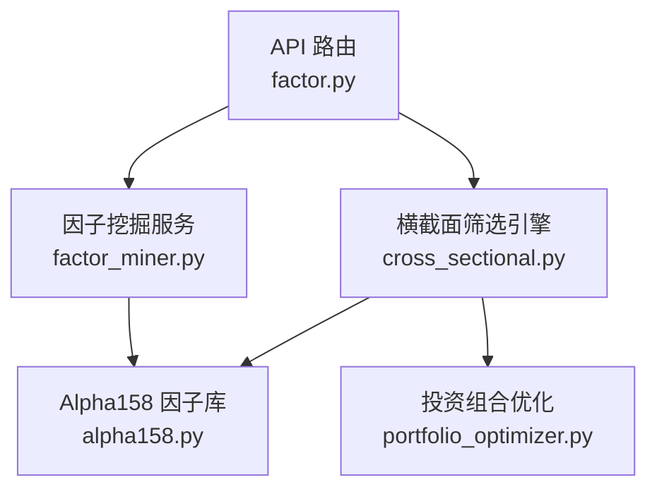
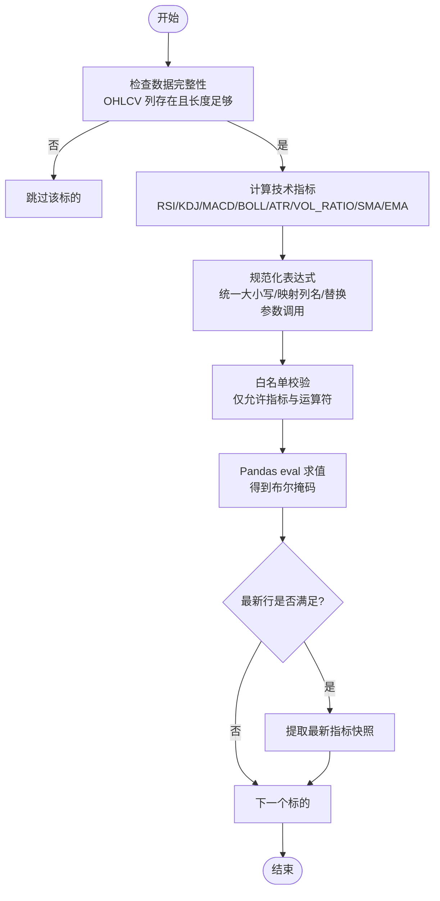
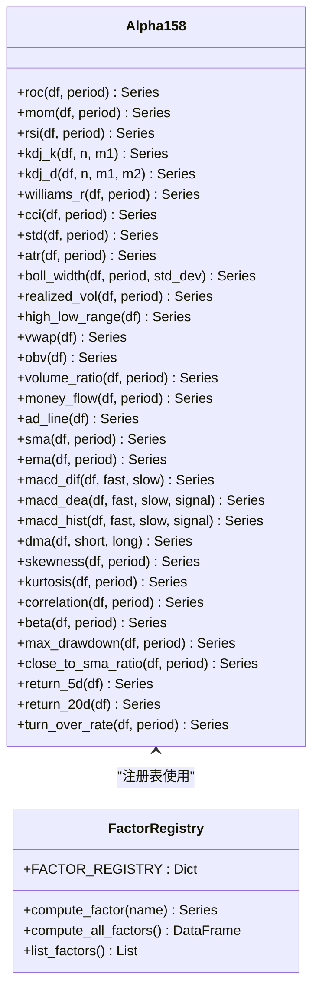
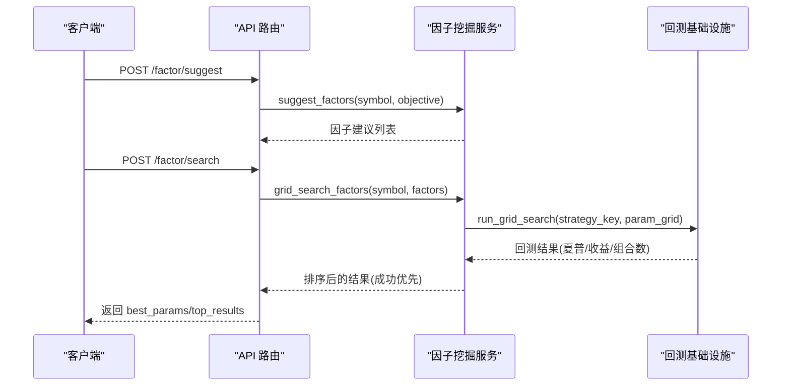
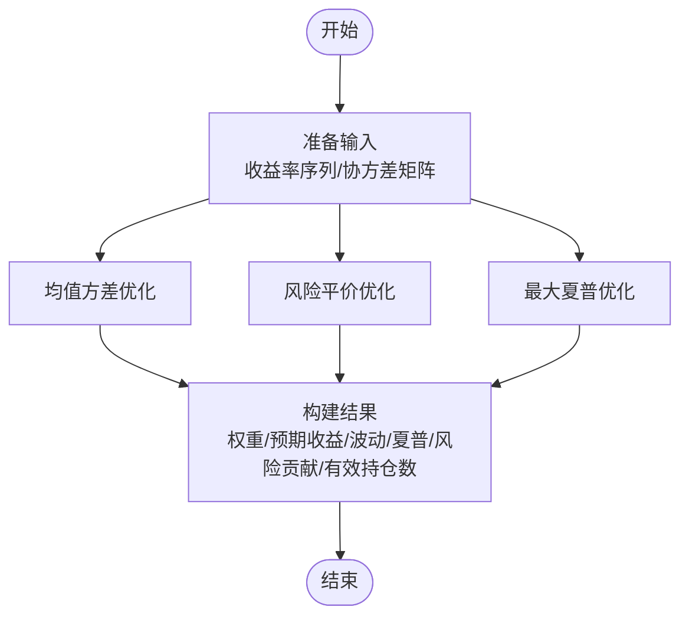
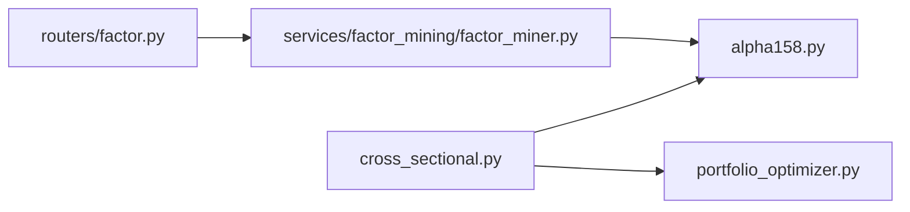

# 横截面选股算法

<cite>
**本文引用的文件**
- [backend/domain/cross_sectional.py](file://backend/domain/cross_sectional.py)
- [backend/domain/alpha158.py](file://backend/domain/alpha158.py)
- [backend/routers/factor.py](file://backend/routers/factor.py)
- [backend/services/factor_mining/factor_miner.py](file://backend/services/factor_mining/factor_miner.py)
- [backend/domain/portfolio_optimizer.py](file://backend/domain/portfolio_optimizer.py)
</cite>

## 目录
1. [简介](#简介)
2. [项目结构](#项目结构)
3. [核心组件](#核心组件)
4. [架构总览](#架构总览)
5. [详细组件分析](#详细组件分析)
6. [依赖关系分析](#依赖关系分析)
7. [性能考量](#性能考量)
8. [故障排查指南](#故障排查指南)
9. [结论](#结论)
10. [附录](#附录)

## 简介
本文件面向量化研究员，系统化阐述 Quant Agent 的横截面选股算法与工程实现。内容覆盖多因子模型的核心原理（因子选择、权重分配、评分计算）、因子标准化方法（Z-score、百分位数排名、行业中性化等）的技术落地思路、排序筛选策略（综合评分、阈值过滤、Top-N）、因子有效性检验（IC 值、分层回测、相关性分析）、动态调仓机制（更新频率、调仓日、交易成本），并配套完整流程图与数学公式说明，以及参数调优最佳实践。

## 项目结构
仓库中与横截面选股直接相关的核心代码集中在 domain 层与 services/routers：
- 横截面筛选引擎：提供技术指标计算、表达式求值与标的筛选入口
- Alpha158 因子库：提供大量量价/波动率/统计类因子的矢量化实现
- 因子挖掘服务：结合 LLM 建议因子与网格搜索进行参数优化
- 投资组合优化：在选股后提供权重配置与组合优化能力
- API 路由：暴露因子建议与搜索接口



**图示来源**
- [backend/routers/factor.py:1-74](file://backend/routers/factor.py#L1-L74)
- [backend/services/factor_mining/factor_miner.py:1-273](file://backend/services/factor_mining/factor_miner.py#L1-L273)
- [backend/domain/alpha158.py:1-385](file://backend/domain/alpha158.py#L1-L385)
- [backend/domain/cross_sectional.py:1-321](file://backend/domain/cross_sectional.py#L1-L321)
- [backend/domain/portfolio_optimizer.py:1-355](file://backend/domain/portfolio_optimizer.py#L1-L355)

**章节来源**
- [backend/routers/factor.py:1-74](file://backend/routers/factor.py#L1-L74)
- [backend/services/factor_mining/factor_miner.py:1-273](file://backend/services/factor_mining/factor_miner.py#L1-L273)
- [backend/domain/alpha158.py:1-385](file://backend/domain/alpha158.py#L1-L385)
- [backend/domain/cross_sectional.py:1-321](file://backend/domain/cross_sectional.py#L1-L321)
- [backend/domain/portfolio_optimizer.py:1-355](file://backend/domain/portfolio_optimizer.py#L1-L355)

## 核心组件
- 横截面筛选引擎：对候选股票计算技术指标，基于安全表达式进行条件筛选，输出通过标的及指标快照
- Alpha158 因子库：提供动量、波动率、量价、均线、统计与衍生等多类因子，支持批量计算与注册表管理
- 因子挖掘服务：LLM 生成因子建议与参数范围，结合网格搜索评估效果，返回最优参数与结果
- 投资组合优化：在选股完成后，提供均值方差、风险平价、最大夏普等权重优化方案

**章节来源**
- [backend/domain/cross_sectional.py:105-137](file://backend/domain/cross_sectional.py#L105-L137)
- [backend/domain/cross_sectional.py:247-321](file://backend/domain/cross_sectional.py#L247-L321)
- [backend/domain/alpha158.py:317-385](file://backend/domain/alpha158.py#L317-L385)
- [backend/services/factor_mining/factor_miner.py:44-215](file://backend/services/factor_mining/factor_miner.py#L44-L215)
- [backend/domain/portfolio_optimizer.py:42-252](file://backend/domain/portfolio_optimizer.py#L42-L252)

## 架构总览
横截面选股的整体流程如下：
- 输入：候选股票池、因子或表达式、可选的行业分类信息
- 处理：计算因子/技术指标 → 标准化 → 行业中性化 → 综合评分 → 排序筛选 → Top-N 选择
- 输出：入选股票列表、权重配置（可选）、回测与评估指标

```mermaid
sequenceDiagram
participant Client as "客户端"
participant Router as "API 路由<br/>factor.py"
participant Miner as "因子挖掘服务<br/>factor_miner.py"
participant Engine as "横截面筛选引擎<br/>cross_sectional.py"
participant Factors as "Alpha158 因子库<br/>alpha158.py"
participant Opt as "投资组合优化<br/>portfolio_optimizer.py"
Client->>Router : 请求因子建议/搜索
Router->>Miner : suggest_factors / grid_search_factors
Miner-->>Router : 因子建议与搜索结果
Client->>Engine : 传入表达式或因子集
Engine->>Factors : 计算因子矩阵
Engine->>Engine : 标准化/中性化/评分/排序
Engine-->>Client : 候选股票 + 指标快照
Client->>Opt : 传入收益序列/协方差
Opt-->>Client : 权重配置与组合指标
```

**图示来源**
- [backend/routers/factor.py:18-74](file://backend/routers/factor.py#L18-L74)
- [backend/services/factor_mining/factor_miner.py:47-215](file://backend/services/factor_mining/factor_miner.py#L47-L215)
- [backend/domain/cross_sectional.py:272-321](file://backend/domain/cross_sectional.py#L272-L321)
- [backend/domain/alpha158.py:317-385](file://backend/domain/alpha158.py#L317-L385)
- [backend/domain/portfolio_optimizer.py:54-252](file://backend/domain/portfolio_optimizer.py#L54-L252)

## 详细组件分析

### 横截面筛选引擎
- 技术指标计算：内置 RSI、KDJ、MACD、布林带、ATR、量比、SMA/EMA 等，全部采用 Pandas 矢量化实现，保证高效与可复现
- 安全表达式解析：将用户友好的表达式（如“RSI(14) > KDJ.K AND MACD.histogram > 0”）转换为内部列名并进行白名单校验，避免任意代码执行风险
- 横截面筛选入口：对每只标的计算指标并评估表达式，取最新一行的指标快照作为通过标的的特征记录



**图示来源**
- [backend/domain/cross_sectional.py:105-137](file://backend/domain/cross_sectional.py#L105-L137)
- [backend/domain/cross_sectional.py:197-264](file://backend/domain/cross_sectional.py#L197-L264)
- [backend/domain/cross_sectional.py:272-321](file://backend/domain/cross_sectional.py#L272-L321)

**章节来源**
- [backend/domain/cross_sectional.py:105-137](file://backend/domain/cross_sectional.py#L105-L137)
- [backend/domain/cross_sectional.py:197-264](file://backend/domain/cross_sectional.py#L197-L264)
- [backend/domain/cross_sectional.py:272-321](file://backend/domain/cross_sectional.py#L272-L321)

### Alpha158 因子库
- 因子类别：动量类（ROC、MOM、RSI、KDJ、Williams %R、CCI）、波动率类（STD、ATR、Bollinger Width、Realized Volatility、日内振幅）、量价类（VWAP、OBV、量比、MFI、AD Line）、均线类（SMA、EMA、MACD、DMA）、统计类（偏度、峰度、相关性、Beta、滚动最大回撤）、衍生类（收盘价相对 SMA 比率、短期收益率、换手率均值）
- 注册表与批量计算：通过 FACTOR_REGISTRY 统一管理因子函数、默认参数与类别；compute_all_factors 可一次性计算所有因子，便于后续标准化与评分



**图示来源**
- [backend/domain/alpha158.py:31-315](file://backend/domain/alpha158.py#L31-L315)
- [backend/domain/alpha158.py:317-385](file://backend/domain/alpha158.py#L317-L385)

**章节来源**
- [backend/domain/alpha158.py:31-315](file://backend/domain/alpha158.py#L31-L315)
- [backend/domain/alpha158.py:317-385](file://backend/domain/alpha158.py#L317-L385)

### 因子挖掘服务
- LLM 建议因子：根据目标（最大化夏普、最小回撤、最大化收益）生成因子表达式与参数范围，优先推荐引擎可真实回测的类型（当前为均线穿越类）
- 网格搜索：将 LLM 建议映射到具体策略键与参数网格，调用回测基础设施获取夏普与收益等指标；若不可回测则诚实标记 skipped，不伪造结果
- 结果排序：成功结果按夏普降序排列，skipped 结果排在末尾



**图示来源**
- [backend/routers/factor.py:18-74](file://backend/routers/factor.py#L18-L74)
- [backend/services/factor_mining/factor_miner.py:47-215](file://backend/services/factor_mining/factor_miner.py#L47-L215)

**章节来源**
- [backend/routers/factor.py:18-74](file://backend/routers/factor.py#L18-L74)
- [backend/services/factor_mining/factor_miner.py:47-215](file://backend/services/factor_mining/factor_miner.py#L47-L215)

### 投资组合优化
- 均值方差优化：在约束（权重和=1、单只上限、非负）下最小化组合方差或达到目标收益
- 风险平价：使各标的贡献相同比例的风险
- 最大夏普：最大化组合夏普比率
- 有效前沿：从最小方差组合到最大收益组合的多点求解
- 模型对比：等权 vs Markowitz vs 风险平价 vs MaxSharpe，选出最优模型



**图示来源**
- [backend/domain/portfolio_optimizer.py:54-252](file://backend/domain/portfolio_optimizer.py#L54-L252)
- [backend/domain/portfolio_optimizer.py:304-350](file://backend/domain/portfolio_optimizer.py#L304-L350)

**章节来源**
- [backend/domain/portfolio_optimizer.py:54-252](file://backend/domain/portfolio_optimizer.py#L54-L252)
- [backend/domain/portfolio_optimizer.py:304-350](file://backend/domain/portfolio_optimizer.py#L304-L350)

## 依赖关系分析
- 横截面筛选引擎依赖 Alpha158 因子库提供的指标/因子计算能力
- 因子挖掘服务依赖 LLM 服务与回测基础设施，同时与 API 路由交互
- 投资组合优化独立于选股流程，但在选股后可用于权重配置



**图示来源**
- [backend/domain/cross_sectional.py:105-137](file://backend/domain/cross_sectional.py#L105-L137)
- [backend/domain/alpha158.py:317-385](file://backend/domain/alpha158.py#L317-L385)
- [backend/routers/factor.py:18-74](file://backend/routers/factor.py#L18-L74)
- [backend/services/factor_mining/factor_miner.py:47-215](file://backend/services/factor_mining/factor_miner.py#L47-L215)
- [backend/domain/portfolio_optimizer.py:54-252](file://backend/domain/portfolio_optimizer.py#L54-L252)

**章节来源**
- [backend/domain/cross_sectional.py:105-137](file://backend/domain/cross_sectional.py#L105-L137)
- [backend/domain/alpha158.py:317-385](file://backend/domain/alpha158.py#L317-L385)
- [backend/routers/factor.py:18-74](file://backend/routers/factor.py#L18-L74)
- [backend/services/factor_mining/factor_miner.py:47-215](file://backend/services/factor_mining/factor_miner.py#L47-L215)
- [backend/domain/portfolio_optimizer.py:54-252](file://backend/domain/portfolio_optimizer.py#L54-L252)

## 性能考量
- 矢量化计算：Alpha158 与横截面筛选均基于 Pandas 向量化操作，避免逐行循环，提升大规模标的计算效率
- 表达式安全与快速求值：通过白名单与规范化减少非法 token 带来的异常开销，并使用 pandas.eval 加速逻辑运算
- 因子批量计算：compute_all_factors 一次性生成因子矩阵，便于后续标准化与评分的向量化处理
- 优化器数值稳定性：投资组合优化中设置合理初始猜测与热启动，限制单只权重上限，避免极端解导致的不稳定

[本节为通用性能指导，不直接分析具体文件]

## 故障排查指南
- 表达式求值失败：当表达式包含非法 token 或列名不存在时，会抛出错误；请检查表达式规范化与白名单映射
- 数据不足：标的历史数据长度不足或必要列缺失会导致跳过；确保 OHLCV 列齐全且长度满足最低要求
- 回测失败：因子挖掘服务在回测执行失败时会降级为 skipped，不会伪造结果；检查数据源可用性与策略注册情况
- 优化失败：投资组合优化在收敛失败时会回退到等权解；检查输入收益率序列的质量与协方差矩阵的正定性

**章节来源**
- [backend/domain/cross_sectional.py:230-264](file://backend/domain/cross_sectional.py#L230-L264)
- [backend/domain/cross_sectional.py:291-318](file://backend/domain/cross_sectional.py#L291-L318)
- [backend/services/factor_mining/factor_miner.py:166-215](file://backend/services/factor_mining/factor_miner.py#L166-L215)
- [backend/domain/portfolio_optimizer.py:85-88](file://backend/domain/portfolio_optimizer.py#L85-L88)

## 结论
Quant Agent 的横截面选股体系以 Alpha158 因子库为基础，结合安全的表达式求值与高效的矢量化计算，提供稳健的因子计算与筛选能力；因子挖掘服务通过 LLM 建议与网格搜索辅助参数优化；投资组合优化模块在选股后提供多种权重配置方案。整体架构清晰、可扩展性强，适合量化研究员进行横截面分析与策略迭代。

[本节为总结性内容，不直接分析具体文件]

## 附录

### 多因子模型核心原理与步骤
- 因子选择：从 Alpha158 因子库中选择动量、波动率、量价、均线、统计与衍生类因子；或通过 LLM 建议生成新因子表达式
- 权重分配：可使用等权、风险平价、最大夏普或均值方差等方法确定权重
- 评分计算：对因子进行标准化与中性化后，加权求和得到综合评分，再排序筛选

[本节为概念性说明，不直接分析具体文件]

### 因子标准化处理方法
- Z-score 标准化：对每个因子序列减去均值并除以标准差，消除量纲影响
- 百分位数排名：将因子值映射到 [0,1] 区间，降低极端值影响
- 行业中性化：在行业内对因子进行去均值或回归残差处理，控制行业暴露

[本节为概念性说明，不直接分析具体文件]

### 排序与筛选算法
- 综合评分：标准化后的因子乘以权重后加总，得到每只股票的评分
- 阈值过滤：设定评分阈值或分位数阈值，剔除低质量标的
- Top-N 选择：按评分从高到低选取前 N 只股票进入组合

[本节为概念性说明，不直接分析具体文件]

### 因子有效性检验方法
- IC 值计算：因子值与下期收益的秩相关系数，衡量因子预测能力
- 分层回测：按因子值分组，观察各组收益分布与单调性
- 相关性分析：因子间相关性矩阵，避免多重共线性

[本节为概念性说明，不直接分析具体文件]

### 动态调仓机制
- 因子更新频率：日频/周频/月频，取决于因子类型与数据可得性
- 调仓日确定：通常选择月末或季度末，避开财报披露窗口
- 交易成本控制：考虑滑点、佣金与冲击成本，设置换手率上限

[本节为概念性说明，不直接分析具体文件]

### 数学公式参考
- Z-score：z = (x - μ) / σ
- 百分位数排名：rank(x) = P(X ≤ x)
- 行业中性化：residual = x - mean_industry(x)
- 综合评分：score_i = Σ_j w_j * z_{ij}
- 夏普比率：SR = (E[R_p] - R_f) / σ_p

[本节为概念性说明，不直接分析具体文件]

### 参数调优指南
- 因子权重配置：等权起步，逐步引入风险平价或优化器权重
- 阈值设置：基于历史分位数或业务目标设定，定期回溯验证
- 风险控制参数：单只上限、行业暴露限制、换手率上限、最大回撤阈值

[本节为概念性说明，不直接分析具体文件]