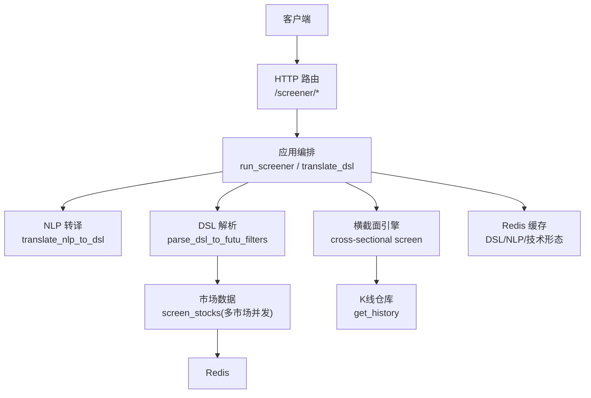
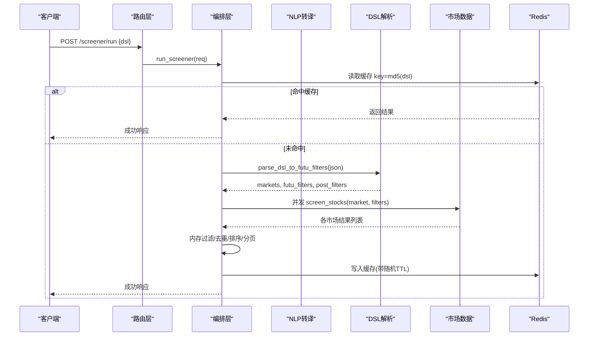
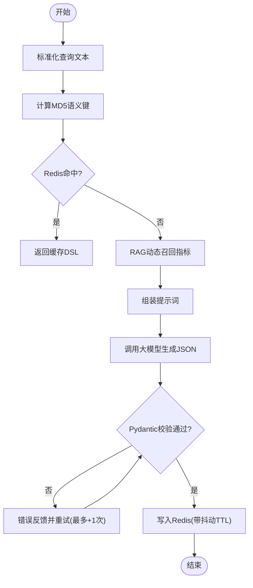
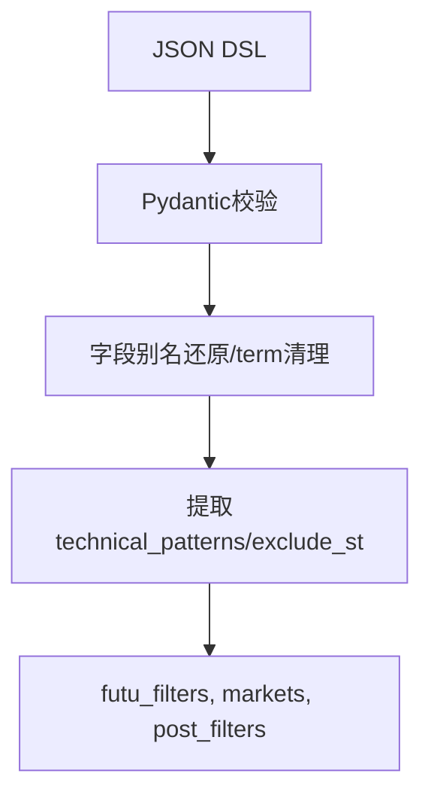
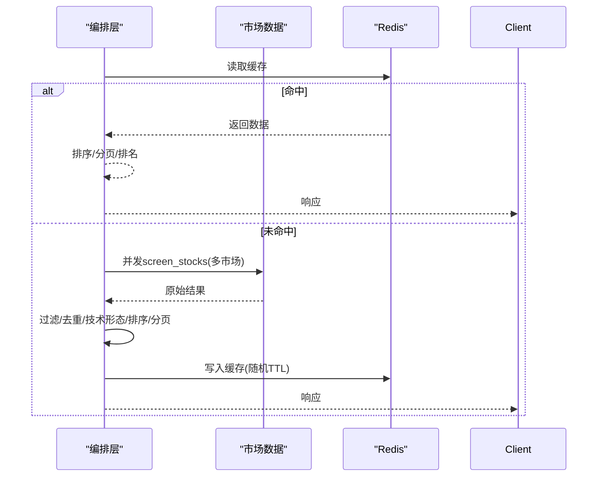
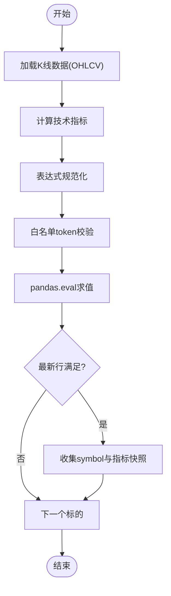
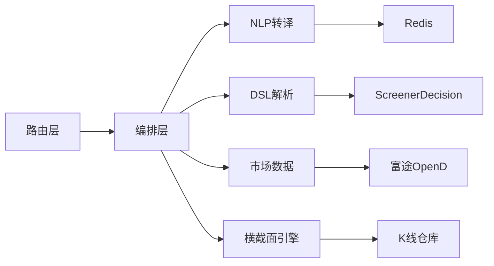

# 选股器系统

<cite>
**本文引用的文件**
- [backend/routers/screener.py](file://backend/routers/screener.py)
- [backend/app/screener_app.py](file://backend/app/screener_app.py)
- [backend/services/screener/nlp_translator.py](file://backend/services/screener/nlp_translator.py)
- [backend/services/screener/dsl_parser.py](file://backend/services/screener/dsl_parser.py)
- [backend/domain/cross_sectional.py](file://backend/domain/cross_sectional.py)
- [backend/services/screener/models.py](file://backend/services/screener/models.py)
- [backend/core/redis_client.py](file://backend/core/redis_client.py)
- [backend/app/market_data.py](file://backend/app/market_data.py)
</cite>

## 目录
1. [简介](#简介)
2. [项目结构](#项目结构)
3. [核心组件](#核心组件)
4. [架构总览](#架构总览)
5. [详细组件分析](#详细组件分析)
6. [依赖关系分析](#依赖关系分析)
7. [性能考虑](#性能考虑)
8. [故障排查指南](#故障排查指南)
9. [结论](#结论)
10. [附录：DSL语法规范与使用示例](#附录dsl语法规范与使用示例)

## 简介
本文件系统性地梳理 Quant Agent 选股器的实现，覆盖以下目标：
- DSL 语法规范：筛选条件、逻辑运算符、函数调用方式
- NLP 翻译机制：自然语言查询到结构化筛选条件的转换流程
- 横截面选股算法：多指标计算、表达式求值、结果过滤
- AI 增强选股建议：市场情绪、行业轮动、资金流向等能力集成点
- 使用示例：复杂筛选条件编写、AI 智能选股、结果可视化
- 性能优化：查询优化、缓存机制、并行计算

## 项目结构
选股器相关代码主要分布在后端服务层与领域层：
- HTTP 路由层：负责请求校验、鉴权注入与编排入口
- 应用编排层：封装 DSL 转译、在线扫盘、缓存、排序分页、技术形态二次过滤
- NLP 转译与 DSL 解析：将自然语言转为 JSON DSL，再映射为富途 API 过滤条件
- 横截面引擎：基于 Pandas 的矢量化技术指标计算与安全表达式求值
- 数据源与缓存：通过 market_data 访问富途 OpenD，Redis 做多级缓存

图表来源
- [backend/routers/screener.py:87-200](file://backend/routers/screener.py#L87-L200)
- [backend/app/screener_app.py:286-463](file://backend/app/screener_app.py#L286-L463)
- [backend/services/screener/nlp_translator.py:96-322](file://backend/services/screener/nlp_translator.py#L96-L322)
- [backend/services/screener/dsl_parser.py:16-78](file://backend/services/screener/dsl_parser.py#L16-L78)
- [backend/domain/cross_sectional.py:272-321](file://backend/domain/cross_sectional.py#L272-L321)

章节来源
- [backend/routers/screener.py:1-271](file://backend/routers/screener.py#L1-L271)
- [backend/app/screener_app.py:1-873](file://backend/app/screener_app.py#L1-L873)

## 核心组件
- HTTP 路由层（Thin Router）：仅做参数绑定与鉴权注入，转发至应用编排
- 应用编排层：
  - 自然语言转 DSL：调用 LLM + RAG 动态召回指标，输出强类型 JSON
  - DSL 解析：将 JSON DSL 映射为富途 API 过滤条件，并提取后处理规则
  - 在线扫盘：并发拉取多市场股票，内存二次过滤、去重、排序、分页
  - 技术形态二次过滤：按命中模式附加标签，必要时联邦过滤另类数据
  - 横截面选股：对标的集合计算指标并安全求值表达式
  - 组合回测：对选股结果进行等权组合回测（由路由触发）
- NLP 转译：语义缓存、RAG 向量检索、LLM 生成、Pydantic 校验、降级兜底
- DSL 解析：字段别名还原、财务周期处理、技术形态数组提取
- 横截面引擎：RSI/KDJ/MACD/BOLL/ATR/量比/SMA/EMA 等指标计算，白名单 token 校验与 pandas.eval 安全求值
- 缓存与并发：Redis 多级缓存、异步并发 gather、防雪崩抖动 TTL

章节来源
- [backend/routers/screener.py:87-200](file://backend/routers/screener.py#L87-L200)
- [backend/app/screener_app.py:286-463](file://backend/app/screener_app.py#L286-L463)
- [backend/services/screener/nlp_translator.py:96-322](file://backend/services/screener/nlp_translator.py#L96-L322)
- [backend/services/screener/dsl_parser.py:16-78](file://backend/services/screener/dsl_parser.py#L16-L78)
- [backend/domain/cross_sectional.py:272-321](file://backend/domain/cross_sectional.py#L272-L321)

## 架构总览
选股器采用分层解耦设计：
- 路由层：FastAPI 路由，统一前缀 /screener，提供 RESTful 接口
- 编排层：集中处理业务流，屏蔽下游细节
- 领域层：横截面选股、策略参数解析等纯领域逻辑
- 服务层：NLP 转译、DSL 解析、数据源适配
- 基础设施：Redis 缓存、数据库模型、日志与异常

图表来源
- [backend/routers/screener.py:97-101](file://backend/routers/screener.py#L97-L101)
- [backend/app/screener_app.py:295-463](file://backend/app/screener_app.py#L295-L463)
- [backend/services/screener/dsl_parser.py:16-78](file://backend/services/screener/dsl_parser.py#L16-L78)

## 详细组件分析

### NLP → DSL 转译
- 输入：自然语言查询（如“寻找今天出现 RSI 底背离且放量企稳的美股科技股”）
- 处理：
  - 标准化查询文本，计算 MD5 作为语义缓存键
  - RAG 动态召回相关指标（支持用户私有规则与公共规则混合检索）
  - 构造提示词，调用 LLM 生成 JSON DSL，并通过 Pydantic 强类型校验
  - 失败重试与自动修复；最终落库 Redis 长效缓存（含抖动 TTL）
- 输出：标准 JSON DSL（包含 markets、filters、technical_patterns、exclude_st、dsl_display 等）

图表来源
- [backend/services/screener/nlp_translator.py:21-34](file://backend/services/screener/nlp_translator.py#L21-L34)
- [backend/services/screener/nlp_translator.py:96-322](file://backend/services/screener/nlp_translator.py#L96-L322)
- [backend/core/redis_client.py](file://backend/core/redis_client.py)

章节来源
- [backend/services/screener/nlp_translator.py:96-322](file://backend/services/screener/nlp_translator.py#L96-L322)

### DSL 解析与富途过滤映射
- 输入：LLM 输出的 JSON DSL
- 处理：
  - Pydantic 强类型校验，定位具体字段错误并给出人类可读提示
  - 字段别名还原（如 VOLUME_MULTIPLE → VOLUME_RATIO）
  - 财务周期 term 处理（TTM/LATEST/Q6/Q9/ANNUAL）
  - 提取 technical_patterns 与 exclude_st 用于后处理
- 输出：Futu 可执行的过滤条件数组、市场列表、后处理规则

图表来源
- [backend/services/screener/dsl_parser.py:16-78](file://backend/services/screener/dsl_parser.py#L16-L78)

章节来源
- [backend/services/screener/dsl_parser.py:16-78](file://backend/services/screener/dsl_parser.py#L16-L78)

### 在线扫盘与结果处理
- 并发扫盘：按市场并发调用 market_data.screen_stocks，聚合结果
- 内存二次过滤：剔除 ST、技术形态匹配（可选）、去重
- 排序与分页：服务端动态排序（支持数值型单位换算），服务端切片
- 缓存：首次结果写入 Redis，后续相同 DSL 秒级命中

图表来源
- [backend/app/screener_app.py:295-463](file://backend/app/screener_app.py#L295-L463)
- [backend/app/market_data.py](file://backend/app/market_data.py)

章节来源
- [backend/app/screener_app.py:295-463](file://backend/app/screener_app.py#L295-L463)

### 横截面选股引擎
- 指标计算：RSI、KDJ、MACD、BOLL、ATR、量比、SMA/EMA 等，全部基于 Pandas 矢量化
- 表达式求值：
  - 白名单 token 校验，防止任意代码执行
  - 用户表达式规范化（如 RSI(14) → rsi，KDJ.K → kdj_k）
  - 使用 pandas.eval 安全求值，返回布尔掩码
- 筛选流程：对每个标的计算指标，评估最新行是否满足表达式，收集通过的标的及指标快照

图表来源
- [backend/domain/cross_sectional.py:25-137](file://backend/domain/cross_sectional.py#L25-L137)
- [backend/domain/cross_sectional.py:197-264](file://backend/domain/cross_sectional.py#L197-L264)
- [backend/domain/cross_sectional.py:272-321](file://backend/domain/cross_sectional.py#L272-L321)

章节来源
- [backend/domain/cross_sectional.py:25-137](file://backend/domain/cross_sectional.py#L25-L137)
- [backend/domain/cross_sectional.py:197-264](file://backend/domain/cross_sectional.py#L197-L264)
- [backend/domain/cross_sectional.py:272-321](file://backend/domain/cross_sectional.py#L272-L321)

### AI 增强的选股建议
- 灵感提示：内置大量高质量选股思路（价值、成长、技术形态、宏观受益等）
- 自然语言转 DSL：结合 RAG 与 LLM，将口语化描述转为可执行筛选条件
- 结果总结：对选股结果调用大模型生成盘面洞察报告（路由层暴露 summarize 接口）
- 另类数据联邦过滤：在技术形态流水线中，按需接入高管净买入等另类数据（通过数据源路由）

章节来源
- [backend/app/screener_app.py:280-283](file://backend/app/screener_app.py#L280-L283)
- [backend/app/screener_app.py:740-746](file://backend/app/screener_app.py#L740-L746)
- [backend/services/screener/dsl_parser.py:162-190](file://backend/services/screener/dsl_parser.py#L162-L190)

## 依赖关系分析
- 路由层依赖编排层函数，不直接执行业务逻辑
- 编排层依赖：
  - NLP 转译：llm_service、redis_client、models（ScreenerDecision）
  - DSL 解析：models（ScreenerDecision）
  - 市场数据：market_data.screen_stocks（多市场并发）
  - 横截面：kline_warehouse.get_history、domain.cross_sectional.screen
- 缓存依赖：redis_client（DSL/NLP/技术形态）
- 外部依赖：富途 OpenD、数据源路由（Finnhub 等）

图表来源
- [backend/routers/screener.py:87-200](file://backend/routers/screener.py#L87-L200)
- [backend/app/screener_app.py:286-463](file://backend/app/screener_app.py#L286-L463)
- [backend/services/screener/nlp_translator.py:96-322](file://backend/services/screener/nlp_translator.py#L96-L322)
- [backend/services/screener/dsl_parser.py:16-78](file://backend/services/screener/dsl_parser.py#L16-L78)
- [backend/domain/cross_sectional.py:272-321](file://backend/domain/cross_sectional.py#L272-L321)

章节来源
- [backend/routers/screener.py:87-200](file://backend/routers/screener.py#L87-L200)
- [backend/app/screener_app.py:286-463](file://backend/app/screener_app.py#L286-L463)

## 性能考虑
- 查询优化
  - 服务端动态排序与分页，减少前端负载
  - 内存二次过滤与技术形态标签附加，避免重复网络请求
- 缓存机制
  - NLP 语义缓存（MD5归一化查询，30天+抖动）
  - DSL 执行缓存（相同 DSL 秒级命中）
  - 技术形态缓存（按日维度批量读取）
- 并行计算
  - 多市场并发扫盘（asyncio.gather）
  - 另类数据联邦过滤并发检查（高管净买入）
- 防雪崩
  - Redis 写入 TTL 增加随机抖动
  - 锁池防止同一 DSL 重复计算

章节来源
- [backend/app/screener_app.py:295-463](file://backend/app/screener_app.py#L295-L463)
- [backend/services/screener/nlp_translator.py:96-322](file://backend/services/screener/nlp_translator.py#L96-L322)
- [backend/services/screener/dsl_parser.py:92-124](file://backend/services/screener/dsl_parser.py#L92-L124)

## 故障排查指南
- DSL 格式错误
  - 现象：抛出“DSL 格式错误”，需检查 AI 生成的 JSON 是否合法
  - 处理：确保 JSON 符合 ScreenerDecision 模型定义
- 富途连接异常
  - 现象：返回 503，提示数据源未连接
  - 处理：检查 Futu OpenD 状态，稍后重试
- 表达式求值失败
  - 现象：横截面求值报错，提示非法 token 或表达式错误
  - 处理：确认表达式仅使用白名单指标与运算符
- 技术形态缓存缺失
  - 现象：无命中缓存时，为避免额度耗尽主动跳过批量拉取
  - 处理：合理设置技术形态过滤，或等待缓存更新

章节来源
- [backend/app/screener_app.py:380-443](file://backend/app/screener_app.py#L380-L443)
- [backend/domain/cross_sectional.py:230-264](file://backend/domain/cross_sectional.py#L230-L264)
- [backend/services/screener/dsl_parser.py:92-124](file://backend/services/screener/dsl_parser.py#L92-L124)

## 结论
Quant Agent 选股器以“自然语言 → DSL → 富途过滤 → 横截面/在线扫盘”为主线，结合 RAG、LLM、缓存与并发，实现了高效、可扩展、可解释的选股能力。其模块化设计与严格的安全校验，保障了在生产环境中的稳定性与可维护性。

## 附录：DSL语法规范与使用示例

### DSL 语法规范
- 顶层字段
  - markets：交易市场数组，如 ["US", "HK", "SH", "SZ"]
  - exclude_st：是否剔除 ST 股
  - technical_patterns：技术形态字符串数组，如 ["macd_gold_cross", "rsi_oversold"]
  - filters：筛选条件数组，每项包含 field、type、term、min_value、max_value 等
- 筛选条件字段
  - field：指标名（如 PE_TTM、MARKET_CAP、ROE、PRICE_CHANGE_PCT）
  - type：数据类型（simple、financial、accumulate、indicator_pattern、indicator_positional、broker、option）
  - term：财报周期（TTM、LATEST、Q6、Q9、ANNUAL），非 financial 类型会被移除
  - min_value/max_value：数值范围（比率类需为小数，金额需为绝对数值）
- 技术形态
  - indicator_pattern：技术指标形态（如 MACD_GOLD_CROSS、RSI_OVERSOLD）
  - kline_shape：K线形态（如 LONG_ARRANGEMENT、MORNING_STAR）
  - indicator_positional：指标位置关系（如价格上穿均线）
- 时序逻辑
  - continuous_period：连续期数（如“连续3年增长”）
  - period_average：长期均值（如“近5年平均ROE>20%”）

章节来源
- [backend/services/screener/nlp_translator.py:130-206](file://backend/services/screener/nlp_translator.py#L130-L206)
- [backend/services/screener/dsl_parser.py:57-78](file://backend/services/screener/dsl_parser.py#L57-L78)

### 使用示例
- 自然语言查询
  - “寻找今天出现 RSI 底背离且放量企稳的美股科技股”
  - 调用 /screener/translate 获取 DSL
- 复杂筛选条件
  - 市值大于 100 亿，PE 在 10~50 之间，ROE 连续 3 年大于 15%，MACD 金叉
  - 对应 filters 中设置 MARKET_CAP、PE_TTM、ROE（continuous_period=3）、MACD_GOLD_CROSS
- 横截面表达式
  - “RSI(14) < 30 AND MACD.histogram > 0”
  - 调用 /screener/cross-sectional，传入 symbols 与 expression
- 结果可视化
  - 服务端返回 rank、symbol、name、mktcap、price、chg、rsi、chg30、inflow 等字段
  - 前端可根据 matched_patterns 列展示技术形态标签

章节来源
- [backend/routers/screener.py:92-101](file://backend/routers/screener.py#L92-L101)
- [backend/app/screener_app.py:286-463](file://backend/app/screener_app.py#L286-L463)
- [backend/domain/cross_sectional.py:272-321](file://backend/domain/cross_sectional.py#L272-L321)