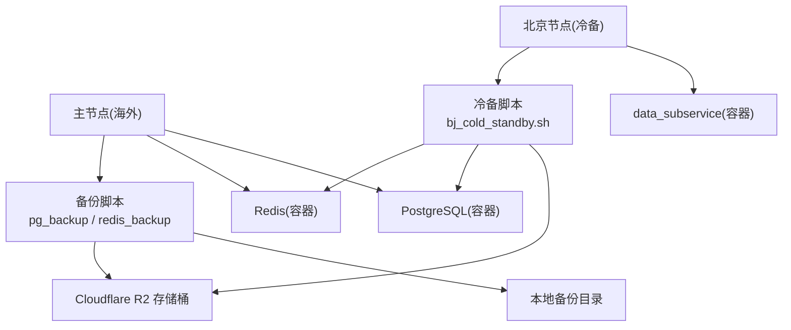
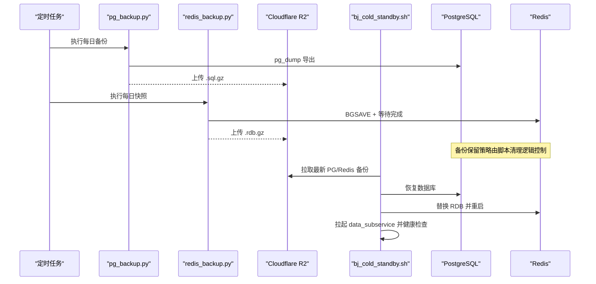
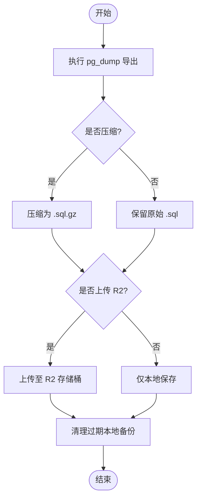
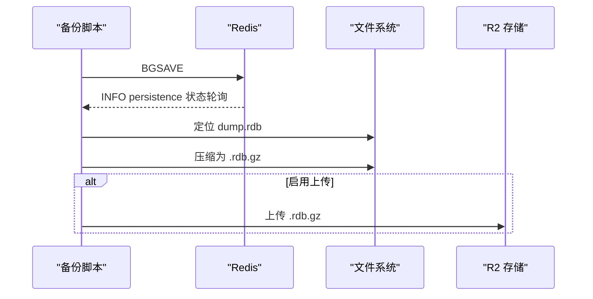
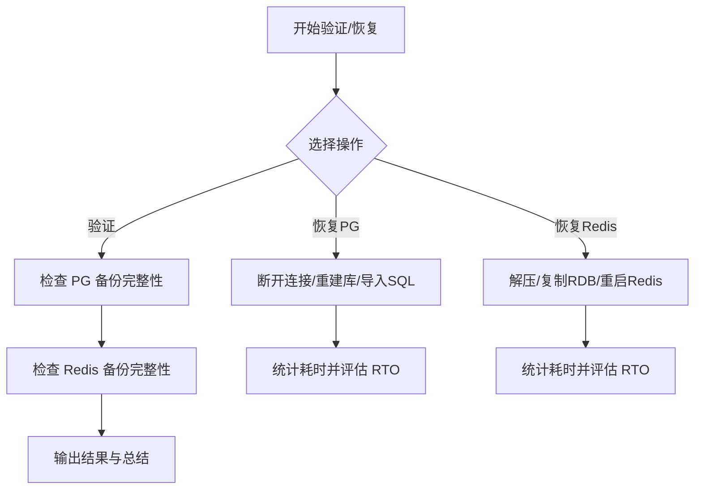
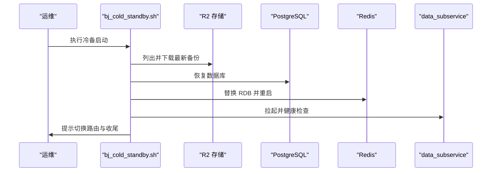
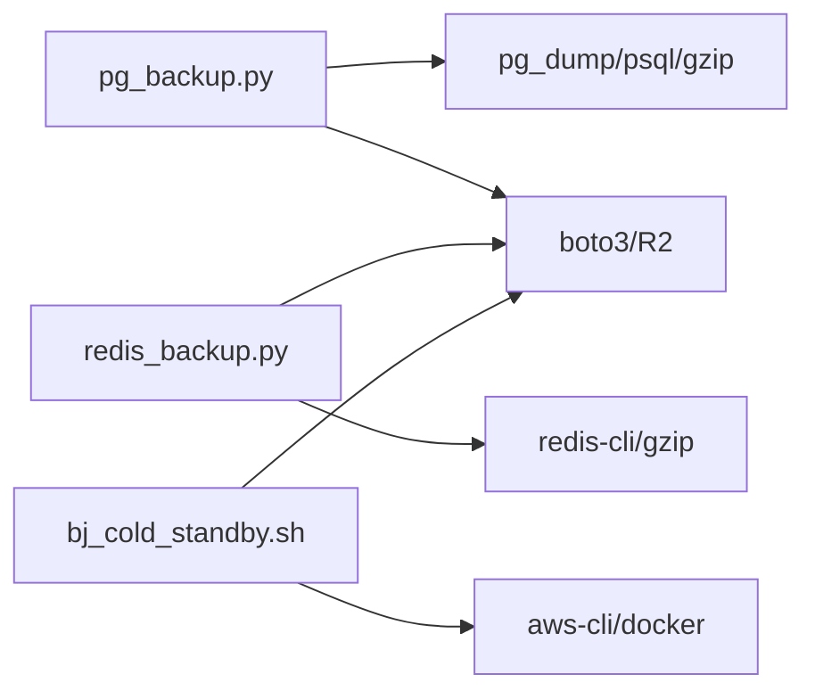

# 备份恢复策略

<cite>
**本文引用的文件**
- [backend/scripts/backup_restore.py](file://backend/scripts/backup_restore.py)
- [backend/scripts/pg_backup.py](file://backend/scripts/pg_backup.py)
- [backend/scripts/redis_backup.py](file://backend/scripts/redis_backup.py)
- [scripts/disaster_recovery/bj_cold_standby.sh](file://scripts/disaster_recovery/bj_cold_standby.sh)
- [docker-compose.master.yml](file://docker-compose.master.yml)
- [docker-compose.node-bj.yml](file://docker-compose.node-bj.yml)
- [backend/core/config.py](file://backend/core/config.py)
- [backend/core/database.py](file://backend/core/database.py)
- [backend/core/redis_client.py](file://backend/core/redis_client.py)
</cite>

## 目录
1. [简介](#简介)
2. [项目结构](#项目结构)
3. [核心组件](#核心组件)
4. [架构总览](#架构总览)
5. [详细组件分析](#详细组件分析)
6. [依赖关系分析](#依赖关系分析)
7. [性能考虑](#性能考虑)
8. [故障排查指南](#故障排查指南)
9. [结论](#结论)
10. [附录](#附录)

## 简介
本文件为 Quant Agent 的备份与恢复策略提供完整操作手册与应急预案，覆盖：
- PostgreSQL 全量备份、增量与时间点恢复（PITR）策略建议
- Redis 缓存持久化配置、快照策略与数据一致性保证
- 配置文件、用户上传文件、日志等文件数据的备份方案
- 灾难恢复流程（RTO/RPO 目标、恢复步骤、数据验证）
- 自动化备份脚本使用、存储策略与跨地域容灾方案
- 面向运维团队的标准化操作流程与应急指引

## 项目结构
本项目已内置数据库与缓存备份脚本、演练脚本以及异地冷备启动脚本，配合 Docker Compose 部署，形成“本地+云端对象存储”的备份体系。关键路径如下：
- 数据库备份：PostgreSQL 通过 pg_dump 导出并压缩，支持上传至 Cloudflare R2
- 缓存备份：Redis 通过 BGSAVE 生成 RDB 快照，压缩后落盘并可上传至 R2
- 恢复演练：统一入口脚本支持 PG/Redis 恢复与备份完整性校验
- 异地容灾：北京节点冷备脚本从 R2 拉取最新备份并拉起 data_subservice

图表来源
- [docker-compose.master.yml:17-74](file://docker-compose.master.yml#L17-L74)
- [docker-compose.node-bj.yml:25-60](file://docker-compose.node-bj.yml#L25-L60)
- [backend/scripts/pg_backup.py:49-140](file://backend/scripts/pg_backup.py#L49-L140)
- [backend/scripts/redis_backup.py:51-135](file://backend/scripts/redis_backup.py#L51-L135)
- [scripts/disaster_recovery/bj_cold_standby.sh:66-101](file://scripts/disaster_recovery/bj_cold_standby.sh#L66-L101)

章节来源
- [docker-compose.master.yml:17-74](file://docker-compose.master.yml#L17-L74)
- [docker-compose.node-bj.yml:25-60](file://docker-compose.node-bj.yml#L25-L60)

## 核心组件
- PostgreSQL 备份管理器：封装 pg_dump、压缩、上传 R2、清理过期备份与恢复能力
- Redis 备份器：触发 BGSAVE、等待完成、定位 dump.rdb、压缩与可选上传 R2
- 备份恢复演练脚本：统一入口，支持 PG/Redis 恢复、备份完整性校验与 RTO 检查
- 异地冷备脚本：从 R2 拉取最新备份，恢复 PG/Redis，拉起 data_subservice，切换路由

章节来源
- [backend/scripts/pg_backup.py:49-140](file://backend/scripts/pg_backup.py#L49-L140)
- [backend/scripts/redis_backup.py:51-135](file://backend/scripts/redis_backup.py#L51-L135)
- [backend/scripts/backup_restore.py:43-239](file://backend/scripts/backup_restore.py#L43-L239)
- [scripts/disaster_recovery/bj_cold_standby.sh:66-101](file://scripts/disaster_recovery/bj_cold_standby.sh#L66-L101)

## 架构总览
下图展示备份与恢复的整体调用链与数据流向：

图表来源
- [backend/scripts/pg_backup.py:142-226](file://backend/scripts/pg_backup.py#L142-L226)
- [backend/scripts/redis_backup.py:51-135](file://backend/scripts/redis_backup.py#L51-L135)
- [scripts/disaster_recovery/bj_cold_standby.sh:66-101](file://scripts/disaster_recovery/bj_cold_standby.sh#L66-L101)

## 详细组件分析

### PostgreSQL 备份与恢复
- 全量备份：通过 pg_dump 导出 SQL，默认压缩为 .sql.gz，支持上传到 R2 并按天清理本地旧备份
- 恢复流程：支持解压 .sql.gz 并通过 psql 恢复到目标库；演练脚本会断开连接、重建库并导入
- PITR（时间点恢复）建议：生产环境建议开启 WAL 归档与连续归档，结合 pg_basebackup 实现按时间点恢复；当前脚本侧重全量备份与快速恢复
- 环境变量与连接：DATABASE_URL 用于连接串；也可通过 DB_USER/DB_PASSWORD/DB_NAME/DB_HOST/DB_PORT 在演练脚本中配置

图表来源
- [backend/scripts/pg_backup.py:73-140](file://backend/scripts/pg_backup.py#L73-L140)
- [backend/scripts/pg_backup.py:142-226](file://backend/scripts/pg_backup.py#L142-L226)
- [backend/scripts/pg_backup.py:231-242](file://backend/scripts/pg_backup.py#L231-L242)

章节来源
- [backend/scripts/pg_backup.py:49-140](file://backend/scripts/pg_backup.py#L49-L140)
- [backend/scripts/pg_backup.py:142-226](file://backend/scripts/pg_backup.py#L142-L226)
- [backend/scripts/pg_backup.py:231-242](file://backend/scripts/pg_backup.py#L231-L242)
- [backend/scripts/backup_restore.py:43-159](file://backend/scripts/backup_restore.py#L43-L159)
- [backend/core/config.py:31-36](file://backend/core/config.py#L31-L36)
- [backend/core/database.py:7-25](file://backend/core/database.py#L7-L25)

### Redis 缓存备份与恢复
- 持久化配置：主节点 Redis 启用 appendonly yes（AOF），同时定期生成 RDB 快照
- 快照策略：通过 BGSAVE 触发快照，等待完成后定位 dump.rdb，压缩为 .rdb.gz 并可选上传 R2
- 恢复流程：将 RDB 复制到 Redis 数据目录或容器内路径，重启 Redis 加载数据；演练脚本支持 Docker 复制与本地回退
- 数据一致性：AOF 提供实时持久化，RDB 提供时间点快照；恢复时以 RDB 为准，注意业务写入窗口

图表来源
- [docker-compose.master.yml:17-35](file://docker-compose.master.yml#L17-L35)
- [backend/scripts/redis_backup.py:51-135](file://backend/scripts/redis_backup.py#L51-L135)
- [backend/scripts/redis_backup.py:138-167](file://backend/scripts/redis_backup.py#L138-L167)

章节来源
- [docker-compose.master.yml:17-35](file://docker-compose.master.yml#L17-L35)
- [backend/scripts/redis_backup.py:51-135](file://backend/scripts/redis_backup.py#L51-L135)
- [backend/scripts/backup_restore.py:162-239](file://backend/scripts/backup_restore.py#L162-L239)

### 备份恢复演练与校验
- 统一入口：支持指定类型（pg/redis）与备份文件进行恢复，或对所有备份进行完整性校验
- 恢复流程：PG 恢复会断开现有连接、重建数据库并导入；Redis 恢复会解压 RDB、复制到容器或本地目录并重启
- 校验机制：对最新备份尝试解压前若干字节以验证 gzip 完整性，输出大小与时间信息
- RTO 监控：恢复完成后统计耗时并与目标阈值对比，辅助评估恢复效率

图表来源
- [backend/scripts/backup_restore.py:43-239](file://backend/scripts/backup_restore.py#L43-L239)
- [backend/scripts/backup_restore.py:242-328](file://backend/scripts/backup_restore.py#L242-L328)

章节来源
- [backend/scripts/backup_restore.py:43-239](file://backend/scripts/backup_restore.py#L43-L239)
- [backend/scripts/backup_restore.py:242-328](file://backend/scripts/backup_restore.py#L242-L328)

### 异地容灾与冷备启动
- 场景：主节点不可用时，在北京节点从 R2 拉取最新备份，恢复 PG/Redis，拉起 data_subservice，并将主服务路由降级指向北京节点
- 前置条件：R2 凭证、PG/Redis 容器名或连接串、仓库根目录、aws-cli/docker/tailscale 工具可用
- 执行步骤：拉取备份→恢复 PG→恢复 Redis（如有 RDB）→拉起 data_subservice→更新 .env 远程源→人工确认并重启 API

图表来源
- [scripts/disaster_recovery/bj_cold_standby.sh:45-101](file://scripts/disaster_recovery/bj_cold_standby.sh#L45-L101)
- [scripts/disaster_recovery/bj_cold_standby.sh:103-143](file://scripts/disaster_recovery/bj_cold_standby.sh#L103-L143)

章节来源
- [scripts/disaster_recovery/bj_cold_standby.sh:45-101](file://scripts/disaster_recovery/bj_cold_standby.sh#L45-L101)
- [scripts/disaster_recovery/bj_cold_standby.sh:103-143](file://scripts/disaster_recovery/bj_cold_standby.sh#L103-L143)

### 配置文件与数据文件备份
- 应用配置：.env、nginx 配置（如 quant.conf）、Prometheus/Grafana 配置等应纳入版本管理与独立备份
- 用户文件：reports、前端静态资源、用户上传附件等需单独备份到对象存储或 NAS
- 日志文件：应用日志、访问日志、错误日志建议集中采集并归档，便于审计与回溯
- 建议：将上述文件纳入统一的备份编排，与 PG/Redis 备份保持相同保留策略与告警

[本节为通用指导，不直接分析具体代码文件]

## 依赖关系分析
- 备份脚本依赖外部工具：pg_dump/psql、redis-cli、gzip、boto3（R2 上传）
- 运行环境依赖：Docker（容器化服务）、aws-cli（R2 访问）、Tailscale（跨节点通信）
- 配置依赖：DATABASE_URL、REDIS_*、R2_* 等环境变量；主节点 compose 定义了 Redis/PG 端口绑定与持久化卷

图表来源
- [backend/scripts/pg_backup.py:142-226](file://backend/scripts/pg_backup.py#L142-L226)
- [backend/scripts/redis_backup.py:51-135](file://backend/scripts/redis_backup.py#L51-L135)
- [scripts/disaster_recovery/bj_cold_standby.sh:45-101](file://scripts/disaster_recovery/bj_cold_standby.sh#L45-L101)

章节来源
- [backend/scripts/pg_backup.py:142-226](file://backend/scripts/pg_backup.py#L142-L226)
- [backend/scripts/redis_backup.py:51-135](file://backend/scripts/redis_backup.py#L51-L135)
- [scripts/disaster_recovery/bj_cold_standby.sh:45-101](file://scripts/disaster_recovery/bj_cold_standby.sh#L45-L101)

## 性能考虑
- 备份窗口：pg_dump 与大 RDB 可能占用较多 CPU/IO，建议在低峰期执行；合理设置超时与并发
- 压缩级别：gzip 压缩级别影响 CPU 与体积，可按磁盘与带宽权衡调整
- 网络传输：R2 上传受带宽与延迟影响，可分片或限速；必要时使用内网镜像中转
- 恢复耗时：PG 恢复与 Redis 重启均会影响可用性，建议预演并记录 RTO；大库恢复可考虑并行导入或分库拆分

[本节为通用指导，不直接分析具体代码文件]

## 故障排查指南
- 备份失败
  - pg_dump 失败：检查 DATABASE_URL、权限与网络；查看 stderr 输出
  - R2 上传失败：检查 R2_ENDPOINT/ACCESS_KEY/SECRET_KEY/BUCKET；确认 boto3 安装
  - Redis BGSAVE 超时：检查内存压力与持久化配置；确认 dump.rdb 路径与权限
- 恢复失败
  - PG 恢复报错：确认目标库存在且无锁；检查 SQL 语法与角色权限
  - Redis 恢复无效：确认 RDB 文件完整；重启后检查 DBSIZE 与服务日志
- 演练与校验
  - 使用备份恢复脚本的 verify 模式检查最新备份完整性
  - 关注 RTO 指标，若超标需优化硬件或调整备份策略

章节来源
- [backend/scripts/pg_backup.py:142-226](file://backend/scripts/pg_backup.py#L142-L226)
- [backend/scripts/redis_backup.py:51-135](file://backend/scripts/redis_backup.py#L51-L135)
- [backend/scripts/backup_restore.py:242-328](file://backend/scripts/backup_restore.py#L242-L328)

## 结论
Quant Agent 已具备完善的备份与恢复基础能力：
- PostgreSQL 全量备份与恢复，支持 R2 远端存储与本地清理
- Redis AOF+RDB 双持久化，快照备份与恢复流程完备
- 统一演练脚本与异地冷备脚本，满足跨地域容灾需求
建议在生产环境补充：
- 开启 PostgreSQL WAL 归档以实现 PITR
- 完善文件级备份（配置、用户文件、日志）与监控告警
- 定期演练恢复流程并记录 RTO/RPO，持续优化

[本节为总结性内容，不直接分析具体代码文件]

## 附录

### 运维操作手册（摘要）
- 每日备份
  - 执行 PostgreSQL 备份：参考 [pg_backup.py:327-361](file://backend/scripts/pg_backup.py#L327-L361)
  - 执行 Redis 快照：参考 [redis_backup.py:189-214](file://backend/scripts/redis_backup.py#L189-L214)
  - 可选上传 R2：设置 R2_* 环境变量并启用上传参数
- 恢复流程
  - PG 恢复：使用演练脚本或 pg_backup 的 restore 参数，参考 [backup_restore.py:43-159](file://backend/scripts/backup_restore.py#L43-L159)、[pg_backup.py:244-321](file://backend/scripts/pg_backup.py#L244-L321)
  - Redis 恢复：使用演练脚本或手动替换 RDB 并重启，参考 [backup_restore.py:162-239](file://backend/scripts/backup_restore.py#L162-L239)
- 异地容灾
  - 执行冷备脚本：参考 [bj_cold_standby.sh:17-20](file://scripts/disaster_recovery/bj_cold_standby.sh#L17-L20)
  - 准备环境变量与工具：参考 [bj_cold_standby.sh:45-64](file://scripts/disaster_recovery/bj_cold_standby.sh#L45-L64)
- 备份校验
  - 使用演练脚本验证所有备份：参考 [backup_restore.py:242-328](file://backend/scripts/backup_restore.py#L242-L328)

章节来源
- [backend/scripts/pg_backup.py:327-361](file://backend/scripts/pg_backup.py#L327-L361)
- [backend/scripts/redis_backup.py:189-214](file://backend/scripts/redis_backup.py#L189-L214)
- [backend/scripts/backup_restore.py:43-239](file://backend/scripts/backup_restore.py#L43-L239)
- [scripts/disaster_recovery/bj_cold_standby.sh:17-20](file://scripts/disaster_recovery/bj_cold_standby.sh#L17-L20)
- [scripts/disaster_recovery/bj_cold_standby.sh:45-64](file://scripts/disaster_recovery/bj_cold_standby.sh#L45-L64)

### RTO/RPO 目标与验证方法
- RTO 目标
  - PostgreSQL 恢复：< 2 小时（演练脚本内置阈值）
  - Redis 恢复：< 30 分钟（演练脚本内置阈值）
  - 异地冷备：< 4 小时（脚本注释明确预算）
- RPO 目标
  - PostgreSQL：基于每日全量备份；建议开启 WAL 归档实现更细粒度 RPO
  - Redis：AOF 提供近实时持久化，RDB 提供时间点快照；RPO 取决于快照频率
- 验证方法
  - 使用演练脚本的 verify 模式检查备份完整性
  - 恢复后通过 psql/redis-cli 校验数据一致性与服务健康

章节来源
- [backend/scripts/backup_restore.py:152-159](file://backend/scripts/backup_restore.py#L152-L159)
- [backend/scripts/backup_restore.py:215-239](file://backend/scripts/backup_restore.py#L215-L239)
- [scripts/disaster_recovery/bj_cold_standby.sh:15-16](file://scripts/disaster_recovery/bj_cold_standby.sh#L15-L16)
