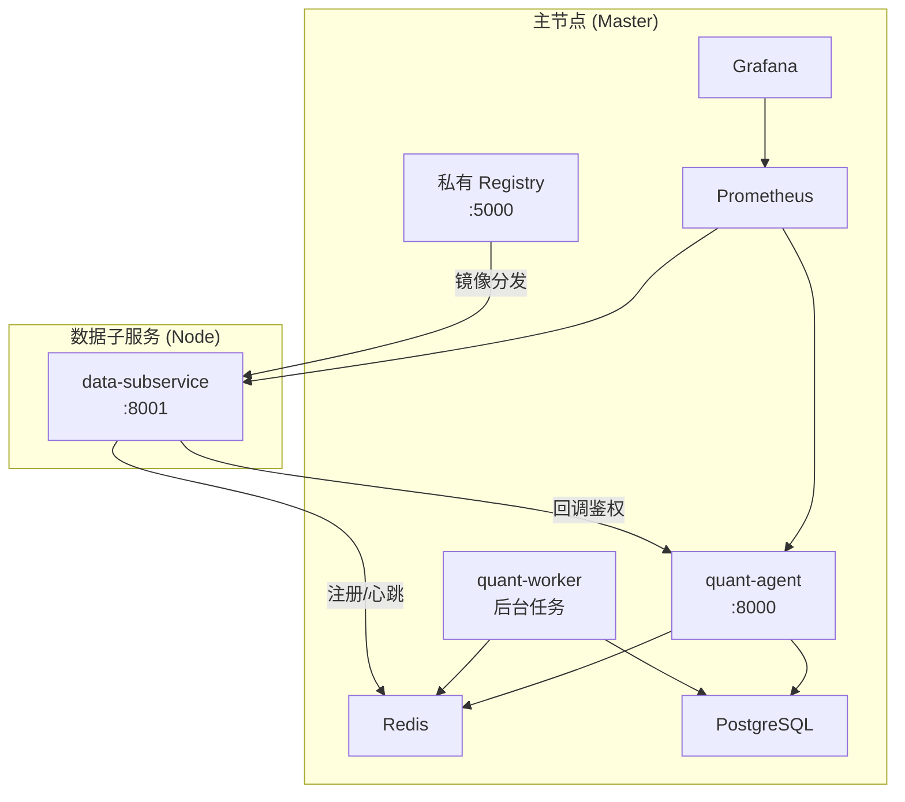
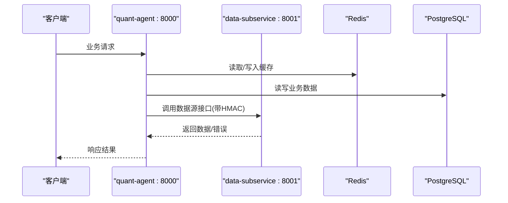
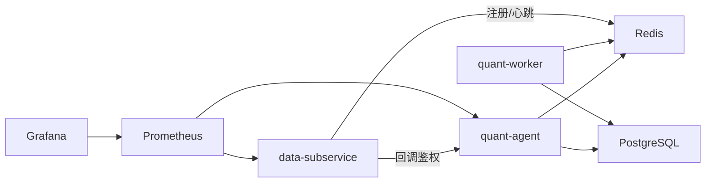

# 容器化部署

<cite>
**本文引用的文件**
- [Dockerfile](file://Dockerfile)
- [data_subservice/Dockerfile](file://data_subservice/Dockerfile)
- [frontend/Dockerfile](file://frontend/Dockerfile)
- [docker-compose.master.yml](file://docker-compose.master.yml)
- [docker-compose.node-s1.yml](file://docker-compose.node-s1.yml)
- [docker-compose.node-bj.yml](file://docker-compose.node-bj.yml)
- [prometheus.yml](file://prometheus.yml)
- [registry-config.yml](file://registry-config.yml)
- [DEPLOYMENT_CHECKLIST.md](file://DEPLOYMENT_CHECKLIST.md)
</cite>

## 目录
1. [简介](#简介)
2. [项目结构](#项目结构)
3. [核心组件](#核心组件)
4. [架构总览](#架构总览)
5. [详细组件分析](#详细组件分析)
6. [依赖关系分析](#依赖关系分析)
7. [性能与资源限制](#性能与资源限制)
8. [健康检查、日志与可观测性](#健康检查日志与可观测性)
9. [数据持久化策略](#数据持久化策略)
10. [Kubernetes 集群部署指南](#kubernetes-集群部署指南)
11. [故障排查指南](#故障排查指南)
12. [结论](#结论)

## 简介
本手册面向运维团队，提供 Quant Agent 的完整容器化部署方案。内容覆盖：
- Docker 镜像构建（多阶段构建、依赖优化、安全扫描）
- Docker Compose 编排（主节点 master 与从节点 node 的架构设计、服务依赖、网络配置）
- Kubernetes 部署（Deployment/Service/ConfigMap/Secret 等资源定义建议）
- 容器资源限制（CPU/内存上限，避免 OOM）
- 健康检查、日志收集与监控
- 数据持久化策略
- 常见故障排查

## 项目结构
Quant Agent 采用“主节点 + 分布式数据子服务”的容器化架构：
- 主节点（master）：运行后端 API（quant-agent）、后台任务（quant-worker）、Redis、PostgreSQL、可选 Prometheus/Grafana、私有镜像中转 Registry
- 数据子服务（node）：独立 FastAPI 进程，按地域/能力提供数据源 HTTP 接口（如 YFinance、Futu、AKShare、Tushare 等），通过 ServiceRegistry 向主服务注册并心跳保活
- 前端：静态站点由 Nginx 容器或 Cloudflare Pages 托管，不打包进后端镜像

图表来源
- [docker-compose.master.yml:16-255](file://docker-compose.master.yml#L16-L255)
- [docker-compose.node-s1.yml:28-143](file://docker-compose.node-s1.yml#L28-L143)
- [docker-compose.node-bj.yml:24-70](file://docker-compose.node-bj.yml#L24-L70)
- [prometheus.yml:16-43](file://prometheus.yml#L16-L43)

章节来源
- [docker-compose.master.yml:1-276](file://docker-compose.master.yml#L1-L276)
- [docker-compose.node-s1.yml:1-143](file://docker-compose.node-s1.yml#L1-L143)
- [docker-compose.node-bj.yml:1-70](file://docker-compose.node-bj.yml#L1-L70)

## 核心组件
- 后端 API（quant-agent）：FastAPI 应用，暴露业务 API，负责路由到数据子服务、管理缓存与数据库
- 后台任务（quant-worker）：异步任务执行器，依赖 Redis/PostgreSQL
- 数据子服务（data-subservice）：按 DS_CAPABILITIES 暴露数据源能力，支持心跳注册与熔断自愈
- 基础设施：Redis（缓存/队列/心跳）、PostgreSQL（持久化）、Prometheus/Grafana（监控）、私有 Registry（镜像加速）

章节来源
- [docker-compose.master.yml:76-164](file://docker-compose.master.yml#L76-L164)
- [docker-compose.node-s1.yml:33-127](file://docker-compose.node-s1.yml#L33-L127)
- [docker-compose.node-bj.yml:24-66](file://docker-compose.node-bj.yml#L24-L66)

## 架构总览
主节点承载核心业务与基础设施；数据子服务按地域/能力拆分，通过 Tailscale 内网与主节点通信，不对公网暴露敏感端口。监控栈按需启用（monitoring profile）。

图表来源
- [docker-compose.master.yml:76-120](file://docker-compose.master.yml#L76-L120)
- [docker-compose.node-s1.yml:42-69](file://docker-compose.node-s1.yml#L42-L69)
- [docker-compose.node-bj.yml:33-53](file://docker-compose.node-bj.yml#L33-L53)

## 详细组件分析

### 镜像构建与优化（后端主镜像）
- 多阶段构建：第一阶段使用 python:3.11-slim 安装 uv 并同步生产依赖；第二阶段仅复制 .venv 与必要源码，剔除构建工具与测试代码，显著缩小镜像体积
- 依赖优化：使用国内 PyPI 镜像加速；uv sync 失败自动重试；仅安装运行时系统库（libgomp1、libstdc++6）
- 启动参数：workers=2，HTTP 引擎 httptools，超时与并发控制可调
- 安全扫描建议：在 CI 中集成 Trivy/Grype 对最终镜像进行漏洞扫描，阻断高危 CVE 发布

章节来源
- [Dockerfile:1-60](file://Dockerfile#L1-L60)

### 镜像构建与优化（数据子服务镜像）
- 多阶段构建：builder 阶段安装 uv 并同步全量 datasource-all 依赖；运行阶段清理 pycache/egg-info/tests 等冗余
- 运行时能力隔离：DS_CAPABILITIES 控制可用数据源，未声明的能力返回 503
- 启动参数：默认 workers=1，监听 8001

章节来源
- [data_subservice/Dockerfile:1-72](file://data_subservice/Dockerfile#L1-L72)

### 前端镜像（Nginx 静态站点）
- 构建阶段：Node 20 + pnpm 安装依赖并构建产物
- 运行阶段：nginx:alpine 托管 dist 目录，暴露 80

章节来源
- [frontend/Dockerfile:1-22](file://frontend/Dockerfile#L1-L22)

### 主节点编排（Master）
- 服务组成：redis、postgres、quant-agent、quant-worker、可选 prometheus/grafana、私有 registry
- 网络：自定义 bridge 网络 quant-internal，服务间通过服务名通信
- 端口暴露：仅 8000 对外（Cloudflare Pages 回调），其余绑定 loopback/Tailscale IP
- 依赖关系：quant-agent/worker 依赖 redis/postgres 健康后启动
- 资源限制：为各服务设置 memory/cpu limits 与 reservations，防止单点 OOM 拖垮宿主

章节来源
- [docker-compose.master.yml:16-255](file://docker-compose.master.yml#L16-L255)

### 从节点编排（Node）
- 本地从节点（node-s1）：与主服务同机部署 data-subservice，监听 8001，通过 host.docker.internal 访问宿主的 Futu OpenD 与 Redis（需固定网关地址）
- 远程从节点（node-bj/s2/s3/s4）：通过 Tailscale 内网暴露 8001，仅内网可达
- 环境变量：DS_NODE_ID、DS_REGION、DS_CAPABILITIES、DATA_SOURCE_HMAC_SECRET、DATA_SOURCE_ALLOWED_IPS 等
- 网络：独立 quant-net 桥接网络，必要时加入 master 项目的 quant-internal 外部网络以直连主服务

章节来源
- [docker-compose.node-s1.yml:28-143](file://docker-compose.node-s1.yml#L28-L143)
- [docker-compose.node-bj.yml:24-70](file://docker-compose.node-bj.yml#L24-L70)

### 监控与指标采集
- Prometheus 抓取 fastapi-app（:8000）与 data-subservice（:8001）的指标端点
- Grafana 仪表盘与告警规则通过 provisioning 挂载
- 可选 profile 启动 monitoring 栈

章节来源
- [prometheus.yml:16-43](file://prometheus.yml#L16-L43)
- [docker-compose.master.yml:197-251](file://docker-compose.master.yml#L197-L251)

### 私有镜像中转 Registry
- 仅绑定 loopback + Tailscale IP，不暴露公网
- 开启 delete 以便 GC 回收空间，配合定时脚本清理
- 跨域节点通过 insecure-registries 拉取镜像

章节来源
- [registry-config.yml:1-22](file://registry-config.yml#L1-L22)
- [docker-compose.master.yml:166-195](file://docker-compose.master.yml#L166-L195)

## 依赖关系分析
- 运行时依赖：quant-agent/worker 依赖 Redis/PostgreSQL；data-subservice 依赖数据源 SDK（按 DS_CAPABILITIES 加载）
- 网络依赖：子服务通过 Tailscale 与主节点通信；本地子服务通过 host.docker.internal 访问宿主服务
- 监控依赖：Prometheus 抓取 /metrics 与 /metrics/circuit；Grafana 依赖 Prometheus

图表来源
- [docker-compose.master.yml:76-164](file://docker-compose.master.yml#L76-L164)
- [docker-compose.node-s1.yml:42-69](file://docker-compose.node-s1.yml#L42-L69)
- [prometheus.yml:16-43](file://prometheus.yml#L16-L43)

## 性能与资源限制
- 主节点 API 并发与重启策略：limit-concurrency、limit-max-requests 控制并发与优雅重启，避免堆增长导致 OOM
- 资源上限：为每个服务设置 memory/cpu limits 与 reservations，确保关键服务优先调度
- 子服务能力隔离：DS_CAPABILITIES 减少不必要依赖加载，降低内存占用
- 镜像瘦身：多阶段构建、清理 pycache/测试代码、仅安装运行时系统库

章节来源
- [docker-compose.master.yml:76-129](file://docker-compose.master.yml#L76-L129)
- [docker-compose.master.yml:158-164](file://docker-compose.master.yml#L158-L164)
- [data_subservice/Dockerfile:56-67](file://data_subservice/Dockerfile#L56-L67)

## 健康检查、日志与可观测性
- 健康检查：
  - Redis：redis-cli ping
  - PostgreSQL：pg_isready
  - quant-agent：HTTP /api/v1/health
  - data-subservice：HTTP /health
  - Prometheus/Grafana：内置健康端点
- 日志：
  - 容器标准输出（stdout/stderr）
  - 可结合 Loki/ELK 集中收集（需额外部署）
- 可观测性：
  - Prometheus 抓取应用指标与熔断指标
  - Grafana 展示面板与告警
  - 可选 OpenTelemetry（当前默认关闭）

章节来源
- [docker-compose.master.yml:30-35](file://docker-compose.master.yml#L30-L35)
- [docker-compose.master.yml:60-65](file://docker-compose.master.yml#L60-L65)
- [docker-compose.master.yml:110-115](file://docker-compose.master.yml#L110-L115)
- [docker-compose.node-s1.yml:105-110](file://docker-compose.node-s1.yml#L105-L110)
- [docker-compose.node-bj.yml:54-59](file://docker-compose.node-bj.yml#L54-L59)
- [prometheus.yml:16-43](file://prometheus.yml#L16-L43)

## 数据持久化策略
- Redis：AOF 开启，数据卷挂载至持久化目录
- PostgreSQL：数据目录挂载至持久化卷
- 应用数据：backend/data 目录挂载至持久化卷
- 监控数据：Prometheus/Grafana 数据卷持久化
- 镜像仓库：Registry 数据卷持久化

章节来源
- [docker-compose.master.yml:27-29](file://docker-compose.master.yml#L27-L29)
- [docker-compose.master.yml:58-59](file://docker-compose.master.yml#L58-L59)
- [docker-compose.master.yml:116-118](file://docker-compose.master.yml#L116-L118)
- [docker-compose.master.yml:204-209](file://docker-compose.master.yml#L204-L209)
- [docker-compose.master.yml:234-236](file://docker-compose.master.yml#L234-L236)
- [docker-compose.master.yml:180-182](file://docker-compose.master.yml#L180-L182)

## Kubernetes 集群部署指南
以下为基于现有 Compose 资源的 K8s 资源定义建议（概念性说明，便于迁移）：
- Deployment
  - quant-agent：副本数 1~2，探针 liveness/readiness 指向 /api/v1/health，资源限制参考 Compose
  - quant-worker：副本数 1，资源限制参考 Compose
  - data-subservice：按地域/能力部署多个副本，资源限制参考 Compose
  - Redis/PostgreSQL：建议使用 StatefulSet 或托管数据库
  - Prometheus/Grafana：建议使用官方 Helm Chart
- Service
  - quant-agent：ClusterIP/LoadBalancer，暴露 8000
  - data-subservice：ClusterIP，暴露 8001（仅内网）
  - Redis/PostgreSQL：ClusterIP
- ConfigMap
  - 非敏感配置（如监控抓取目标、功能开关）
- Secret
  - 数据库密码、Redis 密码、HMAC 密钥、LLM/数据源 API Key 等
- Ingress
  - 暴露 quant-agent 对外入口（HTTPS 终止于 Ingress Controller）
- 存储
  - 使用 PVC 持久化 Redis/PostgreSQL/Grafana/Prometheus 数据
- 健康检查
  - 使用 HTTP GET 探针，路径与 Compose 一致
- 资源限制
  - requests/limits 与 Compose 的 reservations/limits 对应

注意：以上为通用实践建议，具体实现需结合集群版本、存储类与网络插件调整。

## 故障排查指南
- 子服务 403 回调鉴权失败
  - 检查 DATA_SOURCE_HMAC_SECRET 在主/子节点是否完全一致
  - 检查时间同步（NTP），时差超过阈值会拒绝
  - 确认请求头包含 HMAC 签名
- 子服务镜像拉取慢或被拒
  - 使用主节点私有 Registry 中转，并在节点 docker daemon 配置 insecure-registries
  - 校验镜像命名空间与 tag
- 前端登录态过期或面板空白
  - 检查 VITE_API_BASE_URL 是否指向正确的 API 域名
- 本地子服务无法连接宿主服务（Futu/Redis）
  - 确认 host.docker.internal 映射到正确网关
  - 确认宿主服务监听地址与端口可达
- 监控无数据
  - 检查 Prometheus targets 是否可达
  - 检查 /metrics 与 /metrics/circuit 端点是否正常

章节来源
- [DEPLOYMENT_CHECKLIST.md:310-347](file://DEPLOYMENT_CHECKLIST.md#L310-L347)
- [DEPLOYMENT_CHECKLIST.md:349-368](file://DEPLOYMENT_CHECKLIST.md#L349-L368)
- [DEPLOYMENT_CHECKLIST.md:371-387](file://DEPLOYMENT_CHECKLIST.md#L371-L387)
- [docker-compose.node-s1.yml:55-78](file://docker-compose.node-s1.yml#L55-L78)
- [prometheus.yml:16-43](file://prometheus.yml#L16-L43)

## 结论
Quant Agent 的容器化方案通过多阶段构建与依赖优化实现了轻量镜像；通过 Compose 编排实现了主从分离、内网通信与安全暴露；通过 Prometheus/Grafana 提供了基础可观测性；通过持久化卷保障了数据安全。结合本文提供的 K8s 迁移建议与故障排查清单，运维团队可快速完成本地开发、测试与生产环境的部署与维护。
