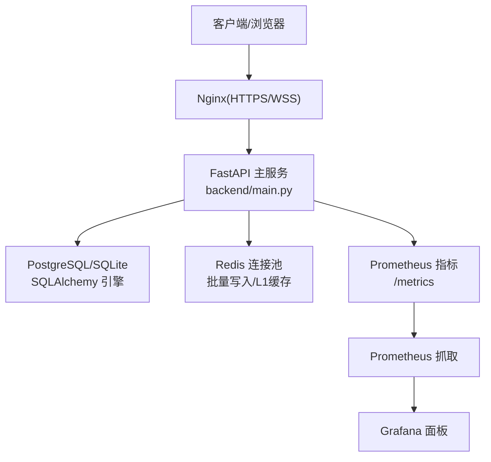
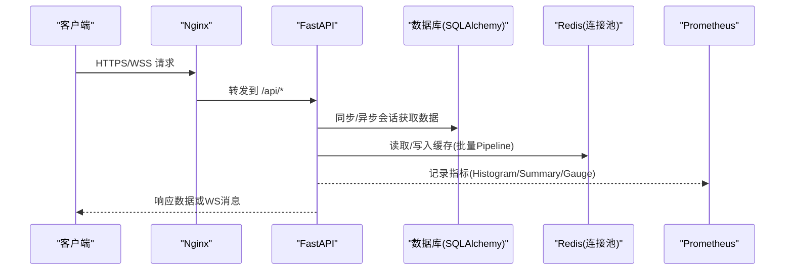
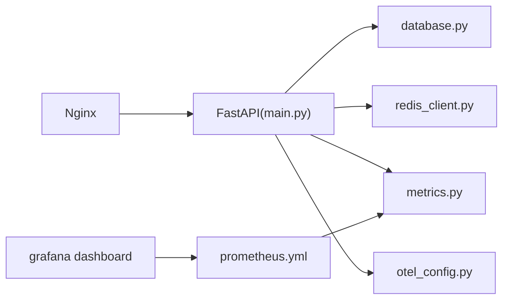

# 性能调优

<cite>
**本文引用的文件**
- [backend/core/config.py](file://backend/core/config.py)
- [backend/core/database.py](file://backend/core/database.py)
- [backend/core/redis_client.py](file://backend/core/redis_client.py)
- [quant.conf](file://quant.conf)
- [backend/main.py](file://backend/main.py)
- [backend/core/metrics.py](file://backend/core/metrics.py)
- [backend/core/otel_config.py](file://backend/core/otel_config.py)
- [prometheus.yml](file://prometheus.yml)
- [grafana/provisioning/dashboards/quant-agent-dashboard.json](file://grafana/provisioning/dashboards/quant-agent-dashboard.json)
</cite>

## 目录
1. [简介](#简介)
2. [项目结构](#项目结构)
3. [核心组件](#核心组件)
4. [架构总览](#架构总览)
5. [详细组件分析](#详细组件分析)
6. [依赖关系分析](#依赖关系分析)
7. [性能考量](#性能考量)
8. [故障排查指南](#故障排查指南)
9. [结论](#结论)
10. [附录](#附录)

## 简介
本文件面向开发与运维团队，提供 Quant Agent 的性能调优指南与最佳实践。内容覆盖应用层（Python 进程参数、并发连接、内存）、数据库（PostgreSQL 参数、索引、查询优化）、缓存（Redis 配置、命中率提升、热点数据）、网络（连接池、超时、负载均衡）以及监控（瓶颈识别、指标解读、容量规划）。所有建议均基于仓库中的实际实现与配置进行说明，确保可落地、可验证。

## 项目结构
Quant Agent 后端采用 FastAPI 作为网关入口，通过模块化路由组织业务；基础设施集中在 core 包中，包括配置、数据库、Redis、指标与可观测性；Nginx 作为反向代理处理 HTTPS 与 WebSocket；Prometheus + Grafana 负责指标采集与可视化。

图表来源
- [backend/main.py:125-218](file://backend/main.py#L125-L218)
- [backend/core/database.py:10-25](file://backend/core/database.py#L10-L25)
- [backend/core/redis_client.py:22-34](file://backend/core/redis_client.py#L22-L34)
- [prometheus.yml:16-43](file://prometheus.yml#L16-L43)
- [grafana/provisioning/dashboards/quant-agent-dashboard.json:1-200](file://grafana/provisioning/dashboards/quant-agent-dashboard.json#L1-L200)

章节来源
- [backend/main.py:125-218](file://backend/main.py#L125-L218)
- [backend/core/database.py:10-25](file://backend/core/database.py#L10-L25)
- [backend/core/redis_client.py:22-34](file://backend/core/redis_client.py#L22-L34)
- [prometheus.yml:16-43](file://prometheus.yml#L16-L43)
- [grafana/provisioning/dashboards/quant-agent-dashboard.json:1-200](file://grafana/provisioning/dashboards/quant-agent-dashboard.json#L1-L200)

## 核心组件
- 配置中心：集中管理环境变量与校验，保证关键配置缺失时快速失败。
- 数据库层：同步与异步双引擎，支持 SQLite 与 PostgreSQL，连接池参数可调。
- 缓存层：Redis 连接池、异步批量写入、进程内 L1 短效缓存，降低网络开销。
- 网络层：Nginx 反向代理，WebSocket 透传与长连接超时优化。
- 可观测性：OpenTelemetry 自动埋点、Prometheus 指标定义与采集、Grafana 面板。

章节来源
- [backend/core/config.py:20-134](file://backend/core/config.py#L20-L134)
- [backend/core/database.py:10-67](file://backend/core/database.py#L10-L67)
- [backend/core/redis_client.py:22-252](file://backend/core/redis_client.py#L22-L252)
- [quant.conf:16-79](file://quant.conf#L16-L79)
- [backend/core/otel_config.py:220-303](file://backend/core/otel_config.py#L220-L303)
- [backend/core/metrics.py:18-641](file://backend/core/metrics.py#L18-L641)

## 架构总览
下图展示请求从 Nginx 进入 FastAPI，再访问数据库与 Redis 的完整链路，并标注了关键性能点（连接池、超时、批处理、指标埋点）。

图表来源
- [quant.conf:42-79](file://quant.conf#L42-L79)
- [backend/main.py:125-218](file://backend/main.py#L125-L218)
- [backend/core/database.py:10-67](file://backend/core/database.py#L10-L67)
- [backend/core/redis_client.py:22-177](file://backend/core/redis_client.py#L22-L177)
- [backend/core/metrics.py:18-150](file://backend/core/metrics.py#L18-L150)

## 详细组件分析

### 应用层性能优化（Python 进程参数、并发连接、内存）
- 进程与线程
  - 全局默认 Socket 超时设置，避免底层阻塞导致线程死锁风险。
  - 进程级线程水位指标，便于发现线程耗尽问题。
- 并发与中间件
  - CORS 与访问日志中间件顺序影响预检请求处理，需保持正确顺序以避免额外开销。
  - 静态资源挂载减少前端重复请求。
- 内存使用
  - L1 本地缓存具备容量上限与过期清理任务，防止冷门 Key 堆积引发内存泄漏。
  - 批量写入队列合并多次 set，降低 TCP 往返与带宽占用。

章节来源
- [backend/main.py:25-26](file://backend/main.py#L25-L26)
- [backend/main.py:144-160](file://backend/main.py#L144-L160)
- [backend/main.py:212-218](file://backend/main.py#L212-L218)
- [backend/core/redis_client.py:180-252](file://backend/core/redis_client.py#L180-L252)
- [backend/core/metrics.py:595-619](file://backend/core/metrics.py#L595-L619)

### 数据库性能调优（PostgreSQL 参数、索引、查询）
- 连接池与引擎
  - 同步与异步引擎共享连接池参数：pool_size、max_overflow、pool_timeout、pool_recycle、pool_pre_ping。
  - SQLite 场景使用单文件模式，无需复杂连接池。
- 扩展与索引
  - 启动时自动创建 pgvector 与 pg_trgm 扩展，并为 tickers 表 symbol/name 建立 GIN 模糊匹配索引，加速搜索。
- 查询优化建议
  - 结合 pg_trgm 索引优化 LIKE/模糊查询；对高频过滤字段建立合适 B-tree 索引。
  - 使用 EXPLAIN ANALYZE 分析慢查询，关注扫描行数与索引命中。

章节来源
- [backend/core/database.py:10-25](file://backend/core/database.py#L10-L25)
- [backend/core/database.py:40-55](file://backend/core/database.py#L40-L55)
- [backend/main.py:37-55](file://backend/main.py#L37-L55)

### 缓存策略优化（Redis 配置、命中率、热点数据）
- 连接池与协议
  - 统一连接池上限 REDIS_MAX_CONNECTIONS，限制并发连接数，避免无上限打满。
  - 强制 RESP2 协议以兼容旧版 redis-py 行为。
- 批量写入与 L1 缓存
  - 异步批量写入器按时间窗口与批次大小聚合 set 操作，显著降低 RTT 与带宽。
  - 进程内 L1 缓存默认 TTL 短、容量有限，配合后台清理任务保障一致性且防内存泄漏。
- 命中率提升
  - 热点 Key 优先走 L1，未命中再穿透至 Redis；写路径先写远端再更新本地，保证强一致。
  - 针对行情快照等高频读场景，合理设置 TTL 与失效策略，避免陈旧数据。

章节来源
- [backend/core/redis_client.py:22-34](file://backend/core/redis_client.py#L22-L34)
- [backend/core/redis_client.py:37-177](file://backend/core/redis_client.py#L37-L177)
- [backend/core/redis_client.py:180-252](file://backend/core/redis_client.py#L180-L252)

### 网络性能优化（连接池、超时、负载均衡）
- Nginx 反向代理
  - HTTPS 启用 TLSv1.2/TLSv1.3，优化 SSL 会话缓存与超时。
  - WebSocket 路径透传 Upgrade/Connection 头，延长读写超时，关闭缓冲以降低延迟。
- 应用层超时
  - 全局 Socket 默认超时，避免阻塞调用拖垮线程。
- 负载均衡策略
  - 当前为单副本部署；未来多副本可通过 Nginx upstream 与健康检查实现水平扩展。

章节来源
- [quant.conf:16-79](file://quant.conf#L16-L79)
- [backend/main.py:25-26](file://backend/main.py#L25-L26)

### 监控系统性能分析（瓶颈识别、指标解读、容量规划）
- 指标体系
  - 行情延迟 Summary、K线获取 Histogram、WebSocket 活跃连接 Gauge、Redis 队列深度 Gauge、熔断状态 Gauge、客户端 Web Vitals 直方图等。
  - 数据源可用性、限流、拨测成功率与延迟分布，支撑外部依赖稳定性评估。
- 采集与可视化
  - Prometheus 每 5–15s 抓取 FastAPI 与子服务指标；Grafana 面板展示 QPS、P99 延迟等关键视图。
- 瓶颈识别
  - 通过 Summary/Histogram 分位数观察尾部延迟；对比 WS 连接数与消息丢弃计数定位背压。
  - 利用 Redis 错误计数器与队列深度判断缓存层压力。
- 容量规划
  - 根据 QPS、P99、连接数增长趋势，评估 CPU/内存/IO 瓶颈；结合线程水位与连接池参数调整扩容阈值。

章节来源
- [backend/core/metrics.py:18-641](file://backend/core/metrics.py#L18-L641)
- [prometheus.yml:16-43](file://prometheus.yml#L16-L43)
- [grafana/provisioning/dashboards/quant-agent-dashboard.json:1-200](file://grafana/provisioning/dashboards/quant-agent-dashboard.json#L1-L200)

## 依赖关系分析
FastAPI 主服务依赖数据库、Redis、指标与可观测性模块；Nginx 在入口处承担 HTTPS 与 WebSocket 代理职责；Prometheus 抓取后端暴露的指标，Grafana 消费数据进行可视化。

图表来源
- [backend/main.py:125-218](file://backend/main.py#L125-L218)
- [backend/core/database.py:10-67](file://backend/core/database.py#L10-L67)
- [backend/core/redis_client.py:22-177](file://backend/core/redis_client.py#L22-L177)
- [backend/core/metrics.py:18-150](file://backend/core/metrics.py#L18-L150)
- [backend/core/otel_config.py:220-303](file://backend/core/otel_config.py#L220-L303)
- [prometheus.yml:16-43](file://prometheus.yml#L16-L43)
- [grafana/provisioning/dashboards/quant-agent-dashboard.json:1-200](file://grafana/provisioning/dashboards/quant-agent-dashboard.json#L1-L200)

章节来源
- [backend/main.py:125-218](file://backend/main.py#L125-L218)
- [backend/core/database.py:10-67](file://backend/core/database.py#L10-L67)
- [backend/core/redis_client.py:22-177](file://backend/core/redis_client.py#L22-L177)
- [backend/core/metrics.py:18-150](file://backend/core/metrics.py#L18-L150)
- [backend/core/otel_config.py:220-303](file://backend/core/otel_config.py#L220-L303)
- [prometheus.yml:16-43](file://prometheus.yml#L16-L43)
- [grafana/provisioning/dashboards/quant-agent-dashboard.json:1-200](file://grafana/provisioning/dashboards/quant-agent-dashboard.json#L1-L200)

## 性能考量
- 应用层
  - 合理设置 Uvicorn workers 与 threads，结合线程水位指标动态调参。
  - 控制中间件链长度与复杂度，避免不必要的序列化与计算。
- 数据库
  - 根据负载调整 pool_size/max_overflow/pool_timeout；生产环境建议使用 PostgreSQL。
  - 充分利用 pg_trgm 与 B-tree 索引，定期分析慢查询并优化 SQL。
- 缓存
  - 设定合理的 REDIS_MAX_CONNECTIONS 与 L1 缓存容量；热点数据优先走 L1。
  - 使用批量写入与 Pipeline 降低网络开销，监控队列深度与错误率。
- 网络
  - Nginx 开启 HTTP/2 与合适的 SSL 会话缓存；WebSocket 长连接需设置足够超时。
  - 应用层 Socket 默认超时保护，避免极端情况下的线程阻塞。
- 监控
  - 持续跟踪 QPS、P99、WS 连接数、Redis 错误与队列深度；结合 OTEL trace 定位慢调用。
  - 基于历史趋势做容量规划，预留冗余应对突发流量。

[本节为通用指导，不直接分析具体文件]

## 故障排查指南
- 常见问题定位
  - 高延迟：查看 API P99 延迟与 K线获取延迟直方图，结合 OTEL trace 定位慢步骤。
  - 缓存异常：检查 Redis 错误计数器与队列深度，确认批量写入是否成功。
  - 数据库连接：观察连接池使用情况与超时错误，必要时调整 pool_size 与 timeout。
  - WebSocket 断连：核对 Nginx 超时与 Upgrade 头透传，确认服务端心跳与重连逻辑。
- 工具与面板
  - Prometheus 抓取配置与 Grafana 面板用于实时监控；OTEL 导出可用于分布式追踪。
  - 使用系统健康接口与指标端点快速自检服务状态。

章节来源
- [backend/core/metrics.py:18-641](file://backend/core/metrics.py#L18-L641)
- [backend/core/otel_config.py:220-303](file://backend/core/otel_config.py#L220-L303)
- [prometheus.yml:16-43](file://prometheus.yml#L16-L43)
- [grafana/provisioning/dashboards/quant-agent-dashboard.json:1-200](file://grafana/provisioning/dashboards/quant-agent-dashboard.json#L1-L200)

## 结论
Quant Agent 在应用层、数据库、缓存、网络与监控方面已具备完善的性能基础。通过合理配置连接池、启用批量写入与 L1 缓存、优化 Nginx 与超时设置，并结合 Prometheus/Grafana/OTEL 进行持续观测，可有效识别瓶颈、提升吞吐与稳定性。建议在生产环境中逐步调优并建立容量规划机制，确保系统在高负载下仍保持低延迟与高可用。

[本节为总结性内容，不直接分析具体文件]

## 附录
- 关键环境变量参考
  - 数据库：DATABASE_URL、DB_POOL_SIZE、DB_MAX_OVERFLOW、DB_POOL_TIMEOUT
  - Redis：REDIS_HOST、REDIS_PORT、REDIS_PASSWORD、REDIS_MAX_CONNECTIONS
  - 应用：QUANT_ENV、ALLOWED_ORIGINS、MAIN_THREAD_WARN
  - 可观测性：OTEL_ENABLED、OTEL_SERVICE_NAME、OTEL_EXPORTER_OTLP_ENDPOINT、OTEL_SAMPLING_RATE
- 常用命令与脚本
  - 指标抓取与面板：查看 prometheus.yml 与 grafana 面板配置。
  - 健康检查：通过系统健康路由与 /metrics 端点验证服务状态。

章节来源
- [backend/core/config.py:20-134](file://backend/core/config.py#L20-L134)
- [backend/core/database.py:10-25](file://backend/core/database.py#L10-L25)
- [backend/core/redis_client.py:22-34](file://backend/core/redis_client.py#L22-L34)
- [backend/core/otel_config.py:111-118](file://backend/core/otel_config.py#L111-L118)
- [prometheus.yml:16-43](file://prometheus.yml#L16-L43)
- [grafana/provisioning/dashboards/quant-agent-dashboard.json:1-200](file://grafana/provisioning/dashboards/quant-agent-dashboard.json#L1-L200)