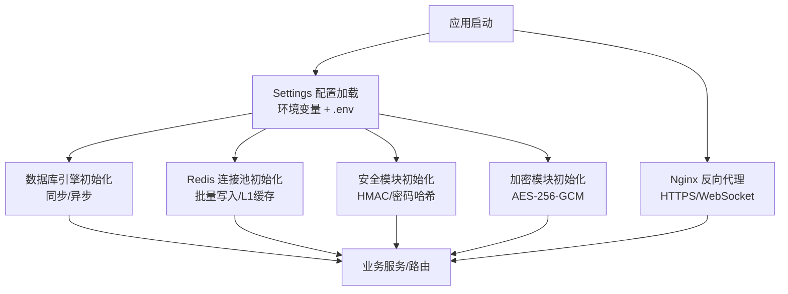
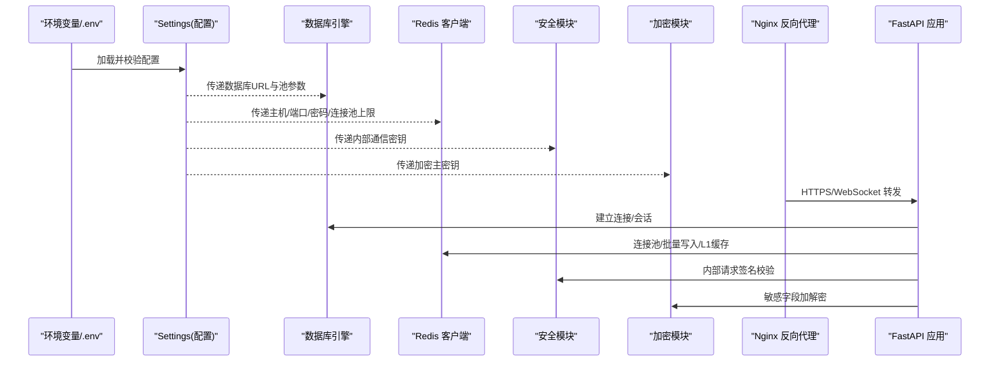
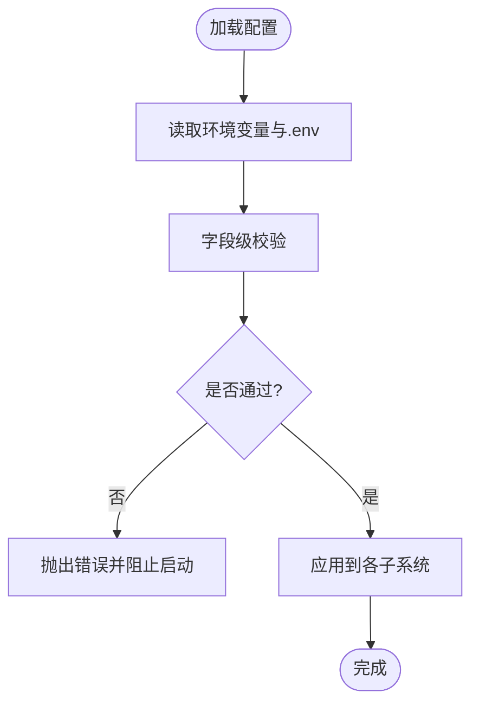
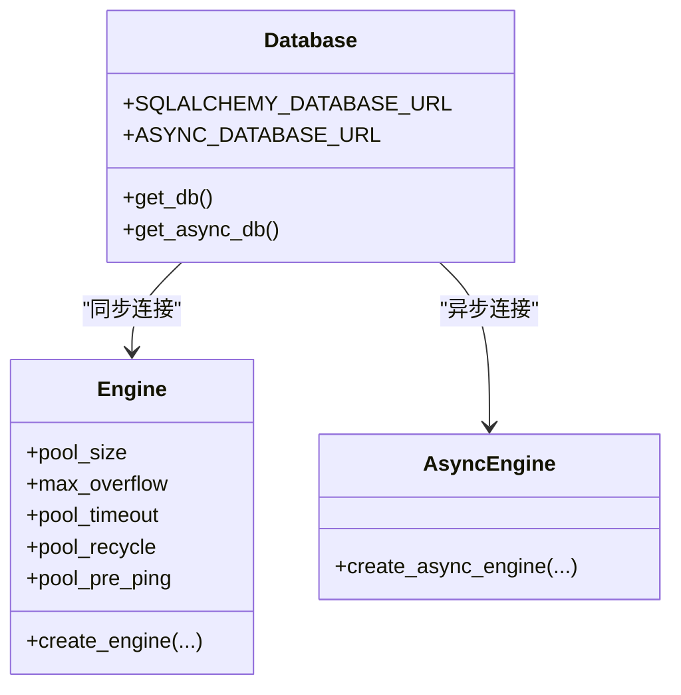
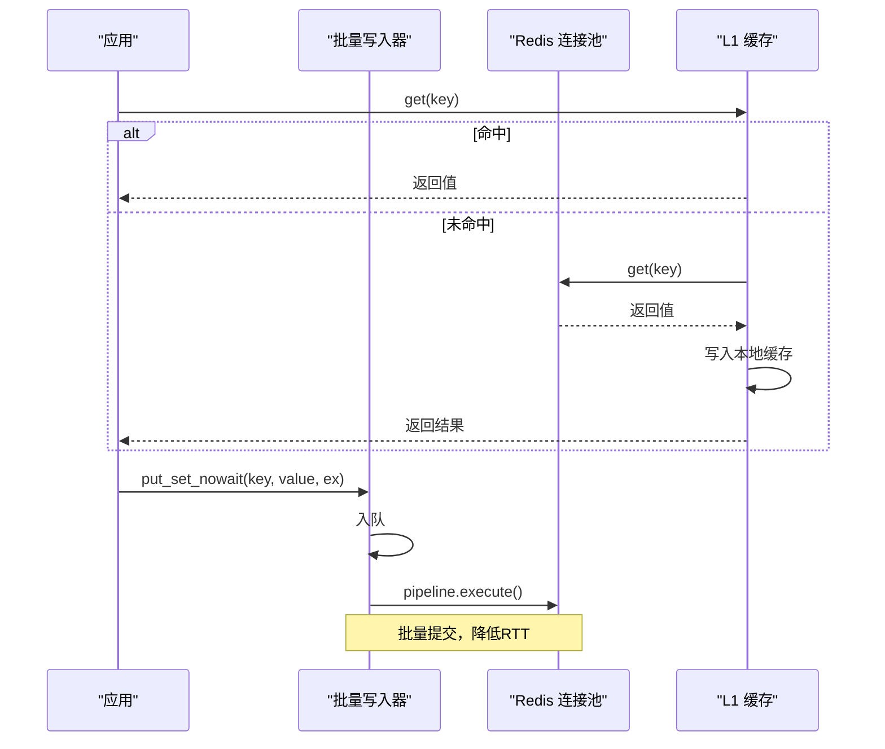
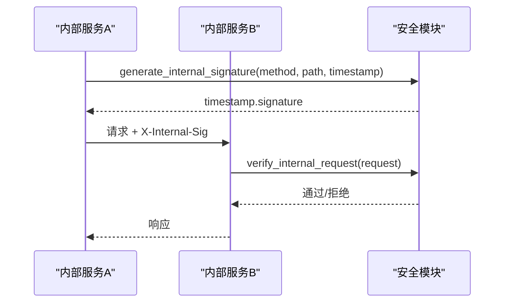
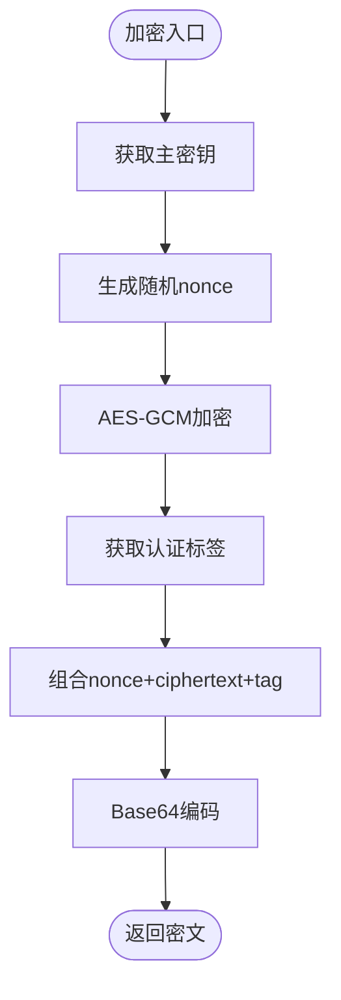
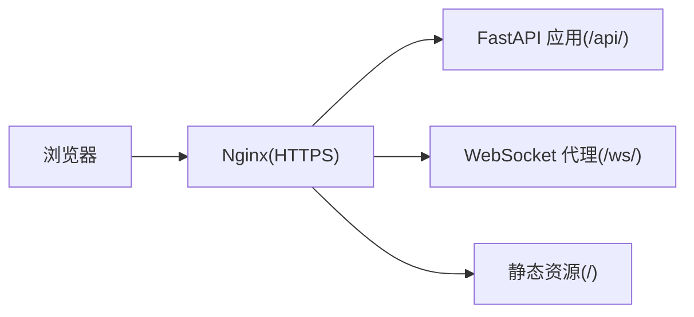
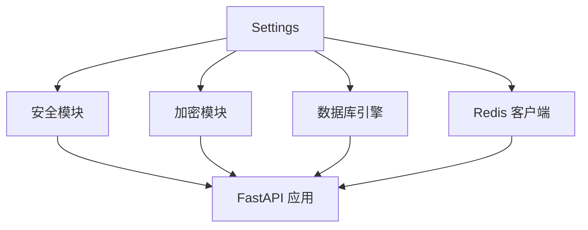

# 环境配置管理

<cite>
**本文引用的文件**
- [backend/core/config.py](file://backend/core/config.py)
- [backend/core/database.py](file://backend/core/database.py)
- [backend/core/redis_client.py](file://backend/core/redis_client.py)
- [backend/core/security.py](file://backend/core/security.py)
- [backend/core/encryption.py](file://backend/core/encryption.py)
- [quant.conf](file://quant.conf)
- [backend/tests/test_config.py](file://backend/tests/test_config.py)
- [backend/tests/test_redis_client.py](file://backend/tests/test_redis_client.py)
- [backend/tests/test_security.py](file://backend/tests/test_security.py)
- [backend/tests/test_encryption.py](file://backend/tests/test_encryption.py)
</cite>

## 目录
1. [简介](#简介)
2. [项目结构](#项目结构)
3. [核心组件](#核心组件)
4. [架构总览](#架构总览)
5. [详细组件分析](#详细组件分析)
6. [依赖关系分析](#依赖关系分析)
7. [性能考量](#性能考量)
8. [故障排查指南](#故障排查指南)
9. [结论](#结论)
10. [附录](#附录)

## 简介
本文件为 Quant Agent 的环境配置管理提供完整指南，覆盖环境变量、配置文件、敏感信息管理、验证机制、默认值与迁移策略，以及开发与运维的最佳实践。目标是帮助团队在不同环境中安全、稳定地部署和运行系统。

## 项目结构
Quant Agent 的配置体系围绕以下核心模块构建：
- 统一配置模型：通过 Pydantic Settings 集中声明并校验所有配置项与环境变量映射。
- 数据库连接：支持 SQLite 与 PostgreSQL/MySQL，连接池参数可配置化。
- Redis 客户端：连接池、批量写入队列、进程内 L1 缓存，均支持环境变量调优。
- 安全认证：内部通信 HMAC-SHA256 签名、密码哈希、请求头注入与校验。
- 敏感数据加密：AES-256-GCM 透明加解密，主密钥从配置读取。
- Nginx 反向代理：HTTPS、WebSocket 透传、超时与缓冲优化。

图表来源
- [backend/core/config.py:20-134](file://backend/core/config.py#L20-L134)
- [backend/core/database.py:7-67](file://backend/core/database.py#L7-L67)
- [backend/core/redis_client.py:11-35](file://backend/core/redis_client.py#L11-L35)
- [backend/core/security.py:20-160](file://backend/core/security.py#L20-L160)
- [backend/core/encryption.py:21-131](file://backend/core/encryption.py#L21-L131)
- [quant.conf:1-81](file://quant.conf#L1-L81)

章节来源
- [backend/core/config.py:20-134](file://backend/core/config.py#L20-L134)
- [backend/core/database.py:7-67](file://backend/core/database.py#L7-L67)
- [backend/core/redis_client.py:11-35](file://backend/core/redis_client.py#L11-L35)
- [backend/core/security.py:20-160](file://backend/core/security.py#L20-L160)
- [backend/core/encryption.py:21-131](file://backend/core/encryption.py#L21-L131)
- [quant.conf:1-81](file://quant.conf#L1-L81)

## 核心组件
- 配置模型（Settings）
  - 使用 Pydantic Settings v2 定义字段与环境变量别名，强制关键配置非空，并提供环境标识属性。
  - 包含数据库、Redis、LLM、嵌入模型、数据源 API Key、Futu OpenD、告警通道、内部通信密钥、加密主密钥等。
  - 提供字段级校验器，如数据库 URL 格式、嵌入 API Key 必填、实盘交易开关与 Futu 解锁密码的联动校验。
- 数据库连接
  - 优先读取 DATABASE_URL；未配置时降级为本地 SQLite。
  - 非 SQLite 场景下，连接池大小、溢出数、超时、回收、预检查均可通过环境变量配置。
  - 同时提供异步引擎与会话工厂，便于高并发场景。
- Redis 客户端
  - 全局连接池，支持密码、协议版本、最大连接数等配置。
  - 异步批量写入队列，降低高频 set 的网络开销与 RTT。
  - 进程内 L1 缓存，带容量保护与后台清理任务，避免内存泄漏。
- 安全认证
  - 内部通信 HMAC-SHA256 签名生成与验证，支持时间戳过期控制。
  - 密码 bcrypt 哈希与验证，轮次可通过环境变量调整。
  - FastAPI 依赖用于自动校验内部请求签名。
- 敏感数据加密
  - AES-256-GCM 透明加解密，主密钥从配置读取，支持十六进制或 Base64 输入。
  - 未配置主密钥时在开发环境发出警告并使用临时密钥；生产必须配置。
  - 提供新主密钥生成工具函数，便于轮换。

章节来源
- [backend/core/config.py:20-134](file://backend/core/config.py#L20-L134)
- [backend/core/database.py:7-67](file://backend/core/database.py#L7-L67)
- [backend/core/redis_client.py:11-35](file://backend/core/redis_client.py#L11-L35)
- [backend/core/security.py:20-160](file://backend/core/security.py#L20-L160)
- [backend/core/encryption.py:21-131](file://backend/core/encryption.py#L21-L131)

## 架构总览
下图展示配置加载到各子系统初始化的流程，以及 Nginx 作为入口的反向代理路径。

图表来源
- [backend/core/config.py:20-134](file://backend/core/config.py#L20-L134)
- [backend/core/database.py:7-67](file://backend/core/database.py#L7-L67)
- [backend/core/redis_client.py:11-35](file://backend/core/redis_client.py#L11-L35)
- [backend/core/security.py:20-160](file://backend/core/security.py#L20-L160)
- [backend/core/encryption.py:21-131](file://backend/core/encryption.py#L21-L131)
- [quant.conf:1-81](file://quant.conf#L1-L81)

## 详细组件分析

### 配置模型与优先级
- 配置来源与优先级
  - 环境变量优先于 .env 文件；Pydantic Settings 会按字段别名映射环境变量。
  - 允许额外环境变量（extra=ignore），增强扩展性。
- 字段校验与默认值
  - 数据库 URL 必须非空且以 sqlite:// 或 postgresql:// 开头。
  - 嵌入 API Key 必须配置。
  - 开启实盘交易时必须配置 Futu 解锁密码。
- 环境标识
  - 提供 development、production、testing 三种环境枚举，并通过属性判断当前环境。

图表来源
- [backend/core/config.py:20-134](file://backend/core/config.py#L20-L134)
- [backend/tests/test_config.py:53-126](file://backend/tests/test_config.py#L53-L126)

章节来源
- [backend/core/config.py:20-134](file://backend/core/config.py#L20-L134)
- [backend/tests/test_config.py:53-126](file://backend/tests/test_config.py#L53-L126)

### 数据库连接与连接池
- 连接字符串
  - 优先使用 DATABASE_URL；未设置时回退到本地 SQLite。
  - 支持 SQLite 与 PostgreSQL/MySQL 驱动切换。
- 连接池参数
  - 非 SQLite 场景下，可通过环境变量配置池大小、溢出数、超时、回收周期与预检查。
- 异步支持
  - 基于同步 URL 动态转换为异步驱动 URL，提供异步会话工厂。

图表来源
- [backend/core/database.py:7-67](file://backend/core/database.py#L7-L67)

章节来源
- [backend/core/database.py:7-67](file://backend/core/database.py#L7-L67)

### Redis 客户端与缓存策略
- 连接池
  - 全局连接池，支持密码、协议版本、最大连接数等配置。
- 批量写入
  - 异步队列 + Pipeline 批量写入，减少网络往返与带宽占用。
  - 优雅关闭确保积压数据全部刷新。
- 进程内 L1 缓存
  - 读路径先命中内存，未命中再穿透 Redis；写路径同步远端并更新本地。
  - 容量保护：超过上限时清空字典，避免内存泄漏。
  - 后台清理任务定期删除过期条目。

图表来源
- [backend/core/redis_client.py:11-35](file://backend/core/redis_client.py#L11-L35)
- [backend/core/redis_client.py:46-177](file://backend/core/redis_client.py#L46-L177)
- [backend/core/redis_client.py:184-252](file://backend/core/redis_client.py#L184-L252)

章节来源
- [backend/core/redis_client.py:11-35](file://backend/core/redis_client.py#L11-L35)
- [backend/core/redis_client.py:46-177](file://backend/core/redis_client.py#L46-L177)
- [backend/core/redis_client.py:184-252](file://backend/core/redis_client.py#L184-L252)
- [backend/tests/test_redis_client.py:31-575](file://backend/tests/test_redis_client.py#L31-L575)

### 安全认证与内部通信
- HMAC-SHA256 签名
  - 生成签名：方法+路径+时间戳，Base64 编码后附加时间戳。
  - 验证签名：解析头部、检查过期、重新计算并比较（防时序攻击）。
  - FastAPI 依赖：自动从请求头提取签名并校验。
- 密码哈希
  - bcrypt 哈希与验证，轮次可通过环境变量调整。
- 请求头注入
  - 为内部调用自动添加签名头，便于下游校验。

图表来源
- [backend/core/security.py:20-160](file://backend/core/security.py#L20-L160)
- [backend/tests/test_security.py:28-193](file://backend/tests/test_security.py#L28-L193)

章节来源
- [backend/core/security.py:20-160](file://backend/core/security.py#L20-L160)
- [backend/tests/test_security.py:28-193](file://backend/tests/test_security.py#L28-L193)

### 敏感数据加密
- 主密钥获取
  - 从配置读取 ENCRYPTION_MASTER_KEY，支持十六进制或 Base64。
  - 未配置时开发环境发出警告并使用临时密钥；生产必须配置。
- 加解密流程
  - AES-256-GCM 模式，随机 nonce，附带认证标签。
  - 密文格式：nonce + ciphertext + tag，整体 Base64 编码。
- 密钥轮换
  - 提供生成新主密钥的工具函数，便于定期轮换。

图表来源
- [backend/core/encryption.py:21-131](file://backend/core/encryption.py#L21-L131)
- [backend/tests/test_encryption.py:26-232](file://backend/tests/test_encryption.py#L26-L232)

章节来源
- [backend/core/encryption.py:21-131](file://backend/core/encryption.py#L21-L131)
- [backend/tests/test_encryption.py:26-232](file://backend/tests/test_encryption.py#L26-L232)

### Nginx 反向代理与 WebSocket
- HTTPS 与 HTTP 跳转
  - 监听 80 端口并重定向到 HTTPS。
  - 配置 TLS 协议、密码套件、会话缓存与票据策略。
- 代理规则
  - /api/ 与 /ws/ 分别代理到后端服务，透传 Upgrade/Connection 头。
  - 延长 WebSocket 超时，关闭缓冲以降低延迟。
- 前端静态资源
  - / 路径代理到本地服务，承载 SPA 静态资源。

图表来源
- [quant.conf:1-81](file://quant.conf#L1-L81)

章节来源
- [quant.conf:1-81](file://quant.conf#L1-L81)

## 依赖关系分析
- 配置依赖
  - Settings 被安全与加密模块引用，提供内部通信密钥与加密主密钥。
  - 数据库与 Redis 初始化依赖环境变量，Settings 提供统一字段定义。
- 运行时耦合
  - Redis 批量写入与 L1 缓存强依赖连接池配置。
  - 安全模块依赖 Settings 的内部密钥进行签名校验。
  - 加密模块依赖 Settings 的主密钥进行加解密。

图表来源
- [backend/core/config.py:20-134](file://backend/core/config.py#L20-L134)
- [backend/core/security.py:20-160](file://backend/core/security.py#L20-L160)
- [backend/core/encryption.py:21-131](file://backend/core/encryption.py#L21-L131)
- [backend/core/database.py:7-67](file://backend/core/database.py#L7-L67)
- [backend/core/redis_client.py:11-35](file://backend/core/redis_client.py#L11-L35)

章节来源
- [backend/core/config.py:20-134](file://backend/core/config.py#L20-L134)
- [backend/core/security.py:20-160](file://backend/core/security.py#L20-L160)
- [backend/core/encryption.py:21-131](file://backend/core/encryption.py#L21-L131)
- [backend/core/database.py:7-67](file://backend/core/database.py#L7-L67)
- [backend/core/redis_client.py:11-35](file://backend/core/redis_client.py#L11-L35)

## 性能考量
- 数据库连接池
  - 根据负载调整池大小、溢出数与超时，启用预检查提升健壮性。
- Redis 批量写入
  - 使用 Pipeline 批量提交，显著降低 RTT；合理设置批次大小与刷新间隔。
- L1 缓存
  - 对热点配置或开关进行进程内缓存，减少网络开销；注意容量保护与过期清理。
- WebSocket 代理
  - 关闭缓冲、延长超时，保障行情 Tick 的低延迟传输。

[本节为通用性能建议，不直接分析具体文件]

## 故障排查指南
- 配置缺失或非法
  - 数据库 URL 为空或格式不正确将导致启动失败；检查 DATABASE_URL。
  - 嵌入 API Key 未配置将触发校验失败；检查 EMBEDDING_API_KEY。
  - 开启实盘交易但未配置 Futu 解锁密码将报错；检查 REAL_TRADE_EXECUTE 与 FUTU_PWD_UNLOCK。
- Redis 连接问题
  - 连接池耗尽或密码错误会导致写入失败；检查 REDIS_HOST、REDIS_PORT、REDIS_PASSWORD、REDIS_MAX_CONNECTIONS。
  - 批量写入异常会打印错误日志；关注 Pipeline 执行失败信息。
- 内部通信签名失败
  - 缺少 X-Internal-Sig 头或签名过期/不匹配将返回 401；检查时间戳与密钥一致性。
- 加密失败
  - 密文篡改或密钥错误将抛出认证失败异常；检查 ENCRYPTION_MASTER_KEY 与密文完整性。
- Nginx 代理问题
  - WebSocket 握手失败通常因未透传 Upgrade/Connection；检查 /ws/ 与 /api/ 的代理配置。

章节来源
- [backend/core/config.py:94-119](file://backend/core/config.py#L94-L119)
- [backend/core/redis_client.py:155-177](file://backend/core/redis_client.py#L155-L177)
- [backend/core/security.py:121-160](file://backend/core/security.py#L121-L160)
- [backend/core/encryption.py:95-131](file://backend/core/encryption.py#L95-L131)
- [quant.conf:39-79](file://quant.conf#L39-L79)

## 结论
Quant Agent 的配置体系以 Settings 为中心，结合数据库、Redis、安全与加密模块，形成一致、可校验、可扩展的环境配置方案。通过环境变量与 .env 文件管理不同环境的差异，配合 Nginx 反向代理实现安全的对外暴露。遵循本文的最佳实践与故障排查方法，可有效提升系统的稳定性与安全性。

[本节为总结性内容，不直接分析具体文件]

## 附录

### 环境变量清单与用途
- 环境与基础
  - QUANT_ENV：运行环境（development/production/testing）
  - INTERNAL_API_SECRET：内部通信共享密钥
  - BCRYPT_ROUNDS：密码哈希轮次
- 数据库
  - DATABASE_URL：数据库连接字符串
  - DB_POOL_SIZE、DB_MAX_OVERFLOW、DB_POOL_TIMEOUT：连接池参数（非 SQLite）
- Redis
  - REDIS_HOST、REDIS_PORT、REDIS_PASSWORD：连接信息
  - REDIS_MAX_CONNECTIONS：连接池上限
  - L1_CACHE_MAX_SIZE：进程内 L1 缓存最大容量
- LLM 与嵌入
  - LLM_API_KEY、LLM_BASE_URL、LLM_MODEL、LLM_PRO_MODEL
  - LLM_LIGHTWEIGHT_MODEL、LLM_OLLAMA_BASE_URL、LLM_FALLBACK_ENABLED、LLM_FALLBACK_THRESHOLD
  - OPENAI_API_KEY、EMBEDDING_API_KEY、EMBEDDING_BASE_URL、EMBEDDING_MODEL、EMBEDDING_DIM
- 数据源与第三方
  - FINNHUB_API_KEY、AKSHARE_API_KEY、FRED_API_KEY
  - EM_SOURCE_PRIORITY：新兴市场源优先级
- Futu OpenD
  - FUTU_HOST、FUTU_PORT、FUTU_TRD_ENV、FUTU_PWD_UNLOCK
- 告警
  - TELEGRAM_BOT_TOKEN、TELEGRAM_CHAT_ID、SERVERCHAN_SENDKEY、FEISHU_WEBHOOK_URL
- 加密
  - ENCRYPTION_MASTER_KEY：AES-256 主密钥（十六进制或 Base64）

章节来源
- [backend/core/config.py:28-93](file://backend/core/config.py#L28-L93)
- [backend/core/database.py:7-25](file://backend/core/database.py#L7-L25)
- [backend/core/redis_client.py:14-32](file://backend/core/redis_client.py#L14-L32)
- [backend/core/security.py:20-34](file://backend/core/security.py#L20-L34)
- [backend/core/encryption.py:21-55](file://backend/core/encryption.py#L21-L55)

### 配置文件结构与热重载
- quant.conf
  - Nginx 反向代理配置，包含 HTTPS、WebSocket 透传、超时与缓冲优化。
- 热重载机制
  - 当前配置通过 Settings 在进程启动时加载；如需运行时热重载，可在应用层实现配置变更监听与重新初始化相关子系统的逻辑（例如重启连接池或刷新缓存）。

章节来源
- [quant.conf:1-81](file://quant.conf#L1-L81)
- [backend/core/config.py:20-26](file://backend/core/config.py#L20-L26)

### 不同环境的最佳实践
- 开发环境
  - 使用 SQLite 与本地 Redis；可省略部分第三方 API Key。
  - 允许使用临时加密主密钥，但需明确风险。
- 测试环境
  - 使用独立数据库与 Redis；配置最小必要的外部依赖。
  - 启用严格的配置校验，确保测试覆盖边界条件。
- 生产环境
  - 强制配置 DATABASE_URL、EMBEDDING_API_KEY、ENCRYPTION_MASTER_KEY。
  - 限制连接池上限，启用监控与告警。
  - 使用 HTTPS 与安全的 Nginx 配置，严格访问控制。

[本节为通用实践建议，不直接分析具体文件]

### 敏感信息管理
- 密钥轮换
  - 使用加密模块提供的工具函数生成新主密钥，并在配置中替换；必要时对历史数据进行迁移。
- 配置加密
  - 敏感字段建议使用 AES-256-GCM 加密存储；确保主密钥安全管理。
- 访问控制
  - 内部通信使用 HMAC-SHA256 签名；仅授权服务可发起调用。
  - 生产环境禁用调试与多余日志，限制外部暴露面。

章节来源
- [backend/core/encryption.py:177-188](file://backend/core/encryption.py#L177-L188)
- [backend/core/security.py:37-160](file://backend/core/security.py#L37-L160)

### 配置验证与默认值管理
- 验证机制
  - 字段级校验器确保关键配置非空与格式正确。
  - 业务级校验（如实盘交易与 Futu 解锁密码）防止危险状态。
- 默认值管理
  - 可选字段提供合理默认值；必填字段无默认值，强制显式配置。

章节来源
- [backend/core/config.py:94-119](file://backend/core/config.py#L94-L119)

### 配置迁移策略
- 新增配置项
  - 在 Settings 中添加字段与环境变量别名，提供默认值或必填约束。
  - 更新文档与测试用例，确保向后兼容。
- 废弃配置项
  - 保留旧字段一段时间并发出弃用警告；逐步引导迁移到新字段。
- 数据迁移
  - 若涉及加密主密钥变更，需提供迁移脚本与回滚方案。

[本节为通用迁移建议，不直接分析具体文件]