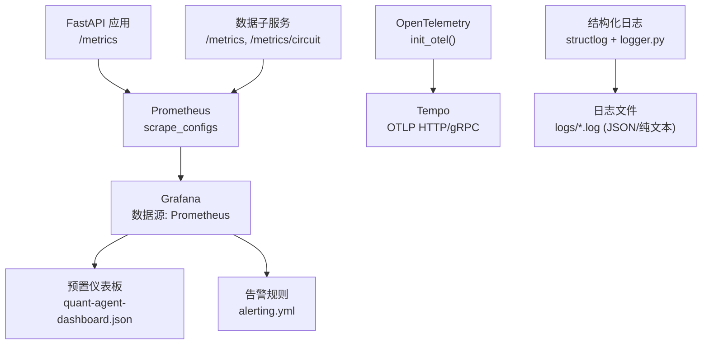
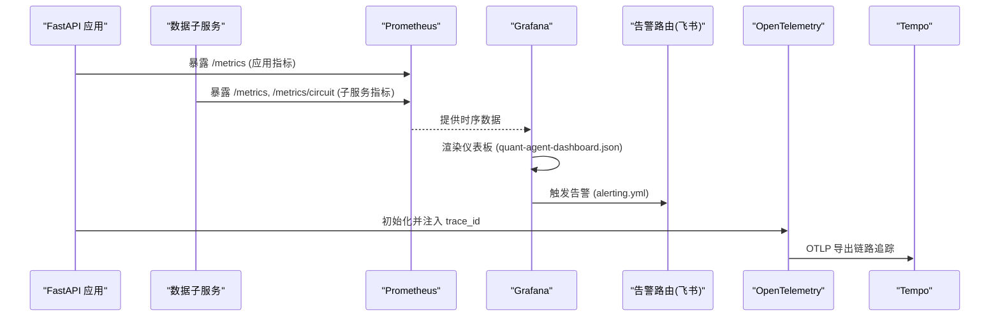
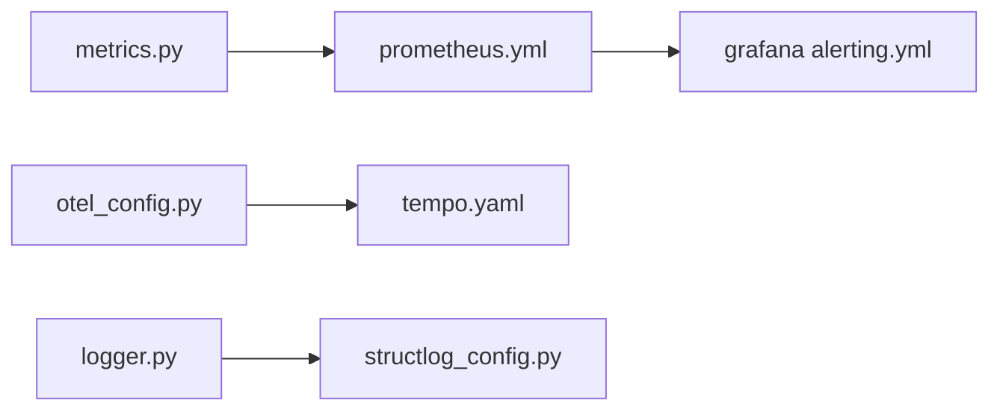

# 监控告警配置

<cite>
**本文引用的文件**
- [prometheus.yml](file://prometheus.yml)
- [config/prometheus_rules.yml](file://config/prometheus_rules.yml)
- [backend/core/metrics.py](file://backend/core/metrics.py)
- [grafana/provisioning/datasources/prometheus.yml](file://grafana/provisioning/datasources/prometheus.yml)
- [grafana/provisioning/alerting/alerting.yml](file://grafana/provisioning/alerting/alerting.yml)
- [grafana/provisioning/dashboards/dashboard.yml](file://grafana/provisioning/dashboards/dashboard.yml)
- [quant-agent-dashboard.json](file://quant-agent-dashboard.json)
- [backend/core/otel_config.py](file://backend/core/otel_config.py)
- [tempo/tempo.yaml](file://tempo/tempo.yaml)
- [backend/core/logger.py](file://backend/core/logger.py)
- [backend/core/structlog_config.py](file://backend/core/structlog_config.py)
</cite>

## 目录
1. [简介](#简介)
2. [项目结构](#项目结构)
3. [核心组件](#核心组件)
4. [架构总览](#架构总览)
5. [详细组件分析](#详细组件分析)
6. [依赖关系分析](#依赖关系分析)
7. [性能考虑](#性能考虑)
8. [故障排查指南](#故障排查指南)
9. [结论](#结论)
10. [附录](#附录)

## 简介
本文件为 Quant Agent 的监控与告警体系提供完整配置与运维指南，覆盖 Prometheus 指标采集、Grafana 仪表板与告警、日志收集与分析、分布式追踪与存储策略，以及日常运维操作建议。目标是帮助运维团队快速搭建并稳定运行可观测性体系，确保业务指标、系统资源与异常检测全面可视、可控、可追溯。

## 项目结构
Quant Agent 的可观测性由以下关键部分组成：
- 指标采集：Prometheus 抓取 FastAPI 应用与数据子服务指标；自定义指标在应用内定义并通过 /metrics 暴露。
- 可视化与告警：Grafana 通过 provision 自动导入数据源、仪表板与告警规则；支持飞书 Webhook 通知。
- 日志与追踪：结构化 JSON 日志输出到文件，OpenTelemetry 生成 trace_id 并可导出至 Tempo。
- 数据存储：Prometheus 时序数据、Tempo 链路追踪、日志文件按天轮转保留。

图表来源
- [prometheus.yml:16-43](file://prometheus.yml#L16-L43)
- [grafana/provisioning/datasources/prometheus.yml:1-10](file://grafana/provisioning/datasources/prometheus.yml#L1-L10)
- [grafana/provisioning/dashboards/dashboard.yml:1-12](file://grafana/provisioning/dashboards/dashboard.yml#L1-L12)
- [backend/core/otel_config.py:220-302](file://backend/core/otel_config.py#L220-L302)
- [tempo/tempo.yaml:1-25](file://tempo/tempo.yaml#L1-L25)
- [backend/core/logger.py:129-207](file://backend/core/logger.py#L129-L207)
- [backend/core/structlog_config.py:111-180](file://backend/core/structlog_config.py#L111-L180)

章节来源
- [prometheus.yml:16-43](file://prometheus.yml#L16-L43)
- [grafana/provisioning/datasources/prometheus.yml:1-10](file://grafana/provisioning/datasources/prometheus.yml#L1-L10)
- [grafana/provisioning/dashboards/dashboard.yml:1-12](file://grafana/provisioning/dashboards/dashboard.yml#L1-L12)
- [backend/core/otel_config.py:220-302](file://backend/core/otel_config.py#L220-L302)
- [tempo/tempo.yaml:1-25](file://tempo/tempo.yaml#L1-L25)
- [backend/core/logger.py:129-207](file://backend/core/logger.py#L129-L207)
- [backend/core/structlog_config.py:111-180](file://backend/core/structlog_config.py#L111-L180)

## 核心组件
- 指标定义与暴露：应用内集中定义指标（行情延迟、WebSocket 连接、Redis 队列深度、熔断器状态、客户端 APM 心跳、数据源限流、数据质量、分布式节点等），统一通过 /metrics 暴露给 Prometheus。
- 采集配置：Prometheus 配置了 fastapi-app 与 data-subservice 两个 job，分别抓取主服务与子服务的指标端点。
- 记录规则：提供 FMP watchlist 突变检测的 recording rules，用于多副本场景下的聚合计算与告警解耦。
- 可视化与告警：Grafana 通过 provision 自动注入 Prometheus 数据源、预置仪表板与告警规则；告警通过飞书 Webhook 推送。
- 日志与追踪：结构化日志以 JSON 写入文件，便于 ELK/Loki 聚合；OpenTelemetry 自动注入 trace_id，支持 OTLP 导出到 Tempo。

章节来源
- [backend/core/metrics.py:1-641](file://backend/core/metrics.py#L1-L641)
- [prometheus.yml:16-43](file://prometheus.yml#L16-L43)
- [config/prometheus_rules.yml:1-95](file://config/prometheus_rules.yml#L1-L95)
- [grafana/provisioning/alerting/alerting.yml:1-463](file://grafana/provisioning/alerting/alerting.yml#L1-L463)
- [backend/core/otel_config.py:220-302](file://backend/core/otel_config.py#L220-L302)
- [backend/core/logger.py:129-207](file://backend/core/logger.py#L129-L207)
- [backend/core/structlog_config.py:111-180](file://backend/core/structlog_config.py#L111-L180)

## 架构总览
下图展示了从指标采集到可视化与告警的整体流程，以及日志与追踪的集成方式。

图表来源
- [prometheus.yml:16-43](file://prometheus.yml#L16-L43)
- [quant-agent-dashboard.json:1-200](file://quant-agent-dashboard.json#L1-L200)
- [grafana/provisioning/alerting/alerting.yml:60-463](file://grafana/provisioning/alerting/alerting.yml#L60-L463)
- [backend/core/otel_config.py:220-302](file://backend/core/otel_config.py#L220-L302)
- [tempo/tempo.yaml:1-25](file://tempo/tempo.yaml#L1-L25)

## 详细组件分析

### Prometheus 指标采集配置
- 抓取目标与频率
  - fastapi-app：每 5 秒抓取一次，兼容容器与宿主机地址。
  - data-subservice：每 15 秒抓取熔断面板 /metrics/circuit 与业务指标 /metrics。
- 认证与路径
  - 主服务使用 basic_auth 访问 /metrics。
  - 子服务独立 registry，通过 /metrics 暴露 FMP_* 系列指标。
- 记录规则挂载
  - 当前未启用 rule_files；未来多副本时可启用 config/prometheus_rules.yml 进行 server 端聚合计算。

章节来源
- [prometheus.yml:16-43](file://prometheus.yml#L16-L43)
- [config/prometheus_rules.yml:1-95](file://config/prometheus_rules.yml#L1-L95)

### 自定义指标定义与性能监控点
- 应用指标分类
  - 行情数据：延迟 Summary、新鲜度 Gauge、总量 Counter、K线获取延迟 Histogram。
  - WebSocket：活跃连接数、消息发送/丢弃计数、订阅总数。
  - Redis：队列深度、操作延迟 Summary、错误计数。
  - 熔断器：状态 Gauge、转换次数 Counter。
  - 客户端 APM：心跳 Counter、Web Vitals Histogram（LCP/CLS/INP/TTFB）。
  - 数据源：延迟 Histogram、错误 Counter、限流 Counter、可用性 Gauge。
  - 主动拨测：成功率 Gauge、延迟 Histogram、总次数与失败次数 Counter。
  - Facade 聚合：融合调用次数、报价偏差告警次数。
  - LLM/Agent：请求延迟 Histogram、Token 消耗 Counter、Tool 调用 Counter。
  - Futu OpenD：连接状态、重连次数与失败、重连耗时 Histogram。
  - K线缓存：命中 Counter、查询延迟 Histogram。
  - 数据质量：脏数据率、完整率、累计记录/异常/缺失字段/价格异常/时间戳过期、平均延迟、质量等级、校验次数。
  - 分布式节点：心跳时间戳、节点状态、存活数量、failover/429/STALE 降级计数。
  - Finnhub WS：实时价命中/降级计数与命中率。
  - FMP collector：批次执行、标的缓存/失败、批次耗时、最后批次时间、子服务不可达、watchlist 空/大小、突变计数、文件删除事件。
  - 进程线程水位：线程数与阈值 Gauge。
  - WebScrape：抓取尝试与失败计数（反爬拦截/内容过短/http错误）。
- 性能监控点建议
  - 对关键路径（行情快照、K线查询、Redis 操作、LLM 请求）使用 Histogram/Summary 记录分位数。
  - 对限流、配额耗尽、IP 封禁等事件使用 Counter 统计速率。
  - 对可用性、连接状态、队列深度使用 Gauge 实时监控。

章节来源
- [backend/core/metrics.py:1-641](file://backend/core/metrics.py#L1-L641)

### Grafana 仪表板配置
- 数据源配置
  - 通过 provisioning 自动注入 Prometheus 数据源（默认、代理模式）。
- 预置仪表板导入
  - dashboard.yml 指定文件提供者，自动扫描 /etc/grafana/provisioning/dashboards。
  - quant-agent-dashboard.json 包含 API QPS 与 P99 延迟面板示例。
- 自定义图表创建
  - 基于 Prometheus 表达式构建时间序列图、直方图分位数、计数器速率等。
  - 结合标签维度（endpoint、source、symbol）进行分组与过滤。

章节来源
- [grafana/provisioning/datasources/prometheus.yml:1-10](file://grafana/provisioning/datasources/prometheus.yml#L1-L10)
- [grafana/provisioning/dashboards/dashboard.yml:1-12](file://grafana/provisioning/dashboards/dashboard.yml#L1-L12)
- [quant-agent-dashboard.json:1-200](file://quant-agent-dashboard.json#L1-L200)

### 告警规则配置
- 业务指标告警
  - API P95 延迟超过阈值（critical）。
  - 数据源限流频率飙升、长时间退避、配额耗尽、IP 被封禁（critical/warning）。
  - 数据质量脏数据率超阈值（warning）。
- 系统资源告警
  - Redis 内存使用率过高（warning）。
  - 熔断器打开（critical）。
  - 分布式节点心跳超时、YF 存活节点不足或全部宕机、CN-AKShare 节点断连（critical/warning）。
  - STALE 缓存降级频率过高（warning）。
- 异常检测规则
  - Futu OpenD 连接断开（critical）。
  - FMP watchlist 突变检测（通过 recording rule 或 exporter Counter 组合判定）。
- 通知渠道
  - 飞书 Webhook 作为主要接收器；支持日志记录备用通道。
  - 告警分组与重复间隔按 severity 分级控制。

章节来源
- [grafana/provisioning/alerting/alerting.yml:60-463](file://grafana/provisioning/alerting/alerting.yml#L60-L463)
- [config/prometheus_rules.yml:53-95](file://config/prometheus_rules.yml#L53-L95)

### 日志收集与分析方案
- 结构化日志格式
  - structlog 将 trace_id、symbol、latency_ms 注入每条日志；生产环境输出 JSON 行，开发环境彩色 key=value。
  - 文件输出经 QueueListener 异步落盘，避免阻塞主流程。
- 日志聚合
  - 日志文件按级别拆分（debug/info/warning/error），按天轮转并保留 30 天。
  - 可通过 ELK/Loki 采集 JSON 日志进行检索与分析。
- 搜索查询建议
  - 使用 trace_id 关联请求全链路。
  - 使用 symbol 过滤特定标的相关日志。
  - 使用 latency_ms 定位慢请求。

章节来源
- [backend/core/structlog_config.py:111-180](file://backend/core/structlog_config.py#L111-L180)
- [backend/core/logger.py:129-207](file://backend/core/logger.py#L129-L207)

### 分布式追踪与存储策略
- OpenTelemetry 配置
  - 自动注入 trace_id，支持 W3C Trace Context 传播。
  - 可选导出到 OTLP（Grafana Tempo / 云 APM），采样率可配置。
- Tempo 存储
  - 本地后端存储，WAL 与 blocks 路径可配置，块保留时长 48h。
- 历史数据保留
  - Prometheus 保留策略由部署配置决定；日志文件按天轮转保留 30 天；Tempo 块保留 48h。

章节来源
- [backend/core/otel_config.py:220-302](file://backend/core/otel_config.py#L220-L302)
- [tempo/tempo.yaml:1-25](file://tempo/tempo.yaml#L1-L25)
- [backend/core/logger.py:146-163](file://backend/core/logger.py#L146-L163)

## 依赖关系分析
- 组件耦合
  - Prometheus 依赖应用暴露 /metrics；Grafana 依赖 Prometheus 数据源；告警规则依赖具体指标名称与标签。
  - OpenTelemetry 依赖环境变量与可选 SDK；Tempo 依赖 OTLP 端点。
  - 日志系统依赖 QueueListener 与 TimedRotatingFileHandler。
- 外部依赖
  - 飞书 Webhook 用于告警通知。
  - 数据子服务通过独立 registry 暴露指标，需确保网络可达。
- 潜在循环依赖
  - 无直接代码级循环依赖；但需注意 recording rule 与 exporter Counter 的双路径切换时避免混淆真相源。

图表来源
- [backend/core/metrics.py:1-641](file://backend/core/metrics.py#L1-L641)
- [prometheus.yml:16-43](file://prometheus.yml#L16-L43)
- [grafana/provisioning/alerting/alerting.yml:60-463](file://grafana/provisioning/alerting/alerting.yml#L60-L463)
- [backend/core/otel_config.py:220-302](file://backend/core/otel_config.py#L220-L302)
- [tempo/tempo.yaml:1-25](file://tempo/tempo.yaml#L1-L25)
- [backend/core/logger.py:129-207](file://backend/core/logger.py#L129-L207)
- [backend/core/structlog_config.py:111-180](file://backend/core/structlog_config.py#L111-L180)

章节来源
- [backend/core/metrics.py:1-641](file://backend/core/metrics.py#L1-L641)
- [prometheus.yml:16-43](file://prometheus.yml#L16-L43)
- [grafana/provisioning/alerting/alerting.yml:60-463](file://grafana/provisioning/alerting/alerting.yml#L60-L463)
- [backend/core/otel_config.py:220-302](file://backend/core/otel_config.py#L220-L302)
- [tempo/tempo.yaml:1-25](file://tempo/tempo.yaml#L1-L25)
- [backend/core/logger.py:129-207](file://backend/core/logger.py#L129-L207)
- [backend/core/structlog_config.py:111-180](file://backend/core/structlog_config.py#L111-L180)

## 性能考虑
- 指标粒度与桶配置
  - 合理设置 Histogram buckets，避免过多桶导致存储压力；对高频指标使用 Summary 或 Histogram 分位数。
- 抓取频率
  - 主服务 5s 抓取提升实时性；子服务 15s 抓取平衡负载。
- 记录规则
  - 多副本场景启用 recording rules 降低 exporter 侧计数基数放大风险。
- 日志落盘
  - 使用 QueueListener 异步落盘，避免阻塞主流程；按级别拆分减少单文件大小。
- 追踪采样
  - 根据流量调整 OTEL_SAMPLING_RATE，平衡成本与可观测性。

[本节为通用指导，不直接分析具体文件]

## 故障排查指南
- 指标不可用
  - 检查 Prometheus scrape 目标是否可达；确认 /metrics 端点返回正确指标。
  - 核对 basic_auth 与 metrics_path 配置。
- 告警误报/漏报
  - 核对告警 expr 与阈值；确认 recording rule 是否启用且生效。
  - 检查飞书 Webhook URL 与签名配置。
- 日志缺失或格式异常
  - 确认 structlog 已配置并绑定到标准 logging；检查文件 handler 是否为 JSON 格式。
  - 验证 QueueListener 是否正常启动与停止。
- 追踪链路不完整
  - 检查 OTEL_ENABLED 与 OTEL_EXPORTER_OTLP_ENDPOINT；确认 Tempo 接收端点可用。

章节来源
- [prometheus.yml:16-43](file://prometheus.yml#L16-L43)
- [grafana/provisioning/alerting/alerting.yml:60-463](file://grafana/provisioning/alerting/alerting.yml#L60-L463)
- [backend/core/structlog_config.py:111-180](file://backend/core/structlog_config.py#L111-L180)
- [backend/core/logger.py:129-207](file://backend/core/logger.py#L129-L207)
- [backend/core/otel_config.py:220-302](file://backend/core/otel_config.py#L220-L302)

## 结论
Quant Agent 的监控告警体系以 Prometheus 为核心，结合 Grafana 可视化与告警、结构化日志与 OpenTelemetry 追踪，形成端到端的可观测性闭环。通过合理的指标定义、采集配置、记录规则与告警策略，能够有效保障业务稳定性与性能可观测性。建议在生产环境中启用 recording rules、优化抓取频率与采样率，并持续迭代仪表板与告警规则以适应业务变化。

[本节为总结，不直接分析具体文件]

## 附录
- 常用指标命名规范
  - 前缀区分模块（quant_market_*、quant_ws_*、quant_redis_*、quant_circuit_breaker_*、quant_client_*、quant_datasource_*、quant_dist_*、quant_fmp_collector_*）。
  - 类型后缀（_total、_seconds、_milliseconds、_bytes）。
  - 标签维度（source、symbol、endpoint、node_id、region、status 等）。
- 运维操作清单
  - 新增指标：在 metrics.py 定义并在业务路径埋点；更新 Prometheus 抓取配置（如需新端点）；在 Grafana 添加面板与告警。
  - 调整告警阈值：在 alerting.yml 修改 expr 与阈值；测试后重启 Grafana 或热加载。
  - 日志采集：确保 structlog 与 logger.py 配置生效；配置 ELK/Loki 采集 JSON 日志。
  - 追踪导出：配置 OTEL_* 环境变量；验证 Tempo 接收端点与采样率。

[本节为补充信息，不直接分析具体文件]