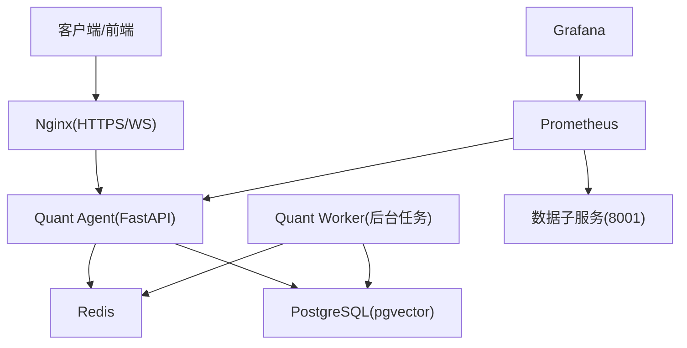
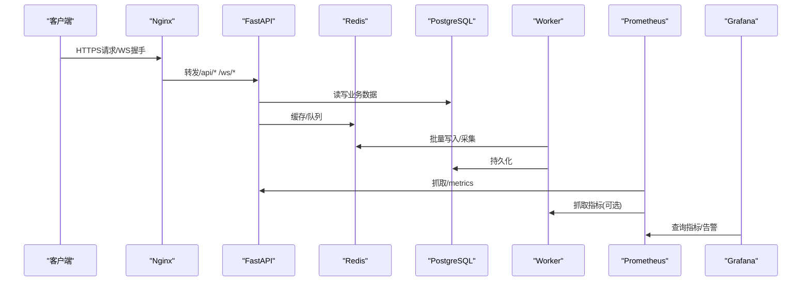
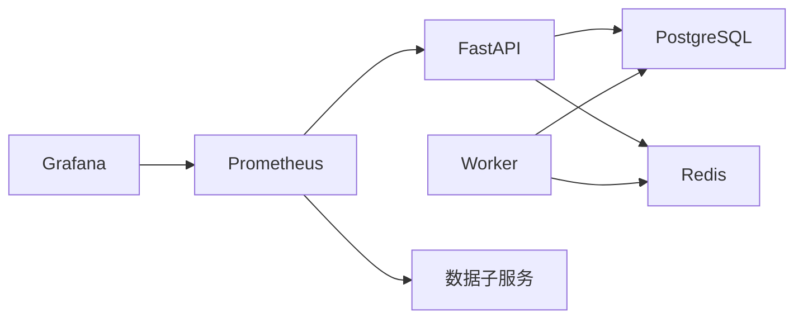
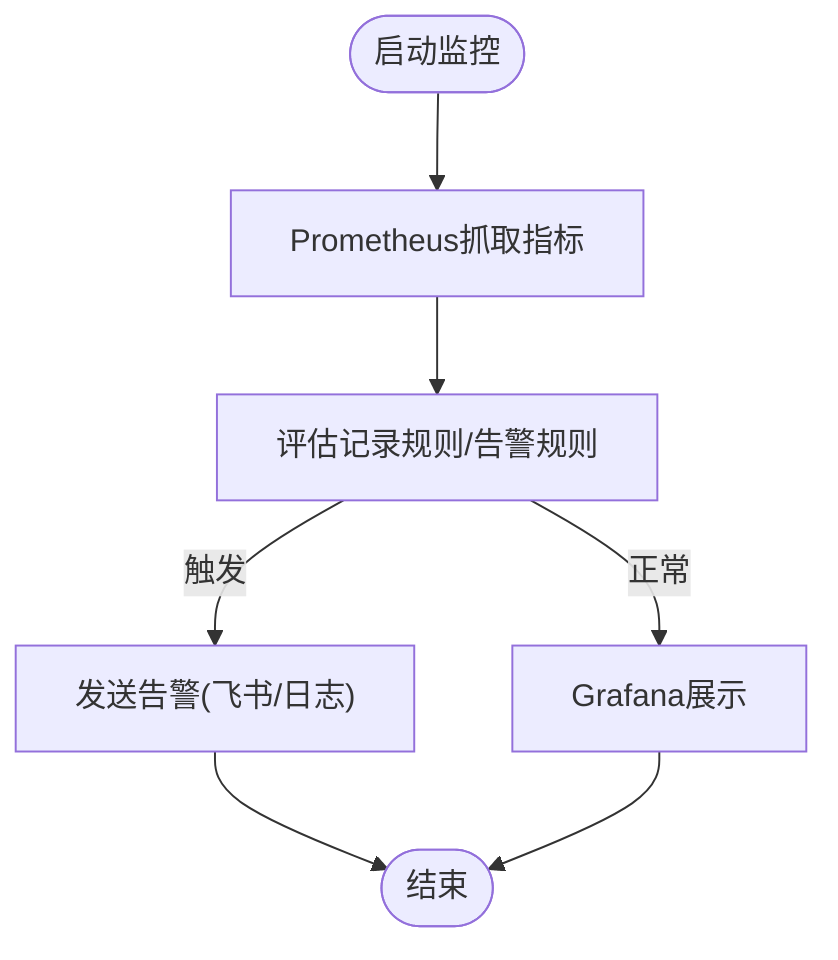

# 部署与运维

<cite>
**本文引用的文件**
- [Dockerfile](file://Dockerfile)
- [docker-compose.master.yml](file://docker-compose.master.yml)
- [quant.conf](file://quant.conf)
- [prometheus.yml](file://prometheus.yml)
- [dashboard.yml](file://dashboard.yml)
- [start.sh](file://start.sh)
- [backend/main.py](file://backend/main.py)
- [backend/worker.py](file://backend/worker.py)
- [backend/core/config.py](file://backend/core/config.py)
- [config/prometheus_rules.yml](file://config/prometheus_rules.yml)
- [grafana/provisioning/alerting/alerting.yml](file://grafana/provisioning/alerting/alerting.yml)
- [DEPLOYMENT_CHECKLIST.md](file://DEPLOYMENT_CHECKLIST.md)
</cite>

## 目录
1. [简介](#简介)
2. [项目结构](#项目结构)
3. [核心组件](#核心组件)
4. [架构总览](#架构总览)
5. [详细组件分析](#详细组件分析)
6. [依赖关系分析](#依赖关系分析)
7. [性能调优](#性能调优)
8. [监控与告警](#监控与告警)
9. [备份与恢复](#备份与恢复)
10. [生产环境部署指南](#生产环境部署指南)
11. [故障排查](#故障排查)
12. [结论](#结论)

## 简介
本手册面向Quant Agent的生产部署与运维，覆盖容器化构建、Docker Compose编排、Kubernetes集群部署思路、环境变量与安全密钥管理、负载均衡与反向代理、监控告警（Prometheus/Grafana）、备份恢复策略以及性能调优方法。文档基于仓库中的实际配置与代码实现进行说明，确保可落地执行。

## 项目结构
- 后端服务：FastAPI应用由Uvicorn启动，提供REST与WebSocket接口；后台任务通过独立Worker进程运行采集器与定时任务。
- 基础设施：Redis用于缓存与队列，PostgreSQL用于持久化数据（含向量扩展）。
- 监控：Prometheus抓取指标，Grafana提供仪表板与告警规则。
- 反向代理：Nginx将HTTPS流量转发到后端，并处理WebSocket升级。
- 镜像与编排：多阶段构建的Python镜像，Master节点Compose编排包含全部服务。

**图示来源**
- [docker-compose.master.yml:16-251](file://docker-compose.master.yml#L16-L251)
- [prometheus.yml:16-43](file://prometheus.yml#L16-L43)
- [quant.conf:1-81](file://quant.conf#L1-L81)

**章节来源**
- [docker-compose.master.yml:16-251](file://docker-compose.master.yml#L16-L251)
- [prometheus.yml:16-43](file://prometheus.yml#L16-L43)
- [quant.conf:1-81](file://quant.conf#L1-L81)

## 核心组件
- 应用入口与路由装配：FastAPI应用工厂加载中间件、CORS、OpenAPI、健康检查与各业务路由。
- 后台任务：Worker启动Redis批量写入、采集器守护进程及若干定时任务（如行情订阅、早报生成等），支持优雅关闭。
- 配置中心：Pydantic Settings集中校验必填项与环境变量，强制fail-fast。
- 镜像与启动：多阶段构建最小运行时镜像，暴露8000端口，默认单worker生产模式。

**章节来源**
- [backend/main.py:125-218](file://backend/main.py#L125-L218)
- [backend/worker.py:34-103](file://backend/worker.py#L34-L103)
- [backend/core/config.py:20-134](file://backend/core/config.py#L20-L134)
- [Dockerfile:1-60](file://Dockerfile#L1-L60)

## 架构总览
系统采用“主节点+子节点”的分布式数据源架构：
- 主节点承载API、数据库、缓存、监控与私有镜像中转Registry。
- 子节点按能力声明（如yfinance/akshare）接入主节点，通过Redis注册与心跳上报。
- Nginx作为统一入口，处理HTTPS与WebSocket透传。
- Prometheus/Grafana负责指标采集与可视化告警。

**图示来源**
- [quant.conf:39-79](file://quant.conf#L39-L79)
- [docker-compose.master.yml:76-164](file://docker-compose.master.yml#L76-L164)
- [prometheus.yml:16-43](file://prometheus.yml#L16-L43)

## 详细组件分析

### 容器镜像与启动
- 多阶段构建：第一阶段安装uv与依赖，第二阶段仅复制运行时依赖与源码，减小镜像体积。
- 运行时参数：默认以单worker模式运行，配合httptools与uvloop提升吞吐；生产建议根据负载调整workers与并发限制。
- 健康检查：通过HTTP健康端点探测服务就绪。

**章节来源**
- [Dockerfile:6-59](file://Dockerfile#L6-L59)
- [docker-compose.master.yml:76-130](file://docker-compose.master.yml#L76-L130)

### Docker Compose编排（Master节点）
- 服务清单：Redis、PostgreSQL、Quant Agent、Quant Worker、私有Registry、Prometheus、Grafana。
- 网络与存储：使用bridge网络隔离，外部卷持久化关键数据。
- 安全绑定：Redis/PG仅绑定内网或Tailscale IP，避免公网暴露。
- 资源限制：为各服务设置CPU与内存上限，防止宿主过载。

**章节来源**
- [docker-compose.master.yml:16-251](file://docker-compose.master.yml#L16-L251)

### Kubernetes集群部署（概念性步骤）
- 将Compose中的每个服务映射为Deployment/StatefulSet，使用ConfigMap/Secret注入环境变量与敏感信息。
- 使用Service暴露内部通信，Ingress/Nginx Ingress处理HTTPS与WebSocket。
- 使用PersistentVolume持久化PG/Redis数据。
- 使用HorizontalPodAutoscaler对API与Worker进行弹性伸缩。
- 使用NetworkPolicy限制跨Pod访问，遵循“仅内网可达”的安全原则。

[本节为概念性指导，不直接引用具体文件]

### 环境变量与密钥管理
- 数据库连接：DATABASE_URL、DB_USER、DB_PASSWORD、DB_NAME由Compose或.env注入。
- Redis连接：REDIS_HOST、REDIS_PORT、REDIS_PASSWORD需与容器密码一致。
- LLM与嵌入：LLM_*、EMBEDDING_*等第三方服务凭据。
- 数据源密钥：FINNHUB_API_KEY、FRED_API_KEY等。
- 安全密钥：INTERNAL_API_SECRET、ENCRYPTION_MASTER_KEY在所有节点保持一致，严禁提交至版本库。
- CORS与前端：ALLOWED_ORIGINS控制跨域；前端VITE_API_BASE_URL必须指向正确API域名。

**章节来源**
- [backend/core/config.py:28-92](file://backend/core/config.py#L28-L92)
- [DEPLOYMENT_CHECKLIST.md:65-82](file://DEPLOYMENT_CHECKLIST.md#L65-L82)

### 反向代理与负载均衡
- Nginx配置：HTTPS自动跳转、TLS优化、/api与/ws路径透传Upgrade头、关闭缓冲以降低延迟。
- 负载均衡：生产环境可在Nginx层对多个API实例做upstream轮询；或在K8s中通过Service与Ingress实现。

**章节来源**
- [quant.conf:1-81](file://quant.conf#L1-L81)

## 依赖关系分析
- 应用依赖：FastAPI依赖数据库与Redis；Worker依赖Redis与数据库。
- 监控依赖：Prometheus抓取API与子服务指标；Grafana依赖Prometheus数据源。
- 外部依赖：数据源API Key、LLM服务、搜索引擎等。

**图示来源**
- [docker-compose.master.yml:76-164](file://docker-compose.master.yml#L76-L164)
- [prometheus.yml:16-43](file://prometheus.yml#L16-L43)

**章节来源**
- [docker-compose.master.yml:76-164](file://docker-compose.master.yml#L76-L164)
- [prometheus.yml:16-43](file://prometheus.yml#L16-L43)

## 性能调优
- Uvicorn参数：生产建议使用单worker+高并发限制，结合limit-max-requests定期重启释放堆内存；启用uvloop与httptools。
- 数据库优化：启用pgvector与pg_trgm扩展，创建GIN索引加速模糊匹配；合理设置连接池与查询超时。
- 缓存策略：Redis用于热点数据与队列，注意Key过期与内存上限；批量写入降低写放大。
- 资源限制：为各容器设置CPU与内存上限，避免宿主过载；监控RSS与GC行为。
- 网络与代理：Nginx关闭缓冲、延长WS超时，减少首包延迟。

**章节来源**
- [docker-compose.master.yml:76-130](file://docker-compose.master.yml#L76-L130)
- [backend/main.py:32-55](file://backend/main.py#L32-L55)
- [quant.conf:39-79](file://quant.conf#L39-L79)

## 监控与告警
- 指标采集：Prometheus抓取FastAPI与数据子服务指标，支持自定义metrics_path与basic_auth。
- 记录规则：预留FMP watchlist突变检测的Recording Rules，未来多副本时启用以解耦副本数影响。
- 仪表板：Grafana预置Dashboard与数据源配置，便于快速观测。
- 告警规则：内置Futu连接、API延迟、Redis内存、熔断器、数据源限流、分布式节点心跳等告警，支持飞书Webhook通知。

**图示来源**
- [prometheus.yml:16-43](file://prometheus.yml#L16-L43)
- [config/prometheus_rules.yml:53-95](file://config/prometheus_rules.yml#L53-L95)
- [grafana/provisioning/alerting/alerting.yml:10-64](file://grafana/provisioning/alerting/alerting.yml#L10-L64)

**章节来源**
- [prometheus.yml:16-43](file://prometheus.yml#L16-L43)
- [config/prometheus_rules.yml:53-95](file://config/prometheus_rules.yml#L53-L95)
- [grafana/provisioning/alerting/alerting.yml:10-64](file://grafana/provisioning/alerting/alerting.yml#L10-L64)

## 备份与恢复
- 数据库备份：使用pg_dump或云厂商快照定期备份PostgreSQL数据；保留历史版本以便回滚。
- Redis备份：开启AOF持久化，定期拷贝dump文件或AOF日志；在Compose中已启用appendonly。
- 配置文件管理：.env与Nginx配置纳入版本控制之外的安全存储；变更需双人复核。
- 灾难恢复流程：
  - 停机维护窗口，停止相关服务。
  - 恢复PG与Redis数据至新实例。
  - 验证健康端点与关键功能。
  - 逐步放量，观察监控与告警。

**章节来源**
- [docker-compose.master.yml:17-74](file://docker-compose.master.yml#L17-L74)

## 生产环境部署指南
- 服务器准备：
  - 安装Docker与必要系统库；配置时区与NTP同步。
  - 开放必要端口（80/443对外，其他仅内网/Tailscale）。
- 服务启动：
  - 使用Compose一键拉起Master节点所有服务；启用monitoring profile获取Prometheus/Grafana。
  - 本地开发可使用start.sh脚本快速启动基础设施与前后端。
- 负载均衡配置：
  - Nginx作为统一入口，配置HTTPS证书与WebSocket透传。
  - 多实例部署时，Nginx upstream轮询或K8s Service负载均衡。
- 安全加固：
  - 所有节点保持INTERNAL_API_SECRET与ENCRYPTION_MASTER_KEY一致。
  - 限制Redis/PG端口仅内网可达；定期轮换API Keys。

**章节来源**
- [docker-compose.master.yml:16-251](file://docker-compose.master.yml#L16-L251)
- [start.sh:106-134](file://start.sh#L106-L134)
- [quant.conf:1-81](file://quant.conf#L1-L81)
- [DEPLOYMENT_CHECKLIST.md:88-135](file://DEPLOYMENT_CHECKLIST.md#L88-L135)

## 故障排查
- 常见连接问题：
  - Slave无法连接Master Redis：检查防火墙、安全组与监听地址。
  - 健康检查失败：查看容器日志，确认.env权限与变量注入。
- 集群状态异常：
  - 节点离线：检查Redis键空间与心跳上报。
  - 子服务返回403：核对HMAC密钥一致性与时钟同步（NTP）。
- 前端问题：
  - VITE_API_BASE_URL错配导致跨域拦截，需修正为正确API域名。
- 监控与告警：
  - 指标未采集：检查Prometheus targets与basic_auth。
  - 告警未触发：确认Grafana Contact Points与规则生效。

**章节来源**
- [DEPLOYMENT_CHECKLIST.md:277-388](file://DEPLOYMENT_CHECKLIST.md#L277-L388)
- [prometheus.yml:16-43](file://prometheus.yml#L16-L43)
- [grafana/provisioning/alerting/alerting.yml:10-64](file://grafana/provisioning/alerting/alerting.yml#L10-L64)

## 结论
Quant Agent在生产环境中通过容器化与编排实现了高可用与可扩展性。借助Nginx、Prometheus与Grafana构建了完整的可观测体系，并通过严格的配置校验与安全密钥管理保障稳定性。建议持续优化Uvicorn与数据库参数，完善备份与灾备流程，确保系统在峰值负载下的稳健运行。
