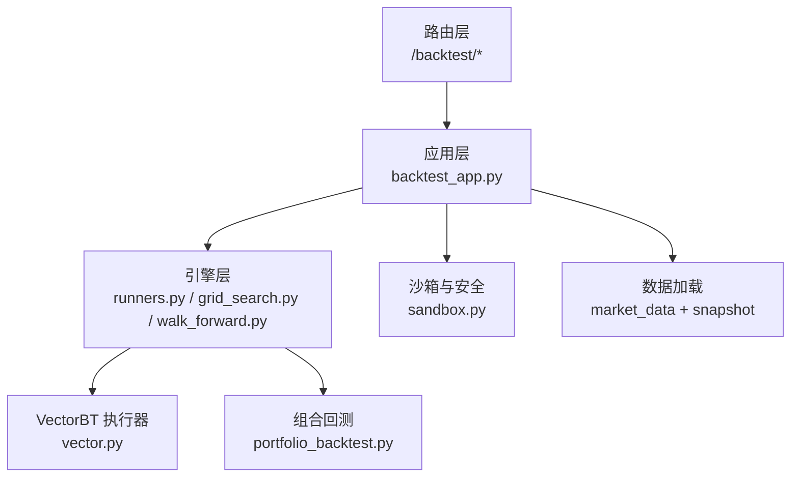
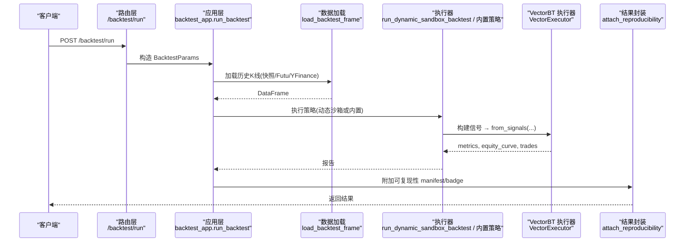
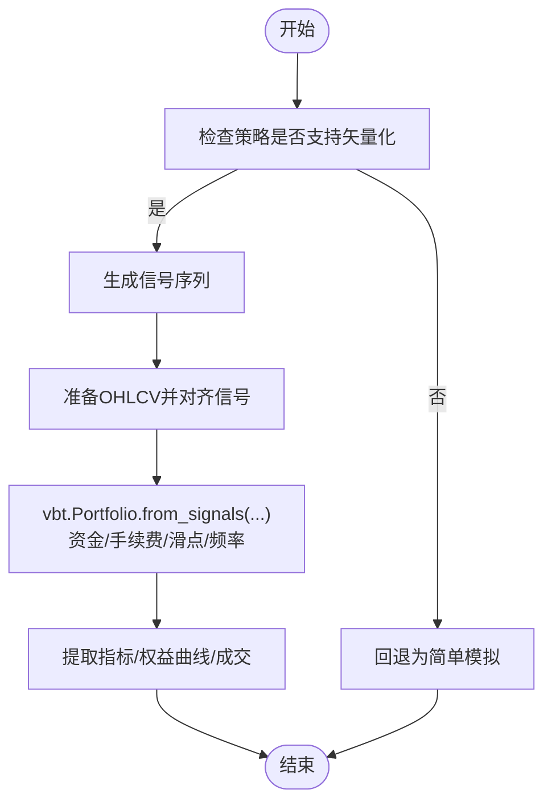
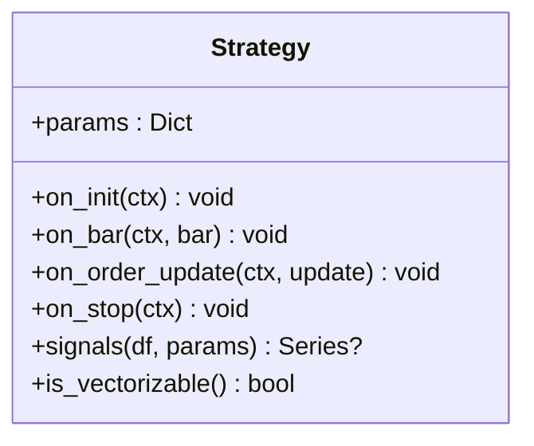
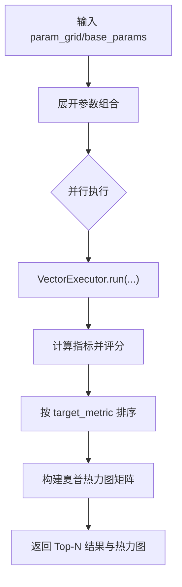
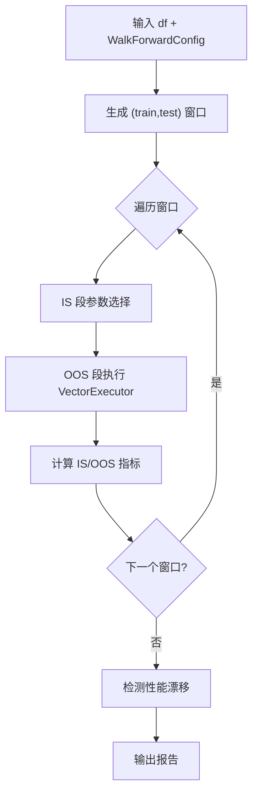
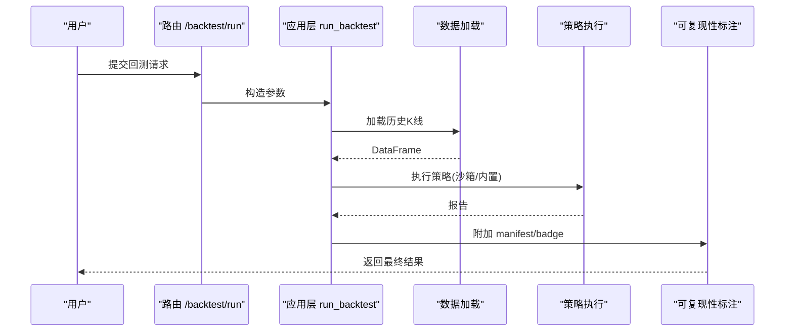
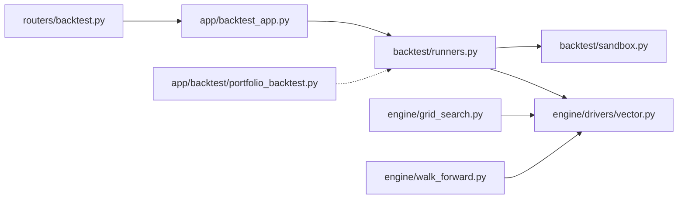

# 回测引擎使用

<cite>
**本文引用的文件**
- [backend/engine/drivers/vector.py](file://backend/engine/drivers/vector.py)
- [backend/backtest/runners.py](file://backend/backtest/runners.py)
- [backend/app/backtest_app.py](file://backend/app/backtest_app.py)
- [backend/routers/backtest.py](file://backend/routers/backtest.py)
- [backend/engine/strategy.py](file://backend/engine/strategy.py)
- [backend/backtest/sandbox.py](file://backend/backtest/sandbox.py)
- [backend/engine/grid_search.py](file://backend/engine/grid_search.py)
- [backend/engine/walk_forward.py](file://backend/engine/walk_forward.py)
- [backend/app/backtest/portfolio_backtest.py](file://backend/app/backtest/portfolio_backtest.py)
</cite>

## 目录
1. [简介](#简介)
2. [项目结构](#项目结构)
3. [核心组件](#核心组件)
4. [架构总览](#架构总览)
5. [详细组件分析](#详细组件分析)
6. [依赖关系分析](#依赖关系分析)
7. [性能与配置要点](#性能与配置要点)
8. [故障排查指南](#故障排查指南)
9. [结论](#结论)
10. [附录：API 与参数速查](#附录api-与参数速查)

## 简介
本文件面向 Quant Agent 的回测引擎使用者，系统性说明如何基于 VectorBT 进行高效回测、如何进行参数优化与稳健性检验，以及如何平滑过渡到实盘模拟。文档覆盖以下主题：
- VectorBT 的集成方式与关键配置（资金、手续费、滑点、频率等）
- 回测执行流程：历史数据加载 → 策略初始化 → 信号生成 → 交易执行
- 回测结果解读：收益曲线、最大回撤、夏普比率等指标的计算与可视化
- 回测优化方法：参数网格搜索、交叉验证（Walk-Forward）、过拟合检测
- 实盘模拟配置与注意事项

## 项目结构
Quant Agent 将回测能力分层组织：
- 路由层：FastAPI 路由暴露统一接口，接收请求并转发至应用层
- 应用层：编排数据加载、策略执行、可复现性标记、流式进度推送
- 引擎层：提供多种执行路径（VectorBT 快路径、沙箱动态策略、蒙特卡洛、网格搜索、滚动验证）
- 基础设施：安全沙箱、指标提取、组合回测工具

图表来源
- [backend/routers/backtest.py:145-321](file://backend/routers/backtest.py#L145-L321)
- [backend/app/backtest_app.py:72-163](file://backend/app/backtest_app.py#L72-L163)
- [backend/backtest/runners.py:148-279](file://backend/backtest/runners.py#L148-L279)
- [backend/engine/grid_search.py:221-297](file://backend/engine/grid_search.py#L221-L297)
- [backend/engine/walk_forward.py:176-243](file://backend/engine/walk_forward.py#L176-L243)
- [backend/engine/drivers/vector.py:45-133](file://backend/engine/drivers/vector.py#L45-L133)
- [backend/app/backtest/portfolio_backtest.py:103-227](file://backend/app/backtest/portfolio_backtest.py#L103-L227)

章节来源
- [backend/routers/backtest.py:145-321](file://backend/routers/backtest.py#L145-L321)
- [backend/app/backtest_app.py:72-163](file://backend/app/backtest_app.py#L72-L163)

## 核心组件
- VectorBT 执行器：将策略信号转换为 Portfolio，计算收益、回撤、夏普等指标，并输出权益曲线与成交明细
- 策略抽象基类：定义 on_init/on_bar/on_order_update/on_stop 生命周期，以及可选的矢量化 signals()
- 沙箱环境：AST 级代码扫描、危险模块拦截、超时/内存熔断、Numba JIT 支持
- 运行器：网格搜索、蒙特卡洛压力测试、批量横截面回测
- 滚动验证（Walk-Forward）：样本内训练、样本外验证，检测性能漂移
- 组合回测：多标的等权组合净值与绩效统计

章节来源
- [backend/engine/drivers/vector.py:25-133](file://backend/engine/drivers/vector.py#L25-L133)
- [backend/engine/strategy.py:24-90](file://backend/engine/strategy.py#L24-L90)
- [backend/backtest/sandbox.py:147-340](file://backend/backtest/sandbox.py#L147-L340)
- [backend/backtest/runners.py:148-569](file://backend/backtest/runners.py#L148-L569)
- [backend/engine/walk_forward.py:28-124](file://backend/engine/walk_forward.py#L28-L124)
- [backend/app/backtest/portfolio_backtest.py:26-227](file://backend/app/backtest/portfolio_backtest.py#L26-L227)

## 架构总览
下图展示从 HTTP 请求到 VectorBT 执行的完整调用链，包括数据加载、策略执行、指标提取与结果封装。

图表来源
- [backend/routers/backtest.py:145-168](file://backend/routers/backtest.py#L145-L168)
- [backend/app/backtest_app.py:72-163](file://backend/app/backtest_app.py#L72-L163)
- [backend/app/backtest_app.py:166-221](file://backend/app/backtest_app.py#L166-L221)
- [backend/engine/drivers/vector.py:54-133](file://backend/engine/drivers/vector.py#L54-L133)

## 详细组件分析

### VectorBT 执行器与配置
- 配置项
  - initial_capital：初始资金
  - commission_pct：单边手续费比例
  - slippage_pct：滑点比例
  - freq：时间频率（如 1D）
- 执行流程
  - 校验策略是否支持矢量化
  - 调用 strategy.signals(df, params) 生成信号列
  - 准备 OHLCV DataFrame，对齐信号
  - 通过 vbt.Portfolio.from_signals 创建组合，传入资金、手续费、滑点、冲突处理、频率等
  - 提取指标、权益曲线、成交记录
- 回退逻辑
  - 若未安装 vectorbt，则采用简单逐日模拟，仍考虑滑点与手续费

图表来源
- [backend/engine/drivers/vector.py:54-133](file://backend/engine/drivers/vector.py#L54-L133)
- [backend/engine/drivers/vector.py:218-289](file://backend/engine/drivers/vector.py#L218-L289)

章节来源
- [backend/engine/drivers/vector.py:25-133](file://backend/engine/drivers/vector.py#L25-L133)
- [backend/engine/drivers/vector.py:218-289](file://backend/engine/drivers/vector.py#L218-L289)

### 策略抽象与两种执行契约
- 事件驱动契约：实现 on_bar(ctx, bar)，由 Driver 逐 bar 驱动（回测与实盘一致）
- 矢量化契约：实现 signals(df, params) 返回 1/-1/0 的信号序列，供 VectorBT 快路径使用
- is_vectorizable() 用于判断是否启用快路径

图表来源
- [backend/engine/strategy.py:24-90](file://backend/engine/strategy.py#L24-L90)

章节来源
- [backend/engine/strategy.py:24-90](file://backend/engine/strategy.py#L24-L90)

### 沙箱安全与执行保障
- AST 静态扫描：禁止危险函数/属性、限制装饰器白名单（仅 Numba JIT 相关）
- 模块导入白名单：仅允许 numpy/pandas/math/datetime/collections/itertools/scipy/statsmodels/sklearn/lightgbm/xgboost/typing/numba 等
- 文件访问隔离：限定 sandbox_workspace 目录，防止目录穿越
- 超时与内存熔断：基于 sys.settrace 的执行追踪，限制执行时间与内存增量
- Numba 支持：预注入 njit/jit/vectorize/guvectorize/cfunc/stencil，剥离 cache 参数避免临时源码缓存问题

章节来源
- [backend/backtest/sandbox.py:147-340](file://backend/backtest/sandbox.py#L147-L340)
- [backend/backtest/sandbox.py:352-415](file://backend/backtest/sandbox.py#L352-L415)

### 网格搜索与热力图
- 功能：笛卡尔积展开参数网格，并发执行 Vector 快路径回测，按目标指标排序，生成 ECharts 友好的夏普热力图矩阵
- 并发：ProcessPoolExecutor 并行执行，自动选择工作进程数
- 结果：Top-N 参数组合、最佳参数、热力图数据

图表来源
- [backend/engine/grid_search.py:121-218](file://backend/engine/grid_search.py#L121-L218)
- [backend/engine/grid_search.py:221-297](file://backend/engine/grid_search.py#L221-L297)

章节来源
- [backend/engine/grid_search.py:121-218](file://backend/engine/grid_search.py#L121-L218)
- [backend/engine/grid_search.py:221-297](file://backend/engine/grid_search.py#L221-L297)

### 滚动验证（Walk-Forward）
- 目的：在多个滚动窗口上进行 IS 训练与 OOS 验证，检测性能漂移
- 窗口生成：支持定长滚动或锚定扩展；可设置步长
- 参数选择：在 IS 段内对候选参数集评估，选择最优参数
- 漂移检测：比较 IS/OOS 夏普缺口、OOS 夏普趋势斜率、IS 盈利但 OOS 亏损比例、末期相对初期表现

图表来源
- [backend/engine/walk_forward.py:126-146](file://backend/engine/walk_forward.py#L126-L146)
- [backend/engine/walk_forward.py:176-243](file://backend/engine/walk_forward.py#L176-L243)
- [backend/engine/walk_forward.py:268-301](file://backend/engine/walk_forward.py#L268-L301)

章节来源
- [backend/engine/walk_forward.py:28-124](file://backend/engine/walk_forward.py#L28-L124)
- [backend/engine/walk_forward.py:176-243](file://backend/engine/walk_forward.py#L176-L243)
- [backend/engine/walk_forward.py:268-301](file://backend/engine/walk_forward.py#L268-L301)

### 组合回测（多标的等权）
- 输入：多只标的的 K 线字典，按日期对齐收盘价宽表
- 权重：等权分配，支持买入持有/周度/月度再平衡
- 成本：再平衡日扣除换手成本（简化模型）
- 输出：组合净值曲线、月度收益热力图、最长回撤期、各标的独立表现

章节来源
- [backend/app/backtest/portfolio_backtest.py:26-227](file://backend/app/backtest/portfolio_backtest.py#L26-L227)

### 回测执行流程（端到端）
- 数据加载：优先尝试数据湖快照，其次 Futu OpenD，最后 YFinance
- 策略执行：动态沙箱策略或内置策略（如 DivergenceResonance）
- 指标提取：VectorBT stats 或 fallback 计算
- 可复现性：附加代码哈希、数据快照 ID、随机种子、数据模式

图表来源
- [backend/routers/backtest.py:145-168](file://backend/routers/backtest.py#L145-L168)
- [backend/app/backtest_app.py:72-163](file://backend/app/backtest_app.py#L72-L163)
- [backend/app/backtest_app.py:224-284](file://backend/app/backtest_app.py#L224-L284)

章节来源
- [backend/app/backtest_app.py:72-163](file://backend/app/backtest_app.py#L72-L163)
- [backend/app/backtest_app.py:224-284](file://backend/app/backtest_app.py#L224-L284)

## 依赖关系分析
- 路由层依赖应用层接口，应用层依赖数据源与执行引擎
- 执行引擎依赖 VectorBT 与沙箱安全机制
- 网格搜索与滚动验证均复用 Vector 执行器，保证一致性
- 组合回测独立于单标的策略，适用于选股后组合评估

图表来源
- [backend/routers/backtest.py:145-321](file://backend/routers/backtest.py#L145-L321)
- [backend/app/backtest_app.py:166-221](file://backend/app/backtest_app.py#L166-L221)
- [backend/backtest/runners.py:148-569](file://backend/backtest/runners.py#L148-L569)
- [backend/engine/grid_search.py:221-297](file://backend/engine/grid_search.py#L221-L297)
- [backend/engine/walk_forward.py:176-243](file://backend/engine/walk_forward.py#L176-L243)
- [backend/app/backtest/portfolio_backtest.py:103-227](file://backend/app/backtest/portfolio_backtest.py#L103-L227)

章节来源
- [backend/routers/backtest.py:145-321](file://backend/routers/backtest.py#L145-L321)
- [backend/backtest/runners.py:148-569](file://backend/backtest/runners.py#L148-L569)

## 性能与配置要点
- 资金与摩擦成本
  - initial_capital：影响仓位规模与收益绝对值
  - commission_pct：单边手续费，建议根据实际券商费率设置
  - slippage_pct：滑点比例，建议结合流动性与订单类型校准
- 频率与时序
  - freq：与数据频率匹配（如 1D），确保信号与价格对齐
- 止损与跟踪
  - 运行器中可通过 ATR 倍数设置跟踪止损（sl_trail），增强风险控制
- 并发与资源
  - 网格搜索支持 ProcessPoolExecutor 并行，注意 CPU 核数与任务粒度
  - 沙箱超时与内存熔断保护系统稳定性
- 数据质量
  - 清洗 NaN、重复列名、统一大小写列名，确保 VectorBT 输入规范
- 可复现性
  - 固定 random_seed、记录代码哈希与数据快照 ID，便于回溯

章节来源
- [backend/engine/drivers/vector.py:25-33](file://backend/engine/drivers/vector.py#L25-L33)
- [backend/backtest/runners.py:202-226](file://backend/backtest/runners.py#L202-L226)
- [backend/backtest/runners.py:381-397](file://backend/backtest/runners.py#L381-L397)
- [backend/backtest/runners.py:526-543](file://backend/backtest/runners.py#L526-L543)
- [backend/app/backtest_app.py:224-284](file://backend/app/backtest_app.py#L224-L284)

## 故障排查指南
- 策略不支持矢量化
  - 现象：抛出“不支持矢量化”错误
  - 处理：实现 signals() 或改用事件驱动路径
- 数据不足或为空
  - 现象：数据加载失败或有效数据少于阈值
  - 处理：检查数据源、周期与区间，确认快照可用
- 沙箱执行异常
  - 现象：超时、内存溢出、非法模块导入
  - 处理：调整超时/内存阈值，移除危险代码，遵循白名单
- 指标缺失或异常
  - 现象：stats 字段缺失或 NaN
  - 处理：使用 _safe_stat 安全提取，必要时回退计算
- 网格搜索无结果
  - 现象：全部组合失败
  - 处理：检查策略逻辑、数据长度、参数范围

章节来源
- [backend/engine/drivers/vector.py:73-80](file://backend/engine/drivers/vector.py#L73-L80)
- [backend/backtest/runners.py:199-200](file://backend/backtest/runners.py#L199-L200)
- [backend/backtest/sandbox.py:352-415](file://backend/backtest/sandbox.py#L352-L415)
- [backend/backtest/sandbox.py:147-340](file://backend/backtest/sandbox.py#L147-L340)

## 结论
Quant Agent 的回测引擎以 VectorBT 为核心，提供高吞吐的矢量化执行路径，并通过沙箱安全机制保障动态策略的可控执行。配合网格搜索、滚动验证与过拟合检测，形成完整的回测优化与稳健性评估闭环。通过统一的 API 与可复现性标注，开发者可从回测平滑过渡到实盘模拟，并在不同市场环境下持续验证策略有效性。

## 附录：API 与参数速查
- 回测运行
  - 路径：POST /backtest/run
  - 关键参数：ticker、period、interval、initial_capital、commission_pct、slippage_pct、data_source、source_code、class_name、params
- 流式回测
  - 路径：POST /backtest/run/stream
  - 特点：SSE 推送撮合阶段进度，结束时返回完整 Tear Sheet
- 滚动验证
  - 路径：POST /backtest/walk-forward
  - 关键参数：strategy_key、param_grid、train_bars、test_bars、step_bars、anchored、target_metric
- 蒙特卡洛压测
  - 路径：POST /backtest/monte-carlo
  - 关键参数：iterations、method、seed
- 网格搜索
  - 路径：POST /backtest/grid-search
  - 关键参数：param_grid、base_params、target_metric、max_workers、heatmap_x、heatmap_y
- 过拟合检测
  - 路径：POST /backtest/overfit
  - 关键参数：param_grid、dsr_warn_below、cliff_abs、cliff_rel

章节来源
- [backend/routers/backtest.py:46-143](file://backend/routers/backtest.py#L46-L143)
- [backend/routers/backtest.py:145-321](file://backend/routers/backtest.py#L145-L321)
