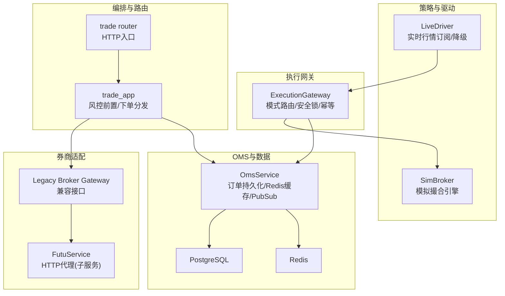
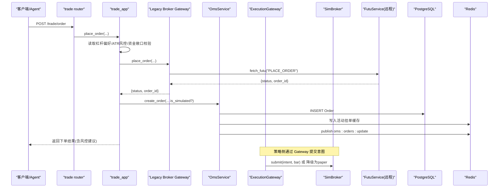
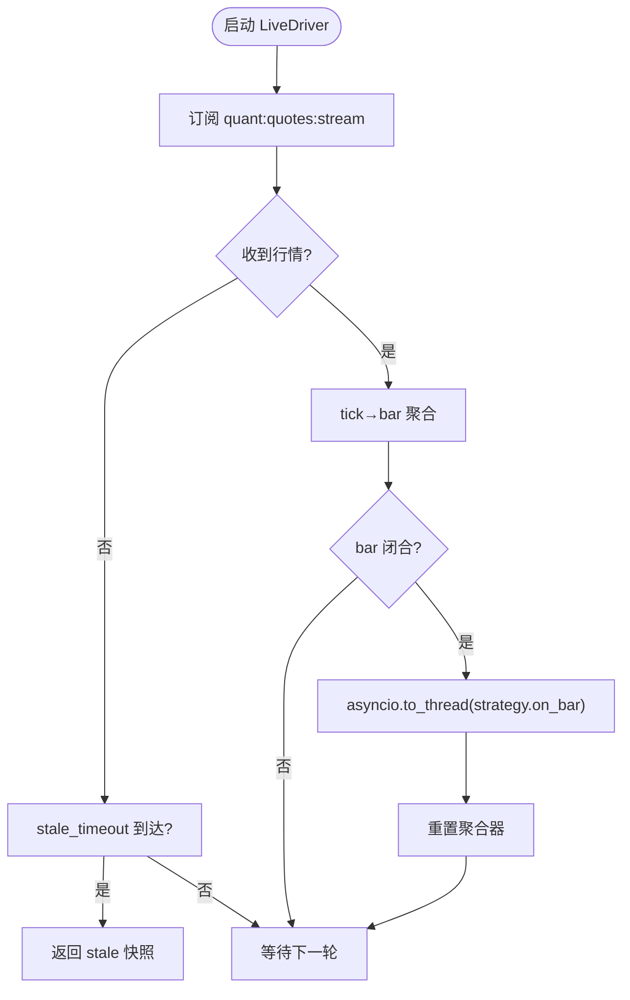
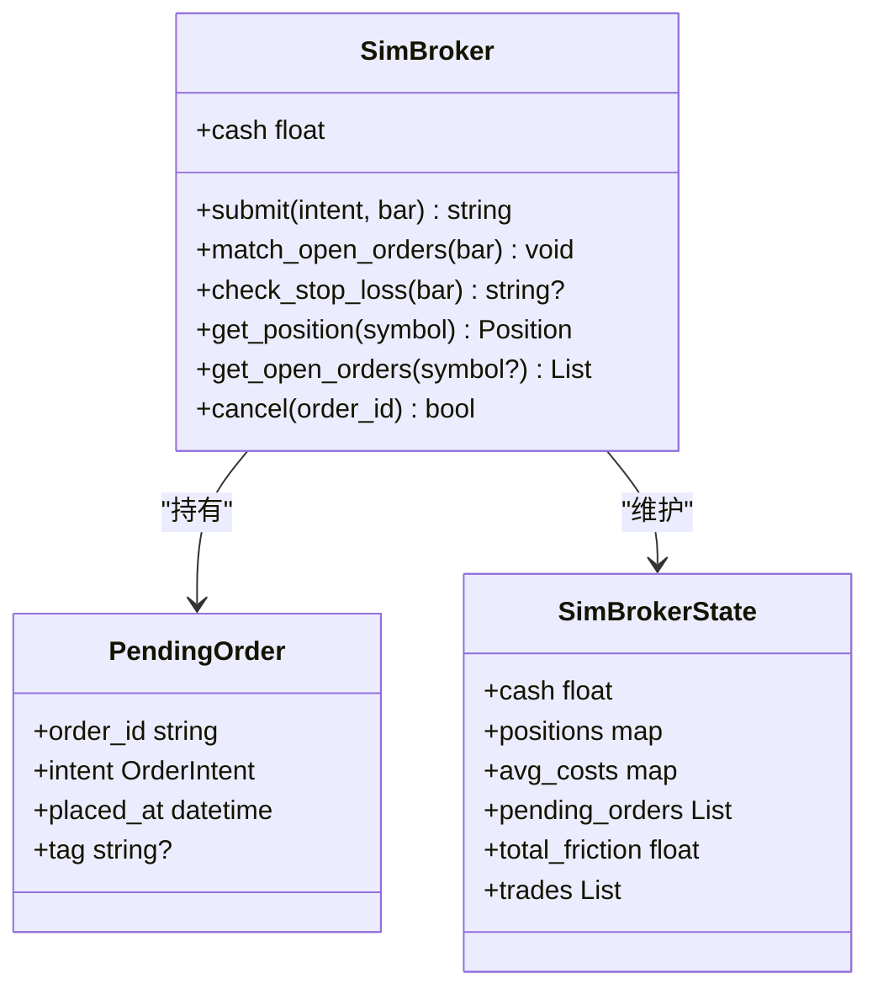
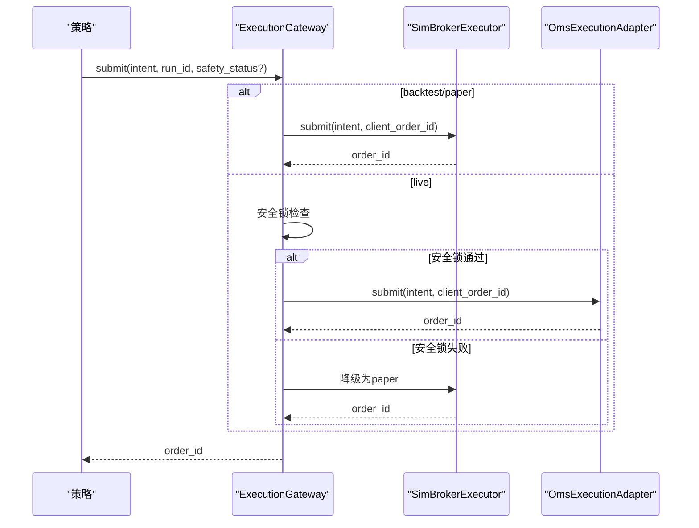
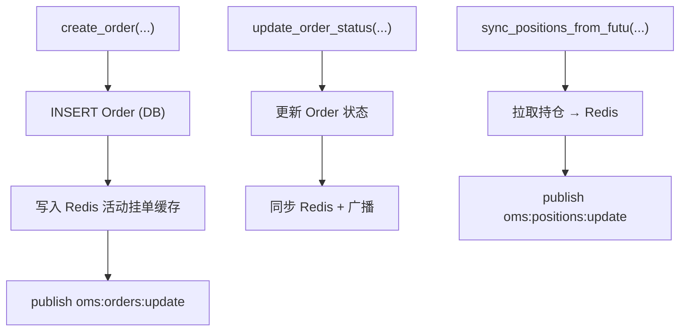
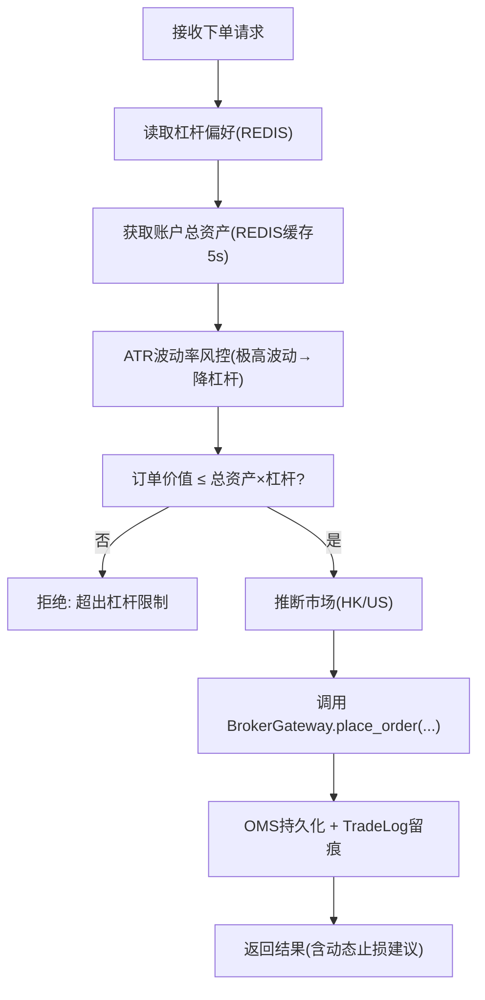
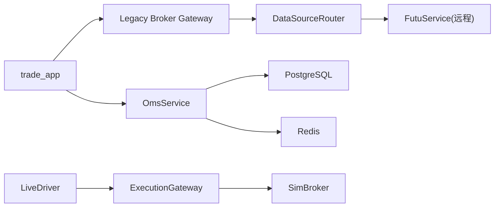

# 实盘交易接入

<cite>
**本文引用的文件**
- [backend/engine/drivers/live.py](file://backend/engine/drivers/live.py)
- [backend/engine/drivers/sim_broker.py](file://backend/engine/drivers/sim_broker.py)
- [backend/engine/gateway.py](file://backend/engine/gateway.py)
- [backend/services/oms_service.py](file://backend/services/oms_service.py)
- [backend/app/trade_app.py](file://backend/app/trade_app.py)
- [backend/routers/trade.py](file://backend/routers/trade.py)
- [backend/services/adapters/legacy_broker.py](file://backend/services/adapters/legacy_broker.py)
- [backend/services/futu/service.py](file://backend/services/futu/service.py)
- [backend/core/config.py](file://backend/core/config.py)
- [backend/routers/risk.py](file://backend/routers/risk.py)
</cite>

## 目录
1. [简介](#简介)
2. [项目结构](#项目结构)
3. [核心组件](#核心组件)
4. [架构总览](#架构总览)
5. [详细组件分析](#详细组件分析)
6. [依赖关系分析](#依赖关系分析)
7. [性能与可靠性](#性能与可靠性)
8. [故障排查与恢复](#故障排查与恢复)
9. [结论](#结论)
10. [附录：配置清单与操作步骤](#附录：配置清单与操作步骤)

## 简介
本文件面向“Quant Agent”的实盘交易接入，系统性说明实盘驱动、模拟经纪商、订单路由、风控模块、OMS 订单管理、账户连接与权限校验、监控告警以及常见问题的排查与恢复策略。文档以代码级事实为依据，配合架构图与时序图，帮助读者快速理解从策略到券商 API 的完整链路。

## 项目结构
围绕实盘交易的关键路径由以下模块构成：
- 执行驱动层：LiveDriver（实盘/纸面驱动）、SimBroker（模拟撮合）
- 统一网关：ExecutionGateway（模式路由 + 安全锁 + 幂等去重）
- OMS 服务：OmsService（订单持久化、状态同步、持仓缓存）
- 交易编排：trade_app（风控前置校验、下单分发、留痕）
- 券商适配：FutuService（远程-only HTTP 代理）、Legacy Broker Gateway（兼容接口）
- 配置与安全：config（环境变量校验、开关控制）
- 风险面板：risk router（组合风控指标、相关性、压力测试）

图表来源
- [backend/engine/drivers/live.py:220-384](file://backend/engine/drivers/live.py#L220-L384)
- [backend/engine/drivers/sim_broker.py:59-338](file://backend/engine/drivers/sim_broker.py#L59-L338)
- [backend/engine/gateway.py:98-207](file://backend/engine/gateway.py#L98-L207)
- [backend/services/oms_service.py:29-276](file://backend/services/oms_service.py#L29-L276)
- [backend/app/trade_app.py:35-187](file://backend/app/trade_app.py#L35-L187)
- [backend/routers/trade.py:30-56](file://backend/routers/trade.py#L30-L56)
- [backend/services/adapters/legacy_broker.py:17-109](file://backend/services/adapters/legacy_broker.py#L17-L109)
- [backend/services/futu/service.py:74-213](file://backend/services/futu/service.py#L74-L213)

章节来源
- [backend/engine/drivers/live.py:220-384](file://backend/engine/drivers/live.py#L220-L384)
- [backend/engine/gateway.py:98-207](file://backend/engine/gateway.py#L98-L207)
- [backend/services/oms_service.py:29-276](file://backend/services/oms_service.py#L29-L276)
- [backend/app/trade_app.py:35-187](file://backend/app/trade_app.py#L35-L187)
- [backend/routers/trade.py:30-56](file://backend/routers/trade.py#L30-L56)
- [backend/services/adapters/legacy_broker.py:17-109](file://backend/services/adapters/legacy_broker.py#L17-L109)
- [backend/services/futu/service.py:74-213](file://backend/services/futu/service.py#L74-L213)

## 核心组件
- LiveDriver：负责订阅行情总线（Redis Pub/Sub），在超时或无消息时降级轮询；tick→bar 聚合后调用策略 on_bar；通过 ExecutionGateway 提交订单意图。
- SimBroker：模拟撮合引擎，支持限价单挂单簿、止损触发、滑点与手续费计算、持仓与现金管理，并可在 paper 模式下将成交回调至外部记账服务。
- ExecutionGateway：统一订单出口，按模式路由到 SimBroker 或 OMS 适配器；提供三级安全锁检查（环境变量、交易模式、熔断开关）；实现 client_order_id 幂等去重。
- OmsService：订单持久化（PostgreSQL）、活动挂单 Redis 缓存、状态变更 PubSub 广播、真实持仓同步（Futu → Redis）。
- trade_app：交易编排层，读取用户偏好（杠杆上限）、获取账户资产（带缓存防抖）、ATR 动态波动率风控、资金敞口校验、下单分发、OMS 留痕。
- FutuService/Legacy Broker Gateway：主服务不直连 SDK，仅通过 DataSourceRouter HTTP 转发到 data_subservice 的 Futu 实现；兼容旧接口的下单、撤单、查询、账户信息。
- config：集中式配置校验，强制关键项非空；当开启实盘交易时必须配置 Futu 解锁密码。

章节来源
- [backend/engine/drivers/live.py:220-384](file://backend/engine/drivers/live.py#L220-L384)
- [backend/engine/drivers/sim_broker.py:59-338](file://backend/engine/drivers/sim_broker.py#L59-L338)
- [backend/engine/gateway.py:98-207](file://backend/engine/gateway.py#L98-L207)
- [backend/services/oms_service.py:29-276](file://backend/services/oms_service.py#L29-L276)
- [backend/app/trade_app.py:35-187](file://backend/app/trade_app.py#L35-L187)
- [backend/services/futu/service.py:74-213](file://backend/services/futu/service.py#L74-L213)
- [backend/services/adapters/legacy_broker.py:17-109](file://backend/services/adapters/legacy_broker.py#L17-L109)
- [backend/core/config.py:20-134](file://backend/core/config.py#L20-L134)

## 架构总览
下图展示从前端/Agent 发单到最终落库与券商执行的端到端流程，包含风控前置、OMS 持久化、网关路由与券商适配。

图表来源
- [backend/routers/trade.py:30-56](file://backend/routers/trade.py#L30-L56)
- [backend/app/trade_app.py:35-187](file://backend/app/trade_app.py#L35-L187)
- [backend/services/adapters/legacy_broker.py:37-74](file://backend/services/adapters/legacy_broker.py#L37-L74)
- [backend/services/futu/service.py:179-208](file://backend/services/futu/service.py#L179-L208)
- [backend/services/oms_service.py:34-114](file://backend/services/oms_service.py#L34-L114)
- [backend/engine/gateway.py:116-186](file://backend/engine/gateway.py#L116-L186)
- [backend/engine/drivers/sim_broker.py:81-113](file://backend/engine/drivers/sim_broker.py#L81-L113)

## 详细组件分析

### 实盘驱动与行情处理（LiveDriver）
- 职责：订阅 Redis 行情流，30s 无消息则降级轮询；tick→bar 聚合，周期闭合触发策略 on_bar；使用 asyncio.to_thread 隔离策略执行。
- 降级机制：若 Redis 行情缓存缺失或过期，返回 stale 快照，后续在 SimBroker 中拒单或在策略侧规避。
- 上下文：LiveContext 暴露 history/quote/position/cash/equity/order/cancel 等接口供策略使用。

图表来源
- [backend/engine/drivers/live.py:220-384](file://backend/engine/drivers/live.py#L220-L384)

章节来源
- [backend/engine/drivers/live.py:220-384](file://backend/engine/drivers/live.py#L220-L384)

### 模拟经纪商（SimBroker）
- 撮合语义：市价单立即以收盘价±滑点成交；限价单进入 pending_orders，后续 bar 高低价触发；止损单在 on_bar 前检查。
- 账户管理：维护 cash、positions、avg_costs、trades、total_friction。
- Paper 模式增强：stale 行情拒单、交易时段检查、成交回调用于 Fill→Ledger 同步。

图表来源
- [backend/engine/drivers/sim_broker.py:28-113](file://backend/engine/drivers/sim_broker.py#L28-L113)
- [backend/engine/drivers/sim_broker.py:115-166](file://backend/engine/drivers/sim_broker.py#L115-L166)
- [backend/engine/drivers/sim_broker.py:168-338](file://backend/engine/drivers/sim_broker.py#L168-L338)

章节来源
- [backend/engine/drivers/sim_broker.py:59-338](file://backend/engine/drivers/sim_broker.py#L59-L338)

### 统一订单网关（ExecutionGateway）
- 模式路由：backtest/paper → SimBrokerExecutor；live → OmsExecutionAdapter。
- 安全锁：REAL_TRADE_EXECUTE 环境变量、quant:oms:trading_mode == LIVE、kill_switch 未触发；任一失败则降级为 paper 语义。
- 幂等去重：基于 run_id + symbol + side + tag 生成 client_order_id，重复提交直接返回历史 order_id。

图表来源
- [backend/engine/gateway.py:98-207](file://backend/engine/gateway.py#L98-L207)
- [backend/engine/gateway.py:215-359](file://backend/engine/gateway.py#L215-L359)

章节来源
- [backend/engine/gateway.py:98-207](file://backend/engine/gateway.py#L98-L207)
- [backend/engine/gateway.py:215-359](file://backend/engine/gateway.py#L215-L359)

### 订单管理系统（OMS）
- 订单持久化：创建 Order 记录（SUBMITTED），写入 Redis 活动挂单缓存，发布 oms:orders:update。
- 状态更新：支持 PARTIALLY_FILLED/FILLED/CANCELLED 等状态回写，并同步 Redis。
- 持仓同步：定时从 Futu 拉取真实持仓写入 Redis，并发布 oms:positions:update。
- Kill Switch 增强：一键将所有活动订单标记为 CANCELLED，清空活动挂单缓存并广播。

图表来源
- [backend/services/oms_service.py:34-114](file://backend/services/oms_service.py#L34-L114)
- [backend/services/oms_service.py:118-193](file://backend/services/oms_service.py#L118-L193)
- [backend/services/oms_service.py:197-244](file://backend/services/oms_service.py#L197-L244)

章节来源
- [backend/services/oms_service.py:29-276](file://backend/services/oms_service.py#L29-L276)

### 交易编排与风控前置（trade_app）
- 杠杆与波动率风控：读取用户偏好中的最大杠杆倍数；基于 ATR_14 计算波动率，极高波动资产强制降杠杆至 1.0；同时给出 2x ATR 动态止损参考。
- 资金敞口校验：订单价值不得超过 total_assets × max_leverage。
- 下单分发：根据 ticker 推断市场（HK/US），调用 Legacy Broker Gateway 下单；成功后通过 OmsService 持久化并写入 TradeLog。
- 账户信息缓存：使用 Redis 缓存 5 秒，避免高频穿透到券商 API。

图表来源
- [backend/app/trade_app.py:35-187](file://backend/app/trade_app.py#L35-L187)
- [backend/services/adapters/legacy_broker.py:37-74](file://backend/services/adapters/legacy_broker.py#L37-L74)

章节来源
- [backend/app/trade_app.py:35-187](file://backend/app/trade_app.py#L35-L187)
- [backend/services/adapters/legacy_broker.py:37-74](file://backend/services/adapters/legacy_broker.py#L37-L74)

### 券商对接（FutuService 与 Legacy Broker Gateway）
- FutuService：纯 HTTP 透传 Facade，所有方法经 DataSourceRouter.fetch_futu 转发到 data_subservice 的 Futu 实现；主服务不持有任何本地 SDK 连接。
- Legacy Broker Gateway：封装下单、撤单、查询、账户信息、紧急清仓（Kill Switch）等能力，统一通过 data_source_router 访问子服务。

章节来源
- [backend/services/futu/service.py:74-213](file://backend/services/futu/service.py#L74-L213)
- [backend/services/adapters/legacy_broker.py:17-109](file://backend/services/adapters/legacy_broker.py#L17-L109)

### 风险控制模块（Risk Engine 与 Risk Router）
- RiskEngine：分账户独立计算 KPI、敞口、风险雷达、因子监控、NAV 快照、相关性矩阵；支持 VaR、CVaR、流动性评估、压力测试、Alpha/Beta 归因。
- Risk Router：提供 dashboard、sector-exposure、correlation、cvar、liquidity、attribution、stress-test 等端点，统一返回空态或错误态。

章节来源
- [backend/services/risk/risk_engine.py:22-515](file://backend/services/risk/risk_engine.py#L22-L515)
- [backend/routers/risk.py:19-231](file://backend/routers/risk.py#L19-L231)

## 依赖关系分析
- 低耦合设计：主服务通过 DataSourceRouter 与 data_subservice 通信，避免在主进程引入外部 SDK 依赖。
- 明确边界：trade_app 专注编排与风控前置；gateway 专注模式路由与安全锁；OMS 专注持久化与缓存；broker 抽象券商交互。
- 外部依赖：PostgreSQL（订单与交易日志）、Redis（缓存与 PubSub）、Futu OpenD（由子服务管理）。

图表来源
- [backend/app/trade_app.py:35-187](file://backend/app/trade_app.py#L35-L187)
- [backend/services/adapters/legacy_broker.py:37-74](file://backend/services/adapters/legacy_broker.py#L37-L74)
- [backend/services/futu/service.py:105-108](file://backend/services/futu/service.py#L105-L108)
- [backend/services/oms_service.py:34-114](file://backend/services/oms_service.py#L34-L114)
- [backend/engine/drivers/live.py:220-384](file://backend/engine/drivers/live.py#L220-L384)
- [backend/engine/gateway.py:98-207](file://backend/engine/gateway.py#L98-L207)
- [backend/engine/drivers/sim_broker.py:59-338](file://backend/engine/drivers/sim_broker.py#L59-L338)

章节来源
- [backend/app/trade_app.py:35-187](file://backend/app/trade_app.py#L35-L187)
- [backend/services/adapters/legacy_broker.py:37-74](file://backend/services/adapters/legacy_broker.py#L37-L74)
- [backend/services/futu/service.py:105-108](file://backend/services/futu/service.py#L105-L108)
- [backend/services/oms_service.py:34-114](file://backend/services/oms_service.py#L34-L114)
- [backend/engine/drivers/live.py:220-384](file://backend/engine/drivers/live.py#L220-L384)
- [backend/engine/gateway.py:98-207](file://backend/engine/gateway.py#L98-L207)
- [backend/engine/drivers/sim_broker.py:59-338](file://backend/engine/drivers/sim_broker.py#L59-L338)

## 性能与可靠性
- 行情降级：LiveDriver 在 30s 无消息时返回 stale 快照，避免阻塞策略；SimBroker 对 stale 行情拒单，防止无效交易。
- 账户信息缓存：trade_app 对账户总资产设置 5 秒 TTL，降低高频并发下的券商 API 压力。
- 幂等去重：ExecutionGateway 基于 client_order_id 去重，避免重复下单。
- 安全锁：三重保护（环境变量、交易模式、熔断开关），任一失败即降级为 paper 语义，保障生产安全。
- 缓存与广播：OMS 使用 Redis 缓存活动挂单与持仓，并通过 PubSub 实时广播，提升前端响应速度。

[本节为通用性能讨论，不直接分析具体文件]

## 故障排查与恢复
- 无法获取账户资产
  - 现象：trade_app 获取账户信息失败，抛出风控中断错误。
  - 排查：检查 Redis 缓存是否可用、DataSourceRouter 健康检查、data_subservice 的 Futu 子服务是否在线。
  - 恢复：重启 data_subservice 或切换备用 host；确认网络连通性与鉴权。
- 下单被拒
  - 现象：返回 REJECTED_STALE 或 REJECTED_MARKET_CLOSED。
  - 排查：确认行情是否 stale、是否在交易时段；检查策略 on_bar 传入的 bar 时间戳。
  - 恢复：等待行情恢复或调整策略逻辑。
- 订单未持久化
  - 现象：OMS 日志出现异常但订单仍发送成功。
  - 排查：数据库连接、事务提交、Redis 写入是否成功。
  - 恢复：重试持久化流程；必要时人工补录。
- 熔断与紧急清仓
  - 现象：系统触发 kill switch，需快速平仓。
  - 操作：调用 BrokerGateway.execute_emergency_liquidation()，并在 OMS 中标记所有活动订单为 CANCELLED。
  - 恢复：确认清仓完成、订单状态一致、持仓与现金正确。

章节来源
- [backend/app/trade_app.py:35-187](file://backend/app/trade_app.py#L35-L187)
- [backend/engine/drivers/sim_broker.py:81-113](file://backend/engine/drivers/sim_broker.py#L81-L113)
- [backend/services/oms_service.py:197-244](file://backend/services/oms_service.py#L197-L244)
- [backend/services/adapters/legacy_broker.py:86-109](file://backend/services/adapters/legacy_broker.py#L86-L109)

## 结论
本系统通过“驱动—网关—OMS—券商适配”的分层架构，实现了实盘交易的稳健接入。LiveDriver 提供可靠的行情与策略执行环境，ExecutionGateway 确保模式路由与安全锁，OmsService 保证订单与持仓的一致性与可观测性，trade_app 在前置环节实施严格的风控与留痕。配合 Risk Engine 的多维风控指标与告警能力，系统在稳定性、安全性与可维护性方面具备工程化保障。

[本节为总结性内容，不直接分析具体文件]

## 附录：配置清单与操作步骤

### 账户连接与权限检查
- 必需配置
  - DATABASE_URL：数据库连接字符串（必须非空且格式合法）
  - EMBEDDING_API_KEY / EMBEDDING_BASE_URL：嵌入模型配置（必须非空）
  - FUTU_HOST / FUTU_PORT：富途 OpenD 地址（由子服务管理）
  - FUTU_TRD_ENV：SIMULATE 或 REAL（默认 SIMULATE）
  - REAL_TRADE_EXECUTE：是否允许实盘交易（默认 false）
  - FUTU_PWD_UNLOCK：实盘交易开启时必须配置（解锁密码）
- 步骤
  1. 设置环境变量（.env 或部署平台）
  2. 启动 data_subservice（Futu 子服务）并确保 health_check 可用
  3. 验证账户信息：调用 /trade/account 或 risk dashboard
  4. 检查交易权限：BrokerGateway.has_trade_ctx() 应返回 true

章节来源
- [backend/core/config.py:20-134](file://backend/core/config.py#L20-L134)
- [backend/services/adapters/legacy_broker.py:76-84](file://backend/services/adapters/legacy_broker.py#L76-L84)
- [backend/routers/trade.py:42-50](file://backend/routers/trade.py#L42-L50)

### 资金验证与风控规则
- 杠杆上限：从用户偏好读取 defaultLeverage，默认 1.0（不允许融资）
- 波动率风控：ATR_14 > 5% 时强制降杠杆至 1.0
- 资金敞口：订单价值不得超过 total_assets × max_leverage
- 动态止损：基于 2x ATR 计算建议止损位，写入订单 note

章节来源
- [backend/app/trade_app.py:45-115](file://backend/app/trade_app.py#L45-L115)
- [backend/app/trade_app.py:135-187](file://backend/app/trade_app.py#L135-L187)

### 订单生命周期与仓位控制
- 生命周期：SUBMITTED → PARTIALLY_FILLED → FILLED / CANCELLED / REJECTED / EXPIRED
- 仓位控制：SimBroker 维护 positions 与 avg_cost；OMS 同步真实持仓
- 止损止盈：SimBroker.check_stop_loss 在 on_bar 前检查止损触发

章节来源
- [backend/engine/drivers/sim_broker.py:145-166](file://backend/engine/drivers/sim_broker.py#L145-L166)
- [backend/services/oms_service.py:79-114](file://backend/services/oms_service.py#L79-L114)

### 监控与告警
- 监控指标：风险面板（dashboard）、相关性矩阵、流动性评分、压力测试结果
- 告警通道：Telegram、ServerChan、飞书 Webhook（通过配置注入）
- 实时广播：oms:orders:update、oms:positions:update

章节来源
- [backend/routers/risk.py:63-231](file://backend/routers/risk.py#L63-L231)
- [backend/services/oms_service.py:241-244](file://backend/services/oms_service.py#L241-L244)
- [backend/core/config.py:75-79](file://backend/core/config.py#L75-L79)
