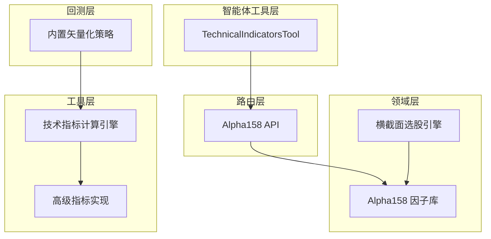
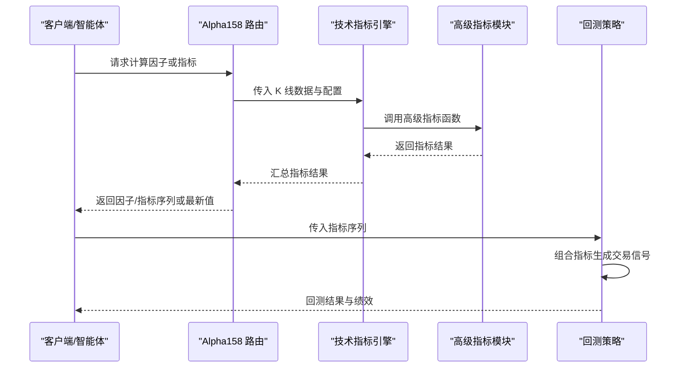
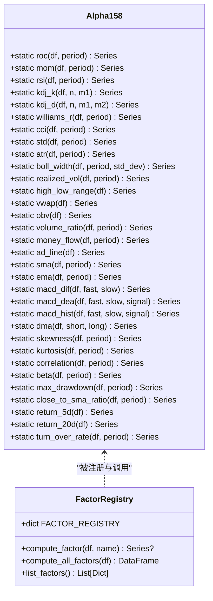
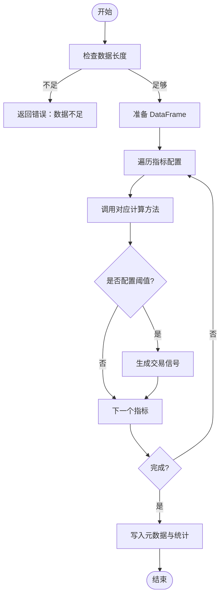
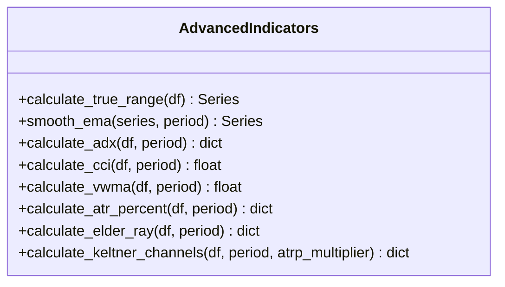
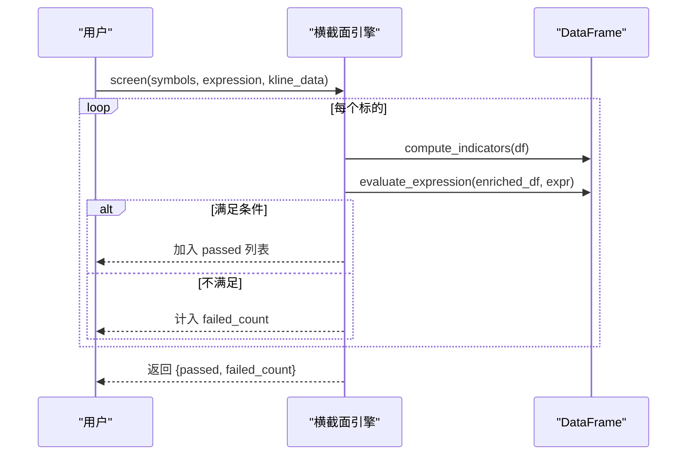
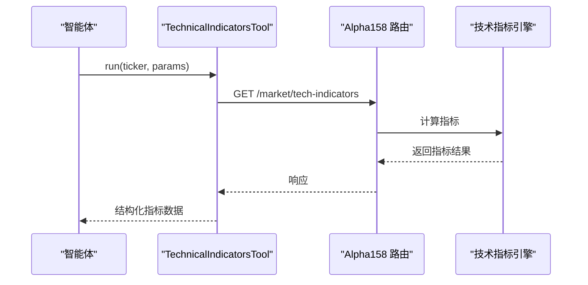
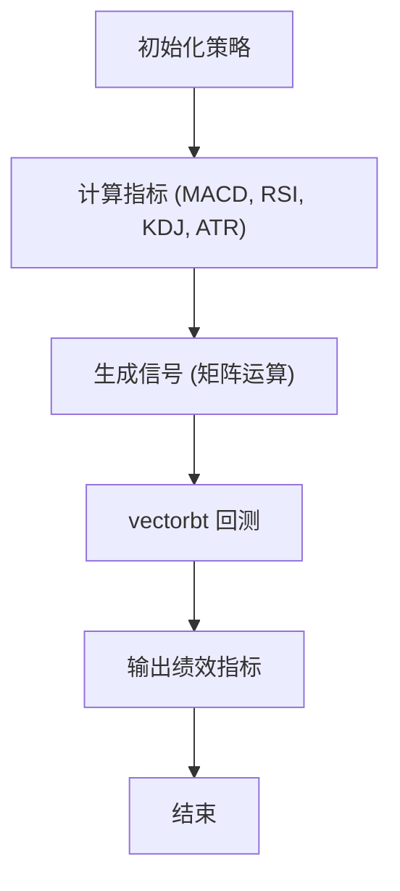
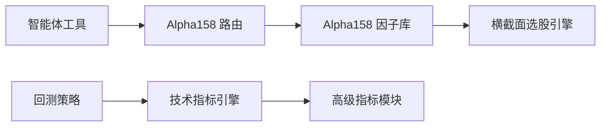

# 技术指标实现

<cite>
**本文引用的文件**
- [backend/domain/alpha158.py](file://backend/domain/alpha158.py)
- [backend/utils/technical_indicators_pro.py](file://backend/utils/technical_indicators_pro.py)
- [backend/utils/advanced_indicators.py](file://backend/utils/advanced_indicators.py)
- [backend/routers/alpha158.py](file://backend/routers/alpha158.py)
- [hermes_agent/tools/technical_indicators_tool.py](file://hermes_agent/tools/technical_indicators_tool.py)
- [backend/domain/cross_sectional.py](file://backend/domain/cross_sectional.py)
- [backend/backtest/strategies.py](file://backend/backtest/strategies.py)
- [tests/utils/test_technical_indicators_pro.py](file://tests/utils/test_technical_indicators_pro.py)
</cite>

## 目录
1. [简介](#简介)
2. [项目结构](#项目结构)
3. [核心组件](#核心组件)
4. [架构总览](#架构总览)
5. [详细组件分析](#详细组件分析)
6. [依赖关系分析](#依赖关系分析)
7. [性能考量](#性能考量)
8. [故障排查指南](#故障排查指南)
9. [结论](#结论)
10. [附录](#附录)

## 简介
本指南面向量化策略与因子研究工程师，系统梳理 Quant Agent 中的技术指标实现与 Alpha158 因子库。内容涵盖：
- Alpha158 因子库的构建原理、分类与使用方法（动量、波动率、量价、均线、统计、衍生）
- 高级技术指标的向量化实现（RSI、MACD、KDJ、ATR、ADX、CCI、VWMA、Elder-Ray、Keltner Channels 等）
- 自定义指标开发流程（接口规范、缓存机制、性能优化）
- 在策略中的集成方法（多时间周期、指标组合、参数调优）
- 丰富的代码示例路径与实际应用案例

## 项目结构
Quant Agent 的技术指标能力分布在领域层、工具层、路由层与智能体工具层：
- 领域层：Alpha158 因子库、横截面选股引擎
- 工具层：生产级技术指标计算引擎、高级指标实现
- 路由层：Alpha158 因子 API
- 智能体工具层：面向大模型的指标计算工具封装
- 回测层：内置矢量化策略示例

图表来源
- [backend/domain/alpha158.py:31-385](file://backend/domain/alpha158.py#L31-L385)
- [backend/utils/technical_indicators_pro.py:175-658](file://backend/utils/technical_indicators_pro.py#L175-L658)
- [backend/utils/advanced_indicators.py:41-262](file://backend/utils/advanced_indicators.py#L41-L262)
- [backend/routers/alpha158.py:1-73](file://backend/routers/alpha158.py#L1-L73)
- [hermes_agent/tools/technical_indicators_tool.py:1-104](file://hermes_agent/tools/technical_indicators_tool.py#L1-L104)
- [backend/backtest/strategies.py:13-204](file://backend/backtest/strategies.py#L13-L204)

章节来源
- [backend/domain/alpha158.py:31-385](file://backend/domain/alpha158.py#L31-L385)
- [backend/utils/technical_indicators_pro.py:175-658](file://backend/utils/technical_indicators_pro.py#L175-L658)
- [backend/utils/advanced_indicators.py:41-262](file://backend/utils/advanced_indicators.py#L41-L262)
- [backend/routers/alpha158.py:1-73](file://backend/routers/alpha158.py#L1-L73)
- [hermes_agent/tools/technical_indicators_tool.py:1-104](file://hermes_agent/tools/technical_indicators_tool.py#L1-L104)
- [backend/backtest/strategies.py:13-204](file://backend/backtest/strategies.py#L13-L204)

## 核心组件
- Alpha158 因子库：提供 158 个经典因子的纯 pandas 矢量化实现，按类别组织并注册到统一字典，支持单因子与批量计算。
- 技术指标计算引擎：面向生产的高性能、可配置、可扩展的计算框架，内置默认指标集、缓存装饰器、信号生成与统计信息。
- 高级指标实现：独立模块实现 ADX、CCI、VWMA、ATR%、Elder-Ray、Keltner Channels 等复杂指标。
- 横截面选股引擎：将指标计算与安全表达式求值结合，支持跨指标组合筛选。
- Alpha158 API：对外暴露因子列表与计算接口。
- 智能体工具：为大模型调用封装指标计算请求，简化交互。
- 内置回测策略：展示如何在回测中组合使用多个指标进行信号生成与绩效评估。

章节来源
- [backend/domain/alpha158.py:31-385](file://backend/domain/alpha158.py#L31-L385)
- [backend/utils/technical_indicators_pro.py:175-658](file://backend/utils/technical_indicators_pro.py#L175-L658)
- [backend/utils/advanced_indicators.py:41-262](file://backend/utils/advanced_indicators.py#L41-L262)
- [backend/domain/cross_sectional.py:105-321](file://backend/domain/cross_sectional.py#L105-L321)
- [backend/routers/alpha158.py:1-73](file://backend/routers/alpha158.py#L1-L73)
- [hermes_agent/tools/technical_indicators_tool.py:1-104](file://hermes_agent/tools/technical_indicators_tool.py#L1-L104)
- [backend/backtest/strategies.py:13-204](file://backend/backtest/strategies.py#L13-L204)

## 架构总览
下图展示了从数据输入到指标计算、再到策略信号生成的整体流程。

图表来源
- [backend/routers/alpha158.py:24-73](file://backend/routers/alpha158.py#L24-L73)
- [backend/utils/technical_indicators_pro.py:190-247](file://backend/utils/technical_indicators_pro.py#L190-L247)
- [backend/utils/advanced_indicators.py:41-262](file://backend/utils/advanced_indicators.py#L41-L262)
- [backend/backtest/strategies.py:38-112](file://backend/backtest/strategies.py#L38-L112)

## 详细组件分析

### Alpha158 因子库
- 设计要点
  - 纯 pandas 矢量化实现，避免 Python 循环，提升计算效率
  - 按类别组织：动量类（ROC、MOM、RSI、KDJ、Williams %R、CCI）、波动率类（STD、ATR、Bollinger Width、Realized Volatility）、量价类（VWAP、OBV、Volume Ratio、MFI、AD Line）、均线类（SMA、EMA、MACD、DMA）、统计类（Skewness、Kurtosis、Correlation、Beta、Max Drawdown）、衍生因子（Close/SMA 比率、收益率、换手率）
  - 统一注册表 FACTOR_REGISTRY，便于批量计算与外部调用
  - 提供 compute_factor、compute_all_factors、list_factors 三个入口

- 关键方法与复杂度
  - 滚动窗口与指数加权平均：O(n) 时间复杂度，空间 O(n)
  - 向量化的 diff、rolling、ewm 操作，充分利用 NumPy/Pandas 底层优化

- 使用方式
  - 单因子：compute_factor(df, factor_name)
  - 全因子：compute_all_factors(df)
  - 列出可用因子：list_factors()

图表来源
- [backend/domain/alpha158.py:31-385](file://backend/domain/alpha158.py#L31-L385)

章节来源
- [backend/domain/alpha158.py:31-385](file://backend/domain/alpha158.py#L31-L385)

### 技术指标计算引擎（TechnicalIndicatorsEngine）
- 设计要点
  - 解耦计算逻辑与信号生成，支持 IndicatorConfig 配置化
  - 内置默认指标集 DEFAULT_INDICATORS（MA、EMA、MACD、RSI、STOCHASTIC、BOLLINGER、ATR、OBV、VWAP、ADX、CCI、VWMA、atr_percent、elder_ray、keltner_channels）
  - 缓存装饰器 @cache_result 基于输入参数的 MD5 哈希，减少重复计算
  - 自动信号生成：根据阈值判断超买/超卖或趋势强度
  - 统计信息：记录总运行次数、缓存命中次数、计算耗时与数据点数

- 核心流程
  - calculate(klines, indicators, return_history)
  - _prepare_dataframe：类型转换与校验
  - 动态调用 _calculate_<indicator> 方法
  - 可选返回历史序列或最新值

图表来源
- [backend/utils/technical_indicators_pro.py:190-247](file://backend/utils/technical_indicators_pro.py#L190-L247)
- [backend/utils/technical_indicators_pro.py:249-258](file://backend/utils/technical_indicators_pro.py#L249-L258)

章节来源
- [backend/utils/technical_indicators_pro.py:175-658](file://backend/utils/technical_indicators_pro.py#L175-L658)
- [tests/utils/test_technical_indicators_pro.py:21-346](file://tests/utils/test_technical_indicators_pro.py#L21-L346)

### 高级指标实现（Advanced Indicators）
- 包含指标
  - ADX/DMI：趋势强度与方向性指标
  - CCI：商品通道指数
  - VWMA：成交量加权移动平均
  - ATR%：波动率百分比
  - Elder-Ray：多头/空头力量
  - Keltner Channels：肯特纳通道（EMA ± ATR 倍数）

- 实现特点
  - 使用 pandas 向量化与 EMA 平滑，保证性能
  - 对异常值与除零情况进行安全处理（NaN 与 None 返回）
  - 通过 TechnicalIndicatorsEngine 的扩展方法接入统一计算框架

图表来源
- [backend/utils/advanced_indicators.py:17-262](file://backend/utils/advanced_indicators.py#L17-L262)

章节来源
- [backend/utils/advanced_indicators.py:41-262](file://backend/utils/advanced_indicators.py#L41-L262)

### 横截面选股引擎（Cross Sectional）
- 功能
  - 计算基础指标（RSI、KDJ、MACD、BOLL、ATR、VOL_RATIO、SMA/EMA）
  - 安全表达式解析与求值，支持跨指标组合（如 RSI(14) > KDJ.K AND MACD.histogram > 0）
  - 白名单 token 校验，防止非法表达式执行

- 使用场景
  - 多标的同时筛选，快速得到满足条件的股票集合
  - 为策略提供候选池

图表来源
- [backend/domain/cross_sectional.py:105-321](file://backend/domain/cross_sectional.py#L105-L321)

章节来源
- [backend/domain/cross_sectional.py:105-321](file://backend/domain/cross_sectional.py#L105-L321)

### Alpha158 API 与智能体工具
- Alpha158 API
  - GET /alpha158/factors：列出可用因子
  - POST /alpha158/compute：计算指定因子或全部因子

- 智能体工具
  - TechnicalIndicatorsTool：封装后端指标计算接口，支持 MA、RSI、MACD、KDJ、ATR、布林带等参数配置
  - 限流感知重试与超时控制，确保稳定性

图表来源
- [backend/routers/alpha158.py:24-73](file://backend/routers/alpha158.py#L24-L73)
- [hermes_agent/tools/technical_indicators_tool.py:57-86](file://hermes_agent/tools/technical_indicators_tool.py#L57-L86)

章节来源
- [backend/routers/alpha158.py:1-73](file://backend/routers/alpha158.py#L1-L73)
- [hermes_agent/tools/technical_indicators_tool.py:1-104](file://hermes_agent/tools/technical_indicators_tool.py#L1-L104)

### 回测策略中的指标集成
- 内置策略 DivergenceResonanceStrategy
  - 计算 MACD、RSI、KDJ、ATR
  - 矩阵运算级形态识别，生成买入/卖出信号
  - 使用 vectorbt 进行回测，输出绩效指标与交易明细

- 指标组合使用
  - RSI/MACD 动能背离 + KDJ 交叉共振
  - ATR 动态止损（基于波动率）

图表来源
- [backend/backtest/strategies.py:38-112](file://backend/backtest/strategies.py#L38-L112)
- [backend/backtest/strategies.py:110-204](file://backend/backtest/strategies.py#L110-L204)

章节来源
- [backend/backtest/strategies.py:13-204](file://backend/backtest/strategies.py#L13-L204)

## 依赖关系分析
- Alpha158 因子库与横截面选股引擎均依赖 pandas/numpy 的向量化能力
- 技术指标引擎依赖高级指标模块，形成分层解耦
- 路由层与智能体工具作为对外接口，屏蔽内部实现细节
- 回测策略依赖技术指标引擎与第三方库（vectorbt）

图表来源
- [backend/domain/alpha158.py:31-385](file://backend/domain/alpha158.py#L31-L385)
- [backend/utils/technical_indicators_pro.py:175-658](file://backend/utils/technical_indicators_pro.py#L175-L658)
- [backend/utils/advanced_indicators.py:41-262](file://backend/utils/advanced_indicators.py#L41-L262)
- [backend/routers/alpha158.py:1-73](file://backend/routers/alpha158.py#L1-L73)
- [hermes_agent/tools/technical_indicators_tool.py:1-104](file://hermes_agent/tools/technical_indicators_tool.py#L1-L104)
- [backend/backtest/strategies.py:13-204](file://backend/backtest/strategies.py#L13-L204)

章节来源
- [backend/domain/alpha158.py:31-385](file://backend/domain/alpha158.py#L31-L385)
- [backend/utils/technical_indicators_pro.py:175-658](file://backend/utils/technical_indicators_pro.py#L175-L658)
- [backend/utils/advanced_indicators.py:41-262](file://backend/utils/advanced_indicators.py#L41-L262)
- [backend/routers/alpha158.py:1-73](file://backend/routers/alpha158.py#L1-L73)
- [hermes_agent/tools/technical_indicators_tool.py:1-104](file://hermes_agent/tools/technical_indicators_tool.py#L1-L104)
- [backend/backtest/strategies.py:13-204](file://backend/backtest/strategies.py#L13-L204)

## 性能考量
- 向量化优先：所有指标实现尽量使用 pandas/numpy 的向量化操作，避免 Python 循环
- 缓存机制：@cache_result 基于参数哈希缓存结果，减少重复计算；注意 TTL 设置以避免内存泄漏
- 数据预处理：统一数值类型转换与缺失值处理，降低后续计算开销
- 批量计算：compute_all_factors 一次性计算所有因子，减少多次 IO 与函数调用
- 回测优化：使用 vectorbt 进行高性能回测，矩阵运算级信号生成

章节来源
- [backend/utils/technical_indicators_pro.py:136-169](file://backend/utils/technical_indicators_pro.py#L136-L169)
- [backend/utils/technical_indicators_pro.py:190-247](file://backend/utils/technical_indicators_pro.py#L190-L247)
- [backend/backtest/strategies.py:110-204](file://backend/backtest/strategies.py#L110-L204)

## 故障排查指南
- 数据不足：当 K 线数据少于最小要求时，引擎返回错误提示；需检查数据源与时间范围
- 指标计算失败：单个指标异常不会影响其他指标；查看返回结果中的 error 字段定位问题
- 表达式求值失败：横截面引擎会校验 token 白名单；检查表达式语法与允许的指标名称
- 缓存未命中：确认参数一致性与 TTL 设置；必要时清理缓存或调整过期时间

章节来源
- [backend/utils/technical_indicators_pro.py:215-237](file://backend/utils/technical_indicators_pro.py#L215-L237)
- [backend/domain/cross_sectional.py:230-264](file://backend/domain/cross_sectional.py#L230-L264)
- [tests/utils/test_technical_indicators_pro.py:83-93](file://tests/utils/test_technical_indicators_pro.py#L83-L93)
- [tests/utils/test_technical_indicators_pro.py:210-229](file://tests/utils/test_technical_indicators_pro.py#L210-L229)

## 结论
Quant Agent 提供了完整且高性能的技术指标实现体系：
- Alpha158 因子库覆盖主流因子类别，便于研究与策略开发
- 技术指标引擎具备生产级特性：配置化、缓存、信号生成与统计
- 高级指标模块扩展了复杂指标能力，并通过统一接口接入
- 横截面选股引擎支持安全表达式求值，便于多标的筛选
- 智能体工具与 API 降低了使用门槛，便于与大模型集成
- 回测策略展示了指标组合与参数调优的实际应用

建议在实际使用中：
- 优先使用向量化实现与批量计算
- 合理配置缓存 TTL 与指标参数
- 利用横截面引擎进行快速筛选与验证
- 结合回测策略进行参数优化与绩效评估

## 附录
- 常用指标参考
  - 动量类：ROC、MOM、RSI、KDJ、Williams %R、CCI
  - 波动率类：STD、ATR、Bollinger Width、Realized Volatility
  - 量价类：VWAP、OBV、Volume Ratio、MFI、AD Line
  - 均线类：SMA、EMA、MACD、DMA
  - 统计类：Skewness、Kurtosis、Correlation、Beta、Max Drawdown
  - 衍生因子：Close/SMA 比率、收益率、换手率

- 代码示例路径
  - Alpha158 因子计算：[backend/domain/alpha158.py:31-385](file://backend/domain/alpha158.py#L31-L385)
  - 技术指标引擎：[backend/utils/technical_indicators_pro.py:175-658](file://backend/utils/technical_indicators_pro.py#L175-L658)
  - 高级指标实现：[backend/utils/advanced_indicators.py:41-262](file://backend/utils/advanced_indicators.py#L41-L262)
  - 横截面选股：[backend/domain/cross_sectional.py:105-321](file://backend/domain/cross_sectional.py#L105-L321)
  - Alpha158 API：[backend/routers/alpha158.py:24-73](file://backend/routers/alpha158.py#L24-L73)
  - 智能体工具：[hermes_agent/tools/technical_indicators_tool.py:57-86](file://hermes_agent/tools/technical_indicators_tool.py#L57-L86)
  - 回测策略：[backend/backtest/strategies.py:38-204](file://backend/backtest/strategies.py#L38-L204)
