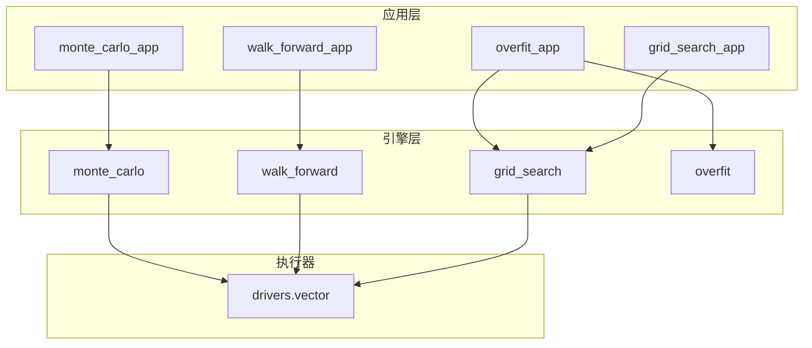
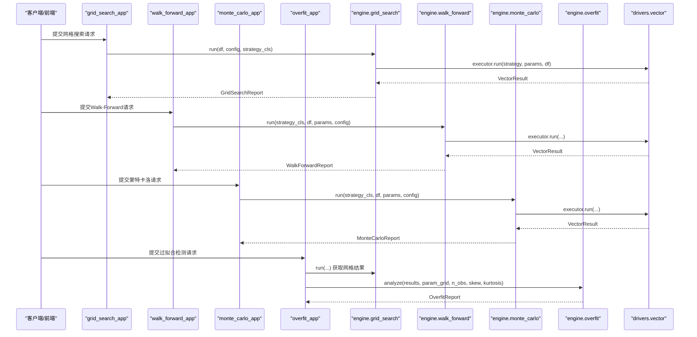
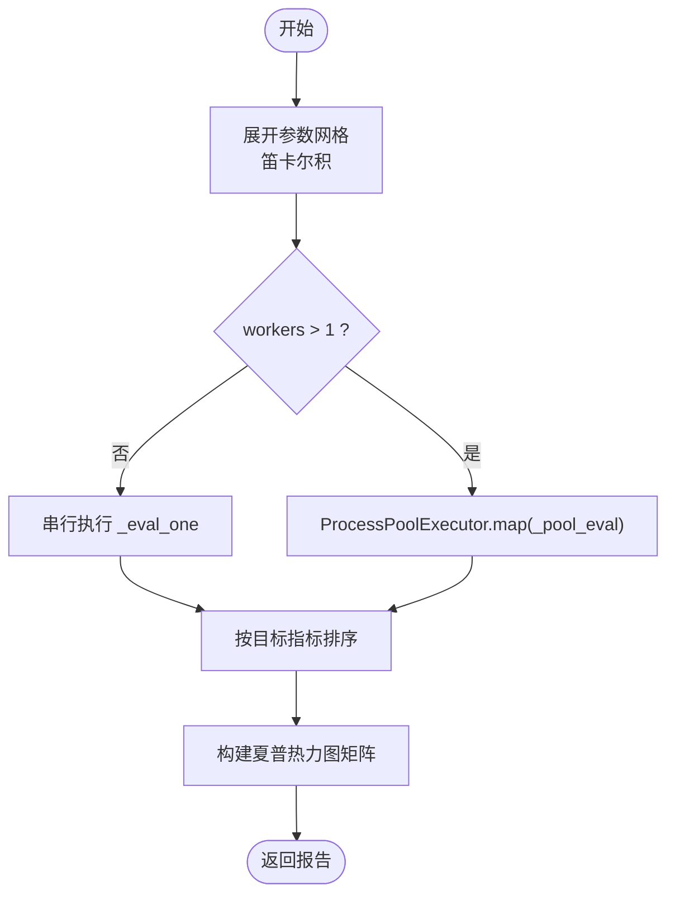
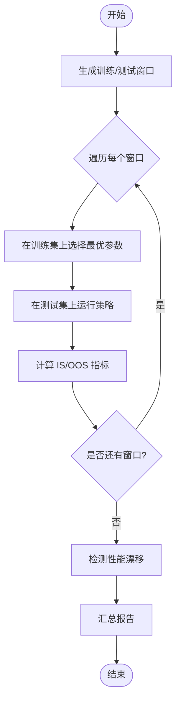
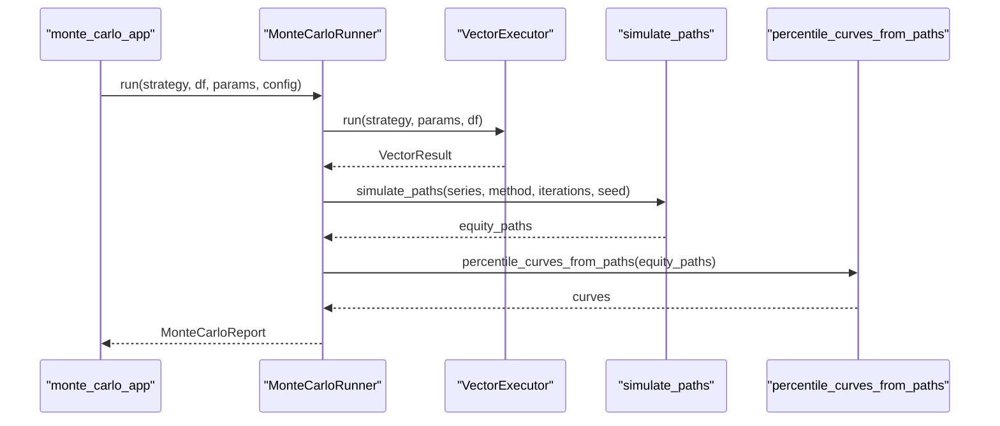
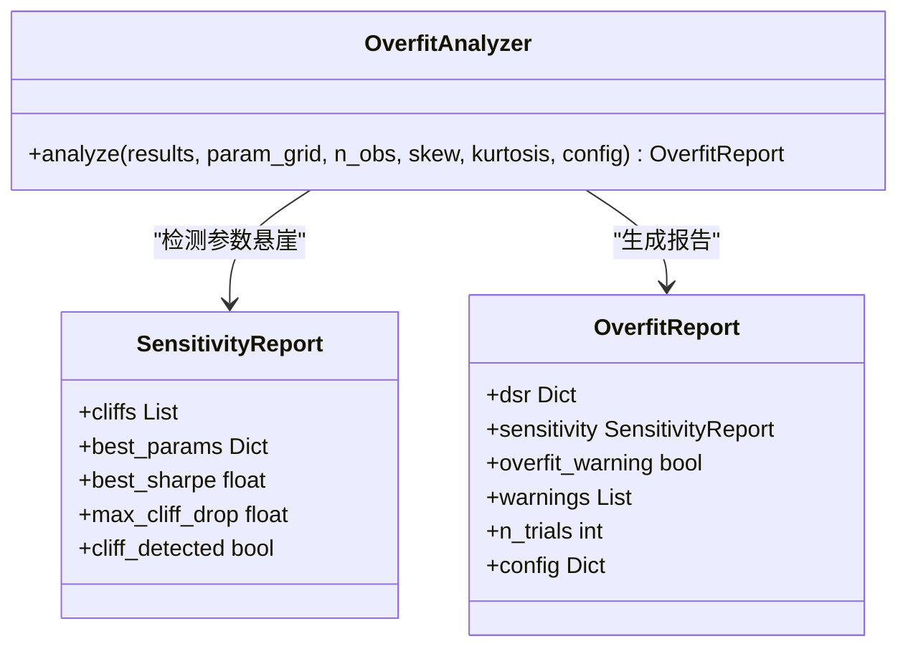
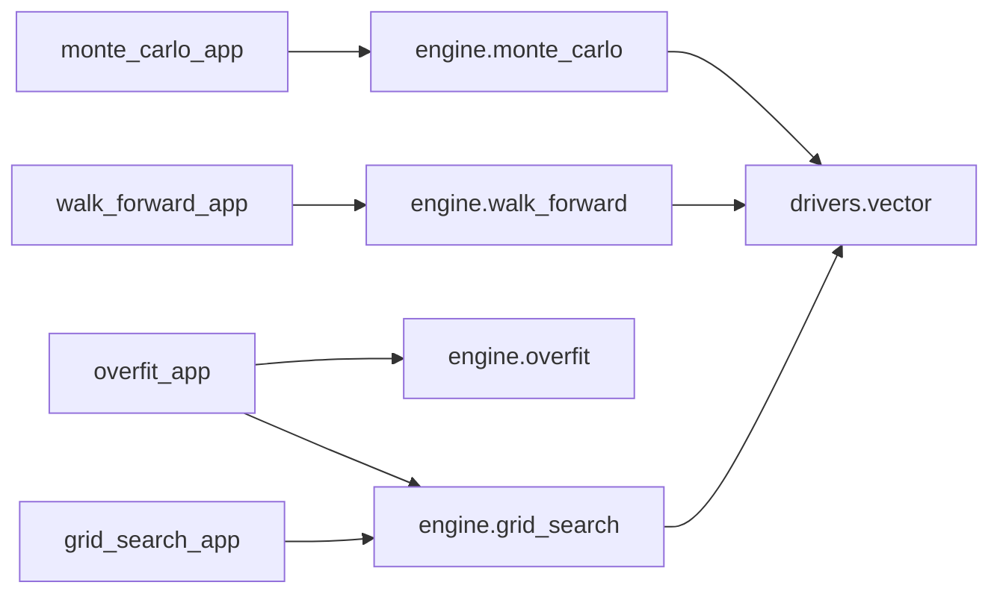

# 策略优化方法

<cite>
**本文引用的文件**
- [backend/app/grid_search_app.py](file://backend/app/grid_search_app.py)
- [backend/engine/grid_search.py](file://backend/engine/grid_search.py)
- [backend/app/walk_forward_app.py](file://backend/app/walk_forward_app.py)
- [backend/engine/walk_forward.py](file://backend/engine/walk_forward.py)
- [backend/app/monte_carlo_app.py](file://backend/app/monte_carlo_app.py)
- [backend/engine/monte_carlo.py](file://backend/engine/monte_carlo.py)
- [backend/app/overfit_app.py](file://backend/app/overfit_app.py)
- [backend/engine/overfit.py](file://backend/engine/overfit.py)
- [backend/engine/drivers/vector.py](file://backend/engine/drivers/vector.py)
- [backend/tests/test_grid_search_bt05.py](file://backend/tests/test_grid_search_bt05.py)
- [backend/tests/test_walk_forward_bt03.py](file://backend/tests/test_walk_forward_bt03.py)
- [backend/tests/test_monte_carlo_bt04.py](file://backend/tests/test_monte_carlo_bt04.py)
- [backend/tests/test_overfit_bt06.py](file://backend/tests/test_overfit_bt06.py)
</cite>

## 目录
1. [简介](#简介)
2. [项目结构](#项目结构)
3. [核心组件](#核心组件)
4. [架构总览](#架构总览)
5. [详细组件分析](#详细组件分析)
6. [依赖关系分析](#依赖关系分析)
7. [性能考量](#性能考量)
8. [故障排查指南](#故障排查指南)
9. [结论](#结论)
10. [附录](#附录)

## 简介
本指南面向量化策略开发者，系统阐述 Quant Agent 中的策略优化方法：网格搜索参数优化、前向 Walk-Forward 滚动验证、蒙特卡洛压力测试与过拟合检测。文档聚焦于参数空间定义、搜索算法选择、并行计算优化、稳健性评估与脆弱参数识别，帮助构建可复现、可解释且稳健的策略工作流。

## 项目结构
后端围绕“应用层用例 + 引擎实现 + 矢量化执行器”分层组织：
- 应用层用例：grid_search_app、walk_forward_app、monte_carlo_app、overfit_app 负责请求解析、数据加载、结果封装与错误映射。
- 引擎层：grid_search、walk_forward、monte_carlo、overfit 提供具体优化与评估逻辑。
- 执行器：drivers.vector 提供 VectorBT 快路径执行（或回退实现），统一费用与滑点配置，保证不同场景结果可比。

**图表来源**
- [backend/app/grid_search_app.py:1-105](file://backend/app/grid_search_app.py#L1-L105)
- [backend/engine/grid_search.py:1-297](file://backend/engine/grid_search.py#L1-L297)
- [backend/app/walk_forward_app.py:1-108](file://backend/app/walk_forward_app.py#L1-L108)
- [backend/engine/walk_forward.py:1-340](file://backend/engine/walk_forward.py#L1-L340)
- [backend/app/monte_carlo_app.py:1-99](file://backend/app/monte_carlo_app.py#L1-L99)
- [backend/engine/monte_carlo.py:1-254](file://backend/engine/monte_carlo.py#L1-L254)
- [backend/app/overfit_app.py:1-132](file://backend/app/overfit_app.py#L1-L132)
- [backend/engine/overfit.py:1-367](file://backend/engine/overfit.py#L1-L367)
- [backend/engine/drivers/vector.py:1-289](file://backend/engine/drivers/vector.py#L1-L289)

**章节来源**
- [backend/app/grid_search_app.py:1-105](file://backend/app/grid_search_app.py#L1-L105)
- [backend/engine/grid_search.py:1-297](file://backend/engine/grid_search.py#L1-L297)
- [backend/app/walk_forward_app.py:1-108](file://backend/app/walk_forward_app.py#L1-L108)
- [backend/engine/walk_forward.py:1-340](file://backend/engine/walk_forward.py#L1-L340)
- [backend/app/monte_carlo_app.py:1-99](file://backend/app/monte_carlo_app.py#L1-L99)
- [backend/engine/monte_carlo.py:1-254](file://backend/engine/monte_carlo.py#L1-L254)
- [backend/app/overfit_app.py:1-132](file://backend/app/overfit_app.py#L1-L132)
- [backend/engine/overfit.py:1-367](file://backend/engine/overfit.py#L1-L367)
- [backend/engine/drivers/vector.py:1-289](file://backend/engine/drivers/vector.py#L1-L289)

## 核心组件
- 网格搜索（Grid Search）：笛卡尔积展开参数网格，支持 ProcessPool 并发执行，按目标指标排序并生成夏普热力图矩阵。
- Walk-Forward（前向滚动验证）：在训练集上选择最优参数，在样本外窗口评估稳健性，检测性能漂移。
- 蒙特卡洛（Monte Carlo）：对基线回测的交易 PnL 或日收益进行重排/自助抽样，输出分位权益曲线与极端回撤。
- 过拟合检测（Overfit）：基于 Deflated Sharpe Ratio（DSR）校正多重试炼偏差，结合参数敏感性（悬崖检测）识别脆弱参数。

**章节来源**
- [backend/engine/grid_search.py:88-118](file://backend/engine/grid_search.py#L88-L118)
- [backend/engine/walk_forward.py:28-73](file://backend/engine/walk_forward.py#L28-L73)
- [backend/engine/monte_carlo.py:32-65](file://backend/engine/monte_carlo.py#L32-L65)
- [backend/engine/overfit.py:277-302](file://backend/engine/overfit.py#L277-L302)

## 架构总览
下图展示从应用层到引擎层再到执行器的调用链与数据流。

**图表来源**
- [backend/app/grid_search_app.py:47-105](file://backend/app/grid_search_app.py#L47-L105)
- [backend/engine/grid_search.py:221-297](file://backend/engine/grid_search.py#L221-L297)
- [backend/app/walk_forward_app.py:60-108](file://backend/app/walk_forward_app.py#L60-L108)
- [backend/engine/walk_forward.py:176-243](file://backend/engine/walk_forward.py#L176-L243)
- [backend/app/monte_carlo_app.py:47-99](file://backend/app/monte_carlo_app.py#L47-L99)
- [backend/engine/monte_carlo.py:149-254](file://backend/engine/monte_carlo.py#L149-L254)
- [backend/app/overfit_app.py:52-132](file://backend/app/overfit_app.py#L52-L132)
- [backend/engine/overfit.py:305-367](file://backend/engine/overfit.py#L305-L367)
- [backend/engine/drivers/vector.py:45-134](file://backend/engine/drivers/vector.py#L45-L134)

## 详细组件分析

### 网格搜索（参数优化）
- 参数空间定义：通过 param_grid 指定各参数的候选值集合；expand_param_grid 生成笛卡尔积组合，支持 max_combos 截断以避免爆炸。
- 搜索算法选择：默认全量网格搜索；可通过 target_metric 选择排序指标（sharpe、total_return、max_drawdown）。
- 并行计算优化：ProcessPoolExecutor 多进程并行执行 _eval_one，workers 自动根据 CPU 核数与组合数自适应；单格失败不影响整体。
- 可视化：build_heatmap 将结果转为 ECharts 友好的二维矩阵与 echarts_data，便于交互探索。

**图表来源**
- [backend/engine/grid_search.py:121-140](file://backend/engine/grid_search.py#L121-L140)
- [backend/engine/grid_search.py:221-297](file://backend/engine/grid_search.py#L221-L297)

**章节来源**
- [backend/engine/grid_search.py:88-118](file://backend/engine/grid_search.py#L88-L118)
- [backend/engine/grid_search.py:121-140](file://backend/engine/grid_search.py#L121-L140)
- [backend/engine/grid_search.py:143-218](file://backend/engine/grid_search.py#L143-L218)
- [backend/engine/grid_search.py:221-297](file://backend/engine/grid_search.py#L221-L297)
- [backend/app/grid_search_app.py:47-105](file://backend/app/grid_search_app.py#L47-L105)
- [backend/tests/test_grid_search_bt05.py:42-187](file://backend/tests/test_grid_search_bt05.py#L42-L187)

### 前向 Walk-Forward（稳健性评估）
- 原理：在每个滚动/锚定训练窗口内选择最优参数，在随后的样本外窗口评估，统计 OOS 表现与漂移信号。
- 窗口生成：generate_windows 支持滚动与锚定两种模式，step_bars 控制步长；最小折数 min_folds 保障统计意义。
- 指标计算：metrics_from_equity 从权益曲线计算总回报、夏普、最大回撤等，避免依赖外部字符串指标。
- 漂移检测：detect_performance_drift 综合 IS/OOS 夏普缺口、OOS 夏普趋势斜率、IS盈利但OOS亏损比例、末期相对初期恶化等规则。

**图表来源**
- [backend/engine/walk_forward.py:126-146](file://backend/engine/walk_forward.py#L126-L146)
- [backend/engine/walk_forward.py:176-243](file://backend/engine/walk_forward.py#L176-L243)
- [backend/engine/walk_forward.py:268-317](file://backend/engine/walk_forward.py#L268-L317)

**章节来源**
- [backend/engine/walk_forward.py:28-73](file://backend/engine/walk_forward.py#L28-L73)
- [backend/engine/walk_forward.py:103-124](file://backend/engine/walk_forward.py#L103-L124)
- [backend/engine/walk_forward.py:126-146](file://backend/engine/walk_forward.py#L126-L146)
- [backend/engine/walk_forward.py:176-243](file://backend/engine/walk_forward.py#L176-L243)
- [backend/engine/walk_forward.py:268-317](file://backend/engine/walk_forward.py#L268-L317)
- [backend/app/walk_forward_app.py:60-108](file://backend/app/walk_forward_app.py#L60-L108)
- [backend/tests/test_walk_forward_bt03.py:61-199](file://backend/tests/test_walk_forward_bt03.py#L61-L199)

### 蒙特卡洛（压力测试）
- 随机路径生成：extract_trade_pnls 或 extract_daily_returns 抽取序列；simulate_paths 支持 trade_reshuffle、trade_bootstrap、return_bootstrap 三种方法。
- 极端情景分析：percentile_curves_from_paths 输出 p5/p50/p95 权益曲线；worst_drawdown 与 drawdown_percentiles 刻画尾部风险。
- 鲁棒性度量：final_return_percentiles 给出最终回报分布的分位数，辅助判断策略在不同重采样下的稳定性。

**图表来源**
- [backend/app/monte_carlo_app.py:47-99](file://backend/app/monte_carlo_app.py#L47-L99)
- [backend/engine/monte_carlo.py:149-254](file://backend/engine/monte_carlo.py#L149-L254)
- [backend/engine/monte_carlo.py:95-146](file://backend/engine/monte_carlo.py#L95-L146)

**章节来源**
- [backend/engine/monte_carlo.py:32-65](file://backend/engine/monte_carlo.py#L32-L65)
- [backend/engine/monte_carlo.py:67-85](file://backend/engine/monte_carlo.py#L67-L85)
- [backend/engine/monte_carlo.py:95-146](file://backend/engine/monte_carlo.py#L95-L146)
- [backend/engine/monte_carlo.py:149-254](file://backend/engine/monte_carlo.py#L149-L254)
- [backend/app/monte_carlo_app.py:47-99](file://backend/app/monte_carlo_app.py#L47-L99)
- [backend/tests/test_monte_carlo_bt04.py:32-194](file://backend/tests/test_monte_carlo_bt04.py#L32-L194)

### 过拟合检测（稳健性诊断）
- DSR（Deflated Sharpe Ratio）：考虑非正态收益分布的夏普方差估计与多重试验期望最大值，得到校正后的显著性概率。
- 参数敏感性：detect_param_cliffs 在网格中检测相邻参数格的夏普悬崖，识别尖峰与脆弱区域。
- 综合告警：OverfitAnalyzer 聚合 DSR 与悬崖检测结果，输出 overfit_warning 与 warnings 列表。

**图表来源**
- [backend/engine/overfit.py:305-367](file://backend/engine/overfit.py#L305-L367)
- [backend/engine/overfit.py:163-199](file://backend/engine/overfit.py#L163-L199)
- [backend/engine/overfit.py:277-302](file://backend/engine/overfit.py#L277-L302)

**章节来源**
- [backend/engine/overfit.py:26-143](file://backend/engine/overfit.py#L26-L143)
- [backend/engine/overfit.py:146-161](file://backend/engine/overfit.py#L146-L161)
- [backend/engine/overfit.py:205-274](file://backend/engine/overfit.py#L205-L274)
- [backend/engine/overfit.py:277-367](file://backend/engine/overfit.py#L277-L367)
- [backend/app/overfit_app.py:52-132](file://backend/app/overfit_app.py#L52-L132)
- [backend/tests/test_overfit_bt06.py:28-136](file://backend/tests/test_overfit_bt06.py#L28-L136)

### 概念总览
下图为策略优化的通用流程：先进行网格搜索发现候选参数，再用 Walk-Forward 验证稳健性，随后用蒙特卡洛做压力测试，最后用 DSR 与悬崖检测诊断过拟合。

[此图为概念流程图，不直接映射具体源码]

## 依赖关系分析
- 应用层依赖引擎层：grid_search_app → grid_search；walk_forward_app → walk_forward；monte_carlo_app → monte_carlo；overfit_app → grid_search + overfit。
- 引擎层共享执行器：所有引擎均通过 drivers.vector.VectorExecutor 执行策略，确保费用、滑点一致性与结果可比。
- 策略接口约束：所有引擎要求策略实现 signals() 并标记为可矢量化，否则抛出 ValueError。

**图表来源**
- [backend/app/grid_search_app.py:47-105](file://backend/app/grid_search_app.py#L47-L105)
- [backend/app/walk_forward_app.py:60-108](file://backend/app/walk_forward_app.py#L60-L108)
- [backend/app/monte_carlo_app.py:47-99](file://backend/app/monte_carlo_app.py#L47-L99)
- [backend/app/overfit_app.py:52-132](file://backend/app/overfit_app.py#L52-L132)
- [backend/engine/grid_search.py:221-297](file://backend/engine/grid_search.py#L221-L297)
- [backend/engine/walk_forward.py:176-243](file://backend/engine/walk_forward.py#L176-L243)
- [backend/engine/monte_carlo.py:149-254](file://backend/engine/monte_carlo.py#L149-L254)
- [backend/engine/drivers/vector.py:45-134](file://backend/engine/drivers/vector.py#L45-L134)

**章节来源**
- [backend/engine/drivers/vector.py:45-134](file://backend/engine/drivers/vector.py#L45-L134)
- [backend/engine/grid_search.py:221-297](file://backend/engine/grid_search.py#L221-L297)
- [backend/engine/walk_forward.py:176-243](file://backend/engine/walk_forward.py#L176-L243)
- [backend/engine/monte_carlo.py:149-254](file://backend/engine/monte_carlo.py#L149-L254)

## 性能考量
- 并行度设置：GridSearchRunner 的 workers 默认取 min(4, cpu_count)，可根据 max_workers 调整；当组合数较少时自动降为串行。
- 组合截断：max_combos 限制网格规模，避免内存与时间开销过大。
- 矢量化执行：VectorExecutor 优先使用 VectorBT，缺失时回退到简单模拟，保证可用性。
- 指标计算：Walk-Forward 与 Monte Carlo 使用 NumPy/Pandas 高效计算，减少 Python 循环开销。

[本节提供一般性指导，无需特定文件引用]

## 故障排查指南
- 空参数网格：grid_search_app 与 overfit_app 会拒绝空 param_grid，需检查输入。
- 非矢量化策略：若策略未实现 signals() 或未声明可矢量化，各 Runner 将抛出 ValueError。
- 数据不足：Walk-Forward 要求足够长度以生成至少 min_folds 个窗口，否则会报错。
- 蒙特卡洛序列为空：当基线路径过短或交易数不足时，会回退至 return_bootstrap 或报错提示。
- 未知策略键：resolve_strategy 校验策略注册表，非法 key 将抛出异常。

**章节来源**
- [backend/app/grid_search_app.py:47-105](file://backend/app/grid_search_app.py#L47-L105)
- [backend/app/overfit_app.py:52-132](file://backend/app/overfit_app.py#L52-L132)
- [backend/engine/grid_search.py:232-243](file://backend/engine/grid_search.py#L232-L243)
- [backend/engine/walk_forward.py:186-204](file://backend/engine/walk_forward.py#L186-L204)
- [backend/engine/monte_carlo.py:159-201](file://backend/engine/monte_carlo.py#L159-L201)
- [backend/app/walk_forward_app.py:53-57](file://backend/app/walk_forward_app.py#L53-L57)

## 结论
Quant Agent 提供了完整的策略优化与稳健性评估工具链：网格搜索快速定位候选参数，Walk-Forward 验证跨市场环境的稳定性，蒙特卡洛揭示尾部风险与极端情景影响，过拟合检测通过 DSR 与参数悬崖识别脆弱参数。建议在实际工作中遵循“网格→滚动验证→蒙特卡洛→过拟合诊断”的流程，并结合热力图与分位曲线进行可视化决策。

[本节总结性内容，无需特定文件引用]

## 附录
- 常用配置项速查：
  - 网格搜索：param_grid、base_params、target_metric、max_workers、heatmap_x/y
  - Walk-Forward：train_bars、test_bars、step_bars、anchored、param_grid、target_metric
  - 蒙特卡洛：iterations、method、seed、percentiles、min_trades
  - 过拟合检测：dsr_warn_below、cliff_abs、cliff_rel、around_best_only

[本节为参考信息，无需特定文件引用]
