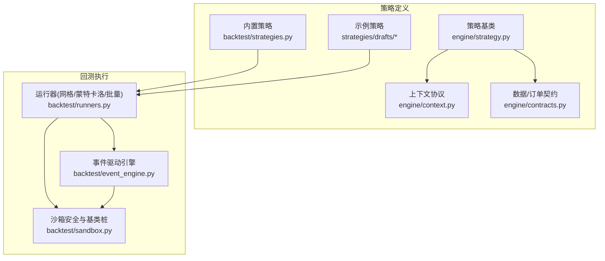
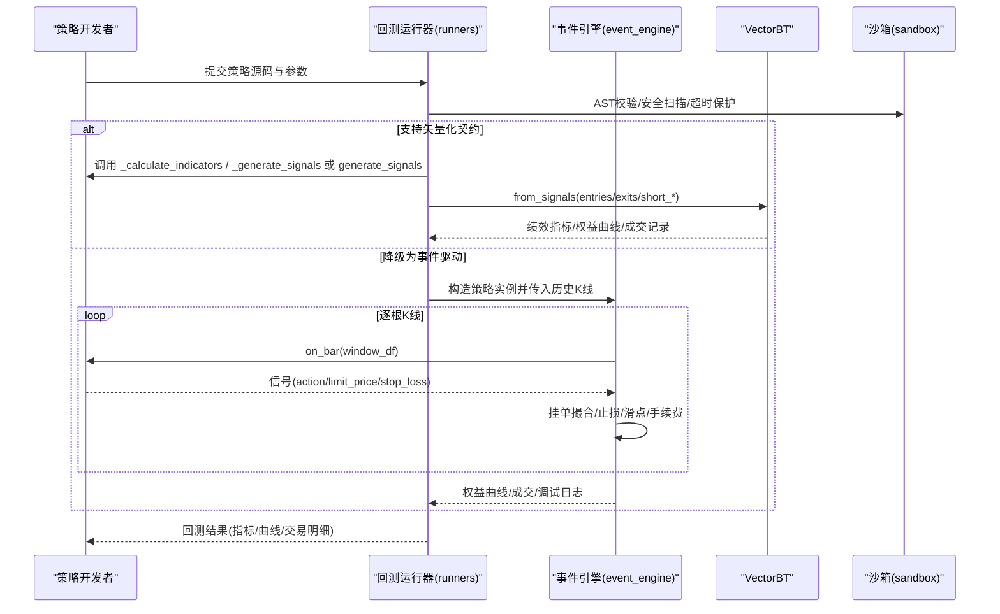
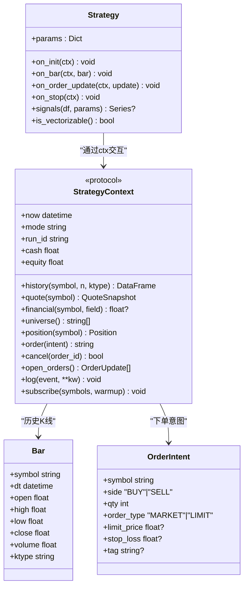
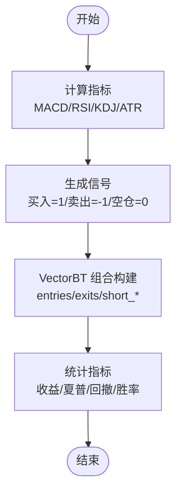
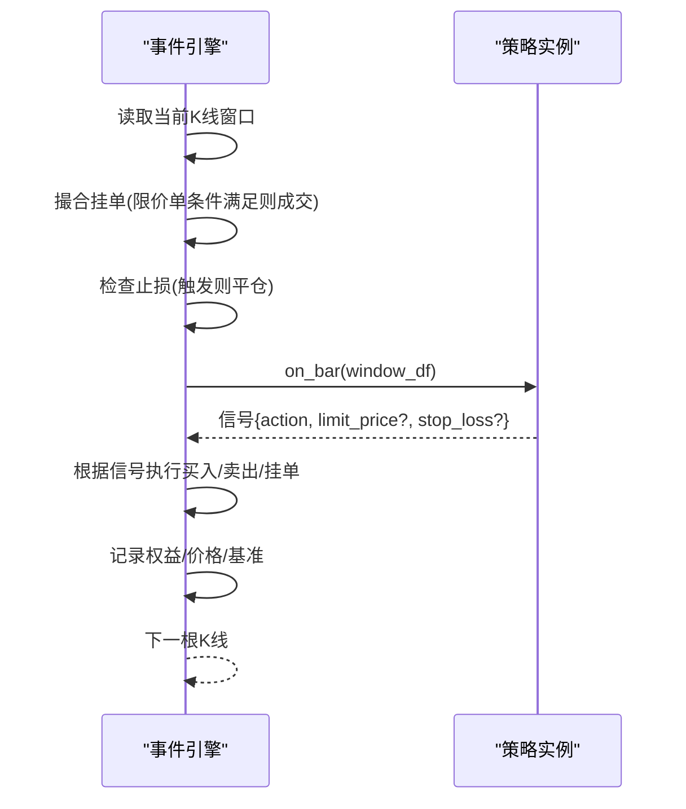
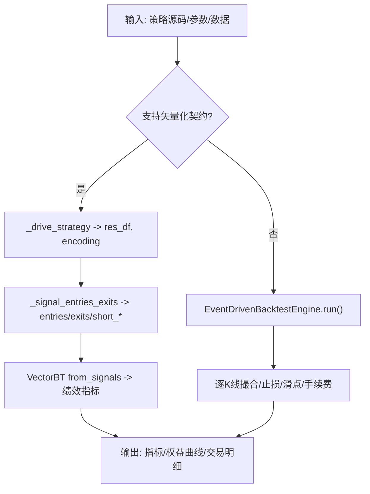
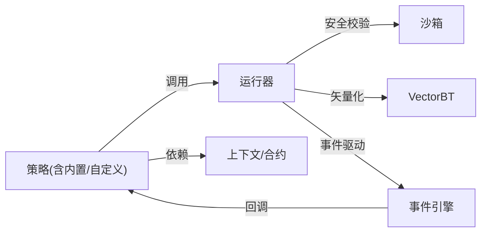

# 策略开发框架

<cite>
**本文引用的文件**
- [backend/backtest/strategies.py](file://backend/backtest/strategies.py)
- [backend/backtest/event_engine.py](file://backend/backtest/event_engine.py)
- [backend/backtest/runners.py](file://backend/backtest/runners.py)
- [backend/backtest/sandbox.py](file://backend/backtest/sandbox.py)
- [backend/engine/strategy.py](file://backend/engine/strategy.py)
- [backend/engine/context.py](file://backend/engine/context.py)
- [backend/engine/contracts.py](file://backend/engine/contracts.py)
- [strategies/drafts/_template_dense.py](file://strategies/drafts/_template_dense.py)
- [strategies/drafts/chandelierexit3atr.py](file://strategies/drafts/chandelierexit3atr.py)
</cite>

## 目录
1. [简介](#简介)
2. [项目结构](#项目结构)
3. [核心组件](#核心组件)
4. [架构总览](#架构总览)
5. [详细组件分析](#详细组件分析)
6. [依赖关系分析](#依赖关系分析)
7. [性能考量](#性能考量)
8. [故障排查指南](#故障排查指南)
9. [结论](#结论)
10. [附录：自定义策略开发指南](#附录自定义策略开发指南)

## 简介
本文件面向 Quant Agent 的策略开发框架，系统性阐述策略基类设计、内置策略实现、事件引擎与回测运行器的执行链路，以及自定义策略的开发方法。文档以“从数据加载到信号生成再到绩效分析”的完整流程为主线，配合架构图、时序图与流程图，帮助读者快速理解并高效扩展策略能力。

## 项目结构
围绕策略开发与回测的核心代码主要分布在以下模块：
- 策略基类与上下文契约：engine/strategy.py、engine/context.py、engine/contracts.py
- 内置矢量化策略：backtest/strategies.py（DivergenceResonanceStrategy）
- 事件驱动回测引擎：backtest/event_engine.py
- 回测运行器（网格搜索、蒙特卡洛、批量多标的）：backtest/runners.py
- 沙箱安全与基础设施：backtest/sandbox.py
- 示例策略草稿：strategies/drafts/*

**图表来源**
- [backend/engine/strategy.py:24-90](file://backend/engine/strategy.py#L24-L90)
- [backend/engine/context.py:26-172](file://backend/engine/context.py#L26-L172)
- [backend/engine/contracts.py:29-162](file://backend/engine/contracts.py#L29-L162)
- [backend/backtest/strategies.py:13-204](file://backend/backtest/strategies.py#L13-L204)
- [backend/backtest/event_engine.py:37-461](file://backend/backtest/event_engine.py#L37-L461)
- [backend/backtest/runners.py:99-569](file://backend/backtest/runners.py#L99-L569)
- [backend/backtest/sandbox.py:147-432](file://backend/backtest/sandbox.py#L147-L432)

**章节来源**
- [backend/engine/strategy.py:24-90](file://backend/engine/strategy.py#L24-L90)
- [backend/engine/context.py:26-172](file://backend/engine/context.py#L26-L172)
- [backend/engine/contracts.py:29-162](file://backend/engine/contracts.py#L29-L162)
- [backend/backtest/strategies.py:13-204](file://backend/backtest/strategies.py#L13-L204)
- [backend/backtest/event_engine.py:37-461](file://backend/backtest/event_engine.py#L37-L461)
- [backend/backtest/runners.py:99-569](file://backend/backtest/runners.py#L99-L569)
- [backend/backtest/sandbox.py:147-432](file://backend/backtest/sandbox.py#L147-L432)

## 核心组件
- 策略基类 Strategy：定义 on_init/on_bar/on_order_update/on_stop 生命周期，并提供可选的 signals 矢量化快路径接口。
- 策略上下文 StrategyContext：统一的数据/账户/执行 API，屏蔽回测与实盘差异，保证 as-of 防前视。
- 合约模型 Bar/QuoteSnapshot/OrderIntent/OrderUpdate/Position/RunManifest：策略与引擎之间的强类型契约。
- 内置策略 DivergenceResonanceStrategy：基于 RSI/MACD/KDJ/ATR 的动能背离与交叉共振，完全矢量化计算与交易。
- 事件驱动回测引擎 EventDrivenBacktestEngine：逐 K 线推进，支持限价单撮合、动态止损、滑点与手续费磨损。
- 回测运行器 runners：网格搜索、蒙特卡洛压力测试、批量多标的横截面回测；统一驱动策略两种契约（稠密 signal 或事件型 position）。
- 沙箱 sandbox：AST 级源码扫描、危险模块拦截、超时/内存熔断、安全 open 与装饰器白名单，提供 BaseStrategySandbox 供动态策略继承。

**章节来源**
- [backend/engine/strategy.py:24-90](file://backend/engine/strategy.py#L24-L90)
- [backend/engine/context.py:26-172](file://backend/engine/context.py#L26-L172)
- [backend/engine/contracts.py:29-162](file://backend/engine/contracts.py#L29-L162)
- [backend/backtest/strategies.py:13-204](file://backend/backtest/strategies.py#L13-L204)
- [backend/backtest/event_engine.py:37-461](file://backend/backtest/event_engine.py#L37-L461)
- [backend/backtest/runners.py:99-569](file://backend/backtest/runners.py#L99-L569)
- [backend/backtest/sandbox.py:147-432](file://backend/backtest/sandbox.py#L147-L432)

## 架构总览
下图展示了从策略定义到回测执行的端到端流程，包括两种策略契约（稠密 signal 与事件型 position）、Numba/VectorBT 矢量化加速、事件驱动高保真回测，以及沙箱安全约束。

**图表来源**
- [backend/backtest/runners.py:99-146](file://backend/backtest/runners.py#L99-L146)
- [backend/backtest/runners.py:148-279](file://backend/backtest/runners.py#L148-L279)
- [backend/backtest/runners.py:282-435](file://backend/backtest/runners.py#L282-L435)
- [backend/backtest/runners.py:438-569](file://backend/backtest/runners.py#L438-L569)
- [backend/backtest/event_engine.py:129-271](file://backend/backtest/event_engine.py#L129-L271)
- [backend/backtest/event_engine.py:274-461](file://backend/backtest/event_engine.py#L274-L461)
- [backend/backtest/sandbox.py:326-432](file://backend/backtest/sandbox.py#L326-L432)

## 详细组件分析

### 策略基类与上下文
- 策略基类 Strategy：
  - 生命周期：on_init → on_bar（必须实现）→ on_order_update（可选）→ on_stop（可选）
  - 可选矢量化快路径：signals(df, params) 返回 pd.Series(1/-1/0)，is_vectorizable() 判断是否启用
- 上下文 StrategyContext：
  - 数据面：history/quote/financial/universe（as-of ctx.now，防前视）
  - 账户面：position/cash/equity
  - 执行面：order/cancel/open_orders
  - 订阅：subscribe(symbols, warmup)
- 合约模型：
  - Bar/QuoteSnapshot：行情单元，dt 要求时区感知
  - OrderIntent/OrderUpdate：下单意图与回报
  - Position：持仓快照
  - RunManifest：运行指纹，支持可复现性追踪

**图表来源**
- [backend/engine/strategy.py:24-90](file://backend/engine/strategy.py#L24-L90)
- [backend/engine/context.py:26-172](file://backend/engine/context.py#L26-L172)
- [backend/engine/contracts.py:29-162](file://backend/engine/contracts.py#L29-L162)

**章节来源**
- [backend/engine/strategy.py:24-90](file://backend/engine/strategy.py#L24-L90)
- [backend/engine/context.py:26-172](file://backend/engine/context.py#L26-L172)
- [backend/engine/contracts.py:29-162](file://backend/engine/contracts.py#L29-L162)

### 内置策略：DivergenceResonanceStrategy
- 设计要点：
  - 指标计算：MACD、RSI(14)、KDJ(9,3,3)、ATR(14)
  - 信号生成：基于矩阵运算的形态识别（新低/新高、量比确认、RSI/MACD 背离、KDJ 金叉/死叉）
  - 交易执行：使用 VectorBT Portfolio.from_signals，支持 ATR 跟踪止损、滑点与手续费
- 输出：指标、权益曲线、交易明细、摩擦成本等

**图表来源**
- [backend/backtest/strategies.py:38-108](file://backend/backtest/strategies.py#L38-L108)
- [backend/backtest/strategies.py:110-204](file://backend/backtest/strategies.py#L110-L204)

**章节来源**
- [backend/backtest/strategies.py:13-204](file://backend/backtest/strategies.py#L13-L204)

### 事件驱动回测引擎
- 逐 K 线推进：
  - 检查并撮合历史挂单（限价单穿透）
  - 动态止损与风控拦截（基于策略设置的 stop_loss）
  - 策略信号处理：支持 on_bar/on_tick，返回 action/limit_price/stop_loss
  - 滑点与手续费磨损：买入/卖出分别按滑点调整成交价，累计摩擦成本
- 输出：权益曲线、交易明细、调试日志、综合指标

**图表来源**
- [backend/backtest/event_engine.py:129-271](file://backend/backtest/event_engine.py#L129-L271)
- [backend/backtest/event_engine.py:274-461](file://backend/backtest/event_engine.py#L274-L461)

**章节来源**
- [backend/backtest/event_engine.py:37-461](file://backend/backtest/event_engine.py#L37-L461)

### 回测运行器
- 统一驱动策略：
  - 稠密契约：_calculate_indicators + _generate_signals，输出 dense signal（1/0/-1）
  - 事件契约：generate_signals(df)，输出 event 标记（1=买入，-1=卖出平多，0=无操作）
- 网格搜索：遍历参数组合，按目标指标排序 Top N
- 蒙特卡洛压力测试：对历史价格注入噪声（正态/拉普拉斯/t分布），评估鲁棒性
- 批量多标的：将备选池标的合并为横截面组合，统一回测并输出组合绩效

**图表来源**
- [backend/backtest/runners.py:99-146](file://backend/backtest/runners.py#L99-L146)
- [backend/backtest/runners.py:148-279](file://backend/backtest/runners.py#L148-L279)
- [backend/backtest/runners.py:282-435](file://backend/backtest/runners.py#L282-L435)
- [backend/backtest/runners.py:438-569](file://backend/backtest/runners.py#L438-L569)
- [backend/backtest/event_engine.py:129-271](file://backend/backtest/event_engine.py#L129-L271)

**章节来源**
- [backend/backtest/runners.py:99-569](file://backend/backtest/runners.py#L99-L569)
- [backend/backtest/event_engine.py:129-271](file://backend/backtest/event_engine.py#L129-L271)

### 沙箱安全与基础设施
- AST 级源码扫描：禁止高危函数/属性、限制装饰器白名单、禁止 while 循环与递归、限制 range 规模
- 安全导入与文件访问：仅允许白名单模块，open 包装防止目录穿越
- 超时与内存熔断：基于 sys.settrace 的执行追踪，限制执行时间与内存增量
- BaseStrategySandbox：为动态策略提供位置状态查询接口

**章节来源**
- [backend/backtest/sandbox.py:147-432](file://backend/backtest/sandbox.py#L147-L432)

## 依赖关系分析
- 策略层依赖：
  - Strategy 依赖 StrategyContext 与合约模型，不直接依赖外部服务
  - 内置策略 DivergenceResonanceStrategy 依赖 pandas/numpy/vectorbt
- 执行层依赖：
  - 运行器依赖沙箱进行安全校验与执行环境隔离
  - 事件引擎依赖策略实例的 on_bar/on_tick 回调
  - 运行器在兼容情况下优先走 VectorBT 矢量化路径，否则降级事件驱动
- 外部依赖：
  - vectorbt：高性能组合回测与统计
  - numba：可选 JIT 加速（通过沙箱预注入装饰器）

**图表来源**
- [backend/backtest/runners.py:99-146](file://backend/backtest/runners.py#L99-L146)
- [backend/backtest/event_engine.py:129-271](file://backend/backtest/event_engine.py#L129-L271)
- [backend/backtest/sandbox.py:326-432](file://backend/backtest/sandbox.py#L326-L432)
- [backend/engine/strategy.py:24-90](file://backend/engine/strategy.py#L24-L90)
- [backend/engine/context.py:26-172](file://backend/engine/context.py#L26-L172)
- [backend/engine/contracts.py:29-162](file://backend/engine/contracts.py#L29-L162)

**章节来源**
- [backend/backtest/runners.py:99-569](file://backend/backtest/runners.py#L99-L569)
- [backend/backtest/event_engine.py:37-461](file://backend/backtest/event_engine.py#L37-L461)
- [backend/backtest/sandbox.py:147-432](file://backend/backtest/sandbox.py#L147-L432)
- [backend/engine/strategy.py:24-90](file://backend/engine/strategy.py#L24-L90)
- [backend/engine/context.py:26-172](file://backend/engine/context.py#L26-L172)
- [backend/engine/contracts.py:29-162](file://backend/engine/contracts.py#L29-L162)

## 性能考量
- 矢量化优先：尽量采用 numpy/pandas 向量化计算，避免 for 循环与 iterrows/itertuples
- Numba 加速：可通过 @njit/@jit 等装饰器提升热点计算性能（需通过沙箱白名单）
- 数据清洗：确保 OHLCV 列名一致（小写），去除重复列与 NaN，减少无效计算
- 止损与滑点：合理设置 ATR 跟踪止损比例与滑点，避免过度交易导致摩擦成本过高
- 批量回测：多标的横截面回测时，注意资金分配与缺失值填充（ffill/fillna）

[本节为通用指导，无需特定文件引用]

## 故障排查指南
- 策略未找到类名：检查源码中类名是否与传入 class_name 一致
- 数据长度不足：确保清洗后至少 10 根有效 K 线
- 沙箱拦截：
  - 非法装饰器：仅允许 Numba JIT 相关装饰器
  - 危险模块：禁止 os/sys/subprocess 等底层模块
  - 性能风险：禁止 while 循环、递归、超大 range
- 超时/内存熔断：若策略耗时过长或内存增长过快，将被强制中断
- 事件驱动模式：开启 debug_mode 可查看逐 K 线日志，定位信号与撮合问题

**章节来源**
- [backend/backtest/sandbox.py:326-432](file://backend/backtest/sandbox.py#L326-L432)
- [backend/backtest/event_engine.py:129-271](file://backend/backtest/event_engine.py#L129-L271)
- [backend/backtest/runners.py:148-279](file://backend/backtest/runners.py#L148-L279)

## 结论
Quant Agent 策略开发框架通过清晰的基类抽象、严格的上下文契约与安全沙箱，实现了回测与实盘的同构体验。内置策略展示了矢量化计算的强大能力，事件驱动引擎提供了高保真的撮合与风控机制。运行器支持网格搜索、蒙特卡洛与批量多标的回测，覆盖从单标的到组合的完整研究流程。遵循本文档的最佳实践，可高效开发、验证与部署高质量策略。

[本节为总结性内容，无需特定文件引用]

## 附录：自定义策略开发指南
- 选择契约：
  - 稠密 signal 契约：实现 _calculate_indicators 与 _generate_signals，输出 df["signal"]（1/0/-1）
  - 事件型 position 契约：实现 generate_signals(df)，输出包含 position 列的 DataFrame（1=买入，-1=卖出平多，0=无操作）
- 指标计算：
  - 使用 numpy/pandas 向量化计算 MACD/RSI/KDJ/ATR 等常用指标
  - 避免行级迭代，优先使用 rolling/ewm/shift 等高效操作
- 信号生成：
  - 明确入场/出场条件，结合量价与波动率过滤假信号
  - 可使用 ATR 动态止损，降低尾部风险
- 仓位管理：
  - 固定手数或基于波动率/账户净值动态调整
  - 在事件驱动模式下，可通过 _position_size/_position_data 维护持仓信息
- 回测与优化：
  - 使用网格搜索寻找稳健参数组合
  - 通过蒙特卡洛压力测试评估策略鲁棒性
- 最佳实践：
  - 保持策略简洁、可解释，避免过拟合
  - 严格使用 as-of 数据，杜绝未来函数
  - 充分回测与样本外验证，关注夏普比率、最大回撤与胜率

**章节来源**
- [strategies/drafts/_template_dense.py:1-113](file://strategies/drafts/_template_dense.py#L1-L113)
- [strategies/drafts/chandelierexit3atr.py:1-73](file://strategies/drafts/chandelierexit3atr.py#L1-L73)
- [backend/backtest/runners.py:99-146](file://backend/backtest/runners.py#L99-L146)
- [backend/backtest/event_engine.py:129-271](file://backend/backtest/event_engine.py#L129-L271)
- [backend/backtest/sandbox.py:147-432](file://backend/backtest/sandbox.py#L147-L432)
