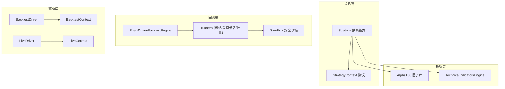
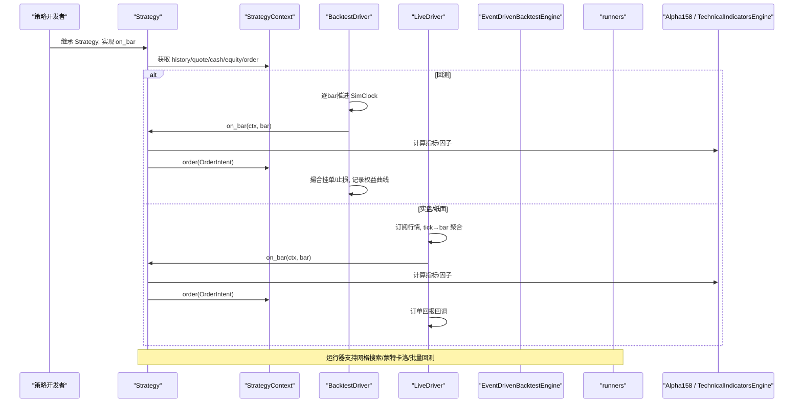
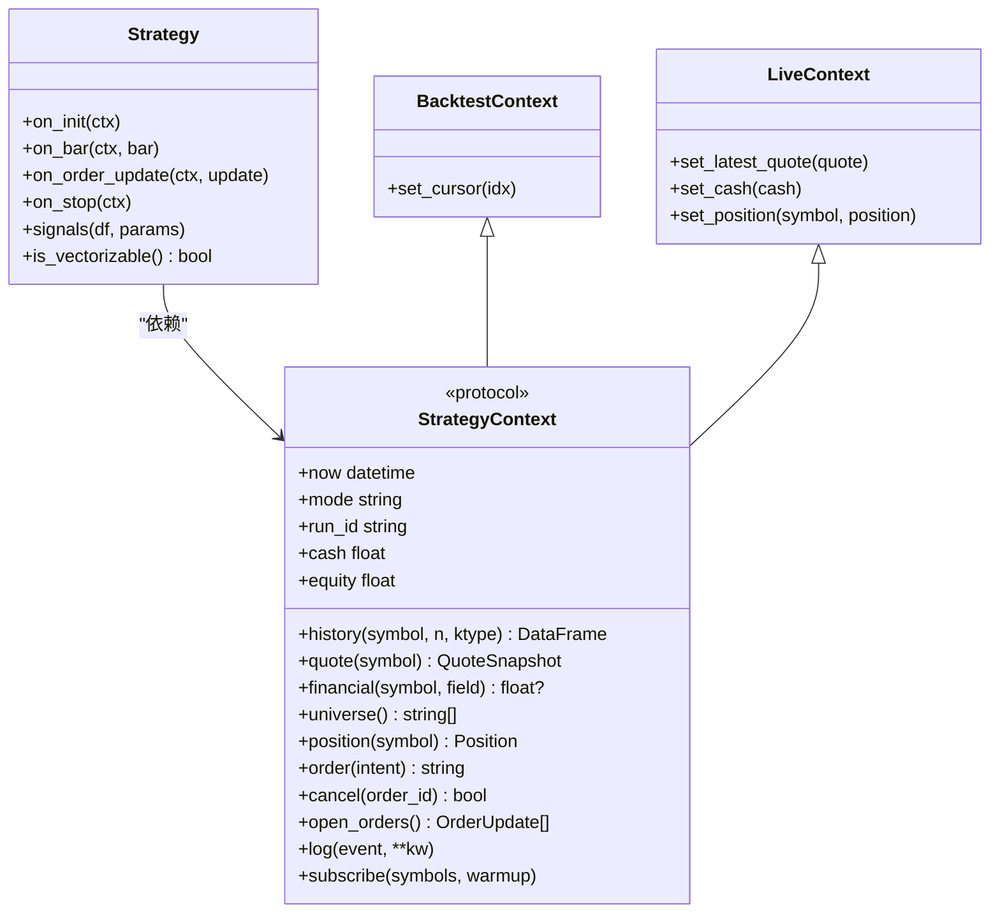
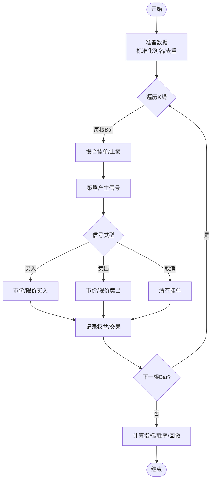
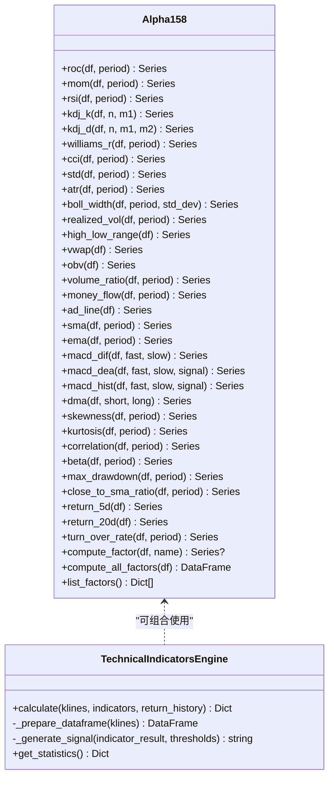
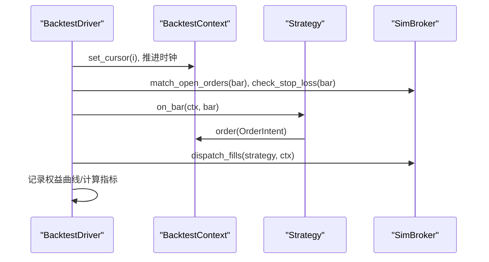
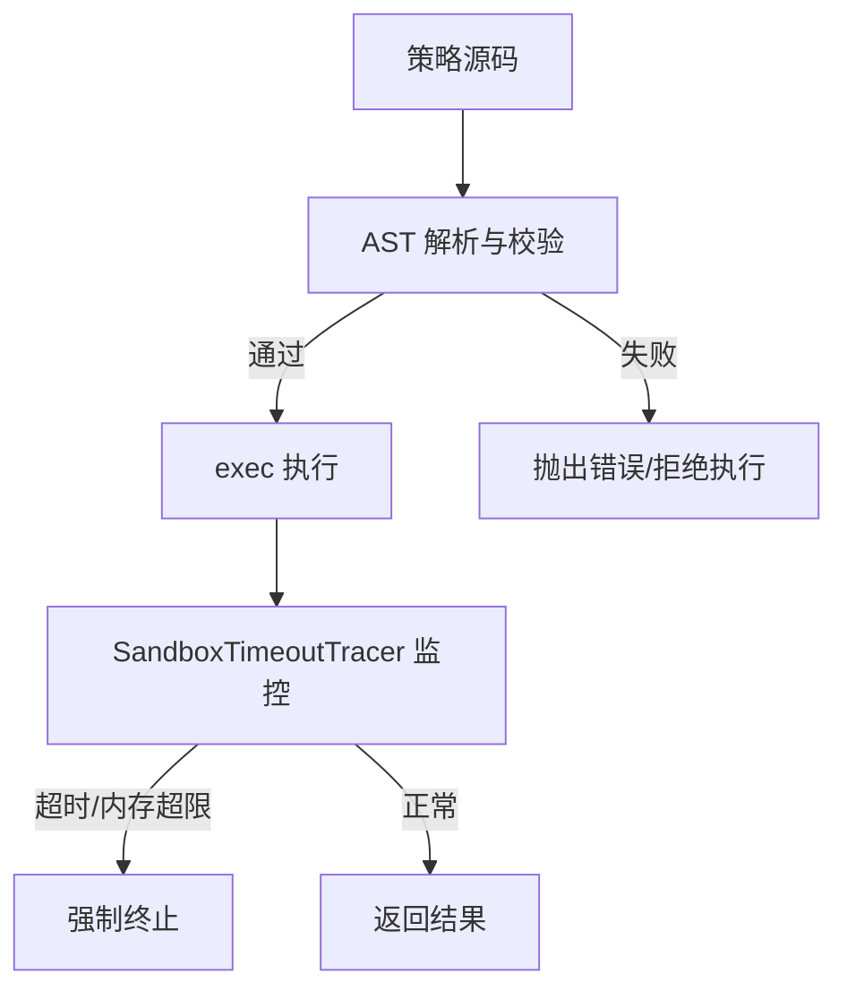
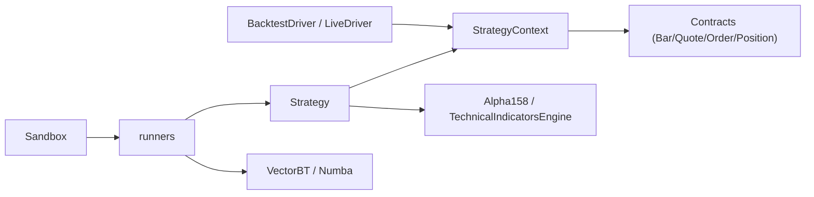

# 量化策略开发

<cite>
**本文引用的文件**
- [backend/engine/strategy.py](file://backend/engine/strategy.py)
- [backend/engine/context.py](file://backend/engine/context.py)
- [backend/engine/contracts.py](file://backend/engine/contracts.py)
- [backend/backtest/event_engine.py](file://backend/backtest/event_engine.py)
- [backend/backtest/runners.py](file://backend/backtest/runners.py)
- [backend/backtest/sandbox.py](file://backend/backtest/sandbox.py)
- [backend/domain/alpha158.py](file://backend/domain/alpha158.py)
- [backend/utils/technical_indicators_pro.py](file://backend/utils/technical_indicators_pro.py)
- [backend/engine/drivers/backtest.py](file://backend/engine/drivers/backtest.py)
- [backend/engine/drivers/live.py](file://backend/engine/drivers/live.py)
- [strategies/drafts/_template_dense.py](file://strategies/drafts/_template_dense.py)
- [strategies/drafts/chandelierexit3atr.py](file://strategies/drafts/chandelierexit3atr.py)
</cite>

## 目录
1. [简介](#简介)
2. [项目结构](#项目结构)
3. [核心组件](#核心组件)
4. [架构总览](#架构总览)
5. [详细组件分析](#详细组件分析)
6. [依赖关系分析](#依赖关系分析)
7. [性能与优化](#性能与优化)
8. [故障排查指南](#故障排查指南)
9. [结论](#结论)
10. [附录：策略编写规范与示例](#附录策略编写规范与示例)

## 简介
本指南面向量化开发者，提供从策略构思、指标构建、回测验证、参数优化到实盘模拟与实盘交易的完整工作流程。系统采用“事件驱动 + 矢量化快路径”的双引擎架构，统一策略接口，确保回测与实盘同构；内置 Alpha158 因子库与生产级技术指标引擎，支持网格搜索、蒙特卡洛压力测试与多标的批量回测；沙箱安全机制保障动态策略执行的安全性与稳定性。

## 项目结构
- 策略基类与上下文：定义策略生命周期与唯一 API 面，屏蔽底层数据与执行差异
- 回测运行器：高保真事件驱动引擎与 VectorBT 矢量化快路径，支持网格搜索、蒙特卡洛、批量回测
- 指标体系：Alpha158 因子库与 TechnicalIndicatorsEngine，覆盖趋势、动量、波动、量价等
- 驱动层：BacktestDriver（历史回放）与 LiveDriver（实时/纸面），通过统一 Context 暴露能力
- 安全沙箱：AST 扫描、白名单导入、超时/内存熔断、目录穿越防护

图表来源
- [backend/engine/strategy.py:24-90](file://backend/engine/strategy.py#L24-L90)
- [backend/engine/context.py:25-122](file://backend/engine/context.py#L25-L122)
- [backend/backtest/event_engine.py:37-271](file://backend/backtest/event_engine.py#L37-L271)
- [backend/backtest/runners.py:99-145](file://backend/backtest/runners.py#L99-L145)
- [backend/backtest/sandbox.py:147-339](file://backend/backtest/sandbox.py#L147-L339)
- [backend/domain/alpha158.py:31-385](file://backend/domain/alpha158.py#L31-L385)
- [backend/utils/technical_indicators_pro.py:175-247](file://backend/utils/technical_indicators_pro.py#L175-L247)
- [backend/engine/drivers/backtest.py:180-344](file://backend/engine/drivers/backtest.py#L180-L344)
- [backend/engine/drivers/live.py:220-344](file://backend/engine/drivers/live.py#L220-L344)

章节来源
- [backend/engine/strategy.py:24-90](file://backend/engine/strategy.py#L24-L90)
- [backend/engine/context.py:25-122](file://backend/engine/context.py#L25-L122)
- [backend/backtest/event_engine.py:37-271](file://backend/backtest/event_engine.py#L37-L271)
- [backend/backtest/runners.py:99-145](file://backend/backtest/runners.py#L99-L145)
- [backend/backtest/sandbox.py:147-339](file://backend/backtest/sandbox.py#L147-L339)
- [backend/domain/alpha158.py:31-385](file://backend/domain/alpha158.py#L31-L385)
- [backend/utils/technical_indicators_pro.py:175-247](file://backend/utils/technical_indicators_pro.py#L175-L247)
- [backend/engine/drivers/backtest.py:180-344](file://backend/engine/drivers/backtest.py#L180-L344)
- [backend/engine/drivers/live.py:220-344](file://backend/engine/drivers/live.py#L220-L344)

## 核心组件
- 策略基类 Strategy：定义 on_init/on_bar/on_order_update/on_stop 生命周期，以及可选的矢量化 signals() 接口
- 策略上下文 StrategyContext：统一数据、账户、执行与日志接口，隐藏回测/实盘差异
- 回测引擎 EventDrivenBacktestEngine：逐 K 线事件驱动撮合，支持限价单、止损、滑点与手续费
- 运行器 runners：网格搜索、蒙特卡洛压力测试、多标的批量回测，基于 Numba 与 VectorBT 的高性能实现
- 指标库 Alpha158：158 个经典因子（动量、波动、量价、均线、统计、衍生）
- 技术指标引擎 TechnicalIndicatorsEngine：模块化、可配置、带缓存的技术指标计算与信号生成
- 驱动层 BacktestDriver/LiveDriver：分别负责历史回放与实时/纸面交易，使用统一 Context 暴露能力
- 安全沙箱 Sandbox：AST 静态检查、白名单模块、装饰器白名单、目录穿越防护、超时/内存熔断

章节来源
- [backend/engine/strategy.py:24-90](file://backend/engine/strategy.py#L24-L90)
- [backend/engine/context.py:25-122](file://backend/engine/context.py#L25-L122)
- [backend/backtest/event_engine.py:37-271](file://backend/backtest/event_engine.py#L37-L271)
- [backend/backtest/runners.py:148-569](file://backend/backtest/runners.py#L148-L569)
- [backend/domain/alpha158.py:31-385](file://backend/domain/alpha158.py#L31-L385)
- [backend/utils/technical_indicators_pro.py:175-247](file://backend/utils/technical_indicators_pro.py#L175-L247)
- [backend/engine/drivers/backtest.py:180-344](file://backend/engine/drivers/backtest.py#L180-L344)
- [backend/engine/drivers/live.py:220-344](file://backend/engine/drivers/live.py#L220-L344)
- [backend/backtest/sandbox.py:147-339](file://backend/backtest/sandbox.py#L147-L339)

## 架构总览
系统以 Strategy 为入口，通过 StrategyContext 访问数据与执行能力；回测阶段由 BacktestDriver 或 EventDrivenBacktestEngine 驱动，实盘阶段由 LiveDriver 订阅行情并聚合 bar 后调用策略；指标计算通过 Alpha158 与 TechnicalIndicatorsEngine 提供；运行器提供网格搜索、蒙特卡洛与批量回测；沙箱保证动态策略执行安全。

图表来源
- [backend/engine/strategy.py:24-90](file://backend/engine/strategy.py#L24-L90)
- [backend/engine/context.py:25-122](file://backend/engine/context.py#L25-L122)
- [backend/engine/drivers/backtest.py:180-344](file://backend/engine/drivers/backtest.py#L180-L344)
- [backend/engine/drivers/live.py:220-344](file://backend/engine/drivers/live.py#L220-L344)
- [backend/backtest/event_engine.py:37-271](file://backend/backtest/event_engine.py#L37-L271)
- [backend/backtest/runners.py:148-569](file://backend/backtest/runners.py#L148-L569)
- [backend/domain/alpha158.py:31-385](file://backend/domain/alpha158.py#L31-L385)
- [backend/utils/technical_indicators_pro.py:175-247](file://backend/utils/technical_indicators_pro.py#L175-L247)

## 详细组件分析

### 策略基类与上下文
- Strategy：定义 on_init/on_bar/on_order_update/on_stop 生命周期；可选 signals() 用于矢量化快路径
- StrategyContext：提供 now/mode/run_id/history/quote/financial/universe/position/cash/equity/order/cancel/open_orders/log/subscribe
- BacktestContext/LiveContext：分别实现历史回放与实时/纸面的数据与执行细节

图表来源
- [backend/engine/strategy.py:24-90](file://backend/engine/strategy.py#L24-L90)
- [backend/engine/context.py:25-122](file://backend/engine/context.py#L25-L122)
- [backend/engine/drivers/backtest.py:59-177](file://backend/engine/drivers/backtest.py#L59-L177)
- [backend/engine/drivers/live.py:118-202](file://backend/engine/drivers/live.py#L118-L202)

章节来源
- [backend/engine/strategy.py:24-90](file://backend/engine/strategy.py#L24-L90)
- [backend/engine/context.py:25-122](file://backend/engine/context.py#L25-L122)
- [backend/engine/drivers/backtest.py:59-177](file://backend/engine/drivers/backtest.py#L59-L177)
- [backend/engine/drivers/live.py:118-202](file://backend/engine/drivers/live.py#L118-L202)

### 回测运行器与事件引擎
- EventDrivenBacktestEngine：逐 K 线推进，处理限价单、止损、滑点与手续费，输出权益曲线、交易明细与指标
- runners：_drive_strategy 兼容两种契约（稠密 signal 列与事件标记），_signal_entries_exits 转换为 VectorBT 输入；run_grid_search_backtest/run_monte_carlo_stress_test/run_batch_sandbox_backtest 提供参数寻优与压力测试
- 进度与调试：progress_queue 推送阶段进度，debug_mode 输出逐 K 线日志

图表来源
- [backend/backtest/event_engine.py:129-271](file://backend/backtest/event_engine.py#L129-L271)
- [backend/backtest/runners.py:99-145](file://backend/backtest/runners.py#L99-L145)
- [backend/backtest/runners.py:148-279](file://backend/backtest/runners.py#L148-L279)
- [backend/backtest/runners.py:282-435](file://backend/backtest/runners.py#L282-L435)
- [backend/backtest/runners.py:438-569](file://backend/backtest/runners.py#L438-L569)

章节来源
- [backend/backtest/event_engine.py:129-271](file://backend/backtest/event_engine.py#L129-L271)
- [backend/backtest/runners.py:99-145](file://backend/backtest/runners.py#L99-L145)
- [backend/backtest/runners.py:148-279](file://backend/backtest/runners.py#L148-L279)
- [backend/backtest/runners.py:282-435](file://backend/backtest/runners.py#L282-L435)
- [backend/backtest/runners.py:438-569](file://backend/backtest/runners.py#L438-L569)

### 技术指标与因子库
- Alpha158：纯 pandas 矢量化实现，包含 ROC/MOM/RSI/KDJ/WILLIAMS_R/CCI、ATR/BOLL_WIDTH/REALIZED_VOL、VWAP/OBV/VOLUME_RATIO/MFI/AD_LINE、SMA/EMA/MACD/DMA、偏度/峰度/相关性/Beta/滚动最大回撤等，并提供 FACTOR_REGISTRY 注册表与 compute_all_factors
- TechnicalIndicatorsEngine：模块化指标计算，支持 MA/EMA/MACD/RSI/STOCHASTIC/BOLLINGER/ATR/OBV/VWAP/ADX/CCI/VWMA/ATR_PERCENT/ELDER_RAY/KELTNER_CHANNELS，具备缓存装饰器与自动信号阈值

图表来源
- [backend/domain/alpha158.py:31-385](file://backend/domain/alpha158.py#L31-L385)
- [backend/utils/technical_indicators_pro.py:175-247](file://backend/utils/technical_indicators_pro.py#L175-L247)
- [backend/utils/technical_indicators_pro.py:262-608](file://backend/utils/technical_indicators_pro.py#L262-L608)

章节来源
- [backend/domain/alpha158.py:31-385](file://backend/domain/alpha158.py#L31-L385)
- [backend/utils/technical_indicators_pro.py:175-247](file://backend/utils/technical_indicators_pro.py#L175-L247)
- [backend/utils/technical_indicators_pro.py:262-608](file://backend/utils/technical_indicators_pro.py#L262-L608)

### 驱动层：回测与实盘
- BacktestDriver：构造 BacktestContext，SimClock 逐 bar 推进，先撮合挂单/止损，再驱动策略 on_bar，分发成交回报，记录权益曲线，计算指标
- LiveDriver：订阅行情（Redis Pub/Sub），tick→bar 聚合，异步隔离策略执行，支持 paper/live 模式切换，订单回报回调

图表来源
- [backend/engine/drivers/backtest.py:180-344](file://backend/engine/drivers/backtest.py#L180-L344)
- [backend/engine/drivers/live.py:220-344](file://backend/engine/drivers/live.py#L220-L344)

章节来源
- [backend/engine/drivers/backtest.py:180-344](file://backend/engine/drivers/backtest.py#L180-L344)
- [backend/engine/drivers/live.py:220-344](file://backend/engine/drivers/live.py#L220-L344)

### 安全沙箱与动态策略
- AST 静态检查：禁止危险函数/属性、限制装饰器白名单、拦截非白名单模块导入
- 文件安全：目录穿越防护，限定 sandbox_workspace 目录
- 超时/内存熔断：基于 sys.settrace 的执行追踪，防止死循环与 OOM
- 策略基桩：BaseStrategySandbox 提供持仓状态查询

图表来源
- [backend/backtest/sandbox.py:147-339](file://backend/backtest/sandbox.py#L147-L339)
- [backend/backtest/sandbox.py:352-415](file://backend/backtest/sandbox.py#L352-L415)
- [backend/backtest/sandbox.py:417-432](file://backend/backtest/sandbox.py#L417-L432)

章节来源
- [backend/backtest/sandbox.py:147-339](file://backend/backtest/sandbox.py#L147-L339)
- [backend/backtest/sandbox.py:352-415](file://backend/backtest/sandbox.py#L352-L415)
- [backend/backtest/sandbox.py:417-432](file://backend/backtest/sandbox.py#L417-L432)

## 依赖关系分析
- Strategy 依赖 StrategyContext，不直接耦合服务/数据库/交易所
- 回测与实盘通过不同 Driver 与 Context 实现，保持策略代码一致
- 指标计算解耦于策略逻辑，可通过 Alpha158 与 TechnicalIndicatorsEngine 组合
- 运行器依赖 VectorBT/Numba 进行高性能回测与参数寻优
- 沙箱对策略源码进行严格约束，确保动态执行安全

图表来源
- [backend/engine/strategy.py:24-90](file://backend/engine/strategy.py#L24-L90)
- [backend/engine/context.py:25-122](file://backend/engine/context.py#L25-L122)
- [backend/engine/contracts.py:29-162](file://backend/engine/contracts.py#L29-L162)
- [backend/backtest/runners.py:99-145](file://backend/backtest/runners.py#L99-L145)
- [backend/backtest/sandbox.py:147-339](file://backend/backtest/sandbox.py#L147-L339)

章节来源
- [backend/engine/strategy.py:24-90](file://backend/engine/strategy.py#L24-L90)
- [backend/engine/context.py:25-122](file://backend/engine/context.py#L25-L122)
- [backend/engine/contracts.py:29-162](file://backend/engine/contracts.py#L29-L162)
- [backend/backtest/runners.py:99-145](file://backend/backtest/runners.py#L99-L145)
- [backend/backtest/sandbox.py:147-339](file://backend/backtest/sandbox.py#L147-L339)

## 性能与优化
- 矢量化快路径：优先实现 signals() 或使用 _calculate_indicators/_generate_signals 稠密信号，利用 Numba/VectorBT 加速
- 指标缓存：TechnicalIndicatorsEngine 提供 cache_result 装饰器，避免重复计算
- 数据预处理：统一列名、去重、dropna，减少无效计算
- 风险与资源控制：沙箱超时/内存熔断，防止低效代码导致系统崩溃
- 批量回测：run_batch_sandbox_backtest 对备选池并行评估，提升研究效率

[本节为通用指导，无需具体文件引用]

## 故障排查指南
- 策略源码语法/缩进错误：AST 解析失败会抛出明确错误信息
- 非法导入/装饰器：沙箱拦截非白名单模块与未授权装饰器
- 数据不足：回测要求至少 10 根有效 K 线，否则抛出异常
- 运行时超时/内存溢出：SandboxTimeoutTracer 会在超时或内存超限后强制终止
- 指标计算失败：TechnicalIndicatorsEngine 捕获异常并返回错误字段，便于定位

章节来源
- [backend/backtest/sandbox.py:326-339](file://backend/backtest/sandbox.py#L326-L339)
- [backend/backtest/event_engine.py:139-140](file://backend/backtest/event_engine.py#L139-L140)
- [backend/backtest/event_engine.py:364-365](file://backend/backtest/event_engine.py#L364-L365)
- [backend/backtest/sandbox.py:352-415](file://backend/backtest/sandbox.py#L352-L415)
- [backend/utils/technical_indicators_pro.py:223-237](file://backend/utils/technical_indicators_pro.py#L223-L237)

## 结论
Quant Agent 提供了从策略开发到实盘部署的完整工具链：统一的策略接口、高保真事件驱动回测、高性能矢量化快路径、丰富的指标与因子库、安全的动态策略沙箱、完善的参数优化与压力测试能力。开发者可基于此框架快速迭代策略，并通过回测与实盘同构引擎平滑过渡到实盘交易。

[本节为总结性内容，无需具体文件引用]

## 附录：策略编写规范与示例

### 策略编写规范
- 继承 Strategy，实现 on_bar；可选实现 signals() 以启用矢量化快路径
- 通过 StrategyContext 获取数据与下单，禁止直接 import 外部服务
- 指标计算优先使用 Alpha158 与 TechnicalIndicatorsEngine，避免行级循环
- 信号生成需明确入场/出场条件，结合止损与仓位管理
- 使用 OrderIntent 提交订单，支持市价/限价与止损

章节来源
- [backend/engine/strategy.py:24-90](file://backend/engine/strategy.py#L24-L90)
- [backend/engine/context.py:25-122](file://backend/engine/context.py#L25-L122)
- [backend/engine/contracts.py:72-88](file://backend/engine/contracts.py#L72-L88)

### 经典策略示例
- 趋势跟踪：双均线交叉 + ATR 止损（参考模板 _template_dense.py）
- 均值回归：布林带/RSI 超买超卖 + 反转信号（可组合 Alpha158 的 boll_width/rsi）
- 统计套利：配对价差 Z-score + 协整检验（可结合 Alpha158 的 correlation/beta）
- 吊灯出场：最高价回撤 mult*ATR 离场（参考 chandelierexit3atr.py）

章节来源
- [strategies/drafts/_template_dense.py:35-83](file://strategies/drafts/_template_dense.py#L35-L83)
- [strategies/drafts/chandelierexit3atr.py:47-73](file://strategies/drafts/chandelierexit3atr.py#L47-L73)
- [backend/domain/alpha158.py:31-385](file://backend/domain/alpha158.py#L31-L385)

### 参数优化与过拟合检测
- 网格搜索：run_grid_search_backtest 遍历参数组合，按目标指标排序 Top N
- 蒙特卡洛压力测试：run_monte_carlo_stress_test 注入噪声评估鲁棒性
- 过拟合检测：观察多轮随机扰动下的收益分布与夏普比率稳定性，避免单一样本过拟合

章节来源
- [backend/backtest/runners.py:148-279](file://backend/backtest/runners.py#L148-L279)
- [backend/backtest/runners.py:282-435](file://backend/backtest/runners.py#L282-L435)

### 实盘模拟与实盘交易切换
- 纸面模式：LiveDriver 使用 SimBroker 模拟撮合，便于策略验证
- 实盘模式：LiveDriver 通过 ExecutionGateway 对接真实交易所
- 切换机制：通过 LiveDriverConfig.mode 在 paper/live 间切换，策略代码无需修改

章节来源
- [backend/engine/drivers/live.py:220-344](file://backend/engine/drivers/live.py#L220-L344)
