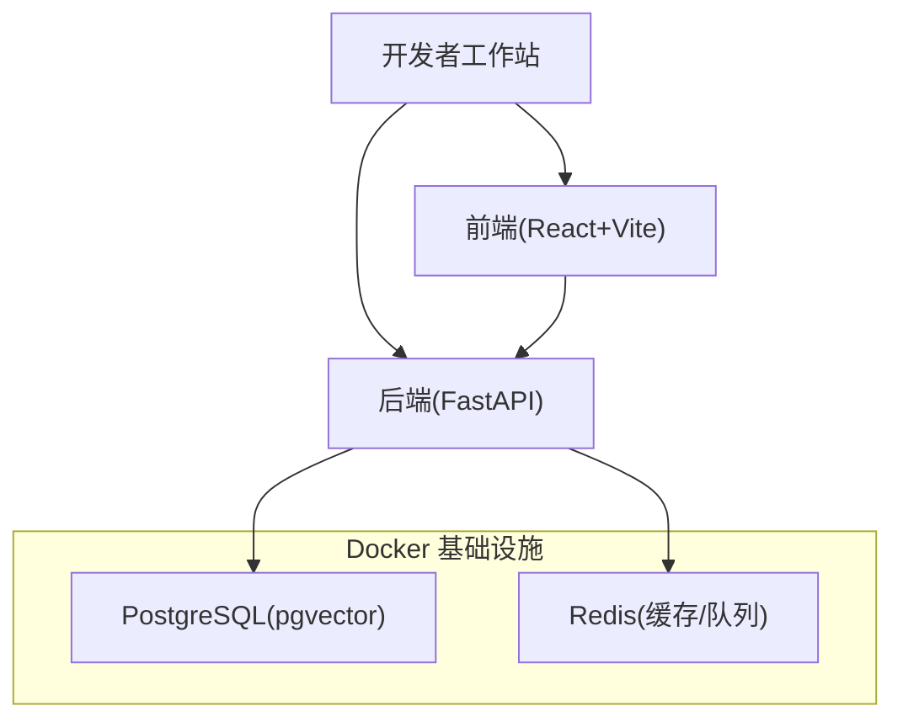
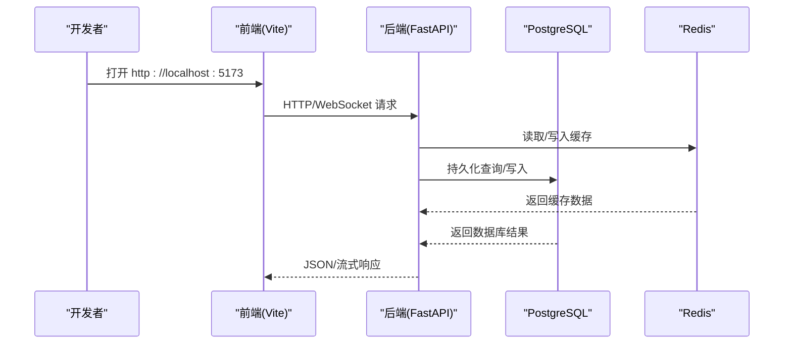
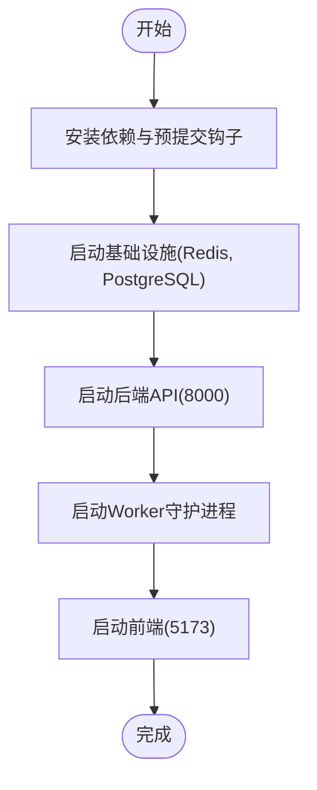
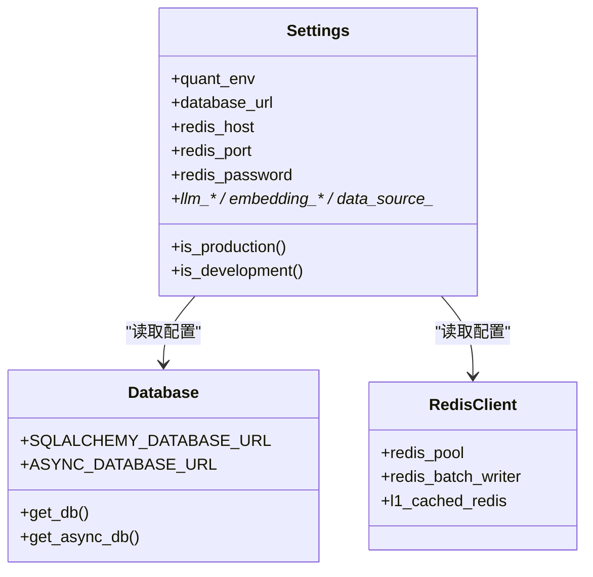
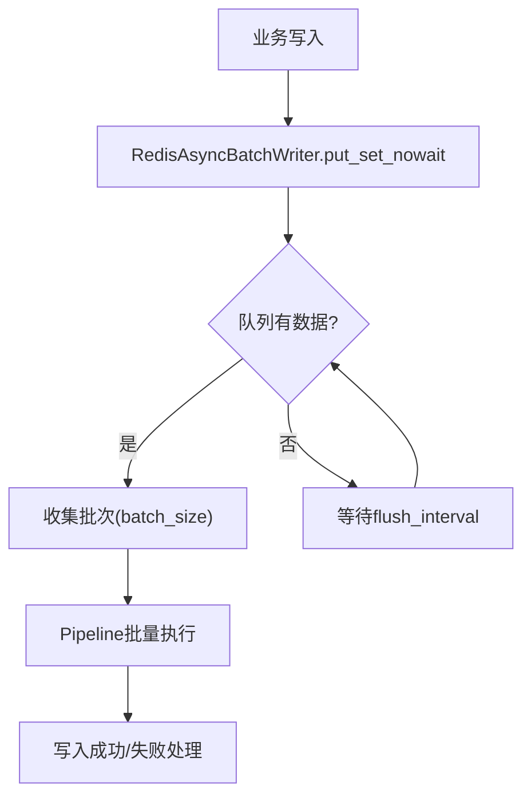
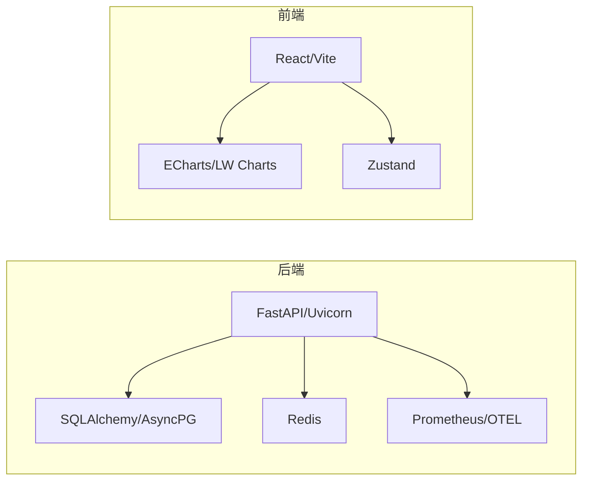
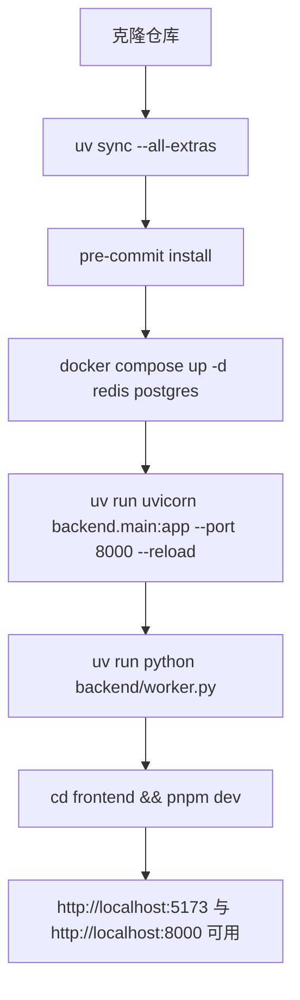

# 开发环境搭建

<cite>
**本文引用的文件**
- [README.md](file://README.md)
- [pyproject.toml](file://pyproject.toml)
- [package.json](file://package.json)
- [frontend/package.json](file://frontend/package.json)
- [docker-compose.master.yml](file://docker-compose.master.yml)
- [quant.conf](file://quant.conf)
- [Makefile](file://Makefile)
- [backend/core/config.py](file://backend/core/config.py)
- [backend/core/database.py](file://backend/core/database.py)
- [backend/core/redis_client.py](file://backend/core/redis_client.py)
- [.pre-commit-config.yaml](file://.pre-commit-config.yaml)
</cite>

## 目录
1. [简介](#简介)
2. [项目结构](#项目结构)
3. [核心组件](#核心组件)
4. [架构总览](#架构总览)
5. [详细组件分析](#详细组件分析)
6. [依赖关系分析](#依赖关系分析)
7. [性能考虑](#性能考虑)
8. [故障排查指南](#故障排查指南)
9. [结论](#结论)
10. [附录](#附录)

## 简介
本指南面向首次加入的开发者，目标是帮助你在最短时间内搭建可运行的本地开发环境，覆盖后端、前端、数据库与缓存等中间件，以及代码质量工具链、调试与测试流程。项目采用 FastAPI + PostgreSQL + Redis 的后端技术栈，React + Vite 的前端工程，并通过 Docker Compose 提供一键式基础设施启动能力。

## 项目结构
- 后端：Python 服务（FastAPI），使用 SQLAlchemy/AsyncPG 访问数据库，Redis 作为缓存与消息总线，Alembic 管理迁移。
- 前端：React + Vite，TypeScript，Vitest 单测，ESLint/Prettier 规范。
- 基础设施：通过 docker-compose 启动 Redis、PostgreSQL，可选 Prometheus/Grafana 监控。
- 工具链：Ruff/Mypy/Pre-commit 统一代码质量；Makefile 封装常用命令。

**图示来源**
- [docker-compose.master.yml:17-74](file://docker-compose.master.yml#L17-L74)
- [backend/core/database.py:1-67](file://backend/core/database.py#L1-L67)
- [backend/core/redis_client.py:1-35](file://backend/core/redis_client.py#L1-L35)

**章节来源**
- [README.md:22-56](file://README.md#L22-L56)
- [docker-compose.master.yml:17-74](file://docker-compose.master.yml#L17-L74)

## 核心组件
- 配置中心：基于 Pydantic Settings 的环境变量校验与加载，强制关键配置非空，支持多环境标识。
- 数据库：支持 SQLite（本地快速开发）与 PostgreSQL（生产/集成），连接池参数可配置化。
- 缓存与消息：Redis 连接池、异步批量写入器、进程内 L1 缓存，降低高频写放大与网络开销。
- 前端工程：Vite 开发服务器、类型检查、单元测试、构建脚本。
- 工具链：Ruff 格式化与静态检查、Mypy 类型检查、Pre-commit 钩子、Pytest 测试框架。

**章节来源**
- [backend/core/config.py:20-134](file://backend/core/config.py#L20-L134)
- [backend/core/database.py:1-67](file://backend/core/database.py#L1-L67)
- [backend/core/redis_client.py:1-35](file://backend/core/redis_client.py#L1-L35)
- [frontend/package.json:6-15](file://frontend/package.json#L6-L15)
- [pyproject.toml:104-165](file://pyproject.toml#L104-L165)
- [.pre-commit-config.yaml:1-72](file://.pre-commit-config.yaml#L1-L72)

## 架构总览
下图展示了本地开发时各组件的交互关系：前端通过浏览器访问 Vite 开发服务器；后端 API 暴露于 8000 端口；数据库与缓存由 Docker 容器提供；Nginx 可作为可选反向代理用于 WebSocket 透传与 HTTPS 终止。

**图示来源**
- [Makefile:75-85](file://Makefile#L75-L85)
- [docker-compose.master.yml:76-120](file://docker-compose.master.yml#L76-L120)
- [backend/core/database.py:1-67](file://backend/core/database.py#L1-L67)
- [backend/core/redis_client.py:1-35](file://backend/core/redis_client.py#L1-L35)

## 详细组件分析

### 环境与依赖要求
- Python 版本：>=3.11（项目声明）。
- Node.js 与包管理器：Node 18+ 与 pnpm（前端工程使用 pnpm scripts）。
- 数据库：PostgreSQL（推荐 pgvector 镜像）或 SQLite（默认降级）。
- 缓存：Redis（本地或容器）。
- 可选：Nginx（WebSocket 透传与 HTTPS）、Prometheus/Grafana（监控）。

**章节来源**
- [pyproject.toml:1-5](file://pyproject.toml#L1-L5)
- [frontend/package.json:6-15](file://frontend/package.json#L6-L15)
- [docker-compose.master.yml:17-74](file://docker-compose.master.yml#L17-L74)

### 本地开发环境搭建步骤
- 安装依赖并初始化 pre-commit：
  - 使用 Makefile 提供的 install 目标，自动同步所有依赖并安装钩子。
- 启动基础设施（Redis + PostgreSQL）：
  - 使用 dev-infra 目标，等待就绪后端口分别为 6379 与 5432。
- 启动后端 API（热重载）：
  - 使用 dev-api 目标，监听 8000 端口。
- 启动 Worker 守护进程：
  - 使用 dev-worker 目标。
- 启动前端开发服务器：
  - 使用 dev-frontend 目标，监听 5173 端口。
- 一键全栈启动：
  - 使用 dev 目标，依次拉起基础设施、后端、Worker 与前端。

**图示来源**
- [Makefile:31-105](file://Makefile#L31-L105)

**章节来源**
- [Makefile:31-105](file://Makefile#L31-L105)

### 环境变量与配置
- 关键环境变量：
  - DATABASE_URL：数据库连接串（支持 sqlite/postgresql）。
  - REDIS_HOST/REDIS_PORT/REDIS_PASSWORD：Redis 连接信息。
  - QUANT_ENV：运行环境标识（development/production/testing）。
  - 其他：LLM/Embedding/数据源密钥、Futu OpenD 地址等。
- 配置文件加载顺序：
  - 应用通过 Pydantic Settings 从 .env 与环境注入加载，缺失必填项将 fail-fast。
- 数据库连接：
  - 未设置 DATABASE_URL 时回退到 SQLite 文件；PostgreSQL 场景下启用连接池与预检查。
- Redis 客户端：
  - 全局连接池、异步批量写入器、进程内 L1 缓存，减少网络 RTT 与内存占用。

**图示来源**
- [backend/core/config.py:20-134](file://backend/core/config.py#L20-L134)
- [backend/core/database.py:1-67](file://backend/core/database.py#L1-L67)
- [backend/core/redis_client.py:1-35](file://backend/core/redis_client.py#L1-L35)

**章节来源**
- [backend/core/config.py:20-134](file://backend/core/config.py#L20-L134)
- [backend/core/database.py:1-67](file://backend/core/database.py#L1-L67)
- [backend/core/redis_client.py:1-35](file://backend/core/redis_client.py#L1-L35)

### 数据库初始化与迁移
- 本地快速开发：
  - 不设置 DATABASE_URL 时自动使用 SQLite 文件，无需外部数据库。
- 使用 PostgreSQL：
  - 通过 Docker Compose 启动 pgvector 镜像，设置用户名/密码/库名。
  - 使用 Alembic 进行迁移（项目包含 alembic 目录与迁移脚本）。
- 连接池与健壮性：
  - 针对 PostgreSQL 启用 pool_size、max_overflow、pool_timeout、pool_recycle、pool_pre_ping。

**章节来源**
- [backend/core/database.py:1-67](file://backend/core/database.py#L1-L67)
- [docker-compose.master.yml:46-74](file://docker-compose.master.yml#L46-L74)

### 缓存与消息队列（Redis）
- 连接池与认证：
  - 通过环境变量配置 host/port/password，限制最大连接数。
- 高性能写入：
  - 异步批量写入器以 Pipeline 聚合 set 操作，降低网络往返。
- 本地 L1 缓存：
  - 进程内短效缓存，命中即返回，未命中穿透至 Redis，带过期清理任务。

**图示来源**
- [backend/core/redis_client.py:46-177](file://backend/core/redis_client.py#L46-L177)

**章节来源**
- [backend/core/redis_client.py:1-252](file://backend/core/redis_client.py#L1-L252)

### 前端开发工作区
- 包管理与脚本：
  - 使用 pnpm 安装依赖，scripts 提供 dev/build/test/lint/type-check。
- 开发与测试：
  - Vite 开发服务器、Vitest 单测、ESLint 类型检查。
- 协议与资源：
  - 通过 protobufjs 生成前端 Protobuf 绑定（脚本在根 package.json）。

**章节来源**
- [frontend/package.json:6-15](file://frontend/package.json#L6-L15)
- [package.json:1-86](file://package.json#L1-L86)

### 反向代理与 WebSocket（可选）
- Nginx 配置要点：
  - /api/ 与 /ws/ 路径需透传 Upgrade/Connection 头，延长超时时间，关闭缓冲以保证行情 Tick 实时到达。
  - HTTPS 证书与 TLS 优化配置。
- 适用场景：
  - 本地调试 WebSocket 长连接或对外发布时使用。

**章节来源**
- [quant.conf:1-81](file://quant.conf#L1-L81)

## 依赖关系分析
- 后端依赖：
  - FastAPI、Uvicorn、WebSockets、SQLAlchemy、AsyncPG、Redis、Prometheus 客户端、OpenTelemetry 等。
  - 可选数据源 SDK 通过 optional-dependencies 隔离，避免主环境体积膨胀。
- 前端依赖：
  - React、Vite、Tailwind、ECharts、Lightweight Charts、Zustand 等。
- 开发工具：
  - Ruff、Mypy、Pre-commit、Pytest、Vitest、ESLint。

**图示来源**
- [pyproject.toml:1-95](file://pyproject.toml#L1-L95)
- [frontend/package.json:17-85](file://frontend/package.json#L17-L85)

**章节来源**
- [pyproject.toml:1-95](file://pyproject.toml#L1-L95)
- [frontend/package.json:17-85](file://frontend/package.json#L17-L85)

## 性能考虑
- 后端并发与内存：
  - Uvicorn 限制并发与最大请求数，防止内存堆积；合理设置 workers 与超时。
- 数据库连接池：
  - 根据负载调整 pool_size/max_overflow/pool_timeout，开启 pool_pre_ping 提升健壮性。
- Redis 写入优化：
  - 使用批量写入器与 L1 缓存，减少高频写放大与网络延迟。
- 前端渲染：
  - 使用轻量图表库与 WebGL 渲染（PixiJS）提升大数据量下的帧率。

**章节来源**
- [docker-compose.master.yml:76-120](file://docker-compose.master.yml#L76-L120)
- [backend/core/database.py:14-25](file://backend/core/database.py#L14-L25)
- [backend/core/redis_client.py:46-177](file://backend/core/redis_client.py#L46-L177)

## 故障排查指南
- 无法连接数据库：
  - 检查 DATABASE_URL 是否正确；PostgreSQL 场景确认用户名/密码/库名与端口可达。
  - 若使用 SQLite，确认文件路径与权限。
- Redis 连接失败：
  - 检查 REDIS_HOST/PORT/PASSWORD；确保容器或服务已启动且健康检查通过。
- WebSocket 握手失败：
  - 若经 Nginx，确认 /api/ 与 /ws/ 路径正确透传 Upgrade/Connection 头，并设置足够超时。
- 测试覆盖率异常：
  - 在 IDE 中运行 pytest 时需设置 CODEBUDDY_SAFE_DELETE_ENABLED=0，避免安全删除守卫干扰覆盖率合并。
- 预提交钩子失败：
  - 确认 .venv 中存在 ruff/mypy 可执行文件；必要时重新安装依赖并初始化钩子。

**章节来源**
- [backend/core/database.py:1-67](file://backend/core/database.py#L1-L67)
- [backend/core/redis_client.py:1-35](file://backend/core/redis_client.py#L1-L35)
- [quant.conf:39-79](file://quant.conf#L39-L79)
- [Makefile:47-64](file://Makefile#L47-L64)
- [.pre-commit-config.yaml:1-72](file://.pre-commit-config.yaml#L1-L72)

## 结论
通过以上步骤与配置，你可以在本地快速搭建完整的 Quant Agent 开发环境，包括后端、前端、数据库与缓存，并具备完善的代码质量与测试工具链。建议新成员优先使用 Makefile 的一键命令，结合 Docker Compose 启动基础设施，逐步熟悉各模块职责与依赖关系。

## 附录

### 常用命令速查
- 安装依赖与初始化钩子：make install
- 启动基础设施：make dev-infra
- 启动后端 API：make dev-api
- 启动 Worker：make dev-worker
- 启动前端：make dev-frontend
- 一键全栈：make dev
- 运行测试：make test
- 生成覆盖率：make coverage

**章节来源**
- [Makefile:6-105](file://Makefile#L6-L105)

### 环境变量清单（节选）
- 数据库：DATABASE_URL、DB_USER、DB_PASSWORD、DB_NAME
- Redis：REDIS_HOST、REDIS_PORT、REDIS_PASSWORD
- 运行环境：QUANT_ENV
- LLM/Embedding：LLM_API_KEY、EMBEDDING_API_KEY、EMBEDDING_BASE_URL、EMBEDDING_MODEL
- 数据源：FINNHUB_API_KEY、AKSHARE_API_KEY、FRED_API_KEY
- Futu：FUTU_HOST、FUTU_PORT、FUTU_TRD_ENV、FUTU_PWD_UNLOCK

**章节来源**
- [backend/core/config.py:28-92](file://backend/core/config.py#L28-L92)

### 本地快速启动流程图

**图示来源**
- [Makefile:31-105](file://Makefile#L31-L105)
- [docker-compose.master.yml:17-74](file://docker-compose.master.yml#L17-L74)
