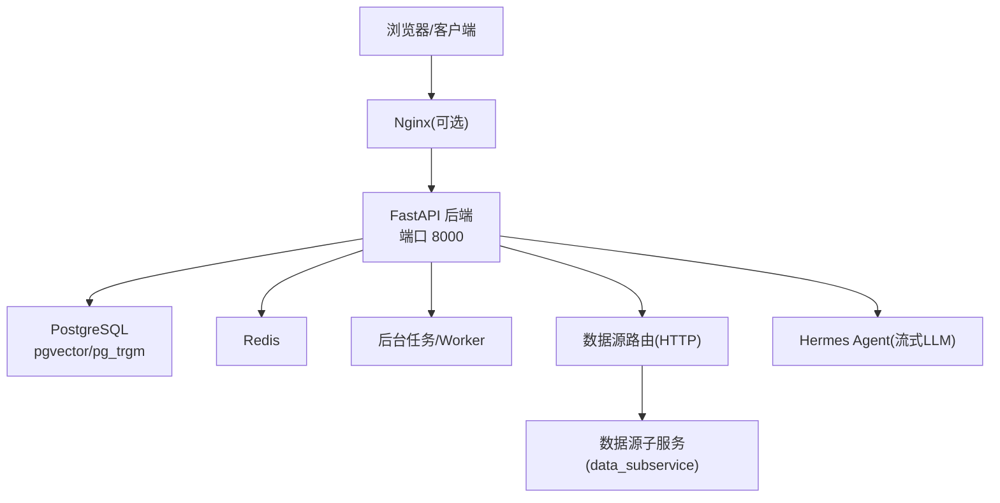
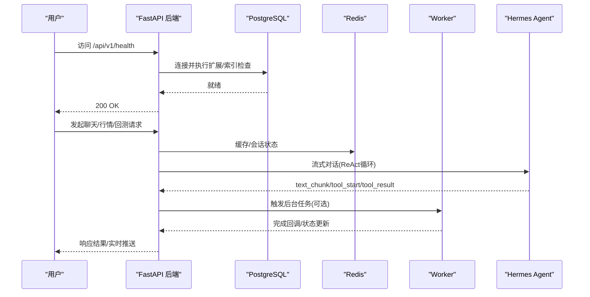
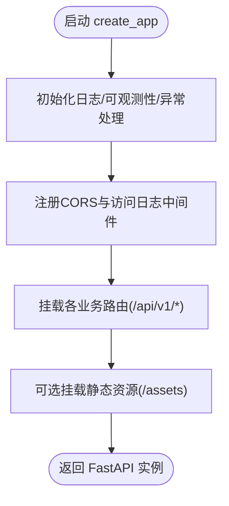
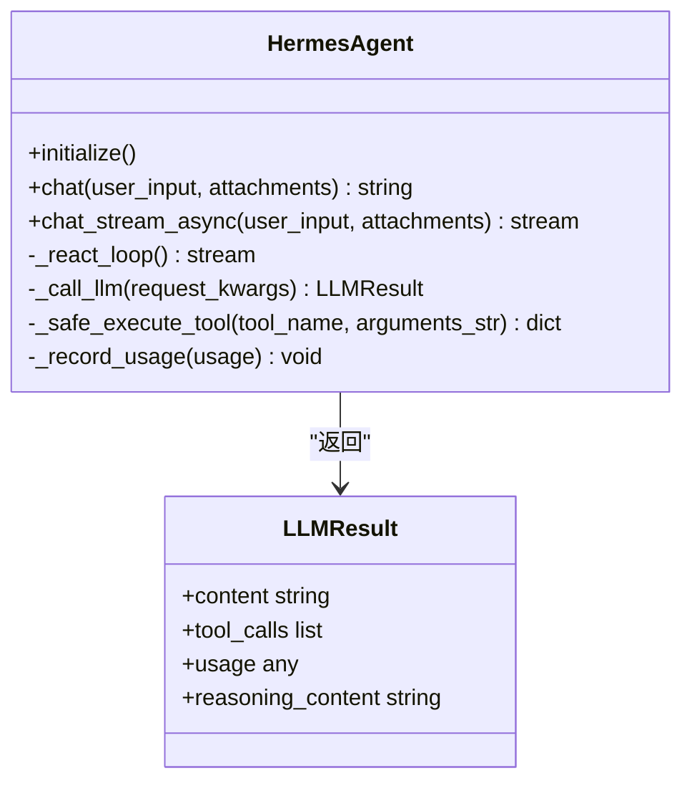
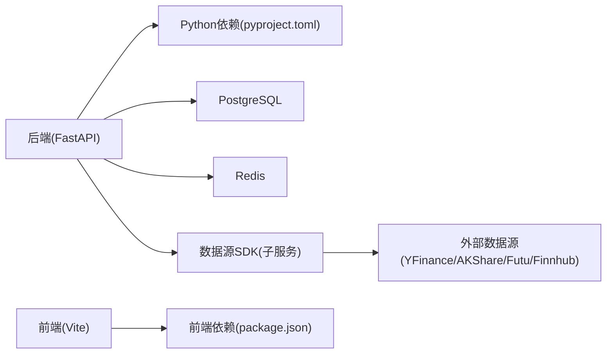

# 快速开始指南

<cite>
**本文引用的文件**   
- [README.md](file://README.md)
- [backend/main.py](file://backend/main.py)
- [backend/core/config.py](file://backend/core/config.py)
- [backend/core/database.py](file://backend/core/database.py)
- [docker-compose.master.yml](file://docker-compose.master.yml)
- [Dockerfile](file://Dockerfile)
- [start.sh](file://start.sh)
- [Makefile](file://Makefile)
- [quant.conf](file://quant.conf)
- [pyproject.toml](file://pyproject.toml)
- [frontend/package.json](file://frontend/package.json)
- [hermes_agent/agent.py](file://hermes_agent/agent.py)
</cite>

## 目录
1. [简介](#简介)
2. [项目结构](#项目结构)
3. [核心组件](#核心组件)
4. [架构总览](#架构总览)
5. [详细组件分析](#详细组件分析)
6. [依赖关系分析](#依赖关系分析)
7. [性能注意事项](#性能注意事项)
8. [故障排查指南](#故障排查指南)
9. [结论](#结论)
10. [附录：最小化配置与验证清单](#附录最小化配置与验证清单)

## 简介
本指南面向首次部署 Quant Agent 量化交易平台的用户，提供从零到一的环境搭建、服务启动、AI代理系统联调、常见部署方式（本地开发、Docker容器化、生产环境）的配置示例，以及功能验证与故障排查步骤。内容基于仓库中的实际代码与配置文件编写，确保每一步均可操作且可追溯。

## 项目结构
Quant Agent 采用前后端分离与多进程架构：
- 后端：FastAPI 应用，统一路由挂载、中间件、异常处理、数据库初始化、OpenAPI/Swagger、CORS、静态资源等；通过环境变量加载配置并校验必填项。
- 前端：React + Vite 开发服务器，独立构建产物由后端或反向代理托管。
- AI代理：Hermes Agent 基于 OpenAI SDK 兼容接口进行流式推理、工具调用、熔断恢复与记忆管理。
- 基础设施：PostgreSQL（含 pgvector/pg_trgm）、Redis、可选监控（Prometheus/Grafana）。
- 数据源：主节点通过 HTTP 路由转发至子服务（data_subservice），避免在主镜像安装重型数据源 SDK。

图表来源
- [backend/main.py:125-218](file://backend/main.py#L125-L218)
- [docker-compose.master.yml:76-120](file://docker-compose.master.yml#L76-L120)
- [backend/core/database.py:7-25](file://backend/core/database.py#L7-L25)
- [hermes_agent/agent.py:505-552](file://hermes_agent/agent.py#L505-L552)

章节来源
- [README.md:22-56](file://README.md#L22-L56)
- [backend/main.py:125-218](file://backend/main.py#L125-L218)
- [docker-compose.master.yml:16-120](file://docker-compose.master.yml#L16-L120)

## 核心组件
- 后端入口与应用工厂：创建 FastAPI 实例、注册中间件、挂载路由、暴露健康检查与静态资源。
- 配置与校验：Pydantic Settings 强制读取 .env，校验 DATABASE_URL、EMBEDDING_API_KEY 等必填项，支持多模型路由与降级。
- 数据库连接：自动创建扩展与索引，支持 SQLite/PostgreSQL，异步引擎用于高并发场景。
- Docker 镜像与编排：多阶段构建、仅复制运行时依赖，master 编排包含 Redis、PostgreSQL、Agent、Worker、监控。
- 一键脚本与 Makefile：封装本地开发、基础设施启动、停止、测试、格式化等常用命令。
- 前端开发：Vite 开发服务器，pnpm 包管理，独立构建产物可由后端或 Nginx 托管。
- AI代理：Hermes Agent 提供流式对话、工具调用、心跳保活、熔断恢复与记忆持久化。

章节来源
- [backend/main.py:125-218](file://backend/main.py#L125-L218)
- [backend/core/config.py:20-134](file://backend/core/config.py#L20-L134)
- [backend/core/database.py:7-67](file://backend/core/database.py#L7-L67)
- [Dockerfile:1-60](file://Dockerfile#L1-L60)
- [docker-compose.master.yml:16-276](file://docker-compose.master.yml#L16-L276)
- [start.sh:1-291](file://start.sh#L1-L291)
- [Makefile:1-112](file://Makefile#L1-L112)
- [frontend/package.json:1-114](file://frontend/package.json#L1-L114)
- [hermes_agent/agent.py:505-692](file://hermes_agent/agent.py#L505-L692)

## 架构总览
Quant Agent 的启动流程如下：
- 启动时加载 .env 与环境变量，校验配置并初始化日志、可观测性、异常处理与中间件。
- 建立数据库连接，自动启用 pgvector/pg_trgm 扩展并创建全局索引。
- 挂载所有业务路由（聊天、市场、回测、策略、风控、OMS、数据源等），暴露 /api/v1/*。
- 可选挂载静态资源（前端 dist）。
- 后台 Worker 进程负责数据采集、定时任务与长连接处理。
- AI 代理通过 Hermes Agent 与 LLM 交互，支持流式输出与工具调用。

图表来源
- [backend/main.py:125-218](file://backend/main.py#L125-L218)
- [backend/core/database.py:7-67](file://backend/core/database.py#L7-L67)
- [hermes_agent/agent.py:187-499](file://hermes_agent/agent.py#L187-L499)
- [docker-compose.master.yml:76-164](file://docker-compose.master.yml#L76-L164)

## 详细组件分析

### 后端服务（FastAPI）
- 应用工厂 create_app：组装 OpenAPI、中间件、CORS、路由挂载、静态资源。
- 健康检查：/api/v1/health 用于容器健康探测与启动就绪判断。
- 路由前缀：默认 /api/v1，可通过环境变量调整。
- 中间件顺序：AccessLogMiddleware 在 CORSMiddleware 内层，避免 OPTIONS 预检被误拦截。

图表来源
- [backend/main.py:125-218](file://backend/main.py#L125-L218)

章节来源
- [backend/main.py:125-218](file://backend/main.py#L125-L218)

### 配置与校验（Pydantic Settings）
- 必填项：DATABASE_URL、EMBEDDING_API_KEY、EMBEDDING_BASE_URL。
- 可选项：LLM_*、数据源密钥、Futu OpenD、告警通道、内部通信密钥等。
- 安全校验：开启实盘交易时必须配置 Futu 解锁密码。
- 多模型路由：轻量模型与 Pro 模型切换，支持降级阈值与回退开关。

章节来源
- [backend/core/config.py:20-134](file://backend/core/config.py#L20-L134)

### 数据库初始化与连接
- 自动启用 PostgreSQL 扩展：pgvector、pg_trgm，并创建全局 GIN 索引。
- 连接池参数：pool_size、max_overflow、pool_timeout、pool_recycle、pre_ping。
- 异步引擎：将同步 URL 转换为 asyncpg/aiosqlite，适配高并发场景。

章节来源
- [backend/main.py:32-57](file://backend/main.py#L32-L57)
- [backend/core/database.py:7-67](file://backend/core/database.py#L7-L67)

### Docker 镜像与编排
- 多阶段构建：builder 阶段安装依赖，运行镜像仅复制 .venv 与必要源码。
- 主节点编排：Redis、PostgreSQL、quant-agent、quant-worker、私有 Registry、Prometheus、Grafana。
- 网络与安全：仅绑定 loopback/Tailscale IP，不暴露公网敏感端口。
- 健康检查：容器级健康探测，确保依赖服务就绪后再启动主服务。

章节来源
- [Dockerfile:1-60](file://Dockerfile#L1-L60)
- [docker-compose.master.yml:16-276](file://docker-compose.master.yml#L16-L276)

### 一键启动脚本与 Makefile
- start.sh：支持本地开发模式、Docker全栈模式、仅基础设施模式、停止所有服务。
- Makefile：封装 install、format、lint、test、dev-infra、dev-api、dev-worker、dev-frontend、dev 等常用命令。

章节来源
- [start.sh:1-291](file://start.sh#L1-L291)
- [Makefile:1-112](file://Makefile#L1-L112)

### 前端应用
- 开发服务器：pnpm dev 启动 Vite，默认端口 5173。
- 构建产物：由后端或 Nginx 托管，生产环境建议独立静态站点。

章节来源
- [frontend/package.json:1-114](file://frontend/package.json#L1-L114)

### AI代理系统（Hermes Agent）
- ReAct 循环：统一流式与非流式路径，心跳保活、工具调用、熔断恢复。
- 工具执行：安全执行工具，异常归一化为错误消息。
- 记忆管理：会话持久化、上下文压缩、知识库沉淀。
- 模型路由：轻量模型与 Pro 模型切换，支持降级与预算护栏。

图表来源
- [hermes_agent/agent.py:22-35](file://hermes_agent/agent.py#L22-L35)
- [hermes_agent/agent.py:187-499](file://hermes_agent/agent.py#L187-L499)
- [hermes_agent/agent.py:505-692](file://hermes_agent/agent.py#L505-L692)

章节来源
- [hermes_agent/agent.py:187-692](file://hermes_agent/agent.py#L187-L692)

## 依赖关系分析
- 后端依赖：FastAPI、uvicorn、websockets、redis、sqlalchemy、psycopg2-binary、asyncpg、prometheus-client、opentelemetry-*。
- 数据源SDK：yfinance、tushare、akshare、futu-api、finnhub-python（仅在 data_subservice 安装）。
- 前端依赖：React、Vite、ECharts、Lightweight Charts、PixiJS、Zustand、Tailwind CSS。
- 运行时依赖：PostgreSQL（pgvector/pg_trgm）、Redis、可选 Prometheus/Grafana。

图表来源
- [pyproject.toml:1-80](file://pyproject.toml#L1-L80)
- [frontend/package.json:17-85](file://frontend/package.json#L17-L85)
- [docker-compose.master.yml:16-120](file://docker-compose.master.yml#L16-L120)

章节来源
- [pyproject.toml:1-80](file://pyproject.toml#L1-L80)
- [frontend/package.json:17-85](file://frontend/package.json#L17-L85)
- [docker-compose.master.yml:16-120](file://docker-compose.master.yml#L16-L120)

## 性能注意事项
- 并发限制：生产镜像使用 --limit-concurrency 与 --limit-max-requests 控制单 worker 并发与优雅重启，防止内存膨胀。
- 连接池：数据库连接池参数可调，启用 pre_ping 提升健壮性。
- 缓存：Redis 用于会话、缓存与队列，注意密码与网络绑定安全。
- 监控：Prometheus/Grafana 可选启用，便于观察指标与告警。

章节来源
- [docker-compose.master.yml:76-120](file://docker-compose.master.yml#L76-L120)
- [backend/core/database.py:14-25](file://backend/core/database.py#L14-L25)

## 故障排查指南
- 数据库无法连接：
  - 检查 DATABASE_URL 是否正确，PostgreSQL 是否已启动并允许连接。
  - 确认 pgvector/pg_trgm 扩展已启用，索引创建是否成功。
- Redis 认证失败：
  - 核对 REDIS_PASSWORD 与 docker-compose 中 redis 容器的 requirepass 一致。
  - 容器间通信使用服务名（redis/postgres），避免 host.docker.internal 问题。
- 后端启动失败：
  - 查看 .env 是否包含必填项（DATABASE_URL、EMBEDDING_API_KEY、EMBEDDING_BASE_URL）。
  - 检查端口占用（8000/3000/5173），必要时清理僵尸进程。
- 前端无法访问：
  - 确认 pnpm 依赖已安装，Vite 开发服务器正常启动。
  - 若使用 Nginx，检查代理头与 WebSocket Upgrade 配置。
- AI代理无响应：
  - 检查 LLM_API_KEY、LLM_BASE_URL、LLM_MODEL 是否配置正确。
  - 确认 Redis 可用，会话记忆与 token 计量正常。

章节来源
- [backend/core/config.py:94-119](file://backend/core/config.py#L94-L119)
- [docker-compose.master.yml:16-120](file://docker-compose.master.yml#L16-L120)
- [backend/main.py:32-57](file://backend/main.py#L32-L57)
- [hermes_agent/agent.py:505-552](file://hermes_agent/agent.py#L505-L552)

## 结论
通过本指南，您可以快速完成 Quant Agent 的环境搭建、服务启动与基本功能验证。建议从本地开发模式入手，逐步过渡到 Docker 容器化与生产部署。遇到问题时，优先检查环境变量、数据库与 Redis 连通性，以及后端健康检查与日志输出。

## 附录：最小化配置与验证清单

### 系统要求
- Python >= 3.11
- Node.js 与 pnpm（前端开发）
- Docker 与 Docker Compose（推荐）
- PostgreSQL（推荐 pgvector 版本）
- Redis

### 环境变量（.env）最小集
- DATABASE_URL：必须配置，支持 sqlite:/// 或 postgresql://
- EMBEDDING_API_KEY、EMBEDDING_BASE_URL：向量嵌入必需
- REDIS_HOST、REDIS_PORT、REDIS_PASSWORD：缓存与会话必需
- LLM_API_KEY、LLM_BASE_URL、LLM_MODEL：AI代理必需
- QUANT_ENV：development/production/testing

章节来源
- [backend/core/config.py:20-134](file://backend/core/config.py#L20-L134)

### 本地开发启动
- 使用脚本：./start.sh（默认本地开发模式，自动启动基础设施、后端、Worker、前端）
- 或使用 Makefile：make dev（一键启动 infra + api + worker + frontend）

章节来源
- [start.sh:136-291](file://start.sh#L136-L291)
- [Makefile:66-105](file://Makefile#L66-L105)

### Docker 容器化启动
- 主节点编排：docker compose -f docker-compose.master.yml up -d
- 监控可选：docker compose -f docker-compose.master.yml --profile monitoring up -d

章节来源
- [docker-compose.master.yml:1-10](file://docker-compose.master.yml#L1-L10)
- [docker-compose.master.yml:16-276](file://docker-compose.master.yml#L16-L276)

### 生产环境（Nginx 反向代理）
- HTTPS 跳转与证书配置参考 quant.conf
- 代理 /api/ 与 /ws/ 需透传 Upgrade/Connection 头，延长超时并关闭缓冲以保证行情 Tick 实时性

章节来源
- [quant.conf:1-81](file://quant.conf#L1-L81)

### 功能验证步骤
- 健康检查：curl http://localhost:8000/api/v1/health
- 前端访问：http://localhost:3000（开发）或 http://localhost:5173（Makefile 默认）
- 数据库连通：docker compose exec postgres pg_isready -U quant_admin
- Redis 连通：docker compose exec redis redis-cli -a ${REDIS_PASSWORD} ping
- AI代理：配置 LLM_* 后，通过聊天接口发送消息，观察流式输出与工具调用事件

章节来源
- [backend/main.py:167-218](file://backend/main.py#L167-L218)
- [docker-compose.master.yml:110-115](file://docker-compose.master.yml#L110-L115)
- [hermes_agent/agent.py:615-692](file://hermes_agent/agent.py#L615-L692)