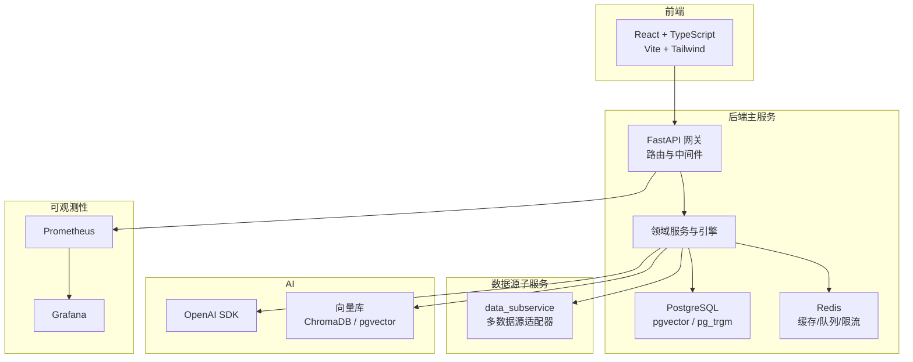
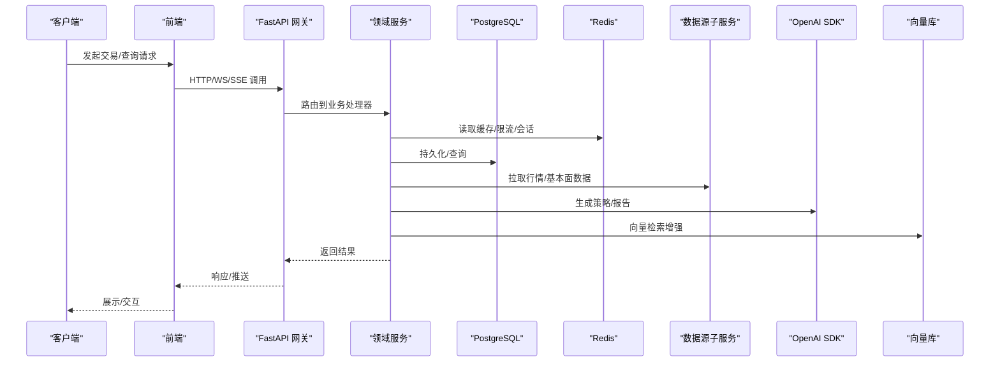
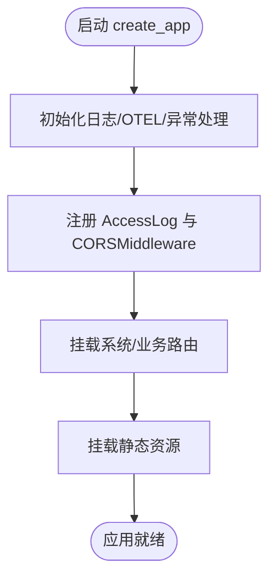
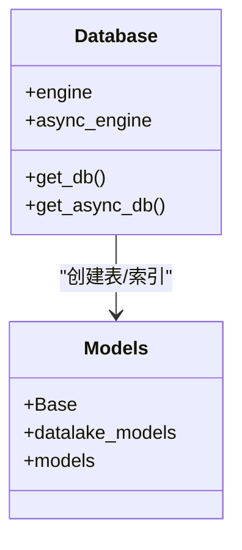
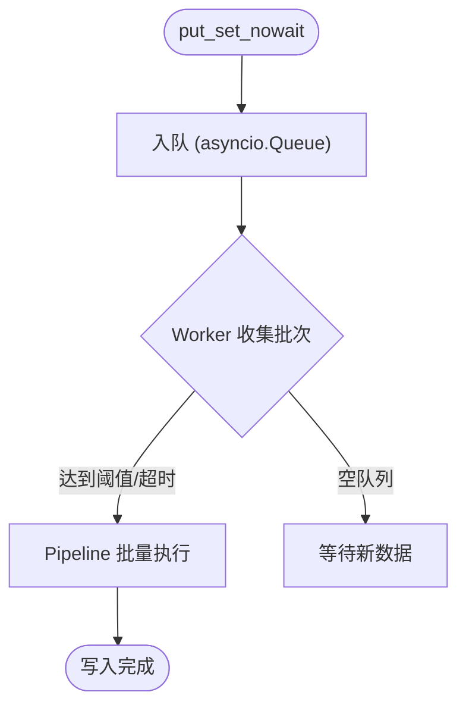
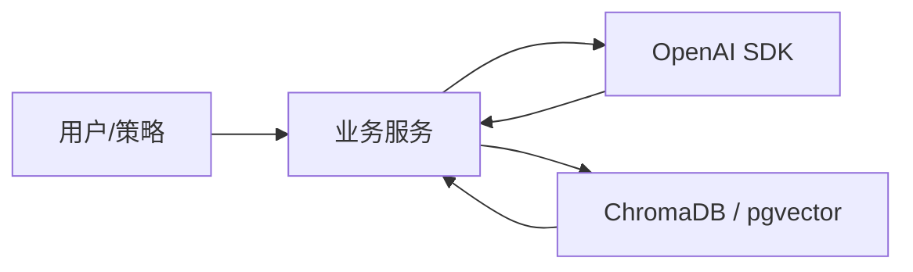
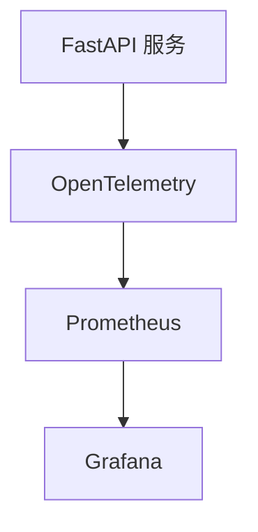
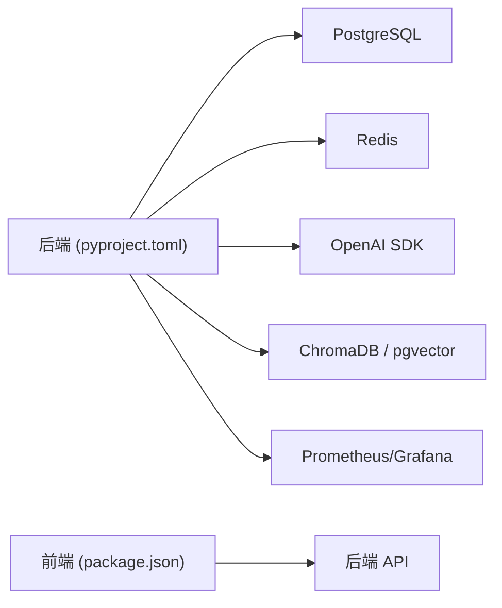

# 技术架构概览

<cite>
**本文引用的文件**
- [backend/main.py](file://backend/main.py)
- [backend/core/database.py](file://backend/core/database.py)
- [backend/core/redis_client.py](file://backend/core/redis_client.py)
- [backend/core/openapi_schema.py](file://backend/core/openapi_schema.py)
- [docker-compose.master.yml](file://docker-compose.master.yml)
- [pyproject.toml](file://pyproject.toml)
- [frontend/package.json](file://frontend/package.json)
</cite>

## 目录
1. [简介](#简介)
2. [项目结构](#项目结构)
3. [核心组件](#核心组件)
4. [架构总览](#架构总览)
5. [详细组件分析](#详细组件分析)
6. [依赖关系分析](#依赖关系分析)
7. [性能考量](#性能考量)
8. [故障排查指南](#故障排查指南)
9. [结论](#结论)
10. [附录](#附录)

## 简介
本技术架构概览面向 Quant Agent 量化交易平台，系统采用前后端分离与微服务化部署，后端以 FastAPI + Python 构建高并发 API 网关与业务服务，持久化使用 PostgreSQL（含向量扩展），缓存与消息总线使用 Redis；前端基于 React + TypeScript + Vite + Tailwind CSS；AI 能力通过 OpenAI SDK 与向量数据库（ChromaDB、pgvector）结合实现检索增强生成（RAG）；基础设施层使用 Docker 编排，Prometheus + Grafana 提供可观测性。整体遵循事件驱动与异步优先的设计原则，兼顾可扩展性、安全性与可维护性。

## 项目结构
仓库采用多模块分层组织：
- backend：FastAPI 应用、路由、领域服务、引擎、工作进程、数据源适配等
- frontend：React/TypeScript/Vite/Tailwind 前端工程
- data_subservice：分布式数据源子服务（按节点运行，承载外部数据源 SDK）
- hermes_agent：Agent 工具链与工具注册中心
- 配置与运维：Docker Compose、Prometheus/Grafana 配置、CI/CD、脚本与文档

图表来源
- [backend/main.py:125-218](file://backend/main.py#L125-L218)
- [docker-compose.master.yml:17-251](file://docker-compose.master.yml#L17-L251)

章节来源
- [backend/main.py:125-218](file://backend/main.py#L125-L218)
- [docker-compose.master.yml:17-251](file://docker-compose.master.yml#L17-L251)

## 核心组件
- 后端网关与路由：FastAPI 应用工厂统一装配中间件、异常处理、CORS、OpenAPI 文档与所有业务路由挂载，静态资源由后端托管或反向代理。
- 数据访问：SQLAlchemy 同步/异步引擎，PostgreSQL 连接池与扩展初始化（pgvector、pg_trgm）。
- 缓存与消息：Redis 连接池、批量写入队列、进程内 L1 缓存，支撑高频读写与限流/会话/状态共享。
- AI 与 RAG：OpenAI SDK 调用大模型，ChromaDB/pgvector 作为向量存储，结合检索增强生成。
- 可观测性：OpenTelemetry 埋点、Prometheus 指标采集、Grafana 可视化。
- 部署与编排：Docker Compose 定义主节点服务（Redis、PostgreSQL、quant-agent、quant-worker、registry、Prometheus、Grafana），网络隔离与安全绑定。

章节来源
- [backend/main.py:125-218](file://backend/main.py#L125-L218)
- [backend/core/database.py:1-67](file://backend/core/database.py#L1-L67)
- [backend/core/redis_client.py:1-252](file://backend/core/redis_client.py#L1-L252)
- [backend/core/openapi_schema.py:1-289](file://backend/core/openapi_schema.py#L1-L289)
- [docker-compose.master.yml:17-251](file://docker-compose.master.yml#L17-L251)

## 架构总览
系统采用“前后端分离 + 微服务 + 事件驱动”的架构模式：
- 前后端分离：前端通过 HTTP/WebSocket/SSE 与后端交互，后端提供 RESTful API 与实时推送。
- 微服务：主服务 quant-agent 负责 API 网关与核心业务；quant-worker 负责后台任务；data_subservice 承载重型数据源 SDK，解耦主环境依赖。
- 事件驱动：Redis 作为消息总线与缓存，支持批量写入、队列消费、限流与状态共享；异步引擎与协程提升吞吐。
- 可观测性：OpenTelemetry 全链路追踪，Prometheus 指标暴露，Grafana 仪表盘监控。

图表来源
- [backend/main.py:125-218](file://backend/main.py#L125-L218)
- [backend/core/redis_client.py:1-252](file://backend/core/redis_client.py#L1-L252)
- [backend/core/database.py:1-67](file://backend/core/database.py#L1-L67)
- [docker-compose.master.yml:76-164](file://docker-compose.master.yml#L76-L164)

## 详细组件分析

### 后端网关与路由（FastAPI）
- 应用工厂 create_app 统一装配生命周期、可观测性、异常处理、中间件、CORS、OpenAPI 文档与路由挂载。
- 静态资源挂载用于前端产物托管，便于单容器部署。
- 健康检查与集群探针暴露于根路径与 API 前缀。

图表来源
- [backend/main.py:125-218](file://backend/main.py#L125-L218)

章节来源
- [backend/main.py:125-218](file://backend/main.py#L125-L218)

### 数据访问层（PostgreSQL + SQLAlchemy）
- 同步/异步引擎双配置，支持 SQLite 降级与 PG 生产环境连接池优化。
- 启动时自动创建 pgvector 与 pg_trgm 扩展及全局索引，为向量检索与模糊匹配提供基础。
- 环境变量驱动连接池大小、溢出与超时，便于弹性伸缩。

图表来源
- [backend/core/database.py:1-67](file://backend/core/database.py#L1-L67)
- [backend/main.py:32-56](file://backend/main.py#L32-L56)

章节来源
- [backend/core/database.py:1-67](file://backend/core/database.py#L1-L67)
- [backend/main.py:32-56](file://backend/main.py#L32-L56)

### 缓存与消息（Redis）
- 连接池与协议兼容：redis-py 5.x 下强制 RESP2 协议，确保与旧版兼容。
- 批量写入队列：异步队列 + Pipeline 批量提交，降低 RTT 与带宽占用。
- 进程内 L1 缓存：短 TTL 内存缓存，穿透至 Redis L2，带容量保护与定时清理。
- 限流与会话：统一连接池上限，避免无界增长。

图表来源
- [backend/core/redis_client.py:46-177](file://backend/core/redis_client.py#L46-L177)

章节来源
- [backend/core/redis_client.py:1-252](file://backend/core/redis_client.py#L1-L252)

### AI 与向量检索（OpenAI SDK + ChromaDB/pgvector）
- OpenAI SDK：用于对话、摘要、策略建议等生成式任务。
- 向量库：ChromaDB 本地向量存储，pgvector 在数据库中提供向量检索能力，结合 RAG 提升回答质量与可解释性。
- 治理与审计：RAG 治理模块与 Token 用量记录，保障成本可控与合规。

图表来源
- [pyproject.toml:6-58](file://pyproject.toml#L6-L58)

章节来源
- [pyproject.toml:6-58](file://pyproject.toml#L6-L58)

### 可观测性与监控（OpenTelemetry + Prometheus + Grafana）
- OpenTelemetry：对 FastAPI、HTTPX、Requests、Redis、SQLAlchemy 进行自动埋点，导出 OTLP。
- Prometheus：采集指标，保留周期与规则配置化。
- Grafana：预置仪表盘与告警，提供系统健康与数据质量视图。

图表来源
- [docker-compose.master.yml:197-251](file://docker-compose.master.yml#L197-L251)
- [backend/core/openapi_schema.py:1-289](file://backend/core/openapi_schema.py#L1-L289)

章节来源
- [docker-compose.master.yml:197-251](file://docker-compose.master.yml#L197-L251)
- [backend/core/openapi_schema.py:1-289](file://backend/core/openapi_schema.py#L1-L289)

### 前端工程（React + TypeScript + Vite + Tailwind）
- 构建与开发：Vite 提供快速开发与构建，TypeScript 类型安全。
- UI 框架：Tailwind CSS 原子化样式，Radix UI 无障碍组件。
- 状态与网络：Zustand 状态管理，i18next 国际化，web-vitals 性能度量。
- 测试与质量：Vitest 单元测试，Playwright E2E，ESLint/Prettier 规范。

章节来源
- [frontend/package.json:1-114](file://frontend/package.json#L1-L114)

## 依赖关系分析
- 运行时依赖：Python >= 3.11，FastAPI、Uvicorn、WebSockets、SQLAlchemy、AsyncPG、Redis、Pydantic Settings、OpenAI SDK、ChromaDB、pgvector、Prometheus Client、OpenTelemetry 等。
- 可选依赖：数据源 SDK（yfinance、tushare、akshare、futu-api、finnhub-python）仅安装于 data_subservice，主服务通过 HTTP 路由转发，避免主环境臃肿。
- 前端依赖：React、TypeScript、Vite、Tailwind、Radix UI、Zustand、i18next、ECharts/Lightweight Charts 等。

图表来源
- [pyproject.toml:6-58](file://pyproject.toml#L6-L58)
- [frontend/package.json:17-111](file://frontend/package.json#L17-L111)

章节来源
- [pyproject.toml:6-58](file://pyproject.toml#L6-L58)
- [frontend/package.json:17-111](file://frontend/package.json#L17-L111)

## 性能考量
- 并发与限流：Uvicorn 限制并发与最大请求数，防止内存膨胀；Redis 连接池上限与批量写入降低延迟。
- 数据库优化：连接池参数可调，启用 pool_pre_ping 与定期回收；pgvector/pg_trgm 加速向量与模糊检索。
- 缓存策略：L1 内存缓存 + L2 Redis 双层缓存，减少热点 Key 的网络开销；批量写队列降低 RTT。
- 可观测性：OpenTelemetry 全链路追踪，Prometheus 指标与 Grafana 仪表盘辅助定位瓶颈。
- 部署资源：Docker Compose 中为各服务设置 CPU/内存限制，避免资源争用与 OOM。

章节来源
- [docker-compose.master.yml:76-164](file://docker-compose.master.yml#L76-L164)
- [backend/core/database.py:14-25](file://backend/core/database.py#L14-L25)
- [backend/core/redis_client.py:22-34](file://backend/core/redis_client.py#L22-L34)
- [backend/core/redis_client.py:46-177](file://backend/core/redis_client.py#L46-L177)

## 故障排查指南
- 数据库连接失败：检查 DATABASE_URL、PostgreSQL 扩展是否创建成功；确认连接池参数与环境变量。
- Redis 连接失败：校验 REDIS_HOST/PORT/PASSWORD；确认连接池上限与网络绑定（仅内网/Tailscale）。
- 路由 404/400：确认 CORS 中间件顺序（AccessLog 在 CORS 内层），以及路由前缀与版本。
- 性能抖动：查看 Prometheus 指标与 Grafana 仪表盘，关注慢查询、Redis 队列深度、CPU/内存使用。
- 向量检索异常：验证 pgvector 扩展与索引；检查向量入库与查询维度一致性。

章节来源
- [backend/main.py:140-160](file://backend/main.py#L140-L160)
- [backend/core/database.py:32-67](file://backend/core/database.py#L32-L67)
- [backend/core/redis_client.py:14-34](file://backend/core/redis_client.py#L14-L34)
- [docker-compose.master.yml:17-75](file://docker-compose.master.yml#L17-L75)

## 结论
Quant Agent 平台以 FastAPI 为核心网关，结合 PostgreSQL（含向量扩展）、Redis、OpenAI SDK 与向量数据库，构建了高性能、可扩展且具备 AI 能力的量化交易系统。通过 Docker Compose 编排与 Prometheus/Grafana 可观测性，系统在稳定性、可维护性与可观测性方面具备良好实践。未来可在 Kubernetes 上进一步演进以实现更灵活的扩缩容与多租户隔离。

## 附录
- 版本兼容性
  - Python >= 3.11；FastAPI 0.109+；Uvicorn 0.27+；SQLAlchemy 2.0+；Redis 5+；PostgreSQL 15（pgvector 兼容）。
  - 前端：React 18、TypeScript 5、Vite 5、Tailwind 3。
- 升级策略
  - 依赖锁定：pyproject.toml 与 package.json 锁定主要版本范围，CI 中执行类型检查与测试门禁。
  - 渐进升级：先升级非破坏性依赖，验证后逐步升级核心组件；数据库迁移通过 Alembic 管理。
  - 回滚预案：镜像与配置版本化管理，支持一键回滚；Prometheus/Grafana 历史数据保留。
- 安全设计
  - 网络隔离：Redis/PostgreSQL 仅绑定 loopback 与 Tailscale 内网，不暴露公网。
  - 认证鉴权：JWT/密码哈希；CORS 白名单；内部接口 HMAC 校验。
  - 最小权限：容器资源限制与只读卷；私有 Registry 仅内网访问。
- 可扩展性
  - 水平扩展：quant-worker 与 data_subservice 可按需扩容；Redis 与 PG 支持主从/集群。
  - 插件化：数据源适配器与服务注册中心便于新增渠道与能力。
  - 事件驱动：队列与 Pub/Sub 解耦模块，提升吞吐与容错。
