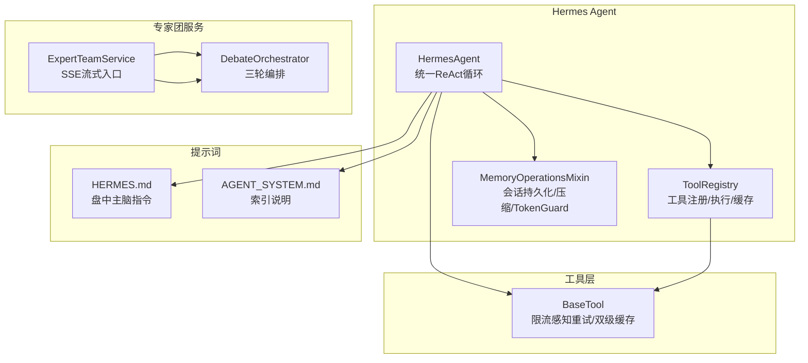
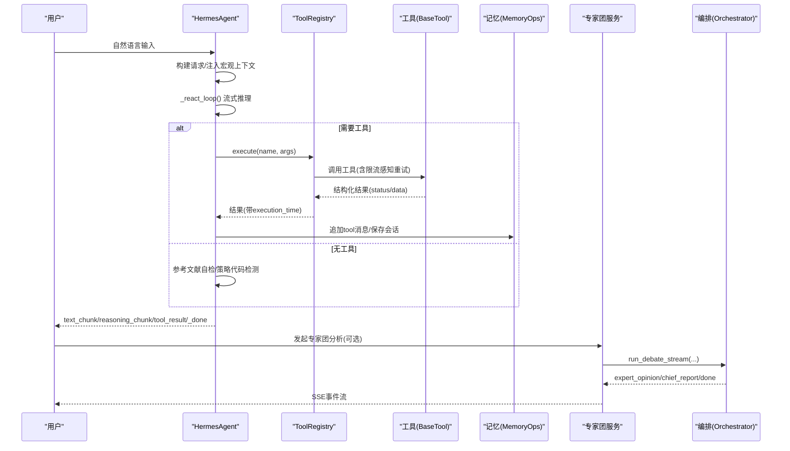
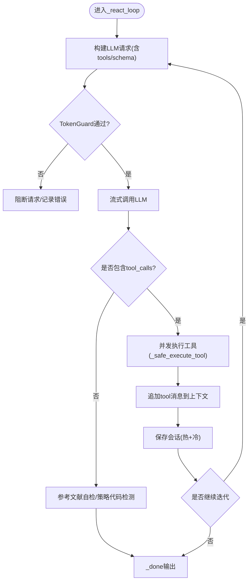
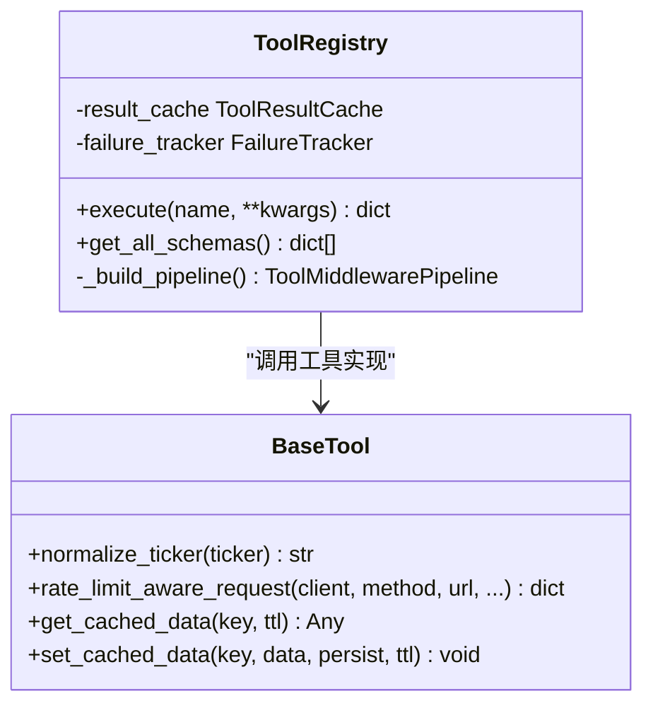
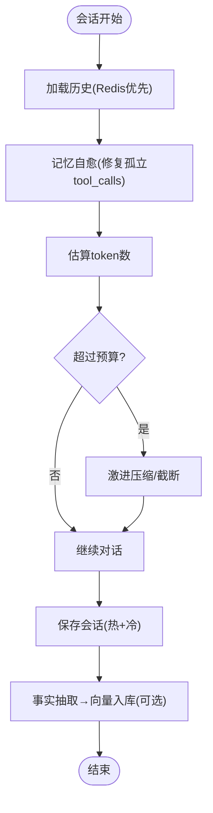
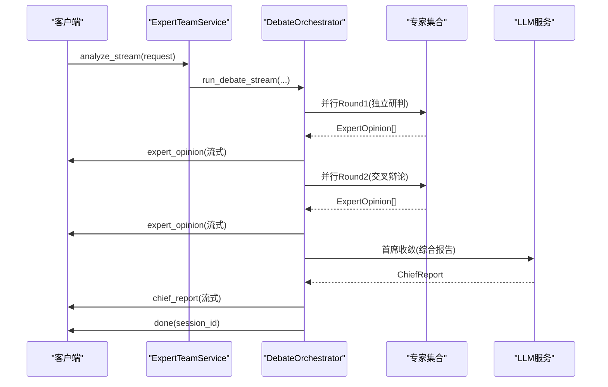
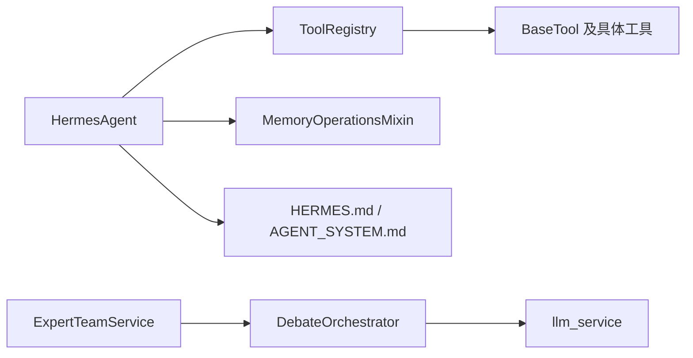

# AI智能分析系统

<cite>
**本文引用的文件**
- [agent.py](file://hermes_agent/agent.py)
- [tool_registry.py](file://hermes_agent/tool_registry.py)
- [memory_ops.py](file://hermes_agent/memory_ops.py)
- [expert_team_service.py](file://backend/services/expert_team/expert_team_service.py)
- [orchestrator.py](file://backend/services/expert_team/orchestrator.py)
- [base.py](file://hermes_agent/tools/base.py)
- [AGENT_SYSTEM.md](file://prompts/system/AGENT_SYSTEM.md)
- [HERMES.md](file://prompts/system/HERMES.md)
</cite>

## 目录
1. [简介](#简介)
2. [项目结构](#项目结构)
3. [核心组件](#核心组件)
4. [架构总览](#架构总览)
5. [详细组件分析](#详细组件分析)
6. [依赖关系分析](#依赖关系分析)
7. [性能考量](#性能考量)
8. [故障排查指南](#故障排查指南)
9. [结论](#结论)
10. [附录](#附录)

## 简介
本文件为 Quant Agent 的 AI 智能分析系统文档，聚焦 Hermes Agent 的核心架构与多智能体协作机制。内容涵盖：
- 自然语言理解、工具链集成、记忆管理与熔断恢复
- 专家团队协作（首席投资官、行业分析师、风险管理师等）
- 通过自然语言查询市场数据、获取策略建议与深度研究
- 扩展性：新工具注册与自定义提示词配置
- 性能优化与故障排查

## 项目结构
Hermes Agent 位于 hermes_agent 目录，围绕“主脑 + 工具注册表 + 记忆管理”构建；专家团服务位于 backend/services/expert_team，提供三轮混合协议编排引擎；工具基类在 hermes_agent/tools/base.py；系统指令与提示词集中在 prompts 目录。

**图表来源**
- [agent.py:60-702](file://hermes_agent/agent.py#L60-L702)
- [tool_registry.py:63-191](file://hermes_agent/tool_registry.py#L63-L191)
- [memory_ops.py:26-357](file://hermes_agent/memory_ops.py#L26-L357)
- [expert_team_service.py:31-229](file://backend/services/expert_team/expert_team_service.py#L31-L229)
- [orchestrator.py:35-552](file://backend/services/expert_team/orchestrator.py#L35-L552)
- [base.py:21-282](file://hermes_agent/tools/base.py#L21-L282)
- [HERMES.md:1-137](file://prompts/system/HERMES.md#L1-L137)
- [AGENT_SYSTEM.md:1-8](file://prompts/system/AGENT_SYSTEM.md#L1-L8)

**章节来源**
- [agent.py:60-702](file://hermes_agent/agent.py#L60-L702)
- [tool_registry.py:63-191](file://hermes_agent/tool_registry.py#L63-L191)
- [memory_ops.py:26-357](file://hermes_agent/memory_ops.py#L26-L357)
- [expert_team_service.py:31-229](file://backend/services/expert_team/expert_team_service.py#L31-L229)
- [orchestrator.py:35-552](file://backend/services/expert_team/orchestrator.py#L35-L552)
- [base.py:21-282](file://hermes_agent/tools/base.py#L21-L282)
- [HERMES.md:1-137](file://prompts/system/HERMES.md#L1-L137)
- [AGENT_SYSTEM.md:1-8](file://prompts/system/AGENT_SYSTEM.md#L1-L8)

## 核心组件
- HermesAgent：统一 ReAct 驱动循环，负责 LLM 调用、工具调度、事件流输出、熔断恢复与上下文自愈。
- ToolRegistry：工具注册、Schema 生成、中间件管线（熔断器）、结果缓存与正交分类。
- MemoryOperationsMixin：会话热冷双层存储（Redis+PostgreSQL）、记忆压缩、TokenGuard 防爆护栏、知识库沉淀。
- ExpertTeamService：专家团 SSE 流式入口，封装 DebateOrchestrator，支持场景模板与双层持久化。
- DebateOrchestrator：三轮混合协议编排（独立研判→交叉辩论→首席收敛），并行调度专家并流式推送观点。
- BaseTool：工具基类，提供股票代码归一化、限流感知智能重试、双级缓存（进程内存+Redis）。

**章节来源**
- [agent.py:60-702](file://hermes_agent/agent.py#L60-L702)
- [tool_registry.py:63-191](file://hermes_agent/tool_registry.py#L63-L191)
- [memory_ops.py:26-357](file://hermes_agent/memory_ops.py#L26-L357)
- [expert_team_service.py:31-229](file://backend/services/expert_team/expert_team_service.py#L31-L229)
- [orchestrator.py:35-552](file://backend/services/expert_team/orchestrator.py#L35-L552)
- [base.py:21-282](file://hermes_agent/tools/base.py#L21-L282)

## 架构总览
Hermes Agent 作为“盘中主脑”，通过 ToolRegistry 将 LLM 的工具调用映射到具体金融数据工具；MemoryOperationsMixin 保障会话状态与 Token 预算安全；专家团服务以三轮协议组织多角色协同，最终由首席分析师收敛报告。

**图表来源**
- [agent.py:187-510](file://hermes_agent/agent.py#L187-L510)
- [tool_registry.py:122-191](file://hermes_agent/tool_registry.py#L122-L191)
- [base.py:97-239](file://hermes_agent/tools/base.py#L97-L239)
- [memory_ops.py:132-176](file://hermes_agent/memory_ops.py#L132-L176)
- [expert_team_service.py:37-61](file://backend/services/expert_team/expert_team_service.py#L37-L61)
- [orchestrator.py:43-184](file://backend/services/expert_team/orchestrator.py#L43-L184)

## 详细组件分析

### HermesAgent 主脑与 ReAct 循环
- 统一 ReAct 循环：心跳保活、流式 chunk 拼接、工具并发执行、熔断恢复（达到最大迭代次数后强制收敛）。
- 工具执行：_safe_execute_tool 统一 JSON 解析与异步执行，异常包装为结构化错误。
- 上下文自愈：自动修复孤立 tool_calls、滑动窗口压缩、TokenGuard 防爆护栏。
- 流式事件：heartbeat/reasoning_chunk/text_chunk/tool_start/tool_result/chart_annotation/iteration_limit_reached/error/_done。

**图表来源**
- [agent.py:187-510](file://hermes_agent/agent.py#L187-L510)
- [memory_ops.py:261-289](file://hermes_agent/memory_ops.py#L261-L289)

**章节来源**
- [agent.py:60-702](file://hermes_agent/agent.py#L60-L702)
- [memory_ops.py:26-357](file://hermes_agent/memory_ops.py#L26-L357)

### 工具注册与执行管线
- 自动注册：@register_tool 装饰器收集工具类，初始化时实例化并注册。
- Schema 暴露：get_all_schemas 将工具描述与参数结构暴露给 LLM。
- 中间件管线：circuit_breaker → classifier → timer → core_execute，失败追踪与熔断。
- 结果缓存：成功结果写入 Redis Hash，命中直接返回，降低重复开销。
- 正交分类：success/empty/stale/rate_limited/error/circuit_breaker，便于上层决策。

**图表来源**
- [tool_registry.py:63-191](file://hermes_agent/tool_registry.py#L63-L191)
- [base.py:21-282](file://hermes_agent/tools/base.py#L21-L282)

**章节来源**
- [tool_registry.py:63-191](file://hermes_agent/tool_registry.py#L63-L191)
- [base.py:21-282](file://hermes_agent/tools/base.py#L21-L282)

### 记忆管理与 TokenGuard
- 会话持久化：Redis 热存（TTL 43200s）+ PostgreSQL 冷备，异步 upsert。
- 记忆压缩：按 token 估算阈值触发滑动窗口与巨型 tool 返回值折叠。
- 防爆护栏：限制单会话单位时间内的 LLM 调用次数，超阈抛出 RuntimeError。
- 知识库沉淀：从结论中抽取事实片段，向量化入库，支持后续检索增强。

**图表来源**
- [memory_ops.py:78-176](file://hermes_agent/memory_ops.py#L78-L176)
- [memory_ops.py:261-357](file://hermes_agent/memory_ops.py#L261-L357)

**章节来源**
- [memory_ops.py:26-357](file://hermes_agent/memory_ops.py#L26-L357)

### 专家团多智能体协作
- 场景模板：支持不同专家阵容与数据需求，可自定义专家顺序。
- 三轮协议：
  - Round 1：各专家基于共享数据包独立研判（并行）。
  - Round 2..N：交叉辩论，审视彼此观点并修正立场（并行）。
  - Round 3：首席分析师综合共识与分歧，输出概率评估与建议。
- 流式输出：逐段推送专家观点与最终报告，提升交互体验。
- 双层持久化：Redis 热 + PG 冷 + 内存兜底，确保高可用。

**图表来源**
- [expert_team_service.py:37-61](file://backend/services/expert_team/expert_team_service.py#L37-L61)
- [orchestrator.py:43-184](file://backend/services/expert_team/orchestrator.py#L43-L184)
- [orchestrator.py:254-525](file://backend/services/expert_team/orchestrator.py#L254-L525)

**章节来源**
- [expert_team_service.py:31-229](file://backend/services/expert_team/expert_team_service.py#L31-L229)
- [orchestrator.py:35-552](file://backend/services/expert_team/orchestrator.py#L35-L552)

### 工具链与金融数据能力
- 行情与盘口：最新价、历史K线、资金流向、期权链、订单簿、批量快照。
- 基本面与技术面：PE/PB/ROE、财报研报、技术指标计算（MA/MACD/RSI/ATR/布林）。
- 宏观与舆情：全球宏观新闻、公司新闻、情绪序列、FRED 序列、宏观日历、FOMC 隐含概率。
- 选股与检索：条件选股、网页搜索与抓取、全局知识检索与清理。
- 安全与稳健：限流感知智能重试、双级缓存、熔断器保护。

**章节来源**
- [HERMES.md:23-57](file://prompts/system/HERMES.md#L23-L57)
- [base.py:97-239](file://hermes_agent/tools/base.py#L97-L239)

## 依赖关系分析
- HermesAgent 依赖 ToolRegistry 暴露的工具 schema 与执行能力；通过 MemoryOperationsMixin 维护会话与 Token 预算。
- ToolRegistry 依赖 BaseTool 的具体实现，并通过中间件管线保证稳定性与可观测性。
- ExpertTeamService 依赖 DebateOrchestrator 进行多轮编排，使用 llm_service 进行结构化输出。
- 提示词文件（HERMES.md、AGENT_SYSTEM.md）约束工具路由纪律与输出格式。

**图表来源**
- [agent.py:60-702](file://hermes_agent/agent.py#L60-L702)
- [tool_registry.py:63-191](file://hermes_agent/tool_registry.py#L63-L191)
- [expert_team_service.py:31-229](file://backend/services/expert_team/expert_team_service.py#L31-L229)
- [orchestrator.py:35-552](file://backend/services/expert_team/orchestrator.py#L35-L552)
- [HERMES.md:1-137](file://prompts/system/HERMES.md#L1-L137)
- [AGENT_SYSTEM.md:1-8](file://prompts/system/AGENT_SYSTEM.md#L1-L8)

**章节来源**
- [agent.py:60-702](file://hermes_agent/agent.py#L60-L702)
- [tool_registry.py:63-191](file://hermes_agent/tool_registry.py#L63-L191)
- [expert_team_service.py:31-229](file://backend/services/expert_team/expert_team_service.py#L31-L229)
- [orchestrator.py:35-552](file://backend/services/expert_team/orchestrator.py#L35-L552)
- [HERMES.md:1-137](file://prompts/system/HERMES.md#L1-L137)
- [AGENT_SYSTEM.md:1-8](file://prompts/system/AGENT_SYSTEM.md#L1-L8)

## 性能考量
- 流式处理：HermesAgent 与专家团均使用流式事件，减少首字节延迟，提升用户体验。
- 并发执行：工具调用与专家研判并行，缩短整体响应时间。
- 缓存命中：ToolRegistry 对成功结果进行 Redis 缓存；BaseTool 提供进程内 L1 与 Redis L2 双级缓存。
- 记忆压缩：根据 token 估算动态压缩历史，避免上下文溢出与性能退化。
- 熔断与退避：工具层限流感知智能重试，结合熔断器防止雪崩。

[本节为通用性能指导，不直接分析具体文件]

## 故障排查指南
- TokenGuard 触发：检查会话调用频率与上下文长度，必要时清空或压缩记忆。
- 工具连续失败：同一工具连续失败 3 次触发熔断，需检查后端接口健康与限流策略。
- 流式中断：关注 heartbeat 与 error 事件，定位 LLM 或工具超时问题。
- 专家团超时：Round 1/2 整轮或单专家超时，查看 llm_service 与网络状况。
- 缓存失效：确认 Redis 连接与 TTL 设置，必要时清除过期键。

**章节来源**
- [memory_ops.py:261-289](file://hermes_agent/memory_ops.py#L261-L289)
- [tool_registry.py:174-191](file://hermes_agent/tool_registry.py#L174-L191)
- [agent.py:453-510](file://hermes_agent/agent.py#L453-L510)
- [orchestrator.py:264-335](file://backend/services/expert_team/orchestrator.py#L264-L335)

## 结论
Hermes Agent 以统一的 ReAct 循环为核心，结合工具注册与记忆管理，形成稳定可扩展的 AI 智能分析系统；专家团服务通过三轮混合协议实现多角色协同，产出高质量研究报告与交易建议。系统在流式交互、并发执行、缓存与熔断等方面具备良好性能与鲁棒性，适合金融场景下的实时分析与决策支持。

[本节为总结性内容，不直接分析具体文件]

## 附录

### API 使用示例（自然语言查询与深度研究）
- 查询市场数据：通过 HermesAgent.chat/chat_stream_async 发送自然语言，如“请给出 AAPL 最近一周的 K 线与资金流向”，系统将自动选择 get_broker_market_data 等工具并流式返回结果。
- 获取策略建议：调用 ExpertTeamService.analyze_stream，指定 scenario（如“个股深度分析”），传入 ticker 与问题，获得专家团的多轮研判与首席报告。
- 深度研究：结合 web_search/fetch_webpage/search_global_knowledge 等工具，补充非结构化信息，并在 HERMES.md 约束下输出引用与参考文献。

**章节来源**
- [agent.py:625-702](file://hermes_agent/agent.py#L625-L702)
- [expert_team_service.py:37-61](file://backend/services/expert_team/expert_team_service.py#L37-L61)
- [HERMES.md:53-57](file://prompts/system/HERMES.md#L53-L57)

### 扩展性：新工具注册与自定义提示词
- 新工具注册：继承 BaseTool，添加 name/description/parameters，并使用 @register_tool 装饰器，ToolRegistry 初始化时自动发现并注册。
- 自定义提示词：修改 prompts/system/HERMES.md 中的工具路由纪律与输出格式，确保 LLM 正确选择与调用工具。
- 专家角色扩展：在 expert_team/prompts/finance 中添加新的专家提示词，并在场景模板中引入对应专家。

**章节来源**
- [tool_registry.py:49-84](file://hermes_agent/tool_registry.py#L49-L84)
- [HERMES.md:23-57](file://prompts/system/HERMES.md#L23-L57)
- [AGENT_SYSTEM.md:1-8](file://prompts/system/AGENT_SYSTEM.md#L1-L8)