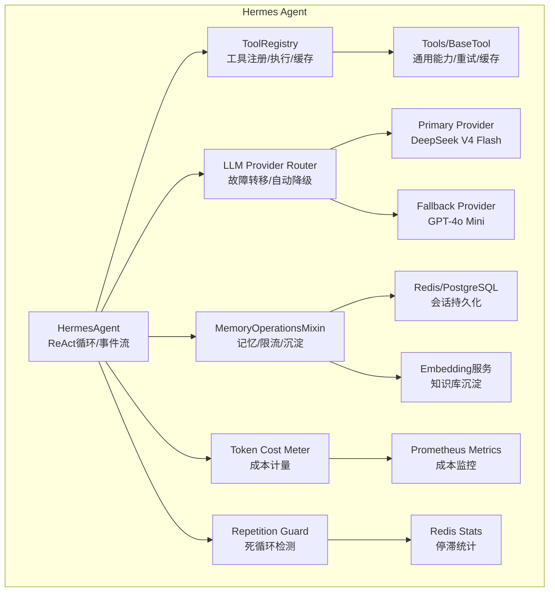
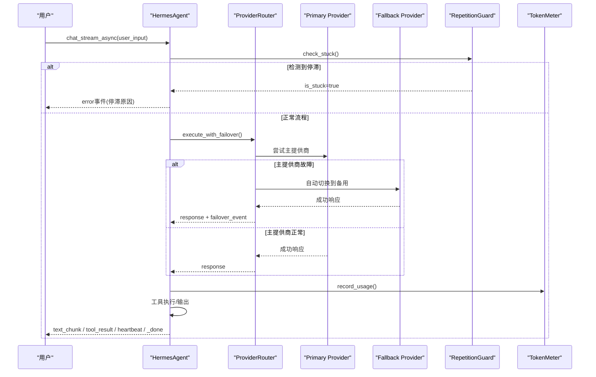
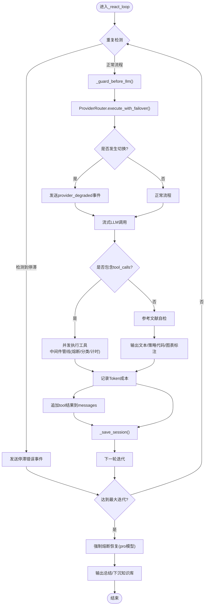
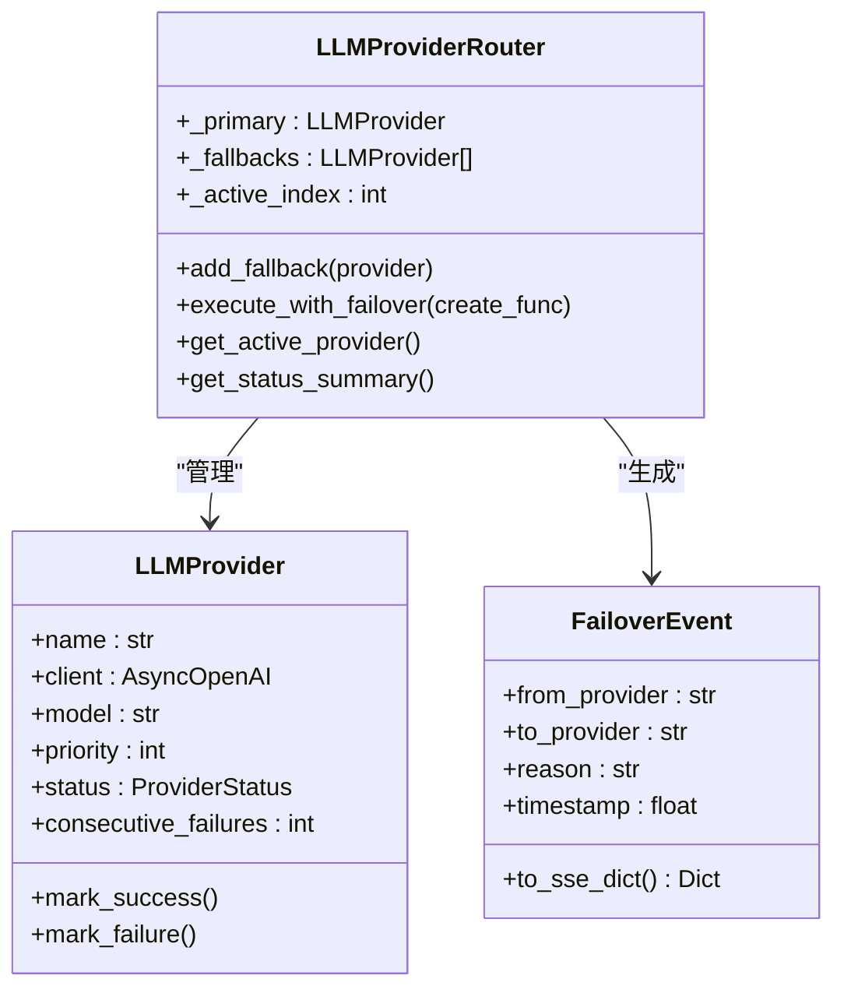
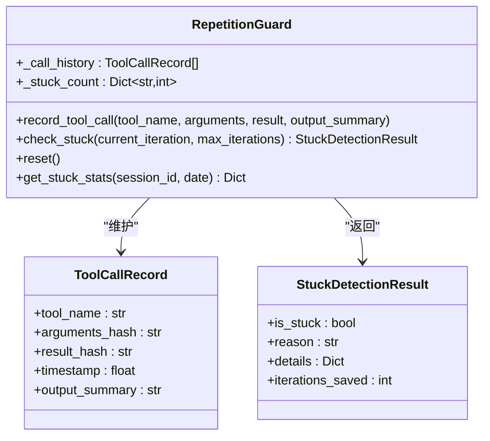
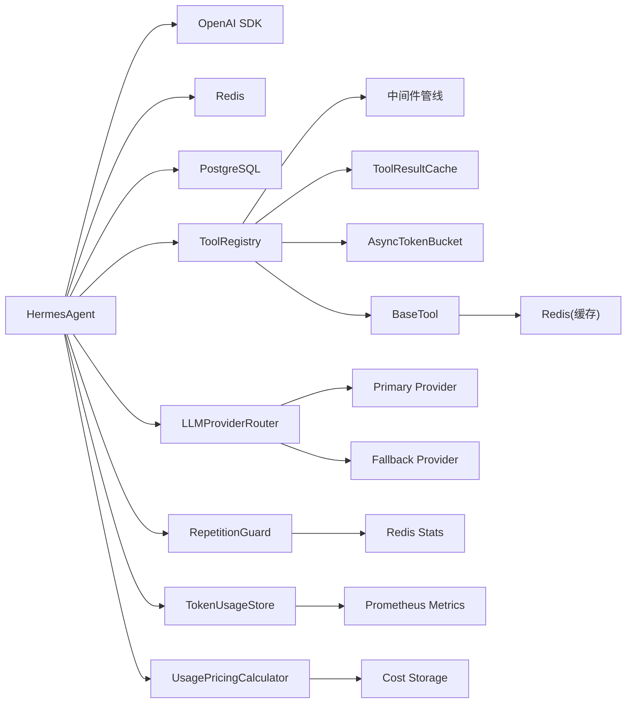

# Hermes Agent核心架构

<cite>
**本文引用的文件**
- [agent.py](file://hermes_agent/agent.py)
- [memory_ops.py](file://hermes_agent/memory_ops.py)
- [tool_registry.py](file://hermes_agent/tool_registry.py)
- [base.py](file://hermes_agent/tools/base.py)
- [llm_provider.py](file://hermes_agent/llm_provider.py)
- [repetition_guard.py](file://backend/services/ai_narrator/repetition_guard.py)
- [token_usage_store.py](file://backend/services/ai_narrator/token_usage_store.py)
- [usage_pricing.py](file://backend/services/ai_narrator/usage_pricing.py)
- [HERMES.md](file://prompts/system/HERMES.md)
- [run_cli.py](file://scripts/run_cli.py)
- [test_agent.py](file://backend/tests/test_agent.py)
</cite>

## 更新摘要
**变更内容**
- 新增LLM提供商故障转移机制，支持主备provider自动切换和SSE事件通知
- 集成重复检测防护系统，防止ReAct循环陷入死循环和停滞模式
- 实现Token成本计量系统，支持按会话、工具维度统计成本和Prometheus指标
- 增强系统健壮性和可观测性，提供完整的故障恢复和监控能力

## 目录
1. [简介](#简介)
2. [项目结构](#项目结构)
3. [核心组件](#核心组件)
4. [架构总览](#架构总览)
5. [详细组件分析](#详细组件分析)
6. [依赖关系分析](#依赖关系分析)
7. [性能考量](#性能考量)
8. [故障排查指南](#故障排查指南)
9. [结论](#结论)
10. [附录：使用示例与最佳实践](#附录使用示例与最佳实践)

## 简介
本文件面向Hermes Agent的核心架构，聚焦HermesAgent类的设计模式与实现细节，包括ReAct工作流、上下文状态管理、会话记忆机制、错误恢复策略；并深入解析MemoryOperationsMixin的会话加载保存、记忆修复压缩、token预算控制等能力。**最新更新**集成了LLM提供商故障转移、重复检测防护、Token成本计量等新功能，显著增强了系统的健壮性和可观测性。文档同时提供初始化、系统提示词配置、用户请求处理、工具调用循环与最终输出生成的完整流程说明，以及性能优化建议与故障排查指南。

## 项目结构
Hermes Agent位于仓库根下的hermes_agent包中，核心由以下模块构成：
- agent.py：HermesAgent主脑类，封装ReAct循环、LLM调用、事件流、熔断恢复、工具执行编排。
- memory_ops.py：MemoryOperationsMixin，负责会话持久化（Redis热+PG冷）、记忆自愈与压缩、TokenGuard限流与预算控制、知识库沉淀。
- tool_registry.py：ToolRegistry工具注册表，统一schema生成、中间件管线（熔断器、分类、计时）、结果缓存与限流。
- base.py：BaseTool基类，提供通用能力如ticker标准化、限流感知重试、双级缓存（内存+Redis）。
- llm_provider.py：**新增** LLMProvider和LLMProviderRouter，实现多提供商故障转移和自动降级。
- repetition_guard.py：**新增** RepetitionGuard，检测ReAct循环中的死循环和停滞模式。
- token_usage_store.py：**新增** TokenUsageStore，提供三维聚合的Token消耗计量。
- usage_pricing.py：**新增** UsagePricingCalculator，将Token消耗转换为美元成本。
- prompts/system/HERMES.md：盘中主脑系统指令，定义工具路由纪律、零幻觉约束、宏观风控优先级、输出格式与硬风控规则。
- scripts/run_cli.py：CLI入口，演示如何初始化Agent、注入工具、启动交互与流式消费。
- backend/tests/test_agent.py：单元测试，覆盖标题校验、记忆自愈、工具执行、令牌桶限流等关键路径。

**图表来源**
- [agent.py:60-752](file://hermes_agent/agent.py#L60-L752)
- [llm_provider.py:150-449](file://hermes_agent/llm_provider.py#L150-L449)
- [repetition_guard.py:114-469](file://backend/services/ai_narrator/repetition_guard.py#L114-L469)
- [token_usage_store.py:95-317](file://backend/services/ai_narrator/token_usage_store.py#L95-L317)
- [usage_pricing.py:129-281](file://backend/services/ai_narrator/usage_pricing.py#L129-L281)

章节来源
- [agent.py:60-752](file://hermes_agent/agent.py#L60-L752)
- [memory_ops.py:26-366](file://hermes_agent/memory_ops.py#L26-L366)
- [tool_registry.py:66-252](file://hermes_agent/tool_registry.py#L66-L252)
- [base.py:21-282](file://hermes_agent/tools/base.py#L21-L282)
- [llm_provider.py:150-449](file://hermes_agent/llm_provider.py#L150-L449)
- [repetition_guard.py:114-469](file://backend/services/ai_narrator/repetition_guard.py#L114-L469)
- [token_usage_store.py:95-317](file://backend/services/ai_narrator/token_usage_store.py#L95-L317)
- [usage_pricing.py:129-281](file://backend/services/ai_narrator/usage_pricing.py#L129-L281)

## 核心组件
- HermesAgent：维护messages上下文、构建LLM请求、驱动ReAct循环、处理工具调用、事件流输出、熔断恢复、会话保存。
- MemoryOperationsMixin：会话加载/保存（Redis热+PG冷）、记忆自愈（修复孤立tool_calls）、记忆压缩（滑动窗口/截断）、TokenGuard（限流+预算）、事实抽取与知识库沉淀。
- ToolRegistry：工具注册、schema生成、中间件管线（熔断器/分类/计时）、结果缓存、失败追踪。
- BaseTool：通用工具能力（ticker标准化、限流感知重试、双级缓存）。
- **LLMProviderRouter**：**新增** 多提供商故障转移路由器，支持主备链管理和自动降级。
- **RepetitionGuard**：**新增** 重复检测守卫，检测死循环、停滞模式和循环模式。
- **TokenUsageStore**：**新增** Token计量存储，提供日/时/月三维聚合计数。
- **UsagePricingCalculator**：**新增** 成本计算器，将Token消耗转换为美元成本。
- HERMES.md：系统指令，规定工具路由、零幻觉、宏观风控、输出格式与代码/图表硬风控。

章节来源
- [agent.py:60-752](file://hermes_agent/agent.py#L60-L752)
- [memory_ops.py:26-366](file://hermes_agent/memory_ops.py#L26-L366)
- [tool_registry.py:66-252](file://hermes_agent/tool_registry.py#L66-L252)
- [base.py:21-282](file://hermes_agent/tools/base.py#L21-L282)
- [llm_provider.py:150-449](file://hermes_agent/llm_provider.py#L150-L449)
- [repetition_guard.py:114-469](file://backend/services/ai_narrator/repetition_guard.py#L114-L469)
- [token_usage_store.py:95-317](file://backend/services/ai_narrator/token_usage_store.py#L95-L317)
- [usage_pricing.py:129-281](file://backend/services/ai_narrator/usage_pricing.py#L129-L281)

## 架构总览
HermesAgent作为"主脑"，通过统一的_react_loop驱动ReAct推理：每轮迭代先进行TokenGuard检查，再发起流式LLM推理，拼接文本与工具调用；若存在工具调用则并发执行并通过中间件管线（熔断器、分类、计时）返回结构化结果；若无工具调用则进行参考文献自检与输出；达到最大迭代次数后触发强制熔断恢复，切换至更高级模型输出总结。**新增功能**包括：LLM提供商故障转移自动切换到备用提供商、重复检测防护提前终止死循环、Token成本计量实时统计消耗。

**图表来源**
- [agent.py:327-720](file://hermes_agent/agent.py#L327-L720)
- [llm_provider.py:380-418](file://hermes_agent/llm_provider.py#L380-L418)
- [repetition_guard.py:178-230](file://backend/services/ai_narrator/repetition_guard.py#L178-L230)
- [token_usage_store.py:150-202](file://backend/services/ai_narrator/token_usage_store.py#L150-L202)

章节来源
- [agent.py:327-720](file://hermes_agent/agent.py#L327-L720)
- [memory_ops.py:141-298](file://hermes_agent/memory_ops.py#L141-L298)
- [tool_registry.py:183-252](file://hermes_agent/tool_registry.py#L183-L252)
- [llm_provider.py:380-418](file://hermes_agent/llm_provider.py#L380-L418)
- [repetition_guard.py:178-230](file://backend/services/ai_narrator/repetition_guard.py#L178-L230)
- [token_usage_store.py:150-202](file://backend/services/ai_narrator/token_usage_store.py#L150-L202)

## 详细组件分析

### HermesAgent类：增强的ReAct工作流与上下文状态管理
- 上下文状态：messages列表维护system/user/assistant/tool消息；每次迭代前调用_heal_memory修复异常中断导致的孤立tool_calls；_compress_memory在必要时裁剪历史或巨型tool内容。
- LLM调用：_build_request_kwargs统一构造model/messages/tools/stream/stream_options；_call_llm封装非流式调用；流式路径在_react_loop内直接消费chunk，拼接content与tool_calls。
- **故障转移集成**：**新增** 通过provider_router.execute_with_failover实现自动故障切换，支持SSE事件通知前端降级状态。
- **重复检测集成**：**新增** 每轮迭代前调用repetition_guard.check_stuck检测死循环，提前终止避免无意义token消耗。
- 工具执行：_safe_execute_tool解析参数并调用tool_registry.execute；支持异步并发执行多个工具，心跳保活与超时处理；结果写入messages并记录事件日志。
- **成本计量集成**：**新增** 通过usage_pricing_calculator.record_session_cost记录Token成本，支持按会话维度统计。
- 参考文献自愈：检测正文与文末参考文献引用不一致时自动注入系统指令补充缺失条目，避免幻觉。
- 熔断恢复：达到最大迭代次数后，注入强制指令并切换到pro模型输出总结，同时尝试将最终内容下沉到知识库。
- 事件流：统一SSE契约，包含heartbeat/reasoning_chunk/text_chunk/tool_start/tool_result/iteration_limit_reached/error/_done等事件类型。

**图表来源**
- [agent.py:327-720](file://hermes_agent/agent.py#L327-L720)

章节来源
- [agent.py:60-752](file://hermes_agent/agent.py#L60-L752)

### MemoryOperationsMixin：会话加载保存、记忆修复压缩、Token预算控制
- 会话持久化：_save_session将messages序列化写入Redis（热数据），并后台异步Upsert到PostgreSQL（冷数据）；_load_session优先从Redis读取，未命中则从PG唤醒并回写Redis。
- 记忆修复：_heal_memory扫描messages，剔除末尾残留未闭环的assistant.tool_calls，并为缺失的tool响应补全占位，确保上下文一致性。
- 记忆压缩：_compress_memory对非最新轮次的巨型tool内容进行截断，并在超过阈值时启用滑动窗口裁剪历史消息，减少token占用。
- TokenGuard：_guard_before_llm基于Redis计数限制单位时间内的LLM调用次数，估算当前上下文token数，超预算时激进压缩或阻断请求。
- 知识库沉淀：_sink_to_kb从最终回答中抽取事实片段，生成embedding并写入WebpageKnowledgeBase，支持按session去重与版本标记。

章节来源
- [memory_ops.py:26-366](file://hermes_agent/memory_ops.py#L26-L366)

### LLMProviderRouter：多提供商故障转移机制
- **主备链管理**：支持primary + fallback[0..N]的多层故障转移链，默认主提供商为deepseek-v4-flash。
- **自动故障切换**：连续失败达到FAILOVER_THRESHOLD（默认1次）后自动切换到下一个可用provider。
- **恢复探测**：定期探测失败的provider是否恢复，支持RECOVERY_PROBE_INTERVAL间隔的自动恢复。
- **透明failover**：上层调用execute_with_failover时无需关心切换逻辑，返回(response, failover_event)。
- **SSE事件通知**：故障切换时生成FailoverEvent，通过to_sse_dict()转换为SSE事件通知前端。
- **状态监控**：get_status_summary()提供所有provider的状态摘要，用于调试和监控。

**图表来源**
- [llm_provider.py:64-129](file://hermes_agent/llm_provider.py#L64-L129)
- [llm_provider.py:150-449](file://hermes_agent/llm_provider.py#L150-L449)

章节来源
- [llm_provider.py:150-449](file://hermes_agent/llm_provider.py#L150-L449)

### RepetitionGuard：重复检测防护系统
- **四维度检测**：同参数重复调用、同结论重复输出、工具调用无进展、循环模式检测（A→B→A→B）。
- **滑动窗口**：维护最近K次调用的历史记录，支持SLIDING_WINDOW_SIZE大小配置。
- **早停机制**：3轮内识别停滞并中止，而非耗满max_iterations，节省token和用户等待时间。
- **相似度计算**：使用Jaccard相似度算法检测文本相似性，阈值SIMILARITY_THRESHOLD=0.9。
- **统计持久化**：通过Redis存储会话维度和全局维度的停滞统计，支持TTL过期管理。
- **Prometheus指标**：暴露agent_stuck_detection_total和agent_stuck_iterations_saved指标。

**图表来源**
- [repetition_guard.py:86-130](file://backend/services/ai_narrator/repetition_guard.py#L86-L130)
- [repetition_guard.py:114-469](file://backend/services/ai_narrator/repetition_guard.py#L114-L469)

章节来源
- [repetition_guard.py:114-469](file://backend/services/ai_narrator/repetition_guard.py#L114-L469)

### TokenUsageStore和UsagePricingCalculator：Token成本计量系统
- **三维聚合计数**：按自然日/小时/月分桶存储Token消耗，支持Redis持久化和内存降级。
- **成本计算**：基于主流LLM提供商官方定价，将Token消耗转换为美元成本。
- **会话维度统计**：记录每个session的成本累计，支持查询会话累计成本。
- **Prometheus指标**：暴露llm_token_usage_total、llm_cost_usd_total等指标供监控。
- **异常安全**：任何Redis/指标异常均被吞掉，绝不抛回业务热路径。

章节来源
- [token_usage_store.py:95-317](file://backend/services/ai_narrator/token_usage_store.py#L95-L317)
- [usage_pricing.py:129-281](file://backend/services/ai_narrator/usage_pricing.py#L129-L281)

### ToolRegistry：工具注册、执行与中间件管线
- 工具注册：通过装饰器自动收集工具类并实例化注册；支持按场景过滤schema以减少上下文大小。
- 执行管线：execute先检查缓存，再通过中间件管线（熔断器→分类→计时→核心执行），最后统计执行耗时并记录失败/成功计数。
- 熔断器：FailureTracker跟踪同一工具的连续失败次数，达到阈值后返回circuit_breaker状态，防止死循环。
- 结果缓存：ToolResultCache基于Redis Hash缓存成功结果，避免重复计算。
- 限流：AsyncTokenBucket为工具执行提供令牌桶限流，保护后端服务。

章节来源
- [tool_registry.py:66-252](file://hermes_agent/tool_registry.py#L66-L252)
- [base.py:21-282](file://hermes_agent/tools/base.py#L21-L282)

### 系统提示词与工具路由纪律
- 定位与风格：量化交易主脑，语言犀利、数据驱动、禁止幻觉。
- 工具路由：行情、基本面、技术面、宏观舆情、选股、检索等工具的使用规范，强调以schema为准，禁止绕过工具拉取外部数据。
- 零幻觉：所有金融数字必须来自工具返回，失败时声明无法分析；多源矛盾需暴露冲突点。
- 宏观风控：Tier 1/2/3指标优先级，结合宏观日历与FOMC隐含概率。
- 输出格式：早报模板、新闻卡片、结论矩阵、图表标注JSON块。
- 硬风控：代码生成与图表输出的严格约束，避免非法JSON导致前端卡死。

章节来源
- [HERMES.md:1-137](file://prompts/system/HERMES.md#L1-L137)

## 依赖关系分析
- HermesAgent依赖：
  - OpenAI SDK用于LLM调用。
  - Redis用于会话持久化与限流计数。
  - PostgreSQL用于冷数据恢复与知识库沉淀。
  - ToolRegistry用于工具执行与缓存。
  - MemoryOperationsMixin提供记忆管理与TokenGuard。
  - **LLMProviderRouter**：**新增** 提供故障转移和自动降级能力。
  - **RepetitionGuard**：**新增** 提供重复检测和早停机制。
  - **TokenUsageStore/UsagePricingCalculator**：**新增** 提供成本计量和统计。
- ToolRegistry依赖：
  - 中间件管线（熔断器、分类、计时）。
  - ToolResultCache用于结果缓存。
  - AsyncTokenBucket用于工具执行限流。
- BaseTool依赖：
  - 全局Redis用于跨进程缓存。
  - 限流感知重试逻辑，兼容HTTP 429/503与响应体限流信号。

**图表来源**
- [agent.py:60-752](file://hermes_agent/agent.py#L60-L752)
- [llm_provider.py:150-449](file://hermes_agent/llm_provider.py#L150-L449)
- [repetition_guard.py:114-469](file://backend/services/ai_narrator/repetition_guard.py#L114-L469)
- [token_usage_store.py:95-317](file://backend/services/ai_narrator/token_usage_store.py#L95-L317)
- [usage_pricing.py:129-281](file://backend/services/ai_narrator/usage_pricing.py#L129-L281)

章节来源
- [agent.py:60-752](file://hermes_agent/agent.py#L60-L752)
- [tool_registry.py:66-252](file://hermes_agent/tool_registry.py#L66-L252)
- [base.py:21-282](file://hermes_agent/tools/base.py#L21-L282)
- [llm_provider.py:150-449](file://hermes_agent/llm_provider.py#L150-L449)
- [repetition_guard.py:114-469](file://backend/services/ai_narrator/repetition_guard.py#L114-L469)
- [token_usage_store.py:95-317](file://backend/services/ai_narrator/token_usage_store.py#L95-L317)
- [usage_pricing.py:129-281](file://backend/services/ai_narrator/usage_pricing.py#L129-L281)

## 性能考量
- 流式推理：采用流式LLM调用，实时推送text_chunk与reasoning_chunk，降低首字节延迟。
- 并发工具执行：多个工具调用并行执行，缩短整体等待时间。
- 记忆压缩：滑动窗口与巨型tool内容截断，控制上下文token占用，避免溢出。
- TokenGuard：单位时间调用次数限制与预算护栏，防止死循环与资源耗尽。
- 结果缓存：ToolResultCache基于Redis Hash缓存成功结果，减少重复计算。
- 限流保护：AsyncTokenBucket与BaseTool的限流感知重试，提升鲁棒性。
- 知识库沉淀：仅抽取事实片段并去重写入，避免冗余存储。
- **故障转移优化**：**新增** 自动故障切换减少API调用失败带来的延迟影响。
- **重复检测优化**：**新增** 提前终止死循环，节省不必要的token消耗和用户等待时间。
- **成本监控优化**：**新增** 实时成本计量帮助识别高消耗场景并进行优化。

## 故障排查指南
- LLM调用超时：检查网络与API Key，关注心跳保活与超时处理；确认stream_options配置正确。
- 工具执行失败：查看ToolRegistry的失败追踪与熔断报告；检查后端接口连通性与限流信号。
- 记忆损坏：运行_heal_memory修复孤立tool_calls；检查Redis/PG读写权限与连接。
- Token预算超限：调整max_input_tokens或启用激进压缩；检查messages长度与tool内容大小。
- 知识库沉淀失败：确认Embedding服务可用与数据库写入权限；检查事实抽取正则匹配结果。
- CLI交互问题：验证环境变量（BACKEND_API_URL、LLM_API_KEY等）；检查后端健康检查端点。
- **故障转移问题**：**新增** 检查LLM_FALLBACK_API_KEY配置，查看provider状态摘要，确认SSE事件是否正确发送。
- **重复检测误报**：**新增** 调整MAX_CONSECUTIVE_IDENTICAL_CALLS等阈值，检查滑动窗口大小配置。
- **成本计量异常**：**新增** 检查Redis连接状态，确认Prometheus指标是否正常上报，验证模型定价配置。

章节来源
- [agent.py:190-548](file://hermes_agent/agent.py#L190-L548)
- [memory_ops.py:141-298](file://hermes_agent/memory_ops.py#L141-L298)
- [tool_registry.py:183-252](file://hermes_agent/tool_registry.py#L183-L252)
- [base.py:97-189](file://hermes_agent/tools/base.py#L97-L189)
- [run_cli.py:46-113](file://scripts/run_cli.py#L46-L113)
- [test_agent.py:27-227](file://backend/tests/test_agent.py#L27-L227)
- [llm_provider.py:380-449](file://hermes_agent/llm_provider.py#L380-L449)
- [repetition_guard.py:178-469](file://backend/services/ai_narrator/repetition_guard.py#L178-L469)
- [token_usage_store.py:150-317](file://backend/services/ai_narrator/token_usage_store.py#L150-L317)
- [usage_pricing.py:171-281](file://backend/services/ai_narrator/usage_pricing.py#L171-L281)

## 结论
Hermes Agent通过HermesAgent类的ReAct工作流实现了强大的对话推理与工具调用能力，结合MemoryOperationsMixin的记忆管理与TokenGuard保障稳定性与可控性，ToolRegistry提供灵活的工具生态与中间件保护。**最新更新**集成了LLM提供商故障转移、重复检测防护、Token成本计量等新功能，显著增强了系统的健壮性和可观测性。系统指令HERMES.md明确了工具路由与风控边界，确保零幻觉与专业输出。整体架构具备高扩展性、容错能力和完善的监控体系，适用于复杂量化分析与交易辅助场景。

## 附录：使用示例与最佳实践
- 初始化Agent：
  - 创建ToolRegistry并传入HermesAgent。
  - 设置session_id与system_prompt_path。
  - 调用initialize加载历史记忆。
- 配置系统提示词：
  - 使用prompts/system/HERMES.md作为默认系统指令。
  - 可根据需求自定义提示词文件路径。
- 处理用户请求：
  - 使用chat或chat_stream_async接口发送用户输入。
  - 支持附件注入与宏观上下文增强。
- 工具调用循环：
  - Agent自动检测工具调用意图并执行。
  - 支持并发执行与心跳保活。
- 最终输出：
  - 流式推送text_chunk与reasoning_chunk。
  - 支持策略代码与图表标注检测。
- **故障转移配置**：**新增**
  - 设置LLM_FALLBACK_API_KEY配置备用提供商。
  - 监控provider状态摘要，及时处理故障切换。
  - 前端接收provider_degraded事件，显示降级状态。
- **重复检测优化**：**新增**
  - 根据业务场景调整重复检测阈值。
  - 监控停滞检测统计，识别潜在的死循环模式。
  - 利用early stopping机制节省token成本。
- **成本计量监控**：**新增**
  - 通过Prometheus指标监控Token消耗趋势。
  - 按会话维度分析成本分布，识别高消耗场景。
  - 结合业务价值评估ROI，优化模型选择。
- 最佳实践：
  - 合理设置max_iterations与token预算。
  - 监控工具失败率与熔断状态。
  - 定期清理历史记忆以避免上下文膨胀。
  - 利用知识库沉淀重要事实提升后续查询效率。
  - **配置多提供商备份**：**新增** 提高系统可用性。
  - **启用重复检测**：**新增** 防止无意义的token消耗。
  - **监控成本指标**：**新增** 控制运营成本。

章节来源
- [run_cli.py:46-113](file://scripts/run_cli.py#L46-L113)
- [agent.py:553-752](file://hermes_agent/agent.py#L553-L752)
- [memory_ops.py:141-298](file://hermes_agent/memory_ops.py#L141-L298)
- [tool_registry.py:66-252](file://hermes_agent/tool_registry.py#L66-L252)
- [HERMES.md:1-137](file://prompts/system/HERMES.md#L1-L137)
- [llm_provider.py:177-220](file://hermes_agent/llm_provider.py#L177-L220)
- [repetition_guard.py:46-62](file://backend/services/ai_narrator/repetition_guard.py#L46-L62)
- [token_usage_store.py:40-50](file://backend/services/ai_narrator/token_usage_store.py#L40-L50)
- [usage_pricing.py:38-48](file://backend/services/ai_narrator/usage_pricing.py#L38-L48)
