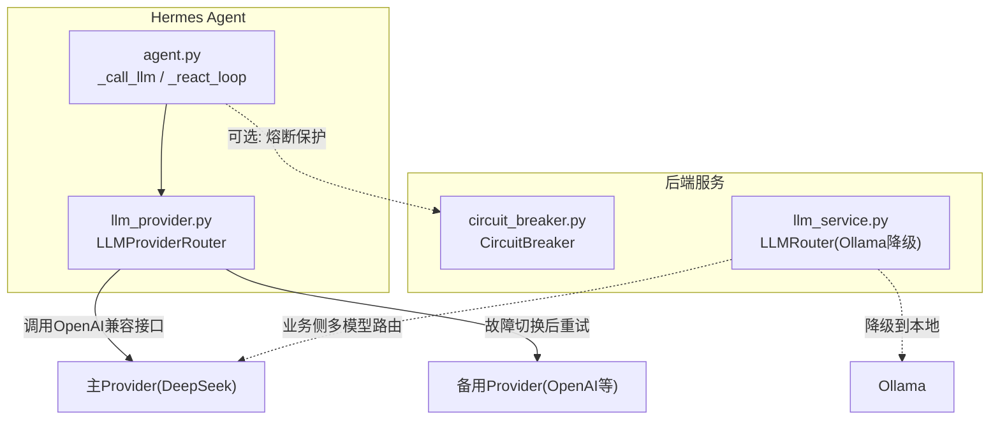
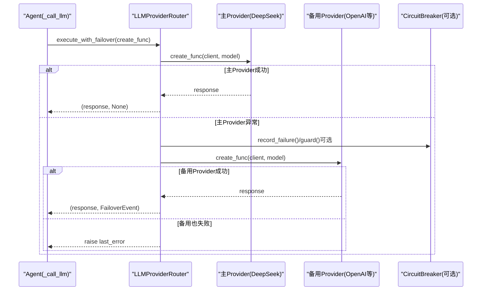
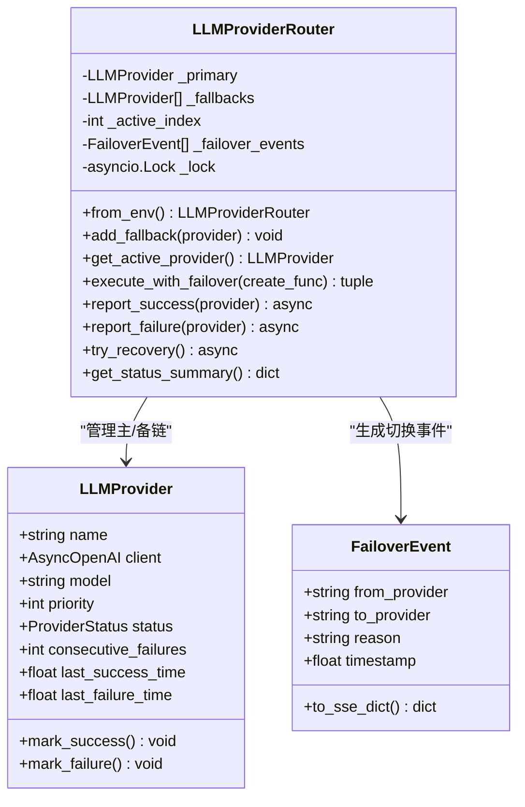
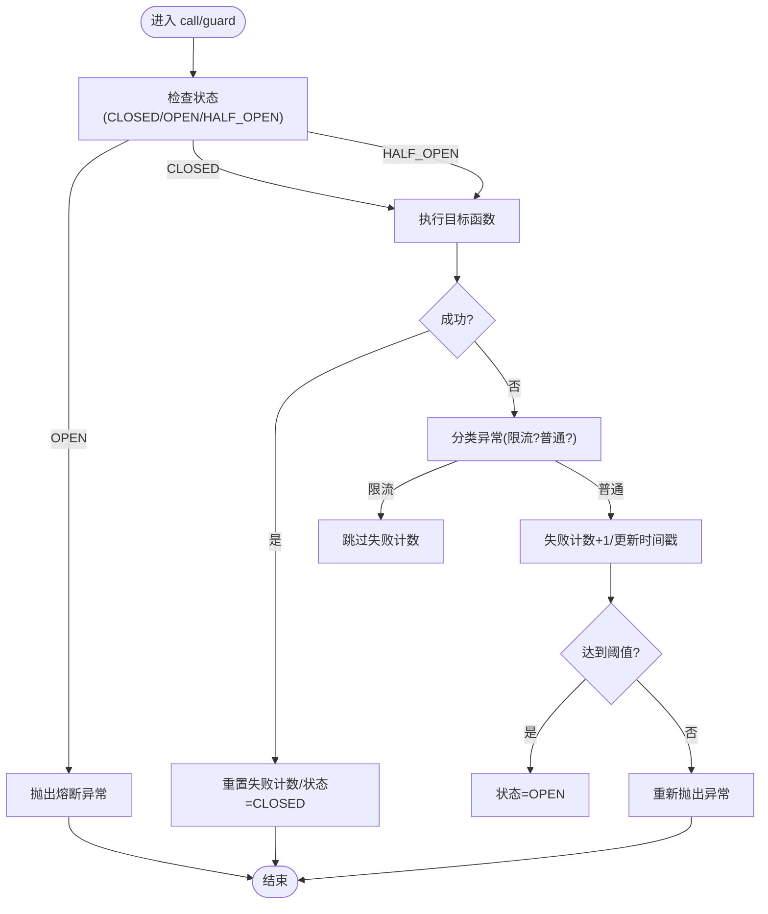
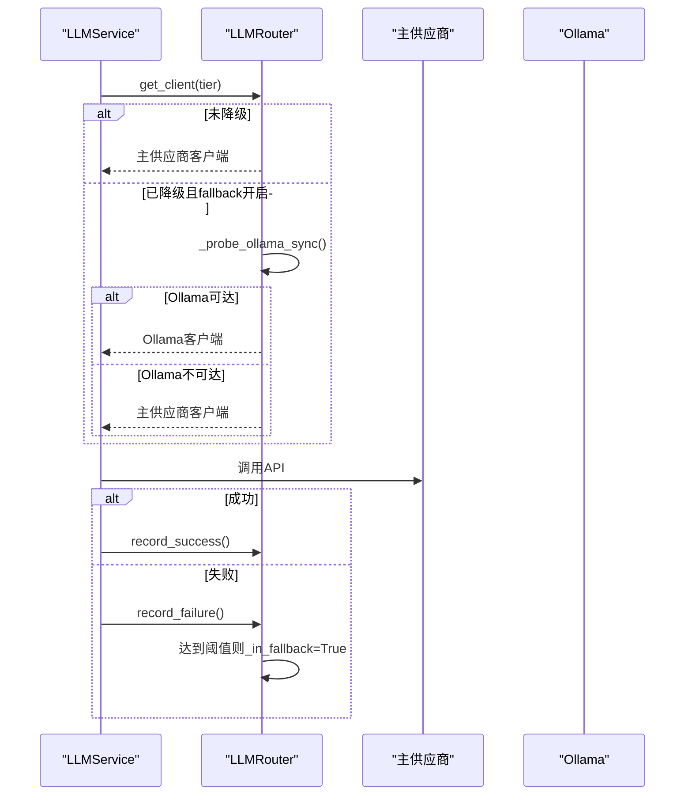
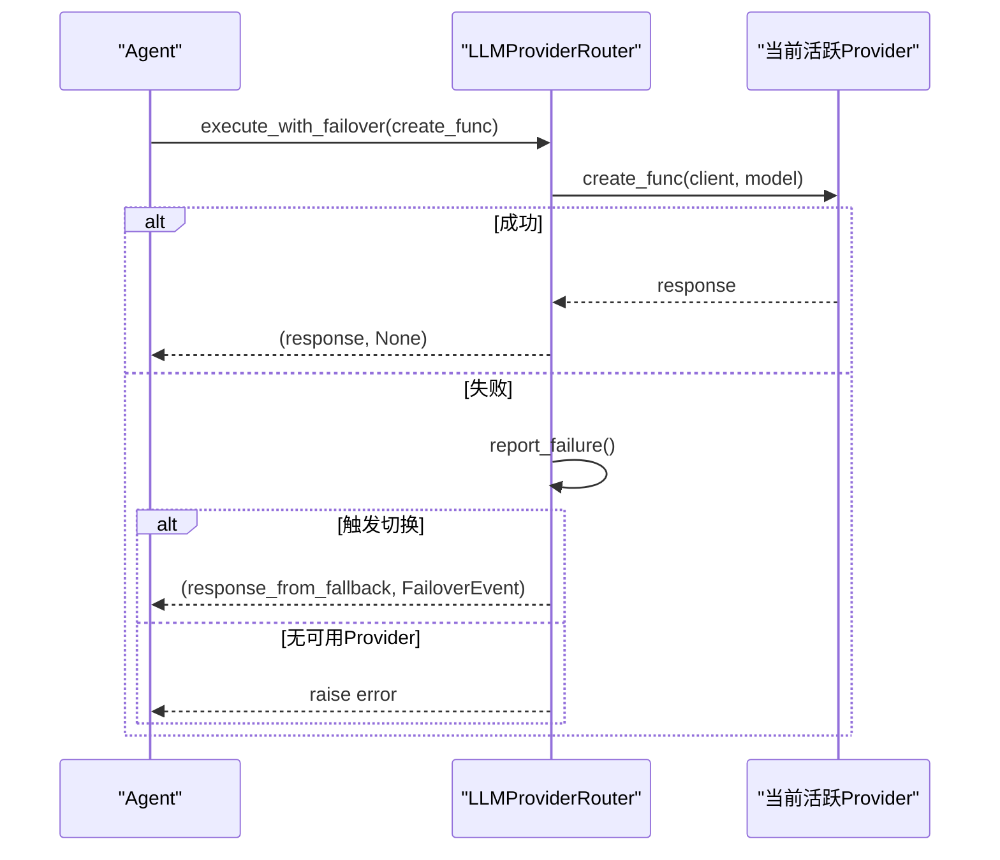
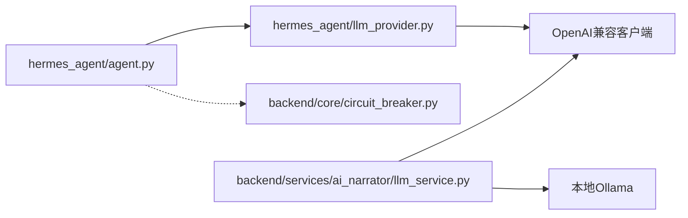

# LLM提供商故障转移系统

<cite>
**本文引用的文件**
- [hermes_agent/llm_provider.py](file://hermes_agent/llm_provider.py)
- [backend/core/circuit_breaker.py](file://backend/core/circuit_breaker.py)
- [backend/services/ai_narrator/llm_service.py](file://backend/services/ai_narrator/llm_service.py)
- [hermes_agent/agent.py](file://hermes_agent/agent.py)
- [backend/tests/test_llm_provider_ag06.py](file://backend/tests/test_llm_provider_ag06.py)
</cite>

## 目录
1. [简介](#简介)
2. [项目结构](#项目结构)
3. [核心组件](#核心组件)
4. [架构总览](#架构总览)
5. [详细组件分析](#详细组件分析)
6. [依赖关系分析](#依赖关系分析)
7. [性能与可用性考量](#性能与可用性考量)
8. [故障排查指南](#故障排查指南)
9. [结论](#结论)
10. [附录](#附录)

## 简介
本系统为LLM调用提供“主备多Provider + 自动故障转移 + 恢复探测”的能力，确保在主要大模型供应商不可用时，自动切换到备用供应商，并通过SSE事件通知前端处于降级态。同时，系统内还包含通用的熔断器（Circuit Breaker）能力，用于保护外部API调用、限流错误隔离与半开探测恢复。

设计约束：
- 默认路由不变：主推理仍使用 deepseek-v4-flash。
- 仅做故障降级，不改变默认路由策略。
- 前端按规范标注降级态（通过SSE事件）。

## 项目结构
围绕LLM故障转移的关键代码分布在以下位置：
- hermes_agent/llm_provider.py：实现 Provider 抽象、Router、自动切换与恢复探测。
- backend/core/circuit_breaker.py：通用熔断器，支持状态机（CLOSED/OPEN/HALF_OPEN）、限流错误过滤、指标上报。
- backend/services/ai_narrator/llm_service.py：面向AI叙述场景的多模型路由器与Ollama降级逻辑。
- hermes_agent/agent.py：Agent主脑，集成Provider Router，统一封装LLM调用并透传故障切换事件。
- backend/tests/test_llm_provider_ag06.py：针对Provider Router的单元测试，覆盖自动切换、SSE事件格式、默认路由不变等验收标准。

图表来源
- [hermes_agent/agent.py:260-320](file://hermes_agent/agent.py#L260-L320)
- [hermes_agent/llm_provider.py:150-418](file://hermes_agent/llm_provider.py#L150-L418)
- [backend/core/circuit_breaker.py:64-218](file://backend/core/circuit_breaker.py#L64-L218)
- [backend/services/ai_narrator/llm_service.py:34-189](file://backend/services/ai_narrator/llm_service.py#L34-L189)

章节来源
- [hermes_agent/llm_provider.py:1-449](file://hermes_agent/llm_provider.py#L1-L449)
- [backend/core/circuit_breaker.py:1-379](file://backend/core/circuit_breaker.py#L1-L379)
- [backend/services/ai_narrator/llm_service.py:1-200](file://backend/services/ai_narrator/llm_service.py#L1-L200)
- [hermes_agent/agent.py:1-200](file://hermes_agent/agent.py#L1-L200)
- [backend/tests/test_llm_provider_ag06.py:1-300](file://backend/tests/test_llm_provider_ag06.py#L1-L300)

## 核心组件
- LLMProvider：封装单个LLM供应商（名称、客户端、模型、优先级、健康状态、失败计数、时间戳）。
- LLMProviderRouter：管理主+多个备用Provider链，实现自动故障切换、恢复探测、SSE事件生成。
- CircuitBreaker：通用熔断器，支持异步/同步调用包装、限流错误过滤、状态机转换与指标上报。
- LLMRouter（AI叙述服务）：多模型分级路由与Ollama降级，具备可达性探测与回切逻辑。
- Agent集成：在_hermes_agent_中统一封装LLM调用，透传failover_event给上层以触发SSE通知。

章节来源
- [hermes_agent/llm_provider.py:55-143](file://hermes_agent/llm_provider.py#L55-L143)
- [hermes_agent/llm_provider.py:150-418](file://hermes_agent/llm_provider.py#L150-L418)
- [backend/core/circuit_breaker.py:45-218](file://backend/core/circuit_breaker.py#L45-L218)
- [backend/services/ai_narrator/llm_service.py:26-189](file://backend/services/ai_narrator/llm_service.py#L26-L189)
- [hermes_agent/agent.py:26-42](file://hermes_agent/agent.py#L26-L42)

## 架构总览
下图展示了从Agent发起LLM调用到Provider Router执行、故障切换与恢复探测的整体流程，以及熔断器的保护路径。

图表来源
- [hermes_agent/agent.py:260-320](file://hermes_agent/agent.py#L260-L320)
- [hermes_agent/llm_provider.py:380-418](file://hermes_agent/llm_provider.py#L380-L418)
- [backend/core/circuit_breaker.py:147-218](file://backend/core/circuit_breaker.py#L147-L218)

## 详细组件分析

### LLMProvider 与 LLMProviderRouter
- LLMProvider：
  - 维护健康状态（HEALTHY/DEGRADED/FAILED/RECOVERING）、连续失败次数、最近成功/失败时间。
  - mark_success/mark_failure 更新状态与时间戳。
- LLMProviderRouter：
  - 从环境变量构建主/备Provider（默认主为deepseek-v4-flash，备用可配置gpt-4o-mini等）。
  - add_fallback 添加备用链，限制最大fallback数量防止无限链。
  - report_failure 累计失败，达到阈值后触发 _failover 切换到下一个可用Provider。
  - try_recovery 定期探测主Provider是否恢复，成功后切回。
  - execute_with_failover 封装调用，返回(response, failover_event)，发生切换时携带FailoverEvent供SSE通知。

图表来源
- [hermes_agent/llm_provider.py:55-143](file://hermes_agent/llm_provider.py#L55-L143)
- [hermes_agent/llm_provider.py:150-418](file://hermes_agent/llm_provider.py#L150-L418)

章节来源
- [hermes_agent/llm_provider.py:55-143](file://hermes_agent/llm_provider.py#L55-L143)
- [hermes_agent/llm_provider.py:150-418](file://hermes_agent/llm_provider.py#L150-L418)

### 熔断器（CircuitBreaker）
- 状态机：CLOSED → OPEN（连续失败≥阈值）→ HALF_OPEN（超过recovery_timeout）→ CLOSED（探测成功）或回到OPEN（探测失败）。
- 支持异步/同步调用包装，装饰器guard便于快速接入。
- 限流错误过滤：is_rate_limit_error钩子可自定义，避免将限流计入失败计数。
- 指标上报：记录状态与转换次数，便于监控。

图表来源
- [backend/core/circuit_breaker.py:64-218](file://backend/core/circuit_breaker.py#L64-L218)

章节来源
- [backend/core/circuit_breaker.py:45-218](file://backend/core/circuit_breaker.py#L45-L218)

### AI叙述服务的多模型路由（LLMRouter）
- 支持LIGHTWEIGHT/STANDARD/FLAGSHIP三级模型选择。
- 主供应商连续失败N次后自动降级至本地Ollama，并在主供应商恢复后切回。
- 降级前探测Ollama可达性，避免“降级到死路”。

图表来源
- [backend/services/ai_narrator/llm_service.py:34-189](file://backend/services/ai_narrator/llm_service.py#L34-L189)

章节来源
- [backend/services/ai_narrator/llm_service.py:26-189](file://backend/services/ai_narrator/llm_service.py#L26-L189)

### Agent集成与SSE事件透传
- Agent在_call_llm/_react_loop中统一封装LLM调用，使用provider_router.execute_with_failover获取响应与failover_event。
- 当发生切换时，将FailoverEvent放入LLMResult.failover_event，上层可通过SSE事件通知前端标注降级态。

图表来源
- [hermes_agent/agent.py:260-320](file://hermes_agent/agent.py#L260-L320)
- [hermes_agent/llm_provider.py:380-418](file://hermes_agent/llm_provider.py#L380-L418)

章节来源
- [hermes_agent/agent.py:26-42](file://hermes_agent/agent.py#L26-L42)
- [hermes_agent/agent.py:260-320](file://hermes_agent/agent.py#L260-L320)

## 依赖关系分析
- Agent依赖LLMProviderRouter进行调用与故障转移；Router依赖OpenAI兼容客户端访问各Provider。
- CircuitBreaker作为通用保护机制，可在数据源或LLM调用路径中使用，避免雪崩。
- AI叙述服务的LLMRouter独立于Hermes Agent的Provider Router，提供另一条多模型路由与降级路径。

图表来源
- [hermes_agent/agent.py:260-320](file://hermes_agent/agent.py#L260-L320)
- [hermes_agent/llm_provider.py:150-418](file://hermes_agent/llm_provider.py#L150-L418)
- [backend/core/circuit_breaker.py:64-218](file://backend/core/circuit_breaker.py#L64-L218)
- [backend/services/ai_narrator/llm_service.py:34-189](file://backend/services/ai_narrator/llm_service.py#L34-L189)

章节来源
- [hermes_agent/agent.py:260-320](file://hermes_agent/agent.py#L260-L320)
- [hermes_agent/llm_provider.py:150-418](file://hermes_agent/llm_provider.py#L150-L418)
- [backend/core/circuit_breaker.py:64-218](file://backend/core/circuit_breaker.py#L64-L218)
- [backend/services/ai_narrator/llm_service.py:34-189](file://backend/services/ai_narrator/llm_service.py#L34-L189)

## 性能与可用性考量
- 故障切换阈值：LLM API调用成本高，采用较低阈值（默认1次连续失败即切换），减少用户感知延迟。
- 恢复探测间隔：对失败的主Provider设置固定间隔探测，避免频繁探测造成额外负载。
- 熔断器冷却时间：通过环境变量控制，避免瞬时抖动导致频繁开关。
- 限流错误隔离：熔断器支持限流错误不计入失败计数，提升在高并发下的稳定性。
- 降级目标可达性：AI叙述服务在降级前探测Ollama可达性，避免无效降级。

[本节为通用指导，无需特定文件引用]

## 故障排查指南
- 确认主/备Provider配置是否正确（环境变量LLM_API_KEY、LLM_BASE_URL、LLM_MODEL、LLM_FALLBACK_*）。
- 检查Provider Router状态摘要（get_status_summary），关注active_provider、is_degraded、consecutive_failures。
- 若持续切换失败，检查网络连通性与API密钥权限。
- 使用熔断器状态快照（status_snapshot）查看各服务熔断状态，必要时手动reset。
- 对于AI叙述服务，检查Ollama可达性与模型列表是否正常。

章节来源
- [hermes_agent/llm_provider.py:420-438](file://hermes_agent/llm_provider.py#L420-L438)
- [backend/core/circuit_breaker.py:341-352](file://backend/core/circuit_breaker.py#L341-L352)
- [backend/services/ai_narrator/llm_service.py:163-185](file://backend/services/ai_narrator/llm_service.py#L163-L185)

## 结论
本系统通过LLMProviderRouter实现了主备多Provider的自动故障转移与恢复探测，结合通用熔断器保障外部调用的稳定性，并在Agent层透传SSE事件以支持前端降级态展示。AI叙述服务提供了另一条多模型路由与本地降级路径，整体架构兼顾高可用与可扩展性。

[本节为总结，无需特定文件引用]

## 附录
- 单元测试覆盖：
  - 自动切换：主Provider连续失败触发切换到备用。
  - SSE事件格式：FailoverEvent序列化字段符合前端规范。
  - 默认路由不变：初始活跃模型为deepseek-v4-flash。

章节来源
- [backend/tests/test_llm_provider_ag06.py:100-187](file://backend/tests/test_llm_provider_ag06.py#L100-L187)
- [backend/tests/test_llm_provider_ag06.py:221-282](file://backend/tests/test_llm_provider_ag06.py#L221-L282)