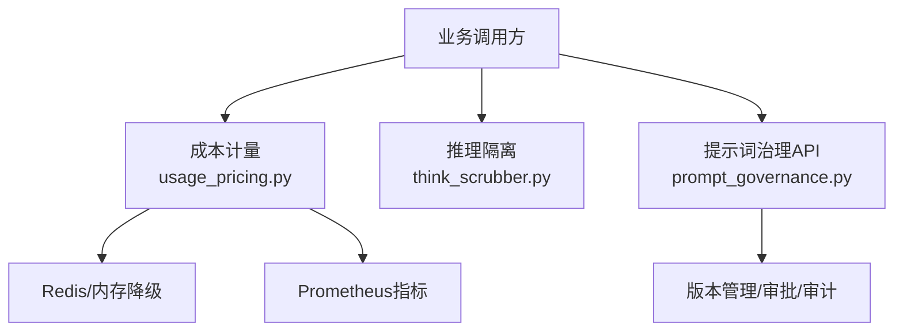
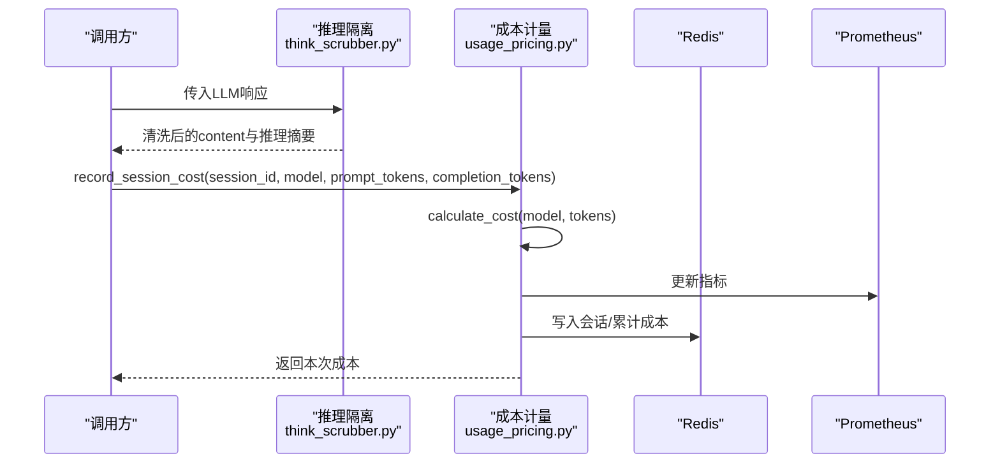
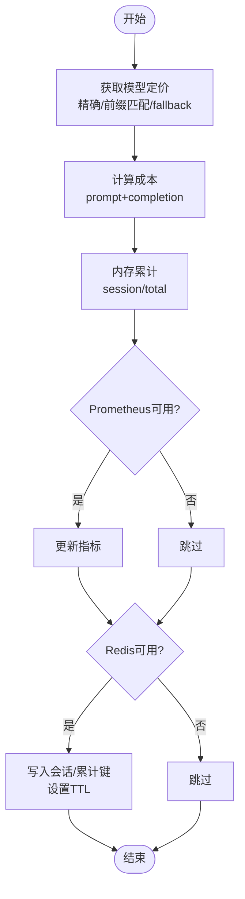
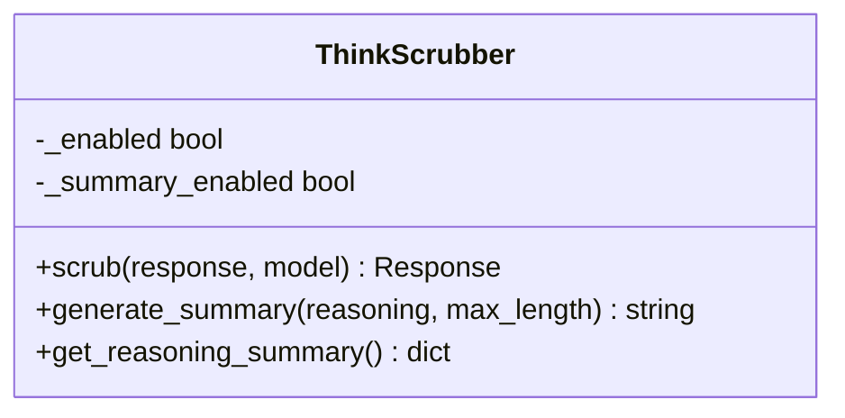
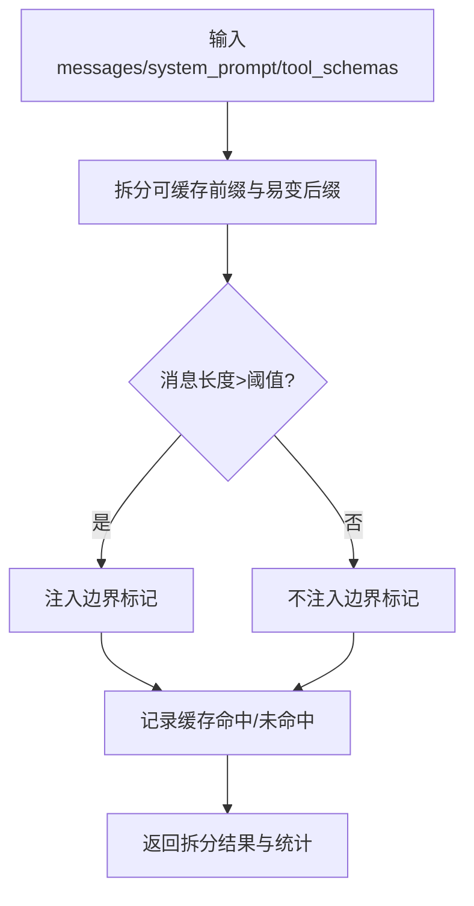
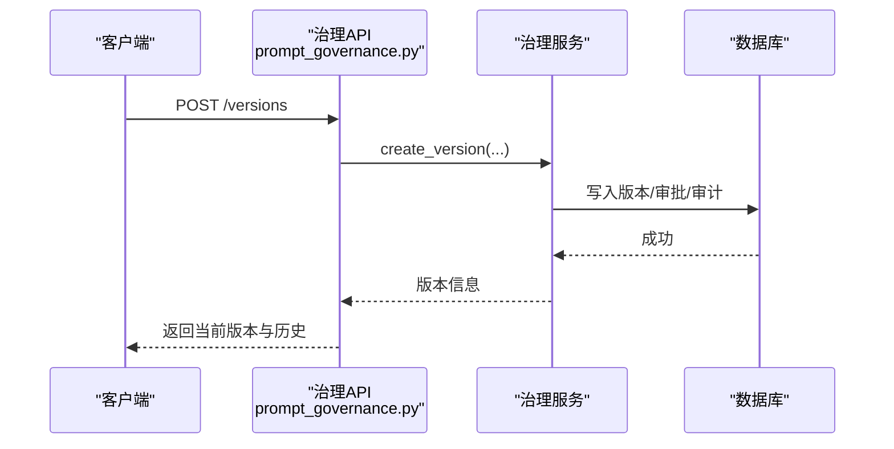
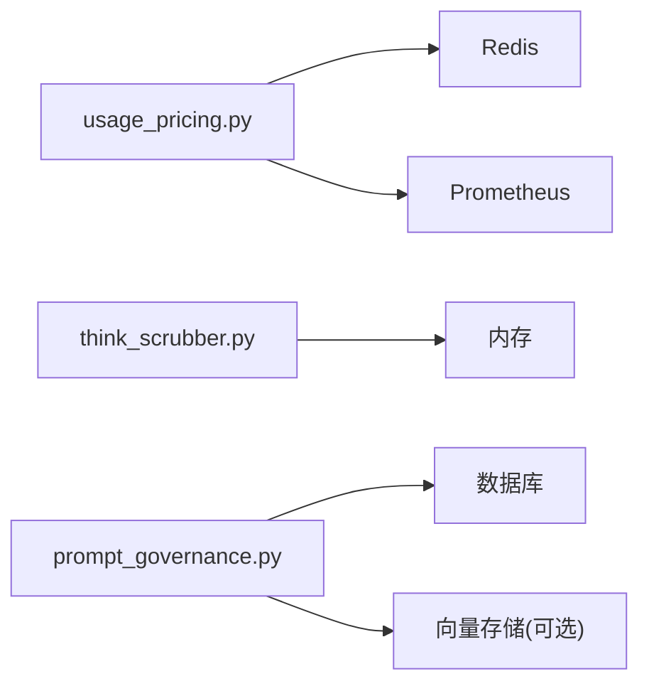

# Token成本计量与提示词缓存

<cite>
**本文引用的文件**
- [backend/services/ai_narrator/usage_pricing.py](file://backend/services/ai_narrator/usage_pricing.py)
- [backend/services/ai_narrator/think_scrubber.py](file://backend/services/ai_narrator/think_scrubber.py)
- [backend/tests/test_prompt_cache_token_cost_ag11.py](file://backend/tests/test_prompt_cache_token_cost_ag11.py)
- [backend/core/models/prompt_governance.py](file://backend/core/models/prompt_governance.py)
- [backend/routers/prompt_governance.py](file://backend/routers/prompt_governance.py)
</cite>

## 目录
1. [简介](#简介)
2. [项目结构](#项目结构)
3. [核心组件](#核心组件)
4. [架构总览](#架构总览)
5. [详细组件分析](#详细组件分析)
6. [依赖关系分析](#依赖关系分析)
7. [性能考量](#性能考量)
8. [故障排查指南](#故障排查指南)
9. [结论](#结论)
10. [附录](#附录)

## 简介
本文件聚焦于系统中的“Token成本计量”和“提示词缓存边界”两大能力，并补充“提示词治理”的配套机制。目标是在多模型、多会话、高并发场景下：
- 准确将 token 消耗折算为美元成本，支持按会话、工具、日期维度聚合；
- 通过提示词缓存边界管理，分离可缓存的前缀与易变后缀，降低重复调用成本；
- 隔离推理内容（reasoning_content），避免其混入最终输出或影响计费口径；
- 提供版本化、审批与审计的提示词治理能力，保障生产安全。

## 项目结构
围绕该主题的关键代码分布在以下位置：
- 成本计量：backend/services/ai_narrator/usage_pricing.py
- 推理内容隔离：backend/services/ai_narrator/think_scrubber.py
- 单元测试与集成验证：backend/tests/test_prompt_cache_token_cost_ag11.py
- 提示词治理数据模型：backend/core/models/prompt_governance.py
- 提示词治理 API：backend/routers/prompt_governance.py

图表来源
- [backend/services/ai_narrator/usage_pricing.py:129-281](file://backend/services/ai_narrator/usage_pricing.py#L129-L281)
- [backend/services/ai_narrator/think_scrubber.py:1-200](file://backend/services/ai_narrator/think_scrubber.py#L1-L200)
- [backend/routers/prompt_governance.py:88-323](file://backend/routers/prompt_governance.py#L88-L323)

章节来源
- [backend/services/ai_narrator/usage_pricing.py:1-281](file://backend/services/ai_narrator/usage_pricing.py#L1-L281)
- [backend/services/ai_narrator/think_scrubber.py:1-200](file://backend/services/ai_narrator/think_scrubber.py#L1-L200)
- [backend/routers/prompt_governance.py:1-323](file://backend/routers/prompt_governance.py#L1-L323)

## 核心组件
- 成本计量器（UsagePricingCalculator）
  - 维护主流模型的定价表，支持精确匹配与前缀匹配；
  - 计算单次调用的美元成本；
  - 记录会话成本，支持 Redis 持久化与 Prometheus 指标暴露；
  - 提供当日累计成本查询；
  - 异常安全：任何存储/指标异常均被吞掉，不阻塞业务热路径。
- 推理隔离器（ThinkScrubber）
  - 从 LLM 响应中抽取 reasoning_content，避免污染最终 content；
  - 对长文本生成摘要，便于统计与审计；
  - 统计推理 token 数量，辅助成本与质量分析。
- 提示词治理（版本、审批、审计）
  - 提供版本创建、历史查询、Dashboard 指标、Golden Dataset 回归、反馈收集、相似 Prompt 检索等能力；
  - 通过数据库模型记录审批状态、部署环境与操作日志，满足合规与回滚需求。

章节来源
- [backend/services/ai_narrator/usage_pricing.py:51-104](file://backend/services/ai_narrator/usage_pricing.py#L51-L104)
- [backend/services/ai_narrator/usage_pricing.py:129-281](file://backend/services/ai_narrator/usage_pricing.py#L129-L281)
- [backend/services/ai_narrator/think_scrubber.py:1-200](file://backend/services/ai_narrator/think_scrubber.py#L1-L200)
- [backend/core/models/prompt_governance.py:30-199](file://backend/core/models/prompt_governance.py#L30-L199)
- [backend/routers/prompt_governance.py:88-323](file://backend/routers/prompt_governance.py#L88-L323)

## 架构总览
系统以“调用方 → 成本计量 + 推理隔离 + 提示词治理”为主线，结合 Redis/Prometheus 进行观测与持久化。

图表来源
- [backend/services/ai_narrator/think_scrubber.py:1-200](file://backend/services/ai_narrator/think_scrubber.py#L1-L200)
- [backend/services/ai_narrator/usage_pricing.py:161-225](file://backend/services/ai_narrator/usage_pricing.py#L161-L225)

## 详细组件分析

### 成本计量器（UsagePricingCalculator）
- 设计要点
  - 模型定价表覆盖 OpenAI、DeepSeek、Anthropic 等多厂商模型，支持前缀匹配与默认 fallback；
  - 计算逻辑简单高效：按 1K tokens 计价，累加 prompt 与 completion 两部分；
  - 记录会话成本时，先走内存累计，再尝试写入 Redis 与 Prometheus；任一失败不影响主流程；
  - 提供 get_session_cost 与 get_total_cost 查询接口，支持 metric_source 标识数据来源。
- 复杂度
  - 计算成本 O(1)；
  - 记录成本 O(1) 内存 + 网络 I/O（Redis/Prometheus）；
  - 查询成本 O(1) 内存或 Redis 读取。
- 优化建议
  - 对高频模型可考虑本地缓存定价对象；
  - 批量写入 Redis 时使用 pipeline（已实现）；
  - 根据业务峰值调整 TTL 与采样频率。

图表来源
- [backend/services/ai_narrator/usage_pricing.py:149-225](file://backend/services/ai_narrator/usage_pricing.py#L149-L225)

章节来源
- [backend/services/ai_narrator/usage_pricing.py:51-104](file://backend/services/ai_narrator/usage_pricing.py#L51-L104)
- [backend/services/ai_narrator/usage_pricing.py:129-281](file://backend/services/ai_narrator/usage_pricing.py#L129-L281)

### 推理隔离器（ThinkScrubber）
- 设计要点
  - 从响应中提取 reasoning_content，确保最终 content 不被推理过程污染；
  - 对长推理文本生成摘要，便于审计与展示；
  - 统计推理 token 数量，用于后续分析与成本归因。
- 使用场景
  - 在 LLM 调用后、返回给上层之前执行 scrub；
  - 与成本计量配合，区分“有效输出 token”与“推理 token”。

图表来源
- [backend/services/ai_narrator/think_scrubber.py:1-200](file://backend/services/ai_narrator/think_scrubber.py#L1-L200)

章节来源
- [backend/services/ai_narrator/think_scrubber.py:1-200](file://backend/services/ai_narrator/think_scrubber.py#L1-L200)
- [backend/tests/test_prompt_cache_token_cost_ag11.py:224-313](file://backend/tests/test_prompt_cache_token_cost_ag11.py#L224-L313)

### 提示词缓存边界（PromptCacheBoundary）
- 设计要点
  - 将消息拆分为“可缓存前缀”与“易变后缀”，提高缓存命中率；
  - 注入边界标记（CACHE_BOUNDARY_MARKER）以明确分割点；
  - 记录缓存命中情况，支持会话级与全局命中率统计。
- 关键行为
  - 禁用时全部视为易变后缀；
  - 包含 system prompt 与 tool schemas 时可纳入可缓存前缀；
  - 长度阈值控制是否注入边界标记，避免短对话开销。

图表来源
- [backend/tests/test_prompt_cache_token_cost_ag11.py:113-221](file://backend/tests/test_prompt_cache_token_cost_ag11.py#L113-L221)

章节来源
- [backend/tests/test_prompt_cache_token_cost_ag11.py:113-221](file://backend/tests/test_prompt_cache_token_cost_ag11.py#L113-L221)

### 提示词治理（版本、审批、审计）
- 数据模型
  - 审批审计表记录版本变更、审批人、状态、质量快照、部署环境等；
  - 部署日志独立记录每次部署/回滚/热替换操作。
- API 能力
  - 创建版本、查询历史、Dashboard 指标、Golden Dataset 回归、反馈收集、相似 Prompt 检索、质量评估、A/B 优化建议等；
  - 启动时初始化治理服务，便于统一接入。

图表来源
- [backend/routers/prompt_governance.py:88-123](file://backend/routers/prompt_governance.py#L88-L123)
- [backend/core/models/prompt_governance.py:47-151](file://backend/core/models/prompt_governance.py#L47-L151)

章节来源
- [backend/core/models/prompt_governance.py:30-199](file://backend/core/models/prompt_governance.py#L30-L199)
- [backend/routers/prompt_governance.py:88-323](file://backend/routers/prompt_governance.py#L88-L323)

## 依赖关系分析
- 成本计量依赖
  - Redis：会话/累计成本持久化；
  - Prometheus：指标暴露；
  - 内存：降级累计，保证可用性。
- 推理隔离无外部依赖，纯内存处理。
- 提示词治理依赖
  - 数据库：审批与部署日志；
  - 可选向量存储：相似 Prompt 检索。

图表来源
- [backend/services/ai_narrator/usage_pricing.py:194-225](file://backend/services/ai_narrator/usage_pricing.py#L194-L225)
- [backend/routers/prompt_governance.py:219-239](file://backend/routers/prompt_governance.py#L219-L239)

章节来源
- [backend/services/ai_narrator/usage_pricing.py:194-225](file://backend/services/ai_narrator/usage_pricing.py#L194-L225)
- [backend/routers/prompt_governance.py:219-239](file://backend/routers/prompt_governance.py#L219-L239)

## 性能考量
- 成本计量
  - 计算为 O(1)，主要开销在 Redis/Prometheus I/O；
  - 使用 pipeline 批量写入，减少网络往返；
  - 异常安全设计确保热路径不受影响。
- 推理隔离
  - 纯内存操作，延迟极低；
  - 长文本摘要需控制最大长度，避免过大 payload。
- 提示词缓存边界
  - 合理设置阈值与策略，提升缓存命中率；
  - 避免频繁注入边界标记造成额外开销。
- 提示词治理
  - 数据库写入应异步化或批量化；
  - 向量检索可按需启用，避免冷启动压力。

[本节为通用指导，不直接分析具体文件]

## 故障排查指南
- 成本计量异常
  - 现象：Redis 写入失败或 Prometheus 指标未更新；
  - 排查：检查环境变量开关、Redis 连接、Prometheus 初始化；
  - 降级：确认内存累计仍生效，metric_source 字段可帮助定位来源。
- 推理隔离异常
  - 现象：reasoning_content 未正确提取或摘要为空；
  - 排查：确认 scrubber 启用标志、摘要开关与最大长度配置；
  - 验证：参考测试用例中的断言路径。
- 提示词治理异常
  - 现象：版本创建失败、审批状态不一致；
  - 排查：检查数据库表结构、API 请求参数、服务初始化流程；
  - 审计：通过部署日志与审批记录回溯操作链。

章节来源
- [backend/services/ai_narrator/usage_pricing.py:194-225](file://backend/services/ai_narrator/usage_pricing.py#L194-L225)
- [backend/tests/test_prompt_cache_token_cost_ag11.py:316-351](file://backend/tests/test_prompt_cache_token_cost_ag11.py#L316-L351)
- [backend/routers/prompt_governance.py:307-323](file://backend/routers/prompt_governance.py#L307-L323)

## 结论
本方案通过“成本计量 + 推理隔离 + 提示词缓存边界 + 提示词治理”的组合，实现了：
- 透明可控的 Token 成本核算，支持多维度聚合与观测；
- 安全的推理内容隔离，避免污染输出与误计；
- 高效的提示词缓存策略，降低重复调用成本；
- 完善的版本化与审计机制，保障生产稳定性与合规性。

[本节为总结，不直接分析具体文件]

## 附录
- 相关测试覆盖
  - 成本计量：已知/未知模型定价、会话成本记录、累计成本查询；
  - 缓存边界：拆分策略、边界标记注入、命中率统计；
  - 推理隔离：提取 reasoning_content、摘要生成、统计查询；
  - 集成流程：token 记录 → 成本计算 → 缓存管理 → 推理隔离。

章节来源
- [backend/tests/test_prompt_cache_token_cost_ag11.py:32-111](file://backend/tests/test_prompt_cache_token_cost_ag11.py#L32-L111)
- [backend/tests/test_prompt_cache_token_cost_ag11.py:113-221](file://backend/tests/test_prompt_cache_token_cost_ag11.py#L113-L221)
- [backend/tests/test_prompt_cache_token_cost_ag11.py:224-313](file://backend/tests/test_prompt_cache_token_cost_ag11.py#L224-L313)
- [backend/tests/test_prompt_cache_token_cost_ag11.py:316-351](file://backend/tests/test_prompt_cache_token_cost_ag11.py#L316-L351)