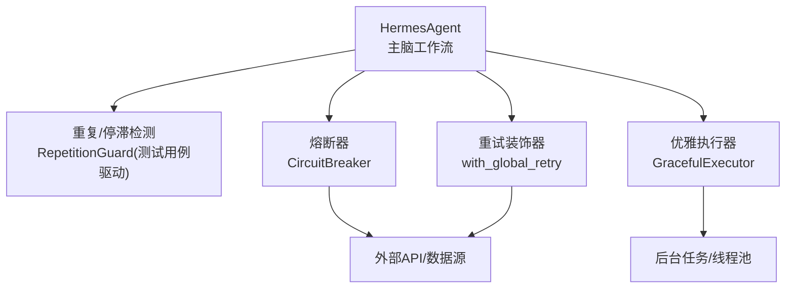
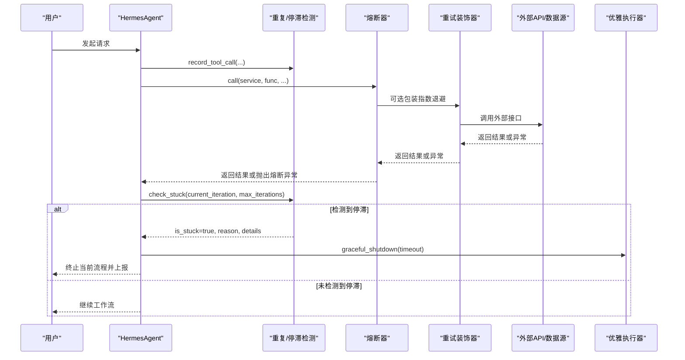
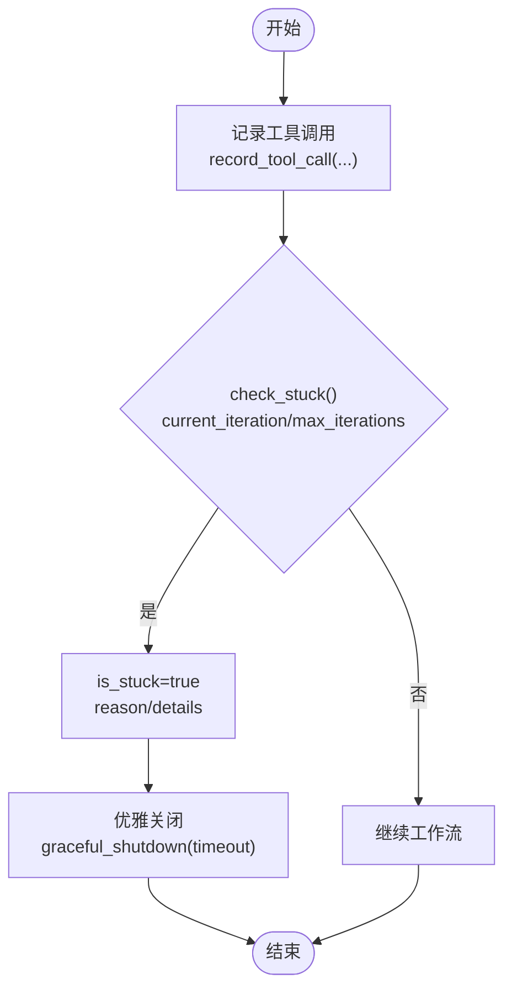
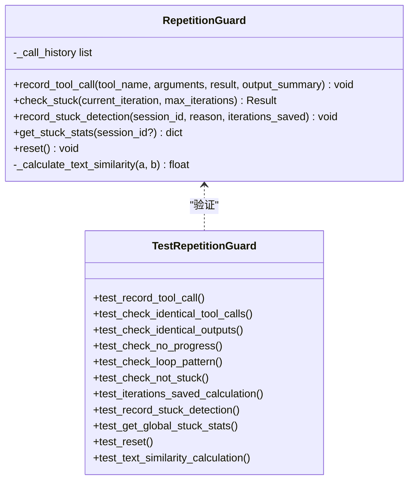
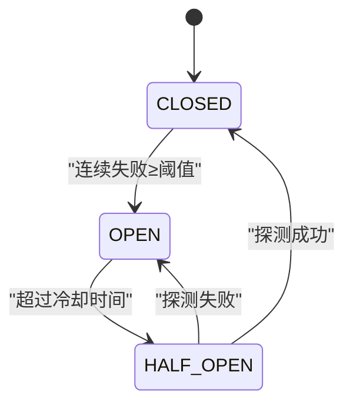
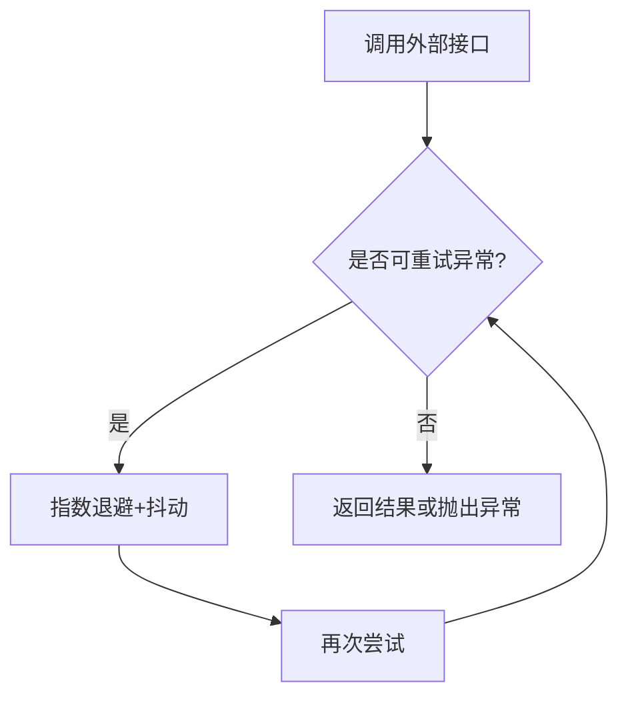
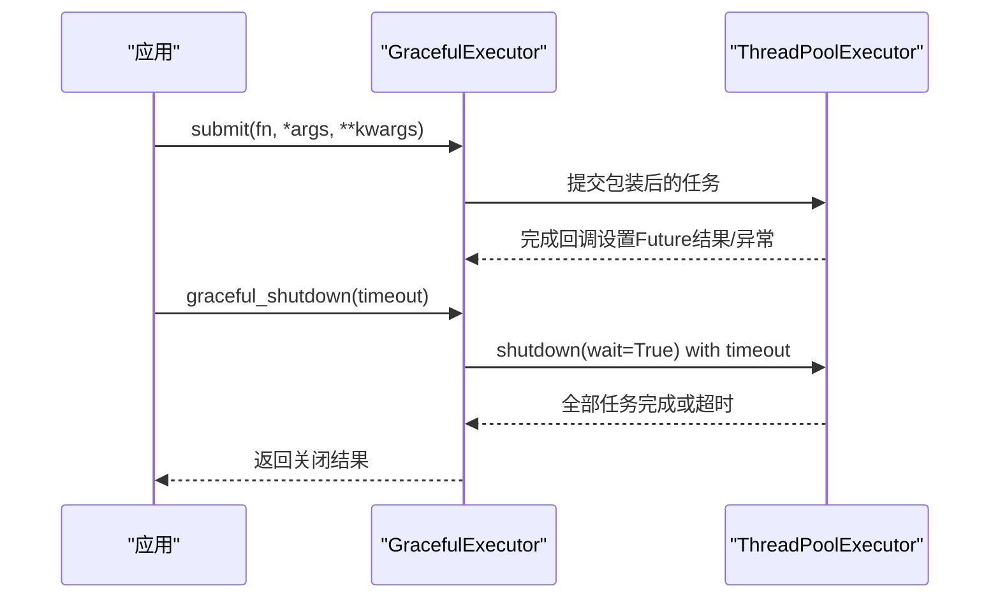
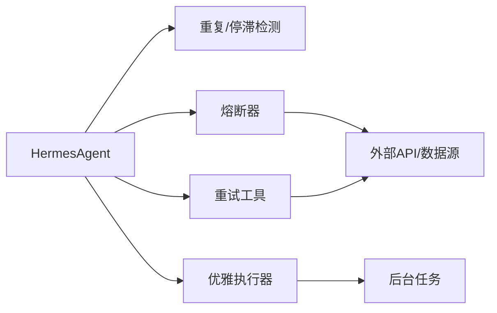

# 重复与卡住检测防护

<cite>
**本文引用的文件**
- [agent.py](file://hermes_agent/agent.py)
- [test_repetition_guard_ag12.py](file://backend/tests/test_repetition_guard_ag12.py)
- [circuit_breaker.py](file://backend/core/circuit_breaker.py)
- [retry_utils.py](file://backend/core/retry_utils.py)
- [graceful_executor.py](file://backend/core/graceful_executor.py)
</cite>

## 目录
1. [简介](#简介)
2. [项目结构](#项目结构)
3. [核心组件](#核心组件)
4. [架构总览](#架构总览)
5. [详细组件分析](#详细组件分析)
6. [依赖关系分析](#依赖关系分析)
7. [性能考量](#性能考量)
8. [故障排查指南](#故障排查指南)
9. [结论](#结论)
10. [附录](#附录)

## 简介
本文件聚焦于“重复与卡住检测防护”在系统中的设计与实现，覆盖以下目标：
- 防止智能体（Agent）陷入重复调用、死循环或无进展的停滞状态
- 提供熔断与重试机制，避免外部依赖异常导致的雪崩与资源耗尽
- 保障系统优雅关闭，确保任务完成与资源释放
- 通过可观测性指标与日志，支撑问题定位与容量规划

该能力由三部分组成：
- 重复与停滞检测：基于工具调用历史与输出摘要，识别同参数重复调用、相同输出、无进展与循环模式
- 熔断与重试：对外部 API 进行快速失败与退避重试，降低级联故障风险
- 优雅执行器：线程池封装，支持异步优雅关闭与超时控制

## 项目结构
围绕重复与卡住检测的关键代码分布在如下位置：
- Agent 主脑集成点：hermes_agent/agent.py
- 重复/停滞守卫单元测试：backend/tests/test_repetition_guard_ag12.py
- 熔断器实现：backend/core/circuit_breaker.py
- 重试工具：backend/core/retry_utils.py
- 优雅执行器：backend/core/graceful_executor.py

图表来源
- [agent.py:14-20](file://hermes_agent/agent.py#L14-L20)
- [circuit_breaker.py:64-218](file://backend/core/circuit_breaker.py#L64-L218)
- [retry_utils.py:50-57](file://backend/core/retry_utils.py#L50-L57)
- [graceful_executor.py:26-113](file://backend/core/graceful_executor.py#L26-L113)

章节来源
- [agent.py:14-20](file://hermes_agent/agent.py#L14-L20)
- [circuit_breaker.py:64-218](file://backend/core/circuit_breaker.py#L64-L218)
- [retry_utils.py:50-57](file://backend/core/retry_utils.py#L50-L57)
- [graceful_executor.py:26-113](file://backend/core/graceful_executor.py#L26-L113)

## 核心组件
- HermesAgent 主脑：负责 ReAct 循环、工具调度与上下文维护；集成重复/停滞检测、熔断与重试。
- 重复/停滞检测：以测试用例为验收依据，覆盖四类检测维度（同参数重复调用、相同输出、无进展、循环模式），并记录停滞事件与统计。
- 熔断器：按服务维度维护 CLOSED/OPEN/HALF_OPEN 状态机，支持限流错误过滤、手动记录成功/失败、状态快照。
- 重试工具：基于 tenacity 的指数退避+随机抖动，针对网络与限流类异常自动重试。
- 优雅执行器：对 ThreadPoolExecutor 的异步封装，支持提交任务、统计计数、优雅关闭与超时控制。

章节来源
- [agent.py:67-200](file://hermes_agent/agent.py#L67-L200)
- [test_repetition_guard_ag12.py:26-186](file://backend/tests/test_repetition_guard_ag12.py#L26-L186)
- [circuit_breaker.py:64-352](file://backend/core/circuit_breaker.py#L64-L352)
- [retry_utils.py:10-57](file://backend/core/retry_utils.py#L10-L57)
- [graceful_executor.py:26-204](file://backend/core/graceful_executor.py#L26-L204)

## 架构总览
下图展示了 Agent 在主循环中对工具调用的保护路径：每次工具调用前后，重复/停滞检测会记录并评估是否进入停滞；熔断器在外部 API 调用时快速失败与恢复；重试在可重试异常上自动退避；优雅执行器保证关闭阶段的任务完成。

图表来源
- [agent.py:219-396](file://hermes_agent/agent.py#L219-L396)
- [circuit_breaker.py:147-218](file://backend/core/circuit_breaker.py#L147-L218)
- [retry_utils.py:50-57](file://backend/core/retry_utils.py#L50-L57)
- [graceful_executor.py:114-165](file://backend/core/graceful_executor.py#L114-L165)

## 详细组件分析

### HermesAgent 主脑与重复/停滞检测集成
- 职责边界：构建 LLM 请求、工具选择、消息上下文管理；在工具调用后记录调用历史并检查停滞。
- 关键行为：
  - 记录工具调用：包含工具名、参数、结果与输出摘要
  - 检查停滞：传入当前迭代轮数与最大迭代轮数，判断是否触发停滞
  - 记录停滞事件：会话维度的统计与日期标记
- 收敛策略：通过 _MAX_REACT_ITERATIONS 限制最大迭代次数，结合重复/停滞检测提前终止无效循环

图表来源
- [agent.py:219-396](file://hermes_agent/agent.py#L219-L396)
- [graceful_executor.py:114-165](file://backend/core/graceful_executor.py#L114-L165)

章节来源
- [agent.py:67-200](file://hermes_agent/agent.py#L67-L200)
- [agent.py:219-396](file://hermes_agent/agent.py#L219-L396)

### 重复/停滞检测（测试用例驱动）
- 检测维度：
  - 同参数重复调用：连续多次调用相同工具与参数
  - 相同输出：不同工具但输出摘要一致
  - 无进展：连续多次返回相同结果（哈希一致）
  - 循环模式：A→B→A→B 等周期性调用序列
- 阈值与计算：
  - MAX_CONSECUTIVE_IDENTICAL_CALLS：触发 identical_tool_calls 的连续次数
  - MAX_CONSECUTIVE_NO_PROGRESS：触发 no_progress 的连续次数
  - iterations_saved：节省的迭代轮数 = max_iterations - current_iteration
- 事件记录：record_stuck_detection(session_id, reason, iterations_saved)，get_stuck_stats 查询统计

图表来源
- [test_repetition_guard_ag12.py:26-186](file://backend/tests/test_repetition_guard_ag12.py#L26-L186)

章节来源
- [test_repetition_guard_ag12.py:26-186](file://backend/tests/test_repetition_guard_ag12.py#L26-L186)

### 熔断器（Circuit Breaker）
- 状态机：CLOSED → OPEN（连续失败≥阈值）→ HALF_OPEN（超过冷却时间）→ CLOSED（探测成功）或 OPEN（探测失败）
- 关键方法：
  - call()/call_sync：包裹函数调用，处理状态切换与异常分类
  - guard：装饰器用法，自动为异步函数添加熔断保护
  - record_failure/record_success/reset：外部手动干预
  - status_snapshot：获取所有服务的熔断状态快照
- 限流错误过滤：is_rate_limit_error 钩子，支持 error_classifier 动态判定

图表来源
- [circuit_breaker.py:45-97](file://backend/core/circuit_breaker.py#L45-L97)
- [circuit_breaker.py:147-218](file://backend/core/circuit_breaker.py#L147-L218)

章节来源
- [circuit_breaker.py:64-352](file://backend/core/circuit_breaker.py#L64-L352)

### 重试工具（Retry Utils）
- 可重试异常判定：网络层异常、HTTP 状态码（403/429/5xx）、限流关键词匹配
- 退避策略：指数退避 + 随机抖动，最多尝试 3 次
- 使用方式：with_global_retry 装饰器，统一日志钩子

图表来源
- [retry_utils.py:10-57](file://backend/core/retry_utils.py#L10-L57)

章节来源
- [retry_utils.py:10-57](file://backend/core/retry_utils.py#L10-L57)

### 优雅执行器（Graceful Executor）
- 功能：将同步任务包装为异步 Future，支持统计计数与优雅关闭
- 关键特性：
  - submit：返回 asyncio.Future，内部更新 submitted/completed/active_tasks
  - graceful_shutdown：等待任务完成，支持超时控制
  - get_stats/stats：运行统计
- 适用场景：系统关闭阶段确保后台任务安全收尾

图表来源
- [graceful_executor.py:60-113](file://backend/core/graceful_executor.py#L60-L113)
- [graceful_executor.py:114-165](file://backend/core/graceful_executor.py#L114-L165)

章节来源
- [graceful_executor.py:26-204](file://backend/core/graceful_executor.py#L26-L204)

## 依赖关系分析
- Agent 依赖重复/停滞检测模块，用于在工具调用后评估是否停滞
- 熔断器与重试工具共同作用于外部 API 调用，形成“快速失败+退避重试”的保护链
- 优雅执行器作为底层线程池封装，被上层用于后台任务的统一管理

图表来源
- [agent.py:14-20](file://hermes_agent/agent.py#L14-L20)
- [circuit_breaker.py:64-218](file://backend/core/circuit_breaker.py#L64-L218)
- [retry_utils.py:50-57](file://backend/core/retry_utils.py#L50-L57)
- [graceful_executor.py:26-113](file://backend/core/graceful_executor.py#L26-L113)

章节来源
- [agent.py:14-20](file://hermes_agent/agent.py#L14-L20)
- [circuit_breaker.py:64-218](file://backend/core/circuit_breaker.py#L64-L218)
- [retry_utils.py:50-57](file://backend/core/retry_utils.py#L50-L57)
- [graceful_executor.py:26-113](file://backend/core/graceful_executor.py#L26-L113)

## 性能考量
- 重复/停滞检测：
  - 历史记录长度与窗口大小影响内存占用与检测灵敏度
  - 文本相似度计算复杂度与阈值需权衡准确率与延迟
- 熔断器：
  - 冷却时间与失败阈值决定响应速度与恢复速度
  - 限流错误过滤减少误判，提升吞吐
- 重试工具：
  - 指数退避与抖动降低拥塞时的冲突概率
  - 最大尝试次数与超时控制避免长尾阻塞
- 优雅执行器：
  - 线程池大小与关闭超时影响系统停机时间
  - 活跃任务监控有助于容量规划与告警

[本节为通用指导，不直接分析具体文件]

## 故障排查指南
- 重复/停滞检测异常：
  - 检查记录的工具调用历史是否完整（工具名、参数、结果、输出摘要）
  - 确认阈值配置（MAX_CONSECUTIVE_IDENTICAL_CALLS、MAX_CONSECUTIVE_NO_PROGRESS）与实际业务节奏匹配
  - 查看停滞事件记录与统计，定位频繁触发的 reason
- 熔断器频繁打开：
  - 检查外部 API 健康状态与限流策略
  - 调整冷却时间与失败阈值，观察状态转换日志
  - 使用 status_snapshot 获取各服务熔断状态
- 重试风暴：
  - 确认可重试异常判定逻辑是否过宽
  - 调整退避参数与最大尝试次数，避免雪崩
- 优雅关闭超时：
  - 检查后台任务耗时与数量，优化任务粒度
  - 调整 graceful_shutdown 超时时间，平衡停机时间与任务完成度

章节来源
- [test_repetition_guard_ag12.py:140-186](file://backend/tests/test_repetition_guard_ag12.py#L140-L186)
- [circuit_breaker.py:341-352](file://backend/core/circuit_breaker.py#L341-L352)
- [graceful_executor.py:114-165](file://backend/core/graceful_executor.py#L114-L165)

## 结论
通过“重复与停滞检测 + 熔断与重试 + 优雅执行器”的组合，系统在智能体工作流中实现了：
- 及时识别并中断无效循环与停滞，节省算力与时间
- 对外部依赖的快速失败与退避重试，降低级联故障风险
- 安全的系统关闭流程，确保任务完成与资源释放
建议在生产环境中持续监控相关指标与日志，结合业务特征微调阈值与策略，以获得更优的稳定性和性能表现。

[本节为总结性内容，不直接分析具体文件]

## 附录
- 术语说明：
  - 重复调用：同一工具与参数被连续多次调用
  - 停滞：工具调用无进展或陷入循环模式
  - 熔断：当外部依赖连续失败时快速失败，等待恢复
  - 重试：对可重试异常进行指数退避与抖动
  - 优雅关闭：在系统关闭阶段等待任务完成后再终止

[本节为概念性内容，不直接分析具体文件]
