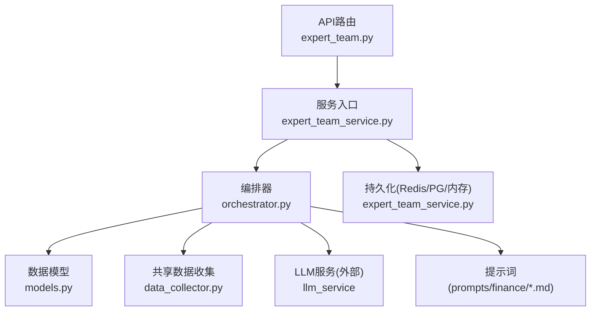
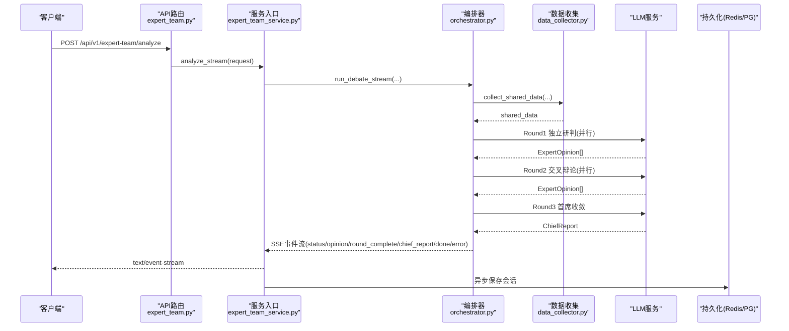
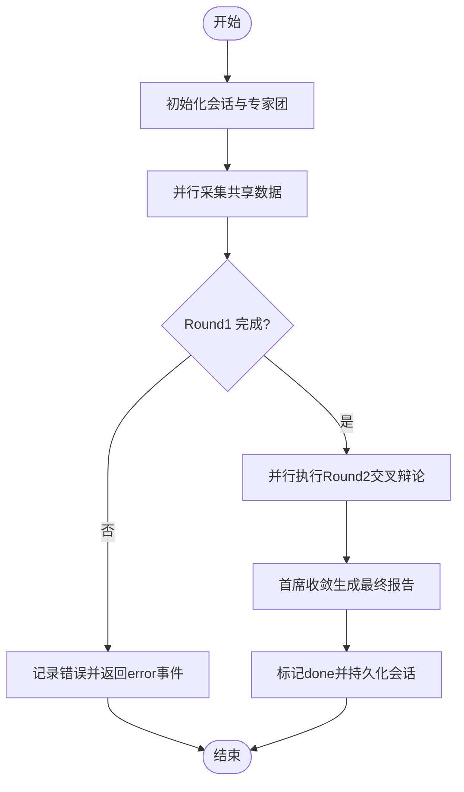
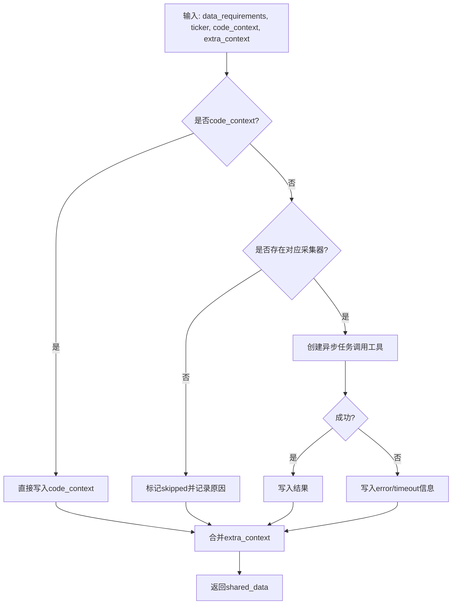
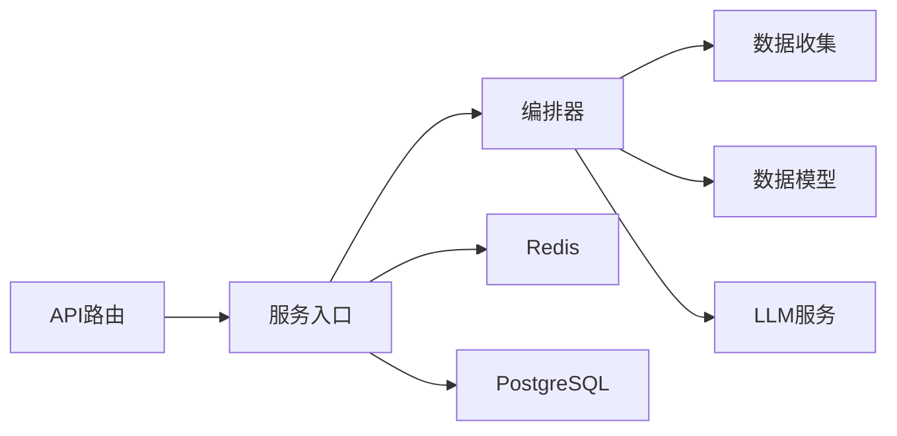

# 专家团队协作

<cite>
**本文引用的文件**
- [backend/routers/expert_team.py](file://backend/routers/expert_team.py)
- [backend/services/expert_team/expert_team_service.py](file://backend/services/expert_team/expert_team_service.py)
- [backend/services/expert_team/orchestrator.py](file://backend/services/expert_team/orchestrator.py)
- [backend/services/expert_team/models.py](file://backend/services/expert_team/models.py)
- [backend/services/expert_team/data_collector.py](file://backend/services/expert_team/data_collector.py)
- [backend/services/expert_team/prompts/finance/chief_investment_officer.md](file://backend/services/expert_team/prompts/finance/chief_investment_officer.md)
- [backend/services/expert_team/prompts/finance/risk.md](file://backend/services/expert_team/prompts/finance/risk.md)
- [backend/services/expert_team/prompts/finance/industry_analyst.md](file://backend/services/expert_team/prompts/finance/industry_analyst.md)
- [docs/21. 专家团多智能体协作系统.md](file://docs/21. 专家团多智能体协作系统.md)
</cite>

## 目录
1. [简介](#简介)
2. [项目结构](#项目结构)
3. [核心组件](#核心组件)
4. [架构总览](#架构总览)
5. [详细组件分析](#详细组件分析)
6. [依赖关系分析](#依赖关系分析)
7. [性能与扩展性](#性能与扩展性)
8. [故障处理与排障指南](#故障处理与排障指南)
9. [结论](#结论)
10. [附录：使用场景与配置](#附录使用场景与配置)

## 简介
本文件面向“专家团队协作系统”，聚焦多智能体协作架构、编排器工作机制、专家间通信协议、数据共享机制、决策协调算法，以及可扩展性与性能优化。系统通过“三轮混合协议”（独立研判→交叉辩论→首席收敛）实现高质量的多视角投研与策略评估，并以SSE流式输出实时进展与结果。

## 项目结构
专家团队子系统位于后端服务层，提供API路由、服务入口、编排引擎、数据模型、数据采集与提示词等模块。

图表来源
- [backend/routers/expert_team.py:48-77](file://backend/routers/expert_team.py#L48-L77)
- [backend/services/expert_team/expert_team_service.py:37-61](file://backend/services/expert_team/expert_team_service.py#L37-L61)
- [backend/services/expert_team/orchestrator.py:43-184](file://backend/services/expert_team/orchestrator.py#L43-L184)
- [backend/services/expert_team/data_collector.py:57-122](file://backend/services/expert_team/data_collector.py#L57-L122)
- [backend/services/expert_team/models.py:11-128](file://backend/services/expert_team/models.py#L11-L128)

章节来源
- [backend/routers/expert_team.py:1-104](file://backend/routers/expert_team.py#L1-L104)
- [backend/services/expert_team/expert_team_service.py:1-229](file://backend/services/expert_team/expert_team_service.py#L1-L229)
- [backend/services/expert_team/orchestrator.py:1-552](file://backend/services/expert_team/orchestrator.py#L1-L552)
- [backend/services/expert_team/models.py:1-128](file://backend/services/expert_team/models.py#L1-L128)
- [backend/services/expert_team/data_collector.py:1-192](file://backend/services/expert_team/data_collector.py#L1-L192)
- [docs/21. 专家团多智能体协作系统.md:1-225](file://docs/21. 专家团多智能体协作系统.md#L1-L225)

## 核心组件
- API路由：暴露SSE流式分析、场景模板列表、会话查询接口，并做轻量JWT鉴权。
- 服务入口：封装编排器调用、SSE事件转发与会话双层持久化（Redis热+PG冷）。
- 编排器：实现三轮混合协议的调度、超时控制、并行执行、冲突聚合与首席收敛。
- 数据模型：定义专家角色、观点、会话状态、场景模板、请求与SSE事件结构。
- 共享数据收集：按场景需求并行采集行情、基本面、技术面、宏观新闻、情绪等数据，统一注入prompt。
- 提示词：为各专家角色提供结构化思维框架与输出风格约束，确保一致性与可解释性。

章节来源
- [backend/routers/expert_team.py:22-104](file://backend/routers/expert_team.py#L22-L104)
- [backend/services/expert_team/expert_team_service.py:31-61](file://backend/services/expert_team/expert_team_service.py#L31-L61)
- [backend/services/expert_team/orchestrator.py:35-184](file://backend/services/expert_team/orchestrator.py#L35-L184)
- [backend/services/expert_team/models.py:11-128](file://backend/services/expert_team/models.py#L11-L128)
- [backend/services/expert_team/data_collector.py:14-122](file://backend/services/expert_team/data_collector.py#L14-L122)
- [backend/services/expert_team/prompts/finance/chief_investment_officer.md:1-26](file://backend/services/expert_team/prompts/finance/chief_investment_officer.md#L1-L26)
- [backend/services/expert_team/prompts/finance/risk.md:1-24](file://backend/services/expert_team/prompts/finance/risk.md#L1-L24)
- [backend/services/expert_team/prompts/finance/industry_analyst.md:1-24](file://backend/services/expert_team/prompts/finance/industry_analyst.md#L1-L24)

## 架构总览
专家团队协作系统采用“路由→服务→编排器→工具/LLM”的分层架构，结合SSE流式输出与双层持久化，保证高可用与可观测性。

图表来源
- [backend/routers/expert_team.py:48-77](file://backend/routers/expert_team.py#L48-L77)
- [backend/services/expert_team/expert_team_service.py:37-61](file://backend/services/expert_team/expert_team_service.py#L37-L61)
- [backend/services/expert_team/orchestrator.py:43-184](file://backend/services/expert_team/orchestrator.py#L43-L184)
- [backend/services/expert_team/data_collector.py:57-122](file://backend/services/expert_team/data_collector.py#L57-L122)

## 详细组件分析

### 编排器（Orchestrator）
- 职责：构建会话、实例化专家团、采集共享数据、执行三轮协议、流式输出事件、异常兜底与持久化钩子。
- 关键流程：
  - 阶段0：根据场景模板或自定义专家ID组建专家团队。
  - 阶段1：并行采集共享数据包，格式化后注入prompt。
  - 阶段2：Round1独立研判（并行），每个专家基于共享数据给出立场、置信度、依据与推理。
  - 阶段3：Round2交叉辩论（并行），专家看到自身Round1与其他专家摘要，进行质疑与修正。
  - 阶段4：首席收敛，综合全部辩论记录生成最终报告与概率评估。
- 超时与容错：单专家超时、整轮超时、异常捕获；失败专家以占位意见保留上下文。
- 流式输出：将专家观点切分为片段，逐段推送，提升前端渲染体验。

图表来源
- [backend/services/expert_team/orchestrator.py:43-184](file://backend/services/expert_team/orchestrator.py#L43-L184)
- [backend/services/expert_team/orchestrator.py:254-335](file://backend/services/expert_team/orchestrator.py#L254-L335)
- [backend/services/expert_team/orchestrator.py:339-456](file://backend/services/expert_team/orchestrator.py#L339-L456)
- [backend/services/expert_team/orchestrator.py:460-525](file://backend/services/expert_team/orchestrator.py#L460-L525)

章节来源
- [backend/services/expert_team/orchestrator.py:1-552](file://backend/services/expert_team/orchestrator.py#L1-L552)

### 数据模型（Models）
- ExpertRole：专家角色定义，包含领域、团队、提示词、偏差、可用工具集与描述。
- ExpertOpinion：单轮观点，含立场、置信度、依据、推理，以及Round2的质疑、置信度变化与修正观点。
- ChiefReport：首席报告，含共识区、分歧区、最强看多/看空论据、概率评估、建议、风险提示与完整报告。
- DebateSession：会话状态机，跟踪阶段、共享数据、专家阵容、各轮观点与最终报告。
- ScenarioTemplate：场景模板，预置专家组合与数据需求。
- AnalyzeRequest：API请求体，支持场景、问题、标的代码、代码上下文、轮数与自定义专家阵容。
- StreamEvent：SSE事件类型，包括状态、专家观点、轮次完成、首席报告、错误与完成。

章节来源
- [backend/services/expert_team/models.py:11-128](file://backend/services/expert_team/models.py#L11-L128)

### 共享数据收集（Data Collector）
- 功能：按场景的数据需求，通过ToolRegistry并行采集行情、基本面、技术指标、宏观新闻、市场情绪、市场复盘等数据；code_context直接从请求获取。
- 容错：单个工具采集超时或异常时记录状态与原因，不阻塞整体流程。
- 格式化：将共享数据拼接为prompt可读文本，限制长度避免超出上下文窗口。

图表来源
- [backend/services/expert_team/data_collector.py:57-122](file://backend/services/expert_team/data_collector.py#L57-L122)
- [backend/services/expert_team/data_collector.py:125-148](file://backend/services/expert_team/data_collector.py#L125-L148)
- [backend/services/expert_team/data_collector.py:151-192](file://backend/services/expert_team/data_collector.py#L151-L192)

章节来源
- [backend/services/expert_team/data_collector.py:1-192](file://backend/services/expert_team/data_collector.py#L1-L192)

### 服务入口与持久化（Service）
- 职责：封装编排器调用、SSE事件转发、会话双层持久化（Redis热+PG冷）、降级到内存。
- 持久化策略：
  - Redis热缓存：快速读取最近会话，设置TTL。
  - PG冷存储：异步upsert，保证历史可追溯。
  - 内存兜底：在Redis/PG不可用时仍可在本地运行。
- 会话查询：SCAN键空间获取列表，按创建时间排序并转换为摘要。

章节来源
- [backend/services/expert_team/expert_team_service.py:31-229](file://backend/services/expert_team/expert_team_service.py#L31-L229)

### 专家角色与提示词（Prompts）
- 首席投资官（CIO）：强调资产配置、战略方向、投委会决策框架、长期复利与能力圈边界，输出明确决策与仓位建议。
- 风控官：天然偏空，关注尾部风险、流动性、集中度、信用与操作风险，量化最大回撤与止损建议。
- 行业分析师：聚焦行业格局、市场空间、产业链地位、生命周期与政策环境，区分周期性与结构性因素。

章节来源
- [backend/services/expert_team/prompts/finance/chief_investment_officer.md:1-26](file://backend/services/expert_team/prompts/finance/chief_investment_officer.md#L1-L26)
- [backend/services/expert_team/prompts/finance/risk.md:1-24](file://backend/services/expert_team/prompts/finance/risk.md#L1-L24)
- [backend/services/expert_team/prompts/finance/industry_analyst.md:1-24](file://backend/services/expert_team/prompts/finance/industry_analyst.md#L1-L24)

## 依赖关系分析
- 路由依赖服务入口，服务入口依赖编排器与数据模型。
- 编排器依赖数据收集器与LLM服务，并通过数据模型组织状态与事件。
- 服务入口依赖Redis与PostgreSQL进行会话持久化。
- 提示词作为专家角色的系统提示，影响LLM输出质量与一致性。

图表来源
- [backend/routers/expert_team.py:48-77](file://backend/routers/expert_team.py#L48-L77)
- [backend/services/expert_team/expert_team_service.py:37-61](file://backend/services/expert_team/expert_team_service.py#L37-L61)
- [backend/services/expert_team/orchestrator.py:43-184](file://backend/services/expert_team/orchestrator.py#L43-L184)
- [backend/services/expert_team/data_collector.py:57-122](file://backend/services/expert_team/data_collector.py#L57-L122)

章节来源
- [backend/routers/expert_team.py:1-104](file://backend/routers/expert_team.py#L1-L104)
- [backend/services/expert_team/expert_team_service.py:1-229](file://backend/services/expert_team/expert_team_service.py#L1-L229)
- [backend/services/expert_team/orchestrator.py:1-552](file://backend/services/expert_team/orchestrator.py#L1-L552)
- [backend/services/expert_team/data_collector.py:1-192](file://backend/services/expert_team/data_collector.py#L1-L192)

## 性能与扩展性
- 并发与超时：
  - Round1/Round2并行调用专家，整轮超时保护避免全局阻塞。
  - 单专家超时与工具采集超时分别控制，失败不影响其他专家。
- 流式输出：
  - 专家观点按句子/段落切分，逐片推送，降低首字节延迟。
- 数据共享：
  - 一次采集全员复用，减少重复外部API调用。
- 持久化：
  - Redis热缓存+PG冷存储+内存兜底，兼顾速度与可靠性。
- 扩展性：
  - 新增专家角色：注册到场景模板与提示词目录，无需改动核心流程。
  - 自定义专家阵容：API支持expert_ids覆盖默认阵容。
  - 提示词定制：按领域与团队维护prompts，便于A/B测试与调优。

章节来源
- [backend/services/expert_team/orchestrator.py:30-33](file://backend/services/expert_team/orchestrator.py#L30-L33)
- [backend/services/expert_team/orchestrator.py:254-335](file://backend/services/expert_team/orchestrator.py#L254-L335)
- [backend/services/expert_team/orchestrator.py:339-456](file://backend/services/expert_team/orchestrator.py#L339-L456)
- [backend/services/expert_team/data_collector.py:57-122](file://backend/services/expert_team/data_collector.py#L57-L122)
- [backend/services/expert_team/expert_team_service.py:67-145](file://backend/services/expert_team/expert_team_service.py#L67-L145)
- [docs/21. 专家团多智能体协作系统.md:62-100](file://docs/21. 专家团多智能体协作系统.md#L62-L100)

## 故障处理与排障指南
- 常见异常：
  - LLM调用超时：记录日志并跳过该专家，继续后续流程。
  - 工具采集失败：记录错误/超时状态，不影响其他数据项。
  - 持久化失败：降级到内存，保证本地可用性。
- 排查步骤：
  - 检查SSE事件中的error类型与message。
  - 查看日志中“⚠️ [Orchestrator]”与“⚠️ [DataCollector]”警告。
  - 验证Redis/PG连接与权限，必要时启用内存模式。
- 恢复策略：
  - 调整超时阈值与温度参数，平衡质量与稳定性。
  - 缩小共享数据规模，避免上下文溢出。
  - 针对失败工具增加重试或替代数据源。

章节来源
- [backend/services/expert_team/orchestrator.py:174-184](file://backend/services/expert_team/orchestrator.py#L174-L184)
- [backend/services/expert_team/orchestrator.py:264-288](file://backend/services/expert_team/orchestrator.py#L264-L288)
- [backend/services/expert_team/orchestrator.py:350-374](file://backend/services/expert_team/orchestrator.py#L350-L374)
- [backend/services/expert_team/data_collector.py:125-148](file://backend/services/expert_team/data_collector.py#L125-L148)
- [backend/services/expert_team/expert_team_service.py:147-195](file://backend/services/expert_team/expert_team_service.py#L147-L195)

## 结论
专家团队协作系统通过三轮混合协议实现了高质量的多视角投研与策略评估。其分层架构、并行调度、流式输出与双层持久化确保了系统的可扩展性与鲁棒性。通过提示词工程与场景模板，系统可灵活适配金融、代码与策略等多领域需求。

## 附录：使用场景与配置
- 使用场景：
  - 深度研究：金融投研场景，快速多维研判。
  - 策略评估：完整投决会模拟，全链路评估。
  - 交易决策：聚焦执行层的择时与仓位管理。
  - 代码审查：多视角代码评审。
- API示例：
  - POST /api/v1/expert-team/analyze：发起SSE流式分析。
  - GET /api/v1/expert-team/scenarios：获取场景模板列表。
  - GET /api/v1/expert-team/sessions：历史会话列表。
  - GET /api/v1/expert-team/sessions/{id}：完整辩论记录。
- 配置要点：
  - rounds：控制辩论轮数（1=仅独立研判；2=交叉辩论；3-4=多轮深化）。
  - expert_ids：自定义专家阵容，覆盖场景默认。
  - ticker/code_context：指定金融标的或代码上下文。
  - 提示词：按领域维护prompts，持续优化输出质量。

章节来源
- [backend/routers/expert_team.py:48-104](file://backend/routers/expert_team.py#L48-L104)
- [backend/services/expert_team/models.py:71-96](file://backend/services/expert_team/models.py#L71-L96)
- [docs/21. 专家团多智能体协作系统.md:62-121](file://docs/21. 专家团多智能体协作系统.md#L62-L121)