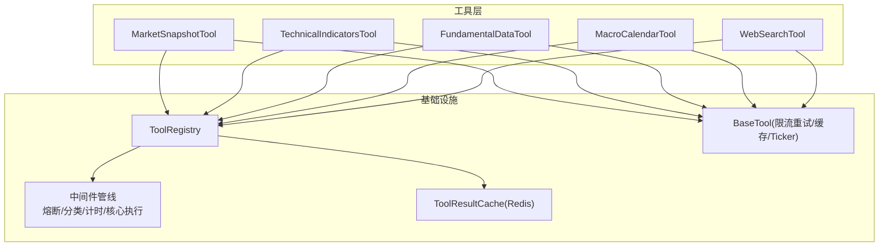
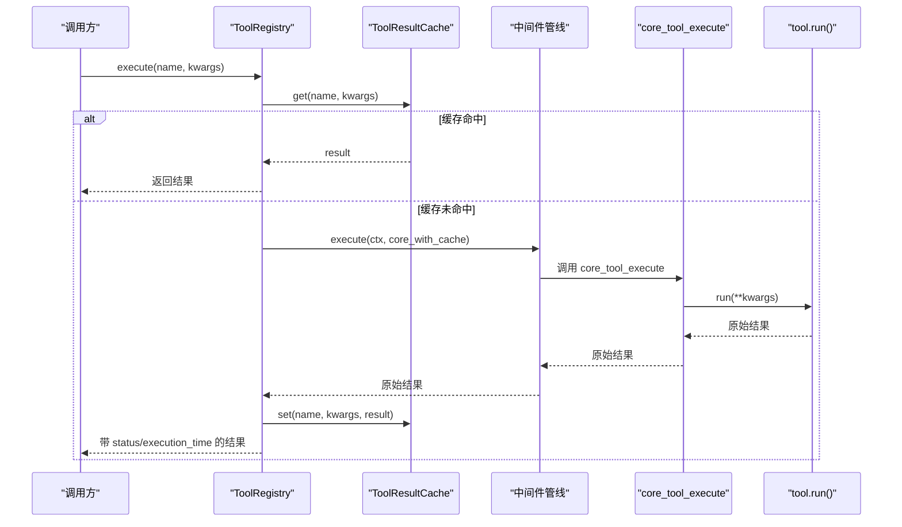
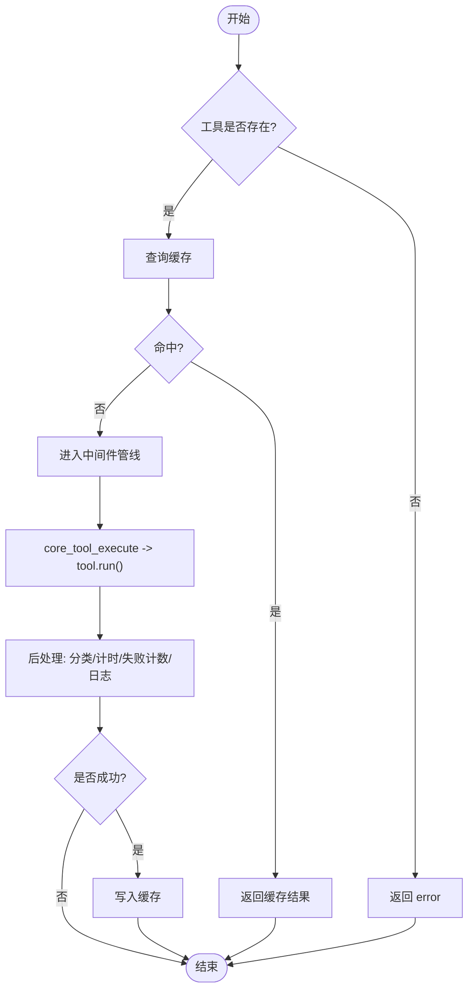
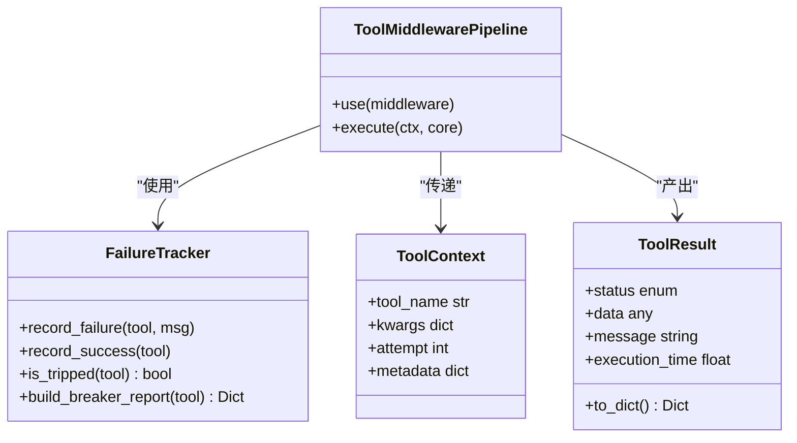
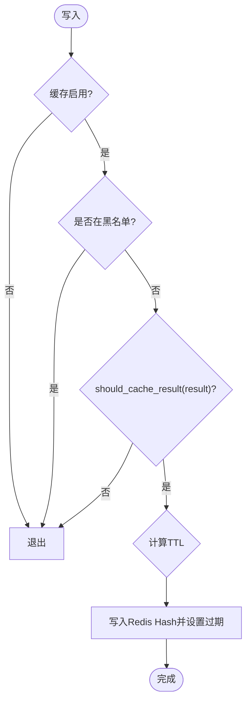
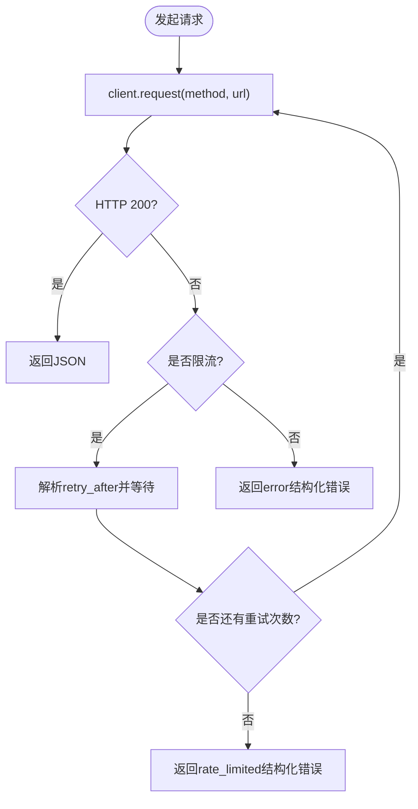
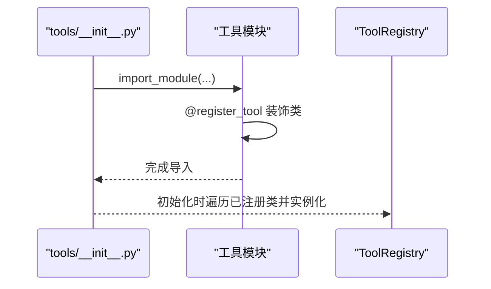
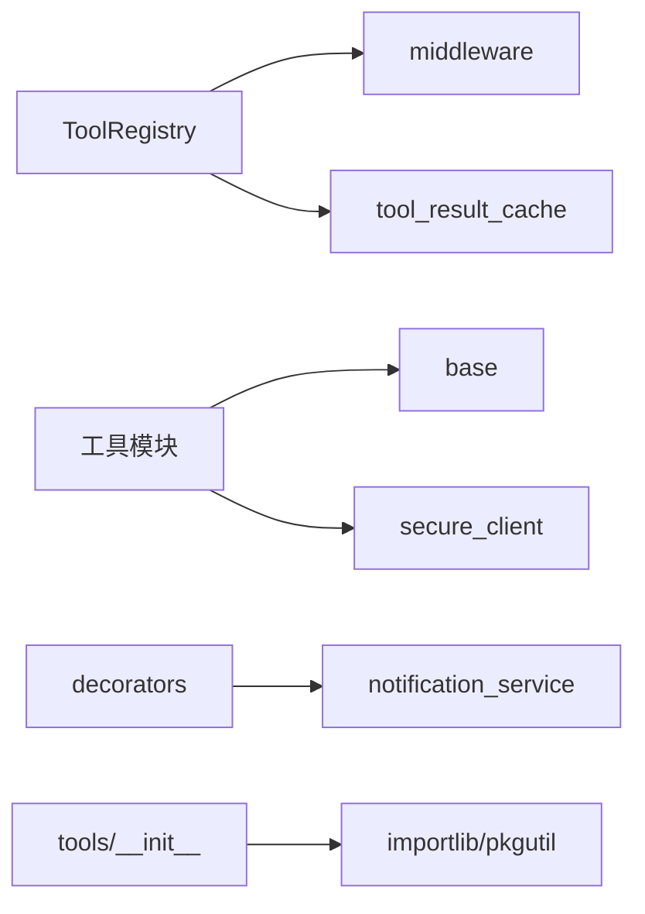

# 工具链集成系统

<cite>
**本文引用的文件**
- [tool_registry.py](file://hermes_agent/tool_registry.py)
- [middleware.py](file://hermes_agent/middleware.py)
- [tool_result_cache.py](file://hermes_agent/tool_result_cache.py)
- [base.py](file://hermes_agent/tools/base.py)
- [decorators.py](file://hermes_agent/tools/decorators.py)
- [__init__.py](file://hermes_agent/tools/__init__.py)
- [market_snapshot_tool.py](file://hermes_agent/tools/market_snapshot_tool.py)
- [technical_indicators_tool.py](file://hermes_agent/tools/technical_indicators_tool.py)
- [fundamental_data_tool.py](file://hermes_agent/tools/fundamental_data_tool.py)
- [macro_calendar_tool.py](file://hermes_agent/tools/macro_calendar_tool.py)
- [web_search_tool.py](file://hermes_agent/tools/web_search_tool.py)
</cite>

## 目录
1. [简介](#简介)
2. [项目结构](#项目结构)
3. [核心组件](#核心组件)
4. [架构总览](#架构总览)
5. [详细组件分析](#详细组件分析)
6. [依赖关系分析](#依赖关系分析)
7. [性能与扩展性](#性能与扩展性)
8. [故障排查指南](#故障排查指南)
9. [结论](#结论)
10. [附录：开发规范与示例](#附录：开发规范与示例)

## 简介
本文件系统性地梳理并文档化“工具链集成系统”的设计与实现，重点覆盖以下方面：
- 工具注册机制 ToolRegistry 的设计原理：动态发现、参数 Schema 暴露、执行调度。
- 工具装饰器 @register_tool 的使用方法与自定义工具开发规范。
- 工具执行的异步处理机制、错误处理与结果缓存策略（Redis Hash）。
- 金融数据工具的集成示例：市场快照、基本面、技术指标、宏观日历、网络搜索等。
- 扩展性设计：新工具注册流程、权限控制（基于场景 scopes）、版本管理（通过后端 API 版本与环境变量）。
- 调试与监控最佳实践：中间件管线、熔断器、限流退避、指标与日志。

## 项目结构
工具链位于 hermes_agent 包内，围绕“工具注册—中间件管线—缓存—具体工具”分层组织：
- 注册与调度：ToolRegistry 负责工具注册、Schema 生成、统一执行入口。
- 中间件管线：circuit_breaker、result_classifier、execution_timer、core_execute。
- 缓存：ToolResultCache 提供 Redis Hash 级别的工具调用结果缓存。
- 基础能力：BaseTool 提供限流感知重试、双级缓存、Ticker 标准化等通用能力。
- 装饰器：@register_tool 自动扫描并注册工具；@with_agent_self_correction 提供自我纠错重试。
- 工具集合：各领域工具以独立模块存在，遵循统一接口 run(...) 返回结构化结果。

图表来源
- [tool_registry.py:66-251](file://hermes_agent/tool_registry.py#L66-L251)
- [middleware.py:142-426](file://hermes_agent/middleware.py#L142-L426)
- [tool_result_cache.py:107-195](file://hermes_agent/tool_result_cache.py#L107-L195)
- [base.py:21-282](file://hermes_agent/tools/base.py#L21-L282)

章节来源
- [tool_registry.py:66-251](file://hermes_agent/tool_registry.py#L66-L251)
- [middleware.py:142-426](file://hermes_agent/middleware.py#L142-L426)
- [tool_result_cache.py:107-195](file://hermes_agent/tool_result_cache.py#L107-L195)
- [base.py:21-282](file://hermes_agent/tools/base.py#L21-L282)

## 核心组件
- ToolRegistry：集中注册工具、生成 OpenAI function-calling 风格的 Schema、统一执行入口 execute()，内置失败追踪与中间件管线，并在执行前后进行缓存命中/写入与正交状态分类。
- 中间件管线：按顺序执行熔断检查、结果分类、耗时统计，最终调用 core_tool_execute 执行 tool.run()。
- ToolResultCache：基于 Redis Hash 的工具结果缓存，支持按工具名配置 TTL、显式跳过缓存、命中/未命中统计。
- BaseTool：提供限流感知智能重试、双级缓存（进程内存 + Redis）、Ticker 标准化、后端 API URL 构建等通用能力。
- 装饰器：@register_tool 自动将工具类加入全局注册表；@with_agent_self_correction 对下游校验失败进行自我纠错重试。

章节来源
- [tool_registry.py:45-85](file://hermes_agent/tool_registry.py#L45-L85)
- [middleware.py:194-426](file://hermes_agent/middleware.py#L194-L426)
- [tool_result_cache.py:20-195](file://hermes_agent/tool_result_cache.py#L20-L195)
- [base.py:10-282](file://hermes_agent/tools/base.py#L10-L282)
- [decorators.py:15-64](file://hermes_agent/tools/decorators.py#L15-L64)

## 架构总览
工具执行的主流程如下：
1) 客户端调用 ToolRegistry.execute(name, **kwargs)。
2) 先查询 ToolResultCache，命中则直接返回。
3) 构造 ToolContext，进入中间件管线：
   - 熔断器：若连续失败达到阈值，短路返回 circuit_breaker。
   - 结果分类：将原始返回值映射为正交状态（success/empty/stale/rate_limited/error/circuit_breaker）。
   - 计时：记录执行耗时。
   - 核心执行：调用 tool.run(**kwargs)。
4) 后处理：根据状态决定是否写入缓存，补充 execution_time，更新失败计数，输出日志。

图表来源
- [tool_registry.py:183-251](file://hermes_agent/tool_registry.py#L183-L251)
- [middleware.py:398-426](file://hermes_agent/middleware.py#L398-L426)
- [tool_result_cache.py:122-187](file://hermes_agent/tool_result_cache.py#L122-L187)

## 详细组件分析

### ToolRegistry：注册、Schema 与执行调度
- 动态发现：通过导入 hermes_agent.tools 触发所有工具模块的 @register_tool，自动收集到全局列表并在初始化时实例化注册。
- Schema 暴露：get_schemas_by_scopes(scopes) 可按场景过滤工具，生成 OpenAI function-calling 风格 schema，便于 LLM 选择合适工具。
- 执行调度：execute() 统一入口，包含缓存前置、中间件管线、后处理（分类、计时、失败计数、日志）。
- 限流保护：内部使用 AsyncTokenBucket 限制并发请求速率（默认容量 3，填充率 1/s），避免瞬时过载。

图表来源
- [tool_registry.py:45-85](file://hermes_agent/tool_registry.py#L45-L85)
- [tool_registry.py:183-251](file://hermes_agent/tool_registry.py#L183-L251)

章节来源
- [tool_registry.py:45-85](file://hermes_agent/tool_registry.py#L45-L85)
- [tool_registry.py:183-251](file://hermes_agent/tool_registry.py#L183-L251)

### 中间件管线：熔断、分类、计时与核心执行
- 熔断器：FailureTracker 维护每工具连续失败计数，达到阈值后短路返回 circuit_breaker，并附带原因与建议。
- 结果分类：classify_raw_result 将原始返回值映射为正交状态，限流不计入失败计数。
- 计时：execution_timer 中间件在 post 阶段记录耗时。
- 核心执行：core_tool_execute 调用 tool.run()，异常时脱敏并返回结构化错误。

图表来源
- [middleware.py:142-186](file://hermes_agent/middleware.py#L142-L186)
- [middleware.py:194-268](file://hermes_agent/middleware.py#L194-L268)
- [middleware.py:303-379](file://hermes_agent/middleware.py#L303-L379)
- [middleware.py:398-426](file://hermes_agent/middleware.py#L398-L426)

章节来源
- [middleware.py:142-186](file://hermes_agent/middleware.py#L142-L186)
- [middleware.py:194-268](file://hermes_agent/middleware.py#L194-L268)
- [middleware.py:303-379](file://hermes_agent/middleware.py#L303-L379)
- [middleware.py:398-426](file://hermes_agent/middleware.py#L398-L426)

### 工具结果缓存：Redis Hash 与 TTL 策略
- 键空间：tool:cache:{tool_name}:{args_hash}，字段包括 result、cached_at、status、tool。
- 命中判定：tool_cache_enabled() 开关、no_cache_tools() 黑名单、should_cache_result() 过滤错误/限流/空结果/显式 skip_cache。
- TTL 策略：环境变量 TOOL_CACHE_TTL_{NAME} > 内置表 _DEFAULT_TOOL_TTLS > 默认值 default_ttl_seconds()。
- 统计：hits/misses 用于观测缓存命中率。

图表来源
- [tool_result_cache.py:53-87](file://hermes_agent/tool_result_cache.py#L53-L87)
- [tool_result_cache.py:89-105](file://hermes_agent/tool_result_cache.py#L89-L105)
- [tool_result_cache.py:158-187](file://hermes_agent/tool_result_cache.py#L158-L187)

章节来源
- [tool_result_cache.py:53-87](file://hermes_agent/tool_result_cache.py#L53-L87)
- [tool_result_cache.py:89-105](file://hermes_agent/tool_result_cache.py#L89-L105)
- [tool_result_cache.py:158-187](file://hermes_agent/tool_result_cache.py#L158-L187)

### BaseTool：限流感知重试、双级缓存与 Ticker 标准化
- 限流感知重试：rate_limit_aware_request 检测 HTTP 429/503 或响应体中的 rate_limited 信号，解析 retry_after 并指数退避重试，耗尽后返回结构化限流错误。
- 双级缓存：get_cached_data/set_cached_data 优先读 L1 内存，再回落到 L2 Redis，写操作可持久化。
- Ticker 标准化：normalize_ticker 将自然语言代码转换为 Region.Code 格式，兼容 A/HK/US 及常见指数。

图表来源
- [base.py:97-190](file://hermes_agent/tools/base.py#L97-L190)
- [base.py:240-282](file://hermes_agent/tools/base.py#L240-L282)
- [base.py:30-87](file://hermes_agent/tools/base.py#L30-L87)

章节来源
- [base.py:30-87](file://hermes_agent/tools/base.py#L30-L87)
- [base.py:97-190](file://hermes_agent/tools/base.py#L97-L190)
- [base.py:240-282](file://hermes_agent/tools/base.py#L240-L282)

### 装饰器与自动发现
- @register_tool：为工具类注入 _tool_scopes（默认全量），并加入全局注册列表；在 ToolRegistry.__init__ 中统一实例化注册。
- @with_agent_self_correction：捕获 ToolCorrectionError，将错误信息注入 query 参数，触发 LLM 自我修正，最多重试指定次数，并通过通知服务推送前端。
- 自动发现：tools/__init__.py 使用 pkgutil 动态导入当前包下所有模块，配合 @register_tool 实现“零配置热插拔”。

图表来源
- [__init__.py:1-16](file://hermes_agent/tools/__init__.py#L1-L16)
- [tool_registry.py:45-85](file://hermes_agent/tool_registry.py#L45-L85)
- [decorators.py:15-64](file://hermes_agent/tools/decorators.py#L15-L64)

章节来源
- [__init__.py:1-16](file://hermes_agent/tools/__init__.py#L1-L16)
- [tool_registry.py:45-85](file://hermes_agent/tool_registry.py#L45-L85)
- [decorators.py:15-64](file://hermes_agent/tools/decorators.py#L15-L64)

### 金融数据工具集成示例
- 市场快照 MarketSnapshotTool：批量获取实时快照，派生平均涨跌幅与涨跌家数，适合自选股墙与板块监控。
- 技术指标 TechnicalIndicatorsTool：拉取历史 K 线并计算 MA/RSI/MACD/KDJ/ATR/布林带等，输出趋势评分与止盈止损建议。
- 基本面 FundamentalDataTool：获取 PE/PB/ROE、筹码博弈等核心指标，支持多源合并端点与旧端点降级。
- 宏观日历 MacroCalendarTool：获取高影响宏观事件，限制天数范围，防止上下文膨胀。
- 网络搜索 WebSearchTool：DuckDuckGo 搜索，支持域名白名单/黑名单，结合 BaseTool 缓存减少重复请求。

章节来源
- [market_snapshot_tool.py:9-46](file://hermes_agent/tools/market_snapshot_tool.py#L9-L46)
- [technical_indicators_tool.py:11-86](file://hermes_agent/tools/technical_indicators_tool.py#L11-L86)
- [fundamental_data_tool.py:9-39](file://hermes_agent/tools/fundamental_data_tool.py#L9-L39)
- [macro_calendar_tool.py:9-39](file://hermes_agent/tools/macro_calendar_tool.py#L9-L39)
- [web_search_tool.py:9-85](file://hermes_agent/tools/web_search_tool.py#L9-L85)

## 依赖关系分析
- ToolRegistry 依赖 middleware（熔断、分类、计时、核心执行）与 tool_result_cache（结果缓存）。
- 工具模块依赖 base（限流重试、缓存、Ticker 标准化）与 secure_client（安全 HTTP 客户端）。
- 装饰器 decorators 依赖 notification_service 推送前端告警。
- 自动发现机制 tools/__init__.py 依赖 pkgutil/importlib 动态加载。

图表来源
- [tool_registry.py:1-15](file://hermes_agent/tool_registry.py#L1-L15)
- [middleware.py:1-19](file://hermes_agent/middleware.py#L1-L19)
- [tool_result_cache.py:1-18](file://hermes_agent/tool_result_cache.py#L1-L18)
- [base.py:1-8](file://hermes_agent/tools/base.py#L1-L8)
- [decorators.py:1-7](file://hermes_agent/tools/decorators.py#L1-L7)
- [__init__.py:1-16](file://hermes_agent/tools/__init__.py#L1-L16)

章节来源
- [tool_registry.py:1-15](file://hermes_agent/tool_registry.py#L1-L15)
- [middleware.py:1-19](file://hermes_agent/middleware.py#L1-L19)
- [tool_result_cache.py:1-18](file://hermes_agent/tool_result_cache.py#L1-L18)
- [base.py:1-8](file://hermes_agent/tools/base.py#L1-L8)
- [decorators.py:1-7](file://hermes_agent/tools/decorators.py#L1-L7)
- [__init__.py:1-16](file://hermes_agent/tools/__init__.py#L1-L16)

## 性能与扩展性
- 性能特性
  - 缓存命中优先：execute() 先查缓存，命中直接返回，降低后端压力。
  - 限流退避：BaseTool.rate_limit_aware_request 解析 retry_after 并指数退避，避免雪崩。
  - 中间件计时：execution_timer 精确记录每次工具执行耗时，便于定位瓶颈。
  - 熔断保护：FailureTracker 连续失败阈值触发熔断，快速失败保护系统。
- 扩展性设计
  - 新工具注册：新增工具模块，定义 name/description/parameters/async run(...)，使用 @register_tool 装饰即可被自动发现与注册。
  - 权限控制：通过 @register_tool(scopes=...) 限定工具所属场景，Schema 暴露时可按 scopes 过滤，减少 LLM 上下文。
  - 版本管理：后端 API 版本通过环境变量 API_URL_VERSION 控制，升级只需改环境变量；工具内部通过 get_backend_api_url() 拼接完整路径。
  - 缓存策略：按工具名配置 TTL，支持显式跳过缓存（skip_cache），避免错误/限流/空结果污染缓存。

章节来源
- [tool_registry.py:183-251](file://hermes_agent/tool_registry.py#L183-L251)
- [base.py:97-190](file://hermes_agent/tools/base.py#L97-L190)
- [middleware.py:381-390](file://hermes_agent/middleware.py#L381-L390)
- [tool_result_cache.py:53-87](file://hermes_agent/tool_result_cache.py#L53-L87)
- [base.py:10-18](file://hermes_agent/tools/base.py#L10-L18)

## 故障排查指南
- 常见问题定位
  - 工具未找到：execute() 返回 error，检查工具名是否正确、模块是否被导入。
  - 熔断触发：查看 FailureTracker 报告，确认连续失败原因（网络、鉴权、参数格式）。
  - 限流频繁：关注 rate_limited 状态，调整上游调用频率或优化重试策略。
  - 缓存不生效：检查 TOOL_CACHE_ENABLED、no_cache_tools、should_cache_result 条件。
- 调试与监控
  - 日志：execute() 打印执行状态与耗时；缓存命中/未命中有明确日志。
  - 指标：ToolResultCache.stats() 提供 hits/misses；可接入外部监控系统。
  - 通知：self_correction 装饰器通过 notification_service 推送前端，便于用户感知。

章节来源
- [tool_registry.py:192-251](file://hermes_agent/tool_registry.py#L192-L251)
- [middleware.py:271-300](file://hermes_agent/middleware.py#L271-L300)
- [tool_result_cache.py:189-195](file://hermes_agent/tool_result_cache.py#L189-L195)
- [decorators.py:47-59](file://hermes_agent/tools/decorators.py#L47-L59)

## 结论
本工具链集成系统通过“注册—中间件—缓存—工具”的分层架构，实现了高可用、可扩展、可观测的工具执行体系。ToolRegistry 提供统一的执行入口与 Schema 暴露；中间件管线保障熔断、分类与计时；ToolResultCache 提供高性能缓存；BaseTool 封装限流重试与通用能力。结合 @register_tool 与自动发现机制，新增工具无需额外配置即可接入。通过 scopes 实现权限控制，通过环境变量实现版本管理，满足金融数据工具集成的多样化需求。

## 附录：开发规范与示例
- 自定义工具开发规范
  - 继承 BaseTool，定义 name/description/parameters/async run(...)。
  - 使用 @register_tool(scopes=[...]) 标注工具场景。
  - 使用 SecureAsyncClient 访问后端 API，通过 rate_limit_aware_request 处理限流与重试。
  - 需要缓存时使用 BaseTool.get_cached_data/set_cached_data 或依赖 ToolResultCache。
  - 参数校验失败时返回 {"status":"error","message":"..."}，限流返回 {"status":"rate_limited",...}。
- 示例参考
  - 市场快照：[market_snapshot_tool.py:9-46](file://hermes_agent/tools/market_snapshot_tool.py#L9-L46)
  - 技术指标：[technical_indicators_tool.py:11-86](file://hermes_agent/tools/technical_indicators_tool.py#L11-L86)
  - 基本面：[fundamental_data_tool.py:9-39](file://hermes_agent/tools/fundamental_data_tool.py#L9-L39)
  - 宏观日历：[macro_calendar_tool.py:9-39](file://hermes_agent/tools/macro_calendar_tool.py#L9-L39)
  - 网络搜索：[web_search_tool.py:9-85](file://hermes_agent/tools/web_search_tool.py#L9-L85)

章节来源
- [market_snapshot_tool.py:9-46](file://hermes_agent/tools/market_snapshot_tool.py#L9-L46)
- [technical_indicators_tool.py:11-86](file://hermes_agent/tools/technical_indicators_tool.py#L11-L86)
- [fundamental_data_tool.py:9-39](file://hermes_agent/tools/fundamental_data_tool.py#L9-L39)
- [macro_calendar_tool.py:9-39](file://hermes_agent/tools/macro_calendar_tool.py#L9-L39)
- [web_search_tool.py:9-85](file://hermes_agent/tools/web_search_tool.py#L9-L85)