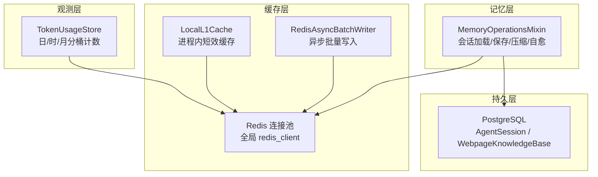
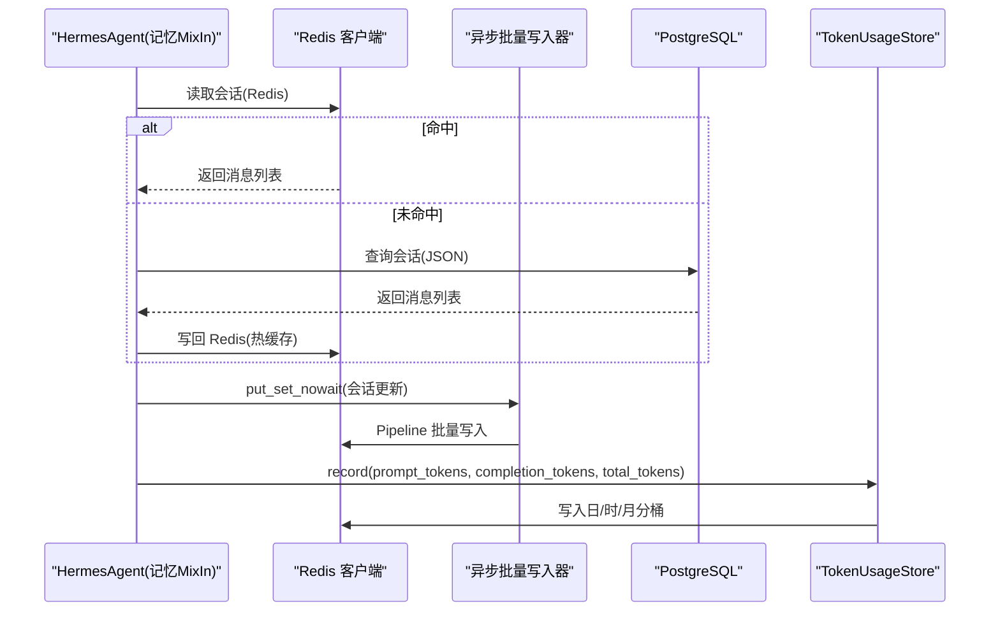
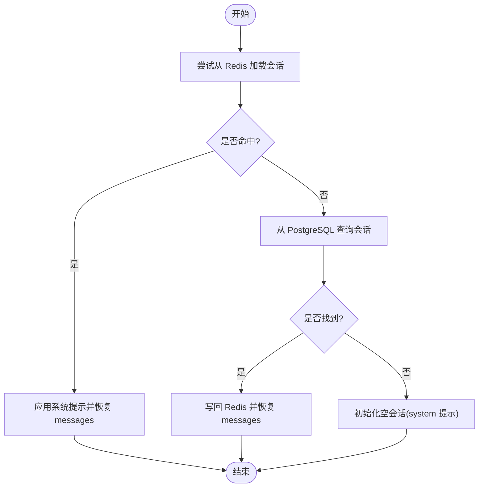
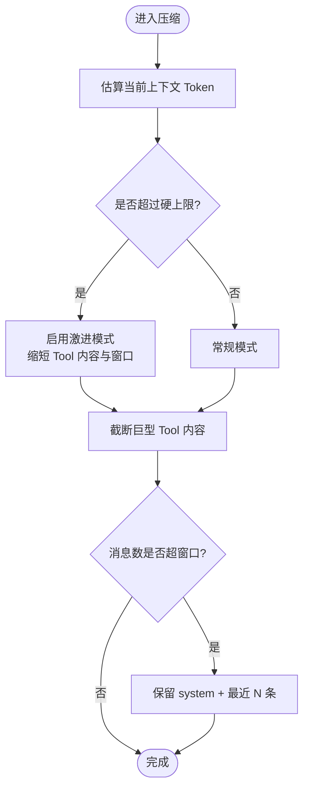
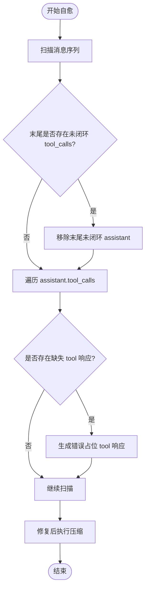
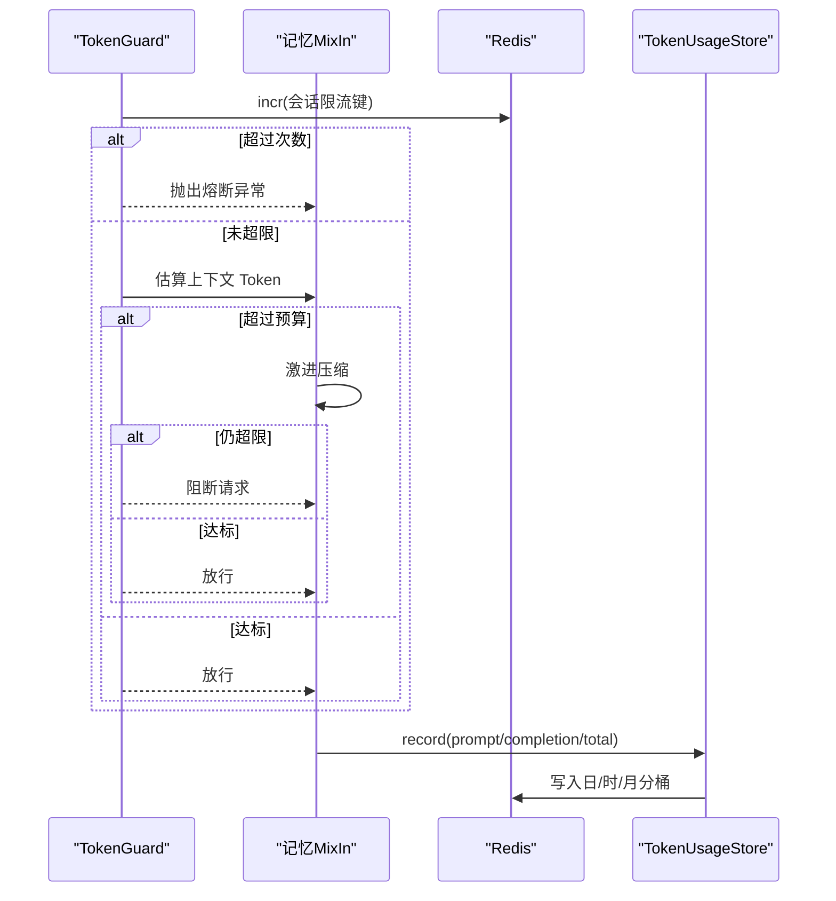
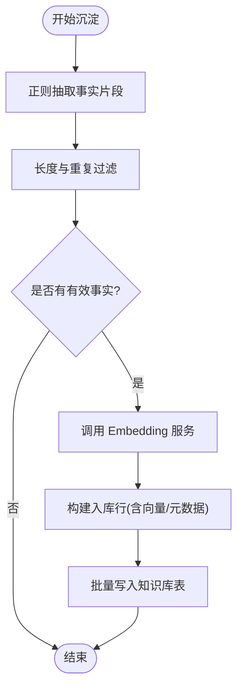
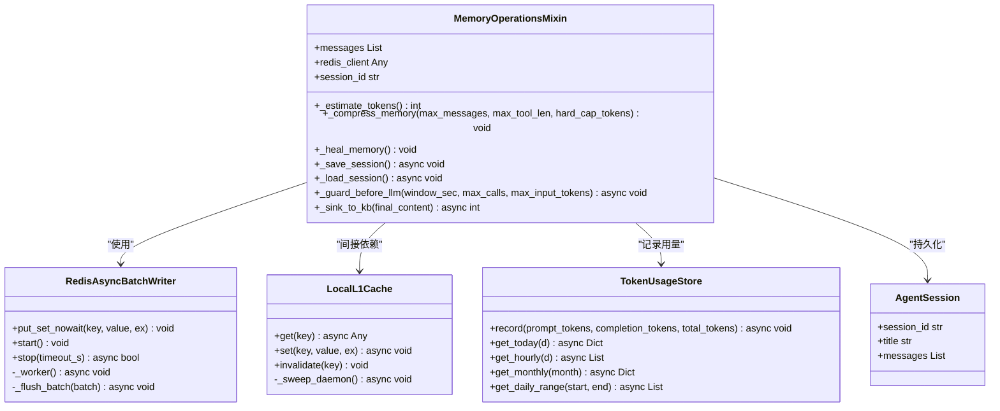
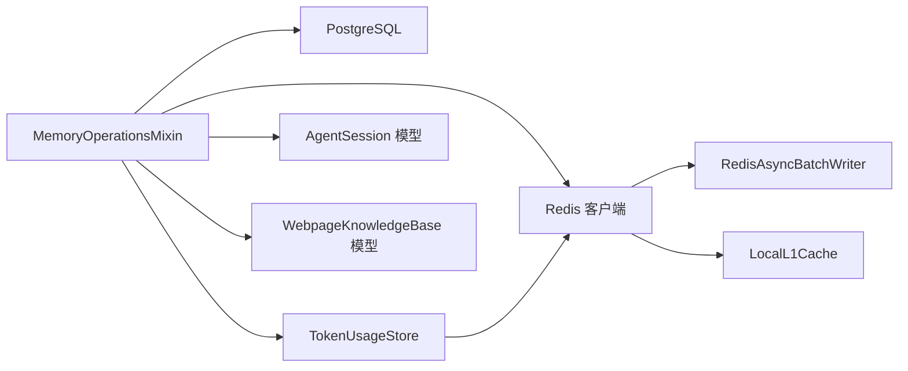

# 记忆管理系统

<cite>
**本文引用的文件**
- [hermes_agent/memory_ops.py](file://hermes_agent/memory_ops.py)
- [backend/core/redis_client.py](file://backend/core/redis_client.py)
- [backend/services/ai_narrator/token_usage_store.py](file://backend/services/ai_narrator/token_usage_store.py)
- [backend/core/models.py](file://backend/core/models.py)
- [scripts/memory_profiler.py](file://scripts/memory_profiler.py)
</cite>

## 目录
1. [简介](#简介)
2. [项目结构](#项目结构)
3. [核心组件](#核心组件)
4. [架构总览](#架构总览)
5. [详细组件分析](#详细组件分析)
6. [依赖关系分析](#依赖关系分析)
7. [性能考量](#性能考量)
8. [故障排查指南](#故障排查指南)
9. [结论](#结论)
10. [附录](#附录)

## 简介
本文件面向“记忆管理系统”，围绕会话记忆的存储、压缩、Token 用量追踪与预算控制、自愈修复、配置与调优、以及故障恢复策略进行系统化说明。系统采用 Redis 热缓存 + PostgreSQL 冷持久化的双层存储，结合进程内 L1 内存缓存与异步批量写入队列，实现高吞吐、低延迟的记忆读写；同时提供上下文窗口优化、历史消息摘要与关键信息提取的压缩机制，并通过 TokenGuard 与三维聚合计数器完成请求配额控制、成本优化与可观测性监控。

## 项目结构
记忆管理相关代码主要分布在以下模块：
- 会话记忆 Mixin：负责会话加载/保存、压缩、自愈、TokenGuard、知识库沉淀等
- Redis 客户端与缓存：连接池、异步批量写入、进程内 L1 缓存
- Token 用量统计：按日/时/月分桶的 Redis 持久化与 Prometheus 指标
- 数据库模型：AgentSession（会话 JSON）、WebpageKnowledgeBase（知识沉淀）
- 内存分析工具：tracemalloc 驱动的内存热点分析脚本

图表来源
- [hermes_agent/memory_ops.py:141-267](file://hermes_agent/memory_ops.py#L141-L267)
- [backend/core/redis_client.py:25-34](file://backend/core/redis_client.py#L25-L34)
- [backend/core/redis_client.py:46-177](file://backend/core/redis_client.py#L46-L177)
- [backend/core/redis_client.py:184-251](file://backend/core/redis_client.py#L184-L251)
- [backend/services/ai_narrator/token_usage_store.py:95-201](file://backend/services/ai_narrator/token_usage_store.py#L95-L201)
- [backend/core/models.py:106-123](file://backend/core/models.py#L106-L123)
- [backend/core/models.py:199-200](file://backend/core/models.py#L199-L200)

章节来源
- [hermes_agent/memory_ops.py:1-366](file://hermes_agent/memory_ops.py#L1-L366)
- [backend/core/redis_client.py:1-252](file://backend/core/redis_client.py#L1-L252)
- [backend/services/ai_narrator/token_usage_store.py:1-317](file://backend/services/ai_narrator/token_usage_store.py#L1-L317)
- [backend/core/models.py:106-200](file://backend/core/models.py#L106-L200)
- [scripts/memory_profiler.py:1-154](file://scripts/memory_profiler.py#L1-L154)

## 核心组件
- 会话记忆 Mixin（MemoryOperationsMixin）
  - 会话加载/保存：优先从 Redis 读取，未命中则回源 PostgreSQL，并写回 Redis 形成热路径
  - 记忆压缩：滑动窗口 + 巨型 Tool 返回值折叠，支持激进模式以应对 Token 超预算
  - 记忆自愈：检测并修复中断导致的 tool_calls 未闭环问题，补齐缺失响应
  - TokenGuard：会话级限流与输入 token 预算检查，超限触发激进压缩或阻断请求
  - 知识库沉淀：从对话结论中抽取事实片段，向量化后写入知识库表
- Redis 客户端与缓存
  - 连接池：统一配置最大连接数，避免资源耗尽
  - 异步批量写入：后台协程聚合 set 操作，使用 Pipeline 降低 RTT
  - 进程内 L1 缓存：高频读场景下屏蔽 Redis 网络开销，带 TTL 清理与容量熔断
- Token 用量统计（TokenUsageStore）
  - 三维分桶：日/时/月，字段包含 prompt/completion/total tokens 与调用次数
  - 降级策略：Redis 不可用时走内存累计，保证业务不阻塞
  - 指标暴露：Prometheus Counter/Gauge 用于可视化与告警
- 数据库模型
  - AgentSession：会话 JSON 持久化，支持标题自动生成与用户绑定
  - WebpageKnowledgeBase：向量嵌入与元数据，支撑检索增强

章节来源
- [hermes_agent/memory_ops.py:26-366](file://hermes_agent/memory_ops.py#L26-L366)
- [backend/core/redis_client.py:25-252](file://backend/core/redis_client.py#L25-L252)
- [backend/services/ai_narrator/token_usage_store.py:95-317](file://backend/services/ai_narrator/token_usage_store.py#L95-L317)
- [backend/core/models.py:106-200](file://backend/core/models.py#L106-L200)

## 架构总览
记忆系统通过“热缓存 + 冷持久化”的双层存储，配合“进程内 L1 缓存”和“异步批量写入”，在保证一致性的前提下最大化吞吐与最低延迟。Token 用量统计贯穿全链路，为配额控制与成本优化提供依据。

图表来源
- [hermes_agent/memory_ops.py:141-185](file://hermes_agent/memory_ops.py#L141-L185)
- [backend/core/redis_client.py:46-177](file://backend/core/redis_client.py#L46-L177)
- [backend/services/ai_narrator/token_usage_store.py:150-201](file://backend/services/ai_narrator/token_usage_store.py#L150-L201)
- [backend/core/models.py:106-123](file://backend/core/models.py#L106-L123)

## 详细组件分析

### 会话记忆存储与加载（Redis 热 + PostgreSQL 冷）
- 加载流程
  - 优先从 Redis 读取会话 JSON，若存在则应用系统提示并恢复 messages
  - 未命中则从 PostgreSQL 查询 AgentSession，成功后写回 Redis 形成热路径
  - 均失败则初始化仅含 system 提示的空会话
- 保存流程
  - 将当前 messages 序列化写入 Redis，设置过期时间
  - 异步任务将消息 Upsert 到 PostgreSQL，必要时生成智能标题并更新记录

图表来源
- [hermes_agent/memory_ops.py:149-185](file://hermes_agent/memory_ops.py#L149-L185)
- [backend/core/models.py:106-123](file://backend/core/models.py#L106-L123)

章节来源
- [hermes_agent/memory_ops.py:141-185](file://hermes_agent/memory_ops.py#L141-L185)
- [backend/core/models.py:106-123](file://backend/core/models.py#L106-L123)

### 记忆压缩算法（上下文窗口优化、历史摘要、关键信息提取）
- 估算 Token：基于消息 JSON 长度粗略估算，中文约 1 字/token，英文约 4 字符/token
- 有损压缩：对非最新轮次的巨型 Tool 返回值进行截断，释放内存
- 滑动窗口：当消息条数超过阈值时，保留 system 与最近 N 条，剔除中间 tool/assistant 轮次
- 激进模式：当估算 Token 超过硬上限时，进一步缩短 Tool 内容长度与窗口大小
- 事件日志：压缩行为记录至 event_log，便于审计与回溯

图表来源
- [hermes_agent/memory_ops.py:35-80](file://hermes_agent/memory_ops.py#L35-L80)

章节来源
- [hermes_agent/memory_ops.py:35-80](file://hermes_agent/memory_ops.py#L35-L80)

### 记忆修复与自愈（损坏检测、自动恢复、一致性保证）
- 检测未闭环 tool_calls：若 assistant 携带 tool_calls 但后续缺少对应 tool 响应，则判定为破损
- 自动补齐：为缺失的 tool_call_id 生成错误占位响应，确保上下文完整
- 尾部清理：若末尾残留未闭环的 assistant tool_calls，直接剔除
- 修复后再次压缩：确保修复后的上下文仍满足窗口与 Token 约束

图表来源
- [hermes_agent/memory_ops.py:82-139](file://hermes_agent/memory_ops.py#L82-L139)

章节来源
- [hermes_agent/memory_ops.py:82-139](file://hermes_agent/memory_ops.py#L82-L139)

### Token 使用量追踪与预算管理（请求配额、成本优化、性能监控）
- 预算检查（TokenGuard）
  - 会话级限流：在指定时间窗口内限制 LLM 调用次数，防止死循环或重连风暴
  - 输入 Token 预算：估算上下文 Token，超过预算时触发激进压缩，仍超限则阻断请求
- 用量统计（TokenUsageStore）
  - 三维分桶：日/时/月，记录 prompt/completion/total tokens 与调用次数
  - 降级策略：Redis 不可用时使用内存累计，保证业务不阻塞
  - 指标暴露：Prometheus Counter/Gauge，便于 Grafana 面板与告警
- 成本优化建议
  - 合理设置窗口大小与 Tool 内容长度，减少无效 Token 消耗
  - 利用 L1 缓存降低高频读的网络开销
  - 使用异步批量写入减少 Redis 写入 RTT

图表来源
- [hermes_agent/memory_ops.py:269-298](file://hermes_agent/memory_ops.py#L269-L298)
- [backend/services/ai_narrator/token_usage_store.py:150-201](file://backend/services/ai_narrator/token_usage_store.py#L150-L201)

章节来源
- [hermes_agent/memory_ops.py:269-298](file://hermes_agent/memory_ops.py#L269-L298)
- [backend/services/ai_narrator/token_usage_store.py:95-201](file://backend/services/ai_narrator/token_usage_store.py#L95-L201)

### 知识库沉淀（事实抽取与向量化入库）
- 事实抽取：正则匹配数字+单位/货币/百分比的事实片段
- 去重与过滤：长度过滤与重复文本去重
- 向量化：调用 embedding 服务获取向量
- 入库：写入 WebpageKnowledgeBase，附带来源 URL、时间戳与模型版本

图表来源
- [hermes_agent/memory_ops.py:299-366](file://hermes_agent/memory_ops.py#L299-L366)
- [backend/core/models.py:199-200](file://backend/core/models.py#L199-L200)

章节来源
- [hermes_agent/memory_ops.py:299-366](file://hermes_agent/memory_ops.py#L299-L366)
- [backend/core/models.py:199-200](file://backend/core/models.py#L199-L200)

### 类图（记忆系统与依赖）

图表来源
- [hermes_agent/memory_ops.py:26-366](file://hermes_agent/memory_ops.py#L26-L366)
- [backend/core/redis_client.py:46-251](file://backend/core/redis_client.py#L46-L251)
- [backend/services/ai_narrator/token_usage_store.py:95-317](file://backend/services/ai_narrator/token_usage_store.py#L95-L317)
- [backend/core/models.py:106-123](file://backend/core/models.py#L106-L123)

## 依赖关系分析
- 耦合度
  - MemoryOperationsMixin 依赖 Redis 客户端与数据库模型，解耦了具体存储实现
  - Redis 客户端内部封装连接池、批量写入与 L1 缓存，降低上层复杂度
  - TokenUsageStore 独立于业务热路径，异常安全且可降级
- 外部依赖
  - Redis：会话热缓存、限流计数、Token 用量分桶
  - PostgreSQL：会话冷持久化、知识库向量存储
  - Prometheus：指标采集与可视化
- 潜在循环依赖
  - 通过 Mixin 与模块内延迟导入避免 import 期副作用

图表来源
- [hermes_agent/memory_ops.py:141-267](file://hermes_agent/memory_ops.py#L141-L267)
- [backend/core/redis_client.py:25-252](file://backend/core/redis_client.py#L25-L252)
- [backend/services/ai_narrator/token_usage_store.py:95-201](file://backend/services/ai_narrator/token_usage_store.py#L95-L201)
- [backend/core/models.py:106-200](file://backend/core/models.py#L106-L200)

章节来源
- [hermes_agent/memory_ops.py:141-267](file://hermes_agent/memory_ops.py#L141-L267)
- [backend/core/redis_client.py:25-252](file://backend/core/redis_client.py#L25-L252)
- [backend/services/ai_narrator/token_usage_store.py:95-201](file://backend/services/ai_narrator/token_usage_store.py#L95-L201)
- [backend/core/models.py:106-200](file://backend/core/models.py#L106-L200)

## 性能考量
- 存储层
  - Redis 连接池上限配置化，避免无上限打满
  - 异步批量写入：后台协程聚合 set，Pipeline 批量发送，显著降低 RTT
  - 进程内 L1 缓存：高频读场景零延迟，带 TTL 清理与容量熔断
- 压缩与预算
  - 滑动窗口与有损压缩降低上下文体积，减少 Token 消耗
  - TokenGuard 前置检查，防止超限请求影响整体稳定性
- 观测与诊断
  - TokenUsageStore 提供日/时/月维度指标，便于成本分析与告警
  - 内存分析脚本（tracemalloc）定位内存热点，辅助优化

章节来源
- [backend/core/redis_client.py:25-252](file://backend/core/redis_client.py#L25-L252)
- [hermes_agent/memory_ops.py:35-80](file://hermes_agent/memory_ops.py#L35-L80)
- [backend/services/ai_narrator/token_usage_store.py:95-201](file://backend/services/ai_narrator/token_usage_store.py#L95-L201)
- [scripts/memory_profiler.py:17-154](file://scripts/memory_profiler.py#L17-L154)

## 故障排查指南
- Redis 不可用
  - TokenUsageStore 自动降级为内存累计，不影响业务
  - 批量写入失败会记录日志，建议在停机时强制 flush_all
- 会话加载失败
  - 检查 Redis 键空间与过期策略，确认 session_id 正确
  - 回源 PostgreSQL 失败时，系统会初始化空会话，需检查数据库连接与权限
- 记忆压缩过度
  - 调整 max_messages、max_tool_len、hard_cap_tokens 参数，平衡上下文完整性与 Token 预算
- 自愈未生效
  - 检查 assistant.tool_calls 与后续 tool 响应的 tool_call_id 是否匹配
  - 查看 event_log 中的 compress/heal 事件，确认修复行为

章节来源
- [backend/services/ai_narrator/token_usage_store.py:150-201](file://backend/services/ai_narrator/token_usage_store.py#L150-L201)
- [backend/core/redis_client.py:59-110](file://backend/core/redis_client.py#L59-L110)
- [hermes_agent/memory_ops.py:82-139](file://hermes_agent/memory_ops.py#L82-L139)
- [hermes_agent/memory_ops.py:149-185](file://hermes_agent/memory_ops.py#L149-L185)

## 结论
记忆管理系统通过 Redis 热缓存与 PostgreSQL 冷持久化的双层存储，结合进程内 L1 缓存与异步批量写入，实现了高吞吐、低延迟的会话记忆能力。压缩算法与 TokenGuard 有效控制上下文体积与 Token 预算，自愈机制保障上下文一致性。TokenUsageStore 提供多维度的用量统计与指标暴露，支撑成本优化与可观测性。整体设计兼顾性能、可靠性与可维护性，适合大规模 AI 会话场景。

## 附录
- 配置项与环境变量
  - REDIS_HOST、REDIS_PORT、REDIS_PASSWORD、REDIS_MAX_CONNECTIONS：Redis 连接与池配置
  - L1_CACHE_MAX_SIZE：进程内 L1 缓存最大容量
  - AUTO_SINK_KB：是否自动沉淀事实到知识库
  - EMBEDDING_DIM：向量维度
  - LLM_TOKEN_METRICS_ENABLED：是否启用 Token 用量统计
- 性能调优建议
  - 根据负载调整批量写入 batch_size 与 flush_interval
  - 合理设置滑动窗口与 Tool 内容长度，避免过度压缩导致语义丢失
  - 监控 Redis 连接池使用率与 L1 缓存命中率，及时扩容或调参
- 故障恢复策略
  - Redis 不可用：降级为内存累计，待恢复后自动重建
  - 数据库不可用：会话保存在 Redis，待恢复后异步落库
  - 优雅停机：批量写入器 stop(timeout_s) 确保数据不丢失

章节来源
- [backend/core/redis_client.py:14-34](file://backend/core/redis_client.py#L14-L34)
- [backend/core/redis_client.py:42-44](file://backend/core/redis_client.py#L42-L44)
- [hermes_agent/memory_ops.py:18-23](file://hermes_agent/memory_ops.py#L18-L23)
- [backend/core/models.py:11](file://backend/core/models.py#L11)
- [backend/services/ai_narrator/token_usage_store.py:41-50](file://backend/services/ai_narrator/token_usage_store.py#L41-L50)
