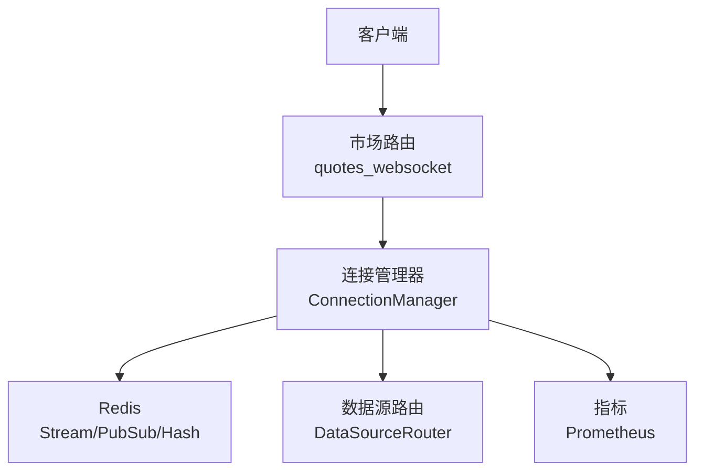
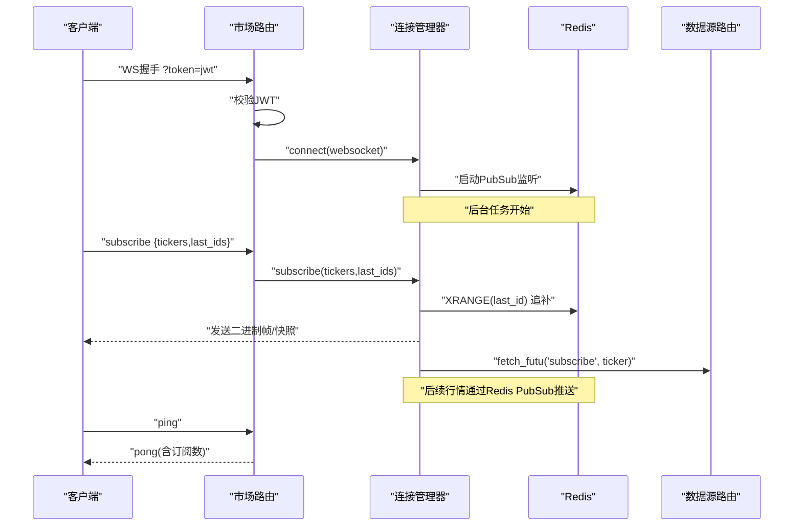
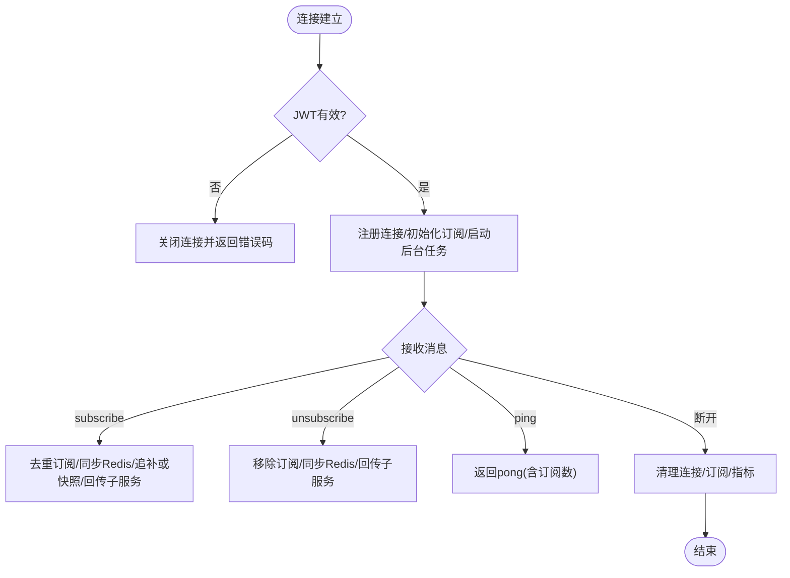
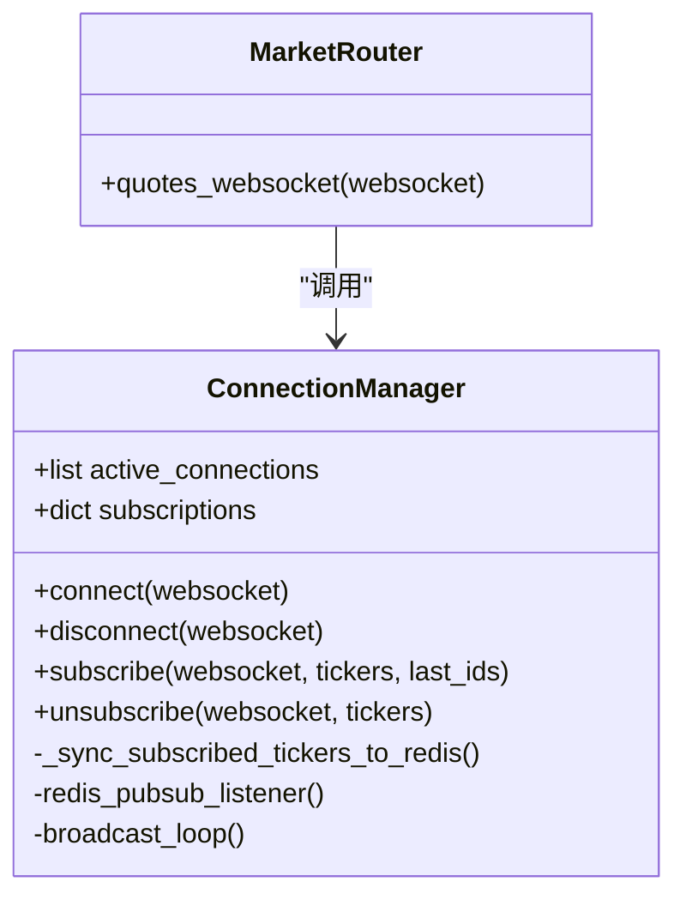
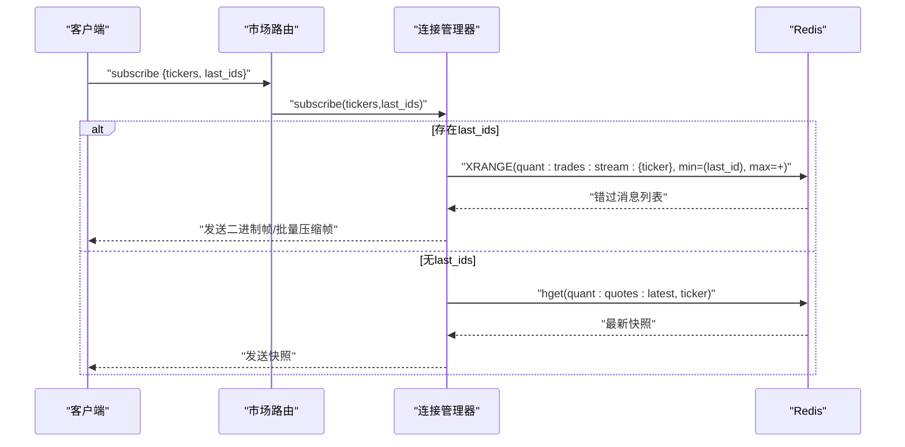
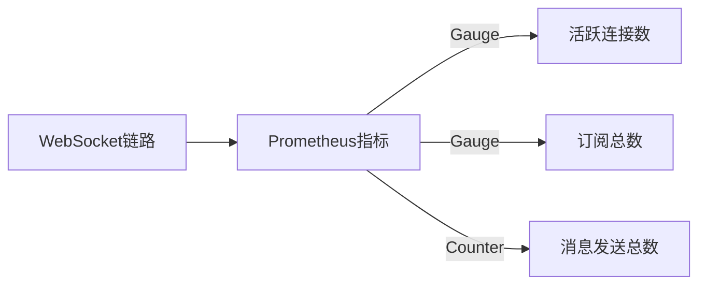
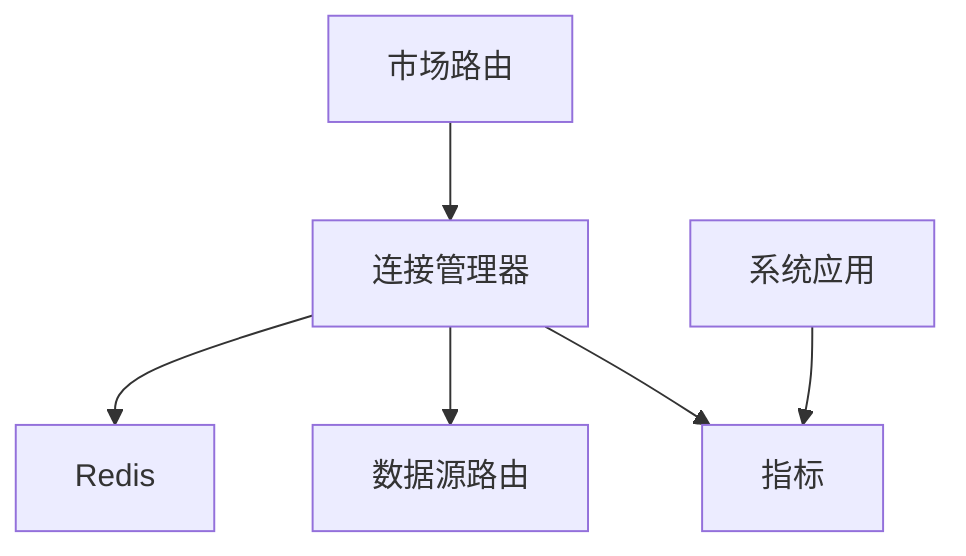

# WebSocket连接管理

<cite>
**本文引用的文件**
- [backend/services/market_engine.py](file://backend/services/market_engine.py)
- [backend/routers/market.py](file://backend/routers/market.py)
- [backend/core/metrics.py](file://backend/core/metrics.py)
- [backend/app/system_app.py](file://backend/app/system_app.py)
- [backend/tests/test_market_websocket_auth.py](file://backend/tests/test_market_websocket_auth.py)
</cite>

## 目录
1. [简介](#简介)
2. [项目结构](#项目结构)
3. [核心组件](#核心组件)
4. [架构总览](#架构总览)
5. [详细组件分析](#详细组件分析)
6. [依赖关系分析](#依赖关系分析)
7. [性能考量](#性能考量)
8. [故障诊断指南](#故障诊断指南)
9. [结论](#结论)
10. [附录：客户端接入示例](#附录客户端接入示例)

## 简介
本文件面向Quant Agent的WebSocket连接管理系统，聚焦于连接生命周期（建立、认证、订阅、断开）、订阅机制（多标的、变更同步、连接池管理）、断线重连与数据补发策略、监控指标（活跃连接数、订阅数量、消息吞吐），以及客户端接入与故障排查方法。内容基于后端市场服务与行情引擎的实现进行系统化梳理。

## 项目结构
与WebSocket连接管理直接相关的代码主要分布在以下模块：
- 路由层：处理HTTP请求与WebSocket握手、鉴权、心跳与指令分发
- 连接管理层：维护活跃连接、订阅集合、Redis总线监听与广播、追补/快照
- 指标层：定义并暴露Prometheus指标，供系统健康与可观测性使用
- 测试：覆盖鉴权分支与消息处理分支

图表来源
- [backend/routers/market.py:73-226](file://backend/routers/market.py#L73-L226)
- [backend/services/market_engine.py:115-331](file://backend/services/market_engine.py#L115-L331)
- [backend/core/metrics.py:53-72](file://backend/core/metrics.py#L53-L72)

章节来源
- [backend/routers/market.py:73-226](file://backend/routers/market.py#L73-L226)
- [backend/services/market_engine.py:115-331](file://backend/services/market_engine.py#L115-L331)
- [backend/core/metrics.py:53-72](file://backend/core/metrics.py#L53-L72)

## 核心组件
- 连接管理器（ConnectionManager）
  - 职责：维护活跃连接列表、订阅映射、启动后台任务（Redis PubSub监听、广播轮询）、订阅变更同步到Redis、追补历史或发送最新快照、按标的过滤推送。
  - 关键能力：
    - 连接建立/断开：记录/清理连接与订阅，更新指标
    - 订阅/反订阅：去重、同步订阅集、触发追补/快照
    - Redis Stream XRANGE：按last_id追补错过的消息
    - Redis Hash快照：无last_id时发送最新报价
    - 批量压缩帧：超过阈值时组合二进制帧并zlib压缩后发送
    - 背景任务：定时刷新技术指标缓存、资金流、账户信息，兜底拉取YFinance等
- 市场路由（quotes_websocket）
  - 职责：JWT鉴权、接收文本消息、解析action（subscribe/unsubscribe/ping）、调用连接管理器、心跳超时控制、异常与断开处理
- 指标（metrics）
  - 定义并暴露：活跃连接数、消息发送总数、订阅总数、丢弃消息计数等
- 系统应用（system_app）
  - 聚合Prometheus指标快照，提供ws_connections/ws_messages_sent/ws_subscriptions等

章节来源
- [backend/services/market_engine.py:115-331](file://backend/services/market_engine.py#L115-L331)
- [backend/routers/market.py:73-226](file://backend/routers/market.py#L73-L226)
- [backend/core/metrics.py:53-72](file://backend/core/metrics.py#L53-L72)
- [backend/app/system_app.py:90-150](file://backend/app/system_app.py#L90-L150)

## 架构总览
WebSocket连接管理采用“路由层 + 连接管理层 + Redis总线”的分层架构：
- 路由层负责协议交互（鉴权、心跳、指令）
- 连接管理层负责状态与调度（连接、订阅、追补、广播）
- Redis作为事件总线与持久化通道（Stream用于可靠追补，PubSub用于实时广播，Hash用于快照）

图表来源
- [backend/routers/market.py:73-226](file://backend/routers/market.py#L73-L226)
- [backend/services/market_engine.py:174-243](file://backend/services/market_engine.py#L174-L243)
- [backend/services/market_engine.py:296-331](file://backend/services/market_engine.py#L296-L331)

## 详细组件分析

### 连接生命周期管理
- 连接建立
  - 路由层从查询参数提取JWT并解码，失败则关闭连接并返回错误码
  - 成功后调用连接管理器的connect，注册连接、初始化订阅集合、增加活跃连接指标、启动后台任务
- 认证
  - 使用HS256算法解码JWT，校验sub字段；缺失或过期均拒绝
- 订阅
  - 支持多标的订阅，自动格式化ticker为统一前缀格式
  - 订阅去重：已存在的ticker不会重复注册
  - 订阅变更后异步同步到Redis，供生产者daemon动态跟随前端自选列表
  - 对Futu支持的标的，异步回传子服务执行真正的OpenD订阅
- 断开
  - 捕获WebSocketDisconnect或异常时，调用disconnect清理连接与订阅，减少活跃连接指标，并异步同步订阅集到Redis

图表来源
- [backend/routers/market.py:73-226](file://backend/routers/market.py#L73-L226)
- [backend/services/market_engine.py:174-251](file://backend/services/market_engine.py#L174-L251)

章节来源
- [backend/routers/market.py:73-226](file://backend/routers/market.py#L73-L226)
- [backend/services/market_engine.py:174-251](file://backend/services/market_engine.py#L174-L251)

### 订阅机制实现
- 多标的订阅
  - 支持一次传入多个ticker，自动格式化与去重
  - 对每个新订阅的标的，若属于Futu支持范围，异步通知子服务执行真实订阅
- 订阅变更同步
  - 连接管理器将当前所有连接的订阅集合合并写入Redis键，供行情生产者daemon动态跟随
- 连接池管理
  - 连接管理器维护active_connections与subscriptions映射
  - 后台广播循环会清理不再被任何连接订阅的标的缓存，避免内存泄漏
  - 针对Futu不支持的标的，动态标记并跳过后续请求，降低无效负载

图表来源
- [backend/services/market_engine.py:115-331](file://backend/services/market_engine.py#L115-L331)
- [backend/routers/market.py:73-226](file://backend/routers/market.py#L73-L226)

章节来源
- [backend/services/market_engine.py:115-331](file://backend/services/market_engine.py#L115-L331)
- [backend/routers/market.py:73-226](file://backend/routers/market.py#L73-L226)

### 断线重连策略与数据补发
- 自动重连逻辑
  - 路由层在心跳超时（默认60秒无ping）主动断开连接，客户端需自行重连
  - 连接管理器不持有长轮询或重连逻辑，由客户端负责重连
- 状态恢复与数据补发
  - 客户端在subscribe中携带last_ids，服务端通过Redis Stream XRANGE获取(last_id, +∞]区间内错过的消息
  - 若无last_id，则从Redis Hash读取该标的的最新报价快照并发送
  - 高频场景下，超过阈值的追补消息会被组合成单一二进制帧并zlib压缩后一次性发送，降低网络开销

图表来源
- [backend/services/market_engine.py:201-243](file://backend/services/market_engine.py#L201-L243)

章节来源
- [backend/services/market_engine.py:201-243](file://backend/services/market_engine.py#L201-L243)

### 连接监控指标
- 活跃连接数
  - 连接建立/断开时增减Gauge指标
- 订阅数量
  - 订阅/反订阅时设置Gauge指标为所有连接订阅总数
- 消息吞吐量
  - 每发送一条消息（quote/system/error）增加Counter指标
- 指标聚合
  - 系统应用聚合Prometheus指标快照，提供ws_connections/ws_messages_sent/ws_subscriptions等

图表来源
- [backend/core/metrics.py:53-72](file://backend/core/metrics.py#L53-L72)
- [backend/app/system_app.py:90-150](file://backend/app/system_app.py#L90-L150)

章节来源
- [backend/core/metrics.py:53-72](file://backend/core/metrics.py#L53-L72)
- [backend/app/system_app.py:90-150](file://backend/app/system_app.py#L90-L150)

## 依赖关系分析
- 路由层依赖连接管理器与指标模块
- 连接管理器依赖Redis（Stream/PubSub/Hash）、数据源路由（Futu/YFinance）、指标模块
- 系统应用依赖指标模块以聚合监控数据

图表来源
- [backend/routers/market.py:73-226](file://backend/routers/market.py#L73-L226)
- [backend/services/market_engine.py:115-331](file://backend/services/market_engine.py#L115-L331)
- [backend/core/metrics.py:53-72](file://backend/core/metrics.py#L53-L72)
- [backend/app/system_app.py:90-150](file://backend/app/system_app.py#L90-L150)

章节来源
- [backend/routers/market.py:73-226](file://backend/routers/market.py#L73-L226)
- [backend/services/market_engine.py:115-331](file://backend/services/market_engine.py#L115-L331)
- [backend/core/metrics.py:53-72](file://backend/core/metrics.py#L53-L72)
- [backend/app/system_app.py:90-150](file://backend/app/system_app.py#L90-L150)

## 性能考量
- 背压保护
  - 慢客户端可能导致缓冲区积压，建议在客户端侧实现背压控制（如丢弃最旧消息或暂停消费）
- 批量压缩帧
  - 追补消息超过阈值时组合为单一二进制帧并zlib压缩，显著降低网络与CPU开销
- 退避与防风暴
  - 技术指标与资金流拉取采用退避与节流策略，避免对下游数据源造成压力
- 内存安全
  - 定期清理不再被订阅的标的缓存，防止内存泄漏
- 指标观测
  - 通过Prometheus指标观察连接、订阅、消息吞吐与延迟，辅助容量规划与问题定位

[本节为通用指导，无需特定文件引用]

## 故障诊断指南
- 连接超时
  - 现象：服务端在60秒无心跳时主动断开
  - 排查：检查客户端是否按时发送ping；确认网络与防火墙策略
  - 参考：心跳超时逻辑与断开处理
- 消息丢失
  - 现象：客户端未收到部分行情
  - 排查：确认subscribe时是否携带last_ids；检查Redis Stream是否存在对应key；验证XRANGE是否正确
  - 参考：追补逻辑与二进制帧发送
- 内存泄漏
  - 现象：进程内存持续增长
  - 排查：检查是否仍有连接未正确断开；确认后台任务是否清理了不再需要的缓存
  - 参考：连接断开清理与缓存清理逻辑
- 鉴权失败
  - 现象：连接被拒绝
  - 排查：检查JWT是否有效、是否包含sub字段；确认密钥配置
  - 参考：鉴权分支测试

章节来源
- [backend/routers/market.py:73-226](file://backend/routers/market.py#L73-L226)
- [backend/services/market_engine.py:174-251](file://backend/services/market_engine.py#L174-L251)
- [backend/tests/test_market_websocket_auth.py:54-111](file://backend/tests/test_market_websocket_auth.py#L54-L111)

## 结论
本系统的WebSocket连接管理通过清晰的分层设计与可靠的Redis总线实现了高可用、可扩展的实时行情推送。连接生命周期、订阅机制、数据补发与监控指标共同保障了服务的稳定性与可观测性。建议客户端遵循心跳与重连规范，并在业务层实现背压与幂等处理，以获得最佳体验。

[本节为总结，无需特定文件引用]

## 附录：客户端接入示例
以下为客户端接入流程的步骤说明（不含具体代码）：
- 建立连接
  - 通过WebSocket连接到市场端点，并在查询参数中附带JWT令牌
  - 服务端校验通过后接受连接
- 发送订阅请求
  - 发送JSON消息，包含action为subscribe、tickers数组与可选的last_ids
  - 服务端将去重订阅、同步到Redis、追补或发送快照，并返回确认
- 处理实时数据
  - 服务端通过Redis PubSub推送行情，客户端需按标的过滤并处理二进制帧或快照
- 心跳保活
  - 定期发送ping消息，服务端返回pong并附带订阅数
- 断开与重连
  - 客户端检测到断开后，应等待一段时间后重试，并在subscribe中携带last_ids以实现数据补发

章节来源
- [backend/routers/market.py:73-226](file://backend/routers/market.py#L73-L226)
- [backend/services/market_engine.py:201-243](file://backend/services/market_engine.py#L201-L243)