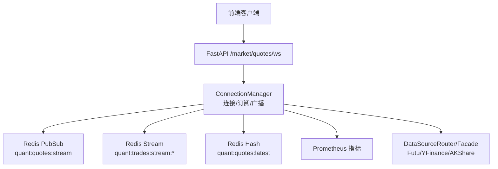
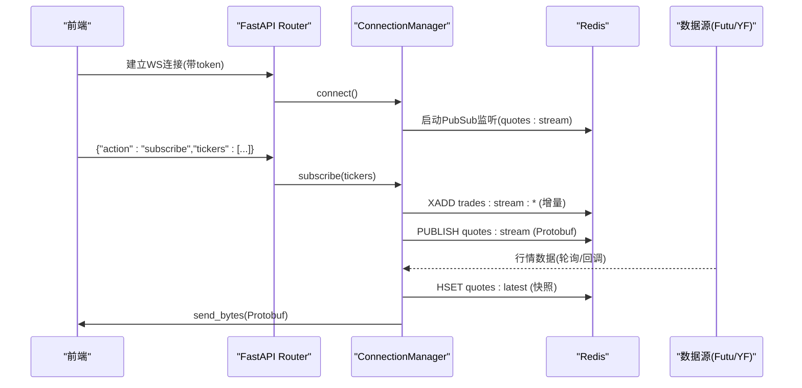
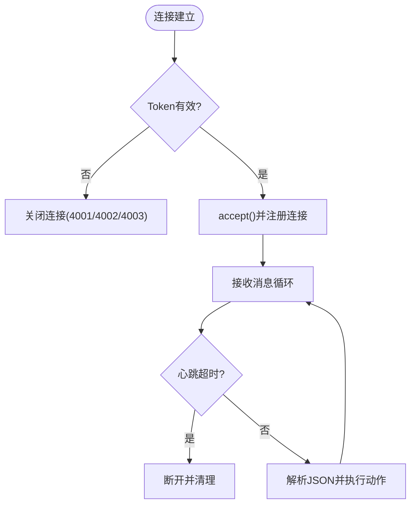
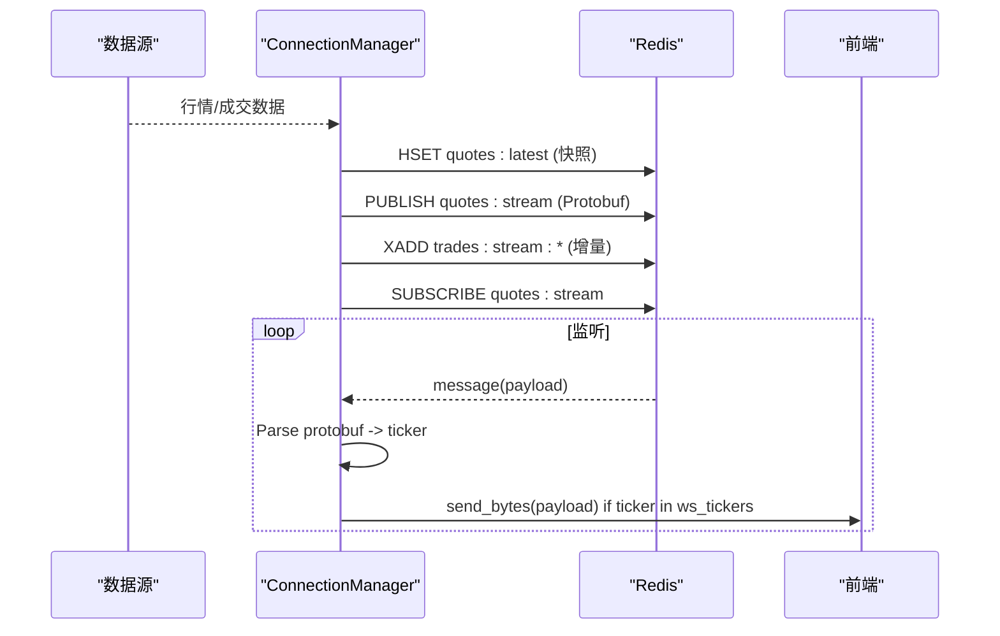
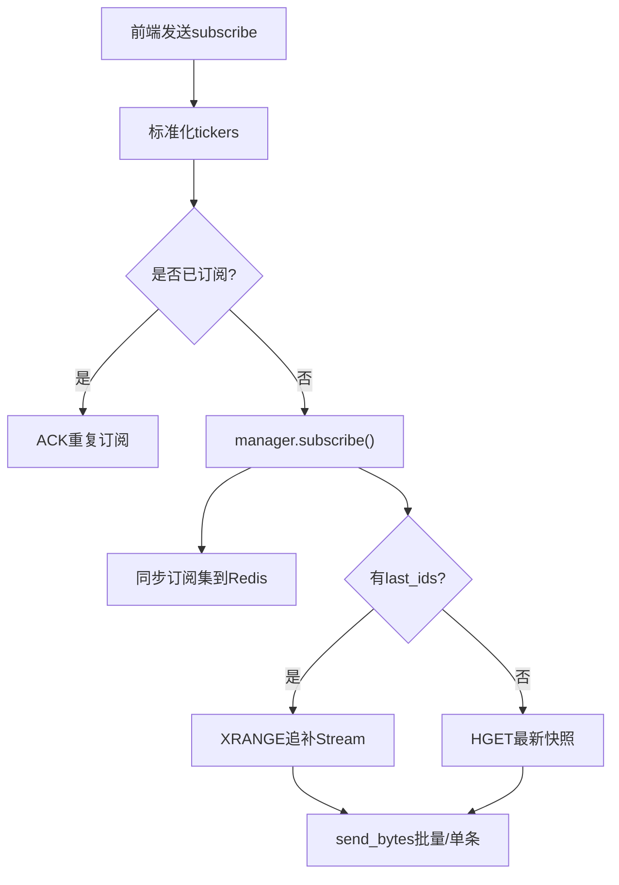
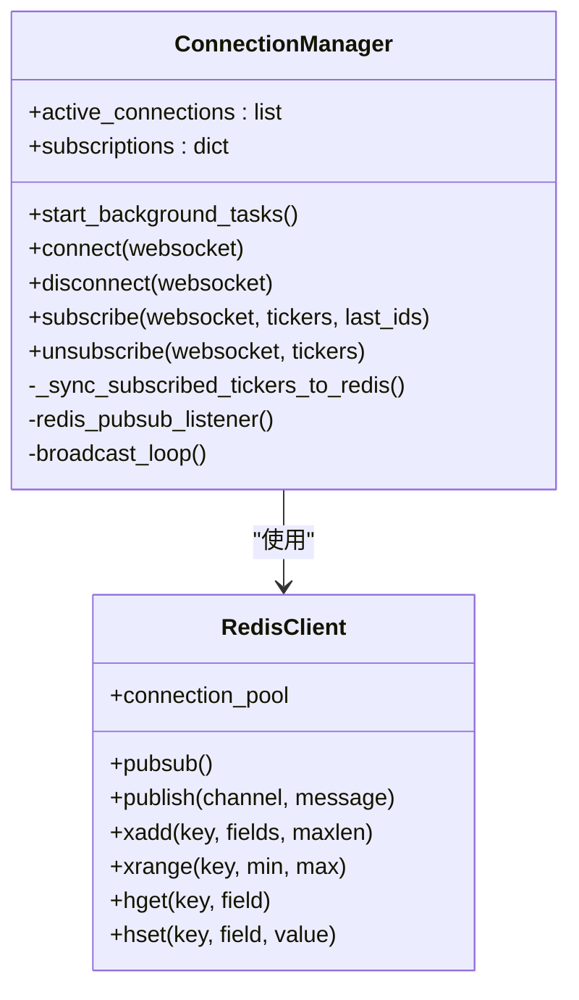
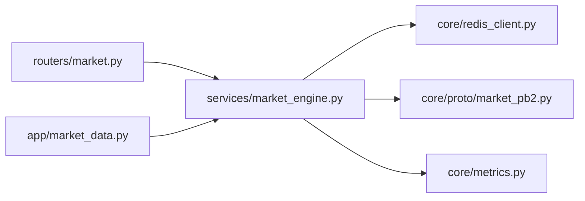

# 实时数据分发

<cite>
**本文引用的文件**
- [backend/services/market_engine.py](file://backend/services/market_engine.py)
- [backend/routers/market.py](file://backend/routers/market.py)
- [backend/core/redis_client.py](file://backend/core/redis_client.py)
- [backend/core/proto/market_pb2.py](file://backend/core/proto/market_pb2.py)
- [backend/core/metrics.py](file://backend/core/metrics.py)
- [backend/app/market_data.py](file://backend/app/market_data.py)
</cite>

## 目录
1. [简介](#简介)
2. [项目结构](#项目结构)
3. [核心组件](#核心组件)
4. [架构总览](#架构总览)
5. [详细组件分析](#详细组件分析)
6. [依赖关系分析](#依赖关系分析)
7. [性能考虑](#性能考虑)
8. [故障排查指南](#故障排查指南)
9. [结论](#结论)
10. [附录](#附录)

## 简介
本文件面向 Quant Agent 的实时数据分发系统，聚焦以下目标：
- WebSocket 连接管理：连接建立、心跳检测与自动重连策略。
- Redis Pub/Sub 消息广播：主题订阅、消息过滤与客户端路由。
- 前端订阅模型：标的选择、增量更新与状态同步。
- 连接池管理：连接复用、资源清理与故障恢复。
- 性能优化：消息批处理、压缩传输与带宽控制。

## 项目结构
实时数据分发的后端由 FastAPI Router 暴露 WebSocket 端点，通过 ConnectionManager 维护连接与订阅，使用 Redis 作为事件总线（Pub/Sub + Stream）进行跨进程广播与断线追补，并通过 Protobuf 序列化行情数据以降低网络开销。

图表来源
- [backend/routers/market.py:73-226](file://backend/routers/market.py#L73-L226)
- [backend/services/market_engine.py:115-331](file://backend/services/market_engine.py#L115-L331)
- [backend/core/redis_client.py:25-34](file://backend/core/redis_client.py#L25-L34)

章节来源
- [backend/routers/market.py:73-226](file://backend/routers/market.py#L73-L226)
- [backend/services/market_engine.py:115-331](file://backend/services/market_engine.py#L115-L331)
- [backend/core/redis_client.py:25-34](file://backend/core/redis_client.py#L25-L34)

## 核心组件
- WebSocket 路由器：负责鉴权、心跳、订阅/退订协议解析与 ACK。
- 连接管理器：维护活跃连接、订阅集合、背景任务（广播循环、Pub/Sub 监听）、追补逻辑与缓存快照。
- Redis 基础设施：连接池、异步批量写入器、L1 本地缓存。
- Protobuf 数据模型：统一序列化行情与订单簿数据。
- 指标埋点：监控连接数、消息发送量、订阅数等。

章节来源
- [backend/routers/market.py:73-226](file://backend/routers/market.py#L73-L226)
- [backend/services/market_engine.py:115-331](file://backend/services/market_engine.py#L115-L331)
- [backend/core/redis_client.py:46-177](file://backend/core/redis_client.py#L46-L177)
- [backend/core/proto/market_pb2.py](file://backend/core/proto/market_pb2.py)
- [backend/core/metrics.py:50-70](file://backend/core/metrics.py#L50-L70)

## 架构总览
系统采用“生产者-总线-消费者”模式：
- 生产者：底层数据源（Futu/YFinance/AKShare）经 Facade/Router 拉取行情，序列化为 Protobuf 后写入 Redis Hash（最新快照）并 Publish 到 Stream 主题。
- 总线：Redis Pub/Sub 用于低延迟广播；Redis Stream 用于断线追补。
- 消费者：后端 ConnectionManager 订阅主题，按订阅关系定向推送至对应 WebSocket；前端通过 subscribe/unsubscribe/ping 协议管理订阅与心跳。

图表来源
- [backend/routers/market.py:73-226](file://backend/routers/market.py#L73-L226)
- [backend/services/market_engine.py:39-113](file://backend/services/market_engine.py#L39-L113)
- [backend/services/market_engine.py:296-331](file://backend/services/market_engine.py#L296-L331)

## 详细组件分析

### WebSocket 连接管理与心跳
- 连接建立：Router 校验 JWT token，通过后调用 ConnectionManager.connect 接受连接并记录活跃连接与订阅集合。
- 心跳机制：每收到一次消息重置心跳计时器；超过阈值（默认60秒）无心跳则主动断开，释放资源。
- 自动重连：Router 侧不实现重连，建议前端在断开后指数退避重连；ConnectionManager 支持后台任务重启（push_task/pubsub_task 检测 done 后重建）。

图表来源
- [backend/routers/market.py:73-226](file://backend/routers/market.py#L73-L226)
- [backend/services/market_engine.py:174-190](file://backend/services/market_engine.py#L174-L190)

章节来源
- [backend/routers/market.py:73-226](file://backend/routers/market.py#L73-L226)
- [backend/services/market_engine.py:174-190](file://backend/services/market_engine.py#L174-L190)

### Redis Pub/Sub 消息广播与客户端路由
- 主题设计：
  - quant:quotes:stream：行情快照（Protobuf）广播主题。
  - quant:trades:stream：逐笔成交/增量事件（二进制 payload），同时写入 Stream quant:trades:stream:{ticker} 以支持断线追补。
- 订阅与过滤：ConnectionManager 启动 redis_pubsub_listener，解析 Protobuf 获取 ticker，仅向包含该 ticker 的订阅连接推送。
- 路由策略：基于内存中的 subscriptions 映射（WebSocket -> set[ticker]）进行精确投递。

图表来源
- [backend/services/market_engine.py:39-113](file://backend/services/market_engine.py#L39-L113)
- [backend/services/market_engine.py:296-331](file://backend/services/market_engine.py#L296-L331)

章节来源
- [backend/services/market_engine.py:39-113](file://backend/services/market_engine.py#L39-L113)
- [backend/services/market_engine.py:296-331](file://backend/services/market_engine.py#L296-L331)

### 前端订阅模型：标的选择、增量更新与状态同步
- 标的选择：前端发送 action=subscribe，携带 tickers（支持逗号分隔字符串），Router 会标准化格式（如添加市场前缀），去重后提交给 ConnectionManager.subscribe。
- 增量更新：首次或重连时，若携带 last_ids，ConnectionManager 通过 XRANGE 从 Stream 中追补错过的消息；未提供 last_ids 则发送最新快照（HGET quotes:latest）。
- 状态同步：订阅变更会异步同步到 Redis 集合 quant:ws:subscribed_tickers，供行情生产者 daemon 动态跟随前端自选列表推送盘口。

图表来源
- [backend/routers/market.py:121-172](file://backend/routers/market.py#L121-L172)
- [backend/services/market_engine.py:191-244](file://backend/services/market_engine.py#L191-L244)
- [backend/services/market_engine.py:253-267](file://backend/services/market_engine.py#L253-L267)

章节来源
- [backend/routers/market.py:121-172](file://backend/routers/market.py#L121-L172)
- [backend/services/market_engine.py:191-244](file://backend/services/market_engine.py#L191-L244)
- [backend/services/market_engine.py:253-267](file://backend/services/market_engine.py#L253-L267)

### 连接池管理策略：连接复用、资源清理与故障恢复
- 连接复用：ConnectionManager 维护 active_connections 与 subscriptions，避免重复注册；订阅集合去重减少冗余推送。
- 资源清理：disconnect 时移除连接、清空订阅并触发订阅集同步；后台任务在异常或取消后安全退出并关闭 PubSub。
- 故障恢复：
  - PubSub 监听捕获 CancelledError/Exception 后关闭连接，可被上层重启。
  - broadcast_loop 周期性重试，失败时 sleep 后继续。
  - Redis 连接池上限配置化，防止连接泄漏。

图表来源
- [backend/services/market_engine.py:115-331](file://backend/services/market_engine.py#L115-L331)
- [backend/core/redis_client.py:25-34](file://backend/core/redis_client.py#L25-L34)

章节来源
- [backend/services/market_engine.py:115-331](file://backend/services/market_engine.py#L115-L331)
- [backend/core/redis_client.py:25-34](file://backend/core/redis_client.py#L25-L34)

### 性能优化技巧：消息批处理、压缩传输与带宽控制
- 消息批处理：
  - 追补场景：当错过消息数量 > 100 时，将多条 payload 打包为单一二进制帧，先写长度头再拼接各包长度与数据，整体 zlib 压缩后一次性发送，显著降低 RTT。
  - Redis 批量写入：RedisAsyncBatchWriter 使用队列+Pipeline 批量 SET，降低高频写入的网络开销。
- 压缩传输：
  - 追补帧头部标记压缩模式（0x01），后续为 zlib 压缩体；行情推送使用 Protobuf 二进制，天然紧凑。
- 带宽控制：
  - 心跳超时断开慢客户端，避免缓冲区堆积。
  - 背景任务对 YFinance/Fund Flow 等低频数据设置刷新间隔，避免请求风暴。
  - 订阅集同步到 Redis，使生产者按需拉取，减少无效数据。

章节来源
- [backend/services/market_engine.py:201-244](file://backend/services/market_engine.py#L201-L244)
- [backend/core/redis_client.py:46-177](file://backend/core/redis_client.py#L46-L177)
- [backend/routers/market.py:216-226](file://backend/routers/market.py#L216-L226)

## 依赖关系分析
- Router 依赖 ConnectionManager 处理 WS 生命周期与业务动作。
- ConnectionManager 依赖 Redis（连接池、Pub/Sub、Stream、Hash）与 Protobuf 模型。
- 指标模块记录 WS 连接数、消息发送量、订阅数等。
- 应用层 market_data 作为稳定入口，屏蔽内部服务细节。

图表来源
- [backend/routers/market.py:73-226](file://backend/routers/market.py#L73-L226)
- [backend/services/market_engine.py:115-331](file://backend/services/market_engine.py#L115-L331)
- [backend/core/redis_client.py:25-34](file://backend/core/redis_client.py#L25-L34)
- [backend/core/proto/market_pb2.py](file://backend/core/proto/market_pb2.py)
- [backend/core/metrics.py:50-70](file://backend/core/metrics.py#L50-L70)
- [backend/app/market_data.py:1-16](file://backend/app/market_data.py#L1-L16)

章节来源
- [backend/routers/market.py:73-226](file://backend/routers/market.py#L73-L226)
- [backend/services/market_engine.py:115-331](file://backend/services/market_engine.py#L115-L331)
- [backend/core/redis_client.py:25-34](file://backend/core/redis_client.py#L25-L34)
- [backend/core/metrics.py:50-70](file://backend/core/metrics.py#L50-L70)
- [backend/app/market_data.py:1-16](file://backend/app/market_data.py#L1-L16)

## 性能考虑
- 低延迟路径：行情数据以 Protobuf 二进制直接通过 WS 推送，避免 JSON 编解码开销。
- 高吞吐路径：批量追补时使用自定义二进制帧+zlib 压缩，减少网络往返与带宽占用。
- 背压保护：心跳超时断开慢客户端；必要时可在前端实现节流与合并渲染。
- 资源限制：Redis 连接池上限可配置；L1 缓存容量受控，超限安全熔断清空。
- 降级与限流：YFinance/Fund Flow 等低频数据设置刷新间隔；子服务不可用时熔断与告警。

[本节为通用性能指导，不直接分析具体文件]

## 故障排查指南
- 连接无法建立：检查 Token 校验流程与错误码（4001/4002/4003）；确认 SECRET_KEY 与算法一致。
- 心跳频繁断开：确认前端 ping 频率与服务器超时阈值匹配；检查网络抖动与代理超时。
- 订阅无数据：核对 ticker 格式标准化；确认 Redis 主题是否正确订阅；查看 Stream 是否有数据（XRANGE 查询）。
- 追补失败：检查 last_ids 有效性；确认 Stream 保留策略（maxlen）与键名正确。
- Redis 异常：观察连接池大小与错误日志；必要时调整 REDIS_MAX_CONNECTIONS 与 flush_interval。
- 指标异常：查看 Prometheus 指标 WS_ACTIVE_CONNECTIONS、WS_MESSAGES_SENT、WS_SUBSCRIPTIONS 变化趋势。

章节来源
- [backend/routers/market.py:82-97](file://backend/routers/market.py#L82-L97)
- [backend/routers/market.py:216-226](file://backend/routers/market.py#L216-L226)
- [backend/services/market_engine.py:201-244](file://backend/services/market_engine.py#L201-L244)
- [backend/core/redis_client.py:25-34](file://backend/core/redis_client.py#L25-L34)
- [backend/core/metrics.py:50-70](file://backend/core/metrics.py#L50-L70)

## 结论
该系统通过 FastAPI WebSocket、Redis Pub/Sub 与 Stream、以及 Protobuf 序列化构建了高性能、可扩展的实时数据分发通道。连接管理、心跳与重连策略保障了稳定性；订阅模型与增量追补提升了用户体验；连接池与批处理优化了资源利用与带宽消耗。建议在部署时合理配置 Redis 连接池与心跳阈值，并在前端实现稳健的重连与节流策略。

[本节为总结性内容，不直接分析具体文件]

## 附录
- 关键端点与协议
  - WebSocket：/market/quotes/ws
  - 消息动作：subscribe、unsubscribe、ping
  - 数据格式：Protobuf（QuoteData/Order），二进制帧（追补压缩）
- 环境变量参考
  - REDIS_HOST、REDIS_PORT、REDIS_PASSWORD、REDIS_MAX_CONNECTIONS
  - L1_CACHE_MAX_SIZE
  - SECRET_KEY、ALGORITHM（JWT）

[本节为补充信息，不直接分析具体文件]