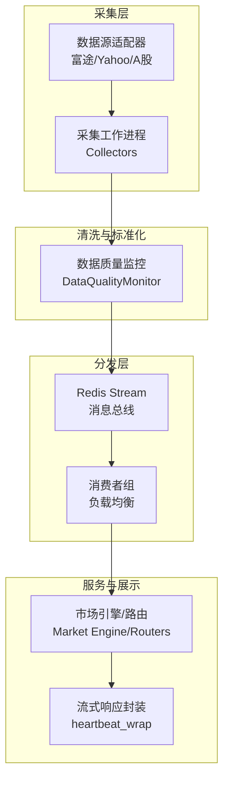
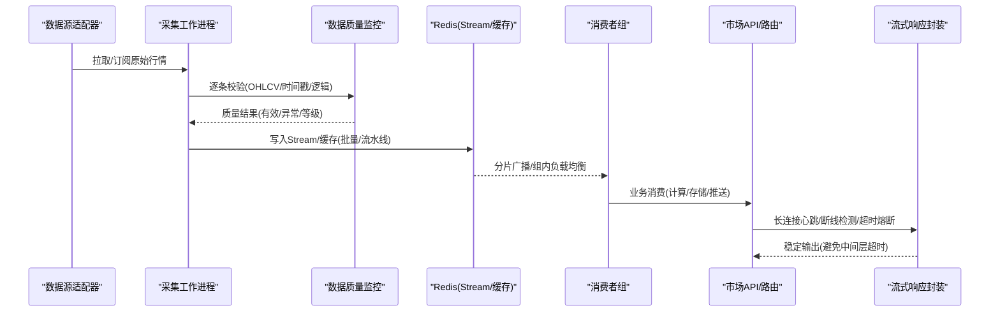
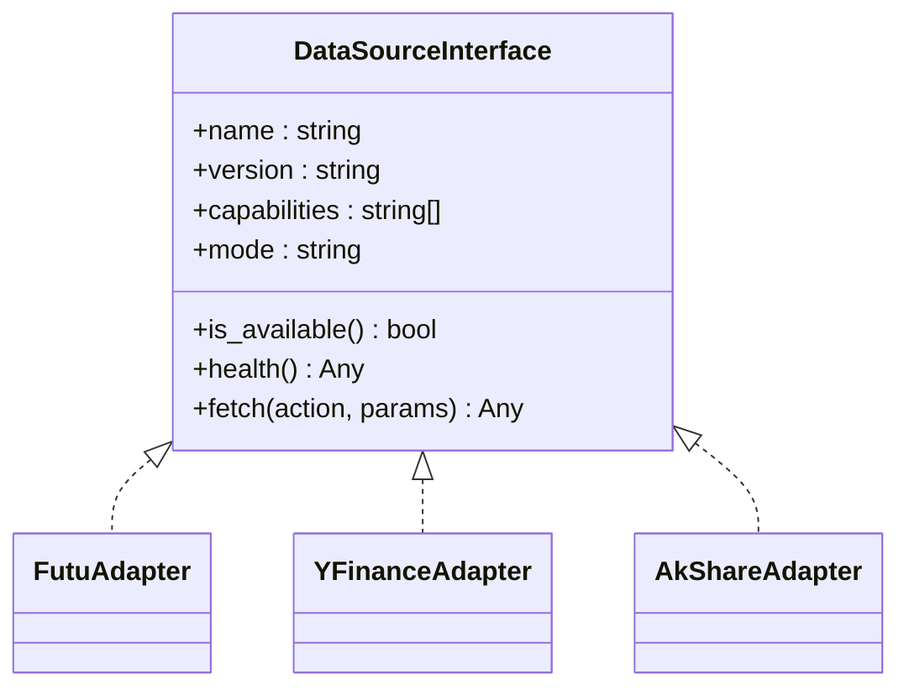
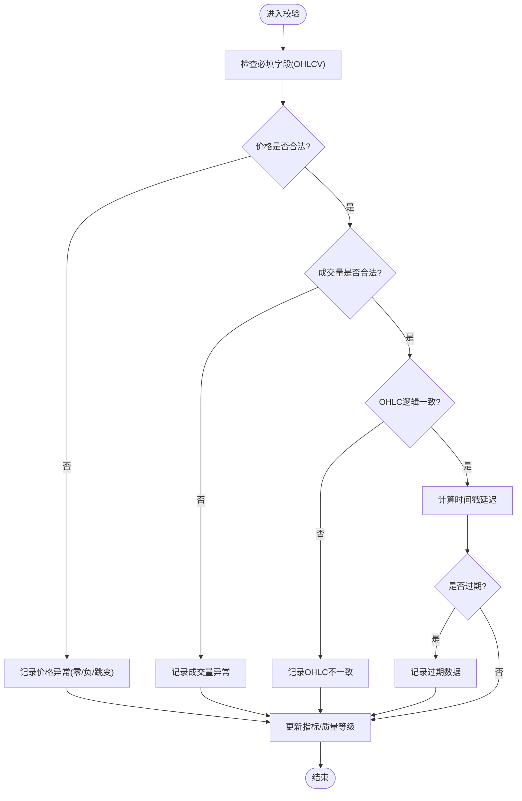
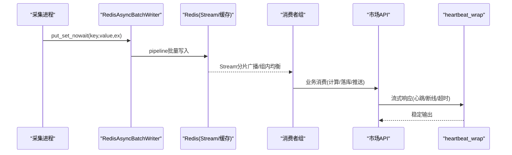
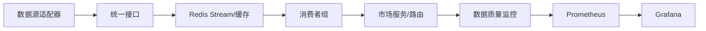

# 实时数据处理管道

<cite>
**本文引用的文件**
- [backend/services/datasource/protocol.py](file://backend/services/datasource/protocol.py)
- [backend/core/redis_client.py](file://backend/core/redis_client.py)
- [backend/core/stream_utils.py](file://backend/core/stream_utils.py)
- [backend/services/data_quality/monitor.py](file://backend/services/data_quality/monitor.py)
- [backend/workers/collectors/quote_publisher.py](file://backend/workers/collectors/quote_publisher.py)
- [backend/services/market_engine.py](file://backend/services/market_engine.py)
- [backend/routers/market.py](file://backend/routers/market.py)
- [backend/routers/system_health.py](file://backend/routers/system_health.py)
- [grafana/provisioning/dashboards/data-quality-dashboard.json](file://grafana/provisioning/dashboards/data-quality-dashboard.json)
- [config/prometheus_rules.yml](file://config/prometheus_rules.yml)
</cite>

## 目录
1. [简介](#简介)
2. [项目结构](#项目结构)
3. [核心组件](#核心组件)
4. [架构总览](#架构总览)
5. [详细组件分析](#详细组件分析)
6. [依赖关系分析](#依赖关系分析)
7. [性能考虑](#性能考虑)
8. [故障排查指南](#故障排查指南)
9. [结论](#结论)
10. [附录](#附录)

## 简介
本文件面向 Quant Agent 的实时数据处理管道，聚焦以下目标：
- 数据采集层：统一接口设计，覆盖多数据源适配器（富途、Yahoo Finance、A股数据源等）。
- 数据清洗与标准化：价格格式化、时间戳处理、异常值检测。
- 数据分发机制：基于 Redis Stream 的消息路由与消费者负载均衡。
- 数据质量控制：完整性检查、延迟监控、一致性保证。
- 性能调优：批处理优化、内存管理、并发控制。
- 监控告警：数据延迟阈值、错误率监控、系统健康检查。

## 项目结构
围绕实时数据管道的关键目录与职责如下：
- 数据源协议与路由：定义统一的数据源接口，屏蔽具体实现差异。
- 采集与发布：工作进程从各数据源拉取或订阅行情，经清洗后写入消息总线。
- 分发与消费：通过 Redis Stream 进行解耦与水平扩展，消费者按策略消费。
- 质量监控：对每条数据进行完整性、价格逻辑、时间新鲜度校验，并暴露指标。
- 流式响应：对外提供长连接（SSE/NDJSON）时的心跳保活与超时熔断。
- 监控与告警：Prometheus/Grafana 仪表盘与规则，支撑可视化与告警。

图表来源
- [backend/services/datasource/protocol.py:12-46](file://backend/services/datasource/protocol.py#L12-L46)
- [backend/workers/collectors/quote_publisher.py](file://backend/workers/collectors/quote_publisher.py)
- [backend/services/data_quality/monitor.py:91-256](file://backend/services/data_quality/monitor.py#L91-L256)
- [backend/core/redis_client.py:1-35](file://backend/core/redis_client.py#L1-L35)
- [backend/core/stream_utils.py:21-77](file://backend/core/stream_utils.py#L21-L77)
- [backend/services/market_engine.py](file://backend/services/market_engine.py)
- [backend/routers/market.py](file://backend/routers/market.py)

章节来源
- [backend/services/datasource/protocol.py:12-46](file://backend/services/datasource/protocol.py#L12-L46)
- [backend/core/redis_client.py:1-35](file://backend/core/redis_client.py#L1-L35)
- [backend/core/stream_utils.py:21-77](file://backend/core/stream_utils.py#L21-L77)
- [backend/services/data_quality/monitor.py:91-256](file://backend/services/data_quality/monitor.py#L91-L256)

## 核心组件
- 统一数据源接口：所有数据源必须实现统一的 fetch/health/capabilities 等能力，确保上层无需感知具体实现。
- 数据质量监控：对 OHLCV 字段完整性、价格逻辑、时间戳新鲜度进行检查，输出质量等级与指标。
- Redis 基础设施：连接池、异步批量写入器、本地 L1 缓存，降低网络开销与提升吞吐。
- 流式响应封装：为 SSE/NDJSON 提供心跳保活、客户端断开检测与超时熔断。
- 市场引擎与路由：聚合数据源、编排消费流程、对外暴露 API。

章节来源
- [backend/services/datasource/protocol.py:12-46](file://backend/services/datasource/protocol.py#L12-L46)
- [backend/services/data_quality/monitor.py:91-256](file://backend/services/data_quality/monitor.py#L91-L256)
- [backend/core/redis_client.py:46-177](file://backend/core/redis_client.py#L46-L177)
- [backend/core/stream_utils.py:21-77](file://backend/core/stream_utils.py#L21-L77)
- [backend/services/market_engine.py](file://backend/services/market_engine.py)
- [backend/routers/market.py](file://backend/routers/market.py)

## 架构总览
下图展示了从数据源到消费者的端到端流程，包括统一接口、清洗、Redis 分发、消费者负载与流式响应。

图表来源
- [backend/services/datasource/protocol.py:12-46](file://backend/services/datasource/protocol.py#L12-L46)
- [backend/services/data_quality/monitor.py:112-256](file://backend/services/data_quality/monitor.py#L112-L256)
- [backend/core/redis_client.py:46-177](file://backend/core/redis_client.py#L46-L177)
- [backend/core/stream_utils.py:21-77](file://backend/core/stream_utils.py#L21-L77)
- [backend/services/market_engine.py](file://backend/services/market_engine.py)
- [backend/routers/market.py](file://backend/routers/market.py)

## 详细组件分析

### 统一数据源接口（多数据源适配）
- 设计要点
  - 所有数据源需实现 name/version/capabilities/mode/is_available/health/fetch。
  - 通过 Router/Facade 将不同数据源抽象为一致行为，便于替换与扩展。
  - 支持 internal/external/hybrid 模式，便于区分内部缓存与外部网络调用。
- 典型流程
  - 上层仅调用 fetch(action, params)，由具体适配器负责鉴权、限流、重试与解析。
  - health() 返回健康状态与速率限制信息，供调度与健康检查使用。

图表来源
- [backend/services/datasource/protocol.py:12-46](file://backend/services/datasource/protocol.py#L12-L46)

章节来源
- [backend/services/datasource/protocol.py:12-46](file://backend/services/datasource/protocol.py#L12-L46)

### 数据清洗与标准化
- 字段完整性检查：OHLCV 必填字段非空。
- 价格异常检测：零价/负价/价格跳变（阈值可配置）。
- 成交量检查：负成交量视为异常。
- OHLC 一致性：high < low 等逻辑冲突检测。
- 时间戳新鲜度：计算延迟毫秒数，超过阈值标记过期。
- 输出：质量等级（good/degraded/poor/unusable）、异常列表、指标导出至 Prometheus。

图表来源
- [backend/services/data_quality/monitor.py:112-256](file://backend/services/data_quality/monitor.py#L112-L256)

章节来源
- [backend/services/data_quality/monitor.py:112-256](file://backend/services/data_quality/monitor.py#L112-L256)

### 数据分发机制（Redis Stream 与消费者负载均衡）
- 写入侧：采集进程在清洗后将数据写入 Redis Stream；高频 set 场景通过异步批量写入器与 Pipeline 合并，减少 RTT。
- 读取侧：消费者组以组内负载均衡方式消费 Stream，实现水平扩展与容错。
- 缓存侧：本地 L1 缓存 + Redis L2 缓存，热点键低延迟命中，定期清理过期项，容量超限安全熔断清空。
- 流式响应：对外长连接通过 heartbeat_wrap 提供心跳保活、客户端断开检测与超时熔断，避免反向代理误杀连接。

图表来源
- [backend/core/redis_client.py:46-177](file://backend/core/redis_client.py#L46-L177)
- [backend/core/redis_client.py:184-251](file://backend/core/redis_client.py#L184-L251)
- [backend/core/stream_utils.py:21-77](file://backend/core/stream_utils.py#L21-L77)
- [backend/workers/collectors/quote_publisher.py](file://backend/workers/collectors/quote_publisher.py)

章节来源
- [backend/core/redis_client.py:46-177](file://backend/core/redis_client.py#L46-L177)
- [backend/core/redis_client.py:184-251](file://backend/core/redis_client.py#L184-L251)
- [backend/core/stream_utils.py:21-77](file://backend/core/stream_utils.py#L21-L77)
- [backend/workers/collectors/quote_publisher.py](file://backend/workers/collectors/quote_publisher.py)

### 数据质量控制（完整性、延迟、一致性）
- 完整性：OHLCV 必填字段缺失即记为异常。
- 延迟：计算数据时间与当前时间的差值，超过阈值（默认 60s）标记过期。
- 一致性：OHLC 逻辑校验（如 high < low），价格跳变超阈值（默认 50%）标记异常。
- 指标与告警：脏数据率、完整率、平均/最大延迟、异常计数；达到阈值触发告警回调（可对接飞书/Telegram）。
- 可视化：指标导出至 Prometheus，Grafana 仪表盘展示。

章节来源
- [backend/services/data_quality/monitor.py:26-89](file://backend/services/data_quality/monitor.py#L26-L89)
- [backend/services/data_quality/monitor.py:112-256](file://backend/services/data_quality/monitor.py#L112-L256)
- [grafana/provisioning/dashboards/data-quality-dashboard.json](file://grafana/provisioning/dashboards/data-quality-dashboard.json)

### 性能调优指南
- 批处理优化
  - 使用 RedisAsyncBatchWriter 将高频 set 合并为 Pipeline 批量提交，显著降低 RTT 与带宽占用。
  - 合理设置 batch_size 与 flush_interval，平衡延迟与吞吐。
- 内存管理
  - LocalL1Cache 提供进程内短效缓存，默认 TTL 10s，容量上限保护，超限自动清空，避免内存泄漏。
  - 后台定时清理过期 Key，防止冷键堆积。
- 并发控制
  - Redis 连接池大小可配置，避免连接耗尽。
  - 流式响应中通过心跳间隔与超时熔断，避免无效任务长时间占用资源。
- 建议
  - 根据 QPS 调整 L1 缓存 TTL 与上限。
  - 在高并发场景下优先使用批量写入与组内负载均衡消费。
  - 结合 Prometheus/Grafana 观察延迟与错误率，动态调参。

章节来源
- [backend/core/redis_client.py:46-177](file://backend/core/redis_client.py#L46-L177)
- [backend/core/redis_client.py:184-251](file://backend/core/redis_client.py#L184-L251)
- [backend/core/stream_utils.py:21-77](file://backend/core/stream_utils.py#L21-L77)

### 监控告警配置
- 指标暴露
  - 数据质量监控将脏数据率、完整率、异常计数、延迟等指标导出至 Prometheus。
- 仪表盘
  - Grafana 提供数据质量看板，便于实时监控与回溯。
- 告警规则
  - 可在 prometheus_rules.yml 中配置延迟阈值、错误率阈值、系统健康检查规则。
- 健康检查
  - 数据源 health() 返回状态，系统健康路由可聚合各组件健康状态。

章节来源
- [backend/services/data_quality/monitor.py:315-349](file://backend/services/data_quality/monitor.py#L315-L349)
- [grafana/provisioning/dashboards/data-quality-dashboard.json](file://grafana/provisioning/dashboards/data-quality-dashboard.json)
- [config/prometheus_rules.yml](file://config/prometheus_rules.yml)
- [backend/routers/system_health.py](file://backend/routers/system_health.py)

## 依赖关系分析
- 组件耦合
  - 数据源适配器通过统一接口被上层路由/引擎调用，降低耦合。
  - 数据质量监控独立于采集与分发，可插拔接入。
  - Redis 作为数据总线与缓存，贯穿采集、分发与服务层。
- 外部依赖
  - Redis（Stream/缓存/连接池）
  - Prometheus/Grafana（指标与可视化）
  - 数据源 SDK（富途、Yahoo、A股数据源）

图表来源
- [backend/services/datasource/protocol.py:12-46](file://backend/services/datasource/protocol.py#L12-L46)
- [backend/core/redis_client.py:1-35](file://backend/core/redis_client.py#L1-L35)
- [backend/services/data_quality/monitor.py:315-349](file://backend/services/data_quality/monitor.py#L315-L349)

章节来源
- [backend/services/datasource/protocol.py:12-46](file://backend/services/datasource/protocol.py#L12-L46)
- [backend/core/redis_client.py:1-35](file://backend/core/redis_client.py#L1-L35)
- [backend/services/data_quality/monitor.py:315-349](file://backend/services/data_quality/monitor.py#L315-L349)

## 性能考虑
- 高吞吐写入：使用批量写入器与 Pipeline，减少网络往返。
- 低延迟读取：L1 本地缓存 + L2 Redis，热点键近零延迟。
- 长连接稳定性：心跳保活与超时熔断，避免中间层误杀。
- 可扩展性：消费者组水平扩展，按 ticker/主题分片。
- 资源保护：连接池上限、缓存容量上限、队列深度监控。

[本节为通用指导，不直接分析具体文件]

## 故障排查指南
- 常见问题定位
  - 数据延迟过高：检查数据源健康状态、消费者积压、Redis Stream 分区与消费者数量。
  - 脏数据率高：查看数据质量监控异常类型（缺失字段、价格异常、OHLC 不一致、时间戳过期）。
  - 连接不稳定：确认心跳间隔与超时熔断配置，检查反向代理（Nginx/Cloudflare）超时设置。
  - 内存增长：检查 L1 缓存容量与清理任务是否正常执行。
- 诊断步骤
  - 查看 Prometheus 指标与 Grafana 看板，定位异常时段与数据源。
  - 检查 Redis 连接池与批量写入日志，确认 Pipeline 是否成功。
  - 核对数据质量监控告警回调是否生效（飞书/Telegram）。
  - 使用系统健康路由检查各组件状态。

章节来源
- [backend/services/data_quality/monitor.py:270-295](file://backend/services/data_quality/monitor.py#L270-L295)
- [backend/core/redis_client.py:116-177](file://backend/core/redis_client.py#L116-L177)
- [backend/core/stream_utils.py:21-77](file://backend/core/stream_utils.py#L21-L77)
- [backend/routers/system_health.py](file://backend/routers/system_health.py)

## 结论
本管道通过统一数据源接口、严格的数据质量监控、基于 Redis Stream 的高吞吐分发与稳定的流式响应封装，实现了多数据源的实时行情采集、清洗、分发与消费。配合 Prometheus/Grafana 监控与告警，能够保障系统的可靠性与可观测性。建议在上线前完成参数调优与阈值配置，并结合业务特征持续优化。

[本节为总结，不直接分析具体文件]

## 附录
- 术语
  - OHLCV：开盘价、最高价、最低价、收盘价、成交量。
  - Stream：Redis 流式数据结构，用于消息队列与事件流。
  - 消费者组：Redis Stream 的组内负载均衡消费模型。
- 参考
  - 数据源协议定义、数据质量监控、Redis 工具类、流式响应封装、市场引擎与路由、监控仪表盘与规则。

[本节为补充说明，不直接分析具体文件]