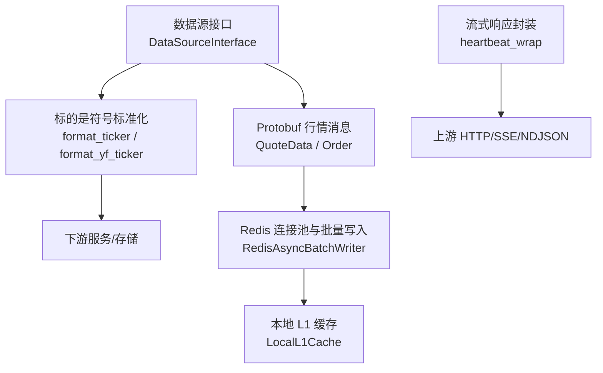
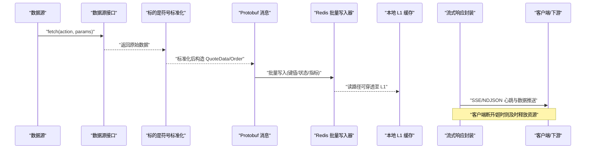
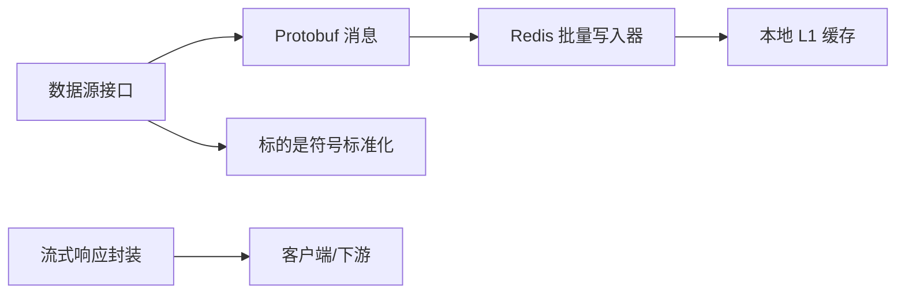

# 数据处理管道

<cite>
**本文引用的文件**
- [backend/core/redis_client.py](file://backend/core/redis_client.py)
- [backend/core/stream_utils.py](file://backend/core/stream_utils.py)
- [shared/proto/market.proto](file://shared/proto/market.proto)
- [backend/services/datasource/protocol.py](file://backend/services/datasource/protocol.py)
- [backend/core/ticker_format.py](file://backend/core/ticker_format.py)
</cite>

## 目录
1. [简介](#简介)
2. [项目结构](#项目结构)
3. [核心组件](#核心组件)
4. [架构总览](#架构总览)
5. [详细组件分析](#详细组件分析)
6. [依赖关系分析](#依赖关系分析)
7. [性能考虑](#性能考虑)
8. [故障排查指南](#故障排查指南)
9. [结论](#结论)
10. [附录](#附录)

## 简介
本文件面向 Quant Agent 的数据处理管道，聚焦以下目标：
- 数据清洗与标准化：价格格式化、时间戳处理策略、异常值检测思路。
- Protobuf 序列化机制：消息格式定义、压缩优化建议、版本兼容性实践。
- Redis Stream 使用：消息持久化、消费者组、断线重连机制（基于现有 Redis 基础设施的扩展方案）。
- 性能调优：批处理优化、内存管理、并发控制。
- 数据质量控制：完整性校验、延迟监控、一致性保障。

## 项目结构
围绕数据处理管道的关键代码集中在后端核心模块与共享协议中：
- 数据源抽象接口：统一入口 fetch，屏蔽具体数据源差异。
- 行情数据结构：通过 Protobuf 定义跨进程/跨语言的消息格式。
- 标的是符号标准化：将不同来源的 ticker 统一为系统内部标准格式。
- Redis 基础设施：连接池、异步批量写入器、本地 L1 缓存，为流式与批处理提供高性能读写能力。
- 流式响应辅助：心跳保活、客户端断开检测、超时熔断，用于长连接场景下的资源回收与稳定性保障。

图表来源
- [backend/services/datasource/protocol.py:12-47](file://backend/services/datasource/protocol.py#L12-L47)
- [shared/proto/market.proto:5-21](file://shared/proto/market.proto#L5-L21)
- [backend/core/ticker_format.py:8-98](file://backend/core/ticker_format.py#L8-L98)
- [backend/core/redis_client.py:25-34](file://backend/core/redis_client.py#L25-L34)
- [backend/core/redis_client.py:46-177](file://backend/core/redis_client.py#L46-L177)
- [backend/core/redis_client.py:184-251](file://backend/core/redis_client.py#L184-L251)
- [backend/core/stream_utils.py:21-77](file://backend/core/stream_utils.py#L21-L77)

章节来源
- [backend/services/datasource/protocol.py:12-47](file://backend/services/datasource/protocol.py#L12-L47)
- [shared/proto/market.proto:5-21](file://shared/proto/market.proto#L5-L21)
- [backend/core/ticker_format.py:8-98](file://backend/core/ticker_format.py#L8-L98)
- [backend/core/redis_client.py:25-34](file://backend/core/redis_client.py#L25-L34)
- [backend/core/redis_client.py:46-177](file://backend/core/redis_client.py#L46-L177)
- [backend/core/redis_client.py:184-251](file://backend/core/redis_client.py#L184-L251)
- [backend/core/stream_utils.py:21-77](file://backend/core/stream_utils.py#L21-L77)

## 核心组件
- 数据源接口：所有数据获取必须经统一入口 fetch，便于接入多数据源并实现健康检查与能力声明。
- Protobuf 行情消息：定义深度盘口单档与极速行情快照，确保跨层/跨语言一致的结构契约。
- 标的是符号标准化：将外部符号转换为系统内部标准格式，避免下游逻辑耦合具体数据源。
- Redis 基础设施：
  - 连接池：集中配置主机、端口、密码、最大连接数，统一复用连接。
  - 异步批量写入器：队列+后台任务+Pipeline 批量提交，降低网络往返与带宽占用。
  - 本地 L1 缓存：进程内短效缓存，减少高频读取的 Redis 开销，带自动清理与容量保护。
- 流式响应封装：为 SSE/NDJSON 等长连接提供心跳、断开检测与超时熔断，避免中间代理误杀连接。

章节来源
- [backend/services/datasource/protocol.py:12-47](file://backend/services/datasource/protocol.py#L12-L47)
- [shared/proto/market.proto:5-21](file://shared/proto/market.proto#L5-L21)
- [backend/core/ticker_format.py:8-98](file://backend/core/ticker_format.py#L8-L98)
- [backend/core/redis_client.py:25-34](file://backend/core/redis_client.py#L25-L34)
- [backend/core/redis_client.py:46-177](file://backend/core/redis_client.py#L46-L177)
- [backend/core/redis_client.py:184-251](file://backend/core/redis_client.py#L184-L251)
- [backend/core/stream_utils.py:21-77](file://backend/core/stream_utils.py#L21-L77)

## 架构总览
下图展示从数据源到存储/消费的端到端流程，突出数据标准化、序列化、批处理与流式输出环节。

图表来源
- [backend/services/datasource/protocol.py:12-47](file://backend/services/datasource/protocol.py#L12-L47)
- [backend/core/ticker_format.py:8-98](file://backend/core/ticker_format.py#L8-L98)
- [shared/proto/market.proto:5-21](file://shared/proto/market.proto#L5-L21)
- [backend/core/redis_client.py:46-177](file://backend/core/redis_client.py#L46-L177)
- [backend/core/redis_client.py:184-251](file://backend/core/redis_client.py#L184-L251)
- [backend/core/stream_utils.py:21-77](file://backend/core/stream_utils.py#L21-L77)

## 详细组件分析

### 数据清洗与标准化
- 价格格式化
  - 通过 Protobuf 的 QuoteData/Order 字段约束价格与数量类型，确保跨层一致性与精度可控。
  - 建议在入库前对价格进行去噪（如剔除零值、负值）、单位归一（元/美元等）与小数位对齐。
- 时间戳处理
  - 建议在数据进入管道时统一转换为 UTC 毫秒级时间戳，并在落库/入流时附带时区信息或偏移量，便于后续聚合与回溯。
  - 对于缺失或乱序时间戳，采用“最近有效值回填”或“按交易日历插值”的策略，保证时间序列连续性。
- 异常值检测
  - 统计方法：基于滚动窗口计算均值/方差，超出阈值标记异常；或使用分位数法（如 IQR）识别离群点。
  - 业务规则：涨跌幅限制、停牌/涨跌停价、极端跳空等场景需结合交易所规则过滤。
  - 处理策略：异常值可选择修正（平滑/插值）、剔除（置空/标记）或降级（仅告警不阻塞主流程）。

章节来源
- [shared/proto/market.proto:5-21](file://shared/proto/market.proto#L5-L21)
- [backend/core/ticker_format.py:8-98](file://backend/core/ticker_format.py#L8-L98)

### Protobuf 序列化机制
- 消息格式定义
  - Order：包含价格与数量，用于买卖盘口单档。
  - QuoteData：包含状态、标的、最新价、涨跌幅、成交量字符串、买卖盘列表与数据来源，用于极速行情快照。
- 压缩优化
  - 传输层：在 gRPC/TCP 之上启用 gzip/zstd 压缩，显著降低带宽占用，尤其在高吞吐 tick 场景。
  - 编码层：合理选择字段类型（float vs double），必要时引入 delta 编码或差分压缩（如仅发送变化字段）。
- 版本兼容性
  - 向后兼容：新增字段默认忽略，删除字段保留占位或迁移期双写。
  - 向前兼容：客户端忽略未知字段，服务端支持多版本解析。
  - 变更治理：发布前进行契约测试，确保新旧版本互操作。

章节来源
- [shared/proto/market.proto:5-21](file://shared/proto/market.proto#L5-L21)

### Redis Stream 使用（基于现有 Redis 基础设施的扩展方案）
说明：当前仓库未直接实现 Redis Stream 消费逻辑，但已具备稳定的 Redis 连接池与批量写入能力，可作为 Stream 的基础设施。以下为推荐实践：
- 消息持久化
  - 使用 XADD 追加消息，设置合理的 MAXLEN 以控制内存增长。
  - 对关键主题（如行情快照、订单事件）开启独立 Stream，便于分级管理与独立扩容。
- 消费者组
  - 使用 XGROUP CREATE 创建消费者组，配合 XREADGROUP 拉取消息，实现可靠消费与重复消费防护。
  - ACK 机制：成功处理后执行 XACK，失败重试并记录死信队列。
- 断线重连
  - 捕获连接异常后指数退避重连，恢复后从最后 ACK 的位置继续消费。
  - 心跳与超时：定期发送心跳，长时间无响应触发重新平衡消费者组。
- 与现有组件集成
  - 利用 RedisAsyncBatchWriter 将批量写入逻辑扩展到 Stream 的 XADD 操作，降低 RTT。
  - 使用 LocalL1Cache 缓存热点元数据（如消费者组水位、分区映射），减少远端查询。

章节来源
- [backend/core/redis_client.py:25-34](file://backend/core/redis_client.py#L25-L34)
- [backend/core/redis_client.py:46-177](file://backend/core/redis_client.py#L46-L177)
- [backend/core/redis_client.py:184-251](file://backend/core/redis_client.py#L184-L251)

### 性能调优指南
- 批处理优化
  - 使用 RedisAsyncBatchWriter 的 Pipeline 批量提交，提高吞吐并降低网络开销。
  - 调整 batch_size 与 flush_interval，根据负载动态调参，平衡延迟与吞吐。
- 内存管理
  - LocalL1Cache 设置合理 max_size，避免内存膨胀；过期键由后台任务定时清理。
  - 对大对象（如全量盘口）采用增量更新与分页拉取，避免一次性加载。
- 并发控制
  - 限制并发生产者/消费者数量，防止背压导致内存暴涨。
  - 对上游数据源调用增加限流与熔断，避免雪崩。
- 流式输出优化
  - 使用 heartbeat_wrap 提供心跳保活与超时熔断，避免反向代理误杀长连接。
  - 对高延迟下游进行超时隔离，快速失败并回退到降级路径。

章节来源
- [backend/core/redis_client.py:46-177](file://backend/core/redis_client.py#L46-L177)
- [backend/core/redis_client.py:184-251](file://backend/core/redis_client.py#L184-L251)
- [backend/core/stream_utils.py:21-77](file://backend/core/stream_utils.py#L21-L77)

### 数据质量控制措施
- 完整性验证
  - 必填字段校验（如价格、时间戳、标的），缺失则标记并走异常分支。
  - 批次级校验：对一批数据计算条目数、唯一性、范围约束，失败则整体回滚或隔离。
- 延迟监控
  - 在关键节点埋点（采集、清洗、序列化、写入、消费），统计 P50/P95/P99 延迟。
  - 对延迟突增触发告警，自动降载或切换备用数据源。
- 一致性保证
  - 幂等写入：基于消息 ID 或时间戳去重，避免重复处理。
  - 事务边界：对强一致场景使用事务或补偿机制，确保最终一致性。

章节来源
- [shared/proto/market.proto:5-21](file://shared/proto/market.proto#L5-L21)
- [backend/core/redis_client.py:46-177](file://backend/core/redis_client.py#L46-L177)
- [backend/core/stream_utils.py:21-77](file://backend/core/stream_utils.py#L21-L77)

## 依赖关系分析
- 数据源接口依赖 Protobuf 消息与标的是符号标准化，确保输入输出契约稳定。
- Redis 基础设施被批量写入与缓存组件依赖，提供高吞吐读写能力。
- 流式响应封装依赖请求上下文，保障长连接稳定性。

图表来源
- [backend/services/datasource/protocol.py:12-47](file://backend/services/datasource/protocol.py#L12-L47)
- [shared/proto/market.proto:5-21](file://shared/proto/market.proto#L5-L21)
- [backend/core/ticker_format.py:8-98](file://backend/core/ticker_format.py#L8-L98)
- [backend/core/redis_client.py:46-177](file://backend/core/redis_client.py#L46-L177)
- [backend/core/redis_client.py:184-251](file://backend/core/redis_client.py#L184-L251)
- [backend/core/stream_utils.py:21-77](file://backend/core/stream_utils.py#L21-L77)

章节来源
- [backend/services/datasource/protocol.py:12-47](file://backend/services/datasource/protocol.py#L12-L47)
- [shared/proto/market.proto:5-21](file://shared/proto/market.proto#L5-L21)
- [backend/core/ticker_format.py:8-98](file://backend/core/ticker_format.py#L8-L98)
- [backend/core/redis_client.py:46-177](file://backend/core/redis_client.py#L46-L177)
- [backend/core/redis_client.py:184-251](file://backend/core/redis_client.py#L184-L251)
- [backend/core/stream_utils.py:21-77](file://backend/core/stream_utils.py#L21-L77)

## 性能考虑
- 批处理：优先使用批量写入与批量读取，减少网络往返；合理设置批大小与刷新间隔。
- 内存：本地缓存设置上限与过期策略，避免内存泄漏；对大对象采用流式处理。
- 并发：限制并发度，避免资源争用；对慢下游进行超时与熔断。
- 流式：心跳保活与超时熔断，提升长连接稳定性；按需降级与回退。

[本节为通用指导，不直接分析具体文件]

## 故障排查指南
- 连接问题
  - 检查 Redis 连接池配置（主机、端口、密码、最大连接数），确认网络可达与权限。
  - 观察批量写入器的错误日志，定位 Pipeline 失败原因。
- 性能问题
  - 监控 L1 缓存命中率与淘汰次数，调整 TTL 与容量上限。
  - 分析流式输出的心跳与超时情况，调整 interval 与 deadline。
- 数据质量问题
  - 对异常值与缺失值进行抽样检查，确认清洗规则是否生效。
  - 核对时间戳与时区转换，避免时序错乱。

章节来源
- [backend/core/redis_client.py:25-34](file://backend/core/redis_client.py#L25-L34)
- [backend/core/redis_client.py:46-177](file://backend/core/redis_client.py#L46-L177)
- [backend/core/redis_client.py:184-251](file://backend/core/redis_client.py#L184-L251)
- [backend/core/stream_utils.py:21-77](file://backend/core/stream_utils.py#L21-L77)

## 结论
Quant Agent 的数据处理管道通过统一的数据源接口、严格的 Protobuf 契约、高效的 Redis 基础设施与健壮的流式输出封装，实现了高吞吐、低延迟与高可用的数据处理能力。结合批处理优化、内存管理与并发控制，可在大规模行情与指标场景中保持稳定表现。数据质量控制贯穿全流程，确保完整性、一致性与可观测性。

[本节为总结，不直接分析具体文件]

## 附录
- 建议的监控指标
  - 批处理：队列长度、批大小、刷新间隔、Pipeline 成功率。
  - 缓存：命中率、淘汰次数、内存占用。
  - 流式：心跳频率、断开次数、超时率。
- 建议的配置项
  - Redis 连接池：max_connections、timeout。
  - 批量写入：batch_size、flush_interval。
  - 本地缓存：default_ttl、max_size。
  - 流式：interval、deadline。

[本节为补充信息，不直接分析具体文件]