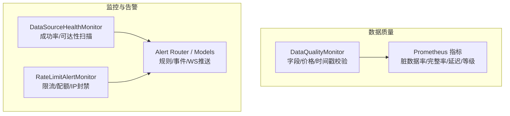
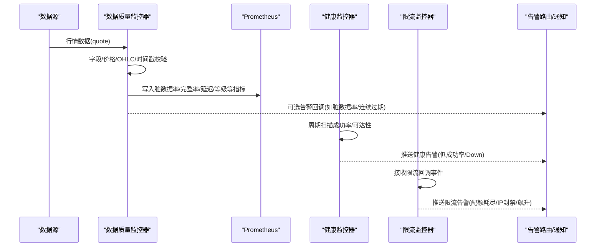
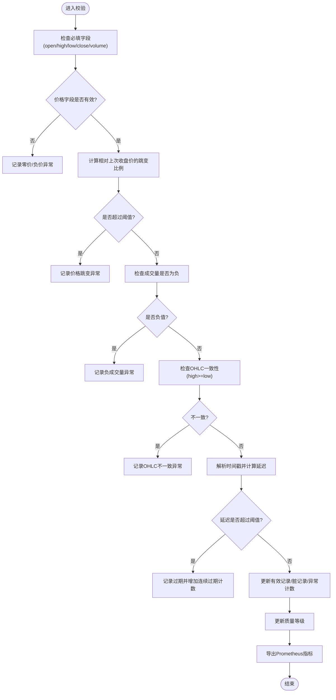
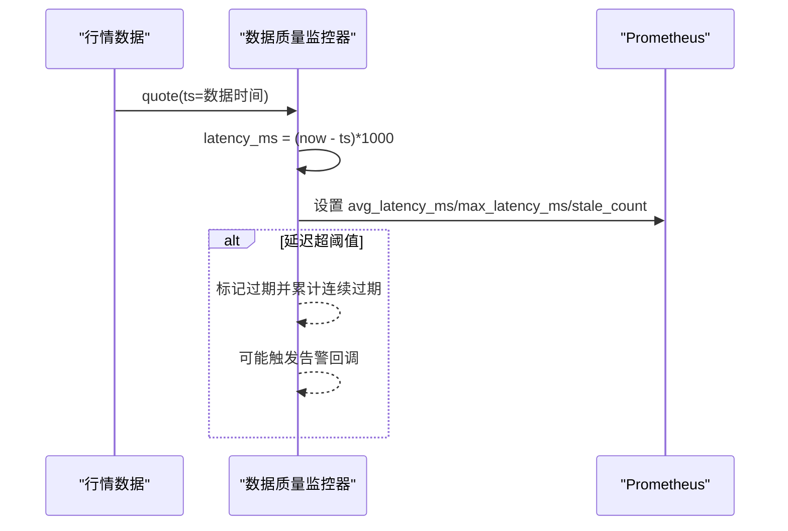
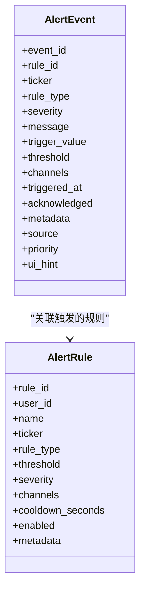
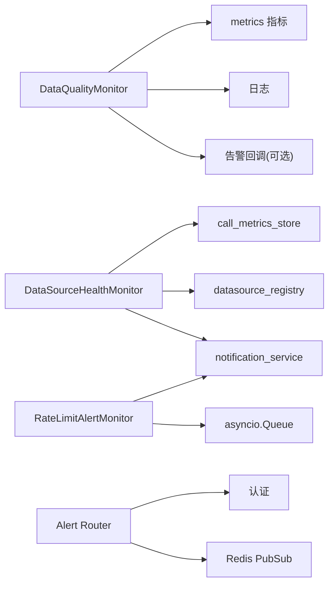

# 数据质量控制

<cite>
**本文引用的文件**
- [backend/services/data_quality/monitor.py](file://backend/services/data_quality/monitor.py)
- [backend/core/metrics.py](file://backend/core/metrics.py)
- [backend/core/alert_models.py](file://backend/core/alert_models.py)
- [backend/services/datasource/alert_monitor.py](file://backend/services/datasource/alert_monitor.py)
- [backend/services/datasource/health_monitor.py](file://backend/services/datasource/health_monitor.py)
- [backend/routers/alert.py](file://backend/routers/alert.py)
</cite>

## 目录
1. [简介](#简介)
2. [项目结构](#项目结构)
3. [核心组件](#核心组件)
4. [架构总览](#架构总览)
5. [详细组件分析](#详细组件分析)
6. [依赖关系分析](#依赖关系分析)
7. [性能考量](#性能考量)
8. [故障排查指南](#故障排查指南)
9. [结论](#结论)
10. [附录](#附录)

## 简介
本文件面向 Quant Agent 的数据质量控制体系，聚焦以下目标：
- 数据完整性检查机制：字段验证、范围校验与格式规范。
- 延迟监控系统：端到端延迟测量、阈值告警与性能分析。
- 数据一致性保证：分布式事务、冲突解决与最终一致性（结合系统现有能力给出落地建议）。
- 质量指标定义：准确率、完整性与时效性度量。
- 告警规则配置：异常检测、趋势分析与根因定位。

该体系以“实时校验 + 指标暴露 + 异步告警”为主线，覆盖从数据源接入到可观测性与告警的全链路。

## 项目结构
围绕数据质量与监控的关键代码分布在如下位置：
- 数据质量监控服务：按数据源维度对行情数据进行完整性、价格异常、时间戳新鲜度等检查，并输出 Prometheus 指标。
- 指标定义：集中定义各类 Prometheus 指标（含数据质量、延迟、限流、可用性、探针等）。
- 健康与限流告警：周期性扫描数据源成功率/可达性；在限流回调中检测高危场景并推送告警。
- 告警模型与路由：统一的告警规则/事件模型与 HTTP/WebSocket 接口。

**图表来源**
- [backend/services/data_quality/monitor.py:91-378](file://backend/services/data_quality/monitor.py#L91-L378)
- [backend/core/metrics.py:382-444](file://backend/core/metrics.py#L382-L444)
- [backend/services/datasource/health_monitor.py:55-257](file://backend/services/datasource/health_monitor.py#L55-L257)
- [backend/services/datasource/alert_monitor.py:42-292](file://backend/services/datasource/alert_monitor.py#L42-L292)
- [backend/routers/alert.py:51-211](file://backend/routers/alert.py#L51-L211)

**章节来源**
- [backend/services/data_quality/monitor.py:1-408](file://backend/services/data_quality/monitor.py#L1-L408)
- [backend/core/metrics.py:1-641](file://backend/core/metrics.py#L1-L641)
- [backend/services/datasource/health_monitor.py:1-257](file://backend/services/datasource/health_monitor.py#L1-L257)
- [backend/services/datasource/alert_monitor.py:1-292](file://backend/services/datasource/alert_monitor.py#L1-L292)
- [backend/routers/alert.py:1-211](file://backend/routers/alert.py#L1-L211)

## 核心组件
- 数据质量监控器（DataQualityMonitor）
  - 职责：逐条校验行情数据的字段完整性、价格范围与逻辑一致性、时间戳新鲜度；聚合脏数据率、完整率、平均/最大延迟、异常计数；计算质量等级；导出 Prometheus 指标；触发告警回调。
  - 关键能力：
    - 必填字段检查：open/high/low/close/volume。
    - 价格异常：零价、负价、跳变（相对上次收盘价超阈值）。
    - OHLC 一致性：high < low 视为严重异常。
    - 成交量异常：负值。
    - 时间戳新鲜度：计算端到端延迟（当前时间与数据时间差），超过阈值标记过期。
    - 质量等级：good/degraded/poor/unusable，基于脏数据率与连续过期次数。
    - 指标导出：脏数据率、完整率、记录数、异常计数、缺失字段、价格异常、过期次数、平均延迟、质量等级、校验结果计数。
- 数据源健康监控器（DataSourceHealthMonitor）
  - 职责：周期扫描各数据源的成功率与可达性，低于阈值或疑似 Down 时通过通知服务推送告警；内置去重冷却。
- 限流告警监控器（RateLimitAlertMonitor）
  - 职责：在 Throttler 回调中检测限流飙升、长时间退避、配额耗尽、IP 封禁等高危及异常场景，异步队列+后台消费推送告警，避免阻塞热路径。
- 指标中心（metrics）
  - 职责：集中定义数据质量、延迟、限流、可用性、探针、业务聚合等 Prometheus 指标，供 Grafana/Prometheus 采集。
- 告警模型与路由（alert_models + alert router）
  - 职责：统一规则/事件模型、评估函数；提供 REST 与 WebSocket 接口用于规则管理、事件查询与实时推送。

**章节来源**
- [backend/services/data_quality/monitor.py:91-378](file://backend/services/data_quality/monitor.py#L91-L378)
- [backend/services/datasource/health_monitor.py:55-257](file://backend/services/datasource/health_monitor.py#L55-L257)
- [backend/services/datasource/alert_monitor.py:42-292](file://backend/services/datasource/alert_monitor.py#L42-L292)
- [backend/core/metrics.py:382-444](file://backend/core/metrics.py#L382-L444)
- [backend/core/alert_models.py:28-278](file://backend/core/alert_models.py#L28-L278)
- [backend/routers/alert.py:51-211](file://backend/routers/alert.py#L51-L211)

## 架构总览
数据质量与监控的整体流程如下：
- 数据进入后由 DataQualityMonitor 进行完整性、范围与格式校验，统计异常并更新质量等级。
- 校验结果与指标写入 Prometheus，便于可视化与告警。
- 健康监控器与限流监控器分别扫描成功率/可达性与限流事件，必要时生成告警事件并通过通知服务推送。
- 告警路由提供规则管理与事件查询，WebSocket 支持实时推送。

**图表来源**
- [backend/services/data_quality/monitor.py:112-350](file://backend/services/data_quality/monitor.py#L112-L350)
- [backend/core/metrics.py:382-444](file://backend/core/metrics.py#L382-L444)
- [backend/services/datasource/health_monitor.py:101-236](file://backend/services/datasource/health_monitor.py#L101-L236)
- [backend/services/datasource/alert_monitor.py:77-211](file://backend/services/datasource/alert_monitor.py#L77-L211)
- [backend/routers/alert.py:148-211](file://backend/routers/alert.py#L148-L211)

## 详细组件分析

### 数据完整性检查机制
- 字段验证
  - 必填字段：open/high/low/close/volume；缺失则记录缺失字段并计入缺失计数。
- 范围校验
  - 价格非正（零价/负价）判定为严重异常。
  - 成交量负值判定为严重异常。
  - OHLC 逻辑一致性：high < low 视为严重异常。
- 格式规范
  - 时间戳需为数值型；若解析失败则忽略但继续处理其他字段。
- 跳变检测
  - 基于最近一次收盘价计算百分比跳变，超过阈值（默认 50%）记为警告。
- 时间戳新鲜度
  - 计算端到端延迟（当前时间 - 数据时间），超过阈值（默认 60 秒）记为过期并累计连续过期次数。

**图表来源**
- [backend/services/data_quality/monitor.py:112-250](file://backend/services/data_quality/monitor.py#L112-L250)

**章节来源**
- [backend/services/data_quality/monitor.py:84-250](file://backend/services/data_quality/monitor.py#L84-L250)

### 延迟监控系统
- 端到端延迟测量
  - 基于时间戳计算单条记录的延迟（毫秒），维护平均值与最大值。
  - 同时暴露市场级延迟指标（Summary/Histogram）用于整体延迟分布观察。
- 阈值告警
  - 单条延迟超过阈值（默认 60 秒）计为过期；连续 N 次过期触发告警。
  - 健康监控器按成功率阈值（默认 95%）与最小样本数判定劣化并告警。
- 性能分析
  - 通过 Prometheus 指标（延迟直方图、平均延迟、最大延迟、过期计数）在 Grafana 上绘制趋势与分位数，定位瓶颈。

**图表来源**
- [backend/services/data_quality/monitor.py:205-250](file://backend/services/data_quality/monitor.py#L205-L250)
- [backend/core/metrics.py:24-47](file://backend/core/metrics.py#L24-L47)
- [backend/core/metrics.py:382-444](file://backend/core/metrics.py#L382-L444)

**章节来源**
- [backend/services/data_quality/monitor.py:205-250](file://backend/services/data_quality/monitor.py#L205-L250)
- [backend/core/metrics.py:24-47](file://backend/core/metrics.py#L24-L47)
- [backend/core/metrics.py:382-444](file://backend/core/metrics.py#L382-L444)

### 数据一致性保证
- 分布式事务
  - 当前仓库未实现跨服务的分布式事务框架；建议在数据写入关键路径采用幂等写入与重试补偿，确保重复消息不破坏一致性。
- 冲突解决
  - 针对多源报价偏差，已有指标用于追踪偏差告警次数；可在接入层引入主备源选择策略（新鲜度优先）与偏差阈值告警。
- 最终一致性
  - 通过异步队列与后台消费（限流与健康告警）降低热路径压力，配合指标与日志实现可观测与回溯；对于快照/归档类任务，使用计数器与保留策略保障最终一致。

[本节为概念性说明，不直接分析具体文件]

### 质量指标定义
- 准确率
  - 可通过“有效记录/总记录”近似衡量；结合异常类型计数（价格异常、OHLC不一致）进一步细化。
- 完整性
  - 字段完整率 = 有效记录/总记录；缺失字段计数用于定位上游问题。
- 时效性
  - 平均延迟、最大延迟、过期次数；结合市场级延迟直方图观察分布。
- 质量等级
  - good/degraded/poor/unusable，依据脏数据率与连续过期次数动态调整。

**章节来源**
- [backend/services/data_quality/monitor.py:48-88](file://backend/services/data_quality/monitor.py#L48-L88)
- [backend/services/data_quality/monitor.py:258-268](file://backend/services/data_quality/monitor.py#L258-L268)
- [backend/core/metrics.py:382-444](file://backend/core/metrics.py#L382-L444)

### 告警规则配置
- 异常检测
  - 数据质量：脏数据率超阈值、连续过期次数超阈值。
  - 健康监控：成功率低于阈值且样本量足够；疑似 Down。
  - 限流监控：配额耗尽、IP 封禁、长时间退避、限流频率飙升。
- 趋势分析
  - 利用 Prometheus 指标（延迟直方图、错误计数、限流计数、可用性状态）在 Grafana 中构建趋势面板与 SLO 看板。
- 根因定位
  - 通过标签维度（source、symbol、action、error_type）下钻定位问题源；结合 WebSocket 实时推送与事件投递记录快速响应。

**图表来源**
- [backend/core/alert_models.py:81-142](file://backend/core/alert_models.py#L81-L142)

**章节来源**
- [backend/core/alert_models.py:28-278](file://backend/core/alert_models.py#L28-L278)
- [backend/routers/alert.py:57-132](file://backend/routers/alert.py#L57-L132)

## 依赖关系分析
- DataQualityMonitor 依赖 metrics 模块导出 Prometheus 指标；依赖日志与可选告警回调。
- DataSourceHealthMonitor 依赖调用指标存储与数据源注册表，周期扫描并推送告警。
- RateLimitAlertMonitor 依赖通知服务，异步队列解耦限流回调与网络 IO。
- Alert Router 依赖认证与 Redis PubSub 实现 WebSocket 实时推送。

**图表来源**
- [backend/services/data_quality/monitor.py:315-350](file://backend/services/data_quality/monitor.py#L315-L350)
- [backend/services/datasource/health_monitor.py:90-98](file://backend/services/datasource/health_monitor.py#L90-L98)
- [backend/services/datasource/alert_monitor.py:66-75](file://backend/services/datasource/alert_monitor.py#L66-L75)
- [backend/routers/alert.py:148-211](file://backend/routers/alert.py#L148-L211)

**章节来源**
- [backend/services/data_quality/monitor.py:315-350](file://backend/services/data_quality/monitor.py#L315-L350)
- [backend/services/datasource/health_monitor.py:90-98](file://backend/services/datasource/health_monitor.py#L90-L98)
- [backend/services/datasource/alert_monitor.py:66-75](file://backend/services/datasource/alert_monitor.py#L66-L75)
- [backend/routers/alert.py:148-211](file://backend/routers/alert.py#L148-L211)

## 性能考量
- 校验路径轻量：单条记录校验为 O(1)，仅维护 ticker→last_price 的字典与少量计数器。
- 指标导出批量：按 source 维度设置 Gauge/Counter，避免高频写放大。
- 告警异步化：限流与健康告警均使用 asyncio.Queue 与后台消费，避免阻塞热路径。
- 延迟分布：使用 Summary/Histogram 记录延迟分布，便于计算分位数与定位尾部延迟。

[本节提供通用指导，不直接分析具体文件]

## 故障排查指南
- 脏数据率高
  - 检查字段缺失与价格异常计数；确认时间戳是否普遍过期。
  - 查看 Prometheus 指标 DATA_QUALITY_DIRTY_RATE、DATA_QUALITY_MISSING_FIELDS、DATA_QUALITY_PRICE_ANOMALY。
- 延迟升高
  - 查看 DATA_QUALITY_LATENCY_MS 与市场延迟指标 MARKET_QUOTE_LATENCY；结合数据源动作（action）定位瓶颈。
- 健康告警频繁
  - 检查 DataSourceHealthMonitor 的扫描间隔与阈值；确认 call_metrics_store 中的成功率与样本量。
- 限流告警风暴
  - 检查 RateLimitAlertMonitor 的去重冷却与队列状态；确认 NotificationService 是否可用。
- 告警未推送
  - 检查 Alert Router 的 WebSocket 鉴权与 Redis PubSub 订阅；确认事件投递记录。

**章节来源**
- [backend/services/data_quality/monitor.py:258-350](file://backend/services/data_quality/monitor.py#L258-L350)
- [backend/services/datasource/health_monitor.py:101-236](file://backend/services/datasource/health_monitor.py#L101-L236)
- [backend/services/datasource/alert_monitor.py:77-211](file://backend/services/datasource/alert_monitor.py#L77-L211)
- [backend/routers/alert.py:148-211](file://backend/routers/alert.py#L148-L211)

## 结论
Quant Agent 的数据质量控制体系以“实时校验 + 指标暴露 + 异步告警”为核心，覆盖了字段完整性、价格范围、OHLC 一致性、时间戳新鲜度等关键维度，并通过 Prometheus 指标与 Grafana 可视化实现可观测性。健康监控与限流监控补齐了数据源可用性与限流异常的高危告警，告警模型与路由提供了灵活的规则管理与实时推送能力。建议在后续演进中强化分布式一致性策略与偏差治理，进一步完善根因定位与自愈回路。

[本节总结性内容，不直接分析具体文件]

## 附录
- 关键指标清单（部分）
  - 数据质量：脏数据率、完整率、总记录数、异常计数、缺失字段、价格异常、过期次数、平均延迟、质量等级、校验结果计数。
  - 延迟：市场报价延迟（Summary）、K线获取延迟（Histogram）、数据源请求延迟（Histogram）。
  - 限流：限流次数、退避秒数、估计/实际 RPM、退避策略状态。
  - 可用性：数据源可用性、主动拨测成功/延迟/失败。
  - 业务聚合：Facade 融合次数、报价偏差告警次数。

**章节来源**
- [backend/core/metrics.py:152-217](file://backend/core/metrics.py#L152-L217)
- [backend/core/metrics.py:304-444](file://backend/core/metrics.py#L304-L444)