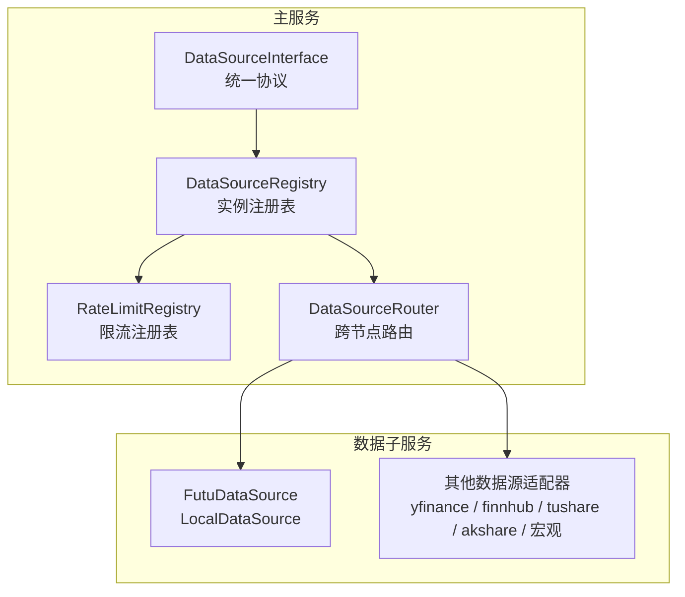
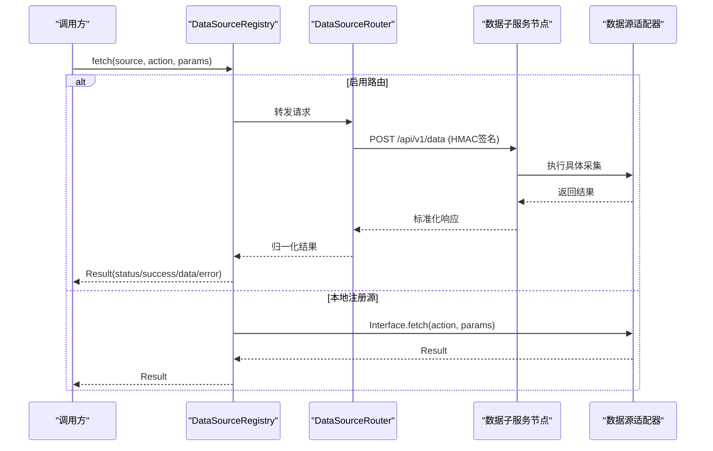
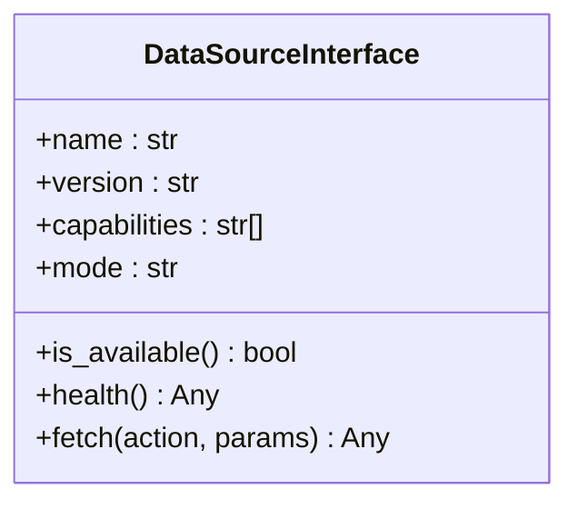
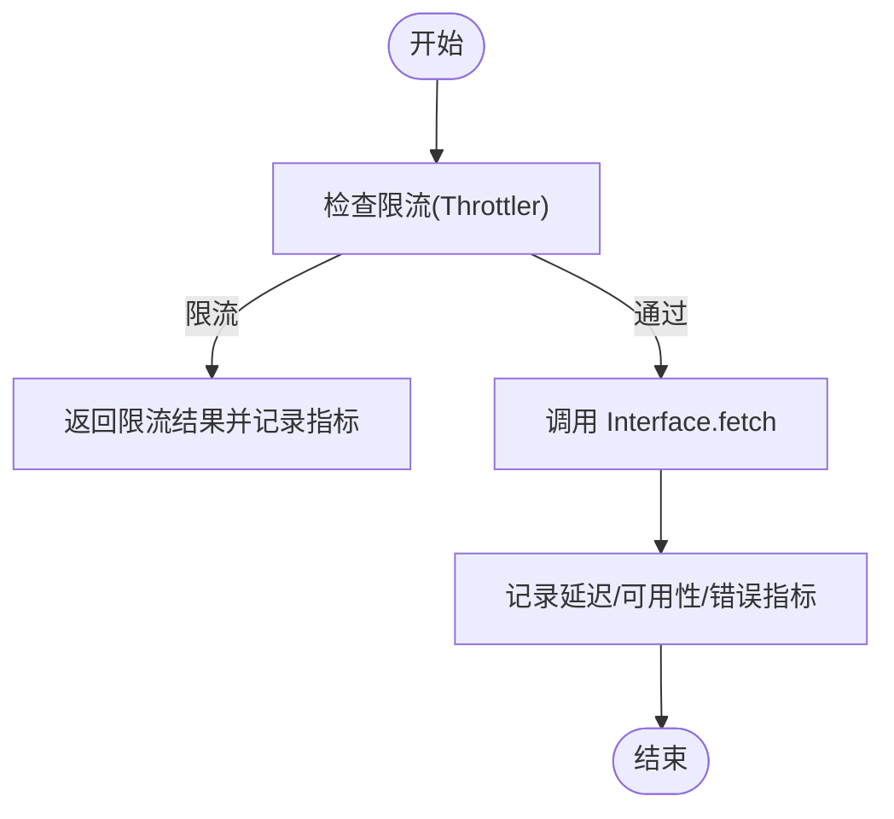
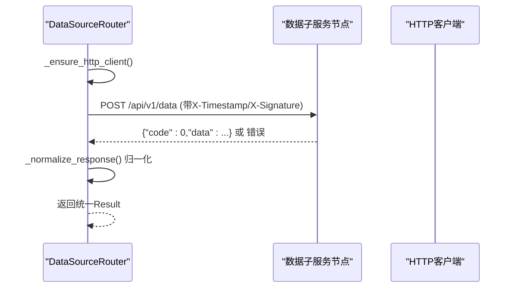
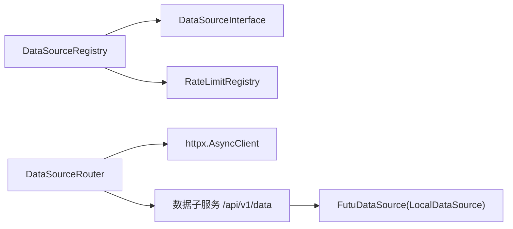

# 数据采集层

<cite>
**本文引用的文件**
- [backend/services/datasource/protocol.py](file://backend/services/datasource/protocol.py)
- [backend/services/datasource/source_registry.py](file://backend/services/datasource/source_registry.py)
- [backend/services/datasource/router.py](file://backend/services/datasource/router.py)
- [backend/services/datasource/registry.py](file://backend/services/datasource/registry.py)
- [data_subservice/futu_src/data_source.py](file://data_subservice/futu_src/data_source.py)
</cite>

## 目录
1. [简介](#简介)
2. [项目结构](#项目结构)
3. [核心组件](#核心组件)
4. [架构总览](#架构总览)
5. [详细组件分析](#详细组件分析)
6. [依赖关系分析](#依赖关系分析)
7. [性能考量](#性能考量)
8. [故障排查指南](#故障排查指南)
9. [结论](#结论)
10. [附录](#附录)

## 简介
本文件面向 Quant Agent 的数据采集层，聚焦多数据源适配器的统一接口设计、注册与路由机制、负载均衡与故障转移、健康检查、实时数据采集流程（WebSocket 连接管理与消息处理）、配置指南（API 密钥、速率限制、重试）以及监控指标定义（采集延迟、错误率、数据完整性）。文档以代码为依据，提供可追溯的章节来源与图示来源。

## 项目结构
数据采集层由“主服务侧”和“数据子服务侧”两部分组成：
- 主服务侧负责统一协议抽象、实例注册、限流与熔断、跨节点路由与健康探测。
- 数据子服务侧承载具体数据源的连接与采集实现（如 Futu OpenD、YFinance、Finnhub、Tushare/AKShare、宏观数据等），并通过统一 HTTP 端点对外暴露能力。

**图表来源**
- [backend/services/datasource/protocol.py:12-46](file://backend/services/datasource/protocol.py#L12-L46)
- [backend/services/datasource/source_registry.py:41-73](file://backend/services/datasource/source_registry.py#L41-L73)
- [backend/services/datasource/registry.py:29-99](file://backend/services/datasource/registry.py#L29-L99)
- [backend/services/datasource/router.py:249-579](file://backend/services/datasource/router.py#L249-L579)
- [data_subservice/futu_src/data_source.py:18-110](file://data_subservice/futu_src/data_source.py#L18-L110)

**章节来源**
- [backend/services/datasource/protocol.py:12-46](file://backend/services/datasource/protocol.py#L12-L46)
- [backend/services/datasource/source_registry.py:41-73](file://backend/services/datasource/source_registry.py#L41-L73)
- [backend/services/datasource/registry.py:29-99](file://backend/services/datasource/registry.py#L29-L99)
- [backend/services/datasource/router.py:249-579](file://backend/services/datasource/router.py#L249-L579)
- [data_subservice/futu_src/data_source.py:18-110](file://data_subservice/futu_src/data_source.py#L18-L110)

## 核心组件
- 统一协议 DataSourceInterface：定义 name/version/capabilities/mode/is_available/health/fetch 等标准方法，所有数据源必须遵循。
- 实例注册表 DataSourceRegistry：管理 DataSourceInterface 实例，提供按名称获取与 fetch 入口，集成限流与熔断。
- 限流注册表 RateLimitRegistry：为每个数据源维护 Throttler 与 Analyzer，支持退避与频率分析。
- 路由服务 DataSourceRouter：将主服务请求转发到数据子服务，实现多活、负载均衡、故障转移、健康检查与半开自愈探针。
- Futu 数据源抽象：在子服务内封装 LocalDataSource，直连 Futu OpenD，提供 is_available/status/fetch 等能力。

**章节来源**
- [backend/services/datasource/protocol.py:12-46](file://backend/services/datasource/protocol.py#L12-L46)
- [backend/services/datasource/source_registry.py:41-259](file://backend/services/datasource/source_registry.py#L41-L259)
- [backend/services/datasource/registry.py:29-99](file://backend/services/datasource/registry.py#L29-L99)
- [backend/services/datasource/router.py:249-800](file://backend/services/datasource/router.py#L249-L800)
- [data_subservice/futu_src/data_source.py:18-110](file://data_subservice/futu_src/data_source.py#L18-L110)

## 架构总览
数据采集层采用“协议抽象 + 注册表 + 路由”的分层设计：
- 上层业务通过 DataSourceRegistry.fetch(source_name, action, params) 发起请求。
- 若启用路由，则 DataSourceRouter 根据 source/action 映射选择目标数据子服务节点，进行签名、发送、响应归一化与错误分类。
- 数据子服务内部由各数据源适配器实现具体采集逻辑（如 Futu LocalDataSource 直连 OpenD）。

**图表来源**
- [backend/services/datasource/source_registry.py:140-259](file://backend/services/datasource/source_registry.py#L140-L259)
- [backend/services/datasource/router.py:669-748](file://backend/services/datasource/router.py#L669-L748)
- [data_subservice/futu_src/data_source.py:76-98](file://data_subservice/futu_src/data_source.py#L76-L98)

## 详细组件分析

### 统一接口设计（DataSourceInterface）
- 目的：屏蔽不同数据源差异，强制实现 name/version/capabilities/mode/is_available/health/fetch。
- 作用：确保 Router 与 Registry 对任何数据源具备一致的操作语义；capabilities 用于能力匹配与路由决策。

**图表来源**
- [backend/services/datasource/protocol.py:12-46](file://backend/services/datasource/protocol.py#L12-L46)

**章节来源**
- [backend/services/datasource/protocol.py:12-46](file://backend/services/datasource/protocol.py#L12-L46)

### 数据源注册机制（DataSourceRegistry）
- 注册：register(source, instance_id)，自动预热限流条目。
- 获取：get(source_name, action) 支持按 capability 严格匹配，避免误选不支持 action 的实例。
- 主路径 fetch：限流检查 → 熔断器保护 → 调用 Interface.fetch → 记录指标与状态。

**图表来源**
- [backend/services/datasource/source_registry.py:140-259](file://backend/services/datasource/source_registry.py#L140-L259)

**章节来源**
- [backend/services/datasource/source_registry.py:41-259](file://backend/services/datasource/source_registry.py#L41-L259)

### 限流与频率分析（RateLimitRegistry）
- 职责：为每个数据源名维护 Throttler（退避）与 Analyzer（频率统计）。
- 线程安全：使用锁保护 entries 字典。
- 使用方式：通过 get_throttler/get_analyzer 获取对应实例，供 Registry 或具体源调用。

**章节来源**
- [backend/services/datasource/registry.py:29-99](file://backend/services/datasource/registry.py#L29-L99)

### 路由策略与负载均衡（DataSourceRouter）
- 节点模型 DataSourceNode：包含 name/url/weight/status/last_heartbeat/error_count/circuit_breaker_until/capabilities 等字段，支持 action 级熔断隔离。
- 节点初始化：从环境变量读取各数据源远程 URL（支持逗号分隔多活），构建节点列表与 capabilities。
- 健康检查与自愈：后台半开探针周期性探测 unhealthy 或熔断中的节点，成功则恢复 healthy。
- 请求发送：统一 POST 到 /api/v1/data，携带 HMAC 签名；响应归一化为主服务内部格式。
- 错误分类：基于 HTTP 状态码与响应体文本推断 error_category（RATE_LIMIT/QUOTA_EXHAUSTED/IP_BLOCKED/NORMAL/DATA_UNAVAILABLE）。

**图表来源**
- [backend/services/datasource/router.py:669-748](file://backend/services/datasource/router.py#L669-L748)
- [backend/services/datasource/router.py:603-660](file://backend/services/datasource/router.py#L603-L660)

**章节来源**
- [backend/services/datasource/router.py:222-800](file://backend/services/datasource/router.py#L222-L800)

### 实时数据采集流程（WebSocket 与订阅）
- 子服务侧 Finnhub/Futu 等已下沉 WebSocket 连接与 tick 订阅逻辑，主服务通过 HTTP 调 source=finnhub/futu 获取数据，不直接持有 WS 客户端。
- 前端 WS 订阅回传通过 Futu 的 subscribe/unsubscribe action 通知 OpenD 实时订阅。

说明：本节为概念性描述，未直接分析具体源码文件。

[无图表来源]

### 数据源配置指南
- 环境变量（示例）：
  - DATA_SOURCE_ROUTER_ENABLED：是否启用路由
  - YF_PRIMARY_NODE_URL/YF_BACKUP_NODE_URL：YFinance 主备节点（支持逗号分隔多活）
  - AKSHARE_REMOTE_URL/TUSHARE_REMOTE_URL：北京节点远程地址
  - FUTU_REMOTE_URL/FMP_REMOTE_URL/FINNHUB_REMOTE_URL：主节点 data_subservice 地址
  - FRED_REMOTE_URL/DBNOMICS_REMOTE_URL/RBI_REMOTE_URL：宏观数据远程地址
  - DATA_SOURCE_HMAC_SECRET：节点间通信签名密钥（必须与子服务一致）
- 速率限制：
  - 通过 RateLimitRegistry 的 Throttler 控制退避；Analyzer 记录频率与类别。
- 重试机制：
  - 路由层依据 HTTP 状态码与响应头 Retry-After 推断错误类别与重试间隔；非限流错误计入健康统计但不触发退避恢复。

**章节来源**
- [backend/services/datasource/router.py:17-29](file://backend/services/datasource/router.py#L17-L29)
- [backend/services/datasource/router.py:446-579](file://backend/services/datasource/router.py#L446-L579)
- [backend/services/datasource/router.py:750-784](file://backend/services/datasource/router.py#L750-L784)
- [backend/services/datasource/registry.py:29-99](file://backend/services/datasource/registry.py#L29-L99)

### 监控指标定义
- 采集延迟：DATASOURCE_LATENCY（按 source/action 维度观察）
- 错误率：DATASOURCE_ERRORS（区分 rate_limit/network/circuit_open 等）
- 可用性：DATASOURCE_AVAILABILITY（标记源可用/不可用）
- 限流计数：DATASOURCE_RATE_LIMITS（按 category 维度）
- 业务指标：call_metrics.record_business 记录 success/rate_limited/error 及延迟

**章节来源**
- [backend/services/datasource/source_registry.py:18-23](file://backend/services/datasource/source_registry.py#L18-L23)
- [backend/services/datasource/source_registry.py:205-253](file://backend/services/datasource/source_registry.py#L205-L253)

## 依赖关系分析
- DataSourceRegistry 依赖 DataSourceInterface 协议与 RateLimitRegistry 限流能力。
- DataSourceRouter 依赖 httpx 进行 HTTP 调用，并与数据子服务通过统一端点交互。
- Futu 数据源在子服务内通过 LocalDataSource 直连 OpenD，对外暴露统一接口。

**图表来源**
- [backend/services/datasource/source_registry.py:140-259](file://backend/services/datasource/source_registry.py#L140-L259)
- [backend/services/datasource/router.py:662-748](file://backend/services/datasource/router.py#L662-L748)
- [data_subservice/futu_src/data_source.py:53-110](file://data_subservice/futu_src/data_source.py#L53-L110)

**章节来源**
- [backend/services/datasource/source_registry.py:140-259](file://backend/services/datasource/source_registry.py#L140-L259)
- [backend/services/datasource/router.py:662-748](file://backend/services/datasource/router.py#L662-L748)
- [data_subservice/futu_src/data_source.py:53-110](file://data_subservice/futu_src/data_source.py#L53-L110)

## 性能考量
- 连接复用：路由层使用 httpx.AsyncClient 连接池，限制最大连接数，减少握手开销。
- 限流与熔断：Registry 层通过 Throttler 避免加剧限流；Router 层支持 action 级熔断隔离，防止单 action 失败影响整节点。
- 健康探测：后台探针周期探测 unhealthy 节点，降低无效请求比例。
- 响应归一化：减少上层解析成本，避免嵌套信封导致的额外处理。

[本节为通用指导，无需特定文件来源]

## 故障排查指南
- 启动期自检：
  - 校验 REMOTE_URL 端口是否指向主服务自身而非子服务 8001，避免静默 404/connection refused。
  - HMAC 密钥缺失时立即报错，避免运行时 403 难以排查。
- 常见错误分类：
  - RATE_LIMIT：HTTP 429 或响应体命中限流关键词；应触发退避与限流计数。
  - QUOTA_EXHAUSTED/IP_BLOCKED：配额耗尽或 IP 被封；需关注外部服务配额与网络策略。
  - DATA_UNAVAILABLE：标的层面无数据（如 Yahoo 无数据）；不应计入普通失败。
- 探针与自愈：
  - 半开探针持续探测熔断/异常节点，成功则恢复 healthy；失败则维持状态并等待冷却到期。

**章节来源**
- [backend/services/datasource/router.py:250-284](file://backend/services/datasource/router.py#L250-L284)
- [backend/services/datasource/router.py:343-409](file://backend/services/datasource/router.py#L343-L409)
- [backend/services/datasource/router.py:190-219](file://backend/services/datasource/router.py#L190-L219)

## 结论
数据采集层通过统一协议、注册表与路由实现了多数据源的标准化接入与高可用调度。限流与熔断保障系统稳定性，健康探测提升自愈能力。结合明确的监控指标与配置指南，可有效支撑富途、Yahoo Finance、A股等多数据源的稳定采集与扩展。

[本节为总结，无需特定文件来源]

## 附录
- 关键环境变量清单与用途见“数据源配置指南”。
- 指标导出与监控面板建议结合 Prometheus/Grafana 进行可视化。
- 如需新增数据源，请实现 DataSourceInterface 并在 Registry 中注册；或通过 Router 接入数据子服务。

[本节为补充信息，无需特定文件来源]