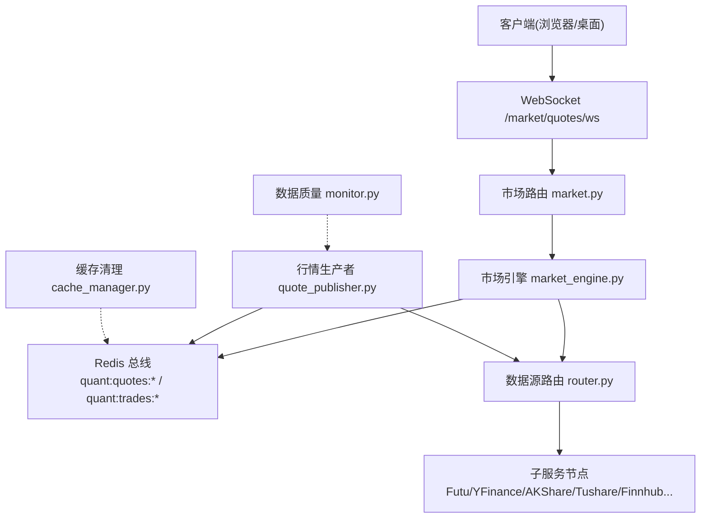
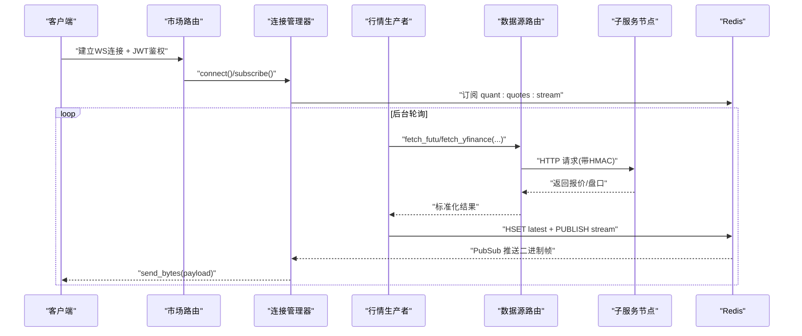
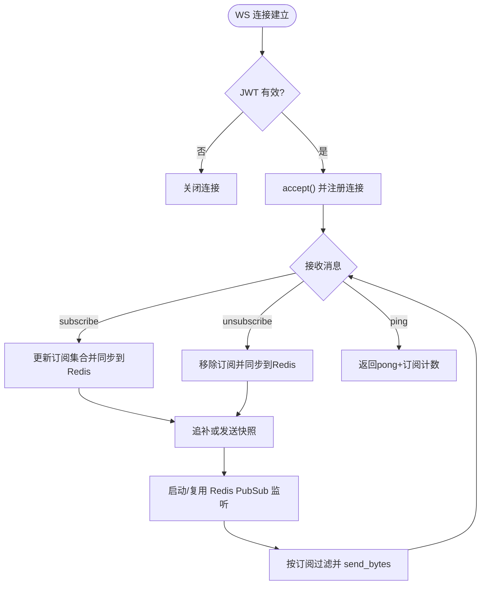
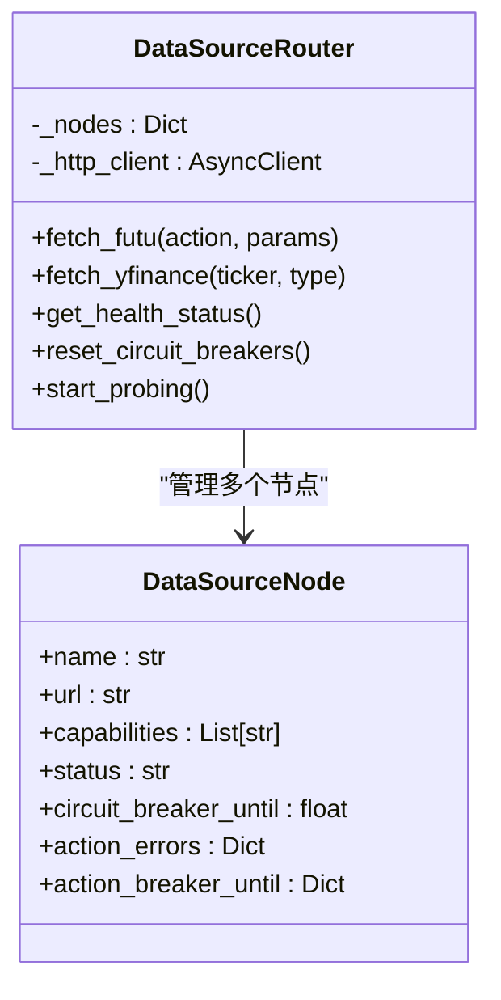
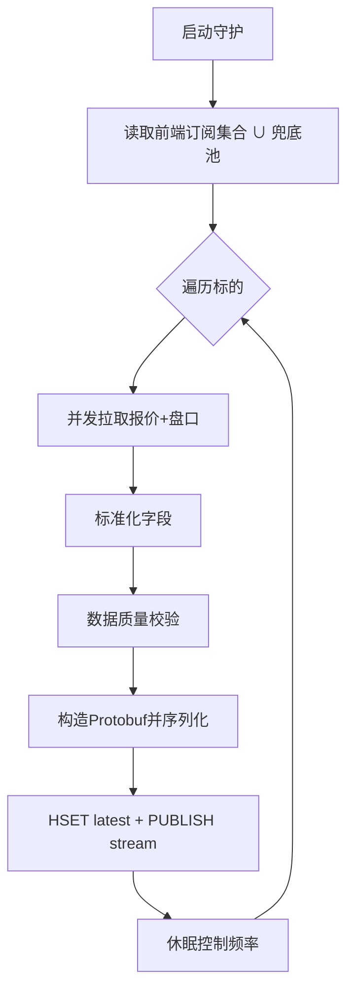
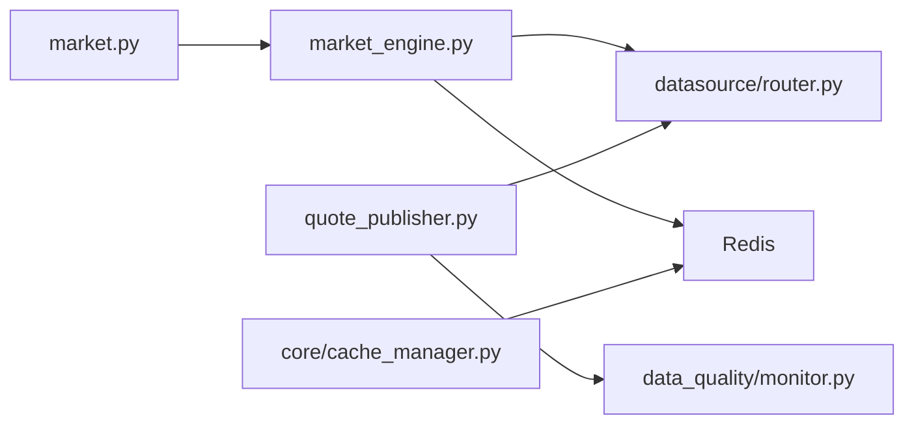

# 实时行情数据服务

<cite>
**本文引用的文件**
- [backend/services/market_engine.py](file://backend/services/market_engine.py)
- [backend/routers/market.py](file://backend/routers/market.py)
- [backend/workers/quote_publisher.py](file://backend/workers/quote_publisher.py)
- [backend/services/datasource/router.py](file://backend/services/datasource/router.py)
- [backend/core/cache_manager.py](file://backend/core/cache_manager.py)
- [backend/services/data_quality/monitor.py](file://backend/services/data_quality/monitor.py)
- [backend/app/market_data.py](file://backend/app/market_data.py)
</cite>

## 目录
1. [简介](#简介)
2. [项目结构](#项目结构)
3. [核心组件](#核心组件)
4. [架构总览](#架构总览)
5. [详细组件分析](#详细组件分析)
6. [依赖关系分析](#依赖关系分析)
7. [性能考量](#性能考量)
8. [故障诊断与排错指南](#故障诊断与排错指南)
9. [结论](#结论)
10. [附录：客户端接入示例](#附录客户端接入示例)

## 简介
本文件为 Quant Agent 的实时行情数据服务提供全面文档，覆盖市场引擎架构、WebSocket 连接管理、数据分发机制、缓存策略、性能优化、支持的数据源与数据级别（A 股、港股、美股、加密货币；Level 1 报价与 Level 2 盘口）、数据采集/清洗/标准化/推送流程、客户端接入示例、数据质量控制（异常检测、修复与回退）、监控指标与故障诊断方法。

## 项目结构
实时行情相关代码主要分布在以下模块：
- 路由层：FastAPI WebSocket/HTTP 接口，负责鉴权、订阅协议、健康检查等
- 市场引擎：连接管理、Redis 总线监听、背景轮询与兜底拉取、指标埋点
- 生产者守护：独立后台任务，按前端订阅集合动态拉取并写入 Redis 消息总线
- 数据源路由：跨节点路由、熔断/限流、HMAC 鉴权、多源降级
- 数据质量：校验 OHLCV、跳变、过期、脏数据率等，并暴露 Prometheus 指标
- 缓存清理：统一业务缓存清理工具，保护交易态数据不被误删

**图表来源**
- [backend/routers/market.py:73-226](file://backend/routers/market.py#L73-L226)
- [backend/services/market_engine.py:115-331](file://backend/services/market_engine.py#L115-L331)
- [backend/workers/quote_publisher.py:22-223](file://backend/workers/quote_publisher.py#L22-L223)
- [backend/services/datasource/router.py:249-800](file://backend/services/datasource/router.py#L249-L800)
- [backend/services/data_quality/monitor.py:91-350](file://backend/services/data_quality/monitor.py#L91-L350)
- [backend/core/cache_manager.py:47-75](file://backend/core/cache_manager.py#L47-L75)

**章节来源**
- [backend/routers/market.py:73-226](file://backend/routers/market.py#L73-L226)
- [backend/services/market_engine.py:115-331](file://backend/services/market_engine.py#L115-L331)
- [backend/workers/quote_publisher.py:22-223](file://backend/workers/quote_publisher.py#L22-L223)
- [backend/services/datasource/router.py:249-800](file://backend/services/datasource/router.py#L249-L800)
- [backend/services/data_quality/monitor.py:91-350](file://backend/services/data_quality/monitor.py#L91-L350)
- [backend/core/cache_manager.py:47-75](file://backend/core/cache_manager.py#L47-L75)

## 核心组件
- WebSocket 路由与鉴权：JWT 校验、心跳保活、订阅/反订阅协议、背压保护
- 连接管理器：维护活跃连接、订阅集合、Redis Pub/Sub 监听、追补与快照、指标埋点
- 行情生产者守护：按前端订阅集合动态轮询数据源，组装 Protobuf 并双写 Redis（最新快照 + 实时总线）
- 数据源路由：多节点负载均衡、熔断隔离、限流识别、HMAC 签名、离线模式与半开自愈探针
- 数据质量监控：OHLCV 完整性、价格异常、时间戳新鲜度、脏数据率与告警、Prometheus 指标导出
- 缓存清理：按前缀清理业务缓存，保护交易态 key

**章节来源**
- [backend/routers/market.py:73-226](file://backend/routers/market.py#L73-L226)
- [backend/services/market_engine.py:115-331](file://backend/services/market_engine.py#L115-L331)
- [backend/workers/quote_publisher.py:22-223](file://backend/workers/quote_publisher.py#L22-L223)
- [backend/services/datasource/router.py:249-800](file://backend/services/datasource/router.py#L249-L800)
- [backend/services/data_quality/monitor.py:91-350](file://backend/services/data_quality/monitor.py#L91-L350)
- [backend/core/cache_manager.py:47-75](file://backend/core/cache_manager.py#L47-L75)

## 架构总览
系统采用“生产者-消费者”解耦模型：
- 生产者（QuotePublisher）从数据源拉取数据，清洗后以 Protobuf 序列化写入 Redis 最新快照与实时总线
- 消费者（ConnectionManager）通过 Redis Pub/Sub 接收数据，按订阅过滤后推送到对应 WebSocket 连接
- 数据源路由屏蔽底层差异，提供统一 fetch 接口，具备熔断、限流、多活容灾能力
- 数据质量监控在写入前对数据进行校验，异常记录并暴露指标

**图表来源**
- [backend/routers/market.py:73-226](file://backend/routers/market.py#L73-L226)
- [backend/services/market_engine.py:296-331](file://backend/services/market_engine.py#L296-L331)
- [backend/workers/quote_publisher.py:90-158](file://backend/workers/quote_publisher.py#L90-L158)
- [backend/services/datasource/router.py:669-748](file://backend/services/datasource/router.py#L669-L748)

## 详细组件分析

### WebSocket 连接管理与数据分发
- 鉴权：从 QueryString 提取 JWT，校验失败直接关闭连接
- 心跳：服务端维护 last_heartbeat，超时自动断开
- 订阅：支持去重订阅，将 tickers 同步到 Redis 集合供生产者跟随
- 追补：新连接时根据 last_ids 通过 XRANGE 追补错过的逐笔成交；若无 last_id 则发送最新快照
- 分发：监听 Redis 频道，解析 Protobuf 获取 ticker，仅推送给订阅了该标的的连接
- 指标：统计活跃连接数、消息发送量、订阅数

**图表来源**
- [backend/routers/market.py:73-226](file://backend/routers/market.py#L73-L226)
- [backend/services/market_engine.py:174-268](file://backend/services/market_engine.py#L174-L268)
- [backend/services/market_engine.py:296-331](file://backend/services/market_engine.py#L296-L331)

**章节来源**
- [backend/routers/market.py:73-226](file://backend/routers/market.py#L73-L226)
- [backend/services/market_engine.py:174-268](file://backend/services/market_engine.py#L174-L268)
- [backend/services/market_engine.py:296-331](file://backend/services/market_engine.py#L296-L331)

### 数据源路由与多源降级
- 节点拓扑：YFinance 主备节点、AKShare/Tushare 北京单节点、Futu 主节点、Finnhub/FMP/宏观源等
- 动作映射：内部 action 到子服务 action 的映射表，统一封装调用
- 限流识别：基于 HTTP 状态码与响应头推断错误类别，识别限流并设置重试间隔
- 熔断隔离：action 级熔断计数与冷却，节点级兜底阈值避免误杀
- 半开自愈：后台探针周期探测 unhealthy 节点，恢复后复位
- HMAC 鉴权：请求体固定序列化并签名，防止篡改

**图表来源**
- [backend/services/datasource/router.py:222-247](file://backend/services/datasource/router.py#L222-L247)
- [backend/services/datasource/router.py:249-800](file://backend/services/datasource/router.py#L249-L800)

**章节来源**
- [backend/services/datasource/router.py:249-800](file://backend/services/datasource/router.py#L249-L800)

### 行情生产者守护与数据流水线
- 拉取：并发拉取报价与盘口（Level 2），兼容不同字段名
- 清洗：标准化 last_price/change_pct/volume_str/bids/asks/source
- 质量：调用数据质量监控器校验 OHLCV、跳变、过期等
- 序列化：构造 Protobuf QuoteData 并序列化为紧凑字节
- 双写：写入最新快照 HSET 与发布到实时总线 PUBLISH
- 守护：按前端订阅集合动态决定拉取标的，限流并发，控制频率

**图表来源**
- [backend/workers/quote_publisher.py:90-158](file://backend/workers/quote_publisher.py#L90-L158)
- [backend/workers/quote_publisher.py:166-223](file://backend/workers/quote_publisher.py#L166-L223)
- [backend/services/data_quality/monitor.py:112-256](file://backend/services/data_quality/monitor.py#L112-L256)

**章节来源**
- [backend/workers/quote_publisher.py:90-158](file://backend/workers/quote_publisher.py#L90-L158)
- [backend/workers/quote_publisher.py:166-223](file://backend/workers/quote_publisher.py#L166-L223)
- [backend/services/data_quality/monitor.py:112-256](file://backend/services/data_quality/monitor.py#L112-L256)

### 市场引擎背景任务与兜底策略
- 技术指标缓存：定时刷新，失败标的退避重试，避免请求风暴
- 资金流向缓存：低频数据 5 分钟粒度刷新，跳过不支持标的
- 账户快照：每 10 秒异步拉取真实资产
- 富途断连报警：当所有源失败时触发通知，提示已降级至 YFinance 轮询
- YFinance 兜底：仅在开关开启且节流条件下执行，失败也记录访问时间防下轮重试

**章节来源**
- [backend/services/market_engine.py:332-601](file://backend/services/market_engine.py#L332-L601)

### 数据质量控制机制
- 字段完整性：必填 OHLCV 非空
- 价格异常：零价/负价/跳变检测
- 成交量异常：负值检测
- OHLC 一致性：high < low 判定
- 时间戳新鲜度：超过阈值标记过期并累计
- 告警与指标：脏数据率、连续过期次数、延迟均值/最大值，导出 Prometheus

**章节来源**
- [backend/services/data_quality/monitor.py:91-350](file://backend/services/data_quality/monitor.py#L91-L350)

### 缓存策略与清理
- 最新快照：Redis Hash quant:quotes:latest 存储各标的最新 Protobuf 字节
- 实时总线：Redis Pub/Sub quant:quotes:stream 推送二进制帧
- 历史追补：Redis Stream quant:trades:stream:* 保留最近若干条用于断线追补
- 批量压缩：追补超阈值时组合成单一压缩帧减少网络开销
- 缓存清理：按前缀清理业务缓存，保护交易态 key 不被误删

**章节来源**
- [backend/services/market_engine.py:39-113](file://backend/services/market_engine.py#L39-L113)
- [backend/services/market_engine.py:201-243](file://backend/services/market_engine.py#L201-L243)
- [backend/core/cache_manager.py:47-75](file://backend/core/cache_manager.py#L47-L75)

## 依赖关系分析
- 路由层依赖市场引擎进行连接与分发
- 市场引擎依赖数据源路由进行多源拉取，依赖 Redis 进行消息总线与缓存
- 生产者守护依赖数据源路由与数据质量监控
- 数据源路由依赖子服务节点，具备熔断、限流、HMAC 鉴权能力
- 缓存清理工具与 Redis 交互，保护交易态数据

**图表来源**
- [backend/routers/market.py:73-226](file://backend/routers/market.py#L73-L226)
- [backend/services/market_engine.py:115-331](file://backend/services/market_engine.py#L115-L331)
- [backend/workers/quote_publisher.py:22-223](file://backend/workers/quote_publisher.py#L22-L223)
- [backend/services/datasource/router.py:249-800](file://backend/services/datasource/router.py#L249-L800)
- [backend/services/data_quality/monitor.py:91-350](file://backend/services/data_quality/monitor.py#L91-L350)
- [backend/core/cache_manager.py:47-75](file://backend/core/cache_manager.py#L47-L75)

**章节来源**
- [backend/routers/market.py:73-226](file://backend/routers/market.py#L73-L226)
- [backend/services/market_engine.py:115-331](file://backend/services/market_engine.py#L115-L331)
- [backend/workers/quote_publisher.py:22-223](file://backend/workers/quote_publisher.py#L22-L223)
- [backend/services/datasource/router.py:249-800](file://backend/services/datasource/router.py#L249-L800)
- [backend/services/data_quality/monitor.py:91-350](file://backend/services/data_quality/monitor.py#L91-L350)
- [backend/core/cache_manager.py:47-75](file://backend/core/cache_manager.py#L47-L75)

## 性能考量
- 二进制传输：使用 Protobuf 序列化减少体积，提升吞吐
- 批量压缩：追补超阈值时组合并压缩发送，降低带宽占用
- 限流并发：生产者守护使用信号量限制并发拉取，避免打满外部 API
- 节流水位：资金流向低频数据 5 分钟刷新，避免高频全量 gather
- 退避重试：失败标的记录尝试时间，按退避间隔重试，防止请求风暴
- 熔断隔离：action 级熔断与节点级兜底，避免单点故障扩散
- 指标埋点：实时统计延迟、陈旧度、总量、连接数、消息数，便于容量规划

[本节为通用性能指导，不直接分析具体文件]

## 故障诊断与排错指南
- WebSocket 鉴权失败：检查 JWT 是否有效、密钥配置是否正确
- 心跳超时：检查客户端是否按时发送 ping，服务端是否及时响应 pong
- 订阅未生效：确认 tickers 格式已被格式化，订阅集合已同步到 Redis
- 数据缺失：检查数据源路由是否启用、HMAC 密钥是否一致、子服务是否健康
- 限流/配额耗尽：查看错误分类与重试间隔，调整请求频率或扩容节点
- 富途断连：观察断连报警日志，确认已降级至 YFinance 轮询
- 缓存污染：使用缓存清理工具按前缀清理，注意保护交易态 key

**章节来源**
- [backend/routers/market.py:73-226](file://backend/routers/market.py#L73-L226)
- [backend/services/datasource/router.py:669-748](file://backend/services/datasource/router.py#L669-L748)
- [backend/services/market_engine.py:549-563](file://backend/services/market_engine.py#L549-L563)
- [backend/core/cache_manager.py:47-75](file://backend/core/cache_manager.py#L47-L75)

## 结论
本实时行情数据服务通过 WebSocket 与 Redis 总线实现高吞吐、低延迟的行情推送；借助数据源路由实现多源融合与稳健降级；通过数据质量监控保障数据可信可用；结合缓存与压缩优化性能；提供完善的监控与排错手段，满足 A 股、港股、美股、加密货币等多市场、Level 1/Level 2 数据的实时需求。

[本节为总结性内容，不直接分析具体文件]

## 附录：客户端接入示例
以下为客户端接入要点与步骤（不包含具体代码片段，路径引用见下方）：
- 建立 WebSocket 连接：访问 /market/quotes/ws，并在查询参数中携带 JWT token
- 订阅行情：发送 JSON 消息，包含 action=subscribe 与 tickers 列表；可附带 last_ids 用于断线追补
- 处理数据更新：服务端会推送二进制 Protobuf 帧，客户端需解析 QuoteData 获取最新价、涨跌幅、盘口等
- 自定义指标计算：基于收到的 tick/订单簿数据，在本地计算技术指标或策略信号
- 取消订阅：发送 action=unsubscribe 与 tickers 列表，释放资源
- 心跳保活：定期发送 action=ping，确保连接存活

参考路径：
- WebSocket 路由与协议：[backend/routers/market.py:73-226](file://backend/routers/market.py#L73-L226)
- 连接管理与追补逻辑：[backend/services/market_engine.py:174-268](file://backend/services/market_engine.py#L174-L268)
- 数据推送与分发：[backend/services/market_engine.py:296-331](file://backend/services/market_engine.py#L296-L331)
- 数据模型（Protobuf）：[backend/services/market_engine.py:39-113](file://backend/services/market_engine.py#L39-L113)

[本节为概念性接入说明，不直接分析具体文件]
