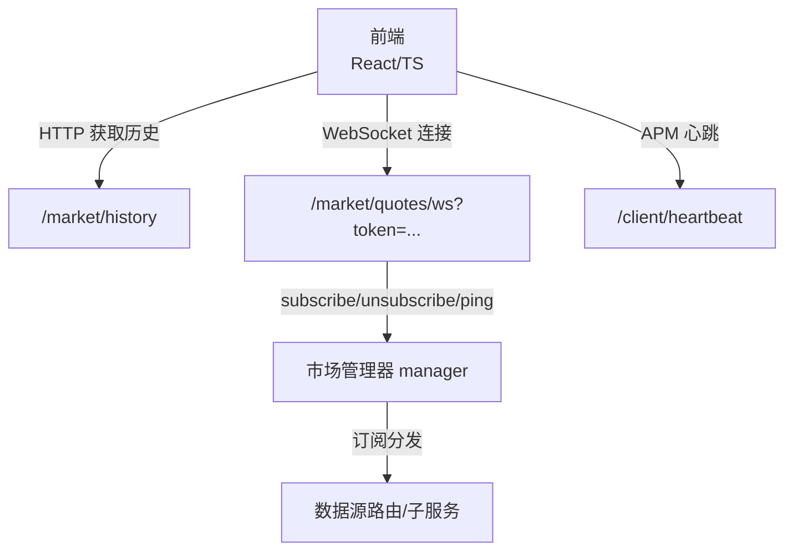
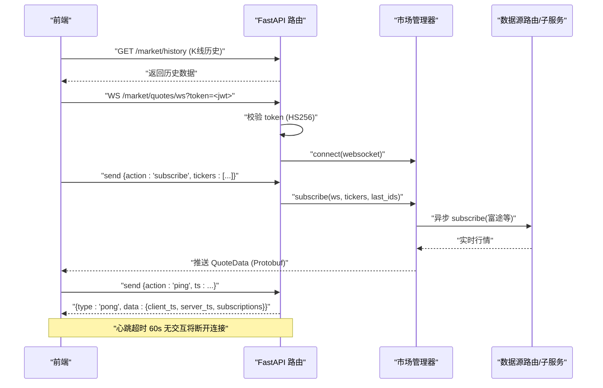
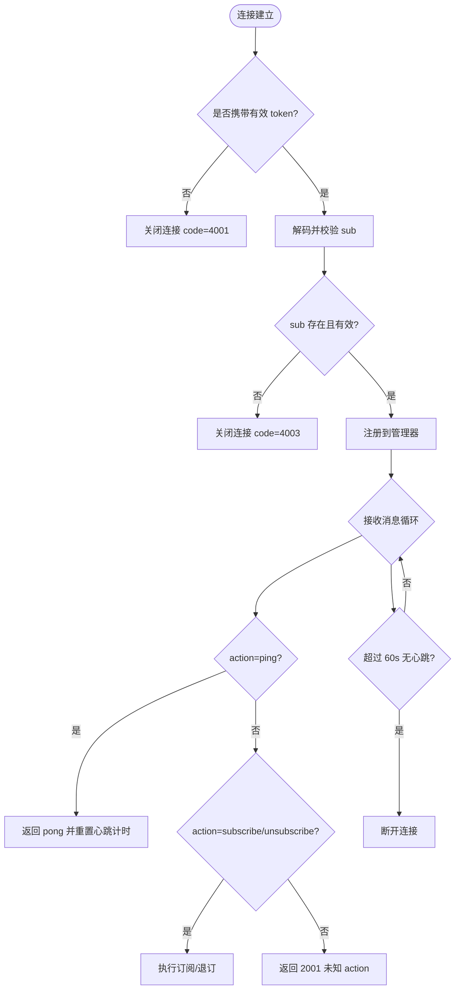
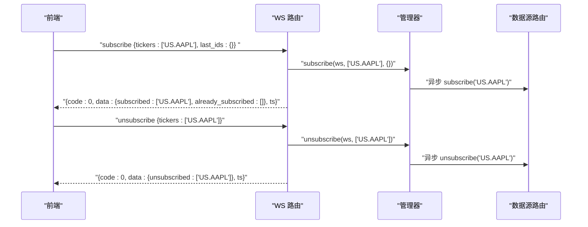
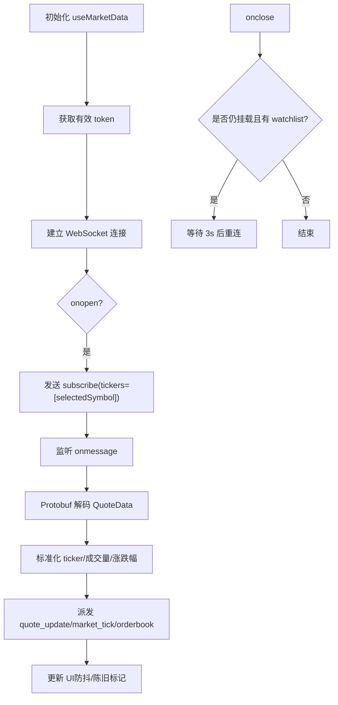
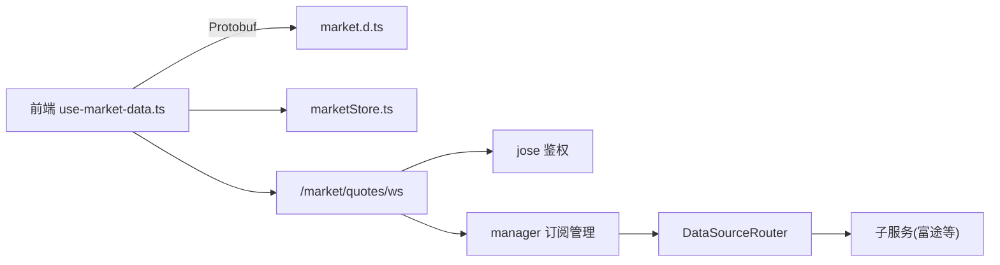

# 客户端接入指南

<cite>
**本文引用的文件**
- [backend/routers/market.py](file://backend/routers/market.py)
- [backend/tests/test_market_websocket_auth.py](file://backend/tests/test_market_websocket_auth.py)
- [frontend/src/hooks/use-market-data.ts](file://frontend/src/hooks/use-market-data.ts)
- [frontend/src/stores/marketStore.ts](file://frontend/src/stores/marketStore.ts)
- [backend/routers/client.py](file://backend/routers/client.py)
</cite>

## 目录
1. [简介](#简介)
2. [项目结构](#项目结构)
3. [核心组件](#核心组件)
4. [架构总览](#架构总览)
5. [详细组件分析](#详细组件分析)
6. [依赖关系分析](#依赖关系分析)
7. [性能考量](#性能考量)
8. [故障排查指南](#故障排查指南)
9. [结论](#结论)
10. [附录](#附录)

## 简介
本指南面向需要接入 Quant Agent 实时行情能力的客户端开发者，聚焦以下目标：
- 说明 WebSocket 连接建立过程、参数配置、认证机制与错误处理
- 解释订阅协议（标的代码格式、订阅/取消订阅消息、心跳保活）
- 提供完整的前端示例流程（连接、订阅、解析 Protobuf 数据、更新 UI）
- 说明增量更新、全量快照与断线重连策略
- 给出前端集成最佳实践（性能优化、内存管理、用户体验）
- 提供调试工具与方法（连接状态监控、消息日志、性能分析）
- 常见问题解决方案（连接失败、数据延迟、内存溢出等）

## 项目结构
本项目后端通过 FastAPI 暴露市场数据接口与 WebSocket 推送；前端使用 React + TypeScript，结合 Protobuf 解码与自定义事件驱动 UI 更新。关键路径：
- 后端 WebSocket 路由：/api/v1/market/quotes/ws
- 前端 WS 封装与订阅逻辑：useMarketData Hook
- 鉴权与心跳：JWT 校验、ping/pong 心跳、超时断开
- APM 心跳上报：/api/v1/client/heartbeat

图表来源
- [backend/routers/market.py:73-226](file://backend/routers/market.py#L73-L226)
- [frontend/src/hooks/use-market-data.ts:184-314](file://frontend/src/hooks/use-market-data.ts#L184-L314)
- [backend/routers/client.py:71-106](file://backend/routers/client.py#L71-L106)

章节来源
- [backend/routers/market.py:73-226](file://backend/routers/market.py#L73-L226)
- [frontend/src/hooks/use-market-data.ts:184-314](file://frontend/src/hooks/use-market-data.ts#L184-L314)
- [backend/routers/client.py:71-106](file://backend/routers/client.py#L71-L106)

## 核心组件
- WebSocket 服务端处理器：负责鉴权、心跳、订阅去重、消息分发与背压保护
- 前端 WS 客户端：自动获取 token、建立连接、发送订阅、解析 Protobuf 数据、触发 UI 更新
- 鉴权与心跳：基于 JWT 的查询串 token 校验；支持 ping/pong 与超时断开
- 数据源路由：对富途等特定标的进行单独通道订阅/退订
- APM 心跳上报：客户端定期上报 FPS、内存、WS 延迟、Web Vitals 等指标

章节来源
- [backend/routers/market.py:73-226](file://backend/routers/market.py#L73-L226)
- [frontend/src/hooks/use-market-data.ts:184-314](file://frontend/src/hooks/use-market-data.ts#L184-L314)
- [backend/routers/client.py:71-106](file://backend/routers/client.py#L71-L106)

## 架构总览
下图展示了从前端到后端的端到端数据流，包括鉴权、订阅、推送与心跳。

图表来源
- [backend/routers/market.py:73-226](file://backend/routers/market.py#L73-L226)
- [frontend/src/hooks/use-market-data.ts:184-314](file://frontend/src/hooks/use-market-data.ts#L184-L314)

## 详细组件分析

### WebSocket 连接与鉴权
- 连接地址：/api/v1/market/quotes/ws
- 鉴权方式：查询参数 token（JWT，HS256），必须包含 sub 字段
- 错误码约定：
  - 4001：缺少 token
  - 4002：token 无效或过期
  - 4003：token payload 缺少 sub
- 心跳保活：
  - 客户端可发送 ping 消息，服务端返回 pong，附带 client_ts、server_ts、subscriptions
  - 服务端维护最后心跳时间，超过 60 秒无交互则主动断开

图表来源
- [backend/routers/market.py:73-226](file://backend/routers/market.py#L73-L226)
- [backend/tests/test_market_websocket_auth.py:54-111](file://backend/tests/test_market_websocket_auth.py#L54-L111)

章节来源
- [backend/routers/market.py:73-226](file://backend/routers/market.py#L73-L226)
- [backend/tests/test_market_websocket_auth.py:54-111](file://backend/tests/test_market_websocket_auth.py#L54-L111)

### 订阅协议与消息规范
- 标的代码格式：
  - 服务端会自动将前端传入的混用格式统一转换为强前缀格式（如 US.AAPL、HK.00700 等）
  - 非富途标的走通用 Facade；富途相关标的经 DataSourceRouter 单独通道
- 订阅消息：
  - action: "subscribe"
  - tickers: 字符串或逗号分隔字符串，服务端会规范化为数组
  - last_ids: 可选，用于增量同步
- 取消订阅消息：
  - action: "unsubscribe"
  - tickers: 同上
- 心跳消息：
  - action: "ping"
  - ts: 客户端时间戳（毫秒）
  - 响应 type: "pong"，data 包含 client_ts、server_ts、subscriptions
- 响应信封：
  - code: 0 表示成功，其他为错误码
  - msg: 描述信息
  - data: 业务数据
  - ts: 服务器时间戳（毫秒）

图表来源
- [backend/routers/market.py:121-172](file://backend/routers/market.py#L121-L172)

章节来源
- [backend/routers/market.py:121-172](file://backend/routers/market.py#L121-L172)

### 前端实现与数据解析
- 连接建立：
  - 通过 getValidAccessToken() 获取有效 token
  - 拼接 wsUrl = `${getWsBaseUrl()}/api/v1/market/quotes/ws?token=` + token
  - 设置 binaryType = "arraybuffer"
- 订阅与取消：
  - onopen 时发送 subscribe，仅订阅当前聚焦 ticker
  - 组件卸载时发送 unsubscribe 并关闭连接
- 数据解析：
  - 使用 Protobuf market.QuoteData.decode 解析二进制消息
  - 兼容 lastPrice/last_price、changePct/change_pct、volumeStr/volume_str 等字段
  - 标准化 ticker（去除市场前缀/后缀）以匹配本地显示
- UI 更新：
  - 派发 CustomEvent 'quote_update'、'market_tick'、'orderbook'
  - 对当前聚焦 ticker 做防抖更新（间隔 300ms）与“陈旧”标记（30s 无更新）

图表来源
- [frontend/src/hooks/use-market-data.ts:184-314](file://frontend/src/hooks/use-market-data.ts#L184-L314)

章节来源
- [frontend/src/hooks/use-market-data.ts:184-314](file://frontend/src/hooks/use-market-data.ts#L184-L314)

### 数据更新处理（增量、快照、断线重连）
- 增量更新：
  - 服务端在 subscribe 时支持 last_ids 参数，便于客户端恢复增量序列
  - 前端在 onmessage 中按 ticker 更新最新价格、涨跌幅与成交量
- 全量快照：
  - 通过 /market/history 拉取 K 线历史作为初始展示
  - 对于自选列表，可通过 /market/quotes/batch 批量获取缓存快照
- 断线重连：
  - 前端 onclose 时若仍挂载且有 watchlist，则 3 秒后重连
  - 页面可见性变化或 keep-alive 状态切换时，后台隐藏则断开，恢复可见时重连
  - 服务端心跳超时 60s 无交互将断开，需客户端定时发送 ping

章节来源
- [backend/routers/market.py:73-226](file://backend/routers/market.py#L73-L226)
- [frontend/src/hooks/use-market-data.ts:184-314](file://frontend/src/hooks/use-market-data.ts#L184-L314)

### 前端集成最佳实践
- 性能优化：
  - 仅订阅当前聚焦 ticker，减少带宽与解码压力
  - 对 UI 更新做防抖（300ms），避免频繁渲染
  - 使用 Protobuf 二进制传输降低序列化开销
- 内存管理：
  - 组件卸载时及时取消订阅并关闭连接
  - 清理定时器与事件监听器，防止内存泄漏
- 用户体验：
  - 离线/弱网提示与降级（批量缓存快照）
  - “陈旧”标记提示数据可能滞后
  - 连接状态可视化（ws-status-indicator）

章节来源
- [frontend/src/hooks/use-market-data.ts:184-314](file://frontend/src/hooks/use-market-data.ts#L184-L314)

### 调试工具与方法
- 连接状态监控：
  - 前端记录 wsConnectedRef 与 onclose 日志（含 code/reason）
  - 后端记录用户连接/断开与异常堆栈
- 消息日志分析：
  - 捕获 JSON 解析错误与未知 action，返回 2001
  - 通过 ping/pong 计算往返延迟（client_ts vs server_ts）
- 性能分析：
  - 客户端 APM 心跳上报 FPS、内存、WS 延迟、Web Vitals（LCP/CLS/INP/TTFB）
  - 后端 Prometheus 指标统计（WS_MESSAGES_SENT）

章节来源
- [backend/routers/market.py:73-226](file://backend/routers/market.py#L73-L226)
- [backend/routers/client.py:71-106](file://backend/routers/client.py#L71-L106)

## 依赖关系分析
- 前端依赖：
  - Protobuf 定义 market.d.ts（QuoteData 解码）
  - 状态管理 store（当前 ticker）
- 后端依赖：
  - JWT 库（jose）用于鉴权
  - Redis 用于缓存与指标
  - 数据源路由（DataSourceRouter）与子服务（富途等）

图表来源
- [frontend/src/hooks/use-market-data.ts:184-314](file://frontend/src/hooks/use-market-data.ts#L184-L314)
- [backend/routers/market.py:73-226](file://backend/routers/market.py#L73-L226)

章节来源
- [frontend/src/hooks/use-market-data.ts:184-314](file://frontend/src/hooks/use-market-data.ts#L184-L314)
- [backend/routers/market.py:73-226](file://backend/routers/market.py#L73-L226)

## 性能考量
- 网络层：
  - 使用 Protobuf 二进制消息减少体积
  - 仅订阅必要 ticker，避免广播风暴
- 应用层：
  - 防抖 UI 更新，合并高频 tick
  - 批量缓存快照减少重复请求
- 资源层：
  - 页面不可见或后台时断开 WS，节省资源
  - 合理设置心跳超时，平衡保活与负载

[本节为通用指导，不直接分析具体文件]

## 故障排查指南
- 连接失败：
  - 检查 token 是否有效（4001/4002/4003）
  - 确认 getWsBaseUrl() 与网络可达
  - 查看 onclose 日志中的 code/reason
- 数据延迟：
  - 使用 ping/pong 计算 RTT
  - 检查服务端心跳是否被触发（last_heartbeat 重置）
  - 确认订阅去重未导致重复注册
- 内存溢出：
  - 确保组件卸载时关闭连接与清理监听
  - 避免在 onmessage 中创建大对象或闭包引用
- 鉴权问题：
  - 确认 SECRET_KEY 一致
  - 验证 JWT 包含 sub 字段

章节来源
- [backend/routers/market.py:73-226](file://backend/routers/market.py#L73-L226)
- [backend/tests/test_market_websocket_auth.py:54-111](file://backend/tests/test_market_websocket_auth.py#L54-L111)
- [frontend/src/hooks/use-market-data.ts:184-314](file://frontend/src/hooks/use-market-data.ts#L184-L314)

## 结论
通过统一的 WebSocket 接口与 Protobuf 数据格式，Quant Agent 提供了高效、可扩展的实时行情能力。客户端应遵循鉴权、心跳、订阅与重连的最佳实践，并结合 APM 心跳与日志进行持续监控与优化，以获得稳定低延迟的交易体验。

[本节为总结，不直接分析具体文件]

## 附录
- 常用端点参考：
  - WebSocket：/api/v1/market/quotes/ws?token=<jwt>
  - 历史 K 线：/market/history?ticker=&ktype=&num=
  - 批量快照：/market/quotes/batch
  - APM 心跳：/api/v1/client/heartbeat
- 错误码速查：
  - 4001：缺少 token
  - 4002：token 无效或过期
  - 4003：token payload 缺少 sub
  - 2001：JSON 解析错误或未知 action

章节来源
- [backend/routers/market.py:73-226](file://backend/routers/market.py#L73-L226)
- [backend/routers/client.py:71-106](file://backend/routers/client.py#L71-L106)
