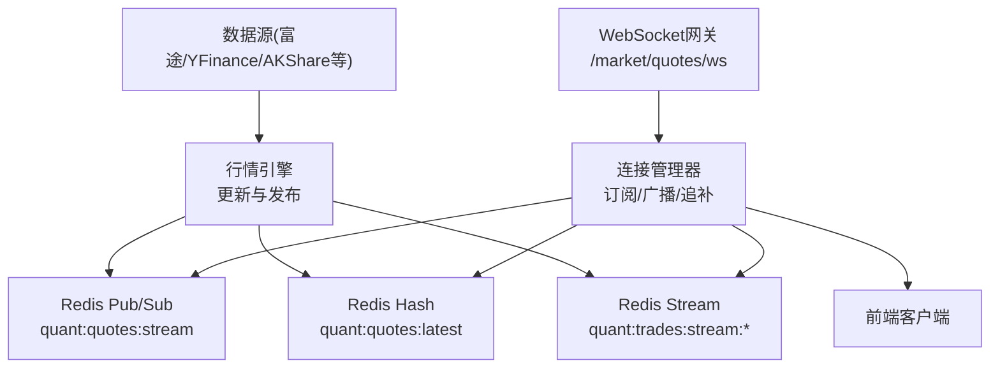
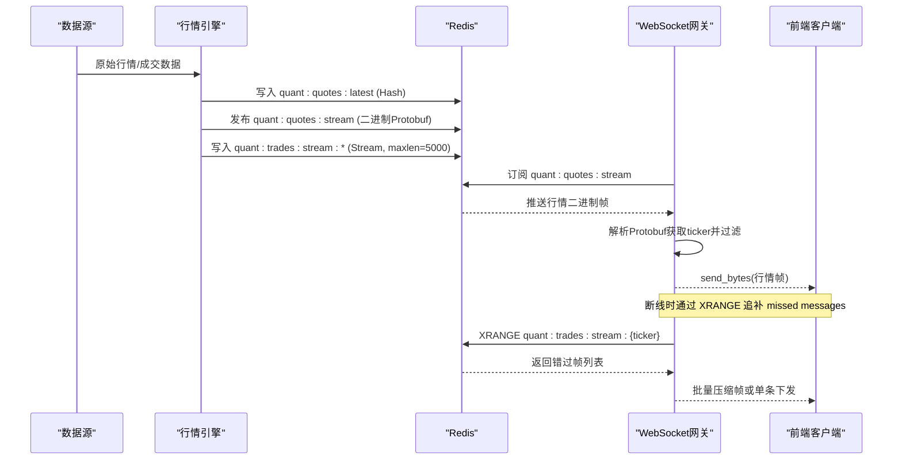
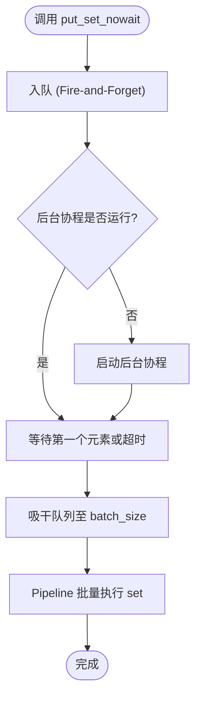
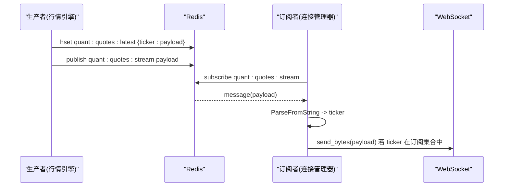
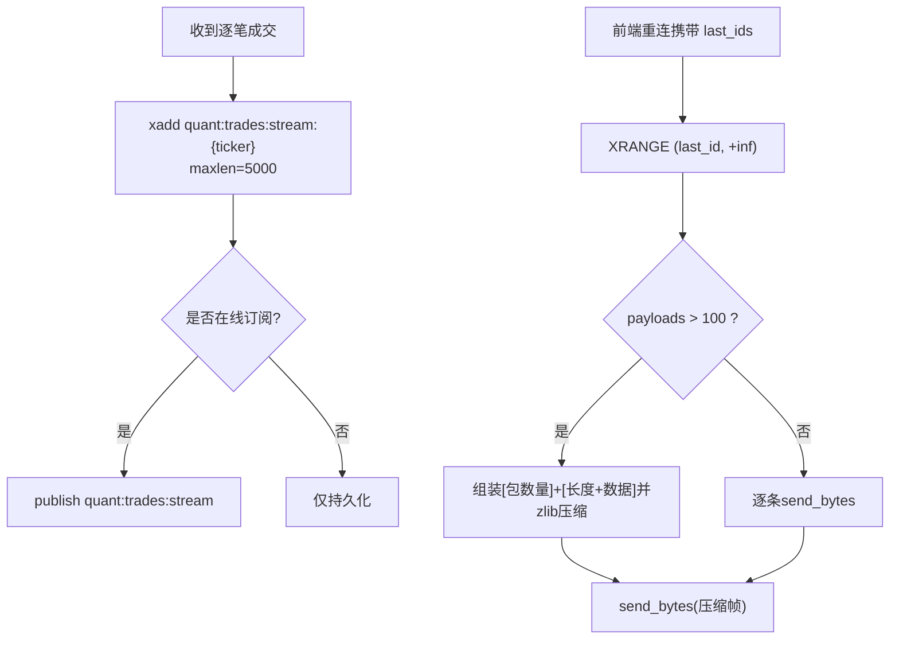
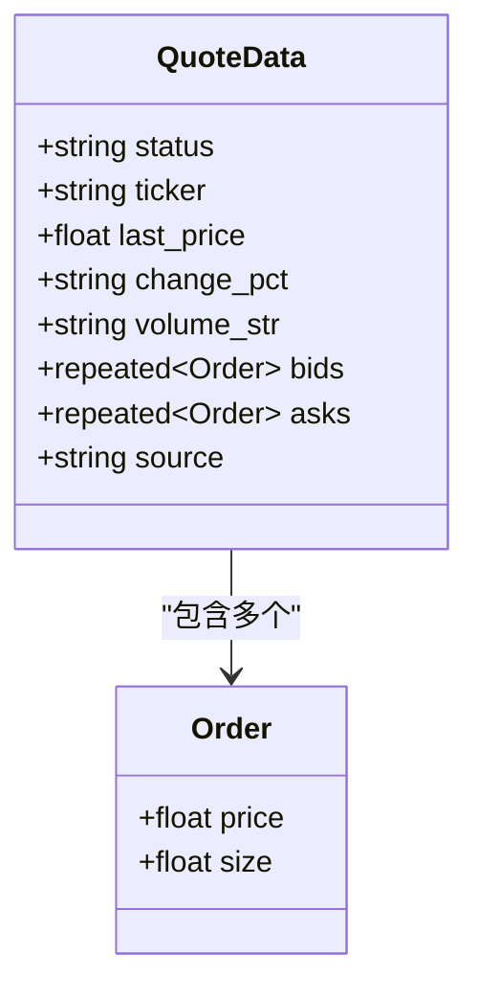
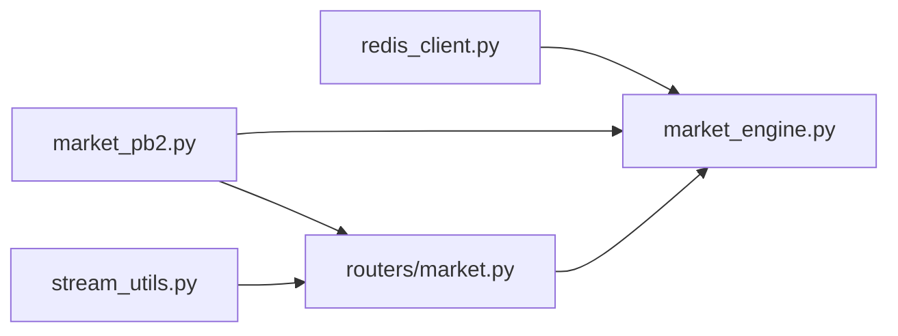

# Redis消息总线系统

<cite>
**本文引用的文件**
- [backend/core/redis_client.py](file://backend/core/redis_client.py)
- [backend/services/market_engine.py](file://backend/services/market_engine.py)
- [backend/routers/market.py](file://backend/routers/market.py)
- [shared/proto/market.proto](file://shared/proto/market.proto)
- [backend/core/proto/market_pb2.py](file://backend/core/proto/market_pb2.py)
- [backend/core/stream_utils.py](file://backend/core/stream_utils.py)
</cite>

## 目录
1. [简介](#简介)
2. [项目结构](#项目结构)
3. [核心组件](#核心组件)
4. [架构总览](#架构总览)
5. [详细组件分析](#详细组件分析)
6. [依赖关系分析](#依赖关系分析)
7. [性能考虑](#性能考虑)
8. [故障排查指南](#故障排查指南)
9. [结论](#结论)
10. [附录](#附录)

## 简介
本文件聚焦于Quant Agent的Redis消息总线系统，围绕实时行情推送与逐笔成交数据流转展开。内容涵盖：
- Redis Pub/Sub在实时行情中的角色、频道管理与路由策略
- Redis Stream在逐笔成交中的应用：持久化、断线追补与内存控制
- Protobuf序列化设计：Order与QuoteData结构、字段类型选择与版本兼容
- 消息分发策略：基于标的的代码过滤、批量发送优化与压缩传输
- 端到端数据流图：从数据源到前端客户端的完整链路
- 性能调优建议：连接池配置、内存限制与故障恢复策略

## 项目结构
与Redis消息总线相关的核心代码分布在以下模块：
- 连接与缓存基础设施：Redis连接池、异步批量写入器、进程内L1缓存
- 行情引擎：消息发布（Pub/Sub）、订阅监听、WebSocket管理、断线追补
- 协议定义：Protobuf消息结构（Order、QuoteData）
- 流式响应工具：心跳保活、断开检测与超时熔断
- 路由层：WebSocket接入、鉴权、订阅/退订、心跳与回传

图表来源
- [backend/services/market_engine.py:39-113](file://backend/services/market_engine.py#L39-L113)
- [backend/services/market_engine.py:191-244](file://backend/services/market_engine.py#L191-L244)
- [backend/routers/market.py:73-226](file://backend/routers/market.py#L73-L226)

章节来源
- [backend/core/redis_client.py:11-34](file://backend/core/redis_client.py#L11-L34)
- [backend/services/market_engine.py:115-146](file://backend/services/market_engine.py#L115-L146)
- [backend/routers/market.py:73-226](file://backend/routers/market.py#L73-L226)

## 核心组件
- Redis连接与批量写入
  - 全局连接池：统一配置主机、端口、密码、最大连接数，强制RESP2协议以兼容旧版redis-py
  - 异步批量写入器：将高频set操作聚合为Pipeline批量提交，降低RTT与带宽占用；支持优雅停机与队列排空
  - 进程内L1缓存：短效本地字典缓存热点Key，带定时清理与容量熔断，避免极端高频读取打满网络
- 行情引擎（ConnectionManager）
  - 发布：将行情序列化为Protobuf后写入Hash最新快照，并通过Pub/Sub广播
  - 订阅监听：持续监听行情频道，解析Protobuf提取ticker进行过滤，仅推送给本机关注该标的的WebSocket连接
  - 断线追补：通过XRANGE按last_id拉取错过的Stream消息，超过阈值时采用批量+压缩帧一次性下发
  - 背景轮询：定时拉取兜底数据并写回Redis，保障无连接时仍维持最新快照
- WebSocket路由
  - 鉴权、心跳、订阅去重、反订阅释放槽位、回传子服务订阅状态
- Protobuf协议
  - Order：价格与数量
  - QuoteData：状态、标的、最新价、涨跌幅、成交量字符串、买卖盘口、数据来源

章节来源
- [backend/core/redis_client.py:22-34](file://backend/core/redis_client.py#L22-L34)
- [backend/core/redis_client.py:46-177](file://backend/core/redis_client.py#L46-L177)
- [backend/core/redis_client.py:184-251](file://backend/core/redis_client.py#L184-L251)
- [backend/services/market_engine.py:39-113](file://backend/services/market_engine.py#L39-L113)
- [backend/services/market_engine.py:191-244](file://backend/services/market_engine.py#L191-L244)
- [shared/proto/market.proto:5-21](file://shared/proto/market.proto#L5-L21)

## 架构总览
下图展示从数据源到前端的完整链路：数据源经行情引擎统一序列化为Protobuf，写入Redis Hash作为最新快照，同时通过Pub/Sub广播；WebSocket网关订阅频道并按标的过滤推送；对逐笔成交使用Redis Stream持久化，支持断线追补与批量压缩下发。

图表来源
- [backend/services/market_engine.py:39-113](file://backend/services/market_engine.py#L39-L113)
- [backend/services/market_engine.py:191-244](file://backend/services/market_engine.py#L191-L244)
- [backend/routers/market.py:73-226](file://backend/routers/market.py#L73-L226)

## 详细组件分析

### Redis连接与缓存（连接池、批量写入、L1缓存）
- 连接池
  - 统一环境变量配置，设置最大连接数，强制RESP2协议
  - 提供全局client供各模块复用，避免重复创建连接
- 异步批量写入器
  - 后台协程消费队列，按批次大小与时间窗口触发Pipeline批量提交
  - 优雅停机：取消任务、强制flush_all、渐进等待队列清空
  - 异常处理：捕获事件循环销毁等致命错误并安全退出
- L1缓存
  - 本地字典缓存热点Key，默认TTL与最大容量可配
  - 后台定时清理过期条目，容量超限自动熔断清空
  - 写路径同步远端Redis并立即更新本地，保证一致性

图表来源
- [backend/core/redis_client.py:46-177](file://backend/core/redis_client.py#L46-L177)

章节来源
- [backend/core/redis_client.py:11-34](file://backend/core/redis_client.py#L11-L34)
- [backend/core/redis_client.py:46-177](file://backend/core/redis_client.py#L46-L177)
- [backend/core/redis_client.py:184-251](file://backend/core/redis_client.py#L184-L251)

### 行情发布与订阅（Pub/Sub + Hash快照）
- 发布流程
  - 构造QuoteData与Order，序列化为二进制
  - 写入Hash键“quant:quotes:latest”保存每只标的最新快照
  - 通过“quant:quotes:stream”频道广播二进制帧
- 订阅监听
  - 持续监听频道，解析Protobuf提取ticker
  - 仅向本机订阅了该ticker的WebSocket连接发送二进制帧
  - 指标埋点：统计消息发送量、行情延迟与新鲜度

图表来源
- [backend/services/market_engine.py:39-113](file://backend/services/market_engine.py#L39-L113)
- [backend/services/market_engine.py:296-331](file://backend/services/market_engine.py#L296-L331)

章节来源
- [backend/services/market_engine.py:39-113](file://backend/services/market_engine.py#L39-L113)
- [backend/services/market_engine.py:296-331](file://backend/services/market_engine.py#L296-L331)

### 逐笔成交与断线追补（Redis Stream）
- 双写策略
  - 写入Stream键“quant:trades:stream:{ticker}”，maxlen=5000控制内存上限
  - 同时通过“quant:trades:stream”频道广播当前在线用户
- 断线追补
  - 前端携带last_ids，服务端通过XRANGE查询(last_id, +inf]区间
  - 收集payloads，超过阈值时打包为二进制Batch帧并zlib压缩，首字节标识压缩模式
  - 未达阈值则逐条下发

图表来源
- [backend/services/market_engine.py:103-113](file://backend/services/market_engine.py#L103-L113)
- [backend/services/market_engine.py:201-244](file://backend/services/market_engine.py#L201-L244)

章节来源
- [backend/services/market_engine.py:103-113](file://backend/services/market_engine.py#L103-L113)
- [backend/services/market_engine.py:201-244](file://backend/services/market_engine.py#L201-L244)

### Protobuf序列化设计（Order与QuoteData）
- Order
  - price: float，表示价格
  - size: float，表示数量
- QuoteData
  - status: string，状态
  - ticker: string，标的代码
  - last_price: float，最新价
  - change_pct: string，涨跌幅百分比字符串
  - volume_str: string，成交量字符串
  - bids: repeated Order，买盘
  - asks: repeated Order，卖盘
  - source: string，数据来源
- 版本兼容
  - 使用proto3语法，新增字段向后兼容
  - 生成代码校验运行时版本，确保编译与运行环境一致

图表来源
- [shared/proto/market.proto:5-21](file://shared/proto/market.proto#L5-L21)
- [backend/core/proto/market_pb2.py:20-33](file://backend/core/proto/market_pb2.py#L20-L33)

章节来源
- [shared/proto/market.proto:1-22](file://shared/proto/market.proto#L1-L22)
- [backend/core/proto/market_pb2.py:1-34](file://backend/core/proto/market_pb2.py#L1-L34)

### 消息分发策略（标的过滤、批量优化、压缩传输）
- 标的过滤
  - 解析Protobuf获取ticker，仅推送给订阅集合中包含该ticker的连接
- 批量发送优化
  - 追补场景下，当错过消息超过阈值时，将多条消息打包为单一二进制帧，减少TCP往返
- 压缩传输机制
  - 批量帧采用zlib压缩，首字节标记压缩模式，前端需识别解压
- 心跳与保活
  - WebSocket层实现ping/pong心跳，超时断开；流式响应封装心跳保活，避免反向代理中断长连接

章节来源
- [backend/services/market_engine.py:296-331](file://backend/services/market_engine.py#L296-L331)
- [backend/services/market_engine.py:201-244](file://backend/services/market_engine.py#L201-L244)
- [backend/routers/market.py:73-226](file://backend/routers/market.py#L73-L226)
- [backend/core/stream_utils.py:21-77](file://backend/core/stream_utils.py#L21-L77)

### WebSocket接入与订阅管理
- 鉴权：从Query String提取JWT并解码，失败则关闭连接
- 订阅/退订：去重注册，回传子服务以真正订阅/退订底层通道
- 心跳：维护最后心跳时间，超时主动断开
- 指标：统计活跃连接、消息发送量与订阅数

章节来源
- [backend/routers/market.py:73-226](file://backend/routers/market.py#L73-L226)

## 依赖关系分析
- 模块耦合
  - market_engine依赖redis_client提供的连接与缓存能力
  - routers/market依赖market_engine的ConnectionManager进行WS生命周期管理
  - 所有模块共享Protobuf生成的市场消息结构
- 外部依赖
  - redis.asyncio用于异步连接与Pub/Sub/Stream操作
  - FastAPI WebSocket用于接入前端
  - google.protobuf用于序列化与运行时版本校验

图表来源
- [backend/core/redis_client.py:11-34](file://backend/core/redis_client.py#L11-L34)
- [backend/services/market_engine.py:24-35](file://backend/services/market_engine.py#L24-L35)
- [backend/routers/market.py:24-30](file://backend/routers/market.py#L24-L30)
- [backend/core/proto/market_pb2.py:20-33](file://backend/core/proto/market_pb2.py#L20-L33)
- [backend/core/stream_utils.py:21-77](file://backend/core/stream_utils.py#L21-L77)

章节来源
- [backend/core/redis_client.py:11-34](file://backend/core/redis_client.py#L11-L34)
- [backend/services/market_engine.py:24-35](file://backend/services/market_engine.py#L24-L35)
- [backend/routers/market.py:24-30](file://backend/routers/market.py#L24-L30)
- [backend/core/proto/market_pb2.py:20-33](file://backend/core/proto/market_pb2.py#L20-L33)
- [backend/core/stream_utils.py:21-77](file://backend/core/stream_utils.py#L21-L77)

## 性能考虑
- 连接池配置
  - REDIS_MAX_CONNECTIONS：根据并发连接数与下游Redis容量设定，避免无上限导致资源耗尽
  - 强制RESP2协议：提升与旧版redis-py兼容性，减少协议切换开销
- 内存限制
  - Stream maxlen=5000：防止无限增长，保留最近N条用于断线追补
  - L1缓存容量：达到上限自动熔断清空，避免内存泄漏
  - 批量帧阈值：超过100条启用压缩，降低带宽占用
- 故障恢复
  - 优雅停机：批量写入器在停止时强制flush_all，确保不丢数据
  - 心跳与超时：WebSocket与流式响应均具备心跳与超时熔断，避免僵尸连接
  - 降级与兜底：行情引擎定期轮询兜底数据，保障无连接时Redis快照可用

章节来源
- [backend/core/redis_client.py:22-34](file://backend/core/redis_client.py#L22-L34)
- [backend/core/redis_client.py:46-177](file://backend/core/redis_client.py#L46-L177)
- [backend/core/redis_client.py:184-251](file://backend/core/redis_client.py#L184-L251)
- [backend/services/market_engine.py:103-113](file://backend/services/market_engine.py#L103-L113)
- [backend/services/market_engine.py:201-244](file://backend/services/market_engine.py#L201-L244)
- [backend/core/stream_utils.py:21-77](file://backend/core/stream_utils.py#L21-L77)

## 故障排查指南
- 行情无法推送
  - 检查Redis连接池与认证配置是否正确
  - 确认行情引擎已启动background tasks（pubsub_listener与broadcast_loop）
  - 验证WebSocket订阅集合是否包含目标ticker
- 断线后无追补
  - 确认Stream键存在且maxlen合理
  - 检查XRANGE查询参数是否正确（last_id格式）
  - 验证批量压缩帧的首字节标识与前端解压逻辑匹配
- 内存增长异常
  - 检查L1缓存容量与清理任务是否正常
  - 确认Stream maxlen限制生效
  - 监控Redis内存与连接数，必要时调整REDIS_MAX_CONNECTIONS

章节来源
- [backend/services/market_engine.py:160-173](file://backend/services/market_engine.py#L160-L173)
- [backend/services/market_engine.py:201-244](file://backend/services/market_engine.py#L201-L244)
- [backend/core/redis_client.py:184-251](file://backend/core/redis_client.py#L184-L251)

## 结论
本系统通过Redis Pub/Sub与Stream的组合，实现了低延迟的实时行情推送与可靠的逐笔成交持久化。结合Protobuf高效序列化、标的级过滤与批量压缩传输，在保证性能的同时兼顾了可扩展性与容错性。配合连接池、内存限制与心跳保活等机制，可在高并发场景下稳定运行。

## 附录
- 关键频道与键名
  - 行情发布频道：quant:quotes:stream
  - 最新快照Hash：quant:quotes:latest
  - 逐笔成交流：quant:trades:stream:{ticker}
  - 交易频道：quant:trades:stream
- 前端交互要点
  - WebSocket鉴权：token在Query String中传递
  - 订阅消息：action=subscribe，携带tickers与last_ids
  - 心跳：action=ping，服务器返回pong并附带服务器时间戳

章节来源
- [backend/routers/market.py:73-226](file://backend/routers/market.py#L73-L226)
- [backend/services/market_engine.py:39-113](file://backend/services/market_engine.py#L39-L113)
- [backend/services/market_engine.py:201-244](file://backend/services/market_engine.py#L201-L244)