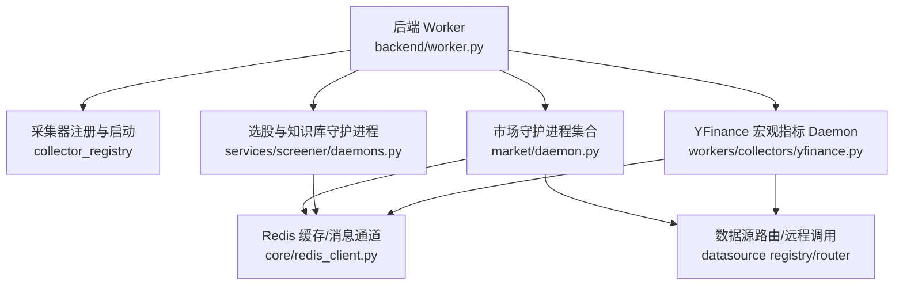
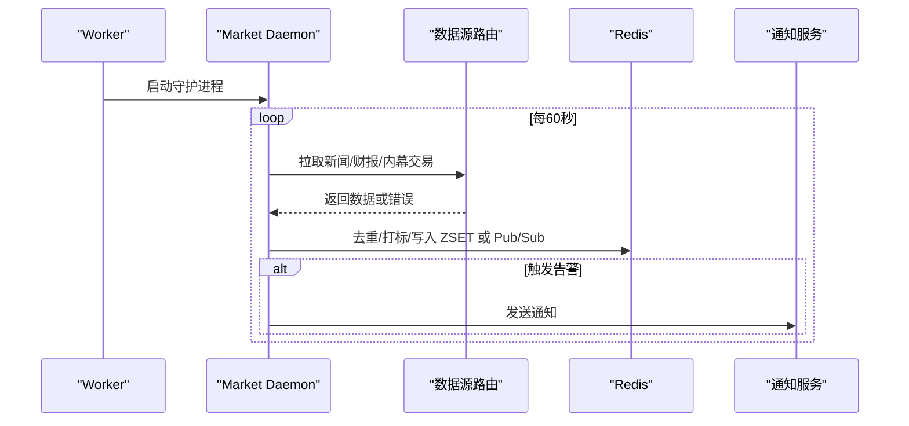
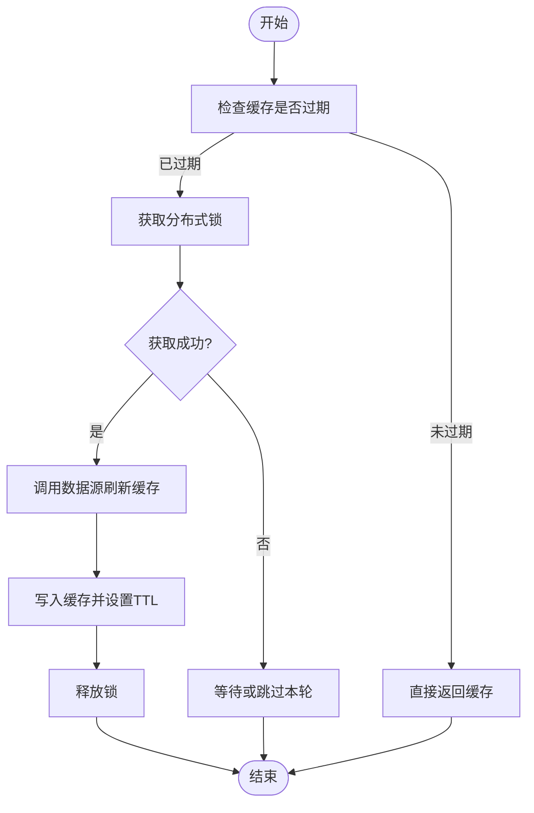
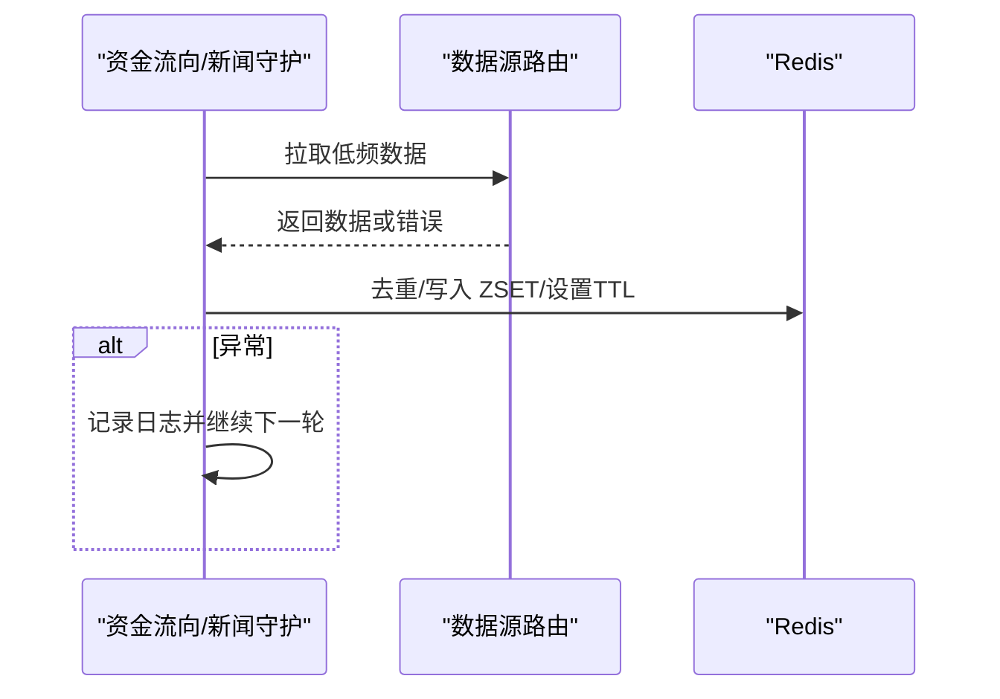
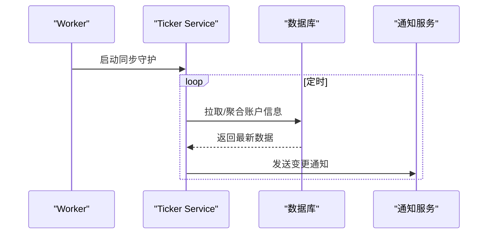
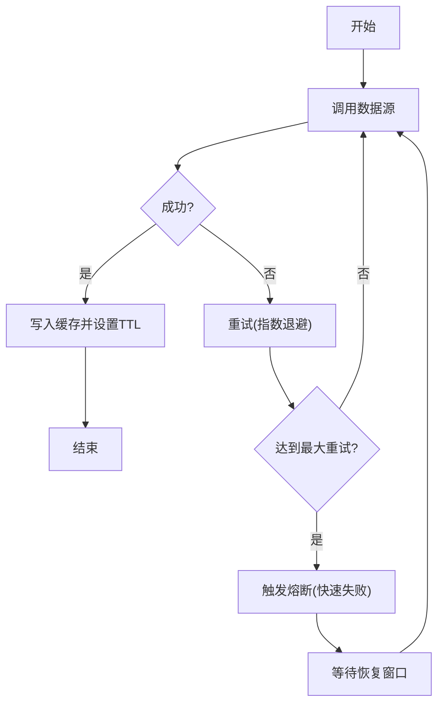
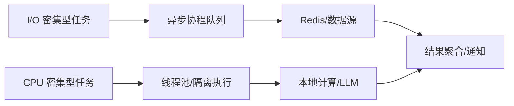
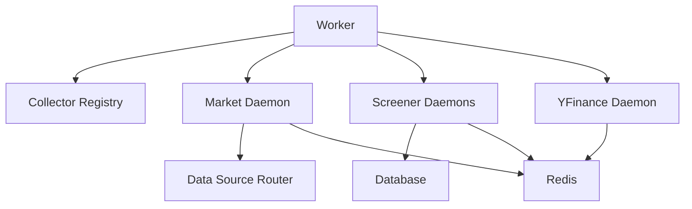

# 后台任务调度系统

<cite>
**本文引用的文件**
- [backend/worker.py](file://backend/worker.py)
- [backend/core/cache_manager.py](file://backend/core/cache_manager.py)
- [backend/workers/market/daemon.py](file://backend/workers/market/daemon.py)
- [backend/services/screener/daemons.py](file://backend/services/screener/daemons.py)
- [backend/workers/collectors/yfinance.py](file://backend/workers/collectors/yfinance.py)
- [backend/core/circuit_breaker.py](file://backend/core/circuit_breaker.py)
- [backend/core/retry_utils.py](file://backend/core/retry_utils.py)
- [backend/core/metrics.py](file://backend/core/metrics.py)
- [backend/core/redis_client.py](file://backend/core/redis_client.py)
</cite>

## 目录
1. [简介](#简介)
2. [项目结构](#项目结构)
3. [核心组件](#核心组件)
4. [架构总览](#架构总览)
5. [详细组件分析](#详细组件分析)
6. [依赖关系分析](#依赖关系分析)
7. [性能考虑](#性能考虑)
8. [故障诊断指南](#故障诊断指南)
9. [结论](#结论)
10. [附录](#附录)

## 简介
本文件面向 Quant Agent 的后台任务调度系统，聚焦以下目标：
- 技术指标缓存更新机制：定时刷新、缓存失效与并发控制
- 资金流向监控任务：低频采集、缓存管理与异常处理
- 账户信息同步机制：定期拉取、数据聚合与用户通知
- YFinance 兜底轮询策略：请求限流、失败重试与熔断保护
- 任务优先级与资源分配：CPU 密集型与 I/O 密集型任务的调度
- 监控指标、性能调优与故障诊断方法

## 项目结构
Quant Agent 的后台任务由统一入口 worker 启动，按角色（主节点/子服务节点）拉起采集器守护进程与核心业务守护进程。市场类守护进程负责新闻、财报、内幕交易等；选股与知识库清理等周期性任务在 screener 模块中实现；YFinance 宏观指标通过独立 daemon 周期刷新至 Redis 缓存。

**图表来源**
- [backend/worker.py:34-85](file://backend/worker.py#L34-L85)
- [backend/workers/market/daemon.py:56-71](file://backend/workers/market/daemon.py#L56-L71)
- [backend/services/screener/daemons.py:26-233](file://backend/services/screener/daemons.py#L26-L233)
- [backend/workers/collectors/yfinance.py:85-94](file://backend/workers/collectors/yfinance.py#L85-L94)
- [backend/core/redis_client.py](file://backend/core/redis_client.py)

**章节来源**
- [backend/worker.py:34-85](file://backend/worker.py#L34-L85)

## 核心组件
- 统一任务入口与生命周期管理：负责启动 Redis 批量写入、采集器守护进程、核心业务守护进程，并在退出时优雅取消与释放资源。
- 市场守护进程：新闻轮询、个股新闻订阅、财报发布监控、高管内幕交易跑马灯等。
- 选股与知识库守护进程：定时执行订阅选股条件、每日强势股盘点、知识库陈旧内容清理。
- YFinance 宏观指标 Daemon：周期拉取历史 K 线并写入 Redis 缓存，供读侧渲染。
- 缓存清理工具：集中清理业务缓存，保护交易态数据不被误删。

**章节来源**
- [backend/worker.py:34-85](file://backend/worker.py#L34-L85)
- [backend/workers/market/daemon.py:56-71](file://backend/workers/market/daemon.py#L56-L71)
- [backend/services/screener/daemons.py:26-419](file://backend/services/screener/daemons.py#L26-L419)
- [backend/workers/collectors/yfinance.py:55-94](file://backend/workers/collectors/yfinance.py#L55-L94)
- [backend/core/cache_manager.py:47-75](file://backend/core/cache_manager.py#L47-L75)

## 架构总览
后台任务以异步协程形式运行，使用 Redis 作为共享状态与消息通道，数据源通过统一路由访问（Finnhub/AKShare/YFinance 等）。关键路径包括：
- 数据采集：守护进程周期调用数据源路由，获取结果后去重、打标、入队或入库。
- 缓存与消息：ZSET/PubSub 用于实时流式推送；键空间前缀用于分类缓存与清理。
- 容错与稳定性：异常捕获、退避重试、分布式锁、TTL 过期、熔断保护。

**图表来源**
- [backend/workers/market/daemon.py:174-259](file://backend/workers/market/daemon.py#L174-L259)
- [backend/core/redis_client.py](file://backend/core/redis_client.py)

## 详细组件分析

### 技术指标缓存更新机制（定时刷新、失效逻辑、并发控制）
- 定时刷新
  - YFinance 宏观指标 Daemon 每 5 分钟拉取一次历史 K 线，写入 Redis 缓存键 yf_macro_cache_{ticker}，设置 TTL 为 1 小时，确保读侧能稳定获取 sparkline 数据。
  - 市场守护进程中的新闻与财报监控采用固定间隔轮询（如 60s/120s），保证准实时更新。
- 缓存失效
  - 统一缓存清理工具支持按前缀模式扫描并删除业务缓存（行情/K线/新闻/宏观/insider 等），同时保护交易态数据（OMS 相关 key）不被误删。
  - 各类缓存均设置合理 TTL，避免长期驻留导致内存压力。
- 并发控制
  - 使用 Redis 分布式锁（set nx + ex）防止多节点重复执行同一任务（如选股订阅、每日总结、知识库清理）。
  - 对批量操作进行分片与分批处理（如新闻情感分析按 chunk 处理），降低单次负载。

**图表来源**
- [backend/workers/collectors/yfinance.py:55-94](file://backend/workers/collectors/yfinance.py#L55-L94)
- [backend/core/cache_manager.py:47-75](file://backend/core/cache_manager.py#L47-L75)
- [backend/services/screener/daemons.py:80-83](file://backend/services/screener/daemons.py#L80-L83)

**章节来源**
- [backend/workers/collectors/yfinance.py:55-94](file://backend/workers/collectors/yfinance.py#L55-L94)
- [backend/core/cache_manager.py:47-75](file://backend/core/cache_manager.py#L47-L75)
- [backend/services/screener/daemons.py:80-83](file://backend/services/screener/daemons.py#L80-L83)

### 资金流向监控任务（低频采集、缓存管理、异常处理）
- 低频采集
  - 宏观与财经日历等低频数据通过守护进程周期拉取，避免高频请求造成外部接口压力。
  - 个股新闻与财报监控采用固定间隔轮询，结合去重键（基于 headline hash）避免重复处理。
- 缓存管理
  - 使用 Redis ZSET 维护新闻流，按时间戳排序并定期清理旧数据（如保留最近 24 小时）。
  - 宏观指标写入 yf_macro_cache_*，设置 TTL 保障一致性。
- 异常处理
  - 所有外部调用包裹 try/except，异常仅记录日志不中断循环。
  - 对 LLM 解析与网络超时进行容错，必要时降级输出或跳过本轮。

**图表来源**
- [backend/workers/market/daemon.py:174-259](file://backend/workers/market/daemon.py#L174-L259)
- [backend/workers/collectors/yfinance.py:55-94](file://backend/workers/collectors/yfinance.py#L55-L94)

**章节来源**
- [backend/workers/market/daemon.py:174-259](file://backend/workers/market/daemon.py#L174-L259)
- [backend/workers/collectors/yfinance.py:55-94](file://backend/workers/collectors/yfinance.py#L55-L94)

### 账户信息同步机制（定期拉取、数据聚合、用户通知）
- 定期拉取
  - 通过 ticker_service.sync_tickers_daemon 定期同步账户/标的信息（在主节点上启动）。
- 数据聚合
  - 将多源数据聚合为统一模型，便于后续展示与分析。
- 用户通知
  - 当账户信息变更或出现异常时，通过 notification_service.send_alert 推送通知。

**图表来源**
- [backend/worker.py:52-60](file://backend/worker.py#L52-L60)

**章节来源**
- [backend/worker.py:52-60](file://backend/worker.py#L52-L60)

### YFinance 兜底轮询策略（请求限流、失败重试、熔断保护）
- 请求限流
  - 宏观指标 Daemon 每 5 分钟刷新一次，避免频繁请求外部接口。
  - 对批量指标逐个拉取，避免一次性大请求。
- 失败重试
  - 使用通用重试工具封装外部调用，支持指数退避与最大重试次数。
- 熔断保护
  - 通过熔断器组件对外部依赖进行快速失败与恢复，防止雪崩。

**图表来源**
- [backend/workers/collectors/yfinance.py:55-94](file://backend/workers/collectors/yfinance.py#L55-L94)
- [backend/core/retry_utils.py](file://backend/core/retry_utils.py)
- [backend/core/circuit_breaker.py](file://backend/core/circuit_breaker.py)

**章节来源**
- [backend/workers/collectors/yfinance.py:55-94](file://backend/workers/collectors/yfinance.py#L55-L94)
- [backend/core/retry_utils.py](file://backend/core/retry_utils.py)
- [backend/core/circuit_breaker.py](file://backend/core/circuit_breaker.py)

### 任务优先级管理与资源分配策略（CPU 密集 vs I/O 密集）
- 优先级管理
  - 高优先级：实时性要求高的任务（如新闻流、财报发布监控）采用较短轮询间隔。
  - 中优先级：选股订阅、每日总结等定时任务，使用分布式锁确保单实例执行。
  - 低优先级：知识库清理、宏观指标刷新等可延迟任务，较长间隔执行。
- 资源分配
  - I/O 密集型任务（网络请求、Redis 操作）使用异步协程，充分利用事件循环。
  - CPU 密集型任务（如 LLM 调用、复杂计算）通过线程隔离或限制并发度，避免阻塞事件循环。
  - 批量操作分片处理，控制单次负载与内存占用。

[此图为概念性示意，无需代码映射]

**章节来源**
- [backend/services/screener/daemons.py:80-83](file://backend/services/screener/daemons.py#L80-L83)
- [backend/workers/market/daemon.py:174-259](file://backend/workers/market/daemon.py#L174-L259)

## 依赖关系分析
- 组件耦合
  - Worker 依赖采集器注册与核心守护进程，形成松耦合的任务编排。
  - 市场守护进程依赖数据源路由与 Redis，解耦具体数据源实现。
  - 选股守护进程依赖数据库与通知服务，使用分布式锁避免重复执行。
- 外部依赖
  - Finnhub/AKShare/YFinance 等数据源通过统一路由访问，便于替换与扩展。
  - Redis 作为共享状态与消息通道，承担去重、缓存与实时推送职责。
- 潜在循环依赖
  - 通过模块化与路由层避免循环导入，保持清晰边界。

**图表来源**
- [backend/worker.py:34-85](file://backend/worker.py#L34-L85)
- [backend/workers/market/daemon.py:56-71](file://backend/workers/market/daemon.py#L56-L71)
- [backend/services/screener/daemons.py:26-233](file://backend/services/screener/daemons.py#L26-L233)
- [backend/workers/collectors/yfinance.py:85-94](file://backend/workers/collectors/yfinance.py#L85-L94)

**章节来源**
- [backend/worker.py:34-85](file://backend/worker.py#L34-L85)
- [backend/workers/market/daemon.py:56-71](file://backend/workers/market/daemon.py#L56-L71)
- [backend/services/screener/daemons.py:26-233](file://backend/services/screener/daemons.py#L26-L233)
- [backend/workers/collectors/yfinance.py:85-94](file://backend/workers/collectors/yfinance.py#L85-L94)

## 性能考虑
- 缓存命中率
  - 合理设置 TTL 与缓存粒度，提升命中率并降低外部接口压力。
- 批处理与分片
  - 对批量数据分片处理，避免单次请求过大导致超时或内存峰值。
- 并发控制
  - 使用分布式锁与信号量控制并发度，防止热点 key 竞争与下游过载。
- 监控指标
  - 采集调用次数、延迟、错误率、缓存命中率等指标，纳入统一观测面板。

[本节提供通用指导，无需特定文件引用]

## 故障诊断指南
- 常见问题
  - 缓存未命中：检查 TTL 设置与前缀匹配是否正确。
  - 重复执行：确认分布式锁 key 与过期时间是否合理。
  - 外部接口超时：检查重试策略与熔断阈值。
- 诊断步骤
  - 查看守护进程日志，定位异常堆栈与上下文。
  - 检查 Redis 键空间与 ZSET 成员，验证数据写入与清理逻辑。
  - 使用缓存清理工具安全清理业务缓存，避免影响交易态数据。
- 恢复策略
  - 调整轮询间隔与并发度，缓解下游压力。
  - 启用熔断与重试，提高系统韧性。

**章节来源**
- [backend/core/cache_manager.py:47-75](file://backend/core/cache_manager.py#L47-L75)
- [backend/services/screener/daemons.py:80-83](file://backend/services/screener/daemons.py#L80-L83)
- [backend/workers/market/daemon.py:174-259](file://backend/workers/market/daemon.py#L174-L259)

## 结论
Quant Agent 的后台任务调度系统通过统一的入口编排、模块化的守护进程、健壮的缓存与消息机制，以及完善的容错策略，实现了高效稳定的数据采集、处理与推送。未来可进一步优化并发模型与监控体系，提升整体吞吐与可观测性。

[本节为总结性内容，无需特定文件引用]

## 附录
- 关键配置建议
  - 根据业务负载调整轮询间隔与并发度。
  - 合理设置缓存 TTL 与清理策略，平衡一致性与性能。
- 最佳实践
  - 所有外部调用应包裹重试与熔断逻辑。
  - 使用分布式锁确保任务幂等与单实例执行。
  - 对批量操作进行分片与内存管理，避免峰值压力。

[本节提供通用指导，无需特定文件引用]