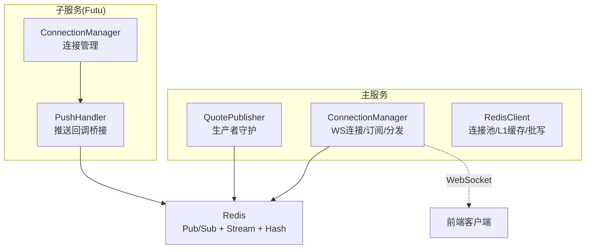
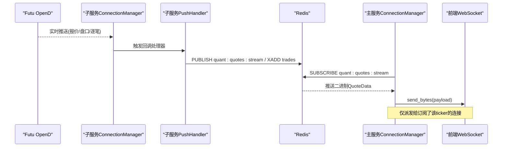
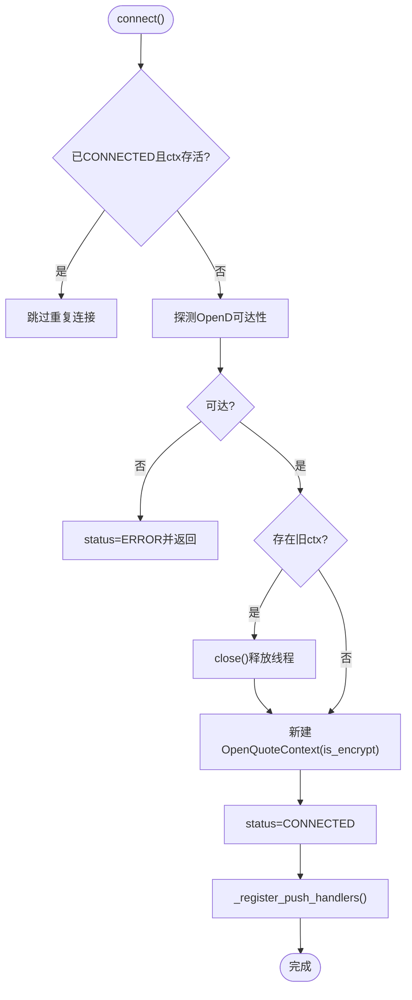
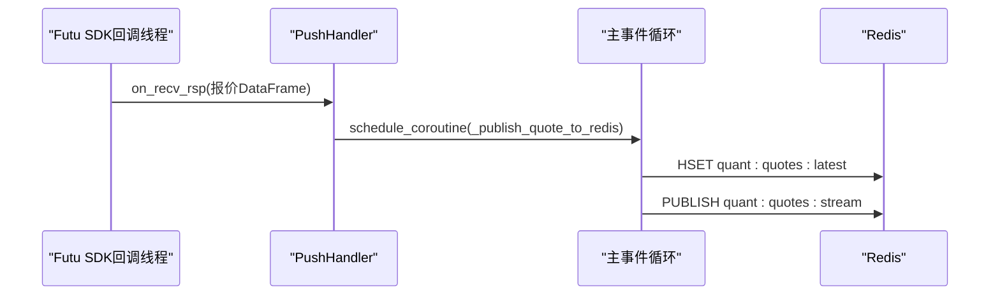
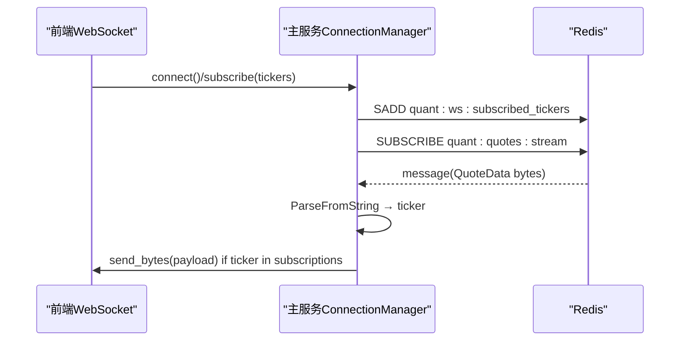
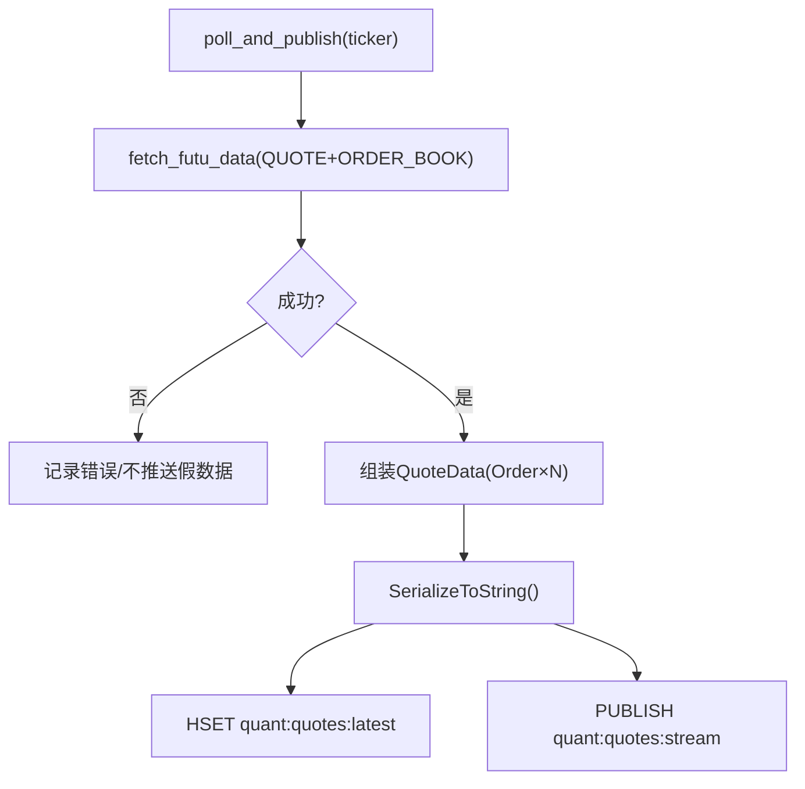
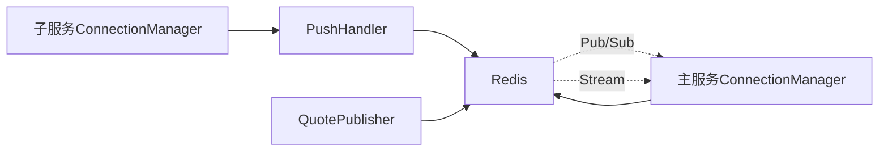

# 市场引擎架构设计

<cite>
**本文引用的文件**
- [connection_manager.py](file://data_subservice/futu_src/connection_manager.py)
- [market_engine.py](file://backend/services/market_engine.py)
- [push_handler.py](file://data_subservice/futu_src/push_handler.py)
- [quote_publisher.py](file://backend/workers/quote_publisher.py)
- [redis_client.py](file://backend/core/redis_client.py)
- [market.proto](file://shared/proto/market.proto)
</cite>

## 目录
1. [简介](#简介)
2. [项目结构](#项目结构)
3. [核心组件](#核心组件)
4. [架构总览](#架构总览)
5. [详细组件分析](#详细组件分析)
6. [依赖关系分析](#依赖关系分析)
7. [性能考量](#性能考量)
8. [故障排查指南](#故障排查指南)
9. [结论](#结论)
10. [附录](#附录)

## 简介
本文件面向 Quant Agent 的市场引擎，聚焦以下目标：
- 深入解释 ConnectionManager 的设计模式与职责边界（WebSocket 连接管理、订阅机制、消息分发策略）。
- 详细说明 Redis Pub/Sub 总线的工作原理（行情数据流、交易事件流、状态同步机制）。
- 解释 Protobuf 序列化格式的设计考虑（Order 与 QuoteData 消息结构）。
- 说明后台任务调度机制（技术指标缓存更新、资金流向监控、账户信息同步）。
- 提供架构图与数据流图，展示各组件间的交互关系。
- 给出性能优化策略（批量处理、压缩传输、内存管理）。

## 项目结构
市场引擎由“子服务（Futu 数据源）+ 主服务（WebSocket/Redis 总线/后台任务）”构成，关键模块如下：
- 子服务层：负责与 Futu OpenD 建立连接、注册推送回调、将实时数据写入 Redis。
- 主服务层：维护 WebSocket 连接与订阅、监听 Redis 总线并分发到前端、执行后台轮询与指标计算。
- 基础设施：Redis 连接池、L1 本地缓存、异步批量写入器；Protobuf 定义统一消息格式。

图表来源
- [connection_manager.py:44-159](file://data_subservice/futu_src/connection_manager.py#L44-L159)
- [push_handler.py:140-432](file://data_subservice/futu_src/push_handler.py#L140-L432)
- [market_engine.py:115-331](file://backend/services/market_engine.py#L115-L331)
- [quote_publisher.py:22-223](file://backend/workers/quote_publisher.py#L22-L223)
- [redis_client.py:14-35](file://backend/core/redis_client.py#L14-L35)

章节来源
- [connection_manager.py:44-159](file://data_subservice/futu_src/connection_manager.py#L44-L159)
- [market_engine.py:115-331](file://backend/services/market_engine.py#L115-L331)
- [push_handler.py:140-432](file://data_subservice/futu_src/push_handler.py#L140-L432)
- [quote_publisher.py:22-223](file://backend/workers/quote_publisher.py#L22-L223)
- [redis_client.py:14-35](file://backend/core/redis_client.py#L14-L35)

## 核心组件
- 子服务 ConnectionManager：管理与 Futu OpenD 的行情/交易上下文，线程安全建连、断线恢复、跨网络加密握手、推送回调注册。
- 子服务 PushHandler：将 Futu SDK 同步回调桥接到主事件循环，写入 Redis（行情主流、逐笔成交 Stream、经纪商队列/K线旁路）。
- 主服务 ConnectionManager：管理 WebSocket 连接与订阅集合，监听 Redis 主流推送并按订阅过滤分发，支持追补与快照回发。
- 主服务 QuotePublisher：后台独立生产者，按前端订阅集动态拉取行情并写入 Redis（最新快照+主流），保证盘口一致。
- Redis 基础设施：连接池、L1 本地短效缓存、异步批量写入器，降低 RTT 与带宽压力。
- Protobuf 消息：Order（价格/数量）、QuoteData（状态/标的/最新价/涨跌幅/成交量/买卖盘/来源）。

章节来源
- [connection_manager.py:44-159](file://data_subservice/futu_src/connection_manager.py#L44-L159)
- [push_handler.py:58-98](file://data_subservice/futu_src/push_handler.py#L58-L98)
- [market_engine.py:115-331](file://backend/services/market_engine.py#L115-L331)
- [quote_publisher.py:22-223](file://backend/workers/quote_publisher.py#L22-L223)
- [redis_client.py:46-177](file://backend/core/redis_client.py#L46-L177)
- [market.proto:1-22](file://shared/proto/market.proto#L1-L22)

## 架构总览
下图展示了从数据源到前端的端到端数据流，以及后台任务对指标的补充与风控告警。

图表来源
- [connection_manager.py:154-197](file://data_subservice/futu_src/connection_manager.py#L154-L197)
- [push_handler.py:140-248](file://data_subservice/futu_src/push_handler.py#L140-L248)
- [market_engine.py:296-331](file://backend/services/market_engine.py#L296-L331)

## 详细组件分析

### 子服务 ConnectionManager（Futu 连接管理）
- 设计要点
  - 线程安全建连：使用锁防止并发重复创建上下文，避免 futu SDK 回调线程泄漏。
  - 快速探测：在真正建连前先探测 OpenD 可达性，失败即置 ERROR 并返回，避免内部重试风暴。
  - 跨网络加密：非本地地址时启用 is_encrypt，配合 RSA 私钥配置完成握手。
  - 推送注册：连接成功后注册各类推送处理器，并将主事件循环注入以便跨线程调度协程。
  - 交易上下文单例：按 (环境, 市场) 维度复用交易上下文，并在跨网络且无解锁凭据时拒绝创建以阻断线程泄漏。
  - 运行时切换：支持 switch_host 动态切换 OpenD 目标，自动关闭旧连接并重建。

- 关键流程（建连与推送注册）

图表来源
- [connection_manager.py:79-197](file://data_subservice/futu_src/connection_manager.py#L79-L197)

章节来源
- [connection_manager.py:44-159](file://data_subservice/futu_src/connection_manager.py#L44-L159)
- [connection_manager.py:161-197](file://data_subservice/futu_src/connection_manager.py#L161-L197)
- [connection_manager.py:217-279](file://data_subservice/futu_src/connection_manager.py#L217-L279)
- [connection_manager.py:302-345](file://data_subservice/futu_src/connection_manager.py#L302-L345)

### 子服务 PushHandler（推送回调桥接）
- 设计要点
  - 跨线程调度：Futu SDK 回调运行在独立线程，通过 run_coroutine_threadsafe 将协程调度到主事件循环。
  - 多类型处理器：报价、盘口深度、逐笔成交、经纪商队列、K线等分别处理并写入不同 Redis 通道。
  - 盘口合并：优先读取最新报价，再合并 bids/asks 后发布到主流，确保前端收到完整 Level 2 数据。
  - 向后兼容：同时保留历史频道（如 futu:push:*）并桥接到统一 quant:* 通道。

- 典型调用链（报价→Redis）

图表来源
- [push_handler.py:46-98](file://data_subservice/futu_src/push_handler.py#L46-L98)
- [push_handler.py:140-172](file://data_subservice/futu_src/push_handler.py#L140-L172)

章节来源
- [push_handler.py:46-98](file://data_subservice/futu_src/push_handler.py#L46-L98)
- [push_handler.py:140-248](file://data_subservice/futu_src/push_handler.py#L140-L248)
- [push_handler.py:252-386](file://data_subservice/futu_src/push_handler.py#L252-L386)
- [push_handler.py:394-432](file://data_subservice/futu_src/push_handler.py#L394-L432)

### 主服务 ConnectionManager（WebSocket 连接/订阅/分发）
- 设计要点
  - 连接生命周期：accept 连接、记录活跃连接与订阅集合、启动后台任务（广播循环、Redis PubSub 监听）。
  - 订阅与反订阅：维护 WebSocket→tickers 映射，并同步订阅集合到 Redis，供生产者动态跟随。
  - 追补与快照：新连接可基于 XRANGE 追补错过的逐笔成交，或发送最新快照（quant:quotes:latest）。
  - 分发策略：监听 Redis 主流，解析 Protobuf 获取 ticker，仅向订阅了该标的的连接发送二进制帧。
  - 批量压缩：当追补超过阈值时，将多条 payload 打包为单一 zlib 压缩帧，减少网络开销。

- 订阅与分发序列图

图表来源
- [market_engine.py:174-200](file://backend/services/market_engine.py#L174-L200)
- [market_engine.py:253-267](file://backend/services/market_engine.py#L253-L267)
- [market_engine.py:296-331](file://backend/services/market_engine.py#L296-L331)

章节来源
- [market_engine.py:115-200](file://backend/services/market_engine.py#L115-L200)
- [market_engine.py:201-244](file://backend/services/market_engine.py#L201-L244)
- [market_engine.py:253-331](file://backend/services/market_engine.py#L253-L331)

### 主服务 QuotePublisher（生产者守护）
- 设计要点
  - 动态标的池：每轮从 Redis 集合读取前端实际订阅标的，并与兜底常驻池合并，保证盘口一致。
  - 限流并发：使用信号量限制并发拉取次数，避免打满外部连接或触发限速。
  - 双写策略：写入最新快照（Hash）与发布主流（Pub/Sub），确保即时性与一致性。
  - 质量校验：对拉取到的行情进行基础质量检查并暴露指标。

- 生产流程（单标的）

图表来源
- [quote_publisher.py:45-164](file://backend/workers/quote_publisher.py#L45-L164)

章节来源
- [quote_publisher.py:22-223](file://backend/workers/quote_publisher.py#L22-L223)

### Protobuf 消息设计（Order 与 QuoteData）
- Order：包含 price（浮点）与 size（浮点），用于描述买卖盘一档或多档。
- QuoteData：包含 status、ticker、last_price、change_pct、volume_str、bids/asks（repeated Order）、source。
- 设计考虑
  - 紧凑二进制：相比 JSON 更小更快，适合高频推送。
  - 强类型字段：便于前后端契约稳定演进。
  - 可扩展性：新增字段不影响已有消费者（proto3 语义）。

章节来源
- [market.proto:1-22](file://shared/proto/market.proto#L1-L22)

## 依赖关系分析
- 子服务 ConnectionManager 依赖 Futu SDK 与 push_handler，后者依赖 Redis 客户端。
- 主服务 ConnectionManager 依赖 Redis（Pub/Sub、Stream、Hash）与 Protobuf 生成模块。
- QuotePublisher 依赖 DataSourceRouter 远程调用 Futu/YFinance，并通过 Redis 双写。
- Redis 基础设施提供连接池、L1 缓存与异步批量写入，降低网络与内存压力。

图表来源
- [connection_manager.py:154-197](file://data_subservice/futu_src/connection_manager.py#L154-L197)
- [push_handler.py:58-98](file://data_subservice/futu_src/push_handler.py#L58-L98)
- [market_engine.py:296-331](file://backend/services/market_engine.py#L296-L331)
- [quote_publisher.py:133-157](file://backend/workers/quote_publisher.py#L133-L157)
- [redis_client.py:14-35](file://backend/core/redis_client.py#L14-L35)

章节来源
- [connection_manager.py:154-197](file://data_subservice/futu_src/connection_manager.py#L154-L197)
- [push_handler.py:58-98](file://data_subservice/futu_src/push_handler.py#L58-L98)
- [market_engine.py:296-331](file://backend/services/market_engine.py#L296-L331)
- [quote_publisher.py:133-157](file://backend/workers/quote_publisher.py#L133-L157)
- [redis_client.py:14-35](file://backend/core/redis_client.py#L14-L35)

## 性能考量
- 批量处理
  - 追补批量压缩：当错过消息超过阈值时，将多条 payload 打包为 zlib 压缩帧一次性发送，显著降低网络往返与包数。
  - Redis 异步批量写入：通过队列与 pipeline 聚合 set 操作，减少 RTT。
- 压缩传输
  - 二进制 Protobuf：替代 JSON，减小体积、提升解析速度。
  - 可选压缩帧：对大批量追补采用 zlib 压缩，平衡 CPU 与带宽。
- 内存管理
  - 子服务连接上下文复用与及时 close，避免 futu SDK 回调线程泄漏。
  - 主服务清理不在监控列表中的缓存条目（技术指标、资金流），防止内存膨胀。
  - L1 本地缓存带容量上限与定时清理，避免冷门 key 堆积。
- 速率控制与退避
  - 技术指标更新：全局周期刷新（如每小时）+ 单标的退避（如600秒），避免请求风暴。
  - 资金流低频刷新：对齐 5 分钟粒度，避免每 3 秒全量 gather 打爆线程池。
  - YFinance 兜底节流：对失败标的设置较长间隔重试，避免持续打爆子服务线程。
- 并发控制
  - 生产者守护使用信号量限制并发拉取，避免外部 API 限速与连接池耗尽。
  - 主服务后台任务串行化部分耗时操作（如 YF 技术面），降低瞬时峰值。

章节来源
- [market_engine.py:201-244](file://backend/services/market_engine.py#L201-L244)
- [market_engine.py:332-599](file://backend/services/market_engine.py#L332-L599)
- [quote_publisher.py:166-223](file://backend/workers/quote_publisher.py#L166-L223)
- [redis_client.py:46-177](file://backend/core/redis_client.py#L46-L177)
- [connection_manager.py:79-159](file://data_subservice/futu_src/connection_manager.py#L79-L159)

## 故障排查指南
- 子服务连接问题
  - 现象：status 为 ERROR 或 TRADE_DISABLED，无法建立交易上下文。
  - 排查：确认 OpenD 可达性、跨网络加密配置（RSA 私钥/解锁密码）、是否误用本地地址导致加密不匹配。
  - 参考路径
    - [connection_manager.py:59-112](file://data_subservice/futu_src/connection_manager.py#L59-L112)
    - [connection_manager.py:217-279](file://data_subservice/futu_src/connection_manager.py#L217-L279)
- 推送回调异常
  - 现象：Redis 主流无数据或盘口缺失。
  - 排查：检查 push_handler 注册结果、事件循环是否可用、盘口合并逻辑是否正确读取最新报价。
  - 参考路径
    - [push_handler.py:140-248](file://data_subservice/futu_src/push_handler.py#L140-L248)
- 主服务分发异常
  - 现象：前端未收到行情或延迟高。
  - 排查：确认 Redis PubSub 订阅正常、订阅集合同步正确、追补逻辑是否触发、是否出现异常吞掉消息。
  - 参考路径
    - [market_engine.py:296-331](file://backend/services/market_engine.py#L296-L331)
    - [market_engine.py:201-244](file://backend/services/market_engine.py#L201-L244)
- 生产者守护异常
  - 现象：盘口不一致或长时间无更新。
  - 排查：检查 Redis 订阅集合键、并发信号量、外部 API 超时/限速、质量校验是否阻断。
  - 参考路径
    - [quote_publisher.py:166-223](file://backend/workers/quote_publisher.py#L166-L223)
    - [quote_publisher.py:45-164](file://backend/workers/quote_publisher.py#L45-L164)

章节来源
- [connection_manager.py:59-112](file://data_subservice/futu_src/connection_manager.py#L59-L112)
- [connection_manager.py:217-279](file://data_subservice/futu_src/connection_manager.py#L217-L279)
- [push_handler.py:140-248](file://data_subservice/futu_src/push_handler.py#L140-L248)
- [market_engine.py:201-331](file://backend/services/market_engine.py#L201-L331)
- [quote_publisher.py:45-223](file://backend/workers/quote_publisher.py#L45-L223)

## 结论
本市场引擎通过“子服务连接与推送 + 主服务总线与分发 + Redis 数据总线”的分层架构，实现了低延迟、可扩展、易维护的实时行情系统。ConnectionManager 在两端承担关键角色：子服务侧保障连接健壮性与推送可靠性，主服务侧保障连接生命周期、订阅一致性与高效分发。配合 Protobuf 二进制协议、批量压缩、L1 缓存与异步批写，系统在吞吐与延迟之间取得良好平衡。后台任务对技术指标、资金流与账户信息进行周期性更新与风控告警，进一步提升系统的实用性与稳定性。

## 附录
- 关键数据通道
  - 行情主流：quant:quotes:stream（二进制 QuoteData）
  - 最新快照：quant:quotes:latest（Hash，key=ticker）
  - 逐笔成交：quant:trades:stream:{ticker}（Stream，payload 二进制）
  - 订阅集合：quant:ws:subscribed_tickers（Set）
- 扩展建议
  - 增加更多数据源适配器（如其他券商/交易所），保持与现有 Router 一致的 fetch_* 接口。
  - 引入更细粒度的指标埋点（如各通道延迟、丢包率、订阅规模分布）。
  - 增强容灾能力（如多 Redis 节点、降级策略、熔断与重试策略的统一治理）。
