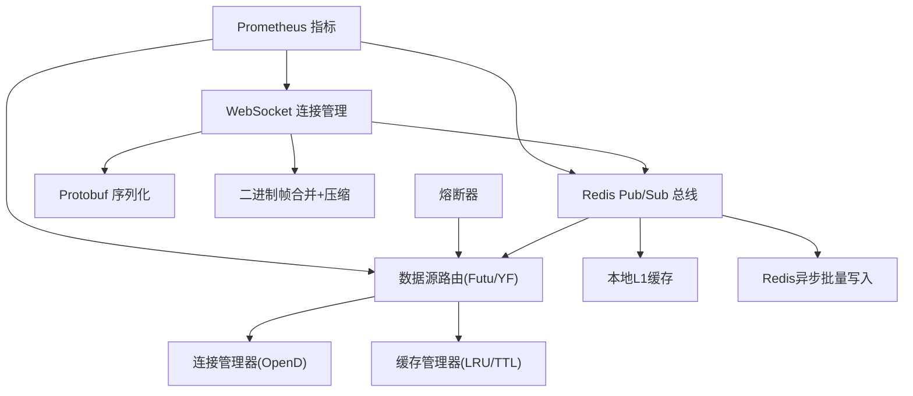
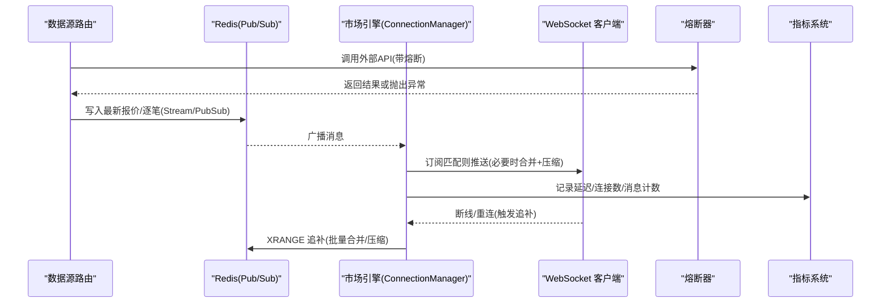
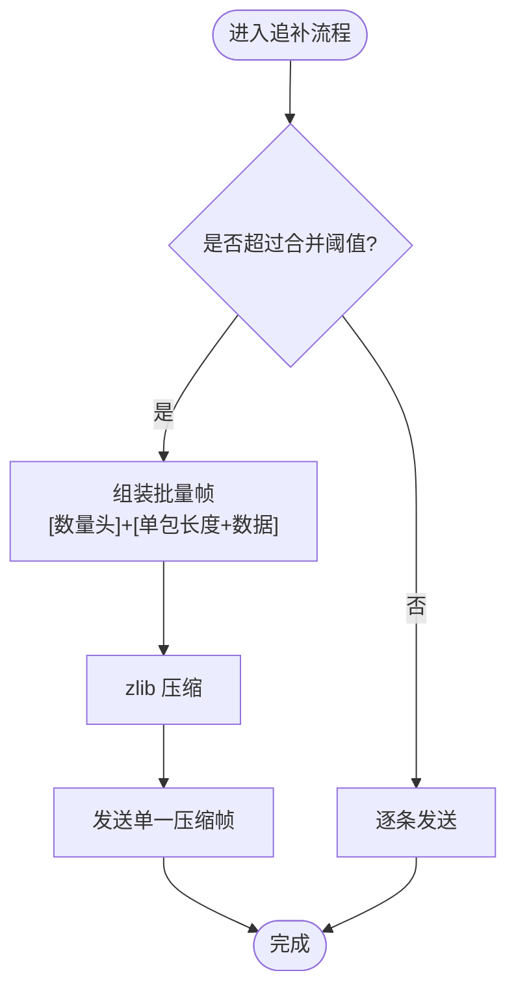
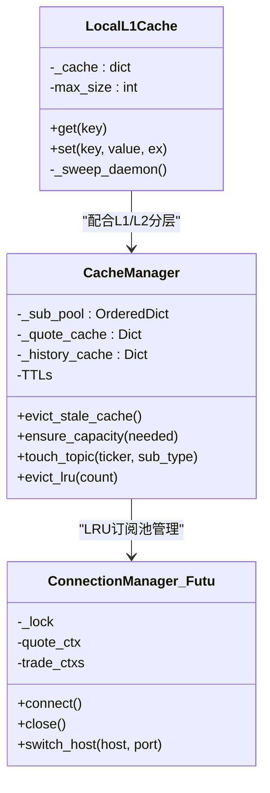
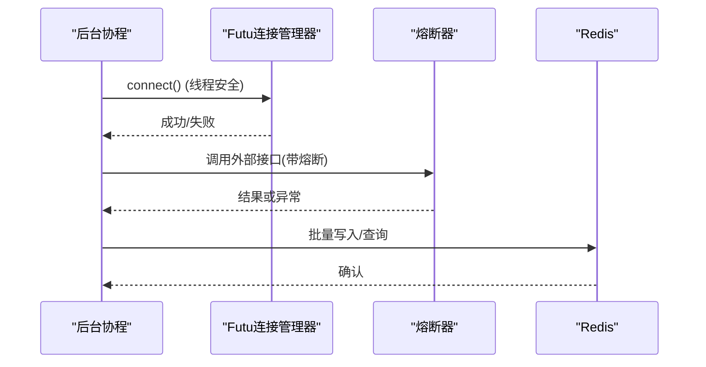
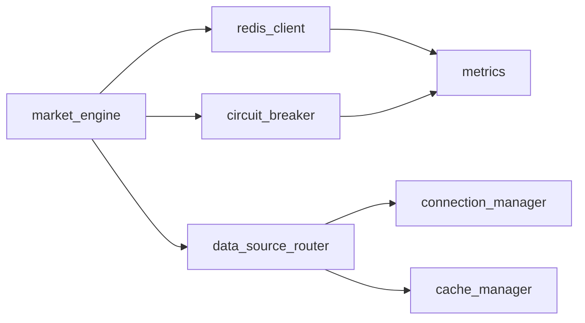

# 性能优化策略

<cite>
**本文引用的文件**
- [backend/services/market_engine.py](file://backend/services/market_engine.py)
- [backend/core/redis_client.py](file://backend/core/redis_client.py)
- [backend/core/cache_manager.py](file://backend/core/cache_manager.py)
- [backend/core/metrics.py](file://backend/core/metrics.py)
- [data_subservice/futu_src/connection_manager.py](file://data_subservice/futu_src/connection_manager.py)
- [data_subservice/futu_src/cache_manager.py](file://data_subservice/futu_src/cache_manager.py)
- [backend/core/circuit_breaker.py](file://backend/core/circuit_breaker.py)
</cite>

## 目录
1. [引言](#引言)
2. [项目结构](#项目结构)
3. [核心组件](#核心组件)
4. [架构总览](#架构总览)
5. [详细组件分析](#详细组件分析)
6. [依赖关系分析](#依赖关系分析)
7. [性能考量](#性能考量)
8. [故障排查指南](#故障排查指南)
9. [结论](#结论)
10. [附录](#附录)

## 引言
本文件面向 Quant Agent 市场引擎的性能优化，围绕以下目标展开：批量处理优化（消息合并、压缩传输、网络请求批量化）、内存管理（缓存大小控制、对象池化、垃圾回收优化）、并发控制（协程调度、线程池配置、锁竞争优化）、网络优化（连接复用、请求去重、响应缓存）、性能监控指标体系（延迟统计、吞吐量、资源利用率），以及压力测试方法与调优最佳实践。内容基于代码仓库中的实际实现进行提炼与可视化说明。

## 项目结构
市场引擎的性能优化涉及多个层次：
- 行情与推送层：WebSocket 连接管理、订阅分发、Redis Pub/Sub 广播、Protobuf 序列化与二进制帧合并压缩。
- 数据源与连接层：Futu OpenD 连接管理、上下文生命周期、回调线程守护、跨网络加密握手。
- 缓存与存储层：进程内 L1 缓存、Redis 异步批量写入、业务缓存清理、L1/L2 分层。
- 可观测性与稳定性：Prometheus 指标、熔断器状态机、错误分类与限流隔离。

图表来源
- [backend/services/market_engine.py:39-113](file://backend/services/market_engine.py#L39-L113)
- [backend/core/redis_client.py:46-177](file://backend/core/redis_client.py#L46-L177)
- [data_subservice/futu_src/connection_manager.py:79-160](file://data_subservice/futu_src/connection_manager.py#L79-L160)
- [data_subservice/futu_src/cache_manager.py:30-149](file://data_subservice/futu_src/cache_manager.py#L30-L149)
- [backend/core/circuit_breaker.py:64-218](file://backend/core/circuit_breaker.py#L64-L218)
- [backend/core/metrics.py:24-104](file://backend/core/metrics.py#L24-L104)

章节来源
- [backend/services/market_engine.py:115-605](file://backend/services/market_engine.py#L115-L605)
- [backend/core/redis_client.py:1-252](file://backend/core/redis_client.py#L1-L252)
- [data_subservice/futu_src/connection_manager.py:1-351](file://data_subservice/futu_src/connection_manager.py#L1-L351)
- [data_subservice/futu_src/cache_manager.py:1-373](file://data_subservice/futu_src/cache_manager.py#L1-L373)
- [backend/core/circuit_breaker.py:1-379](file://backend/core/circuit_breaker.py#L1-L379)
- [backend/core/metrics.py:1-641](file://backend/core/metrics.py#L1-L641)

## 核心组件
- 行情推送与批量发送：将逐笔成交与快照通过 Redis Stream/PubSub 广播，并在追补时按阈值合并为单一压缩帧，降低 WebSocket 小包开销。
- Redis 异步批量写入：后台队列聚合 set 操作，使用 Pipeline 批量提交，减少 RTT 与带宽占用；提供优雅停机保证不丢写。
- 进程内 L1 缓存：高频读取的短效键在进程内存中缓存并定时清理，穿透到 Redis L2，避免重复网络往返。
- Futu 连接管理：线程安全建连、旧上下文释放防泄漏、跨网络加密握手、快速探测 OpenD 可达性。
- 缓存管理器：LRU 订阅池、多类数据 TTL 与容量熔断、过期清理与半量裁剪，防止内存无界增长。
- 熔断器：按服务维度维护 CLOSED/OPEN/HALF_OPEN 状态，支持限流错误过滤、状态转换指标上报。
- 指标体系：覆盖行情延迟、WebSocket 连接/消息、Redis 队列深度、熔断状态、数据源可用性、线程水位等。

章节来源
- [backend/services/market_engine.py:39-113](file://backend/services/market_engine.py#L39-L113)
- [backend/core/redis_client.py:46-177](file://backend/core/redis_client.py#L46-L177)
- [backend/core/redis_client.py:184-252](file://backend/core/redis_client.py#L184-L252)
- [data_subservice/futu_src/connection_manager.py:79-160](file://data_subservice/futu_src/connection_manager.py#L79-L160)
- [data_subservice/futu_src/cache_manager.py:30-149](file://data_subservice/futu_src/cache_manager.py#L30-L149)
- [backend/core/circuit_breaker.py:64-218](file://backend/core/circuit_breaker.py#L64-L218)
- [backend/core/metrics.py:24-104](file://backend/core/metrics.py#L24-L104)

## 架构总览
下图展示从数据源到客户端的关键路径与优化点：数据源经路由获取后，统一序列化为 Protobuf 写入 Redis，并通过 Pub/Sub 广播；WebSocket 消费者根据订阅过滤推送，追补时采用批量合并与压缩；同时通过 L1 缓存与批量写入降低 Redis 压力；熔断器保护外部调用；指标持续采集用于监控与告警。

图表来源
- [backend/services/market_engine.py:191-244](file://backend/services/market_engine.py#L191-L244)
- [backend/services/market_engine.py:296-330](file://backend/services/market_engine.py#L296-L330)
- [backend/core/circuit_breaker.py:147-218](file://backend/core/circuit_breaker.py#L147-L218)
- [backend/core/metrics.py:24-72](file://backend/core/metrics.py#L24-L72)

## 详细组件分析

### 批量处理优化（消息合并、压缩传输、网络请求批量化）
- 消息合并与压缩：当追补消息超过阈值时，将多条二进制负载打包为“数量头 + 单包长度+数据”的连续缓冲，并进行 zlib 压缩，再以特定模式字节标识发送，显著减少小包开销与协议头消耗。
- 网络请求批量化：Redis 异步批量写入器以固定时间窗口和批次大小收集 set 操作，使用 Pipeline 一次性提交，降低 RTT 与 TCP 拥塞；优雅关闭确保队列清空。
- 背景任务批拉：技术指标与资金流按周期与退避策略批量拉取，避免每轮全量并发导致的下游线程池耗尽与限流封禁。

图表来源
- [backend/services/market_engine.py:201-244](file://backend/services/market_engine.py#L201-L244)
- [backend/core/redis_client.py:116-177](file://backend/core/redis_client.py#L116-L177)

章节来源
- [backend/services/market_engine.py:201-244](file://backend/services/market_engine.py#L201-L244)
- [backend/core/redis_client.py:116-177](file://backend/core/redis_client.py#L116-L177)

### 内存管理策略（缓存大小控制、对象池化、垃圾回收优化）
- 缓存大小控制：
  - 进程内 L1 缓存设置最大条目上限，达到上限时安全清空，下次命中自动重建；后台定时扫描清理过期键，防止冷门 Key 堆积。
  - Futu 缓存管理器对各类数据设定 TTL，并执行容量熔断（超过上限裁剪最旧一半），定期清理过期条目。
- 对象池化：
  - LRU 订阅池维护最近访问的标的与类型，超限淘汰最久未用项，并生成待退订队列，由上层异步执行真实退订，避免频繁订阅/退订带来的开销。
- 垃圾回收优化：
  - Futu 连接管理器在重建上下文前显式关闭旧上下文，释放回调线程；强制子进程回调线程设为守护线程，进程退出即回收，杜绝孤儿线程累积。
  - 后台任务持有强引用集合，防止 GC 回收导致协程静默停摆。

图表来源
- [backend/core/redis_client.py:184-252](file://backend/core/redis_client.py#L184-L252)
- [data_subservice/futu_src/cache_manager.py:30-149](file://data_subservice/futu_src/cache_manager.py#L30-L149)
- [data_subservice/futu_src/connection_manager.py:79-160](file://data_subservice/futu_src/connection_manager.py#L79-L160)

章节来源
- [backend/core/redis_client.py:184-252](file://backend/core/redis_client.py#L184-L252)
- [data_subservice/futu_src/cache_manager.py:30-149](file://data_subservice/futu_src/cache_manager.py#L30-L149)
- [data_subservice/futu_src/connection_manager.py:79-160](file://data_subservice/futu_src/connection_manager.py#L79-L160)

### 并发控制机制（协程调度、线程池配置、锁竞争优化）
- 协程调度：
  - 背景任务使用 asyncio.create_task 启动广播循环与 Pub/Sub 监听，失败与取消路径安全处理，避免阻塞主事件循环。
  - 追补与快照发送在协程中串行/并行组合，按条件选择批量发送以降低拥塞。
- 线程池配置：
  - Futu 连接管理器强制回调线程为守护线程，避免长期运行下线程泄漏；交易上下文创建前快速探测 OpenD 可达性，避免 SDK 内部无限重试。
- 锁竞争优化：
  - 熔断器使用异步锁保护状态变更，同步版本使用线程锁，减少竞态；连接管理器使用线程锁防止并发建连。
  - 资金流与账户信息拉取采用退避与节流，避免高并发打爆下游线程池。

图表来源
- [backend/services/market_engine.py:160-173](file://backend/services/market_engine.py#L160-L173)
- [data_subservice/futu_src/connection_manager.py:79-160](file://data_subservice/futu_src/connection_manager.py#L79-L160)
- [backend/core/circuit_breaker.py:147-218](file://backend/core/circuit_breaker.py#L147-L218)
- [backend/core/redis_client.py:116-177](file://backend/core/redis_client.py#L116-L177)

章节来源
- [backend/services/market_engine.py:160-173](file://backend/services/market_engine.py#L160-L173)
- [data_subservice/futu_src/connection_manager.py:79-160](file://data_subservice/futu_src/connection_manager.py#L79-L160)
- [backend/core/circuit_breaker.py:147-218](file://backend/core/circuit_breaker.py#L147-L218)
- [backend/core/redis_client.py:116-177](file://backend/core/redis_client.py#L116-L177)

### 网络优化技术（连接复用、请求去重、响应缓存）
- 连接复用：
  - Futu 连接管理器维护 quote_ctx 与 trade_ctxs 单例，避免重复建连；切换目标时先关闭旧连接再重建，确保线程与句柄正确释放。
- 请求去重：
  - 订阅池 LRU 去重与容量控制，避免重复订阅同一标的；背景任务对已判定不支持的标的动态标记，跳过无效请求。
- 响应缓存：
  - 进程内 L1 缓存与 Redis L2 结合，热点配置与开关低延迟命中；Futu 缓存管理器按 TTL 与容量限制缓存报价、历史、期权链等数据。

章节来源
- [data_subservice/futu_src/connection_manager.py:79-160](file://data_subservice/futu_src/connection_manager.py#L79-L160)
- [data_subservice/futu_src/cache_manager.py:30-149](file://data_subservice/futu_src/cache_manager.py#L30-L149)
- [backend/core/redis_client.py:184-252](file://backend/core/redis_client.py#L184-L252)

### 性能监控指标体系（延迟统计、吞吐量、资源利用率）
- 延迟统计：
  - 行情快照延迟 Summary、K线获取延迟 Histogram、数据源探针延迟 Histogram，覆盖端到端与链路分段。
- 吞吐量：
  - WebSocket 消息发送总数、订阅总数、活跃连接数；Redis 队列深度 Gauge。
- 资源利用率：
  - 进程线程数 Gauge 与告警阈值；熔断器状态与转换次数；数据源可用性与限流计数。

章节来源
- [backend/core/metrics.py:24-104](file://backend/core/metrics.py#L24-L104)
- [backend/core/metrics.py:156-217](file://backend/core/metrics.py#L156-L217)
- [backend/core/metrics.py:601-619](file://backend/core/metrics.py#L601-L619)

### 压力测试方法与性能调优最佳实践
- 压力测试方法：
  - WebSocket 压测脚本用于模拟大量连接与订阅，观察连接数、消息吞吐与丢弃情况。
  - K线流水线基准脚本评估缓存命中与查询延迟，定位瓶颈。
- 调优最佳实践：
  - 调整 Redis 批量写入参数（batch_size、flush_interval）与 L1 缓存上限，平衡延迟与内存占用。
  - 合理设置 Futu 订阅池上限与 TTL，避免过多订阅导致资源紧张。
  - 使用熔断器与退避策略保护外部 API，避免雪崩；结合指标监控动态调参。

章节来源
- [scripts/locust_ws_stress.py](file://scripts/locust_ws_stress.py)
- [backend/scripts/benchmark_kline_pipeline.py](file://backend/scripts/benchmark_kline_pipeline.py)
- [backend/core/redis_client.py:46-177](file://backend/core/redis_client.py#L46-L177)
- [data_subservice/futu_src/cache_manager.py:30-149](file://data_subservice/futu_src/cache_manager.py#L30-L149)

## 依赖关系分析
- 模块耦合：
  - 市场引擎依赖 Redis 总线与数据源路由，通过熔断器保护外部调用；指标模块贯穿各层。
  - Futu 连接管理与缓存管理器解耦于上层业务，提供稳定连接与高效缓存。
- 直接/间接依赖：
  - market_engine → redis_client（Pub/Sub、Stream、L1缓存、批量写入）
  - market_engine → data_source_router（Futu/YF 数据获取）
  - connection_manager → futu SDK（OpenD 连接）
  - cache_manager → 内存字典与时间戳（TTL/容量控制）
  - circuit_breaker → metrics（状态与转换指标）
- 潜在循环依赖：
  - 当前设计通过明确边界（服务层、基础设施层）避免循环；若新增桥接需保持单向依赖。

图表来源
- [backend/services/market_engine.py:115-605](file://backend/services/market_engine.py#L115-L605)
- [backend/core/redis_client.py:1-252](file://backend/core/redis_client.py#L1-L252)
- [data_subservice/futu_src/connection_manager.py:1-351](file://data_subservice/futu_src/connection_manager.py#L1-L351)
- [data_subservice/futu_src/cache_manager.py:1-373](file://data_subservice/futu_src/cache_manager.py#L1-L373)
- [backend/core/circuit_breaker.py:1-379](file://backend/core/circuit_breaker.py#L1-L379)
- [backend/core/metrics.py:1-641](file://backend/core/metrics.py#L1-L641)

章节来源
- [backend/services/market_engine.py:115-605](file://backend/services/market_engine.py#L115-L605)
- [backend/core/redis_client.py:1-252](file://backend/core/redis_client.py#L1-L252)
- [data_subservice/futu_src/connection_manager.py:1-351](file://data_subservice/futu_src/connection_manager.py#L1-L351)
- [data_subservice/futu_src/cache_manager.py:1-373](file://data_subservice/futu_src/cache_manager.py#L1-L373)
- [backend/core/circuit_breaker.py:1-379](file://backend/core/circuit_breaker.py#L1-L379)
- [backend/core/metrics.py:1-641](file://backend/core/metrics.py#L1-L641)

## 性能考量
- 批量与压缩：在高并发场景下，合并与压缩能显著降低网络开销与 CPU 抖动；建议根据客户端处理能力调整阈值。
- 缓存分层：L1/L2 分层有效降低热点读放大；需监控命中率与内存占用，适时调整 TTL 与上限。
- 连接与线程：Futu 连接的生命周期管理至关重要，避免上下文泄漏与线程爆炸；跨网络场景务必启用加密与密钥配置。
- 熔断与退避：对外部 API 的熔断与退避能有效防止雪崩；结合指标动态调整阈值。
- 监控与告警：建立延迟、吞吐、资源利用率的看板与告警规则，及时发现退化与瓶颈。

## 故障排查指南
- 常见问题：
  - WebSocket 背压导致消息丢弃：关注 WS_MESSAGES_DROPPED 指标，适当调整发送速率或客户端消费能力。
  - Redis 队列积压：监控 REDIS_QUEUE_DEPTH，检查消费者速度与批量写入效率。
  - Futu 连接异常：检查连接状态与错误日志，确认 OpenD 可达性与加密配置。
  - 线程数飙升：监控 PROCESS_THREAD_COUNT，排查未释放的连接上下文与回调线程。
- 排查步骤：
  - 查看指标趋势与告警，定位问题域（网络、缓存、连接、线程）。
  - 检查相关模块日志与错误码，结合熔断器状态判断是否触发保护。
  - 使用压测脚本复现问题，逐步调整参数验证效果。

章节来源
- [backend/core/metrics.py:53-94](file://backend/core/metrics.py#L53-L94)
- [backend/core/metrics.py:601-619](file://backend/core/metrics.py#L601-L619)
- [data_subservice/futu_src/connection_manager.py:79-160](file://data_subservice/futu_src/connection_manager.py#L79-L160)
- [backend/core/circuit_breaker.py:64-218](file://backend/core/circuit_breaker.py#L64-L218)

## 结论
Quant Agent 市场引擎通过批量处理、缓存分层、连接管理、熔断保护与全面监控，构建了高性能、高可用的行情推送与数据处理体系。建议在生产环境中持续监控关键指标，结合压测与调优实践，动态优化参数与架构，确保系统在高峰期的稳定与高效。

## 附录
- 环境变量参考：
  - REDIS_MAX_CONNECTIONS：Redis 连接池上限
  - L1_CACHE_MAX_SIZE：进程内 L1 缓存最大条目数
  - FUTU_MAX_SUBSCRIPTIONS：Futu 订阅池上限
  - CIRCUIT_BREAKER_MAX_FAILURES / CIRCUIT_BREAKER_COOLDOWN_S：熔断器阈值与冷却时间
- 相关脚本与文档：
  - locust_ws_stress.py：WebSocket 压测
  - benchmark_kline_pipeline.py：K线流水线基准
  - docs/09. 性能测试规范.md：性能测试方法论