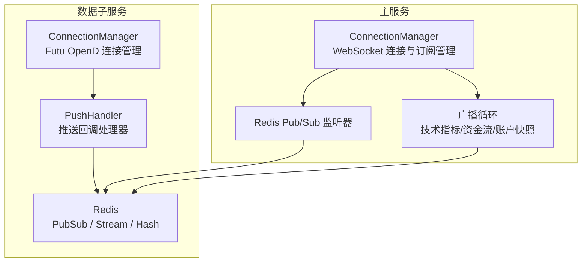
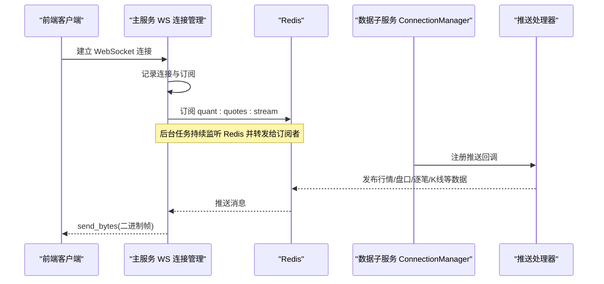
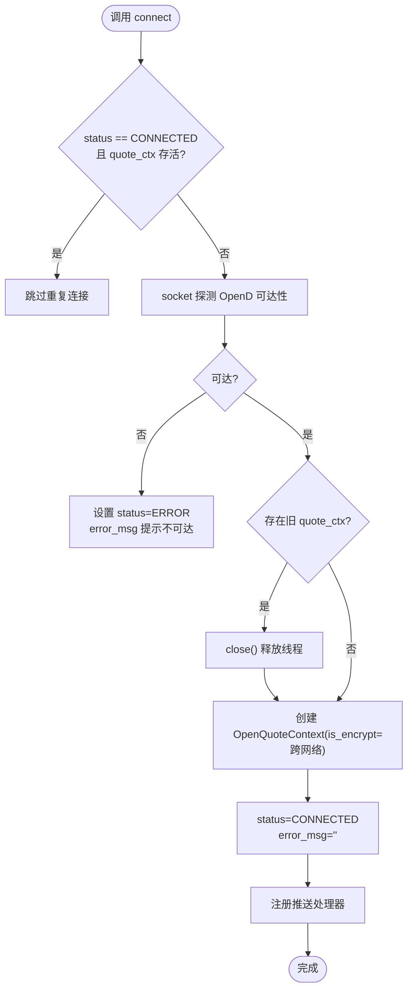
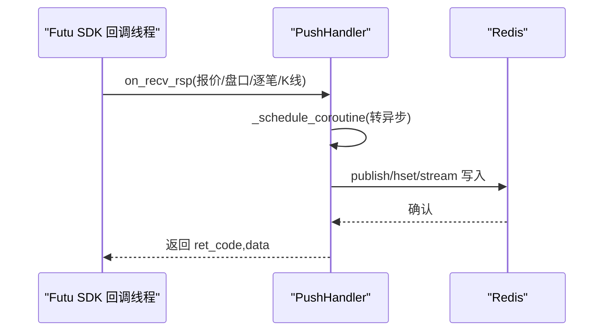
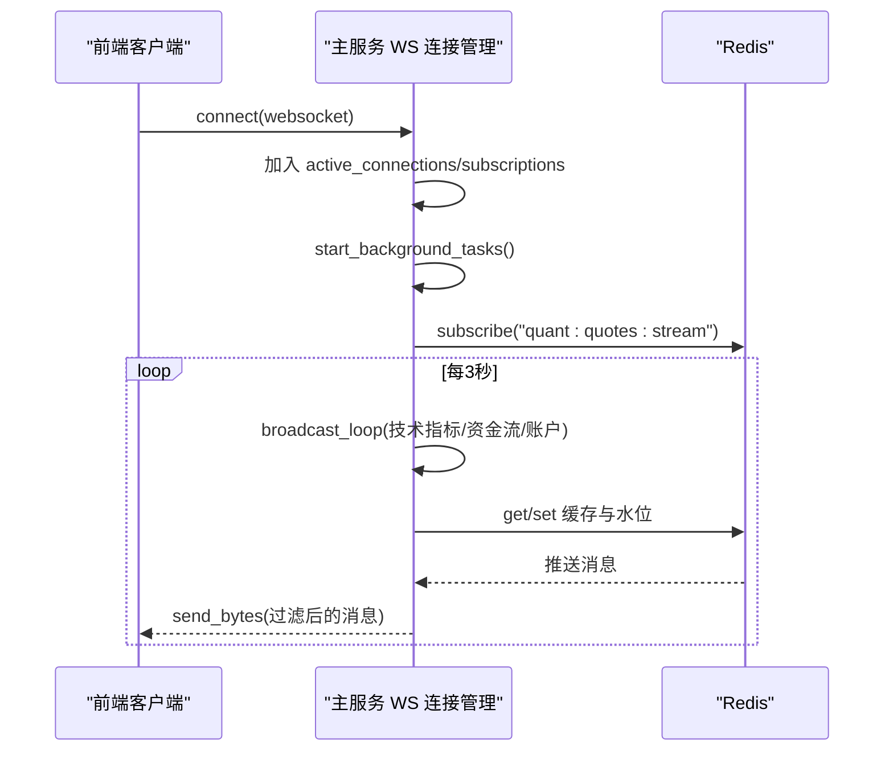
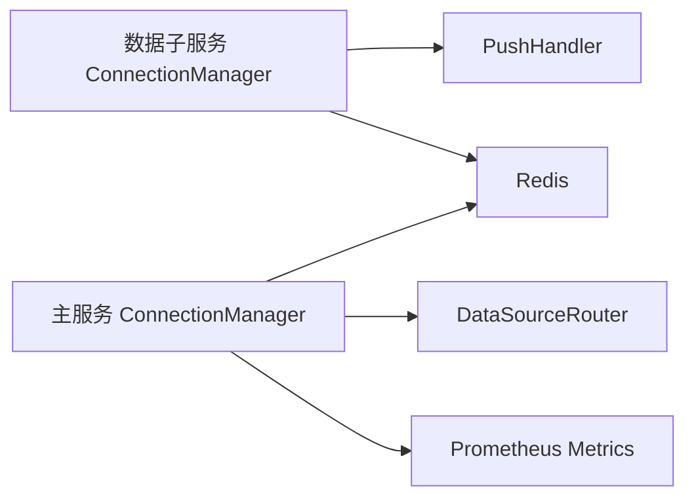

# 连接管理器设计

<cite>
**本文引用的文件**
- [connection_manager.py](file://data_subservice/futu_src/connection_manager.py)
- [push_handler.py](file://data_subservice/futu_src/push_handler.py)
- [market_engine.py](file://backend/services/market_engine.py)
- [metrics.py](file://backend/core/metrics.py)
</cite>

## 目录
1. [简介](#简介)
2. [项目结构](#项目结构)
3. [核心组件](#核心组件)
4. [架构总览](#架构总览)
5. [详细组件分析](#详细组件分析)
6. [依赖关系分析](#依赖关系分析)
7. [性能考量](#性能考量)
8. [故障排查指南](#故障排查指南)
9. [结论](#结论)
10. [附录](#附录)

## 简介
本文件为 Quant Agent 的连接管理器提供系统化、可操作的设计文档，聚焦以下目标：
- 解释 ConnectionManager 的设计模式与职责边界（数据子服务侧的 Futu OpenD 连接管理；主服务侧的 WebSocket 连接与订阅管理）。
- 说明连接生命周期管理（建立、断开、重连）、健康检查、超时处理与资源清理。
- 阐述订阅管理机制（多客户端订阅、订阅冲突解决、订阅状态同步到 Redis）。
- 解析后台任务调度（广播循环、Redis Pub/Sub 监听器、缓存更新任务的协调）。
- 给出连接状态监控指标与性能优化策略（连接复用、内存管理、错误恢复机制）。

## 项目结构
本项目在“连接管理”方面分为两层：
- 数据子服务层：负责与 Futu OpenD 建立并维护行情/交易上下文，注册推送回调，将实时数据写入 Redis。
- 主服务层：负责前端 WebSocket 连接的接入、订阅管理、从 Redis 拉取并分发数据，以及后台轮询与兜底逻辑。

图表来源
- [connection_manager.py:44-351](file://data_subservice/futu_src/connection_manager.py#L44-L351)
- [push_handler.py:1-432](file://data_subservice/futu_src/push_handler.py#L1-L432)
- [market_engine.py:115-605](file://backend/services/market_engine.py#L115-L605)

章节来源
- [connection_manager.py:44-351](file://data_subservice/futu_src/connection_manager.py#L44-L351)
- [market_engine.py:115-605](file://backend/services/market_engine.py#L115-L605)

## 核心组件
- 数据子服务 ConnectionManager（Futu OpenD）
  - 负责 OpenQuoteContext/OpenSecTradeContext 的生命周期管理、跨网络加密握手、线程安全建连、运行时切换目标、交易解锁等。
  - 通过 push_handler 注册推送回调，将行情、盘口、逐笔成交、经纪商队列、K线等数据桥接到 Redis。
- 主服务 ConnectionManager（WebSocket）
  - 管理前端 WebSocket 连接集合与订阅映射，启动后台任务（广播循环、Redis Pub/Sub 监听），实现订阅变更同步、断线追补、缓存快照发送。
  - 维护技术指标与资金流缓存池，执行定时刷新与降级策略。
- 指标体系
  - Prometheus 指标覆盖 WS 连接数、消息发送量、Redis 队列深度、Futu 连接状态与重连统计、数据源延迟与可用性、进程线程水位等。

章节来源
- [connection_manager.py:44-351](file://data_subservice/futu_src/connection_manager.py#L44-L351)
- [market_engine.py:115-605](file://backend/services/market_engine.py#L115-L605)
- [metrics.py:1-641](file://backend/core/metrics.py#L1-L641)

## 架构总览
整体数据流与协作关系如下：

图表来源
- [market_engine.py:174-330](file://backend/services/market_engine.py#L174-L330)
- [push_handler.py:140-432](file://data_subservice/futu_src/push_handler.py#L140-L432)
- [connection_manager.py:161-197](file://data_subservice/futu_src/connection_manager.py#L161-L197)

## 详细组件分析

### 数据子服务 ConnectionManager（Futu OpenD）
- 设计要点
  - 单例化上下文：quote_ctx 全局复用，trade_ctxs 按 (TrdEnv, TrdMarket) 键值单例，避免重复创建导致 SDK 回调线程泄漏。
  - 快速探测：connect() 前使用 socket 探测 OpenD 可达性，失败即置 ERROR 并返回，避免 SDK 内部重试风暴。
  - 线程安全：使用 threading.Lock 防止并发连接；强制 futu SDK 回调线程为守护线程，进程退出即回收。
  - 跨网络加密：根据 host 判断是否启用 is_encrypt，配合 RSA 私钥配置，保障跨网络握手成功。
  - 推送桥接：连接成功后注册推送处理器，捕获事件循环，将同步回调转为异步协程写入 Redis。
  - 交易解锁：统一提取解锁逻辑，返回布尔状态供上层区分“未解锁”与“常规错误”。
  - 运行时切换：支持 switch_host 动态切换目标并重建连接。

图表来源
- [connection_manager.py:79-159](file://data_subservice/futu_src/connection_manager.py#L79-L159)
- [connection_manager.py:161-197](file://data_subservice/futu_src/connection_manager.py#L161-L197)

章节来源
- [connection_manager.py:44-351](file://data_subservice/futu_src/connection_manager.py#L44-L351)

### 推送处理器（PushHandler）
- 职责
  - 将 Futu SDK 同步回调线程中的数据转换为异步协程，通过 asyncio.run_coroutine_threadsafe 调度到主事件循环。
  - 将行情、盘口、逐笔成交、经纪商队列、K线等数据序列化并发布到 Redis 对应频道或 Stream。
  - 盘口深度与最新报价合并后发布到主流，保证前端消费一致性。
- 关键路径
  - 报价：压缩字段后写入 quant:quotes:latest 并 publish 到 quant:quotes:stream。
  - 盘口：读取最新报价 Protobuf，合并 bids/asks 后重新发布。
  - 逐笔成交：写入 quant:trades:stream:{ticker} 并 publish 到专用频道。
  - 经纪商队列/K线：发布到历史频道并桥接到 quant:* 统一旁路。

图表来源
- [push_handler.py:46-98](file://data_subservice/futu_src/push_handler.py#L46-L98)
- [push_handler.py:140-432](file://data_subservice/futu_src/push_handler.py#L140-L432)

章节来源
- [push_handler.py:1-432](file://data_subservice/futu_src/push_handler.py#L1-432)

### 主服务 ConnectionManager（WebSocket 与订阅）
- 职责
  - 管理 active_connections 与 subscriptions（WebSocket -> set[ticker]）。
  - 启动后台任务：broadcast_loop（技术指标/资金流/账户快照）、redis_pubsub_listener（订阅 quant:quotes:stream 并定向推送）。
  - 订阅变更同步：将当前所有前端订阅标的集写入 Redis（quant:ws:subscribed_tickers），供生产者动态跟随。
  - 断线追补：根据 last_ids 通过 XRANGE 获取错过的消息，批量压缩发送；无 last_id 则发送最新快照。
  - 缓存与退避：维护 tech_cache、flow_cache、last_tech_attempt，实施退避与 GC 清理无人订阅的缓存。
  - 降级与告警：Futu 全面失败时触发分布式防抖报警，YFinance 作为兜底轮询。

图表来源
- [market_engine.py:160-330](file://backend/services/market_engine.py#L160-L330)
- [market_engine.py:332-605](file://backend/services/market_engine.py#L332-L605)

章节来源
- [market_engine.py:115-605](file://backend/services/market_engine.py#L115-L605)

### 订阅管理与冲突解决
- 多客户端订阅
  - 每个 WebSocket 维护独立订阅集合，支持增量订阅/反订阅。
  - 订阅变更立即异步同步到 Redis，确保生产者与前端一致。
- 冲突解决
  - 订阅以 ticker 为单位去重（set），避免重复推送。
  - 当某标的不再被任何客户端订阅时，自动清理本地缓存与 Futu 活跃订阅记录。
- 状态同步
  - 通过 quant:ws:subscribed_tickers 集合向下游生产者暴露当前有效订阅集。

章节来源
- [market_engine.py:191-268](file://backend/services/market_engine.py#L191-L268)
- [market_engine.py:332-460](file://backend/services/market_engine.py#L332-L460)

### 后台任务调度机制
- 广播循环（broadcast_loop）
  - 周期性计算需要更新的 tickers，优先走 Futu，失败或不受支持时回落到 YFinance。
  - 维护技术指标缓存与资金流缓存，设置退避时间戳，防止请求风暴。
  - 定时拉取账户信息，生成风控预警（主力资金流出）。
- Redis Pub/Sub 监听器
  - 持续监听 quant:quotes:stream，解析 Protobuf 获取 ticker，仅推送给本机订阅了该 ticker 的连接。
- 缓存更新任务
  - 技术指标：每小时全量刷新或新标的首次尝试，失败标的退避 600s。
  - 资金流：低频数据，5 分钟粒度刷新，失败也更新水位避免下轮重试。

章节来源
- [market_engine.py:332-605](file://backend/services/market_engine.py#L332-L605)

## 依赖关系分析
- 数据子服务 ConnectionManager 依赖：
  - futu SDK（OpenQuoteContext/OpenSecTradeContext、回调基类）
  - push_handler（注册回调、桥接 Redis）
  - 环境变量（FUTU_HOST/FUTU_PORT/FUTU_RSA_PRIVATE_KEY/FUTU_PWD_UNLOCK 等）
- 主服务 ConnectionManager 依赖：
  - Redis（Pub/Sub、Stream、Hash）
  - data_source_router（Futu/YFinance 远程调用）
  - metrics（Prometheus 指标上报）
  - kline_warehouse（K线仓库守护任务）

图表来源
- [connection_manager.py:44-351](file://data_subservice/futu_src/connection_manager.py#L44-L351)
- [push_handler.py:1-432](file://data_subservice/futu_src/push_handler.py#L1-L432)
- [market_engine.py:115-605](file://backend/services/market_engine.py#L115-L605)
- [metrics.py:1-641](file://backend/core/metrics.py#L1-L641)

章节来源
- [connection_manager.py:44-351](file://data_subservice/futu_src/connection_manager.py#L44-L351)
- [market_engine.py:115-605](file://backend/services/market_engine.py#L115-L605)
- [metrics.py:1-641](file://backend/core/metrics.py#L1-L641)

## 性能考量
- 连接复用与线程安全
  - quote_ctx 全局复用，trade_ctxs 按市场+环境单例，避免频繁创建导致的回调线程泄漏。
  - 使用守护线程与显式 close 释放资源，防止进程退出残留线程。
- 内存管理
  - 定期清理不在监控列表中的缓存条目（tech_cache、flow_cache）。
  - 订阅集合与活动连接集合及时移除，避免内存膨胀。
- 错误恢复与退避
  - 快速探测 OpenD 可达性，失败即置 ERROR，避免 SDK 内部重试风暴。
  - 技术指标与 YFinance 请求采用退避策略（last_tech_attempt、last_futu_update），防止高频重试。
  - 分布式防抖锁用于宏观风控预警，避免集群重复报警。
- 连接池优化
  - trade_ctxs 按 (TrdEnv, TrdMarket) 键值复用，减少上下文创建开销。
  - 推送处理器批量压缩发送（超过阈值组合二进制帧），降低网络开销。

章节来源
- [connection_manager.py:79-279](file://data_subservice/futu_src/connection_manager.py#L79-L279)
- [market_engine.py:332-605](file://backend/services/market_engine.py#L332-L605)
- [push_handler.py:140-432](file://data_subservice/futu_src/push_handler.py#L140-L432)

## 故障排查指南
- 常见问题定位
  - OpenD 不可达：connect() 中快速探测失败会设置 status=ERROR 并记录 error_msg，检查 FUTU_HOST/FUTU_PORT 与网络连通性。
  - 跨网络连接失败：确认已配置 FUTU_RSA_PRIVATE_KEY 或 FUTU_PWD_UNLOCK，否则交易上下文创建会被拒绝。
  - 推送不可用：若 FUTU_PUSH_ENABLED=false，将退化为拉取模式；检查事件循环是否正确设置。
  - 订阅不一致：核对 quant:ws:subscribed_tickers 与实际前端订阅集合是否一致。
  - 指标异常：查看 Prometheus 指标（WS_ACTIVE_CONNECTIONS、WS_MESSAGES_SENT、REDIS_QUEUE_DEPTH、FUTU_CONNECTION_STATUS 等）。
- 诊断步骤
  - 检查日志输出（连接状态、错误信息、推送注册结果）。
  - 验证 Redis 频道是否有数据（quant:quotes:stream、quant:trades:stream:{ticker}）。
  - 观察后台任务是否正常运行（广播循环、Pub/Sub 监听器）。
  - 使用指标面板监控连接数、消息发送量、队列深度、重连次数与延迟。

章节来源
- [connection_manager.py:79-197](file://data_subservice/futu_src/connection_manager.py#L79-L197)
- [market_engine.py:174-330](file://backend/services/market_engine.py#L174-L330)
- [metrics.py:53-94](file://backend/core/metrics.py#L53-L94)
- [metrics.py:265-284](file://backend/core/metrics.py#L265-L284)

## 结论
本连接管理器通过分层设计与严格的资源管理，实现了高可靠的数据接入与分发：
- 数据子服务侧专注与 Futu OpenD 的稳定连接与推送桥接，避免线程泄漏与连接风暴。
- 主服务侧统一管理前端 WebSocket 连接与订阅，结合 Redis 总线实现低延迟、可扩展的实时推送。
- 后台任务调度与缓存机制保障了数据的时效性与系统稳定性，同时具备完善的降级与告警能力。
- 指标体系为运维提供了全面的可观测性，便于快速定位与优化性能瓶颈。

## 附录
- 关键环境变量
  - FUTU_HOST、FUTU_PORT：Futu OpenD 地址与端口
  - FUTU_RSA_PRIVATE_KEY：跨网络加密所需的 RSA 私钥路径
  - FUTU_PWD_UNLOCK、FUTU_TRD_UNLOCK_PWD、FUTU_TRADE_PWD：交易解锁密码
  - FUTU_PUSH_ENABLED：是否启用推送模式
  - REDIS_HOST、REDIS_PORT、REDIS_PASSWORD：Redis 连接参数
- 监控指标建议
  - 关注 WS_ACTIVE_CONNECTIONS、WS_SUBSCRIPTIONS、WS_MESSAGES_SENT/DROPPED 的变化趋势。
  - 监控 REDIS_QUEUE_DEPTH 与 REDIS_OPERATION_LATENCY，识别积压与延迟问题。
  - 跟踪 FUTU_CONNECTION_STATUS、FUTU_RECONNECT_TOTAL/LATENCY，评估连接健康度。
  - 结合 DATASOURCE_LATENCY、DATASOURCE_AVAILABILITY 评估数据源质量。