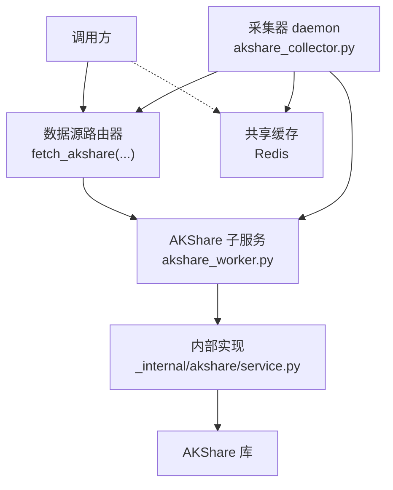
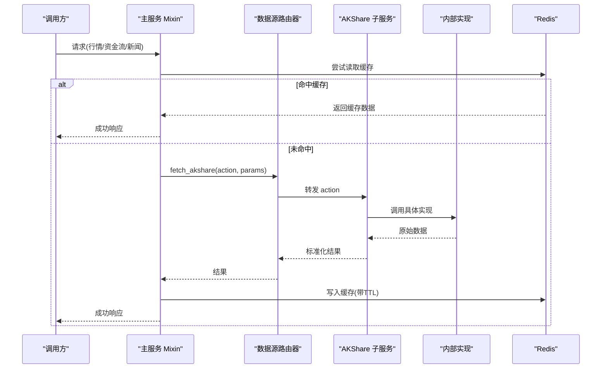
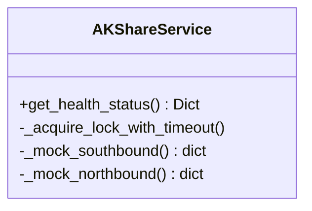
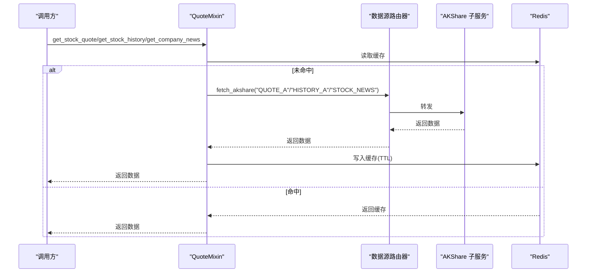
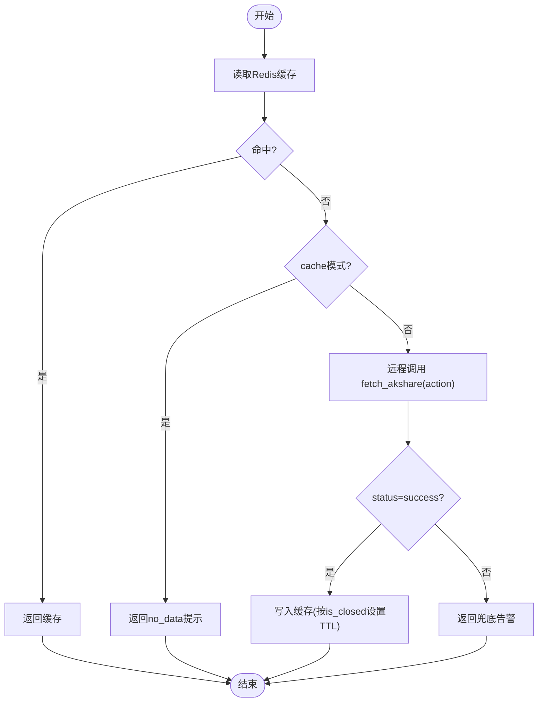
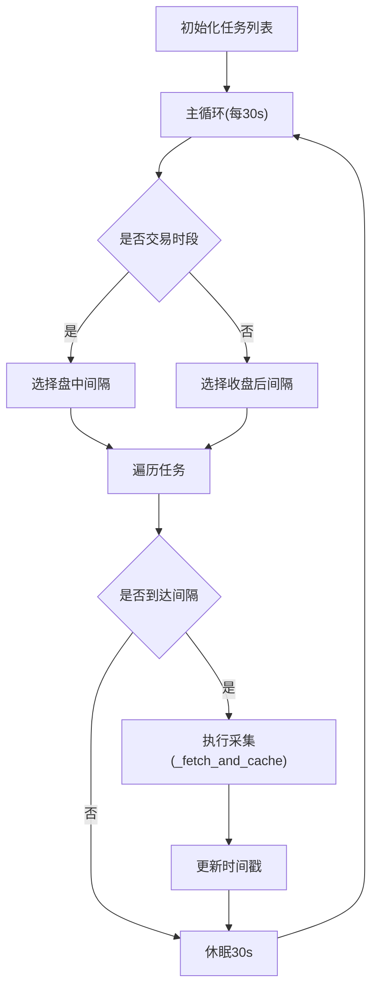
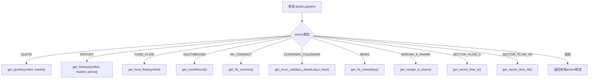
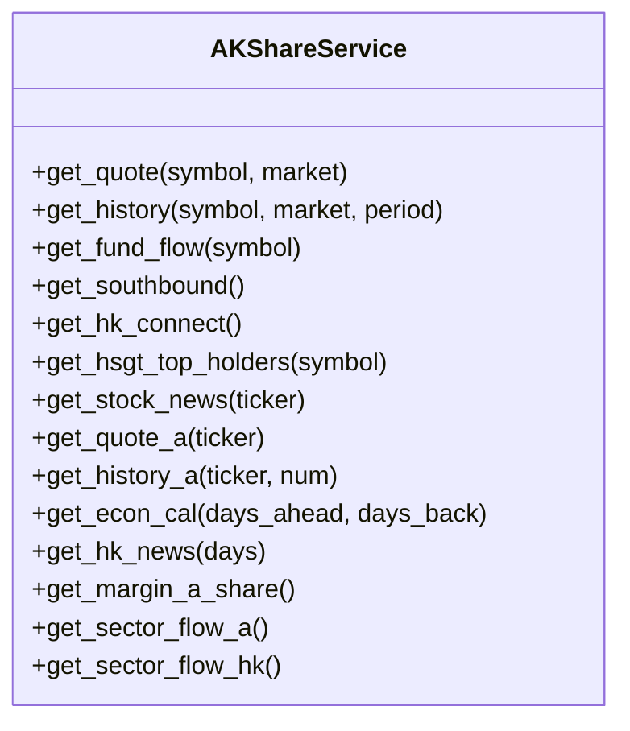
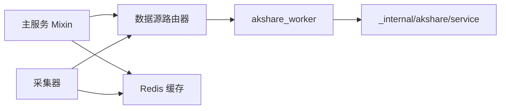

# A股数据源集成

<cite>
**本文引用的文件**
- [backend/services/akshare/service.py](file://backend/services/akshare/service.py)
- [backend/workers/akshare_collector.py](file://backend/workers/akshare_collector.py)
- [data_subservice/akshare_worker.py](file://data_subservice/akshare_worker.py)
- [data_subservice/_internal/akshare/service.py](file://data_subservice/_internal/akshare/service.py)
- [backend/services/akshare/quote.py](file://backend/services/akshare/quote.py)
- [backend/services/akshare/flow.py](file://backend/services/akshare/flow.py)
- [backend/core/ticker_format.py](file://backend/core/ticker_format.py)
</cite>

## 目录
1. [简介](#简介)
2. [项目结构](#项目结构)
3. [核心组件](#核心组件)
4. [架构总览](#架构总览)
5. [详细组件分析](#详细组件分析)
6. [依赖关系分析](#依赖关系分析)
7. [性能与配置](#性能与配置)
8. [故障排查指南](#故障排查指南)
9. [结论](#结论)
10. [附录：数据类型覆盖与标准化](#附录：数据类型覆盖与标准化)

## 简介
本文件面向A股市场数据接入，围绕AKShare数据源在系统中的集成方式，说明沪深京交易所行情、资金流向、宏观日历等数据的采集、缓存、熔断与降级策略；解释数据采集器（定时任务、增量更新、断点续传）的实现思路；梳理数据类型覆盖（K线、财务指标、龙虎榜、融资融券等）及数据标准化处理（格式转换、时间序列对齐、质量校验）；并提供配置选项、使用示例与常见问题排查方法。

## 项目结构
系统采用“主服务 + 子服务 + 采集器”的解耦架构：
- 主服务（backend）：提供业务接口、缓存、熔断、降级与路由转发，不直接持有外部连接。
- 子服务（data_subservice）：物理解耦的AKShare实现，封装具体数据拉取逻辑，暴露统一action接口。
- 采集器（workers）：在北京节点运行，定时通过子服务拉取并写入共享Redis，供主服务cache模式读取。

**图表来源**
- [backend/workers/akshare_collector.py:150-207](file://backend/workers/akshare_collector.py#L150-L207)
- [data_subservice/akshare_worker.py:9-68](file://data_subservice/akshare_worker.py#L9-L68)
- [data_subservice/_internal/akshare/service.py:38-256](file://data_subservice/_internal/akshare/service.py#L38-L256)

**章节来源**
- [backend/workers/akshare_collector.py:1-207](file://backend/workers/akshare_collector.py#L1-L207)
- [data_subservice/akshare_worker.py:1-69](file://data_subservice/akshare_worker.py#L1-L69)
- [data_subservice/_internal/akshare/service.py:1-256](file://data_subservice/_internal/akshare/service.py#L1-L256)

## 核心组件
- AKShareService（主服务侧）：负责健康状态、熔断、缓存模式切换与兜底返回。
- QuoteMixin / FlowMixin：封装个股新闻、实时行情、历史K线与资金流向的远程调用、缓存、熔断与降级。
- AKShareCollector：北京节点定时采集daemon，按交易时段调整频率，写回共享Redis。
- akshare_worker：子服务入口，将action映射到具体实现，屏蔽港股不支持场景。
- _internal/akshare/service：子服务内聚合各能力（行情、资金流、宏观日历、板块资金流、融资融券等）。

**章节来源**
- [backend/services/akshare/service.py:31-114](file://backend/services/akshare/service.py#L31-L114)
- [backend/services/akshare/quote.py:22-244](file://backend/services/akshare/quote.py#L22-L244)
- [backend/services/akshare/flow.py:18-169](file://backend/services/akshare/flow.py#L18-L169)
- [backend/workers/akshare_collector.py:40-142](file://backend/workers/akshare_collector.py#L40-L142)
- [data_subservice/akshare_worker.py:9-68](file://data_subservice/akshare_worker.py#L9-L68)
- [data_subservice/_internal/akshare/service.py:38-256](file://data_subservice/_internal/akshare/service.py#L38-L256)

## 架构总览
主服务通过数据源路由器统一转发至AKShare子服务；子服务内部基于circuit_breaker进行限流保护；采集器定时拉取关键数据写入Redis，主服务可在cache模式下仅读缓存，降低直连压力。

**图表来源**
- [backend/services/akshare/quote.py:36-139](file://backend/services/akshare/quote.py#L36-L139)
- [backend/services/akshare/flow.py:21-89](file://backend/services/akshare/flow.py#L21-L89)
- [data_subservice/akshare_worker.py:9-68](file://data_subservice/akshare_worker.py#L9-L68)
- [data_subservice/_internal/akshare/service.py:72-202](file://data_subservice/_internal/akshare/service.py#L72-L202)

## 详细组件分析

### 主服务侧：AKShareService（健康与模式）
- 支持两种运行模式：direct（直连子服务）与 cache（仅读Redis，由北京VPS采集器写入）。
- 提供健康状态查询，映射熔断器状态为healthy/circuit_open/recovering。
- 使用分布式锁避免多实例并发重复请求。

**图表来源**
- [backend/services/akshare/service.py:31-114](file://backend/services/akshare/service.py#L31-L114)

**章节来源**
- [backend/services/akshare/service.py:31-114](file://backend/services/akshare/service.py#L31-L114)

### 主服务侧：QuoteMixin（个股新闻、实时行情、历史K线）
- 个股新闻：A股走AKShare子服务，港股降级yahoo；带缓存与熔断。
- 实时行情/历史K线：A股走AKShare新浪源；失败触发熔断冷却。
- 统一加锁防抖与双重缓存检查，减少穿透。

**图表来源**
- [backend/services/akshare/quote.py:36-244](file://backend/services/akshare/quote.py#L36-L244)

**章节来源**
- [backend/services/akshare/quote.py:22-244](file://backend/services/akshare/quote.py#L22-L244)

### 主服务侧：FlowMixin（北向/南向/港股通资金流向）
- 北向资金：调用FUND_FLOW；南向资金：调用SOUTHBOUND；港股通双通道：HK_CONNECT。
- 交易时段与非交易时段差异化TTL；失败时返回兜底告警数据。

**图表来源**
- [backend/services/akshare/flow.py:21-169](file://backend/services/akshare/flow.py#L21-L169)

**章节来源**
- [backend/services/akshare/flow.py:18-169](file://backend/services/akshare/flow.py#L18-L169)

### 采集器：AKShareCollector（定时任务、增量更新、断点续传）
- 任务定义：南向/北向资金、经济日历、港股通双通道明细。
- 交易时段判断：盘中每5分钟，收盘后每2小时；非交易时段跳过。
- 增量更新：每次采集记录last_collected时间戳，未到间隔则跳过。
- 断点续传：异常时快速重试（缩短下次等待），保证最终一致性。

**图表来源**
- [backend/workers/akshare_collector.py:40-142](file://backend/workers/akshare_collector.py#L40-L142)
- [backend/workers/akshare_collector.py:150-207](file://backend/workers/akshare_collector.py#L150-L207)

**章节来源**
- [backend/workers/akshare_collector.py:1-207](file://backend/workers/akshare_collector.py#L1-L207)

### 子服务：akshare_worker（action路由）
- 将外部action（QUOTE/HISTORY/FUND_FLOW/SOUTHBOUND/HK_CONNECT/CALENDAR/ECONOMIC_CALENDAR/NEWS/MARGIN_A_SHARE/SECTOR_FLOW_*）映射到内部实现。
- 对港股QUOTE/HISTORY/FUND_FLOW明确返回UNSUPPORTED，引导上层改走其他数据源。

**图表来源**
- [data_subservice/akshare_worker.py:9-68](file://data_subservice/akshare_worker.py#L9-L68)

**章节来源**
- [data_subservice/akshare_worker.py:1-69](file://data_subservice/akshare_worker.py#L1-L69)

### 子服务内部：_internal/akshare/service（能力聚合）
- 统一封装行情、资金流、宏观日历、板块资金流、融资融券等能力。
- 每个能力通过circuit_breaker.call包裹，记录成功/失败，便于限流与熔断。

**图表来源**
- [data_subservice/_internal/akshare/service.py:38-256](file://data_subservice/_internal/akshare/service.py#L38-L256)

**章节来源**
- [data_subservice/_internal/akshare/service.py:1-256](file://data_subservice/_internal/akshare/service.py#L1-L256)

## 依赖关系分析
- 主服务依赖数据源路由器与Redis，不直接依赖AKShare库。
- 子服务依赖内部实现与circuit_breaker，对外暴露统一action。
- 采集器依赖路由器与Redis，定时调度任务。

**图表来源**
- [backend/services/akshare/quote.py:16-20](file://backend/services/akshare/quote.py#L16-L20)
- [backend/services/akshare/flow.py:13-15](file://backend/services/akshare/flow.py#L13-L15)
- [backend/workers/akshare_collector.py:31-34](file://backend/workers/akshare_collector.py#L31-L34)
- [data_subservice/akshare_worker.py:5-6](file://data_subservice/akshare_worker.py#L5-L6)
- [data_subservice/_internal/akshare/service.py:13-35](file://data_subservice/_internal/akshare/service.py#L13-L35)

**章节来源**
- [backend/services/akshare/quote.py:1-244](file://backend/services/akshare/quote.py#L1-L244)
- [backend/services/akshare/flow.py:1-169](file://backend/services/akshare/flow.py#L1-L169)
- [backend/workers/akshare_collector.py:1-207](file://backend/workers/akshare_collector.py#L1-L207)
- [data_subservice/akshare_worker.py:1-69](file://data_subservice/akshare_worker.py#L1-L69)
- [data_subservice/_internal/akshare/service.py:1-256](file://data_subservice/_internal/akshare/service.py#L1-L256)

## 性能与配置
- 运行模式：通过环境变量控制主服务模式。
  - AKSHARE_MODE=direct：主服务直连子服务。
  - AKSHARE_MODE=cache：主服务仅读Redis，由北京VPS采集器写入。
- 缓存策略：
  - 交易时段短TTL（如300秒+随机抖动），非交易时段长TTL（如43200秒）。
  - 双重缓存检查与分布式锁防止缓存击穿。
- 熔断与限流：
  - 子服务层使用circuit_breaker对每个symbol/action进行限流保护。
  - 主服务层根据连续错误次数触发冷却期，避免雪崩。
- 采集频率：
  - 南向/北向资金：盘中5分钟，收盘后2小时。
  - 经济日历：12小时。
  - 港股通双通道：盘中5分钟，收盘后2小时。
- Ticker格式化：
  - 统一将不同市场代码转换为标准格式，避免串台与解析错误。

**章节来源**
- [backend/services/akshare/service.py:27-44](file://backend/services/akshare/service.py#L27-L44)
- [backend/services/akshare/quote.py:141-244](file://backend/services/akshare/quote.py#L141-L244)
- [backend/services/akshare/flow.py:21-89](file://backend/services/akshare/flow.py#L21-L89)
- [backend/workers/akshare_collector.py:50-96](file://backend/workers/akshare_collector.py#L50-L96)
- [backend/core/ticker_format.py:8-98](file://backend/core/ticker_format.py#L8-L98)

## 故障排查指南
- 症状：接口频繁报错或返回空数据
  - 检查AKSHARE_MODE是否为cache，确认北京VPS采集器是否正常运行。
  - 查看Redis中对应key是否存在且未过期。
  - 观察熔断状态与健康接口返回，确认是否处于冷却期。
- 症状：港股数据无法获取
  - 子服务对港股QUOTE/HISTORY/FUND_FLOW返回UNSUPPORTED，应改走其他数据源（如Futu/yahoo）。
- 症状：缓存未命中
  - 若为cache模式，需等待采集器写入；若为direct模式，检查网络与子服务可用性。
- 症状：高并发导致超时
  - 启用分布式锁与双重缓存检查；适当增加TTL与退避策略。
- 症状：数据不一致
  - 核对采集器任务间隔与交易时段判断逻辑；确认is_closed字段影响TTL。

**章节来源**
- [backend/services/akshare/service.py:46-77](file://backend/services/akshare/service.py#L46-L77)
- [backend/services/akshare/quote.py:42-92](file://backend/services/akshare/quote.py#L42-L92)
- [backend/services/akshare/flow.py:29-89](file://backend/services/akshare/flow.py#L29-L89)
- [data_subservice/akshare_worker.py:12-39](file://data_subservice/akshare_worker.py#L12-L39)
- [backend/workers/akshare_collector.py:79-96](file://backend/workers/akshare_collector.py#L79-L96)

## 结论
本方案通过“主服务路由 + 子服务实现 + 采集器缓存”的分层设计，实现了AKShare数据源的稳定接入与高效利用。结合熔断、限流、缓存与降级策略，系统在直连与缓存两种模式下均能保持高可用与低延迟。建议在生产环境优先采用cache模式，配合北京VPS采集器保障数据时效性；同时完善监控与告警，及时发现限流与熔断事件。

## 附录：数据类型覆盖与标准化
- 数据类型覆盖
  - K线数据：A股历史K线（daily/period可调）、实时行情（新浪源兜底）。
  - 资金流向：北向资金（外资买入A股）、南向资金（港股通净买入）、港股通双通道明细。
  - 宏观数据：宏观经济日历（未来N天）。
  - 其他：板块资金流（A股/港股）、融资融券（A股）、个股新闻（A股/港股）。
- 标准化处理
  - 格式转换：Ticker统一为标准格式（SH./SZ./HK./US.），避免跨市场混淆。
  - 时间序列对齐：历史K线以records形式返回，便于下游时间序列对齐。
  - 质量校验：子服务层通过circuit_breaker记录成功/失败；主服务层对异常返回兜底告警，禁止注入假数据。
- 使用示例（概念性）
  - 切换数据源：设置AKSHARE_MODE=cache或direct。
  - 调优参数：调整采集间隔、缓存TTL、熔断冷却时间。
  - 监控指标：关注健康状态、熔断状态、缓存命中率与接口延迟。

**章节来源**
- [data_subservice/_internal/akshare/service.py:72-256](file://data_subservice/_internal/akshare/service.py#L72-L256)
- [backend/core/ticker_format.py:8-98](file://backend/core/ticker_format.py#L8-L98)
- [backend/services/akshare/quote.py:141-244](file://backend/services/akshare/quote.py#L141-L244)
- [backend/services/akshare/flow.py:21-169](file://backend/services/akshare/flow.py#L21-L169)
- [backend/workers/akshare_collector.py:50-142](file://backend/workers/akshare_collector.py#L50-L142)
