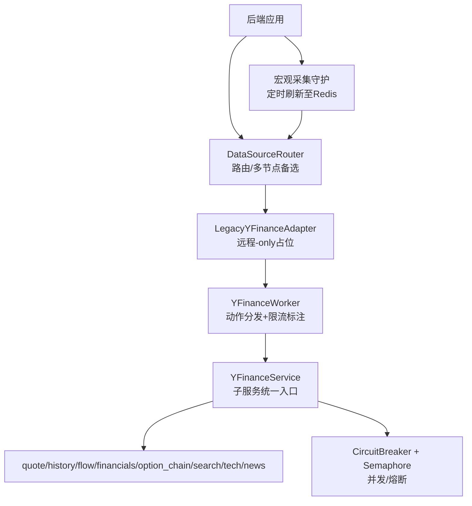
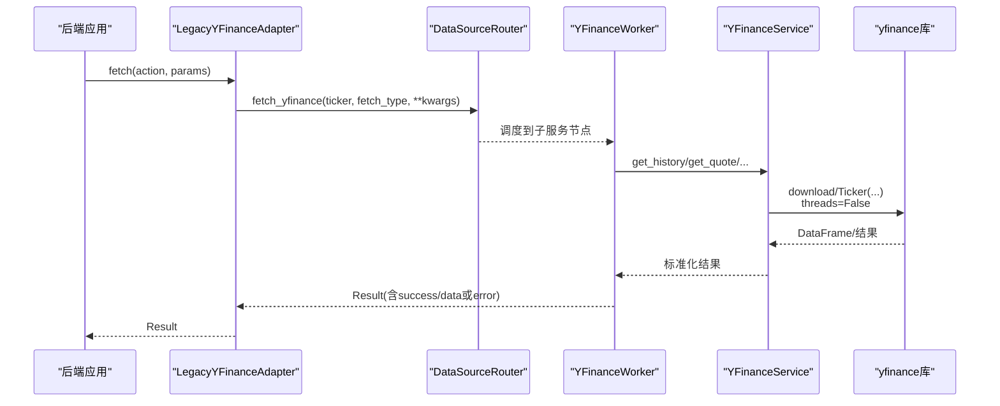
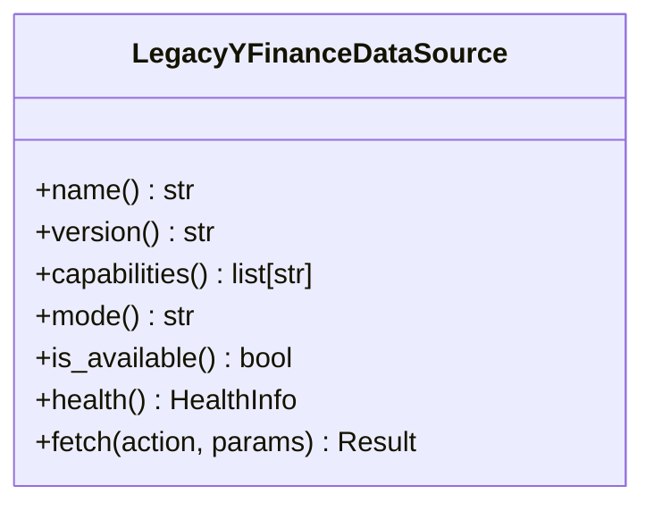
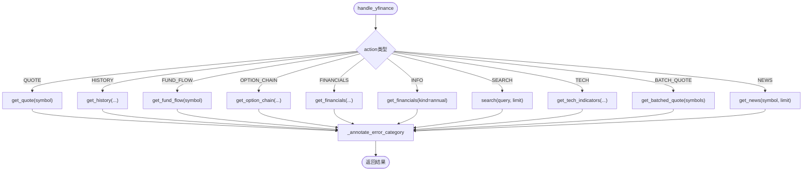
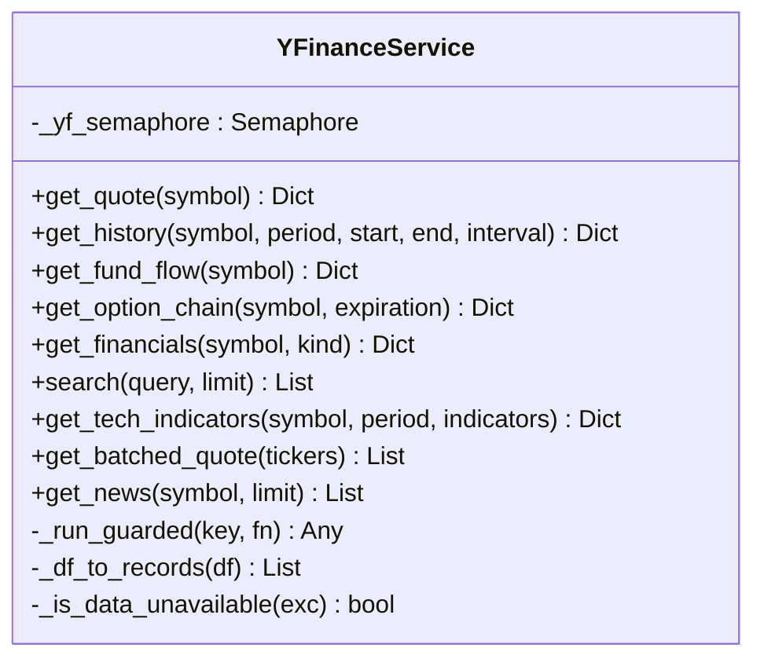
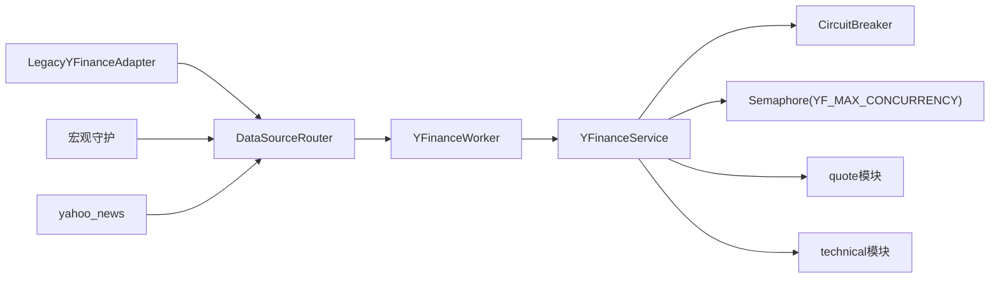

# Yahoo Finance集成

<cite>
**本文引用的文件**
- [data_subservice/yfinance_worker.py](file://data_subservice/yfinance_worker.py)
- [backend/workers/collectors/yfinance.py](file://backend/workers/collectors/yfinance.py)
- [backend/services/datasource/adapters/legacy_yfinance.py](file://backend/services/datasource/adapters/legacy_yfinance.py)
- [backend/core/yahoo_news.py](file://backend/core/yahoo_news.py)
- [data_subservice/_internal/yfinance/service.py](file://data_subservice/_internal/yfinance/service.py)
- [data_subservice/_internal/yfinance/quote.py](file://data_subservice/_internal/yfinance/quote.py)
- [data_subservice/_internal/yfinance/technical.py](file://data_subservice/_internal/yfinance/technical.py)
- [data_subservice/tests/test_yfinance_service.py](file://data_subservice/tests/test_yfinance_service.py)
</cite>

## 目录
1. [简介](#简介)
2. [项目结构](#项目结构)
3. [核心组件](#核心组件)
4. [架构总览](#架构总览)
5. [详细组件分析](#详细组件分析)
6. [依赖关系分析](#依赖关系分析)
7. [性能与并发控制](#性能与并发控制)
8. [数据质量保障](#数据质量保障)
9. [使用示例与最佳实践](#使用示例与最佳实践)
10. [故障排查指南](#故障排查指南)
11. [迁移指南](#迁移指南)
12. [结论](#结论)

## 简介
本文件为Yahoo Finance数据源集成的完整技术文档，覆盖API特性、免费访问限制与替代方案、工作进程实现（异步请求、缓存策略、重试/退避）、数据类型支持（美股、ETF、指数等）、数据质量保障（验证、缺失值处理、异常检测）、使用示例与最佳实践（频率控制、错误处理），以及从旧版本到新版本的迁移建议。

## 项目结构
Yahoo Finance能力在系统中被物理解耦到独立的数据子服务中，主后端不再直接执行yfinance库调用，而是通过适配器与路由器将请求联邦到US-YF-A/B子服务节点。子服务内部提供统一的YFinanceService，封装行情、历史、资金流、期权链、财务、搜索、技术指标与新闻等能力，并通过信号量与熔断器进行并发与稳定性控制。

图表来源
- [backend/services/datasource/adapters/legacy_yfinance.py:131-175](file://backend/services/datasource/adapters/legacy_yfinance.py#L131-L175)
- [data_subservice/yfinance_worker.py:51-104](file://data_subservice/yfinance_worker.py#L51-L104)
- [data_subservice/_internal/yfinance/service.py:95-121](file://data_subservice/_internal/yfinance/service.py#L95-L121)
- [backend/workers/collectors/yfinance.py:55-90](file://backend/workers/collectors/yfinance.py#L55-L90)

章节来源
- [backend/services/datasource/adapters/legacy_yfinance.py:1-191](file://backend/services/datasource/adapters/legacy_yfinance.py#L1-L191)
- [data_subservice/yfinance_worker.py:1-104](file://data_subservice/yfinance_worker.py#L1-L104)
- [data_subservice/_internal/yfinance/service.py:1-339](file://data_subservice/_internal/yfinance/service.py#L1-L339)
- [backend/workers/collectors/yfinance.py:1-95](file://backend/workers/collectors/yfinance.py#L1-L95)

## 核心组件
- LegacyYFinanceAdapter：后端侧“远程-only”适配器，负责action到router fetch_type的映射与Result归一化，所有实际取数经DataSourceRouter联邦到子服务。
- YFinanceWorker：子服务侧动作分发器，统一处理QUOTE/HISTORY/FUND_FLOW/OPTION_CHAIN/FINANCIALS/INFO/SEARCH/TECH/BATCH_QUOTE/NEWS，并对限流类错误进行error_category标注。
- YFinanceService：子服务统一入口，封装并发信号量、熔断器、日期解析、DataFrame转换、技术指标计算与信号检测。
- quote模块：实现实时行情、历史K线、资金流、财务、期权链、批量行情与新闻抓取。
- technical模块：实现MACD/RSI/EMA/SMA等技术指标计算与买卖信号检测。
- 宏观采集守护：周期性通过子服务拉取HISTORY并写入Redis缓存，供宏观面板渲染sparkline。

章节来源
- [backend/services/datasource/adapters/legacy_yfinance.py:25-98](file://backend/services/datasource/adapters/legacy_yfinance.py#L25-L98)
- [data_subservice/yfinance_worker.py:8-104](file://data_subservice/yfinance_worker.py#L8-L104)
- [data_subservice/_internal/yfinance/service.py:44-121](file://data_subservice/_internal/yfinance/service.py#L44-L121)
- [data_subservice/_internal/yfinance/quote.py:16-251](file://data_subservice/_internal/yfinance/quote.py#L16-L251)
- [data_subservice/_internal/yfinance/technical.py:7-121](file://data_subservice/_internal/yfinance/technical.py#L7-L121)
- [backend/workers/collectors/yfinance.py:19-90](file://backend/workers/collectors/yfinance.py#L19-L90)

## 架构总览
Yahoo Finance能力采用“主服务-子服务”解耦架构：
- 主服务仅暴露适配器与路由，不直接运行yfinance；
- 子服务承载真实网络IO，具备并发控制与熔断保护；
- 宏观数据通过守护进程定时刷新至Redis，读侧按ticker小写键读取；
- 新闻兜底通过DataSourceRouter转发到子服务NEWS action，主服务做字段归一化。

图表来源
- [backend/services/datasource/adapters/legacy_yfinance.py:131-175](file://backend/services/datasource/adapters/legacy_yfinance.py#L131-L175)
- [data_subservice/yfinance_worker.py:51-104](file://data_subservice/yfinance_worker.py#L51-L104)
- [data_subservice/_internal/yfinance/service.py:144-178](file://data_subservice/_internal/yfinance/service.py#L144-L178)
- [data_subservice/_internal/yfinance/quote.py:48-89](file://data_subservice/_internal/yfinance/quote.py#L48-L89)

## 详细组件分析

### LegacyYFinanceAdapter（远程-only适配器）
- 作用：将大写action映射为router的小写fetch_type，提取并格式化ticker，委托给DataSourceRouter，并将返回dict归一化为Result。
- 关键点：
  - capabilities声明需覆盖大小写形式，确保facade按action选源时能命中；
  - mode恒为remote，is_available恒为True（健康检查由子服务承担）；
  - 失败路径标记retryable=True，便于上层重试/降级。

图表来源
- [backend/services/datasource/adapters/legacy_yfinance.py:49-191](file://backend/services/datasource/adapters/legacy_yfinance.py#L49-L191)

章节来源
- [backend/services/datasource/adapters/legacy_yfinance.py:25-191](file://backend/services/datasource/adapters/legacy_yfinance.py#L25-L191)

### YFinanceWorker（动作分发与限流标注）
- 作用：接收外部action与参数，调用对应service方法，并对限流类错误补充error_category=rate_limit，使主服务正确走退避而非熔断。
- 支持的action：QUOTE、HISTORY、FUND_FLOW、OPTION_CHAIN、FINANCIALS、INFO、SEARCH、TECH、BATCH_QUOTE、NEWS。
- 限流关键词匹配：too many requests/rate limit/throttl等。

图表来源
- [data_subservice/yfinance_worker.py:51-104](file://data_subservice/yfinance_worker.py#L51-L104)

章节来源
- [data_subservice/yfinance_worker.py:8-104](file://data_subservice/yfinance_worker.py#L8-L104)

### YFinanceService（子服务统一入口）
- 并发控制：通过asyncio.Semaphore限制同时进行的yfinance外部IO调用数（默认8，可配置YF_MAX_CONCURRENCY）。
- 熔断器：记录成功/失败，区分数据不可用与源级故障，避免单标的miss误杀整节点。
- 数据转换：_df_to_records将DataFrame拍平为records，兼容MultiIndex列名，安全数值转换。
- 技术指标：基于pandas矢量化计算MACD/RSI/EMA/SMA，并生成买卖信号。

图表来源
- [data_subservice/_internal/yfinance/service.py:36-339](file://data_subservice/_internal/yfinance/service.py#L36-L339)

章节来源
- [data_subservice/_internal/yfinance/service.py:44-339](file://data_subservice/_internal/yfinance/service.py#L44-L339)

### quote模块（行情/历史/资金流/财务/期权/新闻）
- 实时行情：fast_info获取last_price/previous_close/currency/timezone等。
- 历史K线：yf.download设置threads=False，关闭内置多线程，交由Semaphore管控；对MultiIndex列名拍平；异常向上抛出以便分类。
- 资金流：机构持仓列表。
- 财务：年度/季度利润表前若干期。
- 期权链：calls/puts明细，包含strike/bid/ask/lastPrice/volume/openInterest/impliedVolatility等字段归一化。
- 新闻：返回uuid/title/publisher/link/providerPublishTime/type/relatedTickers等。

章节来源
- [data_subservice/_internal/yfinance/quote.py:16-251](file://data_subservice/_internal/yfinance/quote.py#L16-L251)

### technical模块（技术指标与信号）
- 指标：SMA(20/50/200)、EMA(12/26)、RSI(14)、MACD(macd/signal/hist)。
- 信号：趋势（SMA50 vs SMA200）、RSI超买超卖（>70/<30）。

章节来源
- [data_subservice/_internal/yfinance/technical.py:7-121](file://data_subservice/_internal/yfinance/technical.py#L7-L121)

### 宏观采集守护（定时刷新）
- 周期：每5分钟刷新一次。
- 行为：遍历宏观指标ticker列表，调用子服务HISTORY接口，写入Redis键yf_macro_cache_{ticker.lower()}，TTL=3600秒。
- 目的：供宏观面板渲染sparkline（close/date序列）。

章节来源
- [backend/workers/collectors/yfinance.py:19-90](file://backend/workers/collectors/yfinance.py#L19-L90)

### 新闻兜底（主服务）
- 行为：将港股代码格式统一为Yahoo后缀式，调用子服务NEWS action，返回与Finnhub一致的结构（category/datetime/headline/summary/source/url/related）。
- 降级：当AKShare/Finnhub不可用或解析异常时，作为兜底路径。

章节来源
- [backend/core/yahoo_news.py:1-63](file://backend/core/yahoo_news.py#L1-L63)

## 依赖关系分析
- 后端适配器依赖DataSourceRouter进行多节点联邦；
- 子服务YFinanceService依赖circuit_breaker与asyncio.Semaphore；
- quote模块依赖yfinance库与pandas；
- 宏观守护依赖Redis缓存与DataSourceRouter；
- 新闻兜底依赖DataSourceRouter与子服务NEWS action。

图表来源
- [backend/services/datasource/adapters/legacy_yfinance.py:131-175](file://backend/services/datasource/adapters/legacy_yfinance.py#L131-L175)
- [data_subservice/_internal/yfinance/service.py:44-88](file://data_subservice/_internal/yfinance/service.py#L44-L88)
- [backend/workers/collectors/yfinance.py:55-90](file://backend/workers/collectors/yfinance.py#L55-L90)
- [backend/core/yahoo_news.py:17-63](file://backend/core/yahoo_news.py#L17-L63)

章节来源
- [backend/services/datasource/adapters/legacy_yfinance.py:131-175](file://backend/services/datasource/adapters/legacy_yfinance.py#L131-L175)
- [data_subservice/_internal/yfinance/service.py:44-88](file://data_subservice/_internal/yfinance/service.py#L44-L88)
- [backend/workers/collectors/yfinance.py:55-90](file://backend/workers/collectors/yfinance.py#L55-L90)
- [backend/core/yahoo_news.py:17-63](file://backend/core/yahoo_news.py#L17-L63)

## 性能与并发控制
- 并发上限：通过YF_MAX_CONCURRENCY环境变量控制同时进行的yfinance外部IO调用数，默认8。
- 线程模型：yf.download设置threads=False，避免内部线程无上限累积导致资源耗尽。
- 熔断保护：区分数据不可用与源级故障，防止单标的miss误伤整体可用性。
- 缓存策略：宏观数据定时写入Redis，TTL=3600秒，读侧按ticker小写键读取。

章节来源
- [data_subservice/_internal/yfinance/service.py:44-88](file://data_subservice/_internal/yfinance/service.py#L44-L88)
- [data_subservice/_internal/yfinance/quote.py:48-89](file://data_subservice/_internal/yfinance/quote.py#L48-L89)
- [backend/workers/collectors/yfinance.py:55-90](file://backend/workers/collectors/yfinance.py#L55-L90)

## 数据质量保障
- 数据不可用判定：识别“No data”“delisted”“empty dataset”等消息，归类为data_unavailable，不计入熔断。
- 缺失值处理：_df_to_records对数值字段进行安全转换，空值转为None或0；对MultiIndex列名拍平。
- 异常检测：历史K线异常向上抛出，由service层分类并记录；news/financials等失败返回空集合或带error的结构。
- 单元测试覆盖：测试数据不可用判定、DF转换、空分支与路由逻辑。

章节来源
- [data_subservice/_internal/yfinance/service.py:68-88](file://data_subservice/_internal/yfinance/service.py#L68-L88)
- [data_subservice/_internal/yfinance/service.py:180-206](file://data_subservice/_internal/yfinance/service.py#L180-L206)
- [data_subservice/_internal/yfinance/quote.py:48-89](file://data_subservice/_internal/yfinance/quote.py#L48-L89)
- [data_subservice/tests/test_yfinance_service.py:14-76](file://data_subservice/tests/test_yfinance_service.py#L14-L76)

## 使用示例与最佳实践
- 请求频率控制：
  - 合理设置YF_MAX_CONCURRENCY，避免高并发打爆上游；
  - 宏观守护默认5分钟刷新一次，避免频繁请求；
  - 批量行情通过BATCH_QUOTE聚合，减少多次单独请求。
- 错误处理：
  - 关注error_category：rate_limit走退避，data_unavailable不计熔断；
  - 对于限流关键词（too many requests/rate limit/throttl），worker会标注rate_limit；
  - 历史K线异常抛出后由service分类，避免静默失败导致误判。
- 数据验证：
  - 使用_df_to_records的安全数值转换，避免脏数据影响下游；
  - 技术指标计算前校验DataFrame非空，否则返回明确错误。
- 缓存利用：
  - 宏观数据读取yf_macro_cache_{ticker.lower()}，注意键名小写；
  - 合理设置TTL，避免过期数据误导决策。

章节来源
- [data_subservice/yfinance_worker.py:8-48](file://data_subservice/yfinance_worker.py#L8-L48)
- [data_subservice/_internal/yfinance/service.py:144-178](file://data_subservice/_internal/yfinance/service.py#L144-L178)
- [backend/workers/collectors/yfinance.py:55-90](file://backend/workers/collectors/yfinance.py#L55-L90)
- [data_subservice/_internal/yfinance/quote.py:48-89](file://data_subservice/_internal/yfinance/quote.py#L48-L89)

## 故障排查指南
- 限流问题：
  - 现象：错误信息包含“too many requests”“rate limit”“throttl”；
  - 处理：worker标注error_category=rate_limit，主服务触发退避；降低并发或增加间隔。
- 数据不可用：
  - 现象：No data/delisted/empty dataset；
  - 处理：service归类为data_unavailable，不计熔断；检查ticker有效性或市场状态。
- 历史K线为空：
  - 现象：count=0但实际有数据；
  - 处理：确认MultiIndex列名已拍平；检查yf.download参数与interval。
- 新闻为空：
  - 现象：news返回空列表；
  - 处理：检查symbol格式（港股需转换为.HK后缀）；确认子服务NEWS action可用。

章节来源
- [data_subservice/yfinance_worker.py:8-48](file://data_subservice/yfinance_worker.py#L8-L48)
- [data_subservice/_internal/yfinance/service.py:68-88](file://data_subservice/_internal/yfinance/service.py#L68-L88)
- [data_subservice/_internal/yfinance/quote.py:48-89](file://data_subservice/_internal/yfinance/quote.py#L48-L89)
- [backend/core/yahoo_news.py:17-63](file://backend/core/yahoo_news.py#L17-L63)

## 迁移指南
- 从旧版本（本地执行yfinance）迁移到新版本（子服务模式）：
  - 移除后端本地yfinance调用，改用LegacyYFinanceAdapter委托DataSourceRouter；
  - 确保action到fetch_type映射正确（QUOTE→quote、HISTORY→history等）；
  - 宏观守护改为远程子服务模式，写入yf_macro_cache_*键；
  - 新闻兜底改为通过DataSourceRouter调用子服务NEWS action；
  - 调整并发与熔断配置（YF_MAX_CONCURRENCY、熔断阈值）。
- 兼容性要点：
  - ticker格式统一：港股支持HK.00700与00700.HK两种输入，自动转换为Yahoo后缀式；
  - 历史K线列名拍平：兼容yfinance 1.x MultiIndex列名；
  - error_category标注：确保限流与数据不可用正确分类。

章节来源
- [backend/services/datasource/adapters/legacy_yfinance.py:25-98](file://backend/services/datasource/adapters/legacy_yfinance.py#L25-L98)
- [backend/workers/collectors/yfinance.py:19-90](file://backend/workers/collectors/yfinance.py#L19-L90)
- [backend/core/yahoo_news.py:17-63](file://backend/core/yahoo_news.py#L17-L63)
- [data_subservice/_internal/yfinance/quote.py:48-89](file://data_subservice/_internal/yfinance/quote.py#L48-L89)

## 结论
Yahoo Finance集成通过“主服务-子服务”解耦架构实现了高可用与可扩展性。子服务集中管理并发、熔断与数据转换，主服务专注业务编排与降级策略。通过严格的错误分类、缓存策略与监控指标，系统在高并发与不稳定网络环境下仍能保持稳定输出。建议在生产环境中合理配置并发上限、缓存TTL与熔断阈值，并结合业务场景优化请求频率与错误处理流程。
