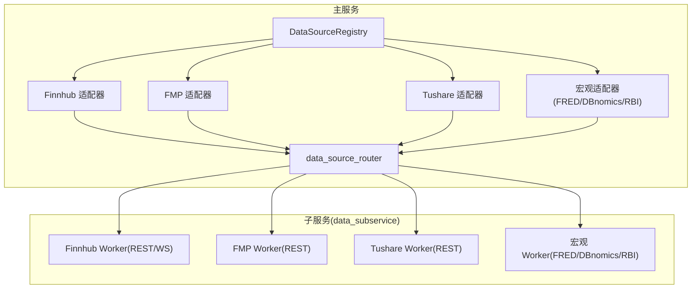
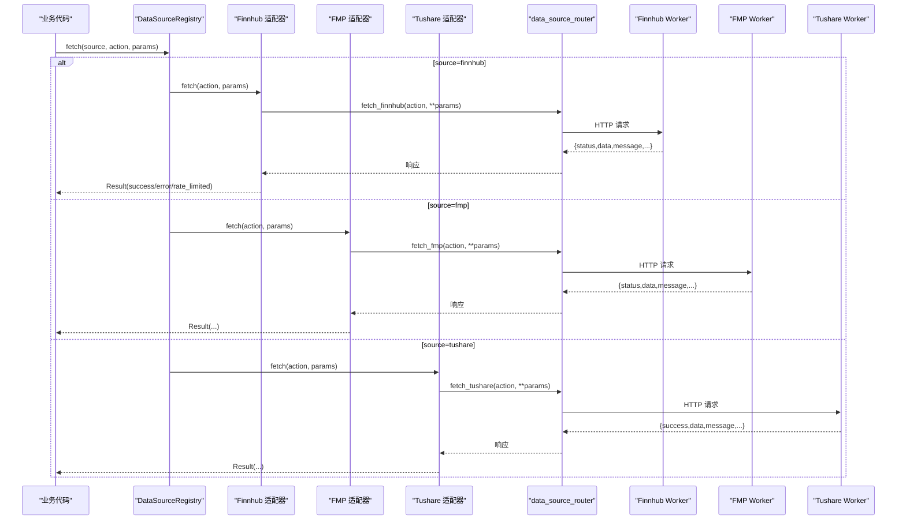
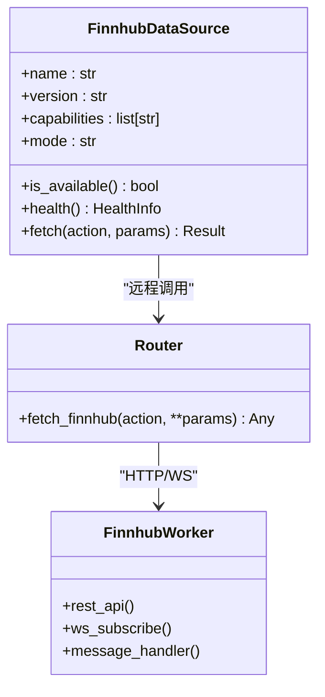
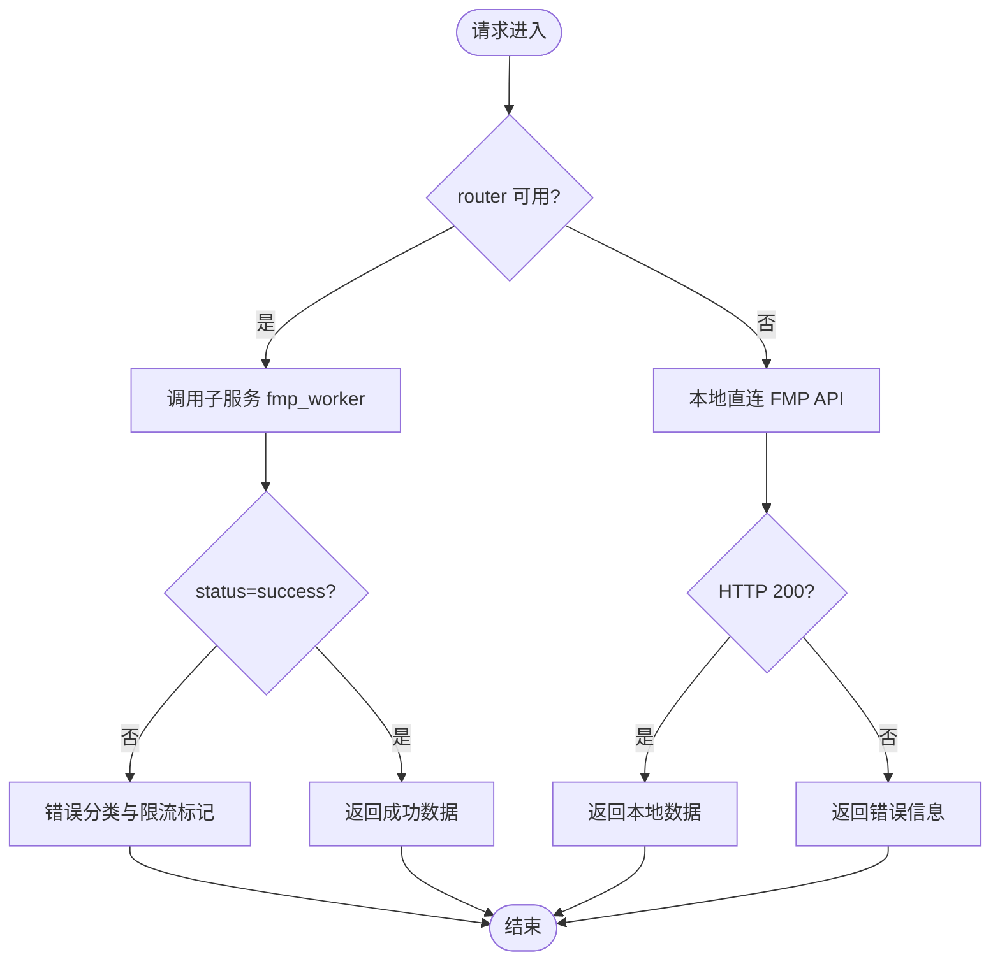
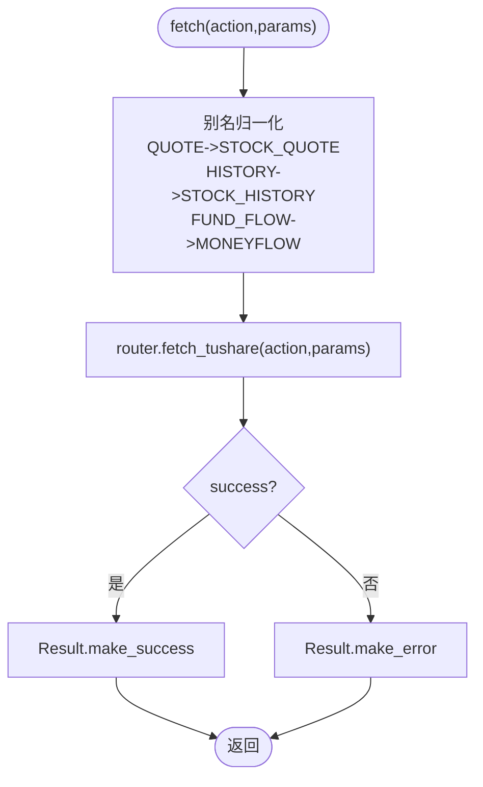
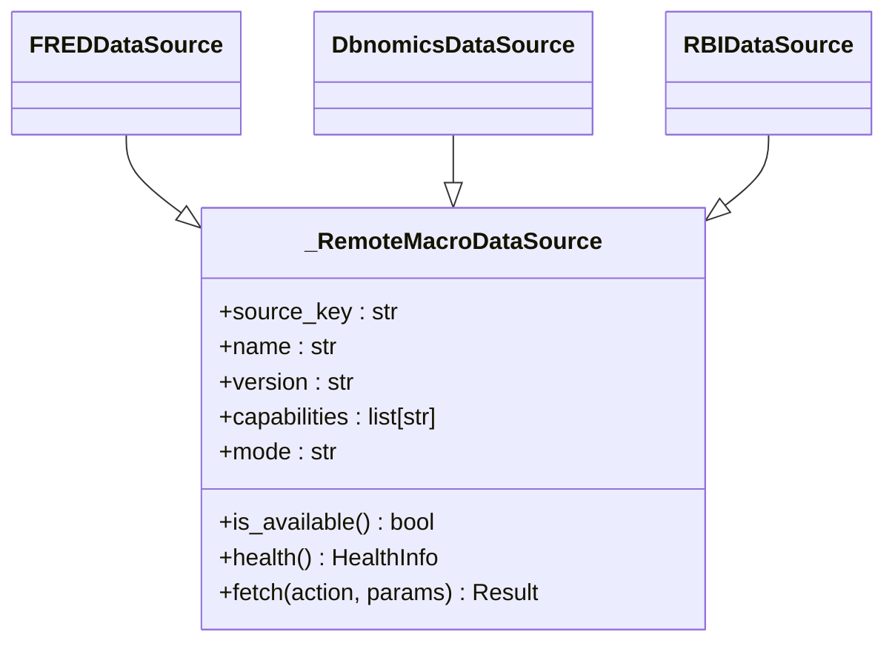
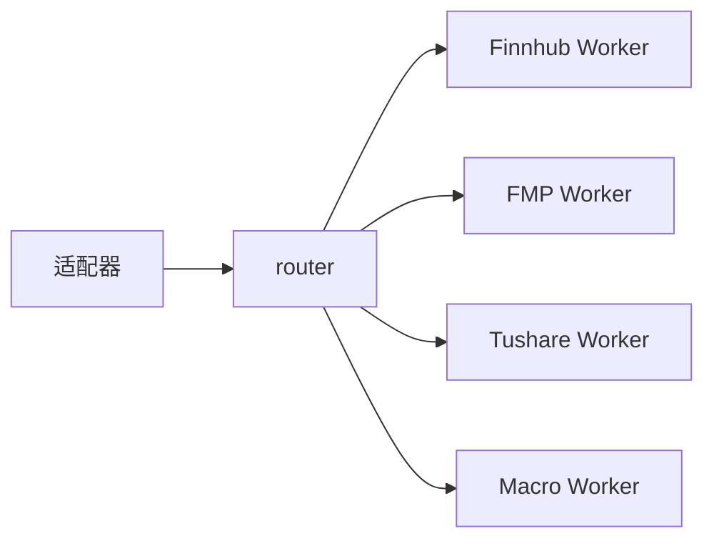

# 其他数据源适配器

<cite>
**本文引用的文件**
- [backend/services/datasource/adapters/finnhub.py](file://backend/services/datasource/adapters/finnhub.py)
- [backend/services/datasource/adapters/fmp.py](file://backend/services/datasource/adapters/fmp.py)
- [backend/services/datasource/adapters/tushare.py](file://backend/services/datasource/adapters/tushare.py)
- [backend/services/datasource/adapters/macro.py](file://backend/services/datasource/adapters/macro.py)
- [backend/services/finnhub/service.py](file://backend/services/finnhub/service.py)
- [backend/services/fmp/service.py](file://backend/services/fmp/service.py)
- [data_subservice/finnhub_worker.py](file://data_subservice/finnhub_worker.py)
- [data_subservice/fmp_worker.py](file://data_subservice/fmp_worker.py)
- [data_subservice/tushare_worker.py](file://data_subservice/tushare_worker.py)
- [backend/services/datasource/router.py](file://backend/services/datasource/router.py)
- [backend/core/circuit_breaker.py](file://backend/core/circuit_breaker.py)
- [backend/core/retry_utils.py](file://backend/core/retry_utils.py)
</cite>

## 目录
1. [简介](#简介)
2. [项目结构](#项目结构)
3. [核心组件](#核心组件)
4. [架构总览](#架构总览)
5. [详细组件分析](#详细组件分析)
6. [依赖关系分析](#依赖关系分析)
7. [性能考量](#性能考量)
8. [故障排查指南](#故障排查指南)
9. [结论](#结论)
10. [附录：配置与选择指南](#附录：配置与选择指南)

## 简介
本文件面向“其他数据源适配器”的综合文档，覆盖以下能力：
- Finnhub 新闻与实时数据集成（含 WebSocket 连接管理与消息处理说明）
- Financial Modeling Prep（FMP）基本面数据接入（财务报表、估值指标、经济数据）
- Tushare A股专业数据源（高级行情、因子数据、资金流向等）
- 宏观经济数据源集成（GDP、CPI、利率等）
- 各数据源特性对比、适用场景、选择指南与配置示例
- 错误处理策略与降级方案

## 项目结构
本项目采用“主服务 + 子服务”的解耦架构：
- 主服务通过 DataSourceRegistry 统一注册并调用各数据源适配器
- 适配器仅做协议适配与结果语义化转换，实际连接层下沉到 data_subservice
- 数据请求经 data_source_router 路由到对应子服务节点（如 finnhub_master、fmp_master、tushare_remote）
- 宏观数据源（FRED/DBnomics/RBI）通过统一的远程基类适配

图表来源
- [backend/services/datasource/adapters/finnhub.py:29-169](file://backend/services/datasource/adapters/finnhub.py#L29-L169)
- [backend/services/datasource/adapters/fmp.py:29-167](file://backend/services/datasource/adapters/fmp.py#L29-L167)
- [backend/services/datasource/adapters/tushare.py:31-159](file://backend/services/datasource/adapters/tushare.py#L31-L159)
- [backend/services/datasource/adapters/macro.py:31-142](file://backend/services/datasource/adapters/macro.py#L31-L142)
- [backend/services/datasource/router.py](file://backend/services/datasource/router.py)

章节来源
- [backend/services/datasource/adapters/finnhub.py:29-169](file://backend/services/datasource/adapters/finnhub.py#L29-L169)
- [backend/services/datasource/adapters/fmp.py:29-167](file://backend/services/datasource/adapters/fmp.py#L29-L167)
- [backend/services/datasource/adapters/tushare.py:31-159](file://backend/services/datasource/adapters/tushare.py#L31-L159)
- [backend/services/datasource/adapters/macro.py:31-142](file://backend/services/datasource/adapters/macro.py#L31-L142)

## 核心组件
- Finnhub 适配器：声明能力集（quote、earnings、company_news、market_news、economic_calendar、insider_trading、stock_history），通过 router 远程调用，负责限流/配额/封禁的错误分类与 Result 语义化。
- FMP 适配器：声明能力集（quote/profile/income_statement/credit/info 等），通过 router 远程调用，错误分类与限流状态由子服务统一管理。
- Tushare 适配器：声明 A 股相关能力（STOCK_HISTORY、STOCK_QUOTE、FUNDAMENTAL、FUND_FLOW、MACRO 等），提供别名映射（QUOTE/HISTORY/FUND_FLOW -> 子服务 action）。
- 宏观适配器：统一基类 _RemoteMacroDataSource，派生 FRED/DBnomics/RBI 三类，均通过 router 调子服务。

章节来源
- [backend/services/datasource/adapters/finnhub.py:29-169](file://backend/services/datasource/adapters/finnhub.py#L29-L169)
- [backend/services/datasource/adapters/fmp.py:29-167](file://backend/services/datasource/adapters/fmp.py#L29-L167)
- [backend/services/datasource/adapters/tushare.py:31-159](file://backend/services/datasource/adapters/tushare.py#L31-L159)
- [backend/services/datasource/adapters/macro.py:31-142](file://backend/services/datasource/adapters/macro.py#L31-L142)

## 架构总览
下图展示从业务侧到数据源的完整调用链，包括适配器、路由器与子服务的职责边界。

图表来源
- [backend/services/datasource/adapters/finnhub.py:95-156](file://backend/services/datasource/adapters/finnhub.py#L95-L156)
- [backend/services/datasource/adapters/fmp.py:103-154](file://backend/services/datasource/adapters/fmp.py#L103-L154)
- [backend/services/datasource/adapters/tushare.py:112-145](file://backend/services/datasource/adapters/tushare.py#L112-L145)
- [backend/services/datasource/router.py](file://backend/services/datasource/router.py)

## 详细组件分析

### Finnhub 适配器与集成
- 能力范围：报价、财报日历、公司/市场新闻、经济日历、内幕交易、历史K线
- 调用路径：适配器 -> router.fetch_finnhub -> data_subservice 的 Finnhub Worker（REST/WS）
- 错误分类：IP_BLOCKED / QUOTA_EXHAUSTED / RATE_LIMIT / NORMAL，结合消息关键字识别
- 健康检查：读取 router 节点状态（healthy/unhealthy）、error_count、capabilities
- WebSocket 集成说明：
  - 实时 tick/推送能力在 data_subservice 的 Finnhub Worker 中实现；主服务不持有本地 SDK 或 WS 连接
  - 主服务通过 REST 快照获取 quote，WS 订阅由子服务维护，避免在主进程常驻长连接
  - 若需扩展 WS 消息处理，应在 data_subservice 内新增处理器，并通过 router 暴露新 action

图表来源
- [backend/services/datasource/adapters/finnhub.py:29-169](file://backend/services/datasource/adapters/finnhub.py#L29-L169)
- [backend/services/datasource/router.py](file://backend/services/datasource/router.py)
- [data_subservice/finnhub_worker.py](file://data_subservice/finnhub_worker.py)

章节来源
- [backend/services/datasource/adapters/finnhub.py:29-169](file://backend/services/datasource/adapters/finnhub.py#L29-L169)
- [backend/services/finnhub/service.py:20-605](file://backend/services/finnhub/service.py#L20-L605)
- [data_subservice/finnhub_worker.py](file://data_subservice/finnhub_worker.py)

### FMP 基本面数据接入
- 能力范围：quote、profile、income_statement、credit、info 等
- 调用路径：适配器 -> router.fetch_fmp -> data_subservice 的 FMP Worker（REST）
- 错误分类：同 Finnhub，支持 IP_BLOCKED / QUOTA_EXHAUSTED / RATE_LIMIT
- 降级策略：当 router 未启用或子服务不可达时，FMPService 提供本地直连兜底（保持签名兼容）

图表来源
- [backend/services/datasource/adapters/fmp.py:103-154](file://backend/services/datasource/adapters/fmp.py#L103-L154)
- [backend/services/fmp/service.py:28-76](file://backend/services/fmp/service.py#L28-L76)

章节来源
- [backend/services/datasource/adapters/fmp.py:29-167](file://backend/services/datasource/adapters/fmp.py#L29-L167)
- [backend/services/fmp/service.py:28-93](file://backend/services/fmp/service.py#L28-L93)

### Tushare A股专业数据源
- 能力范围：A股历史行情、实时行情（降级为 daily_basic）、基本面指标、资金流向、股票列表、低频历史、宏观数据
- 别名映射：QUOTE->STOCK_QUOTE、HISTORY->STOCK_HISTORY、FUND_FLOW->MONEYFLOW
- 调用路径：适配器 -> router.fetch_tushare -> data_subservice 的 Tushare Worker（REST）
- 健康检查：基于 router 节点 tushare_remote 的状态

图表来源
- [backend/services/datasource/adapters/tushare.py:62-145](file://backend/services/datasource/adapters/tushare.py#L62-L145)

章节来源
- [backend/services/datasource/adapters/tushare.py:31-159](file://backend/services/datasource/adapters/tushare.py#L31-L159)
- [data_subservice/tushare_worker.py](file://data_subservice/tushare_worker.py)

### 宏观经济数据源集成
- 统一基类 _RemoteMacroDataSource，派生 FRED、DBnomics、RBI
- 能力范围：macro_series、economic_calendar
- 调用路径：适配器 -> router.fetch_{source_key} -> 对应 macro worker
- 健康检查：基于 router 节点 {source_key}_master 的状态

图表来源
- [backend/services/datasource/adapters/macro.py:31-142](file://backend/services/datasource/adapters/macro.py#L31-L142)

章节来源
- [backend/services/datasource/adapters/macro.py:31-142](file://backend/services/datasource/adapters/macro.py#L31-L142)

## 依赖关系分析
- 适配器对 router 的强依赖：所有 fetch 均通过 router 路由至子服务，避免主服务直接持有外部连接
- 子服务承担连接与限流管理：Finnhub/FMP/Tushare/Macro 的连接层、缓存、限流、熔断均在 data_subservice 内完成
- 主服务侧的薄壳：FMPService 保留本地兜底逻辑以兼容旧调用方；FinnhubService 提供 REST 能力与限流感知钩子

图表来源
- [backend/services/datasource/adapters/finnhub.py:95-156](file://backend/services/datasource/adapters/finnhub.py#L95-L156)
- [backend/services/datasource/adapters/fmp.py:103-154](file://backend/services/datasource/adapters/fmp.py#L103-L154)
- [backend/services/datasource/adapters/tushare.py:112-145](file://backend/services/datasource/adapters/tushare.py#L112-L145)
- [backend/services/datasource/adapters/macro.py:77-109](file://backend/services/datasource/adapters/macro.py#L77-L109)

章节来源
- [backend/services/datasource/adapters/finnhub.py:95-156](file://backend/services/datasource/adapters/finnhub.py#L95-L156)
- [backend/services/datasource/adapters/fmp.py:103-154](file://backend/services/datasource/adapters/fmp.py#L103-L154)
- [backend/services/datasource/adapters/tushare.py:112-145](file://backend/services/datasource/adapters/tushare.py#L112-L145)
- [backend/services/datasource/adapters/macro.py:77-109](file://backend/services/datasource/adapters/macro.py#L77-L109)

## 性能考量
- 缓存策略：Finnhub 的多项接口使用 Redis 缓存（财报日历、历史K线、公司/市场新闻、经济日历），显著降低免费额度消耗与网络抖动影响
- 限流退避：FinnhubService 接入 rate_limit_registry，区分 403/402/429 触发不同退避；适配器侧将错误分类透传，避免重复计数
- 异步客户端：httpx.AsyncClient 配合超时与事件钩子，提升并发与可观测性
- 代理池：可选 PROXY_POOL 随机轮换，缓解区域限制与封禁风险
- 健康监控：适配器 health() 暴露节点状态、错误计数与能力集，便于前端与健康看板联动

[本节为通用指导，无需特定文件引用]

## 故障排查指南
- 常见错误类型与定位
  - 429 限流：检查子服务 throttler 状态与重试退避；确认是否频繁请求同一热点数据
  - 403 权限/IP 封锁：检查 FINNHUB_API_KEY、PROXY_POOL 配置；必要时切换代理或申请更高权限
  - 402 配额耗尽：等待配额恢复或升级套餐；避免高频刷新
  - 子服务不可用：检查 data_source_router 节点状态与 URL 配置
- 降级与容错
  - FMPService 在 router 不可用时回退本地直连，保证基本可用性
  - Finnhub 公司新闻在 403/429 时尝试 Yahoo Finance 非官方搜索作为兜底
  - 宏观数据源通过多源（FRED/DBnomics/RBI）互补，单一源异常不影响整体可用性
- 诊断建议
  - 查看健康接口返回的 error_count、node_status、capabilities
  - 结合日志中的 httpx 请求/响应钩子输出，定位具体失败端点与参数
  - 使用探针脚本验证各数据源连通性与权限

章节来源
- [backend/services/finnhub/service.py:36-60](file://backend/services/finnhub/service.py#L36-L60)
- [backend/services/finnhub/service.py:435-514](file://backend/services/finnhub/service.py#L435-L514)
- [backend/services/fmp/service.py:51-76](file://backend/services/fmp/service.py#L51-L76)
- [backend/core/circuit_breaker.py](file://backend/core/circuit_breaker.py)
- [backend/core/retry_utils.py](file://backend/core/retry_utils.py)

## 结论
- 适配器层统一了数据源接入协议，屏蔽了底层差异，使业务代码无需关心具体连接细节
- 子服务集中管理连接、限流、缓存与降级，提升了系统稳定性与可扩展性
- Finnhub 适合美股新闻、财报与经济日历；FMP 侧重美股基本面；Tushare 覆盖 A 股全栈数据；宏观数据源提供跨经济体指标
- 推荐优先通过 router 访问子服务，仅在必要场景启用本地兜底

[本节为总结性内容，无需特定文件引用]

## 附录：配置与选择指南
- 环境变量与配置要点
  - FINNHUB_API_KEY：Finnhub 新闻与日历必需
  - FMP_API_KEY：FMP 基本面数据必需
  - PROXY_POOL：可选代理池，用于绕过区域限制与缓解封禁
  - TUSHARE_REMOTE_URL：Tushare 子服务地址（远程模式）
  - FRED/DBnomics/RBI 相关密钥与端点：按子服务要求配置
- 选择指南
  - 美股新闻/财报/经济日历：优先 Finnhub；必要时叠加 Yahoo 兜底
  - 美股基本面（财报、估值、信用）：优先 FMP；关注 credit 配额
  - A 股行情/因子/资金流向：优先 Tushare；注意频次与字段映射
  - 宏观经济（GDP/CPI/利率等）：组合 FRED/DBnomics/RBI，交叉验证
- 配置示例（概念性）
  - 设置 FINNHUB_API_KEY 后，可通过适配器查询 company_news、market_news、economic_calendar
  - 设置 FMP_API_KEY 后，可通过适配器查询 quote、profile、income_statement
  - 配置 TUSHARE_REMOTE_URL 后，可通过适配器查询 STOCK_HISTORY、STOCK_QUOTE、FUNDAMENTAL、FUND_FLOW、MACRO
  - 配置宏观源密钥后，可通过适配器查询 macro_series、economic_calendar

[本节为概念性配置说明，无需特定文件引用]