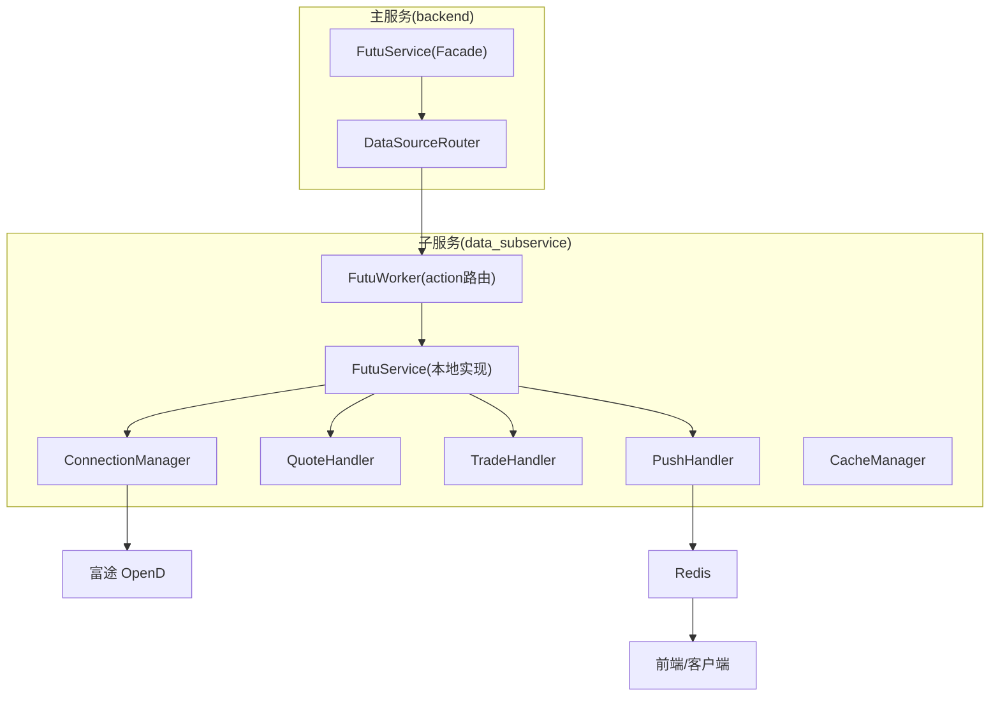
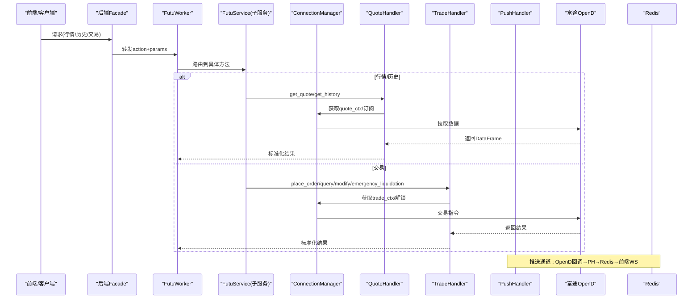
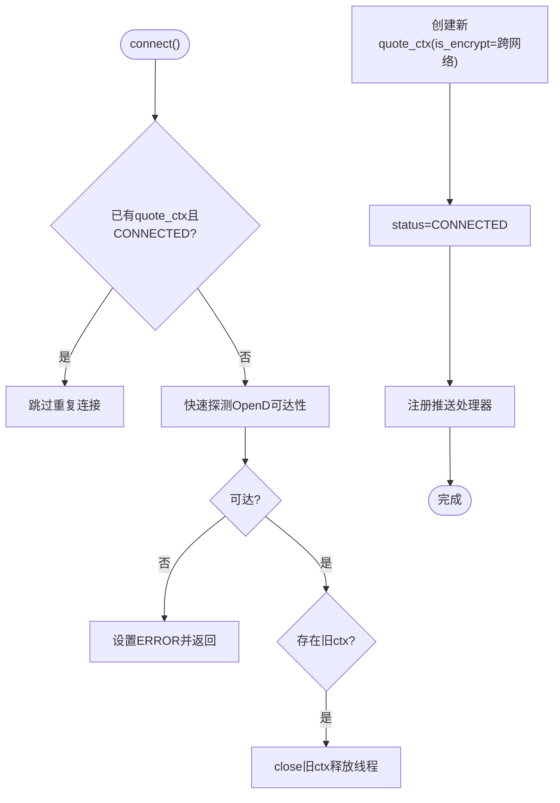
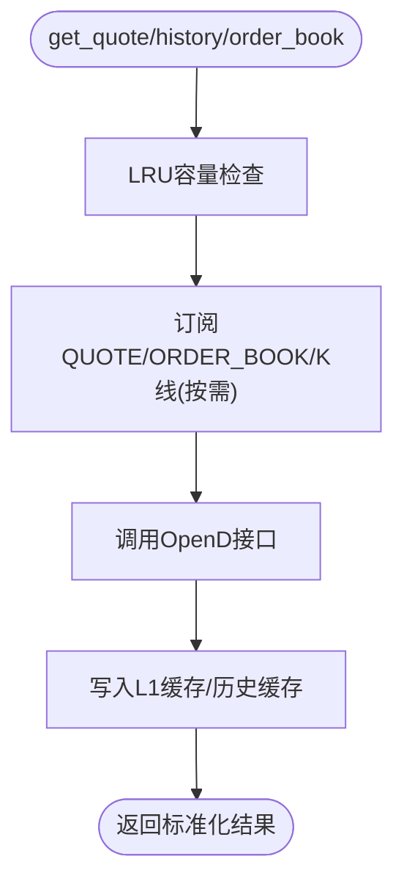
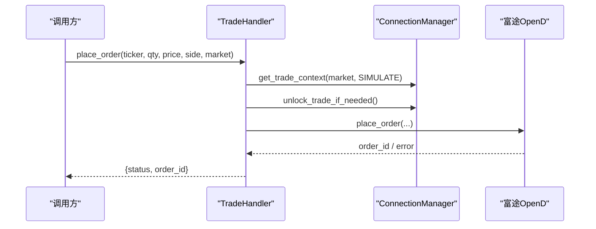
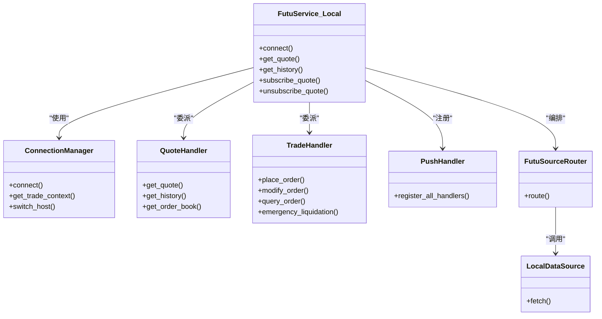
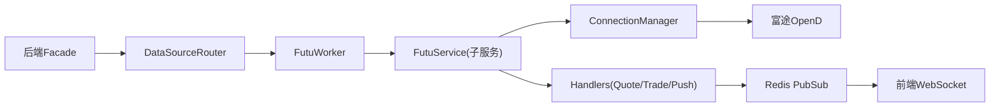

# 富途证券集成

<cite>
**本文引用的文件**
- [futu_worker.py](file://data_subservice/futu_worker.py)
- [service.py](file://data_subservice/futu_src/service.py)
- [connection_manager.py](file://data_subservice/futu_src/connection_manager.py)
- [push_handler.py](file://data_subservice/futu_src/push_handler.py)
- [quote_handler.py](file://data_subservice/futu_src/quote_handler.py)
- [trade_handler.py](file://data_subservice/futu_src/trade_handler.py)
- [source_router.py](file://data_subservice/futu_src/source_router.py)
- [data_source.py](file://data_subservice/futu_src/data_source.py)
- [service.py](file://backend/services/futu/service.py)
- [__init__.py](file://backend/services/futu/__init__.py)
- [datasource.py](file://backend/routers/datasource.py)
</cite>

## 目录
1. [简介](#简介)
2. [项目结构](#项目结构)
3. [核心组件](#核心组件)
4. [架构总览](#架构总览)
5. [详细组件分析](#详细组件分析)
6. [依赖关系分析](#依赖关系分析)
7. [性能与限流](#性能与限流)
8. [故障排查指南](#故障排查指南)
9. [结论](#结论)
10. [附录：配置与示例](#附录配置与示例)

## 简介
本文件为“富途证券数据源集成”的完整技术文档，覆盖以下目标：
- 富途 API 接入方式：WebSocket 实时行情、REST 历史数据与交易接口（下单、改撤单、查询、账户信息、紧急平仓等）。
- 工作进程架构：连接管理、消息处理、错误恢复机制。
- 数据类型支持：股票、期权、期货、窝轮、ETF、指数等金融产品的数据格式与能力边界。
- 认证与安全：API 密钥管理、会话保持、跨网络加密与解锁策略。
- 配置示例与常见问题解决方案。
- 性能优化建议与限流处理策略。

## 项目结构
富途集成采用“主服务远程代理 + 子服务本地直连 OpenD”的解耦架构：
- 主服务（backend）仅暴露 HTTP 透传 Facade，不安装 futu SDK，通过 DataSourceRouter 将请求转发到 data_subservice。
- 子服务（data_subservice）运行 FutuService，维护与富途 OpenD 的长连接，封装行情、交易、推送、缓存与路由逻辑。
- 推送通道：OpenD 回调 → push_handler → Redis PubSub → 前端 WebSocket。



图表来源
- [service.py:74-108](file://backend/services/futu/service.py#L74-L108)
- [futu_worker.py:33-191](file://data_subservice/futu_worker.py#L33-L191)
- [service.py:31-116](file://data_subservice/futu_src/service.py#L31-L116)
- [connection_manager.py:79-159](file://data_subservice/futu_src/connection_manager.py#L79-L159)
- [push_handler.py:394-431](file://data_subservice/futu_src/push_handler.py#L394-L431)

章节来源
- [service.py:74-108](file://backend/services/futu/service.py#L74-L108)
- [futu_worker.py:33-191](file://data_subservice/futu_worker.py#L33-L191)
- [service.py:31-116](file://data_subservice/futu_src/service.py#L31-L116)

## 核心组件
- FutuService（子服务本地实现）：统一入口，组合 ConnectionManager、各 Handler、SourceRouter，提供 get_quote/get_history/get_order_book 等接口，并支持订阅/退订。
- ConnectionManager：OpenD 连接生命周期管理、交易上下文获取、跨网络加密、线程安全重连、推送处理器注册。
- QuoteHandler：实时报价、历史K线、盘口深度、板块热力图、港股行业资金流聚合、FedWatch、搜索资讯等。
- TradeHandler：模拟/实盘下单、改撤单、订单查询、账户信息、紧急平仓（Kill Switch）。
- PushHandler：将 OpenD 推送（报价、逐笔、经纪商队列、K线）桥接到 Redis PubSub，供前端 WebSocket 消费。
- SourceRouter/DataSource：抽象数据源访问，当前默认 local 模式直连 OpenD。
- 主服务 Facade：纯 HTTP 透传，屏蔽 SDK 依赖，保持向后兼容。

章节来源
- [service.py:31-116](file://data_subservice/futu_src/service.py#L31-L116)
- [connection_manager.py:44-159](file://data_subservice/futu_src/connection_manager.py#L44-L159)
- [quote_handler.py:74-127](file://data_subservice/futu_src/quote_handler.py#L74-L127)
- [trade_handler.py:19-177](file://data_subservice/futu_src/trade_handler.py#L19-L177)
- [push_handler.py:140-431](file://data_subservice/futu_src/push_handler.py#L140-L431)
- [source_router.py:18-80](file://data_subservice/futu_src/source_router.py#L18-L80)
- [data_source.py:53-110](file://data_subservice/futu_src/data_source.py#L53-L110)
- [service.py:74-213](file://backend/services/futu/service.py#L74-L213)

## 架构总览
富途集成分层清晰：
- 接入层：后端路由将业务请求转为 action 参数，调用 data_subservice 的 futu_worker。
- 路由层：futu_worker 根据 action 分发到 FutuService 对应方法。
- 处理层：各 Handler 完成具体数据拉取或交易操作，使用 ConnectionManager 获取上下文。
- 推送层：OpenD 回调经 PushHandler 写入 Redis，前端通过 WebSocket 订阅。
- 存储与缓存：内存级 L1 缓存（TTL 秒级）、历史 K 线缓存（分钟/小时级），降低 OpenD 压力。



图表来源
- [futu_worker.py:33-191](file://data_subservice/futu_worker.py#L33-L191)
- [service.py:101-116](file://data_subservice/futu_src/service.py#L101-L116)
- [quote_handler.py:81-127](file://data_subservice/futu_src/quote_handler.py#L81-L127)
- [trade_handler.py:25-177](file://data_subservice/futu_src/trade_handler.py#L25-L177)
- [push_handler.py:140-431](file://data_subservice/futu_src/push_handler.py#L140-L431)

## 详细组件分析

### 连接管理（ConnectionManager）
- 职责：创建/复用行情上下文、交易上下文；跨网络加密握手；自动探测 OpenD 可达性；推送处理器注册；运行时切换连接目标。
- 关键特性：
  - 线程安全：防止并发重复建连；旧 ctx 释放后再重建，避免线程泄漏。
  - 跨网络加密：非 localhost 时启用 is_encrypt=True，配合 RSA 私钥配置。
  - 交易解锁：支持环境变量注入解锁密码；未配置时标记锁定状态，上层可降级处理。
  - 推送开关：可通过环境变量控制是否启用推送模式。



图表来源
- [connection_manager.py:79-159](file://data_subservice/futu_src/connection_manager.py#L79-L159)
- [connection_manager.py:161-198](file://data_subservice/futu_src/connection_manager.py#L161-L198)

章节来源
- [connection_manager.py:44-159](file://data_subservice/futu_src/connection_manager.py#L44-L159)
- [connection_manager.py:217-279](file://data_subservice/futu_src/connection_manager.py#L217-L279)
- [connection_manager.py:281-298](file://data_subservice/futu_src/connection_manager.py#L281-L298)
- [connection_manager.py:302-345](file://data_subservice/futu_src/connection_manager.py#L302-L345)

### 行情处理（QuoteHandler）
- 实时报价：带 L1 内存缓存（3s TTL），LRU 容量管理，同时订阅 ORDER_BOOK 以支撑 Level 2 DOM。
- 历史K线：优先 get_cur_kline（num≤370），否则降级 request_history_kline 分页拼接，支持大跨度日线/周线/月线。
- 盘口深度：订阅 ORDER_BOOK 并缓存最新快照（1s TTL）。
- 其他能力：板块热力图、港股行业资金流聚合、FedWatch、个股搜索资讯。



图表来源
- [quote_handler.py:81-127](file://data_subservice/futu_src/quote_handler.py#L81-L127)
- [quote_handler.py:396-530](file://data_subservice/futu_src/quote_handler.py#L396-L530)
- [quote_handler.py:532-656](file://data_subservice/futu_src/quote_handler.py#L532-L656)

章节来源
- [quote_handler.py:74-127](file://data_subservice/futu_src/quote_handler.py#L74-L127)
- [quote_handler.py:396-530](file://data_subservice/futu_src/quote_handler.py#L396-L530)
- [quote_handler.py:532-656](file://data_subservice/futu_src/quote_handler.py#L532-L656)

### 交易处理（TradeHandler）
- 下单：市价/限价，自动选择 OrderType；模拟盘默认 TrdEnv.SIMULATE。
- 改撤单：ModifyOrderOp.CANCEL 等。
- 订单查询：返回订单状态与成交均价。
- 账户信息：区分模拟/实盘环境；解锁失败返回 locked 标志，上层可降级。
- 紧急平仓：Kill Switch，先撤待提交订单，再市价平仓所有持仓。



图表来源
- [trade_handler.py:25-63](file://data_subservice/futu_src/trade_handler.py#L25-L63)
- [trade_handler.py:65-103](file://data_subservice/futu_src/trade_handler.py#L65-L103)
- [trade_handler.py:105-177](file://data_subservice/futu_src/trade_handler.py#L105-L177)
- [trade_handler.py:179-254](file://data_subservice/futu_src/trade_handler.py#L179-L254)

章节来源
- [trade_handler.py:19-177](file://data_subservice/futu_src/trade_handler.py#L19-L177)
- [trade_handler.py:179-254](file://data_subservice/futu_src/trade_handler.py#L179-L254)

### 推送通道（PushHandler）
- 类型：实时报价、盘口深度、逐笔成交、经纪商队列、实时K线。
- 机制：OpenD 回调线程中同步接收数据，通过 asyncio.run_coroutine_threadsafe 调度协程到主事件循环，写入 Redis PubSub 频道（如 quant:quotes:stream、quant:kline:{ticker} 等）。
- 合并策略：盘口深度与最新报价合并后发布到主流，保证前端一次性获得完整快照。

```mermaid
sequenceDiagram
participant OpenD as "富途OpenD"
participant PH as "PushHandler"
participant Loop as "主事件循环"
participant Redis as "Redis"
participant WS as "前端WebSocket"
OpenD-->>PH : on_recv_rsp(报价/盘口/逐笔/K线)
PH->>Loop : run_coroutine_threadsafe(_publish)
Loop->>Redis : publish(quant : quotes : stream 等)
Redis-->>WS : 推送消息
```

图表来源
- [push_handler.py:140-172](file://data_subservice/futu_src/push_handler.py#L140-L172)
- [push_handler.py:175-249](file://data_subservice/futu_src/push_handler.py#L175-L249)
- [push_handler.py:252-294](file://data_subservice/futu_src/push_handler.py#L252-L294)
- [push_handler.py:297-340](file://data_subservice/futu_src/push_handler.py#L297-L340)
- [push_handler.py:343-386](file://data_subservice/futu_src/push_handler.py#L343-L386)
- [push_handler.py:394-431](file://data_subservice/futu_src/push_handler.py#L394-L431)

章节来源
- [push_handler.py:140-431](file://data_subservice/futu_src/push_handler.py#L140-L431)

### 数据源路由与主服务 Facade
- 子服务路由：FutuSourceRouter 当前固定 local 模式，委托 LocalDataSource 调用本地 Handler。
- 主服务 Facade：纯 HTTP 透传，方法签名与原本地实现一致，便于下游零改动迁移。



图表来源
- [service.py:31-116](file://data_subservice/futu_src/service.py#L31-L116)
- [source_router.py:18-80](file://data_subservice/futu_src/source_router.py#L18-L80)
- [data_source.py:53-110](file://data_subservice/futu_src/data_source.py#L53-L110)
- [service.py:74-213](file://backend/services/futu/service.py#L74-L213)

章节来源
- [source_router.py:18-80](file://data_subservice/futu_src/source_router.py#L18-L80)
- [data_source.py:53-110](file://data_subservice/futu_src/data_source.py#L53-L110)
- [service.py:74-213](file://backend/services/futu/service.py#L74-L213)

## 依赖关系分析
- 主服务对富途无直接 SDK 依赖，仅通过 DataSourceRouter 进行 HTTP 调用，降低耦合度。
- 子服务集中持有 futu SDK，负责连接、推送、缓存与业务逻辑。
- Redis 作为推送总线，解耦 OpenD 回调与前端消费。
- 环境变量驱动行为：主机、端口、RSA 私钥、推送开关、解锁密码等。



图表来源
- [service.py:74-108](file://backend/services/futu/service.py#L74-L108)
- [futu_worker.py:33-191](file://data_subservice/futu_worker.py#L33-L191)
- [push_handler.py:394-431](file://data_subservice/futu_src/push_handler.py#L394-L431)

章节来源
- [service.py:74-108](file://backend/services/futu/service.py#L74-L108)
- [futu_worker.py:33-191](file://data_subservice/futu_worker.py#L33-L191)

## 性能与限流
- 缓存策略：
  - 实时报价 L1 缓存 TTL 3s，盘口深度 1s，历史 K 线按周期分级缓存（分钟级/小时级）。
  - 港股行业资金流聚合结果强缓存 30 分钟，减少多次 OpenD 调用。
- 订阅管理：
  - LRU 容量控制，超限时批量退订最久未用标的，避免槽位耗尽。
  - 同时订阅 QUOTE 与 ORDER_BOOK，确保 Level 2 数据可用。
- 历史 K 线优化：
  - num≤370 优先走 get_cur_kline，否则降级 request_history_kline 分页拼接，支持超长历史。
- 推送通道：
  - 异步桥接主事件循环，避免阻塞回调线程；盘口与报价合并发布，降低前端解析成本。
- 限流与重试：
  - 全局重试装饰器包裹关键方法，提升鲁棒性。
  - 主服务侧提供数据源限流分析与状态查询接口，便于监控与调优。

章节来源
- [quote_handler.py:81-127](file://data_subservice/futu_src/quote_handler.py#L81-L127)
- [quote_handler.py:396-530](file://data_subservice/futu_src/quote_handler.py#L396-L530)
- [quote_handler.py:254-394](file://data_subservice/futu_src/quote_handler.py#L254-L394)
- [push_handler.py:140-431](file://data_subservice/futu_src/push_handler.py#L140-L431)
- [datasource.py:65-152](file://backend/routers/datasource.py#L65-L152)

## 故障排查指南
- 连接问题：
  - 现象：status=ERROR 或 DISCONNECTED。
  - 排查：检查 OpenD 可达性、跨网络加密配置（is_encrypt）、RSA 私钥路径、端口与主机名。
  - 参考：连接建立流程与错误分支。
- 交易解锁失败：
  - 现象：账户信息返回 locked=true。
  - 处理：在 OpenD 界面手动解锁或配置解锁密码；上层应降级返回空账户数据而不影响行情通道。
- 推送不可用：
  - 现象：前端收不到实时数据。
  - 排查：确认推送模式已启用、事件循环已注册、Redis 连通性正常。
- 历史 K 线为空：
  - 现象：get_history 返回空或错误。
  - 排查：检查 ktype 映射、num 上限、分页 key 是否正确传递。
- 线程泄漏：
  - 现象：进程线程数持续上升。
  - 排查：确保旧 ctx 正确 close；避免频繁重建上下文；检查跨网络交易上下文创建条件。

章节来源
- [connection_manager.py:79-159](file://data_subservice/futu_src/connection_manager.py#L79-L159)
- [connection_manager.py:217-279](file://data_subservice/futu_src/connection_manager.py#L217-L279)
- [trade_handler.py:179-254](file://data_subservice/futu_src/trade_handler.py#L179-L254)
- [push_handler.py:161-198](file://data_subservice/futu_src/push_handler.py#L161-L198)
- [quote_handler.py:396-530](file://data_subservice/futu_src/quote_handler.py#L396-L530)

## 结论
本集成通过“主服务远程代理 + 子服务本地直连”的架构，实现了富途 OpenD 的稳定接入与高效利用。连接管理、推送通道、缓存与重试机制共同保障了高吞吐与低延迟。未来可在多节点集群、远端 slave 代理与更细粒度限流方面继续演进。

## 附录：配置与示例
- 环境变量（子服务）：
  - FUTU_HOST/FUTU_PORT：OpenD 地址与端口。
  - FUTU_RSA_PRIVATE_KEY：跨网络交易加密所需 RSA 私钥路径。
  - FUTU_TRD_UNLOCK_PWD/FUTU_TRADE_PWD：交易解锁密码。
  - FUTU_PUSH_ENABLED：是否启用推送模式（默认 true）。
  - QUANT_ENV：开发环境标识，用于 Mock 与降级。
- 典型调用示例（action 与参数）：
  - 实时报价：action=QUOTE，symbol/ticker。
  - 历史K线：action=HISTORY，symbol/ticker，ktype(K_DAY/K_1D/K_WEEK)，num。
  - 盘口深度：action=ORDER_BOOK，symbol/ticker。
  - 期权链：action=OPTION_CHAIN，symbol/ticker，expiration_date。
  - 资金流向：action=FUND_FLOW，symbol/ticker。
  - 卖空数据：action=SHORT_SELLING，sub_action(daily/rank)，market，count。
  - 期权策略/波动率：action=OPTION_STRATEGY/OPTION_VOLATILITY。
  - 市场快照：action=SNAPSHOT，symbols[]。
  - 选股/基础信息：action=SCREEN_STOCKS/STOCK_BASICINFO。
  - 交易：PLACE_ORDER/MODIFY_ORDER/QUERY_ORDER/ACCOUNT_INFO/EMERGENCY_LIQUIDATION。
  - 订阅/退订：SUBSCRIBE/UNSUBSCRIBE，symbol/ticker。
  - 健康检查：HEALTH。
- 限流与监控：
  - 使用主服务提供的限流分析接口查看数据源状态与推荐间隔。
  - 结合缓存与 LRU 退订策略，控制 OpenD 订阅额度与调用频率。

章节来源
- [futu_worker.py:33-191](file://data_subservice/futu_worker.py#L33-L191)
- [service.py:101-116](file://data_subservice/futu_src/service.py#L101-L116)
- [datasource.py:65-152](file://backend/routers/datasource.py#L65-L152)
