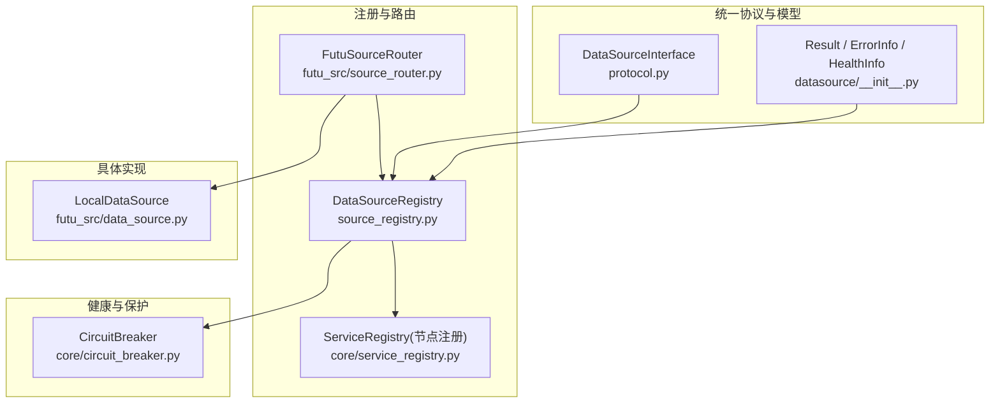
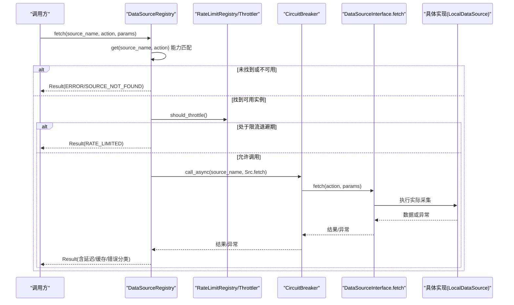
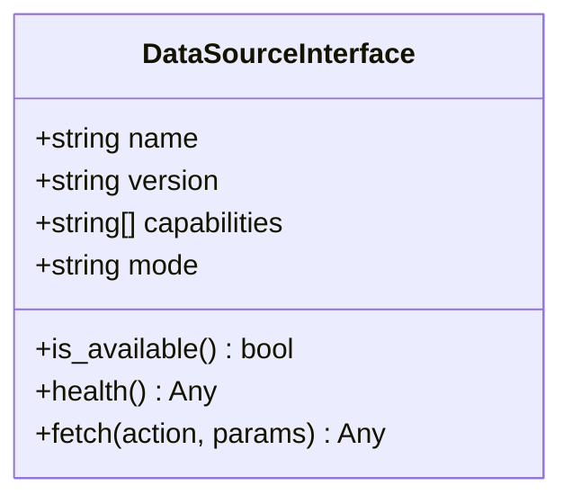
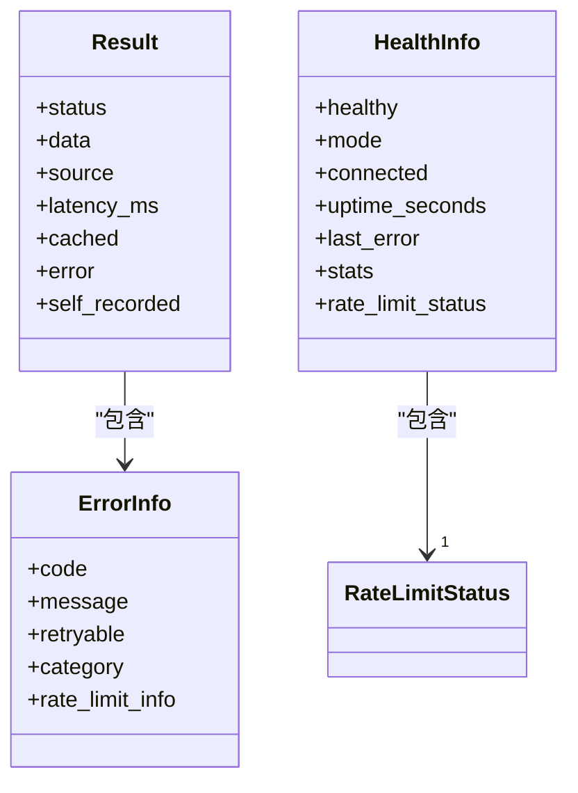
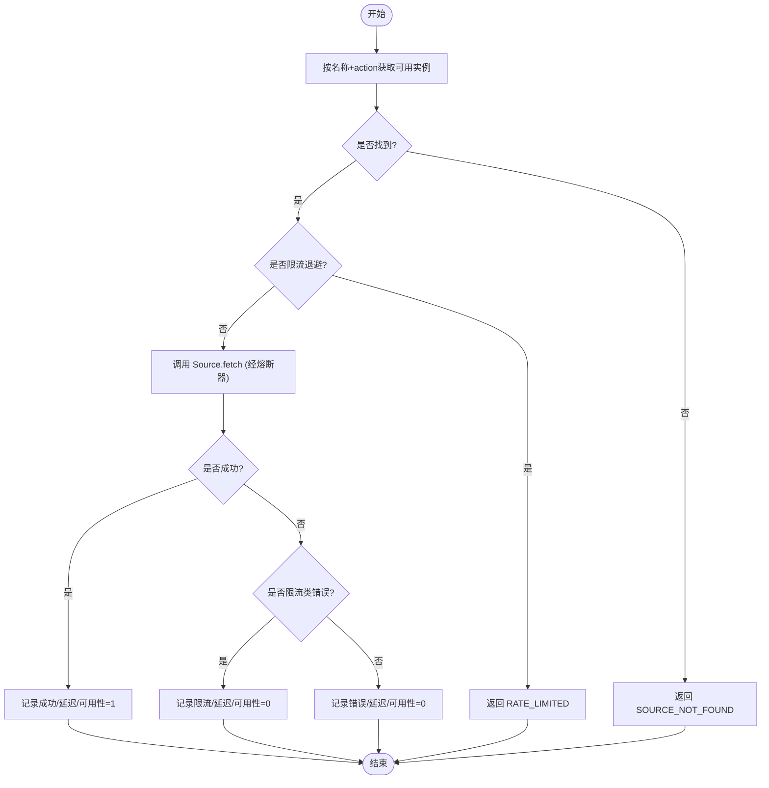
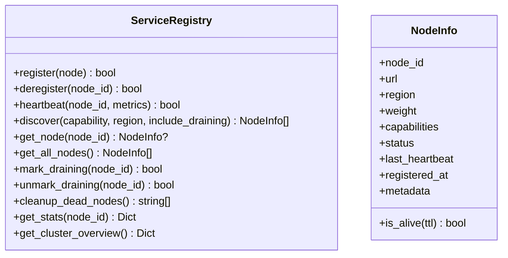
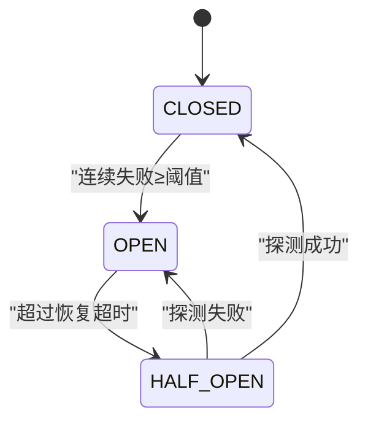
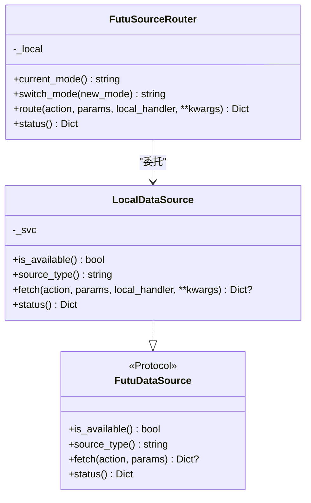
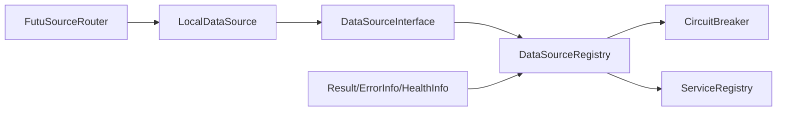

# 数据源架构设计

<cite>
**本文引用的文件**
- [backend/services/datasource/__init__.py](file://backend/services/datasource/__init__.py)
- [backend/services/datasource/protocol.py](file://backend/services/datasource/protocol.py)
- [backend/services/datasource/source_registry.py](file://backend/services/datasource/source_registry.py)
- [backend/core/service_registry.py](file://backend/core/service_registry.py)
- [backend/core/circuit_breaker.py](file://backend/core/circuit_breaker.py)
- [data_subservice/futu_src/data_source.py](file://data_subservice/futu_src/data_source.py)
- [data_subservice/futu_src/source_router.py](file://data_subservice/futu_src/source_router.py)
</cite>

## 目录
1. [简介](#简介)
2. [项目结构](#项目结构)
3. [核心组件](#核心组件)
4. [架构总览](#架构总览)
5. [详细组件分析](#详细组件分析)
6. [依赖关系分析](#依赖关系分析)
7. [性能考量](#性能考量)
8. [故障排查指南](#故障排查指南)
9. [结论](#结论)
10. [附录](#附录)

## 简介
本文件面向 Quant Agent 的数据源架构，聚焦统一接口定义、协议规范与适配器模式实现；阐述插件化服务注册、动态加载与生命周期管理；说明路由机制（智能选择、负载均衡、故障转移）；构建健康监控体系（连接检测、指标采集、熔断保护）。文档提供架构图与数据流图，并给出扩展点设计与最佳实践。

## 项目结构
数据源相关代码主要分布在以下模块：
- 统一协议与模型：backend/services/datasource 下的 protocol、__init__（Result/ErrorInfo/HealthInfo 等）
- 源实例注册与主路径调用：backend/services/datasource/source_registry.py
- 分布式节点注册与健康：backend/core/service_registry.py
- 熔断器：backend/core/circuit_breaker.py
- Futu 本地数据源抽象与路由器：data_subservice/futu_src/data_source.py、source_router.py

图表来源
- [backend/services/datasource/protocol.py:12-47](file://backend/services/datasource/protocol.py#L12-L47)
- [backend/services/datasource/__init__.py:218-371](file://backend/services/datasource/__init__.py#L218-L371)
- [backend/services/datasource/source_registry.py:41-259](file://backend/services/datasource/source_registry.py#L41-L259)
- [backend/core/service_registry.py:69-229](file://backend/core/service_registry.py#L69-L229)
- [backend/core/circuit_breaker.py:64-218](file://backend/core/circuit_breaker.py#L64-L218)
- [data_subservice/futu_src/source_router.py:18-80](file://data_subservice/futu_src/source_router.py#L18-L80)
- [data_subservice/futu_src/data_source.py:18-110](file://data_subservice/futu_src/data_source.py#L18-L110)

章节来源
- [backend/services/datasource/protocol.py:12-47](file://backend/services/datasource/protocol.py#L12-L47)
- [backend/services/datasource/__init__.py:218-371](file://backend/services/datasource/__init__.py#L218-L371)
- [backend/services/datasource/source_registry.py:41-259](file://backend/services/datasource/source_registry.py#L41-L259)
- [backend/core/service_registry.py:69-229](file://backend/core/service_registry.py#L69-L229)
- [backend/core/circuit_breaker.py:64-218](file://backend/core/circuit_breaker.py#L64-L218)
- [data_subservice/futu_src/source_router.py:18-80](file://data_subservice/futu_src/source_router.py#L18-L80)
- [data_subservice/futu_src/data_source.py:18-110](file://data_subservice/futu_src/data_source.py#L18-L110)

## 核心组件
- 统一协议 DataSourceInterface：定义 name/version/capabilities/mode/is_available/health/fetch，所有数据源必须实现该接口，确保 Router 不直连具体服务。
- 统一返回 Result/ErrorInfo/HealthInfo：标准化成功/错误/降级/限流状态，携带延迟、缓存标记、错误分类与限流详情。
- 源实例注册表 DataSourceRegistry：负责按名称获取可用实例、能力匹配、限流退避检查、调用封装与指标记录。
- 分布式节点注册 ServiceRegistry：基于 Redis 的节点注册、心跳、发现、优雅下线与统计聚合。
- 熔断器 CircuitBreaker：CLOSED/OPEN/HALF_OPEN 状态机，支持限流类错误不计入失败计数，提供装饰器与手动记录。
- Futu 数据源适配：LocalDataSource 对接 OpenD，FutuSourceRouter 将请求路由到本地处理器。

章节来源
- [backend/services/datasource/protocol.py:12-47](file://backend/services/datasource/protocol.py#L12-L47)
- [backend/services/datasource/__init__.py:218-371](file://backend/services/datasource/__init__.py#L218-L371)
- [backend/services/datasource/source_registry.py:41-259](file://backend/services/datasource/source_registry.py#L41-L259)
- [backend/core/service_registry.py:69-229](file://backend/core/service_registry.py#L69-L229)
- [backend/core/circuit_breaker.py:64-218](file://backend/core/circuit_breaker.py#L64-L218)
- [data_subservice/futu_src/data_source.py:18-110](file://data_subservice/futu_src/data_source.py#L18-L110)
- [data_subservice/futu_src/source_router.py:18-80](file://data_subservice/futu_src/source_router.py#L18-L80)

## 架构总览
下图展示从上层路由到数据源的完整链路，包括协议约束、注册发现、限流与熔断保护。

图表来源
- [backend/services/datasource/source_registry.py:140-259](file://backend/services/datasource/source_registry.py#L140-L259)
- [backend/core/circuit_breaker.py:147-218](file://backend/core/circuit_breaker.py#L147-L218)
- [data_subservice/futu_src/data_source.py:76-99](file://data_subservice/futu_src/data_source.py#L76-L99)

## 详细组件分析

### 统一接口与协议（DataSourceInterface）
- 职责：为所有数据源提供一致的元数据与行为契约，屏蔽底层差异。
- 关键成员：name/version/capabilities/mode/is_available/health/fetch。
- 使用约束：Router 仅通过 Interface.fetch 访问数据源，禁止直连具体服务。

图表来源
- [backend/services/datasource/protocol.py:12-47](file://backend/services/datasource/protocol.py#L12-L47)

章节来源
- [backend/services/datasource/protocol.py:12-47](file://backend/services/datasource/protocol.py#L12-L47)

### 统一返回结构与错误分类（Result/ErrorInfo/HealthInfo）
- Result：统一封装 success/error/degraded/rate_limited，附带 source、latency_ms、cached、error、self_recorded。
- ErrorInfo：code/message/retryable/category(rate_limit/quota_exhausted/ip_blocked/normal/data_unavailable)，可选 rate_limit_info。
- HealthInfo：healthy/connected/uptime/stats/rate_limit_status。
- 工具函数：classify_http_error、parse_retry_after。

图表来源
- [backend/services/datasource/__init__.py:218-371](file://backend/services/datasource/__init__.py#L218-L371)

章节来源
- [backend/services/datasource/__init__.py:218-371](file://backend/services/datasource/__init__.py#L218-L371)

### 源实例注册与主路径调用（DataSourceRegistry）
- 注册/注销：维护 source_name -> 实例列表，支持多实例。
- 能力严格匹配：按 action 过滤 capabilities，避免静默回退导致语义失效。
- 限流退避：在调用前检查 Throttler，若处于退避期直接返回 RATE_LIMITED。
- 熔断集成：通过 fetch_via_breaker_async 包装调用，支持豁免动作集合。
- 指标记录：成功/限流/错误三类分支分别记录延迟、可用性、限流次数与错误类型。

图表来源
- [backend/services/datasource/source_registry.py:98-259](file://backend/services/datasource/source_registry.py#L98-L259)

章节来源
- [backend/services/datasource/source_registry.py:98-259](file://backend/services/datasource/source_registry.py#L98-L259)

### 分布式节点注册与健康（ServiceRegistry）
- 键空间：nodes(Hash)/heartbeats(ZSet)/draining(Set)/stats:{node_id}(Hash)。
- 能力：register/deregister/heartbeat/discover/mark_draining/unmark_draining/cleanup_dead_nodes/get_stats/get_cluster_overview。
- 发现策略：排除 dead/draining（可配置），按 capability/region 过滤，按权重排序。

图表来源
- [backend/core/service_registry.py:51-229](file://backend/core/service_registry.py#L51-L229)
- [backend/core/service_registry.py:269-417](file://backend/core/service_registry.py#L269-L417)

章节来源
- [backend/core/service_registry.py:51-229](file://backend/core/service_registry.py#L51-L229)
- [backend/core/service_registry.py:269-417](file://backend/core/service_registry.py#L269-L417)

### 熔断器（CircuitBreaker）
- 状态机：CLOSED → OPEN（连续失败≥阈值）→ HALF_OPEN（超时探测）→ CLOSED（探测成功）/ OPEN（探测失败）。
- 限流解耦：支持 error_classifier 或 is_rate_limit_error 钩子，使限流类错误不计入失败计数。
- 使用方式：call/call_sync/guard(record_failure/record_success/reset/status_snapshot)。

图表来源
- [backend/core/circuit_breaker.py:45-218](file://backend/core/circuit_breaker.py#L45-L218)

章节来源
- [backend/core/circuit_breaker.py:45-218](file://backend/core/circuit_breaker.py#L45-L218)

### Futu 数据源适配器与路由器
- LocalDataSource：实现 FutuDataSource 协议，封装对 OpenD 的连接与 handler 调用，提供 is_available/source_type/fetch/status。
- FutuSourceRouter：当前固定 local 模式，route 将请求转发至 LocalDataSource，并提供 status 诊断。

图表来源
- [data_subservice/futu_src/data_source.py:18-110](file://data_subservice/futu_src/data_source.py#L18-L110)
- [data_subservice/futu_src/source_router.py:18-80](file://data_subservice/futu_src/source_router.py#L18-L80)

章节来源
- [data_subservice/futu_src/data_source.py:18-110](file://data_subservice/futu_src/data_source.py#L18-L110)
- [data_subservice/futu_src/source_router.py:18-80](file://data_subservice/futu_src/source_router.py#L18-L80)

## 依赖关系分析
- 协议层：DataSourceInterface 被 DataSourceRegistry 与具体实现共同遵循。
- 注册层：DataSourceRegistry 依赖 Protocol 与统一模型；ServiceRegistry 提供跨节点发现与治理。
- 保护层：DataSourceRegistry 通过熔断器保护外部调用；熔断器依赖错误分类以区分限流与普通错误。
- 实现层：Futu 适配器实现 FutuDataSource 协议，由路由器调度。

图表来源
- [backend/services/datasource/protocol.py:12-47](file://backend/services/datasource/protocol.py#L12-L47)
- [backend/services/datasource/source_registry.py:41-259](file://backend/services/datasource/source_registry.py#L41-L259)
- [backend/core/service_registry.py:69-229](file://backend/core/service_registry.py#L69-L229)
- [backend/core/circuit_breaker.py:64-218](file://backend/core/circuit_breaker.py#L64-L218)
- [data_subservice/futu_src/source_router.py:18-80](file://data_subservice/futu_src/source_router.py#L18-L80)
- [data_subservice/futu_src/data_source.py:18-110](file://data_subservice/futu_src/data_source.py#L18-L110)

章节来源
- [backend/services/datasource/source_registry.py:41-259](file://backend/services/datasource/source_registry.py#L41-L259)
- [backend/core/service_registry.py:69-229](file://backend/core/service_registry.py#L69-L229)
- [backend/core/circuit_breaker.py:64-218](file://backend/core/circuit_breaker.py#L64-L218)

## 性能考量
- 能力严格匹配：减少无效调用与回退开销，提升选择确定性。
- 限流退避前置：在 Registry 层提前拒绝，降低下游压力与无效网络往返。
- 熔断保护：快速失败，避免雪崩；半开探测逐步恢复流量。
- 指标观测：延迟、可用性、限流与错误分类指标用于容量规划与调优。
- 节点权重与区域过滤：结合 ServiceRegistry 的发现结果进行就近与加权路由。

[本节为通用指导，无需特定文件引用]

## 故障排查指南
- 常见问题定位
  - 数据源未注册或不可用：检查 DataSourceRegistry.get 的能力匹配与 is_available。
  - 限流频繁：查看 RateLimitStatus 与 analyzer 记录，调整退避策略与上游速率。
  - 熔断触发：确认连续失败原因，必要时 reset 或调整阈值/冷却时间。
  - 节点离线：检查 ServiceRegistry 心跳与清理任务，确认 draining 状态。
- 诊断入口
  - 数据源健康：通过 DataSourceInterface.health 返回 HealthInfo。
  - 节点总览：ServiceRegistry.get_cluster_overview 提供活跃/下线/死亡节点统计。
  - 熔断状态：circuit_breaker.status_snapshot 输出各服务状态。

章节来源
- [backend/services/datasource/__init__.py:348-371](file://backend/services/datasource/__init__.py#L348-L371)
- [backend/core/service_registry.py:385-417](file://backend/core/service_registry.py#L385-L417)
- [backend/core/circuit_breaker.py:341-352](file://backend/core/circuit_breaker.py#L341-L352)

## 结论
本架构通过统一的 DataSourceInterface 与 Result/ErrorInfo/HealthInfo 模型，实现了数据源的强一致接入；借助 DataSourceRegistry 完成能力匹配、限流退避与熔断保护；通过 ServiceRegistry 实现跨节点注册、心跳与发现；Futu 适配器展示了协议落地的典型方式。整体具备高内聚、低耦合、可扩展与可观测的特性，适合持续演进与横向扩展。

[本节为总结性内容，无需特定文件引用]

## 附录

### 扩展点设计与最佳实践
- 新增数据源
  - 实现 DataSourceInterface（或 FutuDataSource 协议），声明 capabilities 与 mode。
  - 通过 DataSourceRegistry.register 注册实例，确保 is_available 正确反映连接状态。
  - 在 Router 中仅调用 Interface.fetch，避免直连实现。
- 路由与负载均衡
  - 利用 ServiceRegistry.capabilities/region/weight 进行能力与地域筛选与加权。
  - 结合 DataSourceRegistry 的能力严格匹配，避免误选。
- 健康与熔断
  - 合理设置熔断阈值与冷却时间，区分限流与普通错误。
  - 定期清理死节点，关注 draining 状态。
- 指标与可观测性
  - 关注延迟、可用性、限流与错误分类指标，结合日志定位问题。
  - 使用 HealthInfo 暴露细粒度健康信息。

[本节为通用指导，无需特定文件引用]
