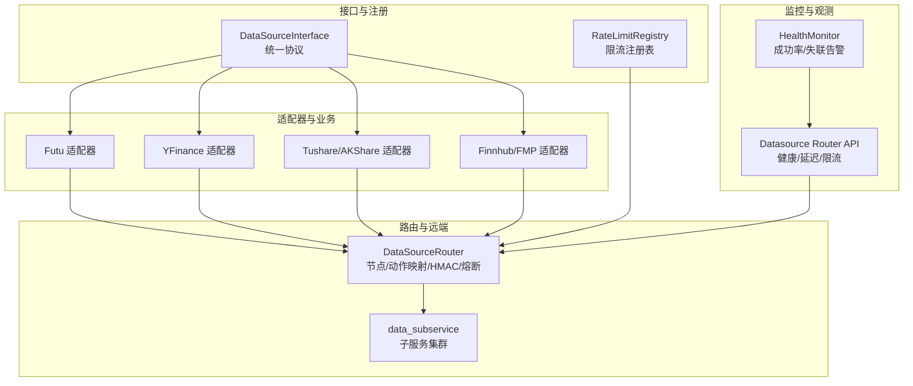
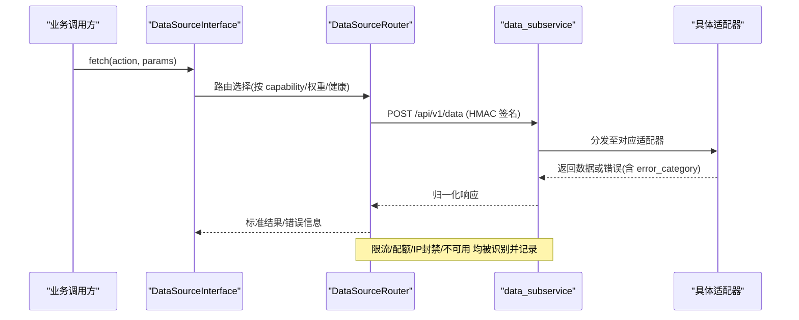
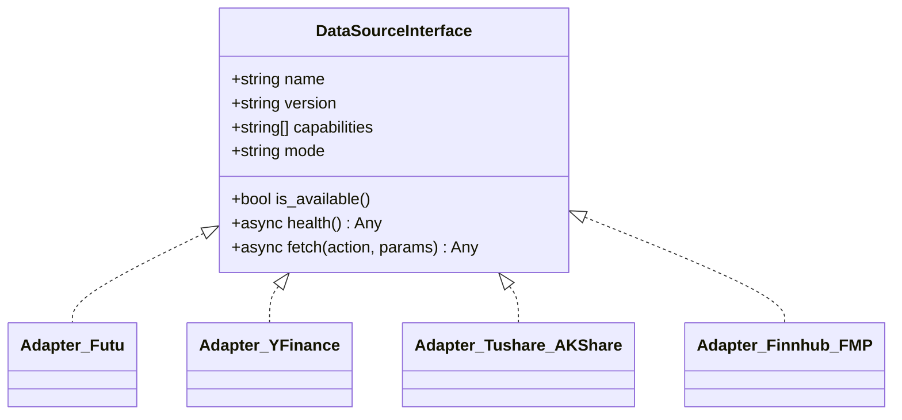
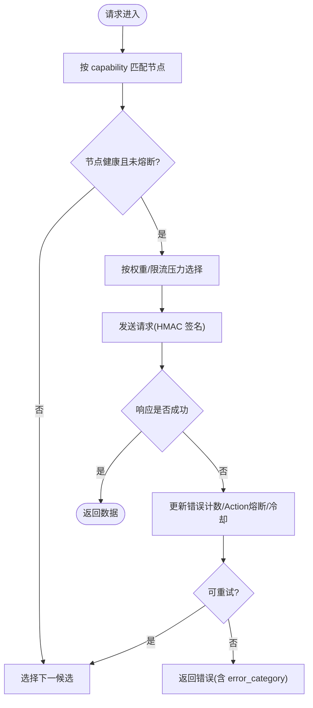
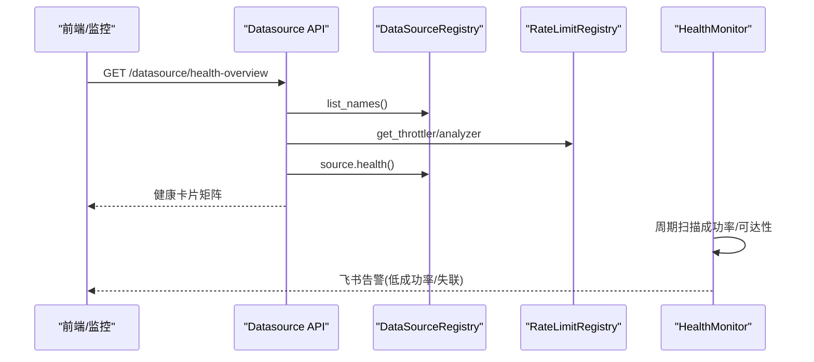
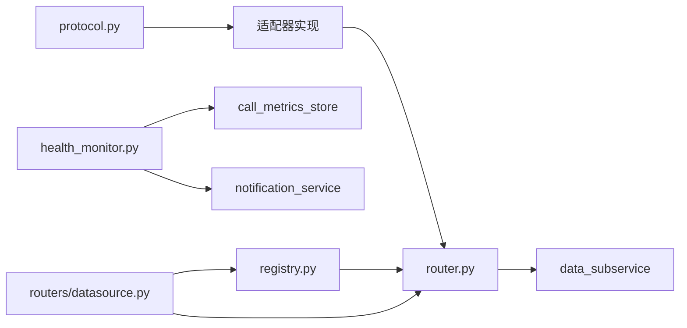

# 数据源集成

<cite>
**本文引用的文件**
- [backend/services/datasource/protocol.py](file://backend/services/datasource/protocol.py)
- [backend/services/datasource/router.py](file://backend/services/datasource/router.py)
- [backend/services/datasource/registry.py](file://backend/services/datasource/registry.py)
- [backend/services/datasource/health_monitor.py](file://backend/services/datasource/health_monitor.py)
- [backend/routers/datasource.py](file://backend/routers/datasource.py)
- [backend/core/config.py](file://backend/core/config.py)
</cite>

## 目录
1. [简介](#简介)
2. [项目结构](#项目结构)
3. [核心组件](#核心组件)
4. [架构总览](#架构总览)
5. [详细组件分析](#详细组件分析)
6. [依赖关系分析](#依赖关系分析)
7. [性能考量](#性能考量)
8. [故障排查指南](#故障排查指南)
9. [结论](#结论)
10. [附录](#附录)

## 简介
本文件面向 Quant Agent 的数据源集成系统，系统性说明统一接口抽象、协议适配与插件化注册、多数据源（富途证券、Yahoo Finance、A股等）接入方式与差异、智能路由与负载均衡、健康监控与熔断保护、配置管理（API Key、限流、重试），以及新数据源接入的完整指南。文档以代码级事实为依据，配合架构图与时序图帮助读者快速理解并扩展系统。

## 项目结构
数据源子系统围绕“统一接口 + 适配器 + 路由 + 监控”分层组织：
- 统一接口层：定义 DataSourceInterface，强制所有数据源实现 name/version/capabilities/mode/is_available/health/fetch。
- 适配器层：各数据源的具体实现（如 Futu、YFinance、Tushare/AKShare、Finnhub、FMP 等）。
- 路由层：DataSourceRouter 负责节点发现、动作映射、HMAC 鉴权、错误分类、限流感知、半开自愈探针与 action 级熔断隔离。
- 监控层：健康监控（成功率/可达性告警）、限流分析器与退避器、健康看板与延迟分布等观测能力。
- 配置层：集中式 Settings 管理 API Key、远程节点 URL、环境开关等。

图示来源
- [backend/services/datasource/protocol.py:12-46](file://backend/services/datasource/protocol.py#L12-L46)
- [backend/services/datasource/router.py:249-579](file://backend/services/datasource/router.py#L249-L579)
- [backend/services/datasource/registry.py:29-99](file://backend/services/datasource/registry.py#L29-L99)
- [backend/services/datasource/health_monitor.py:55-157](file://backend/services/datasource/health_monitor.py#L55-L157)
- [backend/routers/datasource.py:287-351](file://backend/routers/datasource.py#L287-L351)

章节来源
- [backend/services/datasource/protocol.py:12-46](file://backend/services/datasource/protocol.py#L12-L46)
- [backend/services/datasource/router.py:249-579](file://backend/services/datasource/router.py#L249-L579)
- [backend/services/datasource/registry.py:29-99](file://backend/services/datasource/registry.py#L29-L99)
- [backend/services/datasource/health_monitor.py:55-157](file://backend/services/datasource/health_monitor.py#L55-L157)
- [backend/routers/datasource.py:287-351](file://backend/routers/datasource.py#L287-L351)

## 核心组件
- 统一接口 DataSourceInterface：强制每个数据源暴露 capabilities、mode、is_available、health、fetch，确保上层仅通过 fetch(action, params) 获取数据，屏蔽底层差异。
- 限流注册表 RateLimitRegistry：为每个数据源维护 Throttler（退避）与 Analyzer（频率分析），提供 get_throttler/get_analyzer/list_names 等能力。
- 数据源路由 DataSourceRouter：维护节点拓扑（yf_primary/yf_backup_N、akshare_remote、tushare_remote、futu_master、finnhub_master、宏观源等），完成 action 映射、HMAC 签名、错误分类、action 级熔断隔离、半开自愈探针、限流压力感知与降级策略。
- 健康监控 DataSourceHealthMonitor：周期性扫描成功率与可达性，触发飞书告警；结合 /datasource/* 观测接口形成可视化看板。
- 路由 API：/datasource/health-overview、/datasource/{name}/health、/datasource/{name}/latency-distribution、/datasource/{name}/error-rate-trend、/datasource/rate-limit-overview 等，支撑前端与 Grafana。

章节来源
- [backend/services/datasource/protocol.py:12-46](file://backend/services/datasource/protocol.py#L12-L46)
- [backend/services/datasource/registry.py:29-99](file://backend/services/datasource/registry.py#L29-L99)
- [backend/services/datasource/router.py:249-579](file://backend/services/datasource/router.py#L249-L579)
- [backend/services/datasource/health_monitor.py:55-157](file://backend/services/datasource/health_monitor.py#L55-L157)
- [backend/routers/datasource.py:65-152](file://backend/routers/datasource.py#L65-L152)

## 架构总览
数据源请求从业务侧进入后，经统一接口调用，由路由器选择合适节点，携带 HMAC 签名发送至 data_subservice 子服务集群；子服务根据 source/action 分发到具体适配器执行，返回结果经归一化后回传。监控层持续采集成功率、延迟、限流状态，并通过 WebSocket/REST 对外暴露。

图示来源
- [backend/services/datasource/router.py:669-748](file://backend/services/datasource/router.py#L669-L748)
- [backend/services/datasource/router.py:602-660](file://backend/services/datasource/router.py#L602-L660)

章节来源
- [backend/services/datasource/router.py:602-748](file://backend/services/datasource/router.py#L602-L748)

## 详细组件分析

### 统一接口与适配器设计
- 统一接口要求：name/version/capabilities/mode/is_available/health/fetch。capabilities 声明支持的动作集合，用于路由匹配与探测。
- 适配器职责：实现具体协议（HTTP/WebSocket/SDK），将上游差异封装为统一的 Result/ErrorInfo，并在 health() 中上报 connected/last_error 等。
- 插件化注册：通过 ensure_all_datasources_registered 等机制在启动时自动注册，避免硬编码耦合。

图示来源
- [backend/services/datasource/protocol.py:12-46](file://backend/services/datasource/protocol.py#L12-L46)

章节来源
- [backend/services/datasource/protocol.py:12-46](file://backend/services/datasource/protocol.py#L12-L46)

### 多数据源支持与特性差异
- 富途证券（Futu）：通过 futu_master 节点，支持行情、订单簿、期权链、卖空、资金分布等丰富能力；OpenD 连接位于主节点，主服务仅 HTTP 调用。
- Yahoo Finance（YFinance）：采用 yf_primary + 多个 yf_backup_N 的多活拓扑，具备负载均衡与容灾；流量全部外移至子服务，后端不再本地执行。
- A股数据源（Tushare/AKShare）：通过 tushare_remote/akshare_remote 单节点承载，提供股票历史、财务、资金流向等；AKShare 具备热点缓存与 STALE 控制。
- 其他源：Finnhub/FMP/宏观源（FRED/DBnomics/RBI）/搜索抓取（Tavily/Bocha/Jina）均以独立节点承载，统一经 data_subservice 调度。

章节来源
- [backend/services/datasource/router.py:446-579](file://backend/services/datasource/router.py#L446-L579)

### 数据源路由机制：智能选择、负载均衡与故障转移
- 节点发现与能力匹配：根据 capability 过滤候选节点，结合 enabled/healthy/熔断冷却时间筛选。
- 负载均衡：节点带 weight，优先选择健康且未熔断的节点；YFinance 支持主备多活。
- 故障转移与熔断：
  - 节点级熔断：连续失败达到阈值进入冷却期，期间不选该节点。
  - Action 级熔断隔离：同一节点承载多个 action 时，单个 action 失败不会误杀整节点。
  - 半开自愈探针：后台定时对 unhealthy/冷却中节点发起轻量探活，成功则恢复 healthy。
- 限流压力感知：当节点处于限流退避时降低优先级，优先选择压力低的节点。

图示来源
- [backend/services/datasource/router.py:786-800](file://backend/services/datasource/router.py#L786-L800)
- [backend/services/datasource/router.py:343-409](file://backend/services/datasource/router.py#L343-L409)
- [backend/services/datasource/router.py:669-748](file://backend/services/datasource/router.py#L669-L748)

章节来源
- [backend/services/datasource/router.py:343-409](file://backend/services/datasource/router.py#L343-L409)
- [backend/services/datasource/router.py:669-748](file://backend/services/datasource/router.py#L669-L748)
- [backend/services/datasource/router.py:786-800](file://backend/services/datasource/router.py#L786-L800)

### 健康监控与熔断保护
- 健康卡片与看板：/datasource/health-overview 聚合各源 status/connected/延迟/成功率/限流次数等；/datasource/{name}/health 提供单源详情。
- 主动探测：/datasource/{name}/test-link 支持按 capability 发起轻量真实探测（如 QUOTE/MACRO_SERIES），测量真实网络往返延迟，且不污染业务熔断器。
- 告警监控：DataSourceHealthMonitor 周期扫描成功率与可达性，低于阈值或失联时推送飞书告警，内置去重冷却。
- 熔断保护：节点级与 action 级双重熔断，结合半开自愈探针自动恢复；限流类错误被正确识别并驱动退避。

图示来源
- [backend/routers/datasource.py:196-300](file://backend/routers/datasource.py#L196-L300)
- [backend/routers/datasource.py:487-642](file://backend/routers/datasource.py#L487-L642)
- [backend/services/datasource/health_monitor.py:101-157](file://backend/services/datasource/health_monitor.py#L101-L157)

章节来源
- [backend/routers/datasource.py:196-300](file://backend/routers/datasource.py#L196-L300)
- [backend/routers/datasource.py:487-642](file://backend/routers/datasource.py#L487-L642)
- [backend/services/datasource/health_monitor.py:101-157](file://backend/services/datasource/health_monitor.py#L101-L157)

### 新数据源接入指南
- 步骤概览
  1) 实现 DataSourceInterface：至少实现 name/version/capabilities/mode/is_available/health/fetch。
  2) 注册适配器：在 ensure_all_datasources_registered 中注册，或通过注册表注入。
  3) 配置路由节点：若走 data_subservice，需在 DataSourceRouter._init_nodes 中添加节点（URL、capabilities、weight）。
  4) 配置 API Key：在 Settings 中新增字段（如 xxx_api_key），并通过环境变量注入。
  5) 测试验证：使用 /datasource/{name}/test-link 进行链路探测；观察 /datasource/{name}/latency-distribution 与 /datasource/rate-limit-overview。
- 关键要点
  - capabilities 必须准确声明，否则路由无法匹配或探测失败。
  - health() 需返回 connected/last_error 等字段，便于看板判定真实连通性。
  - fetch() 应遵循统一错误模型，必要时附带 error_category，以便限流/配额/IP封禁正确识别。
  - 若通过 data_subservice 转发，需遵守 HMAC 签名契约与 /api/v1/data 协议。

章节来源
- [backend/services/datasource/protocol.py:12-46](file://backend/services/datasource/protocol.py#L12-L46)
- [backend/services/datasource/router.py:446-579](file://backend/services/datasource/router.py#L446-L579)
- [backend/core/config.py:61-73](file://backend/core/config.py#L61-L73)
- [backend/routers/datasource.py:487-642](file://backend/routers/datasource.py#L487-L642)

### 配置管理：API Key、限流与重试
- API Key 管理：Settings 集中管理 finnhub_api_key、akshare_api_key、fred_api_key 等，支持 .env 注入与校验。
- 限流与退避：RateLimitRegistry 为每个数据源提供 Throttler（退避）与 Analyzer（频率分析），支持窗口分析、推荐间隔、峰值时段、平均恢复时间等。
- 重试策略：路由层根据 HTTP 状态码与响应头推断错误类别，区分 RATE_LIMIT/QUOTA_EXHAUSTED/IP_BLOCKED/NORMAL，并结合 retry_after 指导退避；action 级熔断避免误伤同节点其它动作。
- 远程通信安全：启用路由时必须配置 DATA_SOURCE_HMAC_SECRET，主/子服务间通过 HMAC-SHA256 签名校验，防止伪造请求。

章节来源
- [backend/core/config.py:61-73](file://backend/core/config.py#L61-L73)
- [backend/services/datasource/registry.py:29-99](file://backend/services/datasource/registry.py#L29-L99)
- [backend/services/datasource/router.py:249-284](file://backend/services/datasource/router.py#L249-L284)
- [backend/services/datasource/router.py:669-748](file://backend/services/datasource/router.py#L669-L748)

## 依赖关系分析
- 模块内聚与耦合
  - protocol.py 定义最小契约，适配器与其强耦合，但与其他模块松耦合。
  - router.py 依赖 registry.py（限流注册表）、core.circuit_breaker（熔断冷却）、httpx（HTTP 客户端）与 data_subservice 协议。
  - health_monitor.py 依赖 call_metrics_store、alert/notification_service，解耦于具体数据源。
  - routers/datasource.py 聚合健康看板、限流分析、延迟分布等观测能力，依赖 datasource_registry 与 rate_limit_registry。
- 外部依赖
  - data_subservice：承载各数据源的连接与执行，主服务仅通过 HTTP 访问。
  - Redis：用于今日指标持久化、延迟样本存储、探针计数等。
  - 通知服务：飞书 Webhook 推送告警。

图示来源
- [backend/services/datasource/protocol.py:12-46](file://backend/services/datasource/protocol.py#L12-L46)
- [backend/services/datasource/router.py:249-579](file://backend/services/datasource/router.py#L249-L579)
- [backend/services/datasource/registry.py:29-99](file://backend/services/datasource/registry.py#L29-L99)
- [backend/services/datasource/health_monitor.py:55-157](file://backend/services/datasource/health_monitor.py#L55-L157)
- [backend/routers/datasource.py:287-351](file://backend/routers/datasource.py#L287-L351)

章节来源
- [backend/services/datasource/router.py:249-579](file://backend/services/datasource/router.py#L249-L579)
- [backend/services/datasource/registry.py:29-99](file://backend/services/datasource/registry.py#L29-L99)
- [backend/services/datasource/health_monitor.py:55-157](file://backend/services/datasource/health_monitor.py#L55-L157)
- [backend/routers/datasource.py:287-351](file://backend/routers/datasource.py#L287-L351)

## 性能考量
- 并发与事件循环保护：test-link 接口设置全局最小触发间隔、per-source 串行锁与并发信号量，避免“全部测试连接”风暴拖垮事件循环。
- 节点级与 action 级熔断：避免局部失败扩散，减少无效重试与资源占用。
- 半开自愈探针：定期探活恢复，降低人工干预成本。
- 延迟统计与直方图：仅记录真实探测成功的样本，避免健康检查耗时污染业务延迟指标。
- 限流压力感知：在路由选择时考虑节点限流状态，降低整体失败率。

章节来源
- [backend/routers/datasource.py:458-642](file://backend/routers/datasource.py#L458-L642)
- [backend/services/datasource/router.py:343-409](file://backend/services/datasource/router.py#L343-L409)

## 故障排查指南
- 常见问题定位
  - 路由未启用或密钥缺失：检查 DATA_SOURCE_ROUTER_ENABLED 与 DATA_SOURCE_HMAC_SECRET，启动日志会打印密钥前缀诊断。
  - 远程 URL 指向主服务自身：_validate_node_urls 会在启动期警告端口异常，修正 *_REMOTE_URL。
  - 限流/配额/IP封禁：查看 /datasource/{name}/rate-limit-status 与 /datasource/rate-limit-overview，确认 error_category 与 backoff_strategy。
  - 健康看板显示 stale/idle/error：结合 test-link 与 latency-distribution 判断是否为真实链路问题。
- 建议操作
  - 使用 /datasource/{name}/test-link 进行主动探测，注意退避期内会跳过真实请求。
  - 关注 /datasource/{name}/latency-distribution 与 /datasource/{name}/error-rate-trend，定位高延迟与错误趋势。
  - 检查告警队列与 NotificationService 可用性，确保飞书告警正常投递。

章节来源
- [backend/services/datasource/router.py:249-284](file://backend/services/datasource/router.py#L249-L284)
- [backend/services/datasource/router.py:411-445](file://backend/services/datasource/router.py#L411-L445)
- [backend/routers/datasource.py:65-152](file://backend/routers/datasource.py#L65-L152)
- [backend/routers/datasource.py:487-642](file://backend/routers/datasource.py#L487-L642)

## 结论
Quant Agent 的数据源集成系统通过统一接口、插件化适配器、智能路由与健康监控，实现了多数据源的高可用接入与可观测性。路由层提供负载均衡、action 级熔断与半开自愈，监控层提供实时健康看板与告警，配置层集中管理密钥与环境参数。按照本文指南，可快速接入新数据源并保障稳定性与性能。

## 附录
- 常用观测接口
  - /datasource/health-overview：健康卡片矩阵
  - /datasource/{name}/health：单源健康详情
  - /datasource/{name}/latency-distribution：延迟直方图
  - /datasource/{name}/error-rate-trend：错误率趋势
  - /datasource/rate-limit-overview：限流总览
  - /datasource/{name}/test-link：主动链路探测
- 关键环境变量
  - DATA_SOURCE_ROUTER_ENABLED、DATA_SOURCE_HMAC_SECRET
  - YF_PRIMARY_NODE_URL、YF_BACKUP_NODE_URL
  - AKSHARE_REMOTE_URL、TUSHARE_REMOTE_URL
  - FUTU_REMOTE_URL、FINNHUB_REMOTE_URL、FRED_REMOTE_URL、DBNOMICS_REMOTE_URL、RBI_REMOTE_URL
  - DATASOURCE_ACTION_MAX_FAILURES、DATASOURCE_ACTION_NODE_MIN_THRESHOLD、DATASOURCE_ACTION_NODE_RATIO
  - DATASOURCE_PROBE_INTERVAL

章节来源
- [backend/routers/datasource.py:65-152](file://backend/routers/datasource.py#L65-L152)
- [backend/routers/datasource.py:287-351](file://backend/routers/datasource.py#L287-L351)
- [backend/services/datasource/router.py:17-30](file://backend/services/datasource/router.py#L17-L30)
- [backend/services/datasource/router.py:150-159](file://backend/services/datasource/router.py#L150-L159)
- [backend/services/datasource/router.py:343-350](file://backend/services/datasource/router.py#L343-L350)
