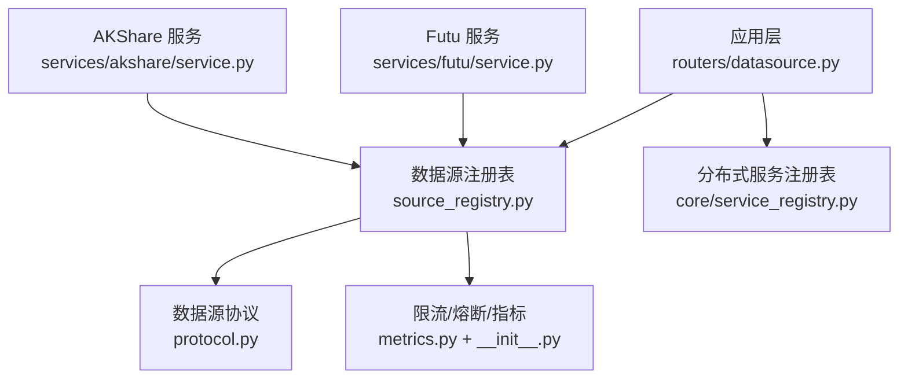
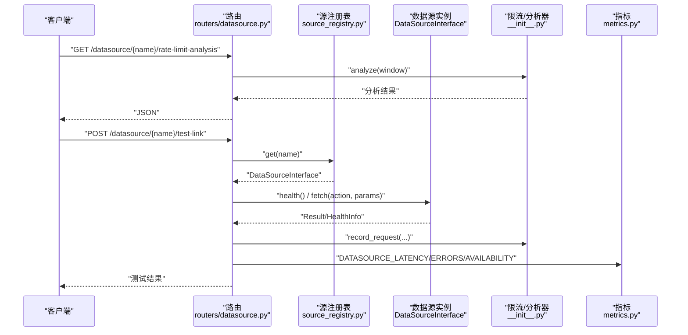
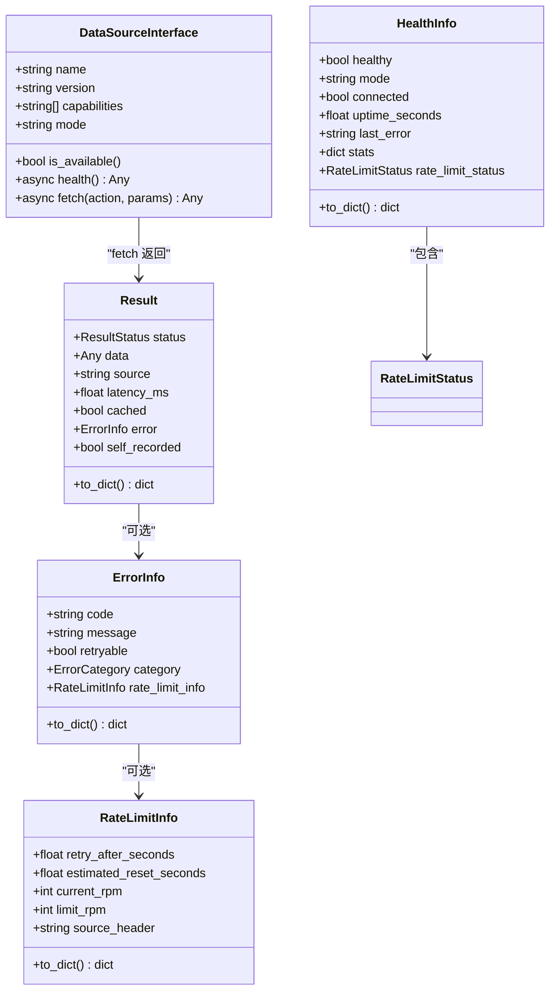
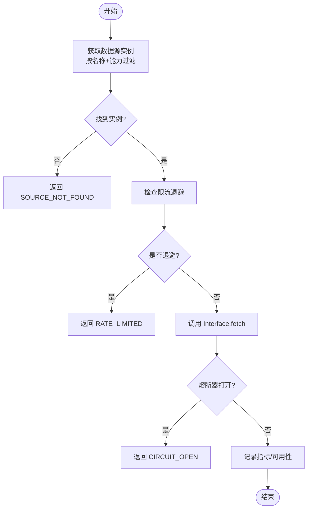
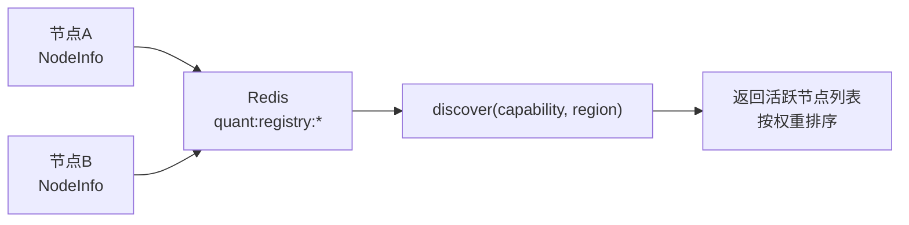
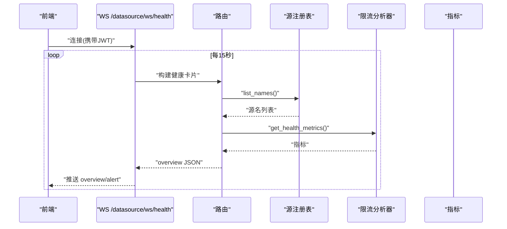
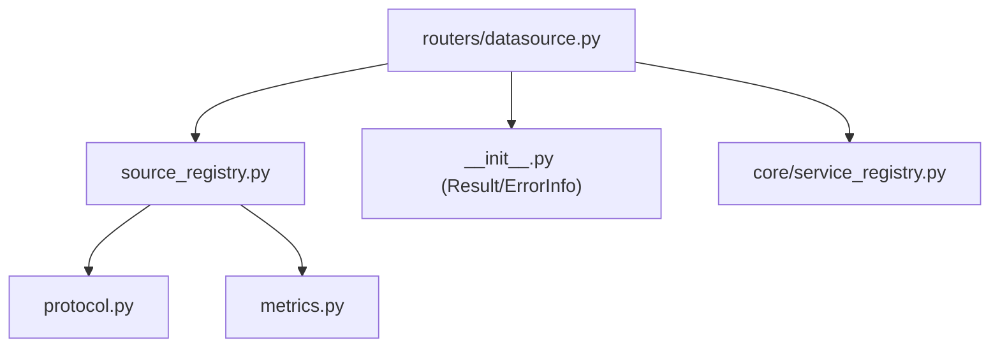

# 新数据源接入指南

<cite>
**本文引用的文件**
- [backend/services/datasource/__init__.py](file://backend/services/datasource/__init__.py)
- [backend/services/datasource/protocol.py](file://backend/services/datasource/protocol.py)
- [backend/services/datasource/source_registry.py](file://backend/services/datasource/source_registry.py)
- [backend/core/service_registry.py](file://backend/core/service_registry.py)
- [backend/core/error_codes.py](file://backend/core/error_codes.py)
- [backend/routers/datasource.py](file://backend/routers/datasource.py)
- [backend/core/metrics.py](file://backend/core/metrics.py)
- [backend/services/futu/service.py](file://backend/services/futu/service.py)
- [backend/services/akshare/service.py](file://backend/services/akshare/service.py)
</cite>

## 目录
1. [引言](#引言)
2. [项目结构](#项目结构)
3. [核心组件](#核心组件)
4. [架构总览](#架构总览)
5. [详细组件分析](#详细组件分析)
6. [依赖关系分析](#依赖关系分析)
7. [性能与可观测性](#性能与可观测性)
8. [故障排查指南](#故障排查指南)
9. [结论](#结论)
10. [附录：开发清单与部署检查项](#附录：开发清单与部署检查项)

## 引言
本指南面向需要在系统中接入新数据源的开发者，覆盖协议规范、适配器开发流程、注册机制、监控告警集成以及从简单 REST 到复杂 WebSocket 的完整示例。文档基于现有代码库中的统一数据源框架、服务注册表、错误码体系与监控指标进行说明，确保新增数据源与既有系统无缝协作。

## 项目结构
本项目采用分层与按能力组织相结合的结构：
- 数据源协议与统一返回模型位于 services/datasource 下，定义 DataSourceInterface、Result/ErrorInfo/HealthInfo 等通用结构。
- 服务注册与发现由 core/service_registry.py 提供分布式节点管理能力（Redis 驱动）。
- 路由与健康看板在 routers/datasource.py 中暴露 HTTP/WebSocket 接口。
- 监控指标集中在 core/metrics.py，支持 Prometheus 导出。
- 具体数据源实现以 service 模块形式存在，如 FutuService、AKShareService，遵循远程代理或本地封装模式。

**图表来源**
- [backend/routers/datasource.py:1-707](file://backend/routers/datasource.py#L1-L707)
- [backend/services/datasource/source_registry.py:1-259](file://backend/services/datasource/source_registry.py#L1-L259)
- [backend/services/datasource/protocol.py:1-47](file://backend/services/datasource/protocol.py#L1-L47)
- [backend/core/service_registry.py:1-417](file://backend/core/service_registry.py#L1-L417)
- [backend/core/metrics.py:1-641](file://backend/core/metrics.py#L1-L641)
- [backend/services/futu/service.py:1-213](file://backend/services/futu/service.py#L1-L213)
- [backend/services/akshare/service.py:1-114](file://backend/services/akshare/service.py#L1-L114)

**章节来源**
- [backend/services/datasource/__init__.py:1-468](file://backend/services/datasource/__init__.py#L1-L468)
- [backend/services/datasource/protocol.py:1-47](file://backend/services/datasource/protocol.py#L1-L47)
- [backend/services/datasource/source_registry.py:1-259](file://backend/services/datasource/source_registry.py#L1-L259)
- [backend/core/service_registry.py:1-417](file://backend/core/service_registry.py#L1-L417)
- [backend/routers/datasource.py:1-707](file://backend/routers/datasource.py#L1-L707)
- [backend/core/metrics.py:1-641](file://backend/core/metrics.py#L1-L641)

## 核心组件
- 数据源协议：DataSourceInterface 定义了 name/version/capabilities/mode/is_available/health/fetch 等统一方法，所有数据源必须实现。
- 统一返回结构：Result/ResultStatus/ErrorInfo/RateLimitInfo/HealthInfo 标准化成功、失败、限流、降级与健康信息。
- 源实例注册表：DataSourceRegistry 管理 DataSourceInterface 实例，提供按名称和能力过滤获取、主路径 fetch（含限流检查、熔断器集成、指标记录）。
- 分布式服务注册表：ServiceRegistry 基于 Redis 实现跨节点注册、心跳、发现、优雅下线与统计。
- 错误码体系：ErrorCode 全局枚举及 HTTP 状态映射，保证错误语义一致。
- 监控指标：Prometheus 指标涵盖延迟、错误、限流、可用性、主动拨测、WebSocket 连接数等。

**章节来源**
- [backend/services/datasource/protocol.py:1-47](file://backend/services/datasource/protocol.py#L1-L47)
- [backend/services/datasource/__init__.py:1-468](file://backend/services/datasource/__init__.py#L1-L468)
- [backend/services/datasource/source_registry.py:1-259](file://backend/services/datasource/source_registry.py#L1-L259)
- [backend/core/service_registry.py:1-417](file://backend/core/service_registry.py#L1-L417)
- [backend/core/error_codes.py:1-55](file://backend/core/error_codes.py#L1-L55)
- [backend/core/metrics.py:1-641](file://backend/core/metrics.py#L1-L641)

## 架构总览
下图展示请求从路由进入，经注册表选择数据源实例，调用 Interface.fetch，并通过限流/熔断/指标记录后返回统一 Result 的过程。同时，健康看板通过 WS/HTTP 聚合各源状态。

**图表来源**
- [backend/routers/datasource.py:65-153](file://backend/routers/datasource.py#L65-L153)
- [backend/routers/datasource.py:487-643](file://backend/routers/datasource.py#L487-L643)
- [backend/services/datasource/source_registry.py:140-255](file://backend/services/datasource/source_registry.py#L140-L255)
- [backend/services/datasource/__init__.py:227-307](file://backend/services/datasource/__init__.py#L227-L307)
- [backend/core/metrics.py:152-182](file://backend/core/metrics.py#L152-L182)

## 详细组件分析

### 数据源协议与统一模型
- DataSourceInterface：强制实现 name/version/capabilities/mode/is_available/health/fetch，确保上层仅通过 Interface 访问数据源。
- Result/ResultStatus：统一返回成功、错误、限流、降级四种状态，附带 source/latency_ms/cached/self_recorded 等元信息。
- ErrorInfo/RateLimitInfo：区分普通错误与限流类错误（rate_limit/quota_exhausted/ip_blocked/data_unavailable），并提供便捷构造方法与分类工具函数。
- HealthInfo：包含 healthy/connected/uptime/stats/rate_limit_status，用于健康看板与探针。

**图表来源**
- [backend/services/datasource/protocol.py:12-47](file://backend/services/datasource/protocol.py#L12-L47)
- [backend/services/datasource/__init__.py:227-307](file://backend/services/datasource/__init__.py#L227-L307)
- [backend/services/datasource/__init__.py:100-211](file://backend/services/datasource/__init__.py#L100-L211)
- [backend/services/datasource/__init__.py:314-371](file://backend/services/datasource/__init__.py#L314-L371)

**章节来源**
- [backend/services/datasource/protocol.py:1-47](file://backend/services/datasource/protocol.py#L1-L47)
- [backend/services/datasource/__init__.py:1-468](file://backend/services/datasource/__init__.py#L1-L468)

### 源实例注册与主路径调用
- DataSourceRegistry.register/get/fetch：维护实例列表，按名称与能力过滤获取；主路径 fetch 执行限流检查、熔断器包装、指标记录与可用性更新。
- 限流保护：若 throttler.should_throttle() 为真，直接返回 RATE_LIMITED，避免雪崩。
- 熔断器集成：通过 fetch_via_breaker_async 调用，遇到 CircuitBreakerOpenError 时返回明确错误并记录指标。
- 指标记录：成功/错误/限流分别记录延迟、错误类型、可用性，并上报 Prometheus。

**图表来源**
- [backend/services/datasource/source_registry.py:98-133](file://backend/services/datasource/source_registry.py#L98-L133)
- [backend/services/datasource/source_registry.py:140-255](file://backend/services/datasource/source_registry.py#L140-L255)

**章节来源**
- [backend/services/datasource/source_registry.py:1-259](file://backend/services/datasource/source_registry.py#L1-L259)

### 分布式服务注册与发现
- ServiceRegistry：基于 Redis Hash/ZSet/Set 存储节点信息与心跳，支持按 capability/region 过滤发现、优雅下线（draining）、死节点清理与集群总览。
- NodeInfo：描述节点 ID、URL、区域、权重、能力、状态、心跳时间戳等。
- 使用场景：多节点部署时，主服务可通过 discover(capability=...) 选择合适节点，结合权重进行负载均衡。

**图表来源**
- [backend/core/service_registry.py:51-67](file://backend/core/service_registry.py#L51-L67)
- [backend/core/service_registry.py:188-229](file://backend/core/service_registry.py#L188-L229)
- [backend/core/service_registry.py:269-314](file://backend/core/service_registry.py#L269-L314)
- [backend/core/service_registry.py:320-353](file://backend/core/service_registry.py#L320-L353)

**章节来源**
- [backend/core/service_registry.py:1-417](file://backend/core/service_registry.py#L1-L417)

### 错误码标准
- ErrorCode：统一错误码分域（成功、认证鉴权、请求资源、基础设施、内部错误），并提供 HTTP 状态映射。
- 建议：数据源适配器在异常时应映射为合适的 ErrorCode，并在 Result.ErrorInfo.code 中体现，便于前端与运维统一处理。

**章节来源**
- [backend/core/error_codes.py:1-55](file://backend/core/error_codes.py#L1-L55)

### 监控与告警集成
- 指标定义：延迟分布、错误计数、限流次数、可用性、主动拨测成功率/延迟/失败原因、WebSocket 连接数与消息计数等。
- 健康看板：/datasource/health-overview 与 /datasource/{name}/health 聚合各源状态；WS /datasource/ws/health 实时推送 overview 与 stale 报警。
- 链接测试：/datasource/{name}/test-link 支持按 capability 发起轻量真实探测，测量网络往返延迟并写入分析器。

**图表来源**
- [backend/routers/datasource.py:645-707](file://backend/routers/datasource.py#L645-L707)
- [backend/routers/datasource.py:196-300](file://backend/routers/datasource.py#L196-L300)
- [backend/core/metrics.py:152-217](file://backend/core/metrics.py#L152-L217)

**章节来源**
- [backend/routers/datasource.py:1-707](file://backend/routers/datasource.py#L1-L707)
- [backend/core/metrics.py:1-641](file://backend/core/metrics.py#L1-L641)

### 适配器开发流程
- 继承协议：实现 DataSourceInterface 的所有方法，确保 name/version/capabilities/mode/is_available/health/fetch 正确。
- 方法实现要点：
  - is_available：根据配置/连接状态判断可用性。
  - health：返回 HealthInfo，包含 connected/healthy/last_error/rate_limit_status。
  - fetch：返回 Result，正确处理限流/错误/降级，并填充 latency_ms/source/cached/self_recorded。
- 注册机制：
  - 通过 datasource_registry.register(source, instance_id) 完成注册，自动预热限流条目。
  - 如需分布式节点注册，使用 ServiceRegistry.register(NodeInfo)，并定期 heartbeat。
- 测试用例编写：
  - 单元测试：mock 外部依赖，验证 Result 状态、ErrorInfo 分类、延迟与缓存标记。
  - 集成测试：通过 /datasource/{name}/test-link 触发真实链路探测，校验连通性与延迟。
  - 健康看板测试：轮询 /datasource/health-overview 与 WS /datasource/ws/health，验证状态流转与 alert。

**章节来源**
- [backend/services/datasource/protocol.py:12-47](file://backend/services/datasource/protocol.py#L12-L47)
- [backend/services/datasource/source_registry.py:55-73](file://backend/services/datasource/source_registry.py#L55-L73)
- [backend/routers/datasource.py:487-643](file://backend/routers/datasource.py#L487-L643)

### 完整开发示例

#### 示例一：简单 REST API 数据源
- 目标：接入一个提供历史 K 线的 REST 数据源。
- 步骤：
  1. 实现 DataSourceInterface：
     - name/version/capabilities=["HISTORY"]/mode="external"
     - is_available：检查 API Key/Host 配置
     - health：尝试轻量 GET /ping，设置 connected/healthy
     - fetch：调用 REST，解析响应为 Result.make_success(...) 或 Result.make_error(...)
  2. 注册：datasource_registry.register(MyRestSource())
  3. 测试：
     - POST /datasource/myrest/test-link 触发真实探测
     - GET /datasource/myrest/latency-distribution?hours=24 查看延迟分布
     - GET /datasource/myrest/error-rate-trend?hours=24 查看错误率趋势

**章节来源**
- [backend/services/datasource/protocol.py:12-47](file://backend/services/datasource/protocol.py#L12-L47)
- [backend/routers/datasource.py:354-427](file://backend/routers/datasource.py#L354-L427)
- [backend/routers/datasource.py:487-643](file://backend/routers/datasource.py#L487-L643)

#### 示例二：复杂 WebSocket 连接的数据源
- 目标：接入提供实时报价的 WebSocket 数据源。
- 步骤：
  1. 实现 DataSourceInterface：
     - capabilities=["QUOTE"]/mode="hybrid"
     - is_available：检查 WS 连接池状态
     - health：发送心跳帧，设置 connected/healthy
     - fetch：对于 QUOTE action，优先返回 tick_cache 命中，否则走 WS 订阅拉取最新快照
  2. 指标与监控：
     - 记录 DATASOURCE_LATENCY/DATASOURCE_ERRORS/DATASOURCE_AVAILABILITY
     - 关注 WS_ACTIVE_CONNECTIONS/WS_MESSAGES_SENT/WS_SUBSCRIPTIONS
  3. 测试：
     - 通过 test-link 的 QUOTE 能力分支进行真实探测
     - 观察 WS 健康看板与指标面板

**章节来源**
- [backend/core/metrics.py:53-72](file://backend/core/metrics.py#L53-L72)
- [backend/routers/datasource.py:487-643](file://backend/routers/datasource.py#L487-L643)

### 现有数据源参考
- FutuService：远程-only 代理，所有方法经 DataSourceRouter 转发至子服务，保持与原 local 接口兼容。
- AKShareService：封装资金流向数据获取逻辑，支持 direct/cache 模式，具备熔断与健康状态查询。

**章节来源**
- [backend/services/futu/service.py:1-213](file://backend/services/futu/service.py#L1-L213)
- [backend/services/akshare/service.py:1-114](file://backend/services/akshare/service.py#L1-L114)

## 依赖关系分析
- 路由层依赖注册表与限流分析器，不直连具体服务。
- 注册表依赖协议与指标模块，负责实例管理与主路径调用。
- 指标模块被注册表与路由广泛引用，用于延迟、错误、限流、可用性统计。
- 分布式服务注册表独立于数据源协议，提供跨节点治理能力。

**图表来源**
- [backend/routers/datasource.py:1-707](file://backend/routers/datasource.py#L1-L707)
- [backend/services/datasource/source_registry.py:1-259](file://backend/services/datasource/source_registry.py#L1-L259)
- [backend/services/datasource/protocol.py:1-47](file://backend/services/datasource/protocol.py#L1-L47)
- [backend/core/metrics.py:1-641](file://backend/core/metrics.py#L1-L641)
- [backend/core/service_registry.py:1-417](file://backend/core/service_registry.py#L1-L417)

**章节来源**
- [backend/routers/datasource.py:1-707](file://backend/routers/datasource.py#L1-L707)
- [backend/services/datasource/source_registry.py:1-259](file://backend/services/datasource/source_registry.py#L1-L259)
- [backend/core/service_registry.py:1-417](file://backend/core/service_registry.py#L1-L417)

## 性能与可观测性
- 延迟优化：
  - 合理使用 skip_cache/ttl 参数避免热缓存误报低延迟。
  - 对扩展行情等动作豁免熔断（per-source），降低误杀风险。
- 限流与退避：
  - 利用 RateLimitThrottler 与 Analyzer 自适应调整请求间隔，避免 429/配额耗尽。
- 指标与告警：
  - 关注 DATASOURCE_LATENCY/DATASOURCE_ERRORS/DATASOURCE_RATE_LIMITS/DATASOURCE_AVAILABILITY。
  - 主动拨测指标 DATASOURCE_PROBE_* 用于无业务流量时的存活检测。
  - WebSocket 指标 WS_ACTIVE_CONNECTIONS/WS_MESSAGES_DROPPED 用于背压与慢客户端治理。

[本节为通用指导，无需特定文件引用]

## 故障排查指南
- 常见问题定位：
  - 未注册或不可用：检查 datasource_registry.has(name) 与 is_available。
  - 限流退避：查看 /datasource/{name}/rate-limit-status 与 backoff_strategy。
  - 熔断器打开：确认错误类型是否为 circuit_open，必要时调整阈值或豁免动作。
  - 健康探针失败：通过 test-link 的 probed/validated 字段判断真实链路是否成功。
- 日志与指标：
  - 结合 Prometheus 面板查看延迟分布与错误率趋势。
  - 使用 WS 健康看板实时观察 stale 报警与状态变化。

**章节来源**
- [backend/routers/datasource.py:94-153](file://backend/routers/datasource.py#L94-L153)
- [backend/routers/datasource.py:487-643](file://backend/routers/datasource.py#L487-L643)
- [backend/core/metrics.py:152-217](file://backend/core/metrics.py#L152-L217)

## 结论
通过统一的 DataSourceInterface、Result/ErrorInfo/HealthInfo 模型、分布式服务注册表与完善的监控指标，系统为新数据源接入提供了稳定、可扩展且可观测的基础设施。开发者只需遵循协议规范、实现必要方法、完成注册与测试，即可快速将新数据源融入整体生态。

[本节为总结，无需特定文件引用]

## 附录：开发清单与部署检查项

### 代码审查清单
- 协议实现完整性：
  - 是否实现 name/version/capabilities/mode/is_available/health/fetch？
  - capabilities 是否与 action 严格匹配（大小写归一）？
- 返回结构规范：
  - Result.status 是否正确（success/error/rate_limited/degraded）？
  - ErrorInfo.category 是否准确（normal/rate_limit/quota_exhausted/ip_blocked/data_unavailable）？
  - latency_ms/source/cached/self_recorded 是否合理填写？
- 限流与熔断：
  - 是否正确使用 RateLimitThrottler/Analyzer？
  - 是否对易错动作设置熔断豁免（如 futu 扩展行情）？
- 指标与日志：
  - 是否记录 DATASOURCE_LATENCY/DATASOURCE_ERRORS/DATASOURCE_AVAILABILITY？
  - 是否记录主动拨测指标（probe success/latency/failures）？
- 健康与测试：
  - health() 是否能反映真实连通性？
  - 是否通过 test-link 验证真实链路延迟与连通？
  - 是否覆盖 WS 健康看板与 alert 场景？

**章节来源**
- [backend/services/datasource/protocol.py:12-47](file://backend/services/datasource/protocol.py#L12-L47)
- [backend/services/datasource/__init__.py:227-307](file://backend/services/datasource/__init__.py#L227-L307)
- [backend/services/datasource/source_registry.py:140-255](file://backend/services/datasource/source_registry.py#L140-L255)
- [backend/routers/datasource.py:487-643](file://backend/routers/datasource.py#L487-L643)
- [backend/core/metrics.py:152-217](file://backend/core/metrics.py#L152-L217)

### 部署检查项
- 服务注册：
  - 是否调用 datasource_registry.register(source, instance_id)？
  - 是否需要分布式节点注册（ServiceRegistry.register/heartbeat）？
- 配置与环境：
  - API Key/Host/Mode 等环境变量是否配置正确？
  - AKSHARE_MODE/FUTU_MODE 等运行模式是否符合预期？
- 监控与告警：
  - Prometheus 指标是否可采集？
  - Grafana 面板是否挂载延迟、错误、限流、可用性视图？
  - WS 健康看板是否可连接并接收 overview/alert？
- 测试与验证：
  - 是否执行 test-link 并验证 probed/validated？
  - 是否验证 latency-distribution/error-rate-trend/availability-timeline？
  - 是否覆盖限流与熔断场景的回归测试？

**章节来源**
- [backend/core/service_registry.py:92-119](file://backend/core/service_registry.py#L92-L119)
- [backend/services/akshare/service.py:27-77](file://backend/services/akshare/service.py#L27-L77)
- [backend/routers/datasource.py:354-455](file://backend/routers/datasource.py#L354-L455)
- [backend/routers/datasource.py:645-707](file://backend/routers/datasource.py#L645-L707)
