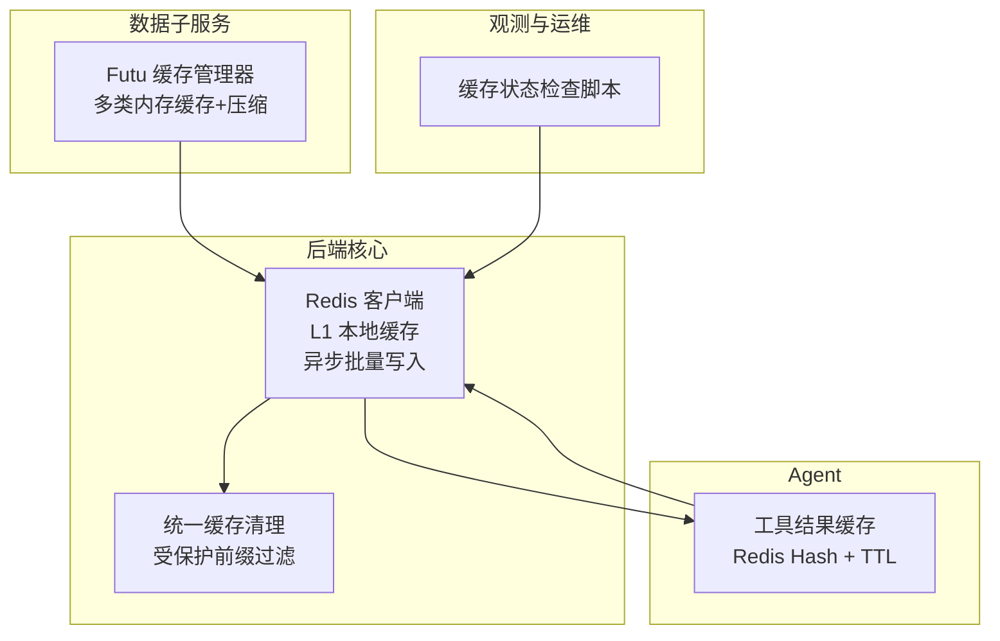
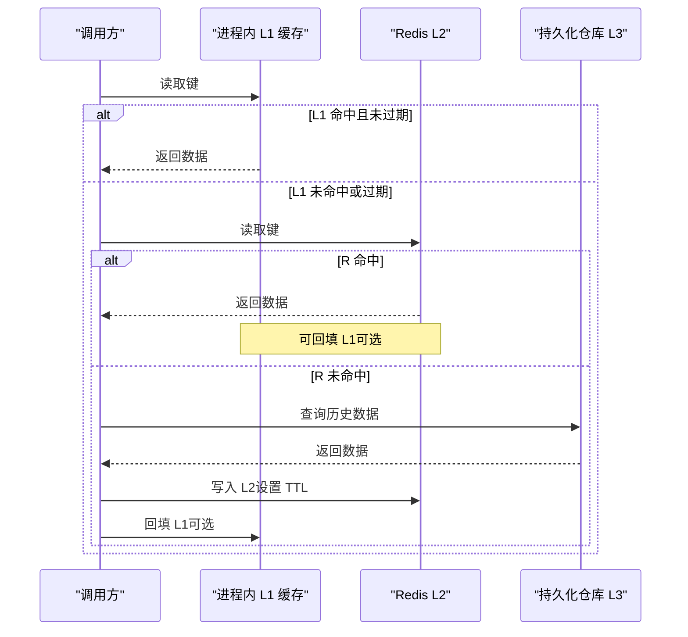
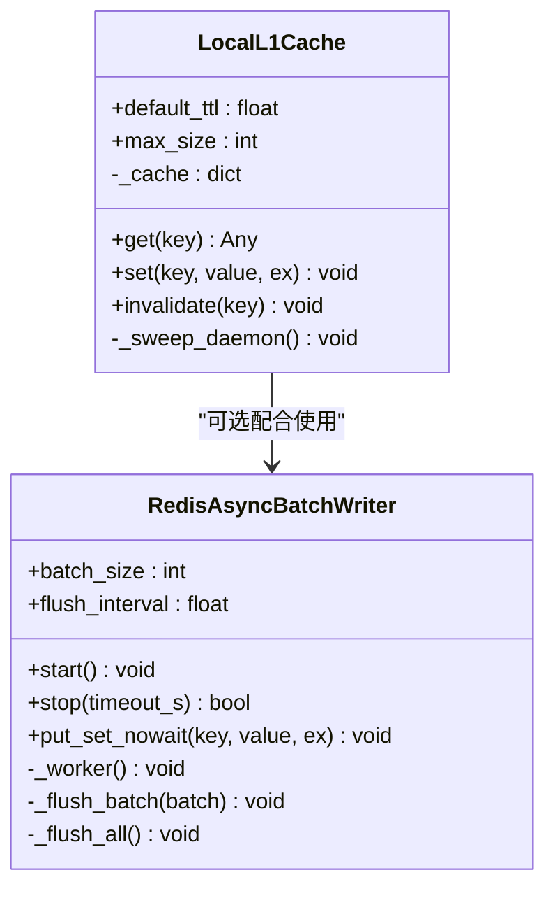
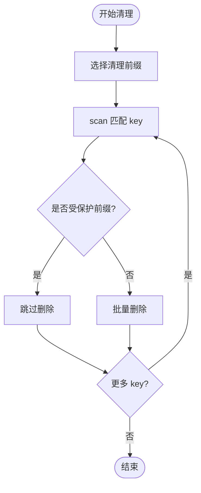
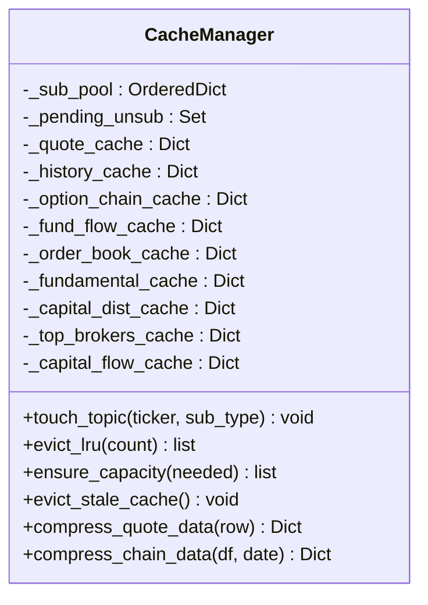
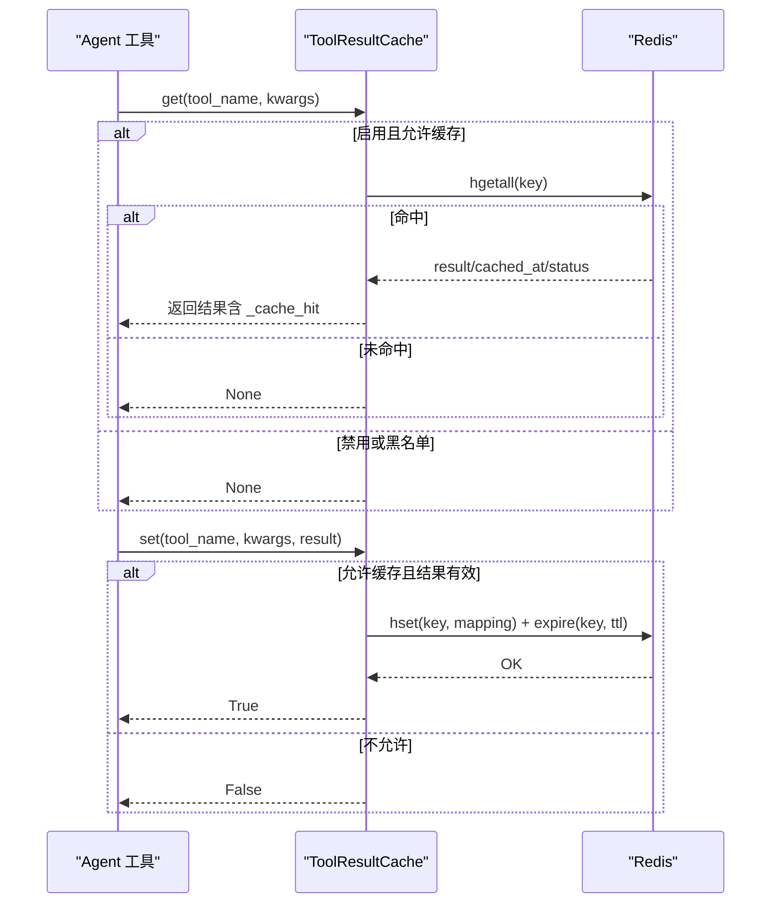
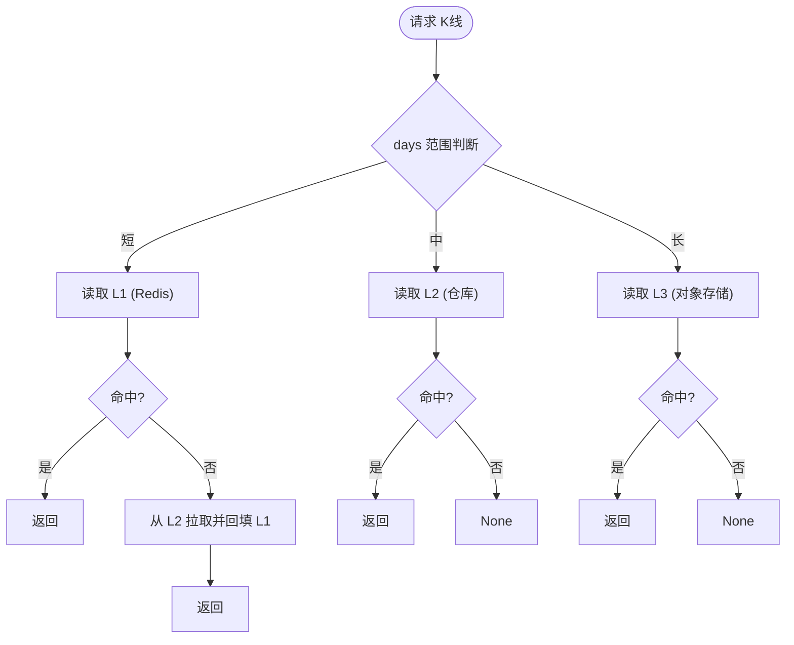
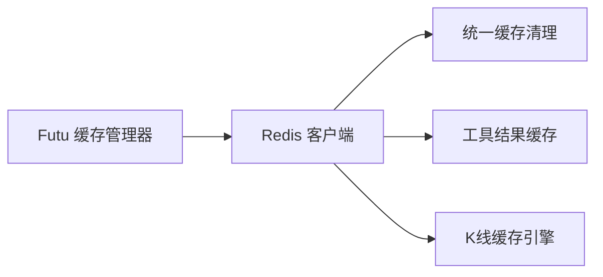

# 缓存策略设计

<cite>
**本文引用的文件**
- [backend/core/redis_client.py](file://backend/core/redis_client.py)
- [backend/core/cache_manager.py](file://backend/core/cache_manager.py)
- [data_subservice/futu_src/cache_manager.py](file://data_subservice/futu_src/cache_manager.py)
- [hermes_agent/tool_result_cache.py](file://hermes_agent/tool_result_cache.py)
- [backend/tests/test_kline_cache.py](file://backend/tests/test_kline_cache.py)
- [scripts/check_cache_status.py](file://scripts/check_cache_status.py)
</cite>

## 目录
1. [简介](#简介)
2. [项目结构](#项目结构)
3. [核心组件](#核心组件)
4. [架构总览](#架构总览)
5. [详细组件分析](#详细组件分析)
6. [依赖关系分析](#依赖关系分析)
7. [性能考量](#性能考量)
8. [故障排查指南](#故障排查指南)
9. [结论](#结论)
10. [附录](#附录)

## 简介
本文件面向 Quant Agent 的缓存策略设计与实现，围绕多级缓存（内存 L1、Redis L2、持久化 L3）进行系统化说明。文档覆盖：
- 缓存层次与选择策略（LRU、TTL、失效机制）
- 技术指标缓存（K线数据、指标计算结果、批量更新）
- 资金流向缓存（低频定时刷新与增量更新）
- 一致性保障（分布式锁、版本控制、冲突解决）
- 性能优化（预加载、压缩存储、内存监控）
- 监控指标（命中率、延迟、容量使用）

## 项目结构
本项目在多个模块中实现了缓存能力：
- 通用 Redis 客户端与进程内 L1 缓存、异步批量写入器：backend/core/redis_client.py
- 统一业务缓存清理工具（保护交易态 key）：backend/core/cache_manager.py
- Futu 数据源侧的多类内存缓存与压缩工具：data_subservice/futu_src/cache_manager.py
- Agent 工具调用结果缓存（Redis Hash + TTL）：hermes_agent/tool_result_cache.py
- K线三级缓存引擎（测试用例体现路由与回退）：backend/tests/test_kline_cache.py
- 缓存状态诊断脚本：scripts/check_cache_status.py

**图示来源**
- [backend/core/redis_client.py:1-252](file://backend/core/redis_client.py#L1-L252)
- [backend/core/cache_manager.py:1-75](file://backend/core/cache_manager.py#L1-L75)
- [data_subservice/futu_src/cache_manager.py:1-373](file://data_subservice/futu_src/cache_manager.py#L1-L373)
- [hermes_agent/tool_result_cache.py:1-195](file://hermes_agent/tool_result_cache.py#L1-L195)
- [scripts/check_cache_status.py:1-90](file://scripts/check_cache_status.py#L1-L90)

**章节来源**
- [backend/core/redis_client.py:1-252](file://backend/core/redis_client.py#L1-L252)
- [backend/core/cache_manager.py:1-75](file://backend/core/cache_manager.py#L1-L75)
- [data_subservice/futu_src/cache_manager.py:1-373](file://data_subservice/futu_src/cache_manager.py#L1-L373)
- [hermes_agent/tool_result_cache.py:1-195](file://hermes_agent/tool_result_cache.py#L1-L195)
- [scripts/check_cache_status.py:1-90](file://scripts/check_cache_status.py#L1-L90)

## 核心组件
- 通用 Redis 客户端与连接池：集中配置 host/port/password/max_connections，提供全局 redis_client 实例。
- 异步批量写入器：将高频 set 操作入队，后台协程按批通过 pipeline 写入，降低 RTT 与带宽占用。
- 进程内 L1 缓存：短 TTL 字典缓存热点键，命中时零网络开销；未命中穿透至 Redis；具备容量熔断与后台过期清理。
- 统一缓存清理：按模式扫描并删除业务缓存 key，同时保护交易态 key 不被误删。
- Futu 缓存管理器：为行情、历史、期权链、资金流、盘口、基本面等维护独立内存缓存，带 TTL 与容量熔断；并提供数据压缩工具。
- Agent 工具结果缓存：以 Redis Hash 存储工具调用结果，按工具名与参数哈希生成稳定 key，支持 TTL 与跳过缓存策略。
- K线缓存引擎（由测试用例揭示）：按 days 自动路由到 L1/L2/L3，支持显式 tier 覆盖、回退填充与统计。

**章节来源**
- [backend/core/redis_client.py:1-252](file://backend/core/redis_client.py#L1-L252)
- [backend/core/cache_manager.py:1-75](file://backend/core/cache_manager.py#L1-L75)
- [data_subservice/futu_src/cache_manager.py:1-373](file://data_subservice/futu_src/cache_manager.py#L1-L373)
- [hermes_agent/tool_result_cache.py:1-195](file://hermes_agent/tool_result_cache.py#L1-L195)
- [backend/tests/test_kline_cache.py:1-395](file://backend/tests/test_kline_cache.py#L1-L395)

## 架构总览
Quant Agent 采用“内存 L1 → Redis L2 → 持久化 L3”的三级缓存体系：
- L1（进程内）：极低延迟，适合极高频读取（如系统开关、配置、热点键），具备 TTL 与容量保护。
- L2（Redis）：共享缓存层，承载 K线、指标结果、工具调用结果、宏观/新闻等数据；支持批量写入与 TTL。
- L3（持久化）：Parquet/对象存储等，用于中长期历史数据（如 K线仓库），在 L1/L2 未命中时作为最终数据源。

**图示来源**
- [backend/core/redis_client.py:180-252](file://backend/core/redis_client.py#L180-L252)
- [backend/tests/test_kline_cache.py:75-158](file://backend/tests/test_kline_cache.py#L75-L158)

## 详细组件分析

### 通用 Redis 客户端与 L1 缓存
- 连接池与全局客户端：集中管理连接数与协议版本，避免资源泄露。
- 异步批量写入器：队列缓冲、周期 flush、优雅停机，确保不丢写。
- 进程内 L1 缓存：get/set/invalidate 语义清晰；后台任务定期清理过期项；容量超限触发安全熔断清空。

**图示来源**
- [backend/core/redis_client.py:180-252](file://backend/core/redis_client.py#L180-L252)
- [backend/core/redis_client.py:46-177](file://backend/core/redis_client.py#L46-L177)

**章节来源**
- [backend/core/redis_client.py:1-252](file://backend/core/redis_client.py#L1-L252)

### 统一缓存清理（业务缓存 vs 交易态保护）
- 默认清理前缀：kline、cache、news、macro、insider 等业务缓存。
- 保护前缀：oms 相关 key（活动订单、状态、持仓）即使被传入也跳过，防止误删导致实盘状态丢失。
- 基于 scan 的模式匹配删除，异常隔离与日志记录。

**图示来源**
- [backend/core/cache_manager.py:19-75](file://backend/core/cache_manager.py#L19-L75)

**章节来源**
- [backend/core/cache_manager.py:1-75](file://backend/core/cache_manager.py#L1-L75)

### Futu 数据源缓存与压缩
- 多类内存缓存：行情、历史、期权链、资金流、盘口、基本面、筹码分布、经纪商、个股资金流向等，各自独立 TTL。
- LRU 订阅池：管理 Futu 订阅主题，容量不足时淘汰最久未用订阅，待退订队列交由调用方异步执行。
- 容量熔断：单类缓存超过阈值时，清理最旧一半条目，防止无界增长。
- 数据压缩：期权链与行情数据提取关键字段，减少体积与传输成本。

**图示来源**
- [data_subservice/futu_src/cache_manager.py:30-149](file://data_subservice/futu_src/cache_manager.py#L30-L149)
- [data_subservice/futu_src/cache_manager.py:224-373](file://data_subservice/futu_src/cache_manager.py#L224-L373)

**章节来源**
- [data_subservice/futu_src/cache_manager.py:1-373](file://data_subservice/futu_src/cache_manager.py#L1-L373)

### Agent 工具结果缓存（Redis Hash + TTL）
- Key 生成：tool:cache:{tool_name}:{args_hash}，args_hash 对工具名与参数进行稳定序列化后哈希。
- 写入策略：仅缓存成功结果，错误/限流/空结果/显式 skip_cache 不缓存；按工具名配置 TTL。
- 读取策略：命中则返回结果并附加缓存标记；失败降级直接调用下游。

**图示来源**
- [hermes_agent/tool_result_cache.py:79-187](file://hermes_agent/tool_result_cache.py#L79-L187)

**章节来源**
- [hermes_agent/tool_result_cache.py:1-195](file://hermes_agent/tool_result_cache.py#L1-L195)

### K线三级缓存引擎（基于测试用例的路由与回退）
- 自动路由：根据 days 决定 L1/L2/L3；days 较短走 L1（Redis），中等走 L2（仓库），较长走 L3（对象存储）。
- 显式覆盖：可通过 tier 参数强制指定层级。
- 回退填充：L1 未命中时可从 L2 拉取并回填 L1。
- 统计与失效：支持 stats 输出与 invalidate 清理。

**图示来源**
- [backend/tests/test_kline_cache.py:75-158](file://backend/tests/test_kline_cache.py#L75-L158)
- [backend/tests/test_kline_cache.py:188-338](file://backend/tests/test_kline_cache.py#L188-L338)

**章节来源**
- [backend/tests/test_kline_cache.py:1-395](file://backend/tests/test_kline_cache.py#L1-L395)

## 依赖关系分析
- Redis 客户端为所有缓存层的共享基础设施，提供连接池、批量写入与 L1 缓存。
- 统一缓存清理依赖 Redis 客户端，按前缀扫描并删除业务缓存。
- Futu 缓存管理器独立于 Redis，专注于进程内缓存与数据压缩，必要时可与 Redis 层协同。
- Agent 工具结果缓存依赖 Redis 客户端，通过 Hash 结构与 TTL 管理结果生命周期。
- K线缓存引擎通过 Redis 与仓库/对象存储协作，形成 L1/L2/L3 链路。

**图示来源**
- [backend/core/redis_client.py:1-252](file://backend/core/redis_client.py#L1-L252)
- [backend/core/cache_manager.py:1-75](file://backend/core/cache_manager.py#L1-L75)
- [hermes_agent/tool_result_cache.py:1-195](file://hermes_agent/tool_result_cache.py#L1-L195)
- [data_subservice/futu_src/cache_manager.py:1-373](file://data_subservice/futu_src/cache_manager.py#L1-L373)
- [backend/tests/test_kline_cache.py:1-395](file://backend/tests/test_kline_cache.py#L1-L395)

**章节来源**
- [backend/core/redis_client.py:1-252](file://backend/core/redis_client.py#L1-L252)
- [backend/core/cache_manager.py:1-75](file://backend/core/cache_manager.py#L1-L75)
- [hermes_agent/tool_result_cache.py:1-195](file://hermes_agent/tool_result_cache.py#L1-L195)
- [data_subservice/futu_src/cache_manager.py:1-373](file://data_subservice/futu_src/cache_manager.py#L1-L373)
- [backend/tests/test_kline_cache.py:1-395](file://backend/tests/test_kline_cache.py#L1-L395)

## 性能考量
- 批量写入：通过异步队列与 pipeline 聚合 set 操作，显著降低网络往返与带宽压力。
- 预加载与回填：K线引擎在 L1 未命中时从 L2 拉取并回填 L1，提升后续访问命中率。
- 压缩存储：Futu 缓存管理器对期权链与行情数据进行字段裁剪与格式标准化，减少体积。
- 内存监控：L1 缓存具备容量上限与熔断清空；提供脚本检查 L1 条目数与 TTL 剩余时间。
- TTL 管理：各缓存层均设置合理 TTL，避免陈旧数据长期驻留。

[本节为通用指导，无需具体文件引用]

## 故障排查指南
- 缓存状态检查：使用脚本查看 L1 缓存条目、YFinance 内存缓存与 Redis 调用计数，辅助定位缓存命中与调用统计问题。
- 清理风险：统一清理工具会跳过交易态 key，但仍需确认前缀配置正确，避免误删。
- 批量写入异常：关注批量写入器的优雅停机与 flush 过程，确保队列清空与数据不丢失。
- 工具结果缓存：若出现缓存遮蔽修复的问题，可利用 skip_cache 标志避免缓存空结果。

**章节来源**
- [scripts/check_cache_status.py:1-90](file://scripts/check_cache_status.py#L1-L90)
- [backend/core/cache_manager.py:19-75](file://backend/core/cache_manager.py#L19-L75)
- [backend/core/redis_client.py:46-177](file://backend/core/redis_client.py#L46-L177)
- [hermes_agent/tool_result_cache.py:89-104](file://hermes_agent/tool_result_cache.py#L89-L104)

## 结论
Quant Agent 的缓存体系以“低延迟、高吞吐、强一致”为目标，通过 L1/L2/L3 分层与多种策略（LRU、TTL、批量写入、压缩、熔断）组合，满足高频行情、指标计算与工具调用的性能需求。统一清理与监控脚本提升了可运维性。建议在关键路径持续补充命中率与延迟指标，并结合业务负载动态调整 TTL 与容量上限。

[本节为总结，无需具体文件引用]

## 附录
- 缓存策略选择建议：
  - 极高频读：优先 L1，短 TTL，容量保护。
  - 共享热点：L2（Redis），结合批量写入与 TTL。
  - 历史数据：L3（持久化），按需回填 L2/L1。
- 一致性保障建议：
  - 分布式锁：在并发更新场景（如批量回填）使用锁避免重复计算。
  - 版本控制：为关键数据引入版本号或时间戳，便于失效与回滚。
  - 冲突解决：采用最后写入胜出或合并策略，并在异常时告警。
- 监控指标建议：
  - 命中率：L1/L2/L3 命中率与回退次数。
  - 延迟：P95/P99 延迟分布。
  - 容量：L1 条目数、Redis 内存使用、L3 存储增长。
  - 错误率：批量写入失败、清理失败、工具缓存读写失败。

[本节为通用指导，无需具体文件引用]